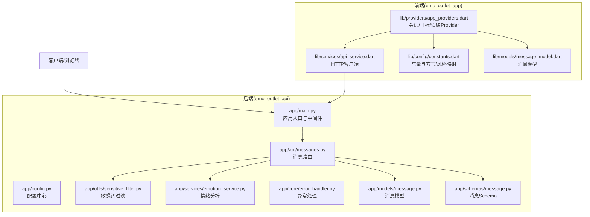
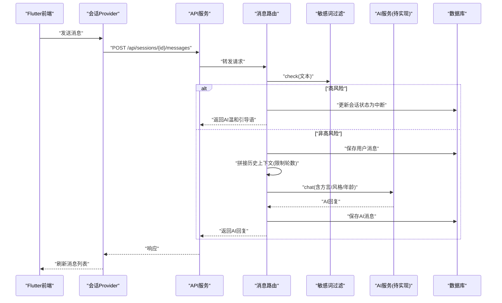
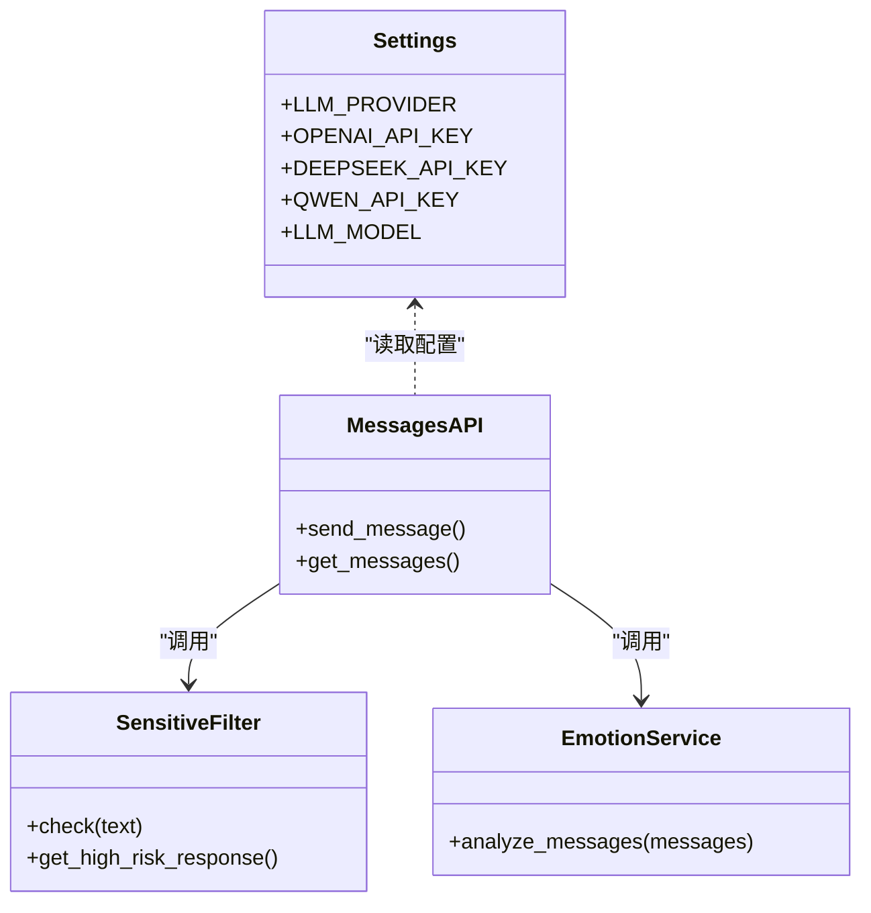
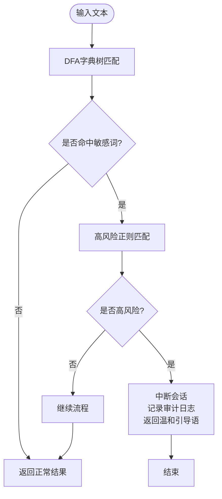
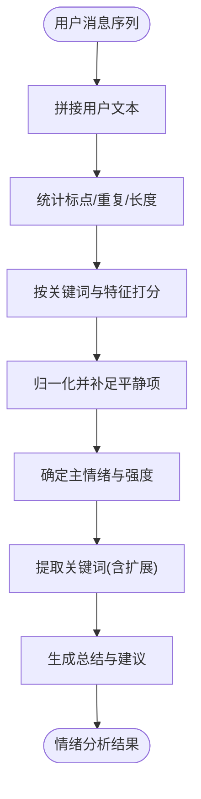
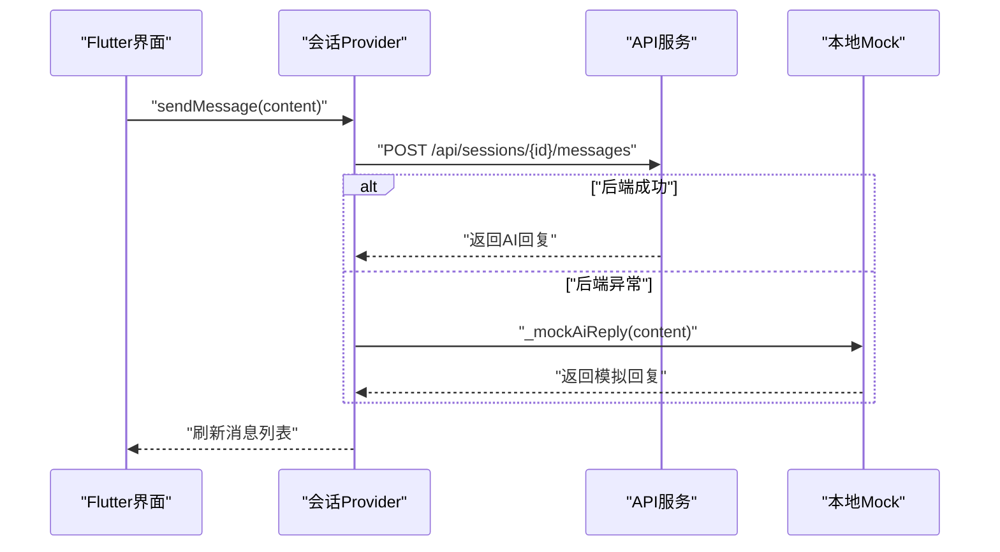
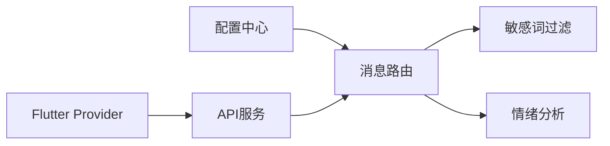

# AI集成与对话引擎

<cite>
**本文引用的文件**
- [emo_outlet_api/app/main.py](file://emo_outlet_api/app/main.py)
- [emo_outlet_api/app/config.py](file://emo_outlet_api/app/config.py)
- [emo_outlet_api/app/api/messages.py](file://emo_outlet_api/app/api/messages.py)
- [emo_outlet_api/app/utils/sensitive_filter.py](file://emo_outlet_api/app/utils/sensitive_filter.py)
- [emo_outlet_api/app/services/emotion_service.py](file://emo_outlet_api/app/services/emotion_service.py)
- [emo_outlet_api/app/models/message.py](file://emo_outlet_api/app/models/message.py)
- [emo_outlet_api/app/schemas/message.py](file://emo_outlet_api/app/schemas/message.py)
- [emo_outlet_api/app/core/error_handler.py](file://emo_outlet_api/app/core/error_handler.py)
- [emo_outlet_app/lib/providers/app_providers.dart](file://emo_outlet_app/lib/providers/app_providers.dart)
- [emo_outlet_app/lib/config/constants.dart](file://emo_outlet_app/lib/config/constants.dart)
- [emo_outlet_app/lib/models/message_model.dart](file://emo_outlet_app/lib/models/message_model.dart)
- [emo_outlet_app/lib/services/api_service.dart](file://emo_outlet_app/lib/services/api_service.dart)
</cite>

## 目录
1. [简介](#简介)
2. [项目结构](#项目结构)
3. [核心组件](#核心组件)
4. [架构总览](#架构总览)
5. [详细组件分析](#详细组件分析)
6. [依赖分析](#依赖分析)
7. [性能考量](#性能考量)
8. [故障排查指南](#故障排查指南)
9. [结论](#结论)
10. [附录](#附录)

## 简介
本技术文档聚焦Emo Outlet的AI集成与对话引擎，系统化阐述多AI提供商（OpenAI、DeepSeek、通义千问等）的集成架构、Prompt工程设计理念、敏感词过滤与高风险中断机制、情绪分析算法、质量控制（回复生成、上下文管理、会话连贯性与体验优化）、模型切换配置与性能调优策略，以及错误处理、重试与降级策略。文档同时给出面向前端Flutter应用的交互流程与Mock回退方案，帮助开发者快速理解并扩展系统能力。

## 项目结构
后端采用FastAPI，前端采用Flutter；AI相关逻辑主要集中在后端API层与工具模块中，前端通过API服务进行会话管理、消息收发与情绪分析结果展示。

图表来源
- [emo_outlet_api/app/main.py:1-82](file://emo_outlet_api/app/main.py#L1-L82)
- [emo_outlet_api/app/config.py:1-125](file://emo_outlet_api/app/config.py#L1-L125)
- [emo_outlet_api/app/api/messages.py:1-243](file://emo_outlet_api/app/api/messages.py#L1-L243)
- [emo_outlet_api/app/utils/sensitive_filter.py:1-142](file://emo_outlet_api/app/utils/sensitive_filter.py#L1-L142)
- [emo_outlet_api/app/services/emotion_service.py:1-181](file://emo_outlet_api/app/services/emotion_service.py#L1-L181)
- [emo_outlet_api/app/models/message.py:1-46](file://emo_outlet_api/app/models/message.py#L1-L46)
- [emo_outlet_api/app/schemas/message.py:1-39](file://emo_outlet_api/app/schemas/message.py#L1-L39)
- [emo_outlet_api/app/core/error_handler.py:1-59](file://emo_outlet_api/app/core/error_handler.py#L1-L59)
- [emo_outlet_app/lib/services/api_service.dart:134-178](file://emo_outlet_app/lib/services/api_service.dart#L134-L178)
- [emo_outlet_app/lib/providers/app_providers.dart:134-328](file://emo_outlet_app/lib/providers/app_providers.dart#L134-L328)
- [emo_outlet_app/lib/config/constants.dart:1-83](file://emo_outlet_app/lib/config/constants.dart#L1-L83)
- [emo_outlet_app/lib/models/message_model.dart:1-61](file://emo_outlet_app/lib/models/message_model.dart#L1-L61)

章节来源
- [emo_outlet_api/app/main.py:1-82](file://emo_outlet_api/app/main.py#L1-L82)
- [emo_outlet_api/app/config.py:1-125](file://emo_outlet_api/app/config.py#L1-L125)
- [emo_outlet_app/lib/providers/app_providers.dart:134-328](file://emo_outlet_app/lib/providers/app_providers.dart#L134-L328)

## 核心组件
- 多AI提供商适配：通过配置中心选择OpenAI、DeepSeek、通义千问或Mock模式，支持按需切换与灰度发布。
- 敏感词过滤与高风险中断：DFA字典树实现O(n)匹配，结合正则高风险模式，触发后自动中断会话并生成温和引导语。
- 情绪分析服务：基于关键词统计、标点与长度特征的评分体系，输出主情绪、强度、关键词与调节建议。
- 消息路由与质量控制：上下文截断、对话轮数上限、超时完成、审计日志与敏感标记。
- 前后端交互：Flutter Provider封装会话生命周期，后端API提供Mock回退，保障离线/异常场景可用性。

章节来源
- [emo_outlet_api/app/config.py:63-80](file://emo_outlet_api/app/config.py#L63-L80)
- [emo_outlet_api/app/utils/sensitive_filter.py:37-142](file://emo_outlet_api/app/utils/sensitive_filter.py#L37-L142)
- [emo_outlet_api/app/services/emotion_service.py:44-181](file://emo_outlet_api/app/services/emotion_service.py#L44-L181)
- [emo_outlet_api/app/api/messages.py:80-231](file://emo_outlet_api/app/api/messages.py#L80-L231)
- [emo_outlet_app/lib/providers/app_providers.dart:134-328](file://emo_outlet_app/lib/providers/app_providers.dart#L134-L328)

## 架构总览
后端以FastAPI为核心，注册异常处理器与CORS中间件，按模块挂载路由；消息路由负责敏感词检查、上下文拼接、调用AI服务生成回复，并持久化消息与会话状态。前端通过Provider驱动UI状态，API服务封装HTTP请求，遇到异常时回退到本地Mock逻辑。

图表来源
- [emo_outlet_api/app/api/messages.py:80-231](file://emo_outlet_api/app/api/messages.py#L80-L231)
- [emo_outlet_api/app/utils/sensitive_filter.py:102-138](file://emo_outlet_api/app/utils/sensitive_filter.py#L102-L138)
- [emo_outlet_app/lib/providers/app_providers.dart:233-271](file://emo_outlet_app/lib/providers/app_providers.dart#L233-L271)

## 详细组件分析

### 多AI提供商集成架构
- 配置项：LLM_PROVIDER、OPENAI_*、DEEPSEEK_*、QWEN_*等，支持OpenAI、DeepSeek、通义千问与Mock模式。
- 切换策略：通过环境变量或配置中心动态切换，便于灰度与A/B测试。
- 适配要点：统一对外接口（如chat/history/dialect/age_range），屏蔽底层差异。

图表来源
- [emo_outlet_api/app/config.py:63-80](file://emo_outlet_api/app/config.py#L63-L80)
- [emo_outlet_api/app/api/messages.py:80-231](file://emo_outlet_api/app/api/messages.py#L80-L231)
- [emo_outlet_api/app/utils/sensitive_filter.py:102-138](file://emo_outlet_api/app/utils/sensitive_filter.py#L102-L138)
- [emo_outlet_api/app/services/emotion_service.py:44-181](file://emo_outlet_api/app/services/emotion_service.py#L44-L181)

章节来源
- [emo_outlet_api/app/config.py:63-80](file://emo_outlet_api/app/config.py#L63-L80)
- [emo_outlet_api/app/api/messages.py:200-209](file://emo_outlet_api/app/api/messages.py#L200-L209)

### 敏感词过滤与高风险中断机制
- DFA字典树：构建敏感词Trie树，实现O(n)线性扫描，支持最长匹配与跳过已匹配片段。
- 高风险正则：预设高风险模式（如自残、暴力倾向等），命中即触发中断。
- 中断行为：会话状态置为中断、记录审计日志、返回温和引导语，避免二次伤害。
- 文本过滤：支持批量替换敏感词为掩码字符，便于合规与审计。

图表来源
- [emo_outlet_api/app/utils/sensitive_filter.py:74-138](file://emo_outlet_api/app/utils/sensitive_filter.py#L74-L138)
- [emo_outlet_api/app/api/messages.py:102-133](file://emo_outlet_api/app/api/messages.py#L102-L133)

章节来源
- [emo_outlet_api/app/utils/sensitive_filter.py:37-142](file://emo_outlet_api/app/utils/sensitive_filter.py#L37-L142)
- [emo_outlet_api/app/api/messages.py:102-133](file://emo_outlet_api/app/api/messages.py#L102-L133)

### 情绪分析算法
- 关键词识别：针对愤怒、委屈、焦虑、疲惫、无奈、平静六类情绪建立关键词表，按出现频次加权。
- 特征提取：统计标点（感叹号、问号）、重复字符、文本长度等，作为情绪强度的辅助特征。
- 归一化评分：计算各类情绪得分并归一化，输出主情绪与强度。
- 关键词扩展：对主情绪关键词集合外的高频子串进行提取，补充关键词列表。
- 总结与建议：根据主情绪与强度生成总结文案与调节建议，兼顾共情与实用性。

图表来源
- [emo_outlet_api/app/services/emotion_service.py:44-181](file://emo_outlet_api/app/services/emotion_service.py#L44-L181)

章节来源
- [emo_outlet_api/app/services/emotion_service.py:8-181](file://emo_outlet_api/app/services/emotion_service.py#L8-L181)

### Prompt工程与方言/风格适配
- 方言映射：前端将“普通话/粤语/四川话/东北话/上海话”映射为后端代码，后端在调用AI服务时传入dialect参数，便于模型按方言风格生成回复。
- 对话风格：支持“嘴硬型/道歉型/冷漠型/阴阳型/理性型”，通过chat_style参数传递，增强角色一致性与个性化体验。
- 年龄适配：根据用户年龄区间调整对话轮数上限与安全策略，体现合规与保护。

章节来源
- [emo_outlet_app/lib/config/constants.dart:15-45](file://emo_outlet_app/lib/config/constants.dart#L15-L45)
- [emo_outlet_api/app/api/messages.py:164-169](file://emo_outlet_api/app/api/messages.py#L164-L169)

### 上下文管理与会话连贯性
- 历史截断：每次请求仅取最近N条非system消息作为上下文，平衡记忆长度与性能。
- 轮数控制：根据年龄区间设定最大对话轮数，达到上限自动结束会话并提示新会话。
- 超时控制：基于会话起始时间与持续时长判断是否超时，超时自动完成。
- 审计日志：对敏感输入与高风险事件记录审计日志，支持采样与合规追踪。

章节来源
- [emo_outlet_api/app/api/messages.py:149-175](file://emo_outlet_api/app/api/messages.py#L149-L175)
- [emo_outlet_api/app/api/messages.py:223-230](file://emo_outlet_api/app/api/messages.py#L223-L230)
- [emo_outlet_api/app/api/messages.py:187-199](file://emo_outlet_api/app/api/messages.py#L187-L199)

### 前后端交互与Mock回退
- Flutter Provider：封装会话创建、消息发送、倒计时与结束逻辑；发送消息时优先调用后端，失败则回退到本地模拟AI回复。
- API服务：统一封装HTTP请求，包含分页查询会话、创建会话、发送消息、生成海报等接口。
- 常量与映射：方言与聊天风格的双向映射，保证前后端一致。

图表来源
- [emo_outlet_app/lib/providers/app_providers.dart:233-271](file://emo_outlet_app/lib/providers/app_providers.dart#L233-L271)
- [emo_outlet_app/lib/services/api_service.dart:134-178](file://emo_outlet_app/lib/services/api_service.dart#L134-L178)

章节来源
- [emo_outlet_app/lib/providers/app_providers.dart:134-328](file://emo_outlet_app/lib/providers/app_providers.dart#L134-L328)
- [emo_outlet_app/lib/services/api_service.dart:134-178](file://emo_outlet_app/lib/services/api_service.dart#L134-L178)

## 依赖分析
- 组件耦合：消息路由依赖敏感词过滤与情绪分析；前端Provider依赖API服务；配置中心贯穿两端。
- 外部依赖：FastAPI、SQLAlchemy、Pydantic、DIO等；AI服务接口待实现。
- 潜在循环：当前模块间无循环导入；建议后续引入AI服务抽象层，避免直接耦合具体提供商SDK。

图表来源
- [emo_outlet_api/app/config.py:63-80](file://emo_outlet_api/app/config.py#L63-L80)
- [emo_outlet_api/app/api/messages.py:80-231](file://emo_outlet_api/app/api/messages.py#L80-L231)
- [emo_outlet_app/lib/providers/app_providers.dart:134-328](file://emo_outlet_app/lib/providers/app_providers.dart#L134-L328)

章节来源
- [emo_outlet_api/app/config.py:63-80](file://emo_outlet_api/app/config.py#L63-L80)
- [emo_outlet_api/app/api/messages.py:80-231](file://emo_outlet_api/app/api/messages.py#L80-L231)
- [emo_outlet_app/lib/providers/app_providers.dart:134-328](file://emo_outlet_app/lib/providers/app_providers.dart#L134-L328)

## 性能考量
- 敏感词匹配：DFA字典树O(n)线性扫描，避免正则多次匹配带来的指数开销；建议将敏感词库持久化并缓存Trie根节点。
- 上下文截断：限制历史消息数量与字符长度，降低LLM输入成本；可根据模型上下文窗口动态调整。
- 并发与连接池：后端使用异步数据库连接与中间件日志，建议配合限流与熔断策略。
- 前端渲染：Provider局部通知与消息列表虚拟化，减少UI重绘；Mock回退降低网络抖动影响。
- 模型切换：通过配置中心快速切换，建议在网关层增加权重与延迟指标，支撑A/B与灰度发布。

## 故障排查指南
- 全局异常处理：未捕获异常统一返回500与标准错误结构，便于前端统一提示。
- HTTP与参数异常：HTTP异常与参数校验异常分别返回对应状态码与错误详情。
- 敏感词误判：检查敏感词库与高风险正则，必要时扩大或收敛匹配范围；记录误判样本用于迭代。
- 会话中断：确认高风险模式命中条件与审计日志；检查方言/风格参数是否正确传递。
- 前端无法连接后端：确认API地址、超时配置与CORS设置；观察Provider的Mock回退是否生效。

章节来源
- [emo_outlet_api/app/core/error_handler.py:10-59](file://emo_outlet_api/app/core/error_handler.py#L10-L59)
- [emo_outlet_api/app/api/messages.py:102-133](file://emo_outlet_api/app/api/messages.py#L102-L133)
- [emo_outlet_app/lib/providers/app_providers.dart:233-271](file://emo_outlet_app/lib/providers/app_providers.dart#L233-L271)

## 结论
本系统以配置为中心的多AI提供商架构、DFA+正则的敏感词过滤、基于关键词与特征的情绪分析、完善的上下文与会话控制，以及前后端的Mock回退机制，共同构成了稳定、可扩展且具备安全合规能力的AI对话引擎。建议后续完善AI服务抽象层、接入监控与A/B指标、持续优化敏感词库与Prompt模板，以提升回复质量与用户体验。

## 附录

### AI模型切换与配置方法
- 切换提供商：修改LLM_PROVIDER为openai/deepseek/qwen/mock。
- 基础URL与密钥：OPENAI_BASE_URL/API_KEY、DEEPSEEK_BASE_URL/API_KEY、QWEN_BASE_URL/API_KEY。
- 默认模型：LLM_MODEL、IMAGE_MODEL、IMAGE_SIZE。
- 使用建议：生产环境务必设置有效密钥与合规域名；通过环境变量或配置中心集中管理。

章节来源
- [emo_outlet_api/app/config.py:63-80](file://emo_outlet_api/app/config.py#L63-L80)

### 错误处理、重试与降级策略
- 错误处理：全局异常处理器统一返回；HTTP与参数异常分别处理。
- 重试机制：建议在API服务层对瞬时网络错误进行指数退避重试。
- 降级策略：后端异常时返回温和引导语；前端异常时启用本地Mock回复，保证基本可用。

章节来源
- [emo_outlet_api/app/core/error_handler.py:10-59](file://emo_outlet_api/app/core/error_handler.py#L10-L59)
- [emo_outlet_app/lib/providers/app_providers.dart:261-270](file://emo_outlet_app/lib/providers/app_providers.dart#L261-L270)