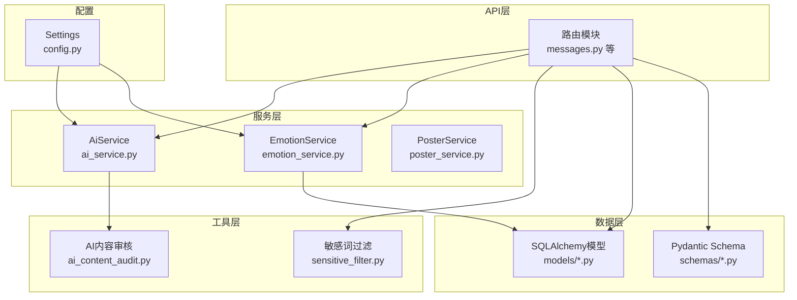
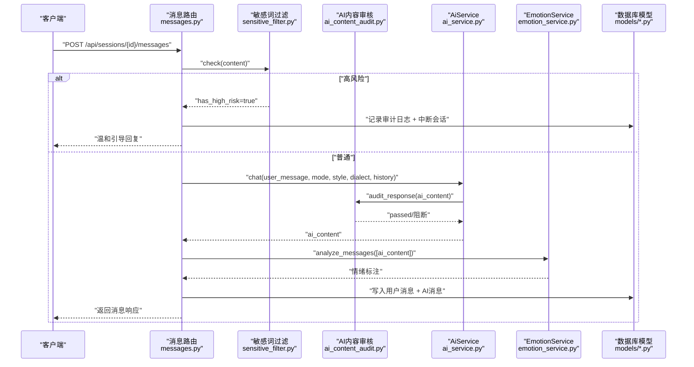
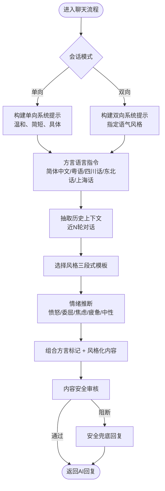
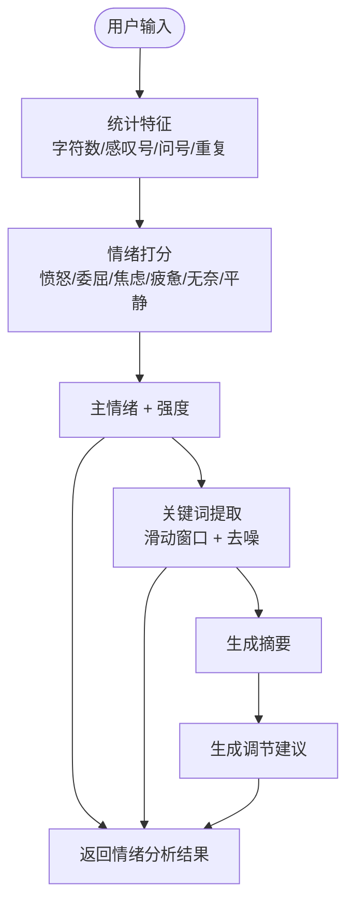
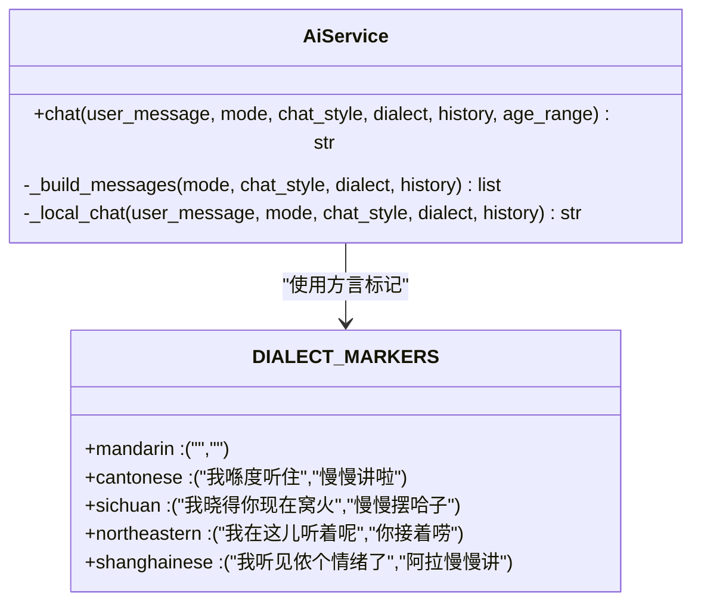
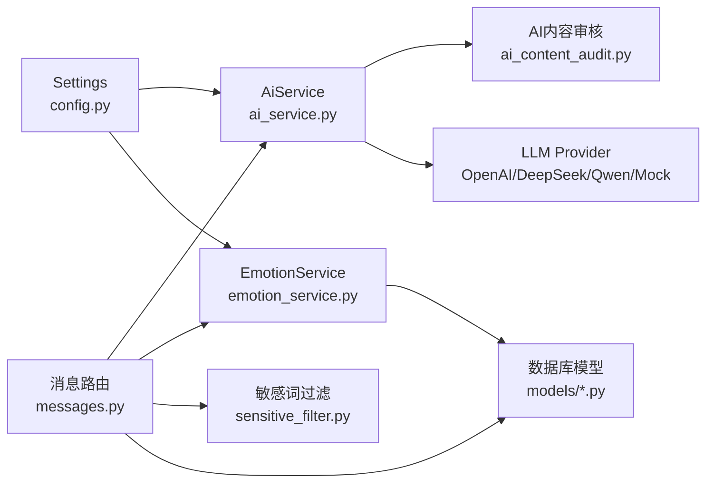

# Prompt工程与对话设计

<cite>
**本文引用的文件**
- [emo_outlet_api/app/main.py](file://emo_outlet_api/app/main.py)
- [emo_outlet_api/app/api/messages.py](file://emo_outlet_api/app/api/messages.py)
- [emo_outlet_api/app/services/ai_service.py](file://emo_outlet_api/app/services/ai_service.py)
- [emo_outlet_api/app/services/emotion_service.py](file://emo_outlet_api/app/services/emotion_service.py)
- [emo_outlet_api/app/utils/sensitive_filter.py](file://emo_outlet_api/app/utils/sensitive_filter.py)
- [emo_outlet_api/app/utils/ai_content_audit.py](file://emo_outlet_api/app/utils/ai_content_audit.py)
- [emo_outlet_api/app/models/message.py](file://emo_outlet_api/app/models/message.py)
- [emo_outlet_api/app/models/session.py](file://emo_outlet_api/app/models/session.py)
- [emo_outlet_api/app/schemas/message.py](file://emo_outlet_api/app/schemas/message.py)
- [emo_outlet_api/app/schemas/session.py](file://emo_outlet_api/app/schemas/session.py)
- [emo_outlet_api/app/schemas/poster.py](file://emo_outlet_api/app/schemas/poster.py)
- [emo_outlet_api/app/services/poster_service.py](file://emo_outlet_api/app/services/poster_service.py)
- [emo_outlet_api/app/config.py](file://emo_outlet_api/app/config.py)
- [README.md](file://README.md)
</cite>

## 目录
1. [简介](#简介)
2. [项目结构](#项目结构)
3. [核心组件](#核心组件)
4. [架构总览](#架构总览)
5. [详细组件分析](#详细组件分析)
6. [依赖分析](#依赖分析)
7. [性能考虑](#性能考虑)
8. [故障排查指南](#故障排查指南)
9. [结论](#结论)
10. [附录](#附录)

## 简介
本技术文档聚焦Emo Outlet的Prompt工程与对话设计，围绕以下目标展开：
- 对话引导Prompt的设计理念：构建安全、温和、有同理心的对话环境
- 情感调节Prompt的编写技巧：引导用户表达负面情绪并提供积极的调节建议
- 方言转换Prompt的实现机制：普通话、粤语、四川话、东北话、上海话的转换规则与语境适配
- 会话连贯性保持策略：上下文记忆、主题延续与情感一致性维护
- Prompt模板的版本管理与A/B测试方法
- 对话质量评估指标与用户反馈收集机制

## 项目结构
后端采用FastAPI + SQLAlchemy架构，核心模块包括：
- API路由层：负责会话、消息、海报等业务接口
- 服务层：AI对话服务、情绪分析服务、海报生成服务
- 工具层：敏感词过滤、AI内容安全审核
- 模型与Schema：数据库模型与请求/响应数据结构
- 配置层：统一的运行参数与合规配置



图表来源
- [emo_outlet_api/app/api/messages.py:1-208](file://emo_outlet_api/app/api/messages.py#L1-L208)
- [emo_outlet_api/app/services/ai_service.py:1-354](file://emo_outlet_api/app/services/ai_service.py#L1-L354)
- [emo_outlet_api/app/services/emotion_service.py:1-181](file://emo_outlet_api/app/services/emotion_service.py#L1-L181)
- [emo_outlet_api/app/utils/sensitive_filter.py:1-142](file://emo_outlet_api/app/utils/sensitive_filter.py#L1-L142)
- [emo_outlet_api/app/utils/ai_content_audit.py:1-119](file://emo_outlet_api/app/utils/ai_content_audit.py#L1-L119)
- [emo_outlet_api/app/models/message.py:1-46](file://emo_outlet_api/app/models/message.py#L1-L46)
- [emo_outlet_api/app/models/session.py:1-79](file://emo_outlet_api/app/models/session.py#L1-L79)
- [emo_outlet_api/app/schemas/message.py:1-33](file://emo_outlet_api/app/schemas/message.py#L1-L33)
- [emo_outlet_api/app/schemas/session.py:1-49](file://emo_outlet_api/app/schemas/session.py#L1-L49)
- [emo_outlet_api/app/config.py:1-125](file://emo_outlet_api/app/config.py#L1-L125)

章节来源
- [README.md:58-84](file://README.md#L58-L84)
- [emo_outlet_api/app/main.py:1-82](file://emo_outlet_api/app/main.py#L1-L82)

## 核心组件
- AI对话服务（AiService）：负责根据会话模式、对话风格、方言与历史上下文生成温和且安全的回复；内置Mock模式与多Provider适配；提供青少年专属对话逻辑。
- 情绪分析服务（EmotionService）：基于关键词与统计特征提取情绪主标签、强度、关键词，并生成摘要与调节建议。
- 敏感词过滤（DFA+正则）：快速匹配敏感词与高风险模式，支持温和中断与审计日志。
- AI内容安全审核：对LLM输出进行二次安全校验，拦截暴力、自伤、违法等高风险内容。
- 会话与消息模型：承载会话配置（模式、风格、方言、时长）、消息内容与情绪标注。
- 海报生成服务：将情绪分析结果渲染为可视化海报。

章节来源
- [emo_outlet_api/app/services/ai_service.py:62-286](file://emo_outlet_api/app/services/ai_service.py#L62-L286)
- [emo_outlet_api/app/services/emotion_service.py:44-181](file://emo_outlet_api/app/services/emotion_service.py#L44-L181)
- [emo_outlet_api/app/utils/sensitive_filter.py:37-142](file://emo_outlet_api/app/utils/sensitive_filter.py#L37-L142)
- [emo_outlet_api/app/utils/ai_content_audit.py:52-119](file://emo_outlet_api/app/utils/ai_content_audit.py#L52-L119)
- [emo_outlet_api/app/models/session.py:13-79](file://emo_outlet_api/app/models/session.py#L13-L79)
- [emo_outlet_api/app/models/message.py:13-46](file://emo_outlet_api/app/models/message.py#L13-L46)
- [emo_outlet_api/app/services/poster_service.py:66-221](file://emo_outlet_api/app/services/poster_service.py#L66-L221)

## 架构总览
Emo Outlet的Prompt工程贯穿消息发送流程：用户输入经敏感词过滤与高风险检测后进入AI对话服务；AI根据会话配置与历史上下文生成回复；情绪分析服务对用户与AI回复进行情绪标注；最终将消息持久化并返回。



图表来源
- [emo_outlet_api/app/api/messages.py:61-187](file://emo_outlet_api/app/api/messages.py#L61-L187)
- [emo_outlet_api/app/utils/sensitive_filter.py:102-139](file://emo_outlet_api/app/utils/sensitive_filter.py#L102-L139)
- [emo_outlet_api/app/utils/ai_content_audit.py:64-104](file://emo_outlet_api/app/utils/ai_content_audit.py#L64-L104)
- [emo_outlet_api/app/services/ai_service.py:98-134](file://emo_outlet_api/app/services/ai_service.py#L98-L134)
- [emo_outlet_api/app/services/emotion_service.py:44-71](file://emo_outlet_api/app/services/emotion_service.py#L44-L71)
- [emo_outlet_api/app/models/message.py:13-46](file://emo_outlet_api/app/models/message.py#L13-L46)

## 详细组件分析

### 对话引导Prompt设计与实现
- 系统提示词（System Prompt）：在单向模式下强调“只做倾听、接纳、安抚，不反击，不升级冲突”，在双向模式下要求“保持特定语气风格，但绝不辱骂、威胁、鼓励现实伤害”。
- 方言适配：通过方言标记前缀/后缀与语言指令（如“使用简体中文/粤语/四川话/东北话/上海话”）实现自然语境切换。
- 风格化引导：基于预设风格（嘴硬但克制、柔和道歉、冷静疏离、轻微讽刺、理性分析）生成“引子-桥段-尾声”的三段式回复，确保情感承接与共情表达。
- 历史连贯性：从历史消息中提取用户发言轮次，生成“你已经憋了好一会儿/我记得你前面也提过这点”的提示，增强主题延续与情感一致性。



图表来源
- [emo_outlet_api/app/services/ai_service.py:220-256](file://emo_outlet_api/app/services/ai_service.py#L220-L256)
- [emo_outlet_api/app/services/ai_service.py:186-218](file://emo_outlet_api/app/services/ai_service.py#L186-L218)
- [emo_outlet_api/app/services/ai_service.py:258-286](file://emo_outlet_api/app/services/ai_service.py#L258-L286)
- [emo_outlet_api/app/utils/ai_content_audit.py:64-104](file://emo_outlet_api/app/utils/ai_content_audit.py#L64-L104)

章节来源
- [emo_outlet_api/app/services/ai_service.py:13-47](file://emo_outlet_api/app/services/ai_service.py#L13-L47)
- [emo_outlet_api/app/services/ai_service.py:220-256](file://emo_outlet_api/app/services/ai_service.py#L220-L256)
- [emo_outlet_api/app/services/ai_service.py:186-218](file://emo_outlet_api/app/services/ai_service.py#L186-L218)
- [emo_outlet_api/app/services/ai_service.py:258-286](file://emo_outlet_api/app/services/ai_service.py#L258-L286)

### 情感调节Prompt编写技巧
- 情绪推断：通过高频词集合对用户输入进行快速情绪打分，优先选择最高分情绪作为主标签。
- 摘要与建议：针对不同情绪生成“我接住了/听起来你一直绷着/你像是已经撑了很久”等共情式摘要，并给出可执行的调节建议（如“先离开让你上火的场景5分钟”“把担心拆成可行动和不可行动两列”）。
- 强度与关键词：结合标点、长度、重复字符等统计特征计算强度，提取高频关键词辅助可视化与海报生成。



图表来源
- [emo_outlet_api/app/services/emotion_service.py:83-121](file://emo_outlet_api/app/services/emotion_service.py#L83-L121)
- [emo_outlet_api/app/services/emotion_service.py:122-148](file://emo_outlet_api/app/services/emotion_service.py#L122-L148)
- [emo_outlet_api/app/services/emotion_service.py:150-177](file://emo_outlet_api/app/services/emotion_service.py#L150-L177)

章节来源
- [emo_outlet_api/app/services/emotion_service.py:44-181](file://emo_outlet_api/app/services/emotion_service.py#L44-L181)
- [emo_outlet_api/app/schemas/poster.py:8-15](file://emo_outlet_api/app/schemas/poster.py#L8-L15)

### 方言转换Prompt机制
- 方言标记：为每种方言定义前后缀（如“我喺度听住…慢慢讲啦”“我晓得你现在窝火…慢慢摆哈子”），在回复拼接时自动加入，形成自然的方言口吻。
- 语言指令：系统提示词中包含“使用简体中文/粤语/四川话/东北话/上海话”等指令，确保LLM输出符合方言语感。
- 适配策略：方言标记与语言指令共同作用，既保证口音特征，又维持内容安全与可读性。



图表来源
- [emo_outlet_api/app/services/ai_service.py:41-47](file://emo_outlet_api/app/services/ai_service.py#L41-L47)
- [emo_outlet_api/app/services/ai_service.py:220-256](file://emo_outlet_api/app/services/ai_service.py#L220-L256)
- [emo_outlet_api/app/services/ai_service.py:161-184](file://emo_outlet_api/app/services/ai_service.py#L161-L184)

章节来源
- [emo_outlet_api/app/services/ai_service.py:41-47](file://emo_outlet_api/app/services/ai_service.py#L41-L47)
- [emo_outlet_api/app/services/ai_service.py:228-234](file://emo_outlet_api/app/services/ai_service.py#L228-L234)

### 会话连贯性保持策略
- 历史截取：最多取最近10轮对话作为上下文，避免过长历史影响响应质量。
- 主题延续：根据用户发言轮次生成“你已经憋了好一会儿/我记得你前面也提过这点”的提示，强化主题一致性。
- 情感一致性：通过情绪推断与摘要生成，确保AI回复与用户当前情绪状态相契合。

```mermaid
flowchart TD
H(["历史消息"]) --> Slice["截取最近N轮"]
Slice --> Count["统计用户发言轮次"]
Count --> Hint{"轮次阈值"}
Hint --> |>=4| Long["你已经憋了好一会儿"]
Hint --> |>=2| Mid["我记得你前面也提过这点"]
Hint --> |<2| Short[""]
Long --> Merge["合并到回复"]
Mid --> Merge
Short --> Merge
Merge --> Out(["连贯回复"])
```

图表来源
- [emo_outlet_api/app/services/ai_service.py:251-256](file://emo_outlet_api/app/services/ai_service.py#L251-L256)
- [emo_outlet_api/app/services/ai_service.py:277-285](file://emo_outlet_api/app/services/ai_service.py#L277-L285)

章节来源
- [emo_outlet_api/app/services/ai_service.py:277-286](file://emo_outlet_api/app/services/ai_service.py#L277-L286)

### Prompt模板版本管理与A/B测试
- 版本管理建议：将系统提示词、风格模板、方言标记与兜底回复集中管理，以字典或配置文件形式存储，按版本号命名与回滚。
- A/B测试方法：对同一用户群随机分配不同Prompt版本（如不同风格或方言组合），采集关键指标（对话轮数、用户停留时长、情绪强度变化、满意度评分）进行对比评估。
- 审计与监控：启用审计日志采样率，记录高风险拦截与兜底触发事件，持续优化Prompt鲁棒性。

章节来源
- [emo_outlet_api/app/config.py:108-111](file://emo_outlet_api/app/config.py#L108-L111)
- [emo_outlet_api/app/utils/ai_content_audit.py:64-104](file://emo_outlet_api/app/utils/ai_content_audit.py#L64-L104)

### 对话质量评估与用户反馈
- 评估指标建议：会话轮数上限、平均情绪强度、关键词覆盖率、用户停留时长、AI回复通过率、高风险拦截率、兜底触发率。
- 用户反馈：在会话结束时提供简短满意度问卷（如“今天的对话对你有帮助吗？”），并支持举报/反馈入口，结合审计日志进行人工复核。

章节来源
- [emo_outlet_api/app/api/messages.py:138-155](file://emo_outlet_api/app/api/messages.py#L138-L155)
- [emo_outlet_api/app/models/compliance.py:31-50](file://emo_outlet_api/app/models/compliance.py#L31-L50)

## 依赖分析
- 组件耦合：消息路由依赖AI服务与情绪服务；AI服务依赖内容安全审核；敏感词过滤与内容审核共同保障安全边界。
- 外部依赖：OpenAI/DeepSeek/Qwen等LLM Provider与Mock模式；MySQL/SQLite数据库；Redis（配置中存在）。
- 风险点：LLM调用异常或返回为空时回退至本地模拟回复；高风险输出需触发兜底回复并记录审计日志。



图表来源
- [emo_outlet_api/app/api/messages.py:17-18](file://emo_outlet_api/app/api/messages.py#L17-L18)
- [emo_outlet_api/app/services/ai_service.py:67-96](file://emo_outlet_api/app/services/ai_service.py#L67-L96)
- [emo_outlet_api/app/utils/ai_content_audit.py:52-119](file://emo_outlet_api/app/utils/ai_content_audit.py#L52-L119)
- [emo_outlet_api/app/config.py:63-80](file://emo_outlet_api/app/config.py#L63-L80)

章节来源
- [emo_outlet_api/app/api/messages.py:1-208](file://emo_outlet_api/app/api/messages.py#L1-L208)
- [emo_outlet_api/app/services/ai_service.py:1-354](file://emo_outlet_api/app/services/ai_service.py#L1-L354)
- [emo_outlet_api/app/utils/ai_content_audit.py:1-119](file://emo_outlet_api/app/utils/ai_content_audit.py#L1-L119)
- [emo_outlet_api/app/config.py:1-125](file://emo_outlet_api/app/config.py#L1-L125)

## 性能考虑
- LLM调用：限制max_tokens与temperature，避免过长输出；在Provider不可用或异常时快速回退至本地模拟回复。
- 上下文截断：仅保留最近N轮对话，降低Token消耗与延迟。
- 敏感词过滤：DFA Trie树实现O(n)匹配，配合正则高风险模式，兼顾效率与覆盖度。
- 数据库写入：批量flush/refresh控制与序列号生成，避免并发写入冲突。

## 故障排查指南
- 高风险触发：当检测到自伤/他伤意图时，系统会中断会话并返回温和引导回复；可在审计日志中查看触发关键词与动作记录。
- 内容安全拦截：若AI输出被判定为可疑或阻断，将返回安全兜底回复；建议检查FORBIDDEN模式与精确匹配词库。
- Mock模式：当未配置有效API Key或Provider异常时，系统自动进入Mock模式，使用内置模板生成回复。

章节来源
- [emo_outlet_api/app/utils/sensitive_filter.py:102-139](file://emo_outlet_api/app/utils/sensitive_filter.py#L102-L139)
- [emo_outlet_api/app/utils/ai_content_audit.py:64-104](file://emo_outlet_api/app/utils/ai_content_audit.py#L64-L104)
- [emo_outlet_api/app/services/ai_service.py:110-134](file://emo_outlet_api/app/services/ai_service.py#L110-L134)

## 结论
Emo Outlet通过系统化的Prompt工程与安全机制，实现了温和、连贯且可扩展的对话体验。AI服务的风格化与方言适配、情绪分析的关键词与强度标注、以及敏感词过滤与内容安全审核，共同构成了安全、有效、可持续的对话基础设施。建议在后续迭代中完善Prompt模板的版本化管理与A/B测试体系，持续优化对话质量与用户体验。

## 附录
- 会话与消息模型字段说明：会话包含模式、风格、方言、时长、状态与情绪总结；消息包含内容、发送方、方言、情绪类型与强度、敏感词标记与序列号。
- 海报生成：将情绪分析结果映射为标题、副标题、标签、强调色与摘要文案，支持HTML与SVG两种输出格式。

章节来源
- [emo_outlet_api/app/models/session.py:13-79](file://emo_outlet_api/app/models/session.py#L13-L79)
- [emo_outlet_api/app/models/message.py:13-46](file://emo_outlet_api/app/models/message.py#L13-L46)
- [emo_outlet_api/app/schemas/poster.py:21-47](file://emo_outlet_api/app/schemas/poster.py#L21-L47)
- [emo_outlet_api/app/services/poster_service.py:66-221](file://emo_outlet_api/app/services/poster_service.py#L66-L221)