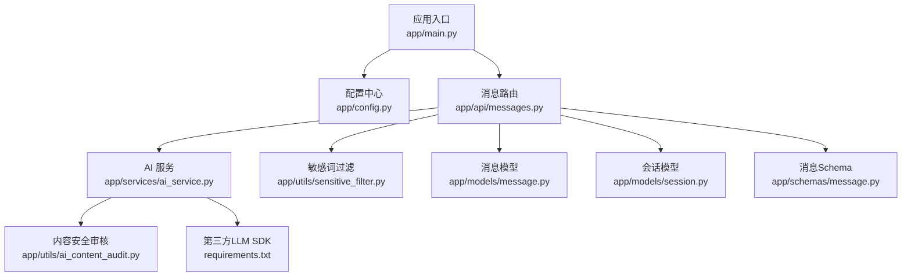
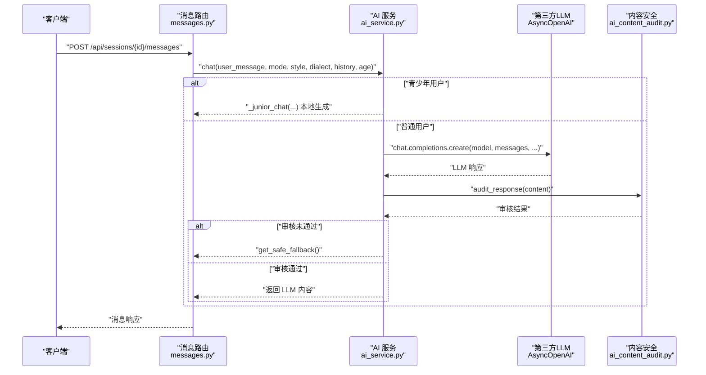
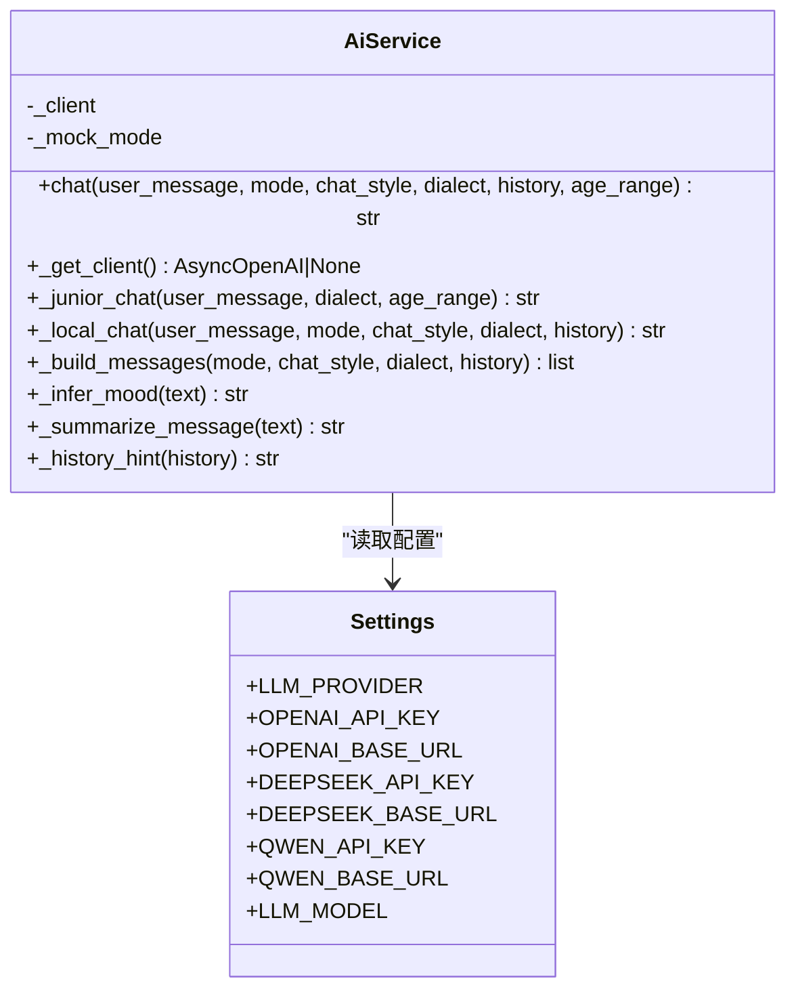
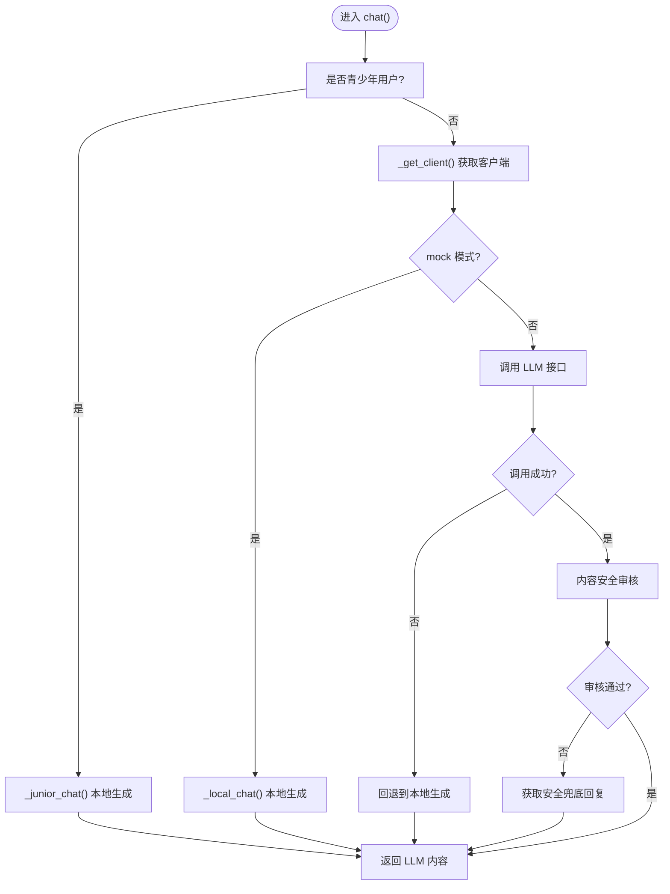
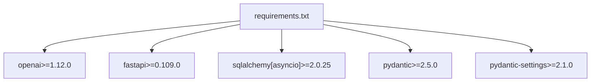

# 多AI模型支持架构

<cite>
**本文引用的文件**
- [emo_outlet_api/app/main.py](file://emo_outlet_api/app/main.py)
- [emo_outlet_api/app/config.py](file://emo_outlet_api/app/config.py)
- [emo_outlet_api/app/services/ai_service.py](file://emo_outlet_api/app/services/ai_service.py)
- [emo_outlet_api/app/api/messages.py](file://emo_outlet_api/app/api/messages.py)
- [emo_outlet_api/app/utils/ai_content_audit.py](file://emo_outlet_api/app/utils/ai_content_audit.py)
- [emo_outlet_api/app/utils/sensitive_filter.py](file://emo_outlet_api/app/utils/sensitive_filter.py)
- [emo_outlet_api/app/models/message.py](file://emo_outlet_api/app/models/message.py)
- [emo_outlet_api/app/models/session.py](file://emo_outlet_api/app/models/session.py)
- [emo_outlet_api/app/schemas/message.py](file://emo_outlet_api/app/schemas/message.py)
- [emo_outlet_api/requirements.txt](file://emo_outlet_api/requirements.txt)
</cite>

## 目录
1. [引言](#引言)
2. [项目结构](#项目结构)
3. [核心组件](#核心组件)
4. [架构总览](#架构总览)
5. [详细组件分析](#详细组件分析)
6. [依赖分析](#依赖分析)
7. [性能考量](#性能考量)
8. [故障排查指南](#故障排查指南)
9. [结论](#结论)
10. [附录](#附录)

## 引言
本技术文档围绕 Emo Outlet 的多 AI 模型支持架构展开，目标是为 OpenAI、DeepSeek、通义千问等多家 AI 提供商提供统一接口与运行时选择策略，并在现有代码基础上补充工厂模式、负载均衡与故障转移的实现思路。文档同时梳理模型配置参数管理、动态切换、错误处理与降级策略，以及性能监控指标建议，帮助在保证系统稳定性的同时，兼顾响应速度、准确性与成本的平衡。

## 项目结构
后端采用 FastAPI 框架，核心模块包括：
- 应用入口与生命周期管理
- 配置中心（含多提供商参数）
- AI 服务封装（统一聊天接口与本地降级）
- 消息与会话模型、Schema
- 内容安全与敏感词过滤
- API 控制器（消息发送流程）

图表来源
- [emo_outlet_api/app/main.py:1-82](file://emo_outlet_api/app/main.py#L1-L82)
- [emo_outlet_api/app/config.py:1-125](file://emo_outlet_api/app/config.py#L1-L125)
- [emo_outlet_api/app/services/ai_service.py:1-354](file://emo_outlet_api/app/services/ai_service.py#L1-L354)
- [emo_outlet_api/app/api/messages.py:1-208](file://emo_outlet_api/app/api/messages.py#L1-L208)
- [emo_outlet_api/app/utils/ai_content_audit.py:1-119](file://emo_outlet_api/app/utils/ai_content_audit.py#L1-L119)
- [emo_outlet_api/app/utils/sensitive_filter.py:1-142](file://emo_outlet_api/app/utils/sensitive_filter.py#L1-L142)
- [emo_outlet_api/app/models/message.py:1-46](file://emo_outlet_api/app/models/message.py#L1-L46)
- [emo_outlet_api/app/models/session.py:1-79](file://emo_outlet_api/app/models/session.py#L1-L79)
- [emo_outlet_api/app/schemas/message.py:1-33](file://emo_outlet_api/app/schemas/message.py#L1-L33)
- [emo_outlet_api/requirements.txt:1-29](file://emo_outlet_api/requirements.txt#L1-L29)

章节来源
- [emo_outlet_api/app/main.py:1-82](file://emo_outlet_api/app/main.py#L1-L82)
- [emo_outlet_api/app/config.py:1-125](file://emo_outlet_api/app/config.py#L1-L125)

## 核心组件
- 应用入口与中间件：注册 CORS、异常处理器、请求日志中间件；挂载各业务路由。
- 配置中心：集中管理数据库、Redis、JWT、AI 提供商与模型、ASR/TTS、合规与安全阈值等。
- AI 服务：统一 chat 接口，内置本地降级逻辑；按年龄分群采用青少年友好策略；支持方言与风格提示注入。
- 内容安全：对 LLM 输出进行模式匹配与精确词检测，触发拦截与兜底回复。
- 敏感词过滤：基于 DFA 的 O(n) 匹配，结合高风险正则，支持温和中断与审计日志。
- 消息与会话：持久化消息与会话状态，支持会话时长、轮数限制与状态机。

章节来源
- [emo_outlet_api/app/main.py:1-82](file://emo_outlet_api/app/main.py#L1-L82)
- [emo_outlet_api/app/config.py:63-80](file://emo_outlet_api/app/config.py#L63-L80)
- [emo_outlet_api/app/services/ai_service.py:62-134](file://emo_outlet_api/app/services/ai_service.py#L62-L134)
- [emo_outlet_api/app/utils/ai_content_audit.py:52-99](file://emo_outlet_api/app/utils/ai_content_audit.py#L52-L99)
- [emo_outlet_api/app/utils/sensitive_filter.py:37-119](file://emo_outlet_api/app/utils/sensitive_filter.py#L37-L119)
- [emo_outlet_api/app/models/message.py:13-46](file://emo_outlet_api/app/models/message.py#L13-L46)
- [emo_outlet_api/app/models/session.py:13-79](file://emo_outlet_api/app/models/session.py#L13-L79)
- [emo_outlet_api/app/schemas/message.py:8-33](file://emo_outlet_api/app/schemas/message.py#L8-L33)

## 架构总览
下图展示从客户端到 AI 服务、再到内容安全与本地降级的整体调用链路。

图表来源
- [emo_outlet_api/app/api/messages.py:157-164](file://emo_outlet_api/app/api/messages.py#L157-L164)
- [emo_outlet_api/app/services/ai_service.py:98-134](file://emo_outlet_api/app/services/ai_service.py#L98-L134)
- [emo_outlet_api/app/utils/ai_content_audit.py:64-99](file://emo_outlet_api/app/utils/ai_content_audit.py#L64-L99)

## 详细组件分析

### AI 服务工厂与模型选择策略
- 工厂入口：AiService._get_client() 根据 LLM_PROVIDER 选择 OpenAI、DeepSeek 或通义千问，并注入对应 API Key 与 Base URL。
- 本地降级：当 PROVIDER 为 mock、API Key 缺失或调用异常时，回退至本地聊天生成器，确保服务可用性。
- 年龄分群：针对 <14 与 14-18 用户，采用青少年友好策略，强调共情与安全引导。
- 提示工程：根据 mode、style、dialect 注入系统提示与上下文，控制输出风格与方言适配。

图表来源
- [emo_outlet_api/app/services/ai_service.py:62-286](file://emo_outlet_api/app/services/ai_service.py#L62-L286)
- [emo_outlet_api/app/config.py:63-76](file://emo_outlet_api/app/config.py#L63-L76)

章节来源
- [emo_outlet_api/app/services/ai_service.py:67-96](file://emo_outlet_api/app/services/ai_service.py#L67-L96)
- [emo_outlet_api/app/services/ai_service.py:98-134](file://emo_outlet_api/app/services/ai_service.py#L98-L134)
- [emo_outlet_api/app/services/ai_service.py:135-159](file://emo_outlet_api/app/services/ai_service.py#L135-L159)
- [emo_outlet_api/app/services/ai_service.py:220-256](file://emo_outlet_api/app/services/ai_service.py#L220-L256)
- [emo_outlet_api/app/config.py:63-76](file://emo_outlet_api/app/config.py#L63-L76)

### 负载均衡与故障转移
- 当前实现：AiService 在初始化时缓存 AsyncOpenAI 客户端；若 PROVIDER 为 mock、API Key 缺失或调用异常，则回退到本地生成。
- 建议扩展（概念性）：
  - 多提供商权重轮询或随机选择；
  - 基于延迟与成功率的动态权重调整；
  - 失败次数阈值触发熔断；
  - 多副本实例的健康检查与剔除。

图表来源
- [emo_outlet_api/app/services/ai_service.py:98-134](file://emo_outlet_api/app/services/ai_service.py#L98-L134)
- [emo_outlet_api/app/utils/ai_content_audit.py:64-99](file://emo_outlet_api/app/utils/ai_content_audit.py#L64-L99)

### 错误处理、重试与降级
- LLM 调用异常：捕获异常后直接回退到本地生成，保证可用性。
- 审核未通过：返回安全兜底回复，避免高风险内容流出。
- 敏感词高风险：中断会话并记录审计日志，必要时返回温和引导语。

章节来源
- [emo_outlet_api/app/services/ai_service.py:132-133](file://emo_outlet_api/app/services/ai_service.py#L132-L133)
- [emo_outlet_api/app/utils/ai_content_audit.py:101-103](file://emo_outlet_api/app/utils/ai_content_audit.py#L101-L103)
- [emo_outlet_api/app/utils/sensitive_filter.py:128-138](file://emo_outlet_api/app/utils/sensitive_filter.py#L128-L138)
- [emo_outlet_api/app/api/messages.py:101-118](file://emo_outlet_api/app/api/messages.py#L101-L118)

### 动态配置与参数管理
- 提供商与模型：通过 LLM_PROVIDER、LLM_MODEL、IMAGE_MODEL 等配置项统一管理。
- API 密钥与网关：OPENAI_*、DEEPSEEK_*、QWEN_* 提供商密钥与 Base URL。
- 请求参数：温度、最大 Token 等在调用处固定；建议通过配置中心动态下发。
- 并发与超时：当前未见显式并发限制与超时配置，建议在工厂层引入连接池与超时参数。

章节来源
- [emo_outlet_api/app/config.py:63-76](file://emo_outlet_api/app/config.py#L63-L76)
- [emo_outlet_api/app/services/ai_service.py:117-123](file://emo_outlet_api/app/services/ai_service.py#L117-L123)

### 性能监控指标建议
- 延迟分布：LLM 调用耗时、本地生成耗时、审核耗时。
- 成功率：调用成功/失败、审核通过/拦截。
- 资源消耗：并发请求数、Token 使用量、CPU/内存占用。
- 业务指标：会话时长、平均轮数、敏感词触发率、高风险拦截率。

[本节为通用建议，不直接分析具体文件]

## 依赖分析
- 第三方 SDK：openai>=1.12.0 用于 AsyncOpenAI 客户端。
- Web 框架与数据库：FastAPI、SQLAlchemy 异步、MySQL/SQLite。
- 配置与安全：Pydantic/Settings、python-jose、passlib/bcrypt。
- HTTP 客户端：httpx>=0.26.0。

图表来源
- [emo_outlet_api/requirements.txt:18-29](file://emo_outlet_api/requirements.txt#L18-L29)

章节来源
- [emo_outlet_api/requirements.txt:1-29](file://emo_outlet_api/requirements.txt#L1-L29)

## 性能考量
- 响应速度：优先选择就近网关与低延迟提供商；对高频请求启用连接复用与超时控制。
- 准确性：通过系统提示与风格模板提升一致性；对青少年用户采用更温和的引导策略。
- 成本：根据模型参数与 Token 使用量评估；在非关键场景使用较小模型或本地生成。
- 可观测性：埋点延迟、成功率与资源使用；建立告警阈值与自动扩缩容联动。

[本节为通用指导，不直接分析具体文件]

## 故障排查指南
- 无法连接 LLM：检查 PROVIDER 与 API Key 是否正确；确认 Base URL 可达；查看网络代理与防火墙。
- 审核拦截：关注高风险模式与精确词命中；必要时优化提示词与模板。
- 敏感词误判：调整 DFA 字典与高风险正则；增加白名单与人工复核流程。
- 会话中断：检查合规阈值与年龄分群逻辑；确保审计日志完整。

章节来源
- [emo_outlet_api/app/utils/ai_content_audit.py:14-38](file://emo_outlet_api/app/utils/ai_content_audit.py#L14-L38)
- [emo_outlet_api/app/utils/sensitive_filter.py:28-34](file://emo_outlet_api/app/utils/sensitive_filter.py#L28-L34)
- [emo_outlet_api/app/api/messages.py:138-155](file://emo_outlet_api/app/api/messages.py#L138-L155)

## 结论
当前实现通过 AiService 将多家 LLM 提供商抽象为统一接口，并在异常与高风险情况下提供本地降级与安全兜底，满足基本可用性与合规要求。为进一步提升稳定性与性能，建议引入多提供商工厂、动态权重与熔断机制、统一的超时与并发控制，以及完善的监控与告警体系。同时，将请求参数与模型参数纳入配置中心，支持灰度发布与动态切换。

## 附录
- 配置项速览（部分）
  - LLM 提供商与模型：LLM_PROVIDER、LLM_MODEL、IMAGE_MODEL、IMAGE_SIZE
  - OpenAI：OPENAI_API_KEY、OPENAI_BASE_URL
  - DeepSeek：DEEPSEEK_API_KEY、DEEPSEEK_BASE_URL
  - 通义千问：QWEN_API_KEY、QWEN_BASE_URL
  - 安全与合规：MAX_MESSAGE_LENGTH、MAX_CONVERSATION_TURNS、ENABLE_AUDIT_LOG、AUDIT_LOG_SAMPLE_RATE

章节来源
- [emo_outlet_api/app/config.py:63-110](file://emo_outlet_api/app/config.py#L63-L110)