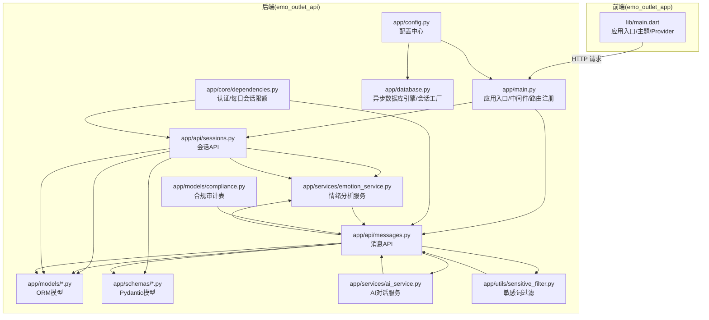
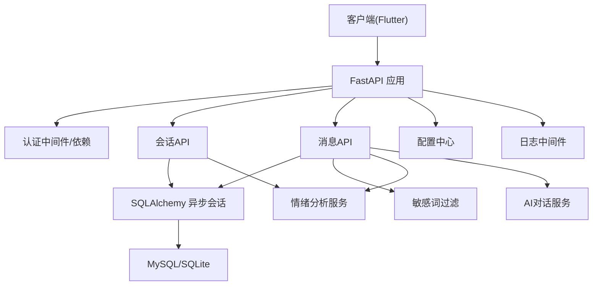
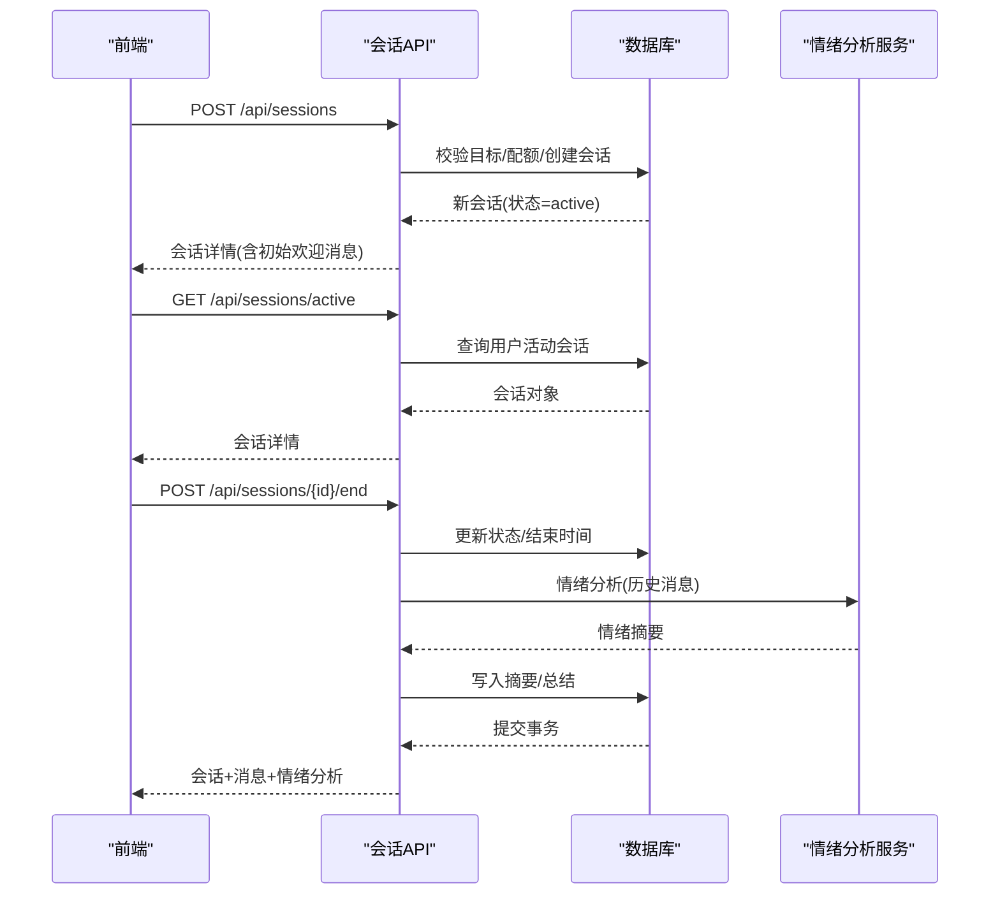
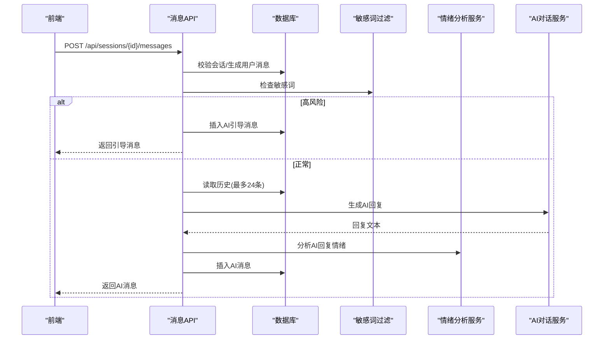
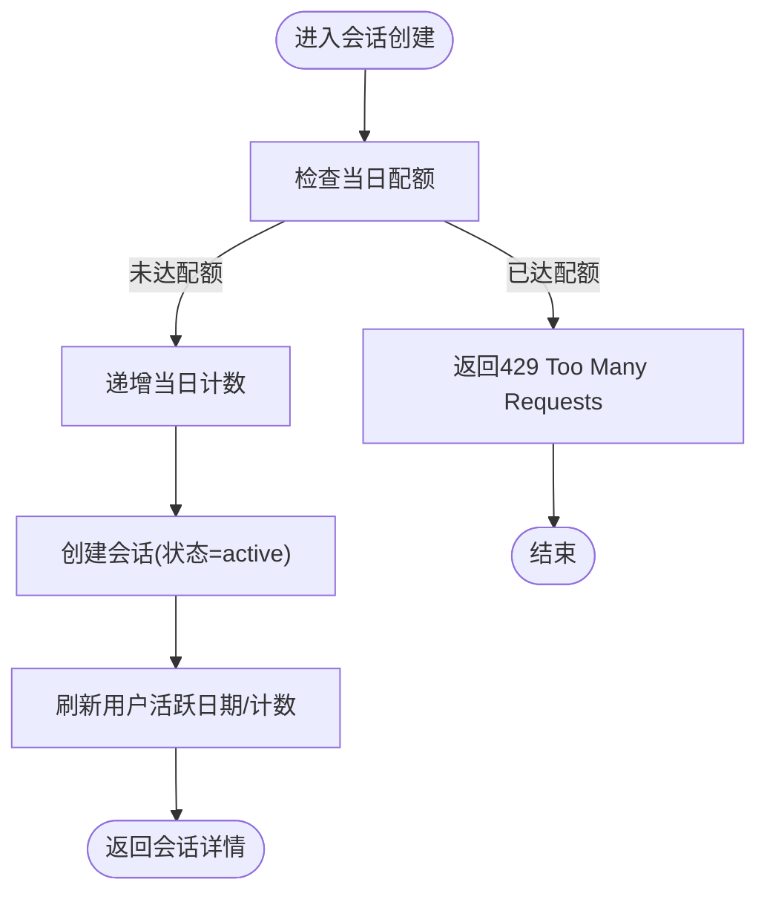
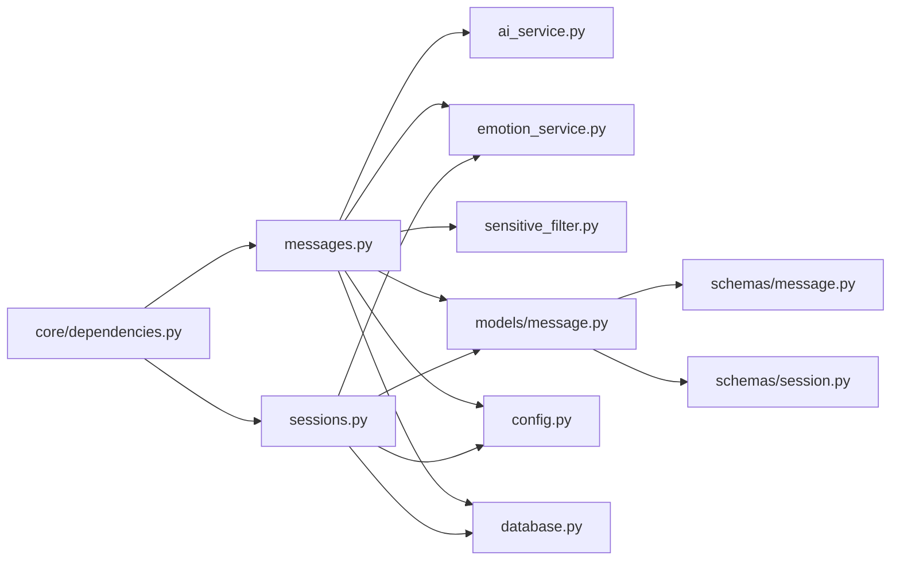
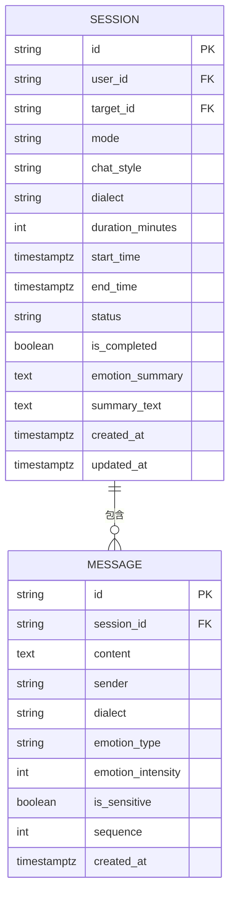

# 实时对话引擎

<cite>
**本文引用的文件**
- [emo_outlet_api/app/main.py](file://emo_outlet_api/app/main.py)
- [emo_outlet_api/app/api/messages.py](file://emo_outlet_api/app/api/messages.py)
- [emo_outlet_api/app/api/sessions.py](file://emo_outlet_api/app/api/sessions.py)
- [emo_outlet_api/app/models/message.py](file://emo_outlet_api/app/models/message.py)
- [emo_outlet_api/app/models/session.py](file://emo_outlet_api/app/models/session.py)
- [emo_outlet_api/app/schemas/message.py](file://emo_outlet_api/app/schemas/message.py)
- [emo_outlet_api/app/schemas/session.py](file://emo_outlet_api/app/schemas/session.py)
- [emo_outlet_api/app/config.py](file://emo_outlet_api/app/config.py)
- [emo_outlet_api/app/database.py](file://emo_outlet_api/app/database.py)
- [emo_outlet_api/app/utils/sensitive_filter.py](file://emo_outlet_api/app/utils/sensitive_filter.py)
- [emo_outlet_api/app/services/emotion_service.py](file://emo_outlet_api/app/services/emotion_service.py)
- [emo_outlet_api/app/services/ai_service.py](file://emo_outlet_api/app/services/ai_service.py)
- [emo_outlet_api/app/core/dependencies.py](file://emo_outlet_api/app/core/dependencies.py)
- [emo_outlet_api/app/models/compliance.py](file://emo_outlet_api/app/models/compliance.py)
- [emo_outlet_app/lib/main.dart](file://emo_outlet_app/lib/main.dart)
</cite>

## 目录
1. [引言](#引言)
2. [项目结构](#项目结构)
3. [核心组件](#核心组件)
4. [架构总览](#架构总览)
5. [详细组件分析](#详细组件分析)
6. [依赖关系分析](#依赖关系分析)
7. [性能考虑](#性能考虑)
8. [故障排查指南](#故障排查指南)
9. [结论](#结论)
10. [附录](#附录)

## 引言
本文件面向Emo Outlet的实时对话引擎，聚焦后端FastAPI服务与前端Flutter应用之间的交互机制，系统梳理会话生命周期、消息序列化与路由、质量控制（去重、乱序、补偿）、性能优化（批量、内存、带宽）以及可观测性（日志、指标、排障）。需要特别说明的是：当前代码库未实现WebSocket长连接与心跳/重连逻辑，实时消息采用HTTP请求-响应模式；会话状态与消息持久化通过数据库完成；敏感内容与情绪分析由服务层提供。

## 项目结构
后端以FastAPI为核心，按功能划分为API路由、数据模型、Schema、服务层与工具模块；前端Flutter应用负责UI与交互，并通过HTTP调用后端接口驱动会话与消息流转。

图表来源
- [emo_outlet_api/app/main.py:1-82](file://emo_outlet_api/app/main.py#L1-L82)
- [emo_outlet_api/app/api/sessions.py:1-220](file://emo_outlet_api/app/api/sessions.py#L1-L220)
- [emo_outlet_api/app/api/messages.py:1-216](file://emo_outlet_api/app/api/messages.py#L1-L216)
- [emo_outlet_api/app/models/session.py:1-79](file://emo_outlet_api/app/models/session.py#L1-L79)
- [emo_outlet_api/app/models/message.py:1-46](file://emo_outlet_api/app/models/message.py#L1-L46)
- [emo_outlet_api/app/schemas/session.py:1-49](file://emo_outlet_api/app/schemas/session.py#L1-L49)
- [emo_outlet_api/app/schemas/message.py:1-33](file://emo_outlet_api/app/schemas/message.py#L1-L33)
- [emo_outlet_api/app/services/ai_service.py:1-354](file://emo_outlet_api/app/services/ai_service.py#L1-L354)
- [emo_outlet_api/app/services/emotion_service.py:1-181](file://emo_outlet_api/app/services/emotion_service.py#L1-L181)
- [emo_outlet_api/app/utils/sensitive_filter.py:1-142](file://emo_outlet_api/app/utils/sensitive_filter.py#L1-L142)
- [emo_outlet_api/app/config.py:1-125](file://emo_outlet_api/app/config.py#L1-L125)
- [emo_outlet_api/app/database.py:1-43](file://emo_outlet_api/app/database.py#L1-L43)
- [emo_outlet_api/app/core/dependencies.py:1-67](file://emo_outlet_api/app/core/dependencies.py#L1-L67)
- [emo_outlet_api/app/models/compliance.py:1-50](file://emo_outlet_api/app/models/compliance.py#L1-L50)
- [emo_outlet_app/lib/main.dart:1-97](file://emo_outlet_app/lib/main.dart#L1-L97)

章节来源
- [emo_outlet_api/app/main.py:1-82](file://emo_outlet_api/app/main.py#L1-L82)
- [emo_outlet_api/app/config.py:1-125](file://emo_outlet_api/app/config.py#L1-L125)
- [emo_outlet_api/app/database.py:1-43](file://emo_outlet_api/app/database.py#L1-L43)
- [emo_outlet_app/lib/main.dart:1-97](file://emo_outlet_app/lib/main.dart#L1-L97)

## 核心组件
- 应用入口与中间件：注册CORS、异常处理器、健康检查、全局日志中间件。
- 会话API：创建/查询/结束会话，支持活动会话查询与历史摘要生成。
- 消息API：分页获取消息、发送消息并返回AI回复；集成敏感词过滤、情绪分析与会话配额控制。
- 数据模型：SessionModel与MessageModel，含时间、状态、方言、情绪、序列号等字段。
- 服务层：AI对话服务（多提供商适配/降级）、情绪分析服务（关键词与强度评分）、敏感词过滤（DFA+正则）。
- 配置中心：数据库、Redis、LLM提供商、会话配额、敏感词阈值等。
- 数据库：异步SQLAlchemy引擎与会话工厂，自动建表。
- 前端入口：Flutter应用初始化Provider与主题。

章节来源
- [emo_outlet_api/app/main.py:23-82](file://emo_outlet_api/app/main.py#L23-L82)
- [emo_outlet_api/app/api/sessions.py:50-220](file://emo_outlet_api/app/api/sessions.py#L50-L220)
- [emo_outlet_api/app/api/messages.py:32-195](file://emo_outlet_api/app/api/messages.py#L32-L195)
- [emo_outlet_api/app/models/session.py:13-79](file://emo_outlet_api/app/models/session.py#L13-L79)
- [emo_outlet_api/app/models/message.py:13-46](file://emo_outlet_api/app/models/message.py#L13-L46)
- [emo_outlet_api/app/services/ai_service.py:62-354](file://emo_outlet_api/app/services/ai_service.py#L62-L354)
- [emo_outlet_api/app/services/emotion_service.py:44-181](file://emo_outlet_api/app/services/emotion_service.py#L44-L181)
- [emo_outlet_api/app/utils/sensitive_filter.py:37-142](file://emo_outlet_api/app/utils/sensitive_filter.py#L37-L142)
- [emo_outlet_api/app/config.py:12-125](file://emo_outlet_api/app/config.py#L12-L125)
- [emo_outlet_api/app/database.py:10-43](file://emo_outlet_api/app/database.py#L10-L43)
- [emo_outlet_app/lib/main.dart:8-97](file://emo_outlet_app/lib/main.dart#L8-L97)

## 架构总览
后端采用分层架构：API层负责路由与鉴权，服务层封装业务能力，模型层映射数据库，配置与数据库模块提供基础设施。前端通过HTTP与后端交互，驱动会话与消息流程。

图表来源
- [emo_outlet_api/app/main.py:33-82](file://emo_outlet_api/app/main.py#L33-L82)
- [emo_outlet_api/app/api/sessions.py:50-220](file://emo_outlet_api/app/api/sessions.py#L50-L220)
- [emo_outlet_api/app/api/messages.py:69-195](file://emo_outlet_api/app/api/messages.py#L69-L195)
- [emo_outlet_api/app/database.py:22-43](file://emo_outlet_api/app/database.py#L22-L43)
- [emo_outlet_api/app/config.py:30-52](file://emo_outlet_api/app/config.py#L30-L52)

## 详细组件分析

### 会话生命周期与状态管理
- 创建会话：校验目标存在与用户权限，检查当日会话配额，初始化状态为“进行中”，记录起始时间。
- 查询活动会话：按用户与状态筛选，返回当前唯一活动会话。
- 结束会话：支持强制中断或正常结束，计算情绪摘要并持久化，返回会话、消息与情绪分析结果。
- 状态同步：会话状态与完成标记在数据库中持久化，前端通过轮询或事件通知感知变化。

图表来源
- [emo_outlet_api/app/api/sessions.py:50-220](file://emo_outlet_api/app/api/sessions.py#L50-L220)
- [emo_outlet_api/app/models/session.py:13-79](file://emo_outlet_api/app/models/session.py#L13-L79)
- [emo_outlet_api/app/services/emotion_service.py:44-181](file://emo_outlet_api/app/services/emotion_service.py#L44-L181)

章节来源
- [emo_outlet_api/app/api/sessions.py:50-220](file://emo_outlet_api/app/api/sessions.py#L50-L220)
- [emo_outlet_api/app/models/session.py:13-79](file://emo_outlet_api/app/models/session.py#L13-L79)
- [emo_outlet_api/app/schemas/session.py:8-49](file://emo_outlet_api/app/schemas/session.py#L8-L49)

### 实时消息传输协议与序列化
- 消息格式：请求体为字符串内容，响应体包含消息ID、会话ID、发送方、方言、情绪类型与强度、敏感标记、序列号与创建时间。
- 序列化机制：Pydantic模型负责请求/响应的序列化与校验，数据库模型映射至message表。
- 消息路由规则：
  - 发送消息：校验会话归属与状态，生成用户消息与AI回复两条消息，AI回复基于历史上下文与年龄区间策略生成。
  - 分页获取：按会话ID与序列升序返回，同时返回会话状态与剩余秒数。
- 敏感内容控制：敏感词过滤触发高风险时，立即中断并返回温和引导语，同时记录审计日志。

图表来源
- [emo_outlet_api/app/api/messages.py:69-195](file://emo_outlet_api/app/api/messages.py#L69-L195)
- [emo_outlet_api/app/utils/sensitive_filter.py:102-139](file://emo_outlet_api/app/utils/sensitive_filter.py#L102-L139)
- [emo_outlet_api/app/services/emotion_service.py:44-181](file://emo_outlet_api/app/services/emotion_service.py#L44-L181)
- [emo_outlet_api/app/services/ai_service.py:98-134](file://emo_outlet_api/app/services/ai_service.py#L98-L134)
- [emo_outlet_api/app/schemas/message.py:8-33](file://emo_outlet_api/app/schemas/message.py#L8-L33)
- [emo_outlet_api/app/models/message.py:13-46](file://emo_outlet_api/app/models/message.py#L13-L46)

章节来源
- [emo_outlet_api/app/api/messages.py:32-195](file://emo_outlet_api/app/api/messages.py#L32-L195)
- [emo_outlet_api/app/schemas/message.py:8-33](file://emo_outlet_api/app/schemas/message.py#L8-L33)
- [emo_outlet_api/app/models/message.py:13-46](file://emo_outlet_api/app/models/message.py#L13-L46)

### 并发控制与会话配额
- 每日会话配额：按访客/未成年人/青少年/成人区分上限，按天重置计数。
- 并发与一致性：使用异步数据库会话与事务，确保创建/更新操作原子性；用户对象在每次请求时刷新当日计数与活跃日期。

图表来源
- [emo_outlet_api/app/core/dependencies.py:53-67](file://emo_outlet_api/app/core/dependencies.py#L53-L67)
- [emo_outlet_api/app/api/sessions.py:67-99](file://emo_outlet_api/app/api/sessions.py#L67-L99)

章节来源
- [emo_outlet_api/app/core/dependencies.py:18-67](file://emo_outlet_api/app/core/dependencies.py#L18-L67)
- [emo_outlet_api/app/api/sessions.py:50-99](file://emo_outlet_api/app/api/sessions.py#L50-L99)

### 质量控制机制
- 消息去重：当前未见显式去重策略；建议在前端按消息内容与时间戳生成稳定Key并在发送队列中去重。
- 乱序处理：消息按sequence升序存储与返回，前端渲染时按顺序展示；建议在消息落库前统一生成单调递增序列号。
- 丢失补偿：当前未见自动重传/补偿逻辑；可在前端对未确认送达的消息进行超时重试与提示。
- 敏感内容：DFA+正则双层检测，高风险时立即中断并插入温和引导消息，同时记录审计日志。

章节来源
- [emo_outlet_api/app/api/messages.py:80-127](file://emo_outlet_api/app/api/messages.py#L80-L127)
- [emo_outlet_api/app/utils/sensitive_filter.py:74-139](file://emo_outlet_api/app/utils/sensitive_filter.py#L74-L139)
- [emo_outlet_api/app/models/compliance.py:31-50](file://emo_outlet_api/app/models/compliance.py#L31-L50)

### 性能优化策略
- 消息批量处理：后端未实现批量接口；建议在消息API中增加批量写入/读取接口，减少往返次数。
- 内存管理：异步会话工厂在请求结束后自动关闭，避免连接泄漏；建议限制单次历史读取数量（当前为24条）。
- 带宽控制：AI回复长度限制在合理范围；敏感词过滤与情绪分析均为本地计算，避免额外网络开销。
- 缓存与降级：AI服务支持Mock模式与降级策略，保障在网络异常时仍可回复本地内容。

章节来源
- [emo_outlet_api/app/services/ai_service.py:67-96](file://emo_outlet_api/app/services/ai_service.py#L67-L96)
- [emo_outlet_api/app/api/messages.py:128-172](file://emo_outlet_api/app/api/messages.py#L128-L172)

### 日志记录、监控指标与故障排查
- 日志：全局HTTP中间件打印请求路径、状态码与耗时；建议补充结构化日志与链路追踪ID。
- 指标：建议埋点以下指标（示例维度）：会话创建成功率、消息发送延迟、AI调用失败率、敏感词命中率、情绪分析耗时。
- 故障排查：
  - 认证失败：检查Authorization头与令牌有效性。
  - 会话配额：确认用户当日计数与年龄区间配置。
  - 敏感词拦截：核对敏感词库与高风险正则配置。
  - AI不可用：切换至Mock模式或检查提供商密钥与网络连通性。

章节来源
- [emo_outlet_api/app/main.py:33-39](file://emo_outlet_api/app/main.py#L33-L39)
- [emo_outlet_api/app/core/dependencies.py:18-50](file://emo_outlet_api/app/core/dependencies.py#L18-L50)
- [emo_outlet_api/app/utils/sensitive_filter.py:102-139](file://emo_outlet_api/app/utils/sensitive_filter.py#L102-L139)
- [emo_outlet_api/app/services/ai_service.py:67-96](file://emo_outlet_api/app/services/ai_service.py#L67-L96)

### 用户交互的实时反馈与体验优化
- 前端侧：会话创建后立即注入一条系统欢迎消息；发送消息后即时渲染用户消息，随后根据后端返回更新AI回复；倒计时结束自动结束会话。
- 体验优化：当后端异常时，前端模拟AI回复保证连续性；支持手动延长会话时间；对高风险内容提供温和引导语。

章节来源
- [emo_outlet_app/lib/main.dart:234-271](file://emo_outlet_app/lib/main.dart#L234-L271)

## 依赖关系分析
- 组件耦合：API层依赖服务层与数据库；服务层依赖配置与工具模块；模型与Schema相互独立但共同支撑API。
- 外部依赖：LLM提供商（OpenAI/DeepSeek/Qwen/Mock）、异步数据库引擎、敏感词过滤算法。
- 循环依赖：当前未发现循环导入；各模块职责清晰。

图表来源
- [emo_outlet_api/app/api/messages.py:16-20](file://emo_outlet_api/app/api/messages.py#L16-L20)
- [emo_outlet_api/app/api/sessions.py:18-24](file://emo_outlet_api/app/api/sessions.py#L18-L24)
- [emo_outlet_api/app/services/ai_service.py:8-11](file://emo_outlet_api/app/services/ai_service.py#L8-L11)
- [emo_outlet_api/app/services/emotion_service.py:6](file://emo_outlet_api/app/services/emotion_service.py#L6)
- [emo_outlet_api/app/utils/sensitive_filter.py:3](file://emo_outlet_api/app/utils/sensitive_filter.py#L3)
- [emo_outlet_api/app/models/message.py:7-10](file://emo_outlet_api/app/models/message.py#L7-L10)
- [emo_outlet_api/app/models/session.py:7-10](file://emo_outlet_api/app/models/session.py#L7-L10)
- [emo_outlet_api/app/schemas/message.py:5](file://emo_outlet_api/app/schemas/message.py#L5)
- [emo_outlet_api/app/schemas/session.py:5](file://emo_outlet_api/app/schemas/session.py#L5)
- [emo_outlet_api/app/config.py:9](file://emo_outlet_api/app/config.py#L9)
- [emo_outlet_api/app/database.py:3-6](file://emo_outlet_api/app/database.py#L3-L6)
- [emo_outlet_api/app/core/dependencies.py:5-13](file://emo_outlet_api/app/core/dependencies.py#L5-L13)

章节来源
- [emo_outlet_api/app/api/messages.py:16-20](file://emo_outlet_api/app/api/messages.py#L16-L20)
- [emo_outlet_api/app/api/sessions.py:18-24](file://emo_outlet_api/app/api/sessions.py#L18-L24)
- [emo_outlet_api/app/models/message.py:7-10](file://emo_outlet_api/app/models/message.py#L7-L10)
- [emo_outlet_api/app/models/session.py:7-10](file://emo_outlet_api/app/models/session.py#L7-L10)
- [emo_outlet_api/app/schemas/message.py:5](file://emo_outlet_api/app/schemas/message.py#L5)
- [emo_outlet_api/app/schemas/session.py:5](file://emo_outlet_api/app/schemas/session.py#L5)
- [emo_outlet_api/app/config.py:9](file://emo_outlet_api/app/config.py#L9)
- [emo_outlet_api/app/database.py:3-6](file://emo_outlet_api/app/database.py#L3-L6)
- [emo_outlet_api/app/core/dependencies.py:5-13](file://emo_outlet_api/app/core/dependencies.py#L5-L13)

## 性能考虑
- 当前实现为HTTP请求-响应模式，非WebSocket长连接，因此无连接池、心跳与断线重连逻辑。
- 建议在前端引入WebSocket以支持：
  - 心跳保活：固定间隔发送ping，服务端返回pong。
  - 断线重连：指数退避重连，携带离线消息索引进行追赶同步。
  - 连接池：复用连接，降低握手开销。
- 后端可选方案：
  - 使用FastAPI的WebSocket路由与连接管理。
  - 在消息落库后推送增量消息至订阅者，前端按sequence顺序渲染。
- 本节为概念性建议，不对应具体源码文件。

## 故障排查指南
- 认证相关：令牌缺失或过期导致401；用户被封禁返回403。
- 会话相关：非本人会话访问返回404；会话已完成无法再次结束。
- 配额相关：当日配额已达上限返回429。
- 敏感内容：高风险触发时立即中断并记录审计日志。
- AI服务：提供商密钥为空或调用异常时自动降级为本地回复。

章节来源
- [emo_outlet_api/app/core/dependencies.py:22-43](file://emo_outlet_api/app/core/dependencies.py#L22-L43)
- [emo_outlet_api/app/api/sessions.py:156-177](file://emo_outlet_api/app/api/sessions.py#L156-L177)
- [emo_outlet_api/app/api/messages.py:77-127](file://emo_outlet_api/app/api/messages.py#L77-L127)
- [emo_outlet_api/app/utils/sensitive_filter.py:102-139](file://emo_outlet_api/app/utils/sensitive_filter.py#L102-L139)
- [emo_outlet_api/app/services/ai_service.py:67-96](file://emo_outlet_api/app/services/ai_service.py#L67-L96)

## 结论
当前实现以HTTP为基础，完成了会话与消息的完整生命周期管理，配合敏感词过滤、情绪分析与AI回复，满足基本的实时对话需求。若要达到真正的“实时”体验，建议引入WebSocket长连接、心跳与断线重连机制，并结合消息去重、乱序处理与丢失补偿策略，进一步提升稳定性与用户体验。

## 附录
- 数据模型概览（简化）

图表来源
- [emo_outlet_api/app/models/session.py:13-79](file://emo_outlet_api/app/models/session.py#L13-L79)
- [emo_outlet_api/app/models/message.py:13-46](file://emo_outlet_api/app/models/message.py#L13-L46)