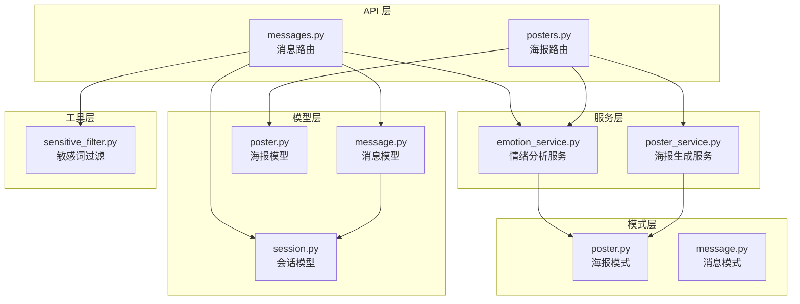
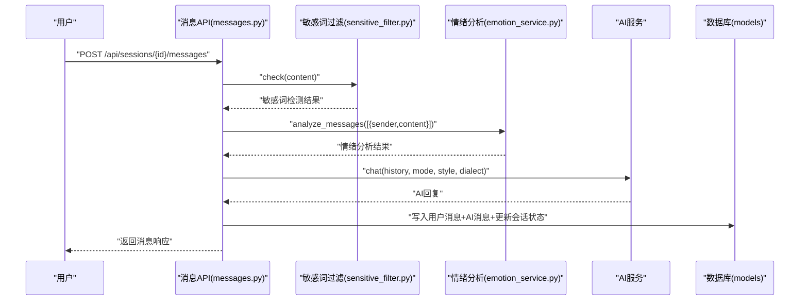
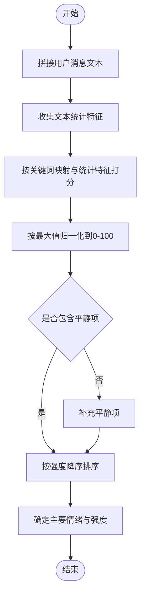
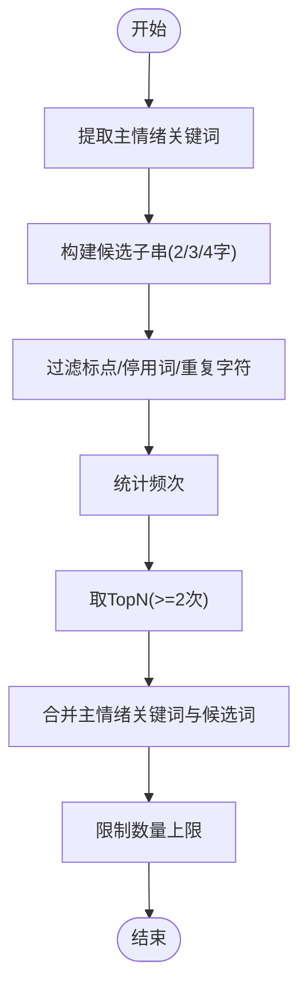
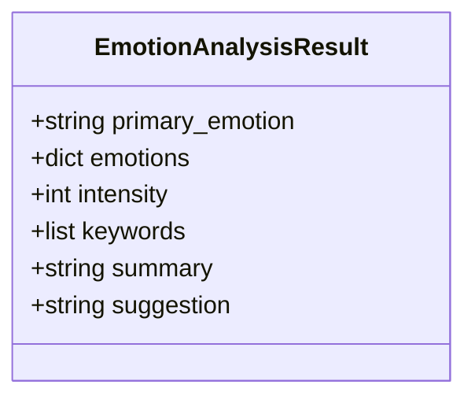
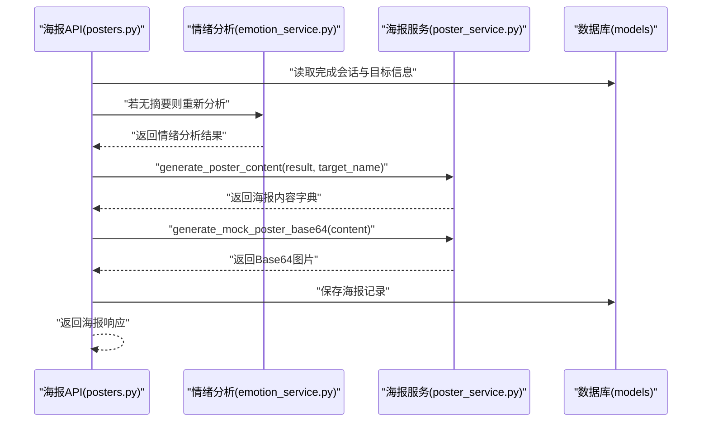
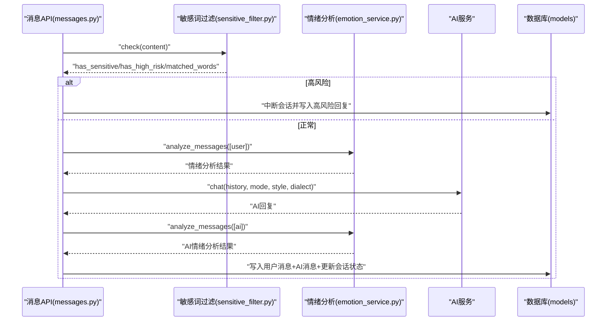
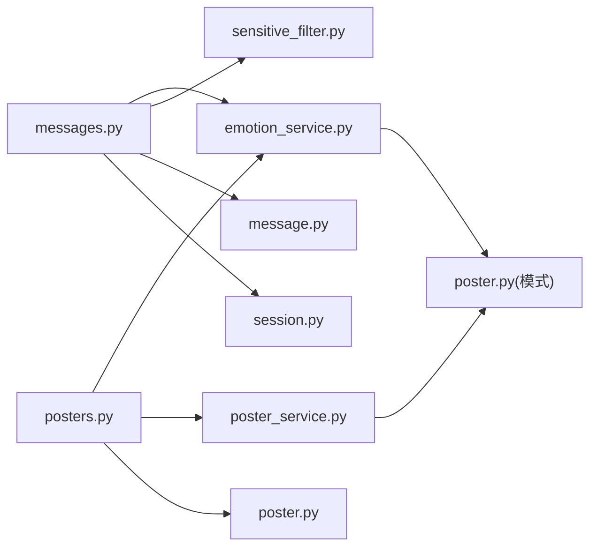

# 情绪分析算法实现

<cite>
**本文引用的文件**
- [emotion_service.py](file://emo_outlet_api/app/services/emotion_service.py)
- [poster_service.py](file://emo_outlet_api/app/services/poster_service.py)
- [posters.py](file://emo_outlet_api/app/api/posters.py)
- [messages.py](file://emo_outlet_api/app/api/messages.py)
- [message.py](file://emo_outlet_api/app/models/message.py)
- [session.py](file://emo_outlet_api/app/models/session.py)
- [poster.py](file://emo_outlet_api/app/models/poster.py)
- [sensitive_filter.py](file://emo_outlet_api/app/utils/sensitive_filter.py)
- [poster.py](file://emo_outlet_api/app/schemas/poster.py)
- [message.py](file://emo_outlet_api/app/schemas/message.py)
- [README.md](file://README.md)
</cite>

## 目录
1. [简介](#简介)
2. [项目结构](#项目结构)
3. [核心组件](#核心组件)
4. [架构总览](#架构总览)
5. [详细组件分析](#详细组件分析)
6. [依赖关系分析](#依赖关系分析)
7. [性能考量](#性能考量)
8. [故障排查指南](#故障排查指南)
9. [结论](#结论)
10. [附录](#附录)

## 简介
本技术文档聚焦于 Emo Outlet 情绪分析算法的实现与应用，围绕关键词映射的情绪检测机制，系统阐述以下内容：
- 基于关键词映射的五种基本情绪识别（愤怒、委屈、焦虑、疲惫、无奈）及“平静”作为默认基线的判定逻辑
- 情绪强度计算方法：关键词频率统计、权重分配、标度归一化与文本统计特征调优
- 关键词提取策略：主情绪关键词优先、高频子串挖掘、停用词过滤与上下文相关性分析
- 情绪分析结果数据结构设计：主要情绪、情绪分布、强度评分、关键词列表、摘要与调节建议
- 情绪分析质量评估指标与算法优化策略
- 情绪分析结果在海报生成与可视化中的应用与展示方法

## 项目结构
后端采用 FastAPI + SQLAlchemy 架构，情绪分析位于服务层，API 层负责请求处理与流程编排，模型层承载持久化，工具层提供敏感词过滤。海报生成与报告统计在独立的服务与 API 中实现。

图表来源
- [messages.py:1-216](file://emo_outlet_api/app/api/messages.py#L1-L216)
- [posters.py:1-383](file://emo_outlet_api/app/api/posters.py#L1-L383)
- [emotion_service.py:1-181](file://emo_outlet_api/app/services/emotion_service.py#L1-L181)
- [poster_service.py:1-221](file://emo_outlet_api/app/services/poster_service.py#L1-L221)
- [message.py:1-46](file://emo_outlet_api/app/models/message.py#L1-L46)
- [session.py:1-79](file://emo_outlet_api/app/models/session.py#L1-L79)
- [poster.py:1-61](file://emo_outlet_api/app/models/poster.py#L1-L61)
- [sensitive_filter.py:1-142](file://emo_outlet_api/app/utils/sensitive_filter.py#L1-L142)
- [poster.py:1-65](file://emo_outlet_api/app/schemas/poster.py#L1-L65)
- [message.py:1-33](file://emo_outlet_api/app/schemas/message.py#L1-L33)

章节来源
- [README.md:58-84](file://README.md#L58-L84)

## 核心组件
- 情绪分析服务（EmotionService）
  - 提供消息集合的情绪分析入口，返回标准化的结果数据结构
  - 包含关键词映射、文本统计特征、强度归一化、关键词提取与摘要/建议生成
- 海报生成服务（PosterService）
  - 将情绪分析结果转换为海报内容模板，生成 HTML 或 Base64 SVG
  - 提供不同情绪风格的主题色、标语与建议文案
- API 路由
  - 消息路由：负责敏感词过滤、情绪分析、AI 对话生成与会话状态管理
  - 海报路由：负责海报生成、查询、详情与情绪报告统计

章节来源
- [emotion_service.py:44-181](file://emo_outlet_api/app/services/emotion_service.py#L44-L181)
- [poster_service.py:66-221](file://emo_outlet_api/app/services/poster_service.py#L66-L221)
- [messages.py:69-195](file://emo_outlet_api/app/api/messages.py#L69-L195)
- [posters.py:72-137](file://emo_outlet_api/app/api/posters.py#L72-L137)

## 架构总览
情绪分析贯穿消息发送与海报生成两条主线：
- 消息发送流程：用户输入 → 敏感词过滤 → 情绪分析 → AI 回复 → 存储消息与会话状态
- 海报生成流程：完成会话 → 读取会话情绪摘要或重新分析 → 生成海报内容 → 保存海报

图表来源
- [messages.py:69-195](file://emo_outlet_api/app/api/messages.py#L69-L195)
- [sensitive_filter.py:102-119](file://emo_outlet_api/app/utils/sensitive_filter.py#L102-L119)
- [emotion_service.py:44-71](file://emo_outlet_api/app/services/emotion_service.py#L44-L71)

## 详细组件分析

### 情绪分析算法（关键词映射与强度计算）
- 关键词映射
  - 定义五类基本情绪的关键词集合，以及“平静”作为默认基线
  - 主情绪关键词命中计数乘以固定权重累加到对应情绪得分
- 文本统计特征调优
  - 感叹号数量影响“愤怒”得分
  - 问号数量影响“焦虑”得分
  - 字符长度影响“疲惫”得分
  - 重复字符影响“委屈”得分
  - “平静”基础加分
- 归一化处理
  - 将各情绪得分按最大值归一到 0-100 百分制
  - 若无显著情绪，强制“平静”占一定比例，保证结果可解释性
  - 结果按强度降序排列
- 主要情绪与强度
  - 主要情绪为主强度对应的类别
  - 强度为最大分数的整数值

图表来源
- [emotion_service.py:44-121](file://emo_outlet_api/app/services/emotion_service.py#L44-L121)

章节来源
- [emotion_service.py:8-28](file://emo_outlet_api/app/services/emotion_service.py#L8-L28)
- [emotion_service.py:83-93](file://emo_outlet_api/app/services/emotion_service.py#L83-L93)
- [emotion_service.py:95-121](file://emo_outlet_api/app/services/emotion_service.py#L95-L121)

### 关键词提取策略
- 主情绪关键词优先
  - 遍历主情绪关键词集合，若文本包含且未重复，则加入关键词列表
- 高频子串挖掘
  - 去除空格后，遍历长度为 2/3/4 的连续子串
  - 过滤标点、停用词与单一字符重复片段
  - 统计出现频次，按频次降序取前若干个，避免与主情绪关键词重复
- 上限控制
  - 最终关键词不超过预设上限，确保可视化与摘要简洁

图表来源
- [emotion_service.py:122-148](file://emo_outlet_api/app/services/emotion_service.py#L122-L148)

章节来源
- [emotion_service.py:30-33](file://emo_outlet_api/app/services/emotion_service.py#L30-L33)
- [emotion_service.py:122-148](file://emo_outlet_api/app/services/emotion_service.py#L122-L148)

### 情绪分析结果数据结构设计
- 主要情绪：字符串，表示主强度对应的情绪类别
- 情绪分布：字典，键为情绪类别，值为百分比分数
- 强度评分：整数，范围 0-100，表示主情绪强度
- 关键词列表：字符串数组，最多若干个，用于可视化与摘要
- 摘要：针对主情绪与关键词生成的个性化描述
- 调节建议：根据主情绪与强度生成的行动建议

图表来源
- [poster.py:8-14](file://emo_outlet_api/app/schemas/poster.py#L8-L14)

章节来源
- [poster.py:8-14](file://emo_outlet_api/app/schemas/poster.py#L8-L14)

### 海报生成与可视化
- 内容生成
  - 根据主情绪选择主题风格（标题、副标题、徽标、强调色、辅助色、摘要）
  - 将关键词转为 JSON 字符串存储，建议文案取摘要或风格默认
- HTML 生成
  - 生成内联样式 HTML，使用渐变背景、圆角容器、关键词标签等元素
- Mock 图片
  - 生成 SVG 并编码为 data URL，便于前端直接渲染与下载

图表来源
- [posters.py:72-137](file://emo_outlet_api/app/api/posters.py#L72-L137)
- [poster_service.py:66-90](file://emo_outlet_api/app/services/poster_service.py#L66-L90)
- [poster_service.py:92-189](file://emo_outlet_api/app/services/poster_service.py#L92-L189)
- [poster_service.py:191-217](file://emo_outlet_api/app/services/poster_service.py#L191-L217)

章节来源
- [poster_service.py:10-59](file://emo_outlet_api/app/services/poster_service.py#L10-L59)
- [poster_service.py:66-90](file://emo_outlet_api/app/services/poster_service.py#L66-L90)
- [poster_service.py:92-189](file://emo_outlet_api/app/services/poster_service.py#L92-L189)
- [poster_service.py:191-217](file://emo_outlet_api/app/services/poster_service.py#L191-L217)

### 消息发送流程与情绪分析集成
- 敏感词过滤
  - 使用 DFA Trie 树进行 O(n) 匹配，同时结合正则高风险模式
  - 高风险触发时中断会话并生成温和引导回复
- 情绪分析
  - 对用户消息进行分析，标注情绪类型与强度
  - 将结果写入消息记录与会话摘要
- AI 对话
  - 基于历史消息与用户年龄分组限制生成回复
  - 再次分析 AI 回复的情绪并写入消息

图表来源
- [messages.py:69-195](file://emo_outlet_api/app/api/messages.py#L69-L195)
- [sensitive_filter.py:102-119](file://emo_outlet_api/app/utils/sensitive_filter.py#L102-L119)
- [emotion_service.py:44-71](file://emo_outlet_api/app/services/emotion_service.py#L44-L71)

章节来源
- [messages.py:80-127](file://emo_outlet_api/app/api/messages.py#L80-L127)
- [messages.py:165-173](file://emo_outlet_api/app/api/messages.py#L165-L173)
- [sensitive_filter.py:102-119](file://emo_outlet_api/app/utils/sensitive_filter.py#L102-L119)

## 依赖关系分析
- 模块耦合
  - API 层依赖服务层与模型层；服务层依赖模式层与工具层
  - 情绪分析服务与海报服务相互独立，通过模式层数据结构对接
- 外部依赖
  - FastAPI、SQLAlchemy、Pydantic 用于接口定义与数据校验
  - DFA 敏感词过滤提供高性能关键词匹配

图表来源
- [messages.py:1-216](file://emo_outlet_api/app/api/messages.py#L1-L216)
- [posters.py:1-383](file://emo_outlet_api/app/api/posters.py#L1-L383)
- [emotion_service.py:1-181](file://emo_outlet_api/app/services/emotion_service.py#L1-L181)
- [poster_service.py:1-221](file://emo_outlet_api/app/services/poster_service.py#L1-L221)
- [sensitive_filter.py:1-142](file://emo_outlet_api/app/utils/sensitive_filter.py#L1-L142)
- [poster.py:1-65](file://emo_outlet_api/app/schemas/poster.py#L1-L65)
- [message.py:1-46](file://emo_outlet_api/app/models/message.py#L1-L46)
- [session.py:1-79](file://emo_outlet_api/app/models/session.py#L1-L79)
- [poster.py:1-61](file://emo_outlet_api/app/models/poster.py#L1-L61)

## 性能考量
- 时间复杂度
  - 关键词映射：O(N)（N 为文本长度），每类情绪关键词计数线性扫描
  - DFA 敏感词匹配：O(n)，优于正则多次匹配
  - 归一化与排序：O(E log E)，E 为情绪类别数（常量级）
- 空间复杂度
  - 关键词计数字典与 Counter：O(k)，k 为候选子串数量
  - 文本统计特征：O(1)
- 优化建议
  - 预编译正则与 Trie 树一次性构建，避免重复初始化
  - 对超长文本分段处理或截断，减少子串统计开销
  - 将常用情绪关键词与停用词集合缓存，降低查找成本
  - 在 API 层增加请求体大小限制与超时控制，防止异常输入导致资源占用

## 故障排查指南
- 情绪分析结果为空
  - 检查用户消息是否为空或仅包含非用户消息
  - 确认会话状态与历史消息读取逻辑
- 敏感词误判或漏判
  - 核对 DFA Trie 树构建与最长匹配策略
  - 检查高风险正则模式覆盖范围
- 海报生成失败
  - 确认情绪分析结果完整性与关键词 JSON 序列化
  - 检查 HTML 与 SVG 生成逻辑中的字符转义与样式拼接
- 数据一致性问题
  - 核对消息与会话写入顺序与事务提交
  - 检查会话状态变更与完成标志位

章节来源
- [emotion_service.py:73-81](file://emo_outlet_api/app/services/emotion_service.py#L73-L81)
- [messages.py:80-127](file://emo_outlet_api/app/api/messages.py#L80-L127)
- [posters.py:101-122](file://emo_outlet_api/app/api/posters.py#L101-L122)

## 结论
本实现以关键词映射为核心，结合文本统计特征与归一化处理，形成稳定可解释的情绪识别流程；通过主情绪关键词优先与高频子串挖掘，兼顾准确性与可读性；在海报生成中以风格化主题与可视化元素增强用户体验。建议后续引入上下文建模与多轮对话特征，进一步提升情绪识别的鲁棒性与泛化能力。

## 附录
- 情绪报告统计
  - 概览：按周期统计会话总数、总时长、主导情绪分布与日趋势
  - 详情：按目标、模式、时段与关键词维度统计分布
- 数据库模型要点
  - 会话表：保存模式、方言、时长、状态与情绪摘要
  - 消息表：保存内容、发送方、情绪标记与敏感词标记
  - 海报表：保存海报标题、情绪类型、强度、关键词与图片数据

章节来源
- [posters.py:226-293](file://emo_outlet_api/app/api/posters.py#L226-L293)
- [posters.py:296-382](file://emo_outlet_api/app/api/posters.py#L296-L382)
- [session.py:57-63](file://emo_outlet_api/app/models/session.py#L57-L63)
- [message.py:29-35](file://emo_outlet_api/app/models/message.py#L29-L35)
- [poster.py:26-49](file://emo_outlet_api/app/models/poster.py#L26-L49)