# 敏感内容过滤系统

<cite>
**本文档引用的文件**
- [sensitive_filter.py](file://emo_outlet_api/app/utils/sensitive_filter.py)
- [messages.py](file://emo_outlet_api/app/api/messages.py)
- [compliance.py](file://emo_outlet_api/app/models/compliance.py)
- [message.py](file://emo_outlet_api/app/models/message.py)
- [session.py](file://emo_outlet_api/app/models/session.py)
- [config.py](file://emo_outlet_api/app/config.py)
- [emotion_service.py](file://emo_outlet_api/app/services/emotion_service.py)
- [security.py](file://emo_outlet_api/app/core/security.py)
- [error_handler.py](file://emo_outlet_api/app/core/error_handler.py)
- [support.py](file://emo_outlet_api/app/api/support.py)
- [poster_service.py](file://emo_outlet_api/app/services/poster_service.py)
- [poster.py](file://emo_outlet_api/app/schemas/poster.py)
</cite>

## 目录
1. [简介](#简介)
2. [项目结构](#项目结构)
3. [核心组件](#核心组件)
4. [架构概览](#架构概览)
5. [详细组件分析](#详细组件分析)
6. [依赖关系分析](#依赖关系分析)
7. [性能考虑](#性能考虑)
8. [故障排除指南](#故障排除指南)
9. [结论](#结论)

## 简介

Emo Outlet是一个专注于情绪表达和心理支持的平台，其敏感内容过滤系统是确保平台安全、合规运营的核心组件。该系统采用多层防护策略，结合确定性有限自动机(DFA)算法、正则表达式匹配和上下文分析技术，为用户提供安全、健康的交流环境。

系统主要功能包括：
- 实时敏感词检测和过滤
- 高风险内容识别和干预
- 审计日志记录和合规管理
- 智能会话中断和人工复核流程
- 情绪分析辅助内容审核

## 项目结构

Emo Outlet的敏感内容过滤系统采用分层架构设计，主要分布在以下模块中：

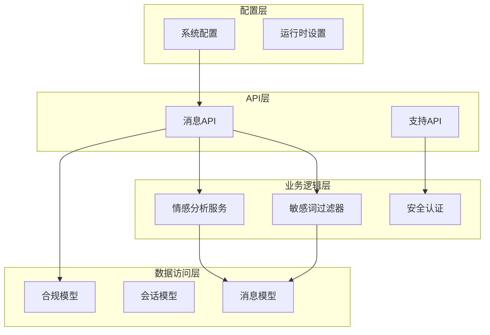

**图表来源**
- [messages.py:1-216](file://emo_outlet_api/app/api/messages.py#L1-216)
- [sensitive_filter.py:1-142](file://emo_outlet_api/app/utils/sensitive_filter.py#L1-142)
- [emotion_service.py:1-181](file://emo_outlet_api/app/services/emotion_service.py#L1-181)

**章节来源**
- [messages.py:1-216](file://emo_outlet_api/app/api/messages.py#L1-216)
- [sensitive_filter.py:1-142](file://emo_outlet_api/app/utils/sensitive_filter.py#L1-142)
- [config.py:1-125](file://emo_outlet_api/app/config.py#L1-125)

## 核心组件

### 敏感词过滤器(DFAFilter)

敏感词过滤器是系统的核心组件，采用确定性有限自动机(DFA)算法实现高效的文本匹配。该算法具有O(n)时间复杂度，能够快速处理大量文本内容。

#### 关键特性
- **DFA Trie树构建**：通过前缀树结构实现敏感词的快速查找
- **最长匹配优先**：确保敏感词匹配的准确性
- **正则表达式补充**：处理复杂的高风险模式检测
- **智能过滤策略**：提供温和的替代响应

#### 敏感词分类体系

系统建立了完整的敏感词分类体系，涵盖以下类别：

| 分类类别 | 包含词汇示例 | 风险等级 |
|---------|-------------|----------|
| 暴力/伤害 | 杀人、自杀、自残、跳楼、上吊 | 高风险 |
| 违法犯罪 | 贩毒、吸毒、抢劫、强奸、猥亵、赌博 | 高风险 |
| 政治敏感 | 炸弹、恐怖袭击、极端组织 | 高风险 |
| 色情低俗 | 色情、淫秽、裸聊、约炮、援交 | 中高风险 |
| 人身攻击 | 脑残、傻逼、去死、废物、人渣 | 中风险 |

**章节来源**
- [sensitive_filter.py:12-34](file://emo_outlet_api/app/utils/sensitive_filter.py#L12-L34)

### 高风险内容识别机制

系统采用双重检测机制识别高风险内容：

#### DFA算法检测
- **前缀树匹配**：通过Trie树结构实现O(n)复杂度的敏感词查找
- **最长匹配原则**：避免部分匹配导致的漏检
- **实时过滤**：在消息发送时即时检测

#### 正则表达式检测
- **高风险模式**：专门针对自杀倾向、暴力意图等危险表达
- **模糊匹配**：识别变体和变形的敏感表达
- **上下文感知**：结合语境判断表达的真实意图

**章节来源**
- [sensitive_filter.py:37-142](file://emo_outlet_api/app/utils/sensitive_filter.py#L37-L142)

### 自动中断机制

当检测到高风险内容时，系统执行自动中断流程：

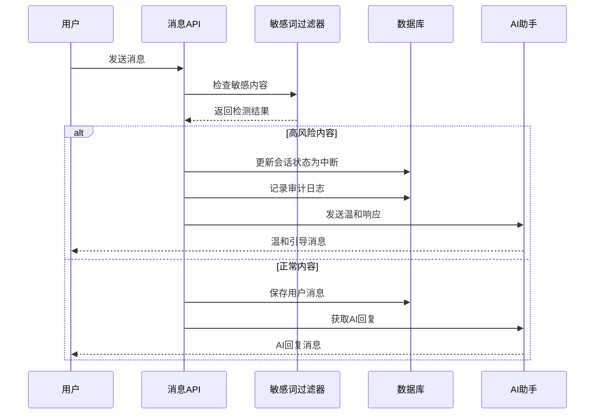

**图表来源**
- [messages.py:80-127](file://emo_outlet_api/app/api/messages.py#L80-L127)
- [sensitive_filter.py:128-138](file://emo_outlet_api/app/utils/sensitive_filter.py#L128-L138)

**章节来源**
- [messages.py:80-127](file://emo_outlet_api/app/api/messages.py#L80-L127)

## 架构概览

### 系统架构图

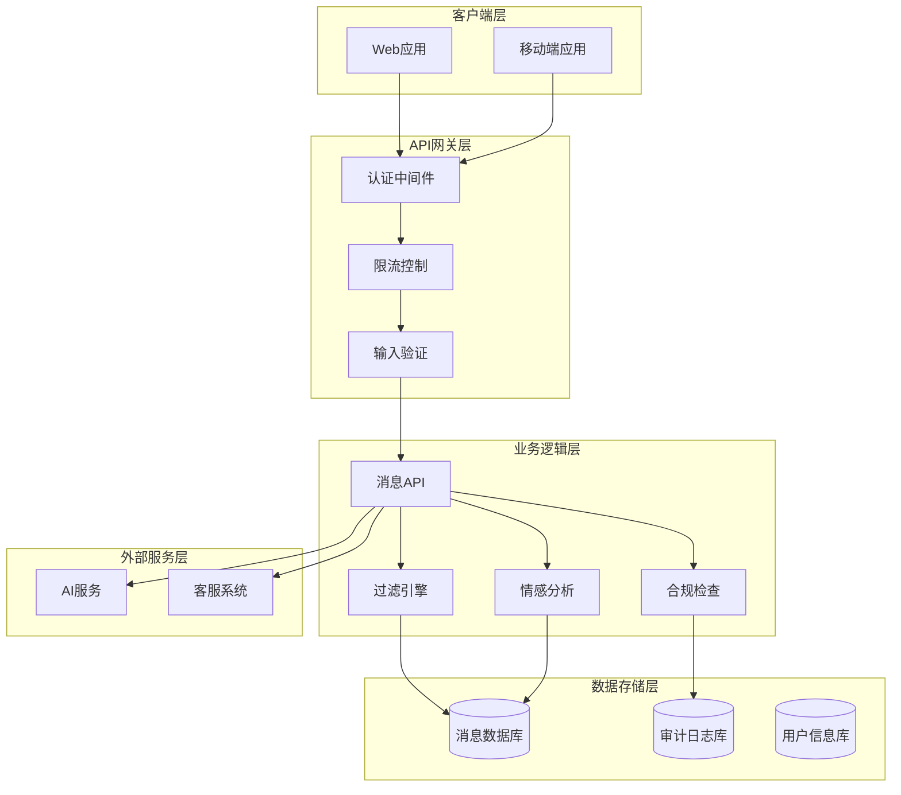

**图表来源**
- [messages.py:1-216](file://emo_outlet_api/app/api/messages.py#L1-216)
- [sensitive_filter.py:1-142](file://emo_outlet_api/app/utils/sensitive_filter.py#L1-142)
- [emotion_service.py:1-181](file://emo_outlet_api/app/services/emotion_service.py#L1-181)

### 数据流架构

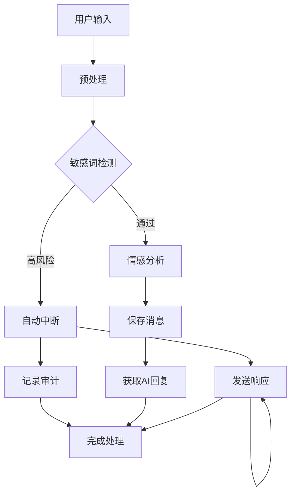

**图表来源**
- [messages.py:69-195](file://emo_outlet_api/app/api/messages.py#L69-L195)
- [sensitive_filter.py:74-119](file://emo_outlet_api/app/utils/sensitive_filter.py#L74-L119)

## 详细组件分析

### DFA敏感词过滤器

#### 类结构设计

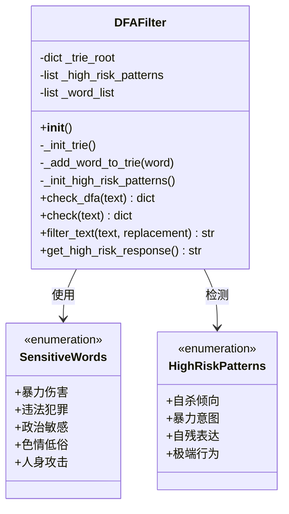

**图表来源**
- [sensitive_filter.py:37-142](file://emo_outlet_api/app/utils/sensitive_filter.py#L37-L142)

#### DFA算法实现原理

DFA算法通过构建前缀树(Trie)实现高效的字符串匹配：

1. **Trie树构建**：将所有敏感词插入到前缀树中
2. **状态转移**：每个字符对应树中的一个节点
3. **最长匹配**：优先匹配最长的敏感词
4. **快速跳转**：匹配失败时利用已知信息快速跳转

#### 性能优化特性

- **内存优化**：共享公共前缀减少内存占用
- **时间复杂度**：O(n)线性时间复杂度
- **批量处理**：支持批量敏感词检测
- **缓存机制**：敏感词列表缓存提高查询效率

**章节来源**
- [sensitive_filter.py:37-101](file://emo_outlet_api/app/utils/sensitive_filter.py#L37-L101)

### 消息处理流程

#### 完整的消息处理序列

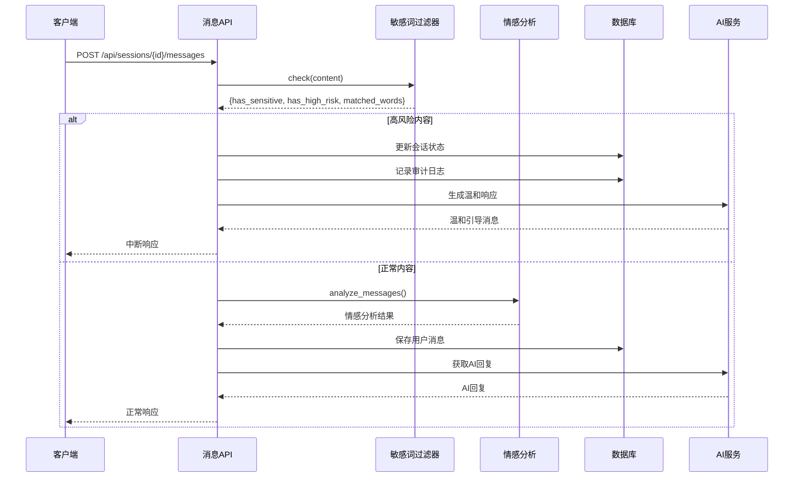

**图表来源**
- [messages.py:69-195](file://emo_outlet_api/app/api/messages.py#L69-L195)
- [sensitive_filter.py:102-119](file://emo_outlet_api/app/utils/sensitive_filter.py#L102-L119)

#### 年龄相关限制机制

系统根据用户年龄实施差异化的内容保护策略：

| 年龄组 | 最大对话轮数 | 会话时长限制 | 特殊保护 |
|--------|-------------|-------------|----------|
| 14岁以下 | 10轮 | 3分钟 | 最严格保护 |
| 14-18岁 | 25轮 | 5分钟 | 加强监控 |
| 成年人 | 50轮 | 10分钟 | 标准保护 |
| 访客 | 1轮 | 3分钟 | 基础保护 |

**章节来源**
- [messages.py:140-144](file://emo_outlet_api/app/api/messages.py#L140-L144)

### 审计日志系统

#### 日志记录策略

系统建立完整的审计日志体系，确保所有敏感内容检测都有据可查：

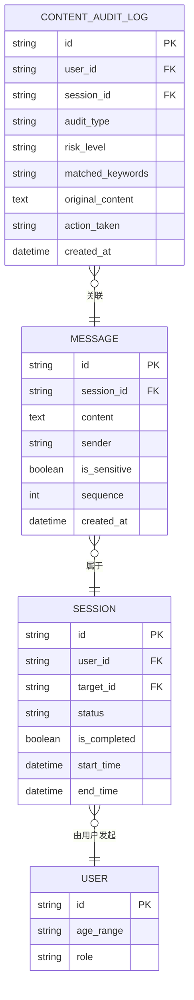

**图表来源**
- [compliance.py:31-49](file://emo_outlet_api/app/models/compliance.py#L31-L49)
- [message.py:13-45](file://emo_outlet_api/app/models/message.py#L13-L45)
- [session.py:13-75](file://emo_outlet_api/app/models/session.py#L13-L75)

#### 日志字段说明

| 字段名 | 类型 | 描述 | 示例值 |
|--------|------|------|--------|
| user_id | String(36) | 用户标识符 | "user_123456" |
| session_id | String(36) | 会话标识符 | "session_789012" |
| audit_type | String(20) | 审计类型 | "user_input" |
| risk_level | String(10) | 风险等级 | "high" |
| matched_keywords | String(500) | 匹配的敏感词 | "自杀,自残,跳楼" |
| original_content | Text | 原始内容 | "我想要结束自己的生命..." |
| action_taken | String(30) | 采取的措施 | "interrupted" |
| created_at | DateTime | 创建时间 | "2024-01-01 12:00:00" |

**章节来源**
- [compliance.py:31-49](file://emo_outlet_api/app/models/compliance.py#L31-L49)

### 情感分析集成

#### 情感分析服务

系统的情感分析服务为敏感内容过滤提供上下文理解能力：

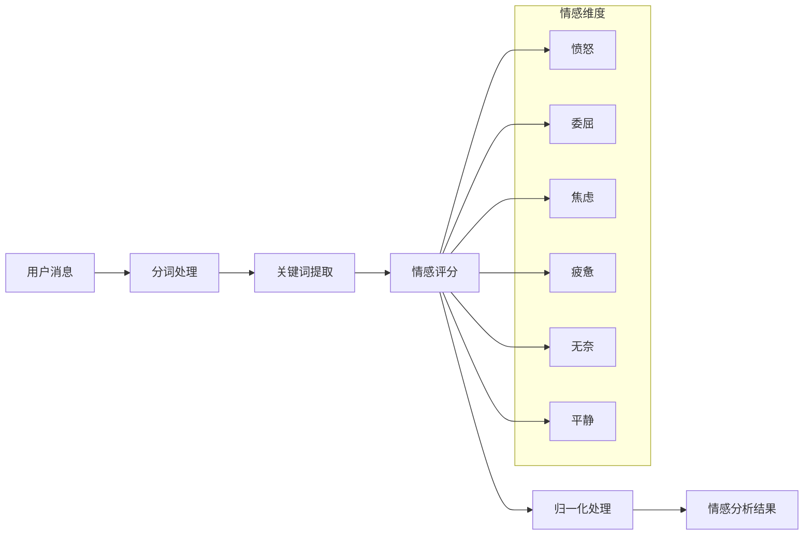

**图表来源**
- [emotion_service.py:44-181](file://emo_outlet_api/app/services/emotion_service.py#L44-L181)

#### 情感关键词体系

系统建立了详细的情感关键词分类：

| 情感类型 | 关键词示例 | 权重系数 |
|----------|-----------|----------|
| 愤怒 | 生气、火大、崩溃、受不了 | ×18 |
| 委屈 | 难过、想哭、失望、伤心 | ×18 |
| 焦虑 | 担心、害怕、紧张、不安 | ×18 |
| 疲惫 | 累、疲惫、麻木、精疲力尽 | ×18 |
| 无奈 | 算了、随便、没办法、认了 | ×18 |
| 平静 | 还好、释怀、轻松、放下 | ×18 |

**章节来源**
- [emotion_service.py:8-28](file://emo_outlet_api/app/services/emotion_service.py#L8-L28)

## 依赖关系分析

### 组件依赖图

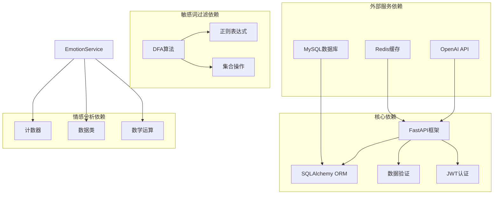

**图表来源**
- [messages.py:1-216](file://emo_outlet_api/app/api/messages.py#L1-L216)
- [sensitive_filter.py:1-142](file://emo_outlet_api/app/utils/sensitive_filter.py#L1-L142)
- [emotion_service.py:1-181](file://emo_outlet_api/app/services/emotion_service.py#L1-L181)

### 数据库关系图

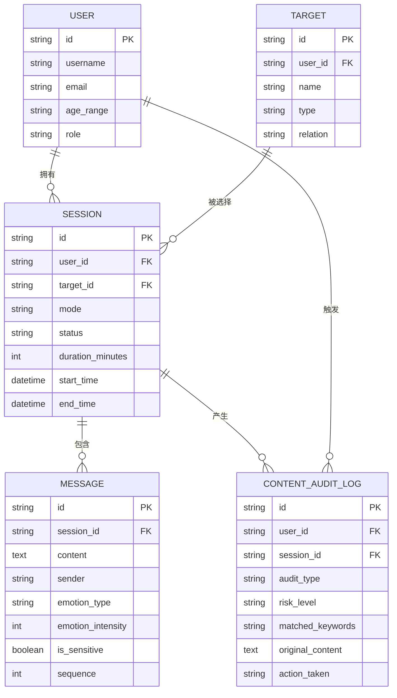

**图表来源**
- [message.py:13-45](file://emo_outlet_api/app/models/message.py#L13-L45)
- [session.py:13-75](file://emo_outlet_api/app/models/session.py#L13-L75)
- [compliance.py:31-49](file://emo_outlet_api/app/models/compliance.py#L31-L49)
- [target.py:13-55](file://emo_outlet_api/app/models/target.py#L13-L55)

**章节来源**
- [message.py:13-45](file://emo_outlet_api/app/models/message.py#L13-L45)
- [session.py:13-75](file://emo_outlet_api/app/models/session.py#L13-L75)
- [compliance.py:31-49](file://emo_outlet_api/app/models/compliance.py#L31-L49)

## 性能考虑

### 算法性能分析

#### DFA算法优势
- **时间复杂度**：O(n)，n为文本长度
- **空间复杂度**：O(ALPHABET_SIZE × M)，M为敏感词总数
- **预处理成本**：一次性构建Trie树
- **查询效率**：常数时间的状态转移

#### 性能优化策略

1. **内存优化**
   - 共享公共前缀节点
   - 动态删除不常用敏感词
   - 内存池管理

2. **计算优化**
   - 批量处理多个消息
   - 异步处理非阻塞
   - 缓存热点敏感词

3. **网络优化**
   - 连接池管理
   - 异步数据库操作
   - CDN加速静态资源

### 系统容量规划

| 指标 | 当前配置 | 推荐配置 | 说明 |
|------|----------|----------|------|
| 并发连接数 | 100 | 1000 | 支持高峰时段 |
| 请求响应时间 | <500ms | <200ms | 用户体验要求 |
| 敏感词库大小 | ~1000 | ~5000 | 支持多语言扩展 |
| 日均处理量 | 10万 | 100万 | 业务增长预期 |
| 存储容量 | 10GB | 100GB | 3个月日志保留 |

## 故障排除指南

### 常见问题诊断

#### 敏感词过滤失效

**症状**：敏感词未被检测到
**可能原因**：
1. 敏感词库配置错误
2. DFA树构建失败
3. 文本编码问题
4. 正则表达式匹配失败

**解决方案**：
1. 检查敏感词库文件路径
2. 验证DFA树构建过程
3. 确认文本编码格式
4. 测试正则表达式匹配

#### 性能问题

**症状**：响应时间过长
**可能原因**：
1. 敏感词库过大
2. 数据库连接池不足
3. 缓存未命中
4. 网络延迟过高

**解决方案**：
1. 优化敏感词库结构
2. 增加数据库连接池
3. 实施缓存策略
4. 网络优化

#### 审计日志异常

**症状**：审计日志缺失或错误
**可能原因**：
1. 数据库连接失败
2. 日志记录权限不足
3. 异步处理异常
4. 数据库表结构变更

**解决方案**：
1. 检查数据库连接状态
2. 验证日志记录权限
3. 监控异步任务队列
4. 同步数据库结构

### 错误处理机制

系统采用统一的错误处理策略：

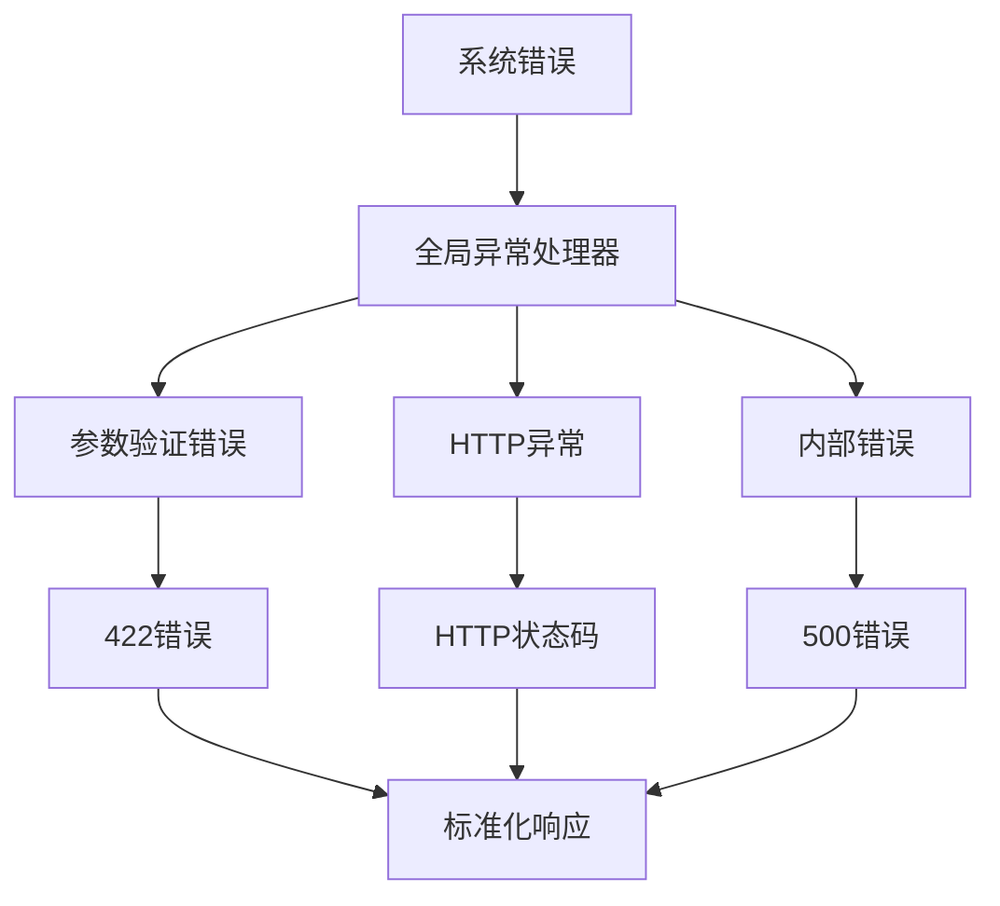

**图表来源**
- [error_handler.py:10-59](file://emo_outlet_api/app/core/error_handler.py#L10-L59)

**章节来源**
- [error_handler.py:10-59](file://emo_outlet_api/app/core/error_handler.py#L10-L59)

## 结论

Emo Outlet的敏感内容过滤系统通过多层次、多维度的安全防护机制，为用户提供了一个安全、健康、有效的心理支持平台。系统的主要优势包括：

### 技术优势
- **高效算法**：DFA算法确保了O(n)的匹配效率
- **智能检测**：结合规则匹配和上下文分析
- **实时响应**：毫秒级的敏感内容检测
- **可扩展性**：模块化设计支持功能扩展

### 安全保障
- **多重防护**：敏感词过滤、高风险检测、人工复核
- **完整审计**：所有操作都有据可查
- **及时干预**：高风险内容自动中断
- **隐私保护**：数据加密和访问控制

### 未来发展
系统具备良好的扩展性和适应性，可以随着业务发展和技术进步不断优化升级。建议重点关注：
- 更精准的AI辅助检测
- 多语言敏感词库扩展
- 实时威胁情报集成
- 智能化人工复核流程

通过持续的技术创新和严格的合规管理，Emo Outlet将继续为用户提供优质的心理健康服务。