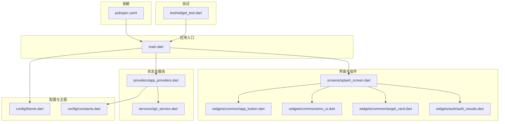
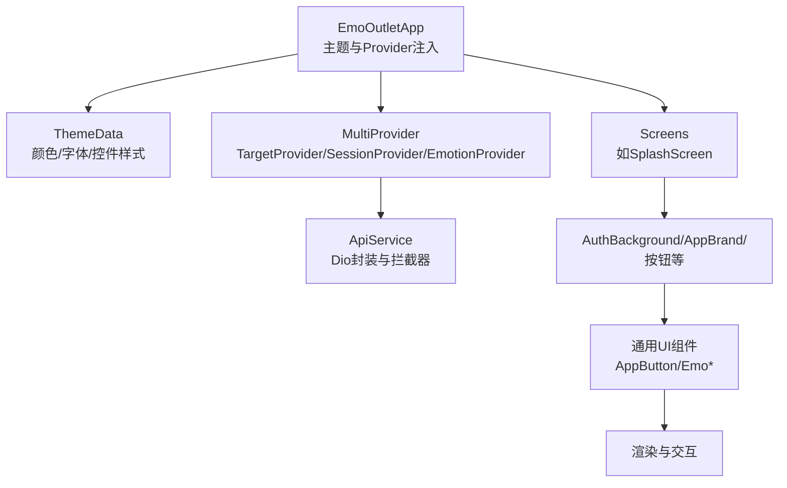
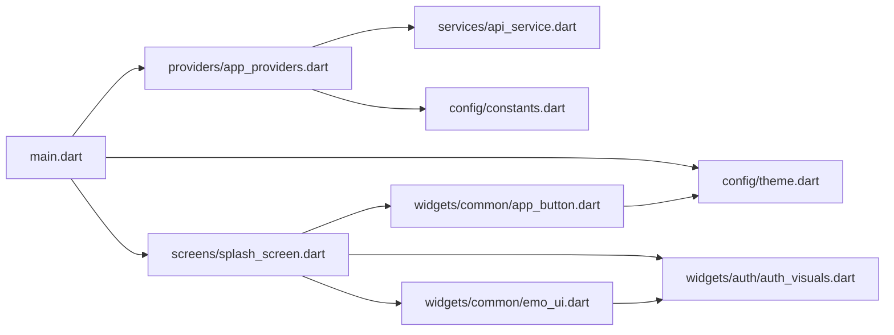

# UI组件系统

<cite>
**本文引用的文件**
- [main.dart](file://emo_outlet_app/lib/main.dart)
- [theme.dart](file://emo_outlet_app/lib/config/theme.dart)
- [app_providers.dart](file://emo_outlet_app/lib/providers/app_providers.dart)
- [constants.dart](file://emo_outlet_app/lib/config/constants.dart)
- [api_service.dart](file://emo_outlet_app/lib/services/api_service.dart)
- [splash_screen.dart](file://emo_outlet_app/lib/screens/splash_screen.dart)
- [app_button.dart](file://emo_outlet_app/lib/widgets/common/app_button.dart)
- [emo_ui.dart](file://emo_outlet_app/lib/widgets/common/emo_ui.dart)
- [target_card.dart](file://emo_outlet_app/lib/widgets/common/target_card.dart)
- [auth_visuals.dart](file://emo_outlet_app/lib/widgets/auth/auth_visuals.dart)
- [widget_test.dart](file://emo_outlet_app/test/widget_test.dart)
- [pubspec.yaml](file://emo_outlet_app/pubspec.yaml)
</cite>

## 目录
1. [简介](#简介)
2. [项目结构](#项目结构)
3. [核心组件](#核心组件)
4. [架构总览](#架构总览)
5. [详细组件分析](#详细组件分析)
6. [依赖关系分析](#依赖关系分析)
7. [性能考虑](#性能考虑)
8. [故障排查指南](#故障排查指南)
9. [结论](#结论)
10. [附录](#附录)

## 简介
本文件系统化梳理 Emo Outlet 的 Flutter UI 组件体系，覆盖设计原则、复用策略、组合模式、自定义 Widget 的创建与属性传递、事件处理机制、生命周期与状态更新、渲染优化、主题系统与样式定制、响应式设计与动画效果、使用指南与最佳实践、测试策略与可访问性支持等。目标是帮助开发者快速理解并高效扩展 UI 组件库。

## 项目结构
应用采用按功能域组织的结构：入口在 main.dart，主题与常量在 config，状态提供者在 providers，业务模型在 models，服务层在 services，屏幕页面在 screens，通用 UI 组件在 widgets，测试在 test，依赖在 pubspec.yaml。

图表来源
- [main.dart:1-97](file://emo_outlet_app/lib/main.dart#L1-L97)
- [theme.dart:1-194](file://emo_outlet_app/lib/config/theme.dart#L1-L194)
- [app_providers.dart:1-416](file://emo_outlet_app/lib/providers/app_providers.dart#L1-L416)
- [constants.dart:1-83](file://emo_outlet_app/lib/config/constants.dart#L1-L83)
- [api_service.dart:1-381](file://emo_outlet_app/lib/services/api_service.dart#L1-L381)
- [splash_screen.dart:1-139](file://emo_outlet_app/lib/screens/splash_screen.dart#L1-L139)
- [app_button.dart:1-99](file://emo_outlet_app/lib/widgets/common/app_button.dart#L1-L99)
- [emo_ui.dart:1-763](file://emo_outlet_app/lib/widgets/common/emo_ui.dart#L1-L763)
- [target_card.dart:1-97](file://emo_outlet_app/lib/widgets/common/target_card.dart#L1-L97)
- [auth_visuals.dart:1-800](file://emo_outlet_app/lib/widgets/auth/auth_visuals.dart#L1-L800)
- [widget_test.dart:1-13](file://emo_outlet_app/test/widget_test.dart#L1-L13)
- [pubspec.yaml:1-52](file://emo_outlet_app/pubspec.yaml#L1-L52)

章节来源
- [main.dart:1-97](file://emo_outlet_app/lib/main.dart#L1-L97)
- [pubspec.yaml:1-52](file://emo_outlet_app/pubspec.yaml#L1-L52)

## 核心组件
- 应用根组件与主题：EmoOutletApp 在 MaterialApp 中集中配置主题、颜色方案、字体、卡片与输入框样式，并通过 MultiProvider 注入多个 Provider 实例，统一管理全局状态。
- Provider 状态管理：TargetProvider、SessionProvider、EmotionProvider 分别负责“泄愤对象”、“会话与消息”、“情绪报告与海报”的增删改查与异步加载，均继承 ChangeNotifier 并在状态变更时通知监听者。
- 通用 UI 组件：AppButton、EmoPageScaffold、EmoTopBrandBar、EmoSectionCard、EmoRoundIconButton、EmoGradientOutlineButton、EmoTypePill、EmoAvatar、EmoProfileBubble、EmoDecorationCloud、EmoHeaderTitle、EmoMenuSheet 等，遵循单一职责与组合复用原则。
- 屏幕与页面：SplashScreen 使用 AuthBackground、品牌与按钮组件构建首屏体验，体现响应式布局与渐变动画。
- 服务与网络：ApiService 封装 Dio 请求，统一拦截器注入 Token，提供登录、会话、消息、海报等接口方法，并内置 mock 数据用于离线回退。

章节来源
- [main.dart:13-96](file://emo_outlet_app/lib/main.dart#L13-L96)
- [app_providers.dart:9-132](file://emo_outlet_app/lib/providers/app_providers.dart#L9-L132)
- [app_providers.dart:134-328](file://emo_outlet_app/lib/providers/app_providers.dart#L134-L328)
- [app_providers.dart:330-415](file://emo_outlet_app/lib/providers/app_providers.dart#L330-L415)
- [app_button.dart:4-99](file://emo_outlet_app/lib/widgets/common/app_button.dart#L4-L99)
- [emo_ui.dart:7-26](file://emo_outlet_app/lib/widgets/common/emo_ui.dart#L7-L26)
- [emo_ui.dart:28-64](file://emo_outlet_app/lib/widgets/common/emo_ui.dart#L28-L64)
- [emo_ui.dart:66-97](file://emo_outlet_app/lib/widgets/common/emo_ui.dart#L66-L97)
- [emo_ui.dart:99-127](file://emo_outlet_app/lib/widgets/common/emo_ui.dart#L99-L127)
- [emo_ui.dart:129-176](file://emo_outlet_app/lib/widgets/common/emo_ui.dart#L129-L176)
- [emo_ui.dart:178-208](file://emo_outlet_app/lib/widgets/common/emo_ui.dart#L178-L208)
- [emo_ui.dart:210-250](file://emo_outlet_app/lib/widgets/common/emo_ui.dart#L210-L250)
- [emo_ui.dart:252-272](file://emo_outlet_app/lib/widgets/common/emo_ui.dart#L252-L272)
- [emo_ui.dart:274-311](file://emo_outlet_app/lib/widgets/common/emo_ui.dart#L274-L311)
- [emo_ui.dart:313-358](file://emo_outlet_app/lib/widgets/common/emo_ui.dart#L313-L358)
- [emo_ui.dart:360-487](file://emo_outlet_app/lib/widgets/common/emo_ui.dart#L360-L487)
- [splash_screen.dart:8-139](file://emo_outlet_app/lib/screens/splash_screen.dart#L8-L139)
- [api_service.dart:5-381](file://emo_outlet_app/lib/services/api_service.dart#L5-L381)

## 架构总览
应用采用“主题集中配置 + Provider 状态管理 + 组合式 UI 组件”的架构。主题系统通过 ThemeData 统一注入颜色、字体、控件样式；Provider 将业务状态与网络交互封装为可观察的数据源；UI 组件通过组合与参数化实现高复用与一致性。

图表来源
- [main.dart:13-96](file://emo_outlet_app/lib/main.dart#L13-L96)
- [theme.dart:1-194](file://emo_outlet_app/lib/config/theme.dart#L1-L194)
- [app_providers.dart:9-132](file://emo_outlet_app/lib/providers/app_providers.dart#L9-L132)
- [api_service.dart:5-381](file://emo_outlet_app/lib/services/api_service.dart#L5-L381)
- [splash_screen.dart:8-139](file://emo_outlet_app/lib/screens/splash_screen.dart#L8-L139)
- [auth_visuals.dart:15-80](file://emo_outlet_app/lib/widgets/auth/auth_visuals.dart#L15-L80)
- [app_button.dart:4-99](file://emo_outlet_app/lib/widgets/common/app_button.dart#L4-L99)
- [emo_ui.dart:7-26](file://emo_outlet_app/lib/widgets/common/emo_ui.dart#L7-L26)

## 详细组件分析

### 设计原则与复用策略
- 单一职责：每个组件聚焦于单一 UI 功能（如按钮、卡片、菜单），便于独立测试与复用。
- 参数化与组合：通过构造函数参数控制外观与行为（如尺寸、颜色、图标、是否加载），内部组合基础控件实现一致风格。
- 主题驱动：颜色、圆角、阴影、字体等统一从主题常量与 ThemeData 获取，确保视觉一致性。

章节来源
- [app_button.dart:4-99](file://emo_outlet_app/lib/widgets/common/app_button.dart#L4-L99)
- [emo_ui.dart:66-97](file://emo_outlet_app/lib/widgets/common/emo_ui.dart#L66-L97)
- [theme.dart:3-194](file://emo_outlet_app/lib/config/theme.dart#L3-L194)

### 组合模式
- 页面容器组合：EmoPageScaffold 包裹 AuthBackground 与 SafeArea，形成统一页面骨架。
- 复合组件：EmoMenuSheet 内部组合 EmoSectionCard、Divider、InkWell 等，形成可复用的弹出菜单面板。
- 屏幕组合：SplashScreen 使用 AuthBackground、AppBrand、GradientPrimaryButton、OutlineSoftButton、SupportExpressionRow 等组合构建首屏。

章节来源
- [emo_ui.dart:7-26](file://emo_outlet_app/lib/widgets/common/emo_ui.dart#L7-L26)
- [emo_ui.dart:360-487](file://emo_outlet_app/lib/widgets/common/emo_ui.dart#L360-L487)
- [splash_screen.dart:18-139](file://emo_outlet_app/lib/screens/splash_screen.dart#L18-L139)

### 自定义 Widget 创建、属性传递与事件处理
- 属性传递：组件通过命名参数接收文本、图标、尺寸、颜色、回调等，内部根据参数决定渲染分支（如加载态、描边按钮）。
- 事件处理：按钮组件将外部回调包装为 onPressed，禁用状态下置空；InkWell/Ink 装饰容器承载点击区域，保证交互一致性。
- 示例路径：
  - [AppButton 构造与 build:14-71](file://emo_outlet_app/lib/widgets/common/app_button.dart#L14-L71)
  - [EmoGradientOutlineButton 点击与样式:129-176](file://emo_outlet_app/lib/widgets/common/emo_ui.dart#L129-L176)
  - [OutlineSoftButton 点击与样式:380-431](file://emo_outlet_app/lib/widgets/common/emo_ui.dart#L380-L431)

章节来源
- [app_button.dart:4-99](file://emo_outlet_app/lib/widgets/common/app_button.dart#L4-L99)
- [emo_ui.dart:129-176](file://emo_outlet_app/lib/widgets/common/emo_ui.dart#L129-L176)
- [emo_ui.dart:380-431](file://emo_outlet_app/lib/widgets/common/emo_ui.dart#L380-L431)

### 生命周期管理、状态更新与渲染优化
- Provider 生命周期：ChangeNotifier 在状态变更时调用 notifyListeners，触发重建；组件通过 Consumer 或自动监听 Provider 的方式响应变化。
- 渲染优化：
  - 使用 const 构造与常量样式减少对象分配。
  - 通过最小化重建范围（局部 Provider 监听）降低重绘成本。
  - 使用 Animated 系列与 CustomPainter 实现轻量动画。
- 示例路径：
  - [TargetProvider 状态变更与 notifyListeners:20-43](file://emo_outlet_app/lib/providers/app_providers.dart#L20-L43)
  - [SessionProvider 计时与消息流:157-231](file://emo_outlet_app/lib/providers/app_providers.dart#L157-L231)
  - [EmoMenuSheet 内部使用 Builder 控制重建范围:450-486](file://emo_outlet_app/lib/widgets/common/emo_ui.dart#L450-L486)

章节来源
- [app_providers.dart:9-132](file://emo_outlet_app/lib/providers/app_providers.dart#L9-L132)
- [app_providers.dart:134-328](file://emo_outlet_app/lib/providers/app_providers.dart#L134-L328)
- [emo_ui.dart:450-486](file://emo_outlet_app/lib/widgets/common/emo_ui.dart#L450-L486)

### 主题系统、颜色方案与字体配置
- 主题入口：EmoOutletApp 在 ThemeData 中设置 useMaterial3、字体、颜色方案、卡片、输入框、按钮、导航栏等样式。
- 颜色与文本：AppColors 提供主色、辅色、背景、文字、边框、情绪色与渐变；AppTextStyles 提供标题、正文、标签、按钮等文本样式。
- 圆角与间距：AppRadius、AppSpacing 提供统一的圆角半径与间距常量。
- 示例路径：
  - [主题配置与颜色注入:27-91](file://emo_outlet_app/lib/main.dart#L27-L91)
  - [颜色与文本样式定义:3-158](file://emo_outlet_app/lib/config/theme.dart#L3-L158)
  - [圆角与间距常量:185-194](file://emo_outlet_app/lib/config/theme.dart#L185-L194)

章节来源
- [main.dart:27-91](file://emo_outlet_app/lib/main.dart#L27-L91)
- [theme.dart:3-194](file://emo_outlet_app/lib/config/theme.dart#L3-L194)

### 样式定制、响应式设计与动画效果
- 样式定制：通过 ThemeData 与组件内部样式参数实现统一风格；组件内部使用 AppColors/AppTextStyles/AppRadius 保持一致性。
- 响应式设计：SplashScreen 使用 LayoutBuilder/Constraints 动态计算宽度高度，适配不同设备；按钮与文本字号随屏幕宽度调整。
- 动画效果：AuthVisuals 中使用 CustomPainter 绘制渐变云朵、光晕与装饰元素；按钮使用渐变与阴影增强触控反馈。
- 示例路径：
  - [响应式布局与动态字号:22-133](file://emo_outlet_app/lib/screens/splash_screen.dart#L22-133)
  - [渐变按钮与阴影:298-378](file://emo_outlet_app/lib/widgets/common/emo_ui.dart#L298-L378)
  - [CustomPainter 绘制云朵与光晕:738-772](file://emo_outlet_app/lib/widgets/auth/auth_visuals.dart#L738-L772)

章节来源
- [splash_screen.dart:22-133](file://emo_outlet_app/lib/screens/splash_screen.dart#L22-L133)
- [emo_ui.dart:298-378](file://emo_outlet_app/lib/widgets/common/emo_ui.dart#L298-L378)
- [auth_visuals.dart:738-772](file://emo_outlet_app/lib/widgets/auth/auth_visuals.dart#L738-L772)

### 组件使用指南与最佳实践
- 组合优先：优先使用现有组件组合页面，避免重复造轮子；如需差异化，通过参数化扩展而非新建组件。
- 主题优先：所有颜色、字体、圆角、阴影尽量来自主题常量，避免硬编码。
- 性能优先：大量列表项使用合适的 Key 与惰性加载；避免在 build 中执行耗时操作。
- 可访问性：为按钮与图标提供语义化标签与对比度充足的前景色；确保文本大小与行高满足可读性。
- 示例路径：
  - [按钮与卡片组合示例:4-99](file://emo_outlet_app/lib/widgets/common/app_button.dart#L4-L99)
  - [卡片与标签组合示例:20-77](file://emo_outlet_app/lib/widgets/common/target_card.dart#L20-L77)

章节来源
- [app_button.dart:4-99](file://emo_outlet_app/lib/widgets/common/app_button.dart#L4-L99)
- [target_card.dart:20-77](file://emo_outlet_app/lib/widgets/common/target_card.dart#L20-L77)

### 组件测试策略与可访问性支持
- 测试策略：使用 flutter_test 对应用进行冒烟测试，验证启动与基本 UI 结构；对关键组件可添加单元测试或 Widget 测试。
- 可访问性：确保文本对比度、触摸目标尺寸、键盘导航与无障碍标签；按钮与图标提供明确语义。
- 示例路径：
  - [冒烟测试示例:4-12](file://emo_outlet_app/test/widget_test.dart#L4-L12)

章节来源
- [widget_test.dart:4-12](file://emo_outlet_app/test/widget_test.dart#L4-L12)

## 依赖关系分析
- 入口依赖：main.dart 依赖 theme.dart、providers/app_providers.dart、screens/splash_screen.dart。
- Provider 依赖：providers 依赖 services/api_service.dart 与 config/constants.dart。
- 组件依赖：widgets 依赖 config/theme.dart 与 widgets/auth/auth_visuals.dart。
- 依赖图如下：

图表来源
- [main.dart:1-97](file://emo_outlet_app/lib/main.dart#L1-L97)
- [theme.dart:1-194](file://emo_outlet_app/lib/config/theme.dart#L1-L194)
- [app_providers.dart:1-416](file://emo_outlet_app/lib/providers/app_providers.dart#L1-L416)
- [constants.dart:1-83](file://emo_outlet_app/lib/config/constants.dart#L1-L83)
- [api_service.dart:1-381](file://emo_outlet_app/lib/services/api_service.dart#L1-L381)
- [splash_screen.dart:1-139](file://emo_outlet_app/lib/screens/splash_screen.dart#L1-L139)
- [auth_visuals.dart:1-800](file://emo_outlet_app/lib/widgets/auth/auth_visuals.dart#L1-L800)
- [app_button.dart:1-99](file://emo_outlet_app/lib/widgets/common/app_button.dart#L1-L99)
- [emo_ui.dart:1-763](file://emo_outlet_app/lib/widgets/common/emo_ui.dart#L1-L763)

章节来源
- [main.dart:1-97](file://emo_outlet_app/lib/main.dart#L1-L97)
- [app_providers.dart:1-416](file://emo_outlet_app/lib/providers/app_providers.dart#L1-L416)
- [api_service.dart:1-381](file://emo_outlet_app/lib/services/api_service.dart#L1-L381)

## 性能考虑
- 状态粒度：将大对象拆分为细粒度 Provider，仅在必要时触发重建。
- 列表优化：使用 ListView.builder、Key、缓存计算结果。
- 图片与资源：使用缓存图片组件与懒加载，避免阻塞主线程。
- 主题与样式：统一使用 ThemeData 与常量，减少样式计算开销。
- 动画：使用轻量 CustomPainter 与 Animated 系列，避免复杂布局动画。

## 故障排查指南
- 网络请求失败：检查 ApiService 的拦截器与错误分支，确认 mock 回退逻辑是否生效。
- 状态未更新：确认 Provider 是否调用 notifyListeners，组件是否正确监听。
- 样式异常：核对 ThemeData 与组件内部样式参数是否冲突。
- 布局错位：检查响应式参数与约束条件，确保 LayoutBuilder 使用合理。
- 示例路径：
  - [ApiService 错误处理与 mock:272-381](file://emo_outlet_app/lib/services/api_service.dart#L272-L381)
  - [Provider 状态变更与通知:20-43](file://emo_outlet_app/lib/providers/app_providers.dart#L20-L43)

章节来源
- [api_service.dart:272-381](file://emo_outlet_app/lib/services/api_service.dart#L272-L381)
- [app_providers.dart:20-43](file://emo_outlet_app/lib/providers/app_providers.dart#L20-L43)

## 结论
Emo Outlet 的 UI 组件系统以主题为核心、以 Provider 为骨架、以组合组件为肌理，形成了高内聚、低耦合且易于扩展的前端架构。通过统一的颜色、字体与间距常量，以及可复用的 UI 组件与响应式设计，开发者可以快速构建一致、美观且高性能的用户体验。

## 附录
- 依赖清单与版本：参考 pubspec.yaml 中的依赖声明与版本范围。
- 示例路径：
  - [依赖声明:9-41](file://emo_outlet_app/pubspec.yaml#L9-L41)

章节来源
- [pubspec.yaml:9-41](file://emo_outlet_app/pubspec.yaml#L9-L41)