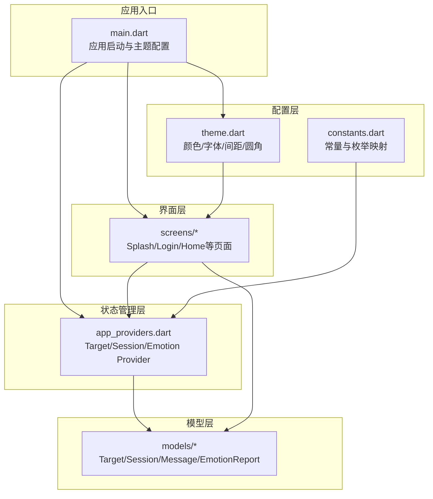
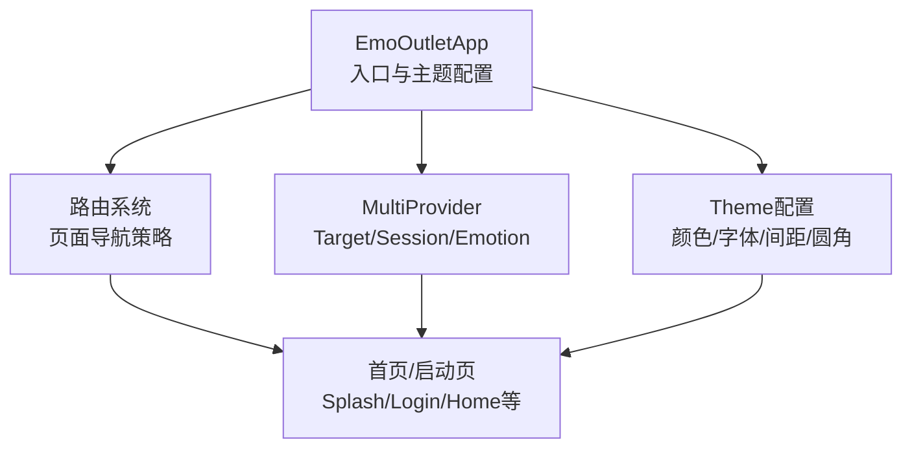
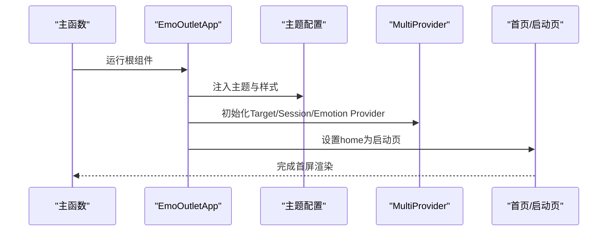
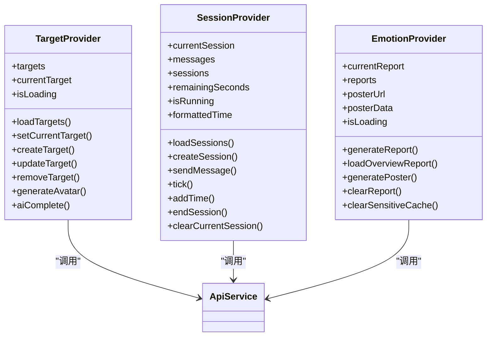
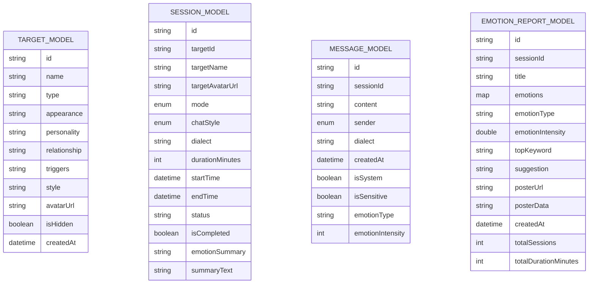
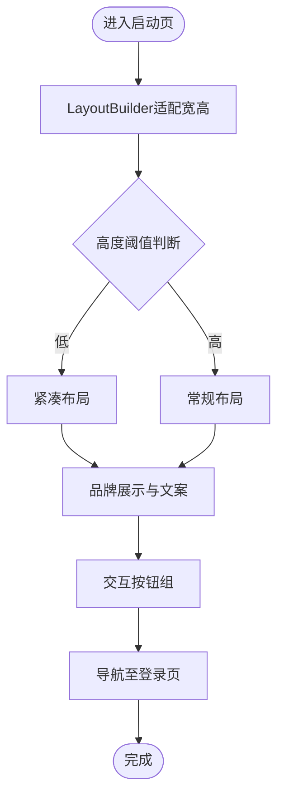
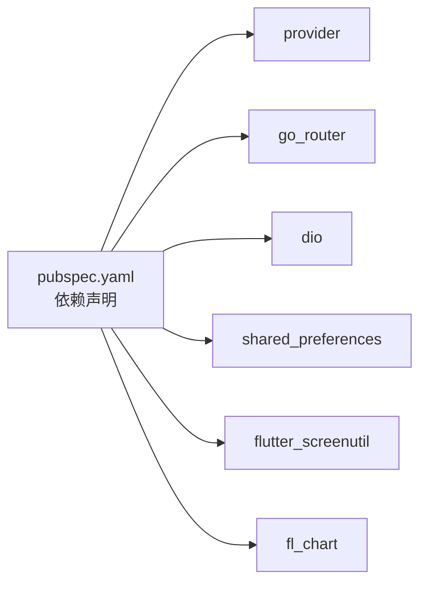

# 前端应用架构

<cite>
**本文档引用的文件**
- [emo_outlet_app/lib/main.dart](file://emo_outlet_app/lib/main.dart)
- [emo_outlet_app/pubspec.yaml](file://emo_outlet_app/pubspec.yaml)
- [emo_outlet_app/lib/config/theme.dart](file://emo_outlet_app/lib/config/theme.dart)
- [emo_outlet_app/lib/config/constants.dart](file://emo_outlet_app/lib/config/constants.dart)
- [emo_outlet_app/lib/providers/app_providers.dart](file://emo_outlet_app/lib/providers/app_providers.dart)
- [emo_outlet_app/lib/models/target_model.dart](file://emo_outlet_app/lib/models/target_model.dart)
- [emo_outlet_app/lib/models/session_model.dart](file://emo_outlet_app/lib/models/session_model.dart)
- [emo_outlet_app/lib/models/message_model.dart](file://emo_outlet_app/lib/models/message_model.dart)
- [emo_outlet_app/lib/models/emotion_report_model.dart](file://emo_outlet_app/lib/models/emotion_report_model.dart)
- [emo_outlet_app/lib/splash_screen.dart](file://emo_outlet_app/lib/splash_screen.dart)
</cite>

## 目录
1. [引言](#引言)
2. [项目结构](#项目结构)
3. [核心组件](#核心组件)
4. [架构总览](#架构总览)
5. [详细组件分析](#详细组件分析)
6. [依赖关系分析](#依赖关系分析)
7. [性能考虑](#性能考虑)
8. [故障排除指南](#故障排除指南)
9. [结论](#结论)
10. [附录](#附录)

## 引言
本文件面向Emo Outlet前端应用，系统性梳理其Flutter应用架构与实现要点，重点覆盖以下方面：
- 应用整体结构与MVC模式实践
- Provider状态管理模式与状态提升、共享机制
- 组件化设计原则与主题系统
- 启动流程、路由系统与页面导航策略
- 屏幕页面组织、页面间通信与数据传递
- 响应式设计与多平台适配
- 错误处理、加载状态管理与用户体验优化

## 项目结构
Emo Outlet前端采用基于功能域的模块化组织方式，核心目录与职责如下：
- config：全局常量、主题与合规配置
- models：领域模型与序列化/反序列化
- providers：Provider状态管理容器
- screens：页面级组件与导航入口
- services：网络服务封装（当前以ApiService占位）
- widgets：可复用UI组件
- assets/images：静态资源
- web：Web平台相关资源

图表来源
- [emo_outlet_app/lib/main.dart:1-97](file://emo_outlet_app/lib/main.dart#L1-L97)
- [emo_outlet_app/lib/config/theme.dart:1-194](file://emo_outlet_app/lib/config/theme.dart#L1-L194)
- [emo_outlet_app/lib/config/constants.dart:1-83](file://emo_outlet_app/lib/config/constants.dart#L1-L83)
- [emo_outlet_app/lib/providers/app_providers.dart:1-416](file://emo_outlet_app/lib/providers/app_providers.dart#L1-L416)
- [emo_outlet_app/lib/models/target_model.dart:1-104](file://emo_outlet_app/lib/models/target_model.dart#L1-L104)
- [emo_outlet_app/lib/models/session_model.dart:1-151](file://emo_outlet_app/lib/models/session_model.dart#L1-L151)
- [emo_outlet_app/lib/models/message_model.dart:1-61](file://emo_outlet_app/lib/models/message_model.dart#L1-L61)
- [emo_outlet_app/lib/models/emotion_report_model.dart:1-121](file://emo_outlet_app/lib/models/emotion_report_model.dart#L1-L121)

章节来源
- [emo_outlet_app/lib/main.dart:1-97](file://emo_outlet_app/lib/main.dart#L1-L97)
- [emo_outlet_app/pubspec.yaml:1-52](file://emo_outlet_app/pubspec.yaml#L1-L52)

## 核心组件
- 应用入口与主题
  - 入口通过主函数初始化并运行根组件，根组件在MaterialApp中注入多个Provider，并统一配置Material Design 3主题、字体、颜色方案与控件样式。
  - 主题系统集中于颜色、文本样式、间距、圆角与阴影常量，确保视觉一致性。

- Provider状态管理
  - TargetProvider：负责泄愤对象的增删改查、AI生成头像、AI补全信息，具备Mock回退能力。
  - SessionProvider：负责会话生命周期（创建、计时、消息收发、结束），内置Mock回复与时间轮转。
  - EmotionProvider：负责情绪报告与海报生成，支持周期报告与会话报告，具备Mock回退能力。

- 模型层
  - TargetModel：对象实体与JSON映射，含类型标签与复制方法。
  - SessionModel：会话实体，含模式、口音、聊天风格、持续时间与格式化时长。
  - MessageModel：消息实体，区分发送方、是否敏感与情感标注。
  - EmotionReportModel：报告实体，支持单次与周期两种解析工厂，含主导情绪计算。

章节来源
- [emo_outlet_app/lib/main.dart:13-96](file://emo_outlet_app/lib/main.dart#L13-L96)
- [emo_outlet_app/lib/config/theme.dart:3-194](file://emo_outlet_app/lib/config/theme.dart#L3-L194)
- [emo_outlet_app/lib/providers/app_providers.dart:9-132](file://emo_outlet_app/lib/providers/app_providers.dart#L9-L132)
- [emo_outlet_app/lib/providers/app_providers.dart:134-328](file://emo_outlet_app/lib/providers/app_providers.dart#L134-L328)
- [emo_outlet_app/lib/providers/app_providers.dart:330-415](file://emo_outlet_app/lib/providers/app_providers.dart#L330-L415)
- [emo_outlet_app/lib/models/target_model.dart:1-104](file://emo_outlet_app/lib/models/target_model.dart#L1-L104)
- [emo_outlet_app/lib/models/session_model.dart:1-151](file://emo_outlet_app/lib/models/session_model.dart#L1-L151)
- [emo_outlet_app/lib/models/message_model.dart:1-61](file://emo_outlet_app/lib/models/message_model.dart#L1-L61)
- [emo_outlet_app/lib/models/emotion_report_model.dart:1-121](file://emo_outlet_app/lib/models/emotion_report_model.dart#L1-L121)

## 架构总览
应用采用“入口配置—主题—Provider—页面”的分层架构，遵循MVC思想：
- Model：models层承载数据结构与业务数据契约
- View：screens层承载页面与UI组件
- Controller：providers层承载状态与业务逻辑控制

图表来源
- [emo_outlet_app/lib/main.dart:13-96](file://emo_outlet_app/lib/main.dart#L13-L96)
- [emo_outlet_app/lib/config/theme.dart:3-194](file://emo_outlet_app/lib/config/theme.dart#L3-L194)
- [emo_outlet_app/lib/providers/app_providers.dart:18-23](file://emo_outlet_app/lib/providers/app_providers.dart#L18-L23)

## 详细组件分析

### 启动流程与路由系统
- 启动流程
  - 主函数初始化绑定，运行根组件
  - 根组件配置MaterialApp主题与全局Provider
  - home设置为启动页，完成首屏渲染与引导跳转

- 页面导航策略
  - 当前入口直接指向启动页；实际项目建议引入路由库进行页面编排与参数传递
  - 页面间通信可通过路由参数或Provider共享状态实现

图表来源
- [emo_outlet_app/lib/main.dart:8-96](file://emo_outlet_app/lib/main.dart#L8-L96)

章节来源
- [emo_outlet_app/lib/main.dart:8-96](file://emo_outlet_app/lib/main.dart#L8-L96)

### Provider状态管理与数据流
- ChangeNotifier使用
  - 各Provider继承ChangeNotifier，在状态变更时调用notifyListeners通知订阅者
  - 提供异步操作（如API调用）与同步状态更新，保证UI及时刷新

- 状态提升与共享
  - 在根组件注册多个Provider，实现跨页面的状态共享
  - 页面通过Provider.of或Consumer访问所需状态，避免深层传递

- 错误处理与Mock回退
  - 所有外部调用均包含try/catch，失败时回退到本地Mock数据，保障离线可用性

图表来源
- [emo_outlet_app/lib/providers/app_providers.dart:9-132](file://emo_outlet_app/lib/providers/app_providers.dart#L9-L132)
- [emo_outlet_app/lib/providers/app_providers.dart:134-328](file://emo_outlet_app/lib/providers/app_providers.dart#L134-L328)
- [emo_outlet_app/lib/providers/app_providers.dart:330-415](file://emo_outlet_app/lib/providers/app_providers.dart#L330-L415)

章节来源
- [emo_outlet_app/lib/providers/app_providers.dart:9-132](file://emo_outlet_app/lib/providers/app_providers.dart#L9-L132)
- [emo_outlet_app/lib/providers/app_providers.dart:134-328](file://emo_outlet_app/lib/providers/app_providers.dart#L134-L328)
- [emo_outlet_app/lib/providers/app_providers.dart:330-415](file://emo_outlet_app/lib/providers/app_providers.dart#L330-L415)

### 模型与数据契约
- TargetModel
  - 字段覆盖名称、类型、外观、个性、关系、触发事件、风格、头像、隐藏状态与创建时间
  - 支持fromJson、toJson与copyWith，便于状态持久化与局部更新

- SessionModel
  - 包含会话模式（单向/双向）、聊天风格、方言、持续时间、起止时间与状态
  - 提供格式化时长与活跃态判断，便于UI展示与交互

- MessageModel
  - 区分用户与AI发送方，支持敏感内容标记与情感标注
  - 提供序列化与发送方判定

- EmotionReportModel
  - 支持单次会话报告与周期报告两种解析
  - 提供主导情绪与强度计算，便于可视化呈现

图表来源
- [emo_outlet_app/lib/models/target_model.dart:1-104](file://emo_outlet_app/lib/models/target_model.dart#L1-L104)
- [emo_outlet_app/lib/models/session_model.dart:1-151](file://emo_outlet_app/lib/models/session_model.dart#L1-L151)
- [emo_outlet_app/lib/models/message_model.dart:1-61](file://emo_outlet_app/lib/models/message_model.dart#L1-L61)
- [emo_outlet_app/lib/models/emotion_report_model.dart:1-121](file://emo_outlet_app/lib/models/emotion_report_model.dart#L1-L121)

章节来源
- [emo_outlet_app/lib/models/target_model.dart:1-104](file://emo_outlet_app/lib/models/target_model.dart#L1-L104)
- [emo_outlet_app/lib/models/session_model.dart:1-151](file://emo_outlet_app/lib/models/session_model.dart#L1-L151)
- [emo_outlet_app/lib/models/message_model.dart:1-61](file://emo_outlet_app/lib/models/message_model.dart#L1-L61)
- [emo_outlet_app/lib/models/emotion_report_model.dart:1-121](file://emo_outlet_app/lib/models/emotion_report_model.dart#L1-L121)

### 页面与UI组件
- 启动页（SplashScreen）
  - 采用Auth背景与品牌元素，响应式布局适配不同屏幕尺寸
  - 提供“开始释放”与“已有账号，去登录”等交互按钮

- 主题系统与样式规范
  - 颜色体系：主色、辅色、背景、文字、边框与情绪色
  - 文本样式：标题、正文、标签、按钮等多层级样式
  - 间距与圆角：统一的间距与圆角常量，确保组件一致性
  - 卡片与输入框：统一的卡片与输入框样式主题

图表来源
- [emo_outlet_app/lib/splash_screen.dart:17-138](file://emo_outlet_app/lib/splash_screen.dart#L17-L138)

章节来源
- [emo_outlet_app/lib/splash_screen.dart:1-139](file://emo_outlet_app/lib/splash_screen.dart#L1-L139)
- [emo_outlet_app/lib/config/theme.dart:3-194](file://emo_outlet_app/lib/config/theme.dart#L3-L194)

## 依赖关系分析
- 外部依赖
  - provider：状态管理
  - go_router：路由（声明式路由）
  - dio：网络请求
  - shared_preferences：本地存储
  - flutter_screenutil：响应式适配
  - fl_chart：图表
  - 其他工具类：intl、uuid、image_picker、cached_network_image等

- 内部依赖
  - screens依赖providers与models
  - providers依赖models与services（ApiService）
  - config为全局常量与主题提供支撑

图表来源
- [emo_outlet_app/pubspec.yaml:9-40](file://emo_outlet_app/pubspec.yaml#L9-L40)

章节来源
- [emo_outlet_app/pubspec.yaml:1-52](file://emo_outlet_app/pubspec.yaml#L1-L52)

## 性能考虑
- 状态最小化更新
  - 使用ChangeNotifier仅在必要时notifyListeners，避免过度重建
- 列表渲染优化
  - 使用ListView.builder等惰性渲染组件
- 网络与缓存
  - API失败时使用Mock数据，减少等待时间
- 主题与样式
  - 将样式集中定义，避免重复计算与样式抖动
- 响应式与多平台
  - 使用LayoutBuilder与ScreenUtil适配不同设备密度与尺寸

## 故障排除指南
- 网络异常
  - Provider中的API调用均包含异常捕获，失败时回退到Mock数据
  - 建议在UI层显示“离线提示”或“重试按钮”

- 状态未更新
  - 确认在状态变更后调用了notifyListeners
  - 检查Provider作用域是否正确

- 导航问题
  - 若使用路由库，确认路由配置与页面注册一致

章节来源
- [emo_outlet_app/lib/providers/app_providers.dart:20-38](file://emo_outlet_app/lib/providers/app_providers.dart#L20-L38)
- [emo_outlet_app/lib/providers/app_providers.dart:157-174](file://emo_outlet_app/lib/providers/app_providers.dart#L157-L174)
- [emo_outlet_app/lib/providers/app_providers.dart:345-379](file://emo_outlet_app/lib/providers/app_providers.dart#L345-L379)

## 结论
Emo Outlet前端应用以Provider为核心的状态管理与清晰的MVC分层，结合统一的主题系统与响应式布局，构建了稳定且可扩展的UI框架。通过Mock回退机制与完善的模型层，提升了离线可用性与数据一致性。后续可在路由系统、页面导航与组件复用上进一步深化，以支持更复杂的业务场景与更好的开发体验。

## 附录
- 常量与枚举
  - AppConstants：基础配置、方言与聊天风格映射、会话时长、权限键名等
- 设计原则
  - 统一的颜色、字体、间距与圆角规范
  - 组件化与可复用性优先
  - 用户体验优先：加载状态、错误提示与无障碍

章节来源
- [emo_outlet_app/lib/config/constants.dart:1-83](file://emo_outlet_app/lib/config/constants.dart#L1-L83)
- [emo_outlet_app/lib/config/theme.dart:3-194](file://emo_outlet_app/lib/config/theme.dart#L3-L194)