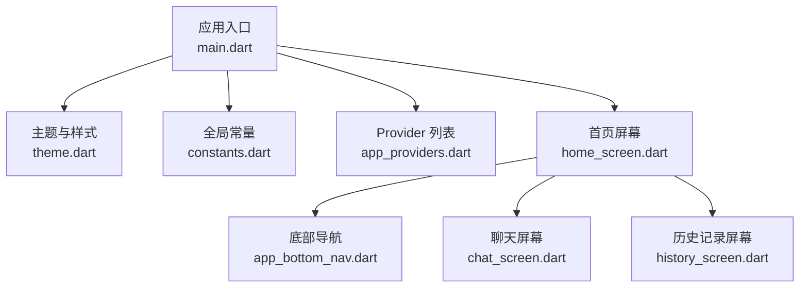
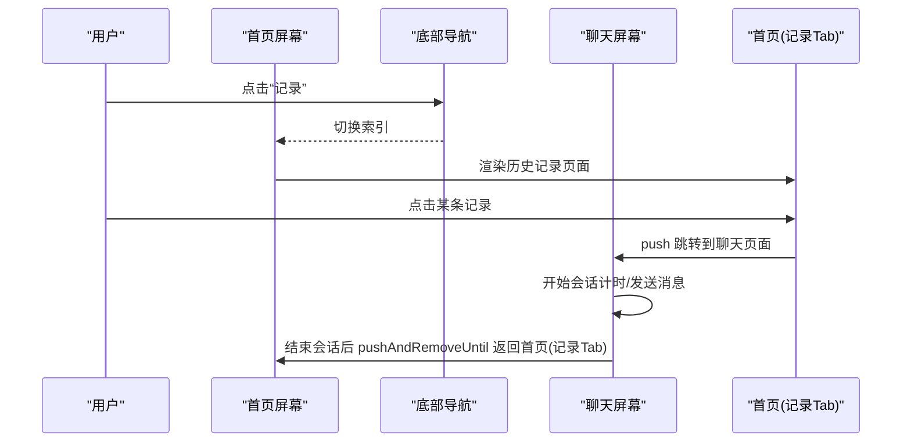
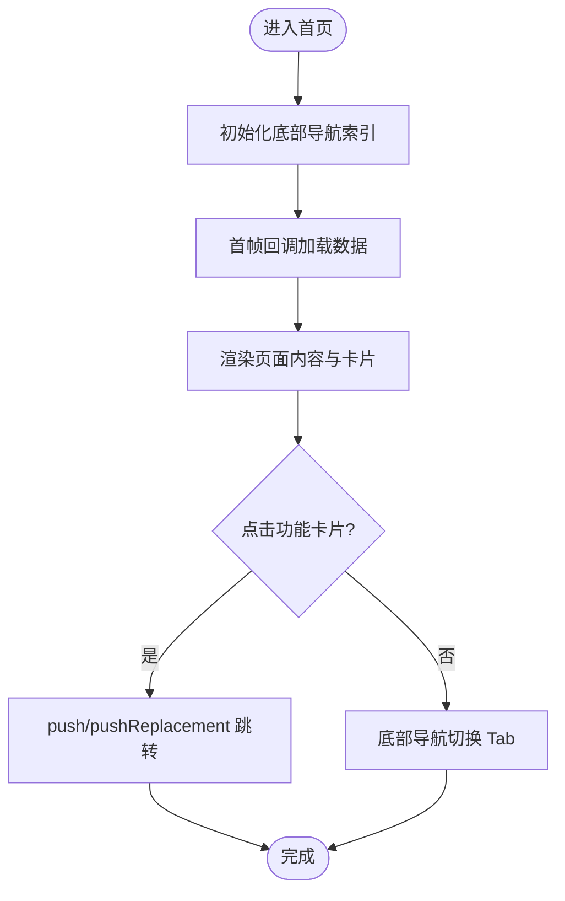
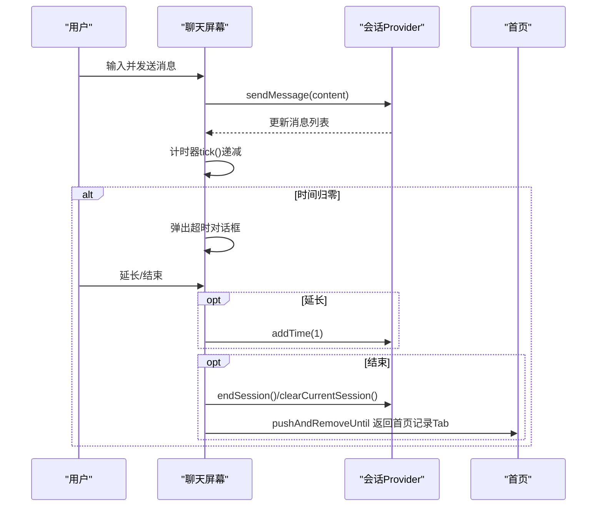
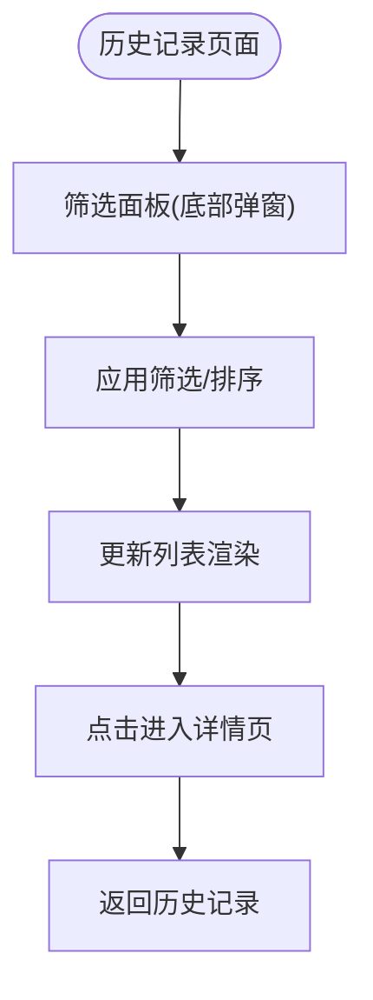
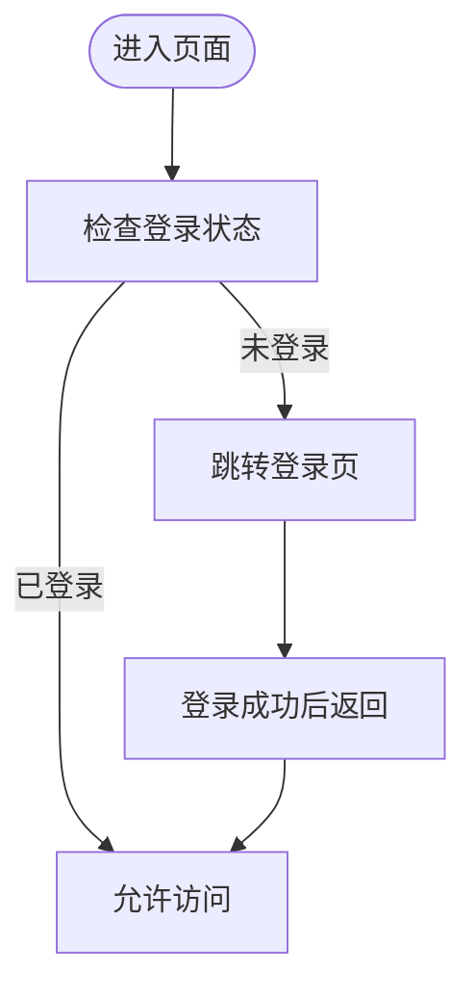
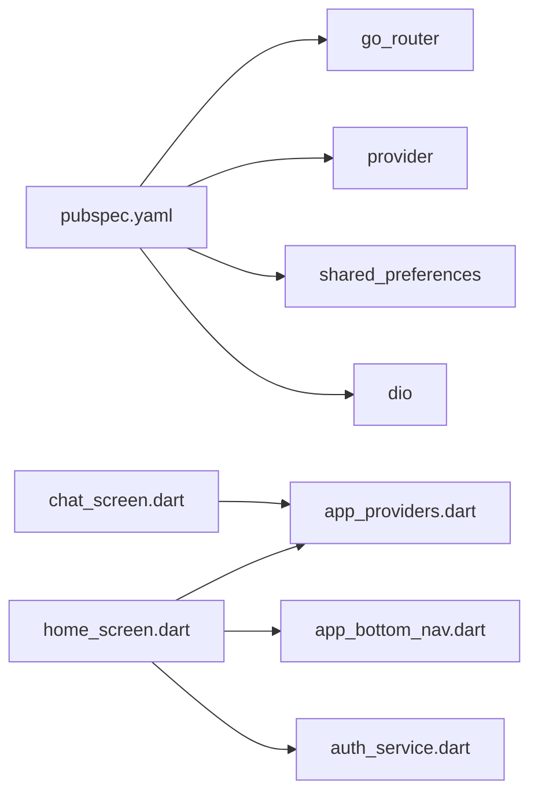

# 屏幕页面与导航

<cite>
**本文引用的文件**
- [main.dart](file://emo_outlet_app/lib/main.dart)
- [pubspec.yaml](file://emo_outlet_app/pubspec.yaml)
- [theme.dart](file://emo_outlet_app/lib/config/theme.dart)
- [constants.dart](file://emo_outlet_app/lib/config/constants.dart)
- [app_providers.dart](file://emo_outlet_app/lib/providers/app_providers.dart)
- [home_screen.dart](file://emo_outlet_app/lib/screens/home_screen.dart)
- [chat_screen.dart](file://emo_outlet_app/lib/screens/chat_screen.dart)
- [history_screen.dart](file://emo_outlet_app/lib/screens/history_screen.dart)
- [app_bottom_nav.dart](file://emo_outlet_app/lib/widgets/common/app_bottom_nav.dart)
- [auth_service.dart](file://emo_outlet_app/lib/services/auth_service.dart)
</cite>

## 目录
1. [简介](#简介)
2. [项目结构](#项目结构)
3. [核心组件](#核心组件)
4. [架构总览](#架构总览)
5. [详细组件分析](#详细组件分析)
6. [依赖分析](#依赖分析)
7. [性能考量](#性能考量)
8. [故障排查指南](#故障排查指南)
9. [结论](#结论)
10. [附录](#附录)

## 简介
本文件面向 Emo Outlet 的屏幕页面与导航系统，系统性梳理页面组织结构、路由设计与导航策略，说明页面间跳转方式、参数传递与返回机制；记录页面生命周期管理、状态保持与内存优化；解释导航拦截、权限控制与页面保护机制；给出页面动画效果、过渡动画与用户体验优化建议；提供导航架构图、路由配置与页面设计规范；并记录页面测试方法与性能监控策略。

## 项目结构
- 应用入口通过主程序启动 Material 应用，并在主题中统一配置字体、颜色与控件样式。
- 页面采用底部导航栏组织首页、对象、历史记录与个人中心四大 Tab。
- 屏幕层包含首页、聊天会话、历史记录等页面；状态通过 Provider 管理；导航使用 Flutter 内置 Navigator 与底部导航配合实现。

图表来源
- [main.dart:1-97](file://emo_outlet_app/lib/main.dart#L1-L97)
- [theme.dart:1-194](file://emo_outlet_app/lib/config/theme.dart#L1-L194)
- [constants.dart:1-83](file://emo_outlet_app/lib/config/constants.dart#L1-L83)
- [app_providers.dart:1-416](file://emo_outlet_app/lib/providers/app_providers.dart#L1-L416)
- [home_screen.dart:1-325](file://emo_outlet_app/lib/screens/home_screen.dart#L1-L325)
- [app_bottom_nav.dart:1-106](file://emo_outlet_app/lib/widgets/common/app_bottom_nav.dart#L1-L106)
- [chat_screen.dart:1-538](file://emo_outlet_app/lib/screens/chat_screen.dart#L1-L538)
- [history_screen.dart:1-774](file://emo_outlet_app/lib/screens/history_screen.dart#L1-L774)

章节来源
- [main.dart:1-97](file://emo_outlet_app/lib/main.dart#L1-L97)
- [pubspec.yaml:1-52](file://emo_outlet_app/pubspec.yaml#L1-L52)

## 核心组件
- 应用入口与主题
  - 入口文件初始化 Provider 并配置 MaterialApp 主题，设置标题、调试开关与全局样式。
  - 主题文件集中定义颜色、文本样式、圆角与阴影等视觉规范。
- 导航与页面组织
  - 首页屏幕承载四个 Tab 页面容器，底部导航通过索引切换当前 Tab。
  - 聊天屏幕负责会话交互、计时与结束流程；历史记录屏幕提供筛选、排序与详情跳转。
- 状态管理
  - Provider 提供目标、会话与情绪报告的状态读写，支持加载、创建、更新、删除与清理。
- 权限与认证
  - 认证服务封装登录、注册、游客登录、登出与用户信息持久化，支持后端失败时的本地回退。

章节来源
- [main.dart:13-96](file://emo_outlet_app/lib/main.dart#L13-L96)
- [theme.dart:3-194](file://emo_outlet_app/lib/config/theme.dart#L3-L194)
- [home_screen.dart:19-63](file://emo_outlet_app/lib/screens/home_screen.dart#L19-L63)
- [app_bottom_nav.dart:6-67](file://emo_outlet_app/lib/widgets/common/app_bottom_nav.dart#L6-L67)
- [app_providers.dart:9-132](file://emo_outlet_app/lib/providers/app_providers.dart#L9-L132)
- [auth_service.dart:7-165](file://emo_outlet_app/lib/services/auth_service.dart#L7-L165)

## 架构总览
- 页面组织
  - 首页 Tab 容器内含首页内容区、对象列表、历史记录与个人中心。
  - 聊天页面独立于 Tab 容器，作为会话流程中的页面存在。
- 导航策略
  - 使用底部导航切换 Tab；部分功能卡片使用 push 或 pushReplacement 进行页面跳转。
  - 聊天结束时使用 pushAndRemoveUntil 返回首页并清理历史栈。
- 状态与生命周期
  - 首页在首次构建后异步加载目标、会话与报告；聊天页面定时器与输入框在生命周期内管理。
  - Provider 在页面重建时保持状态，避免重复网络请求。

图表来源
- [home_screen.dart:46-62](file://emo_outlet_app/lib/screens/home_screen.dart#L46-L62)
- [history_screen.dart:155-167](file://emo_outlet_app/lib/screens/history_screen.dart#L155-L167)
- [chat_screen.dart:237-242](file://emo_outlet_app/lib/screens/chat_screen.dart#L237-L242)

章节来源
- [home_screen.dart:19-63](file://emo_outlet_app/lib/screens/home_screen.dart#L19-L63)
- [history_screen.dart:155-167](file://emo_outlet_app/lib/screens/history_screen.dart#L155-L167)
- [chat_screen.dart:237-242](file://emo_outlet_app/lib/screens/chat_screen.dart#L237-L242)

## 详细组件分析

### 首页与底部导航
- 组织结构
  - 首页屏幕包含顶部品牌栏、欢迎语、功能卡片与网格布局的快捷入口。
  - 底部导航固定四个标签，图标与文字随选中状态变化。
- 导航与跳转
  - 功能卡片点击可使用 push 或 pushReplacement 跳转至目标页面。
  - 首页 Tab 内部通过索引切换不同子页面，避免额外入栈。
- 生命周期与状态
  - 首页在首帧回调中加载目标列表、会话历史与概览报告，避免阻塞 UI。
- 参数与返回
  - 通过构造参数传入初始索引；Tab 内部通过 setState 切换当前页面。

图表来源
- [home_screen.dart:28-62](file://emo_outlet_app/lib/screens/home_screen.dart#L28-L62)
- [app_bottom_nav.dart:69-104](file://emo_outlet_app/lib/widgets/common/app_bottom_nav.dart#L69-L104)

章节来源
- [home_screen.dart:19-63](file://emo_outlet_app/lib/screens/home_screen.dart#L19-L63)
- [app_bottom_nav.dart:6-106](file://emo_outlet_app/lib/widgets/common/app_bottom_nav.dart#L6-L106)

### 聊天屏幕与会话流程
- 组织结构
  - 顶部显示目标头像、模式标识与倒计时；中部为消息列表；底部为输入与发送区域。
- 导航与跳转
  - 返回按钮使用 pop 返回上一页；结束会话时使用 pushAndRemoveUntil 清空历史栈并回到首页记录 Tab。
- 生命周期与状态
  - 初始化时根据会话模式填充示例消息；定时器每秒递减剩余时间；超时弹窗提供延长或结束选项。
- 参数与返回
  - 会话模式、目标信息通过 Provider 传递；结束会话后清理当前会话状态并返回首页。

图表来源
- [chat_screen.dart:135-249](file://emo_outlet_app/lib/screens/chat_screen.dart#L135-L249)
- [app_providers.dart:234-321](file://emo_outlet_app/lib/providers/app_providers.dart#L234-L321)

章节来源
- [chat_screen.dart:13-538](file://emo_outlet_app/lib/screens/chat_screen.dart#L13-L538)
- [app_providers.dart:134-321](file://emo_outlet_app/lib/providers/app_providers.dart#L134-L321)

### 历史记录与筛选
- 组织结构
  - 支持按时间范围、模式、情绪标签与排序方式筛选；支持搜索与长按删除。
- 导航与跳转
  - 点击记录项进入详情页；底部弹窗提供筛选面板。
- 生命周期与状态
  - 筛选条件保存在页面状态中，过滤与排序在渲染前计算。
- 参数与返回
  - 详情页通过构造参数接收记录模型；返回时保持原页面状态。

图表来源
- [history_screen.dart:137-182](file://emo_outlet_app/lib/screens/history_screen.dart#L137-L182)
- [history_screen.dart:333-473](file://emo_outlet_app/lib/screens/history_screen.dart#L333-L473)

章节来源
- [history_screen.dart:8-774](file://emo_outlet_app/lib/screens/history_screen.dart#L8-L774)

### 认证与页面保护
- 登录与注册
  - 支持手机号/邮箱登录、注册（携带合规版本与年龄区间）、游客登录。
  - 成功后持久化用户信息与访问令牌，失败时走本地 mock 回退。
- 登出与清理
  - 登出时清除用户与令牌，Provider 中的敏感缓存可在注销时清理。
- 页面保护
  - 可在页面构建前检查登录状态，未登录则跳转至登录页；结合底部导航与路由拦截实现统一保护。

图表来源
- [auth_service.dart:18-43](file://emo_outlet_app/lib/services/auth_service.dart#L18-L43)
- [auth_service.dart:46-97](file://emo_outlet_app/lib/services/auth_service.dart#L46-L97)
- [auth_service.dart:128-138](file://emo_outlet_app/lib/services/auth_service.dart#L128-L138)

章节来源
- [auth_service.dart:7-165](file://emo_outlet_app/lib/services/auth_service.dart#L7-L165)

## 依赖分析
- 外部依赖
  - go_router 用于声明式路由（在 pubspec 中声明），但当前屏幕层使用 Navigator 实现跳转。
  - Provider 用于状态管理；shared_preferences 用于本地存储；dio 用于网络请求。
- 内部耦合
  - 屏幕层依赖 Provider 与服务层；底部导航与首页屏幕强关联；聊天屏幕依赖会话 Provider。
- 循环依赖
  - 当前结构未见循环导入；Provider 与屏幕之间为单向依赖。

图表来源
- [pubspec.yaml:9-41](file://emo_outlet_app/pubspec.yaml#L9-L41)
- [home_screen.dart:1-17](file://emo_outlet_app/lib/screens/home_screen.dart#L1-L17)
- [chat_screen.dart:1-11](file://emo_outlet_app/lib/screens/chat_screen.dart#L1-L11)
- [app_bottom_nav.dart:1-5](file://emo_outlet_app/lib/widgets/common/app_bottom_nav.dart#L1-L5)
- [app_providers.dart:1-7](file://emo_outlet_app/lib/providers/app_providers.dart#L1-L7)

章节来源
- [pubspec.yaml:1-52](file://emo_outlet_app/pubspec.yaml#L1-L52)
- [home_screen.dart:1-17](file://emo_outlet_app/lib/screens/home_screen.dart#L1-L17)
- [chat_screen.dart:1-11](file://emo_outlet_app/lib/screens/chat_screen.dart#L1-L11)
- [app_bottom_nav.dart:1-5](file://emo_outlet_app/lib/widgets/common/app_bottom_nav.dart#L1-L5)
- [app_providers.dart:1-7](file://emo_outlet_app/lib/providers/app_providers.dart#L1-L7)

## 性能考量
- 状态保持与内存优化
  - 首页在首帧回调中一次性加载目标、会话与报告，避免重复请求；Provider 在页面重建时保留状态。
  - 聊天屏幕在 dispose 中释放控制器与定时器，防止内存泄漏。
- 网络与回退策略
  - API 调用失败时使用 mock 数据回退，保证用户体验连续性。
- 渲染与交互
  - 列表使用惰性渲染与局部刷新；底部弹窗筛选减少全屏重绘。

章节来源
- [home_screen.dart:37-42](file://emo_outlet_app/lib/screens/home_screen.dart#L37-L42)
- [chat_screen.dart:127-133](file://emo_outlet_app/lib/screens/chat_screen.dart#L127-L133)
- [app_providers.dart:21-38](file://emo_outlet_app/lib/providers/app_providers.dart#L21-L38)
- [app_providers.dart:158-174](file://emo_outlet_app/lib/providers/app_providers.dart#L158-L174)

## 故障排查指南
- 常见问题
  - 页面无数据：检查 Provider 是否在首帧回调中加载；确认网络请求是否抛出异常导致走 mock。
  - 聊天不计时：确认定时器是否初始化；检查会话状态是否运行中。
  - 返回栈异常：结束会话时使用 pushAndRemoveUntil 清理历史栈；确保传入正确的判断条件。
- 调试建议
  - 在关键节点打印日志（如加载完成、消息发送、会话结束）。
  - 使用断点定位 Provider 状态变更与页面重建时机。

章节来源
- [home_screen.dart:37-42](file://emo_outlet_app/lib/screens/home_screen.dart#L37-L42)
- [chat_screen.dart:135-149](file://emo_outlet_app/lib/screens/chat_screen.dart#L135-L149)
- [chat_screen.dart:237-242](file://emo_outlet_app/lib/screens/chat_screen.dart#L237-L242)

## 结论
本项目采用底部导航与页面容器组合的方式组织首页四大 Tab，辅以独立的聊天页面完成会话流程。状态管理通过 Provider 实现，认证与本地存储保障用户体验连续性。当前屏幕层以 Navigator 为主，若需更强的路由控制与拦截能力，可结合 go_router 进一步完善路由配置与页面保护策略。

## 附录

### 页面动画与过渡建议
- 页面切换
  - 使用 MaterialPageRoute 的默认过渡；如需自定义，可在路由层配置转场动画。
- 底部导航
  - Tab 切换建议使用平滑的淡入淡出或位移动画，提升可感知性。
- 对话框与弹窗
  - 底部筛选面板使用缩放与遮罩动画，增强层级感。

### 页面设计规范
- 颜色与字体
  - 使用主题文件中的主色、辅助色与文本样式，确保一致性。
- 圆角与阴影
  - 卡片与按钮统一使用圆角与阴影，遵循设计系统。
- 布局间距
  - 使用统一的间距常量，保证页面元素对齐与呼吸感。

章节来源
- [theme.dart:3-194](file://emo_outlet_app/lib/config/theme.dart#L3-L194)
- [constants.dart:160-194](file://emo_outlet_app/lib/config/constants.dart#L160-L194)

### 路由配置与导航策略
- 当前实现
  - 屏幕层使用 Navigator 实现页面跳转；底部导航通过索引切换 Tab。
- 建议扩展
  - 引入 go_router 进行声明式路由配置，统一处理拦截、权限与参数传递。
  - 为每个页面定义命名路由，便于跨模块跳转与深度链接。

章节来源
- [pubspec.yaml:16-17](file://emo_outlet_app/pubspec.yaml#L16-L17)
- [home_screen.dart:166-170](file://emo_outlet_app/lib/screens/home_screen.dart#L166-L170)
- [history_screen.dart:160-164](file://emo_outlet_app/lib/screens/history_screen.dart#L160-L164)