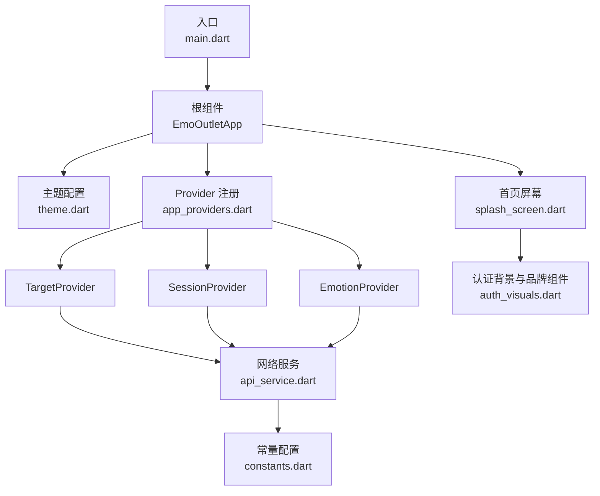
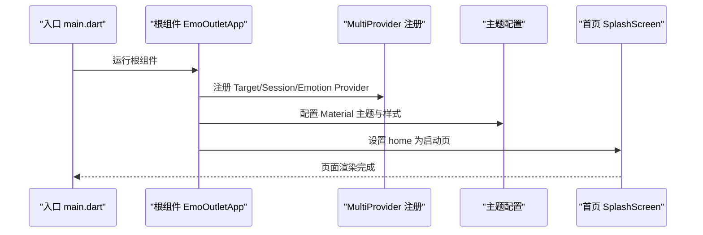
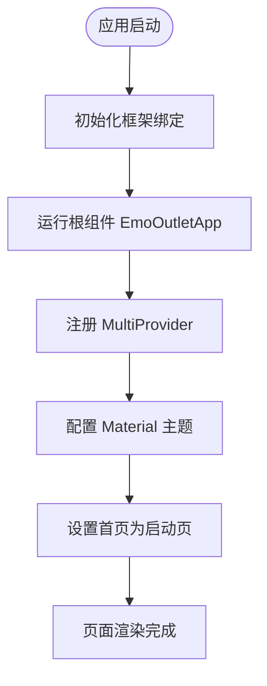
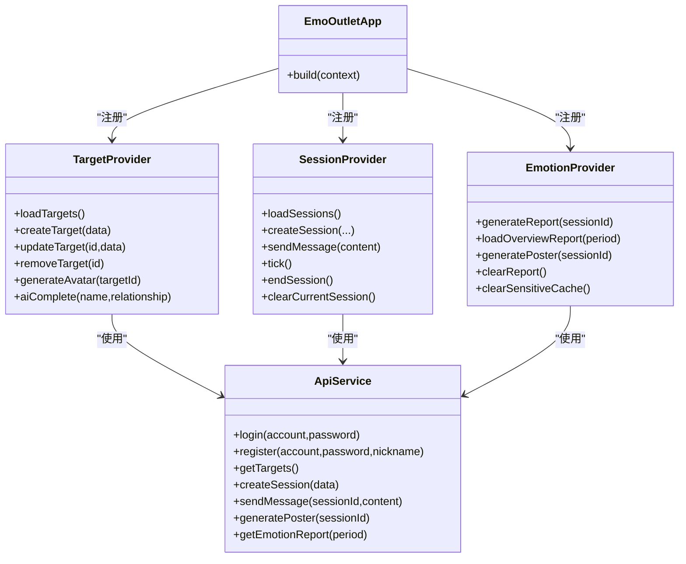
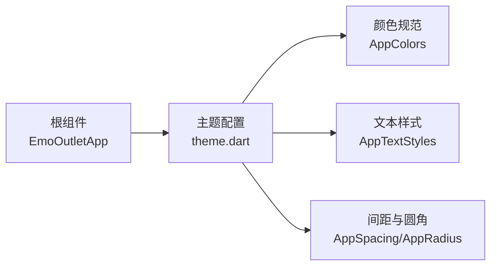
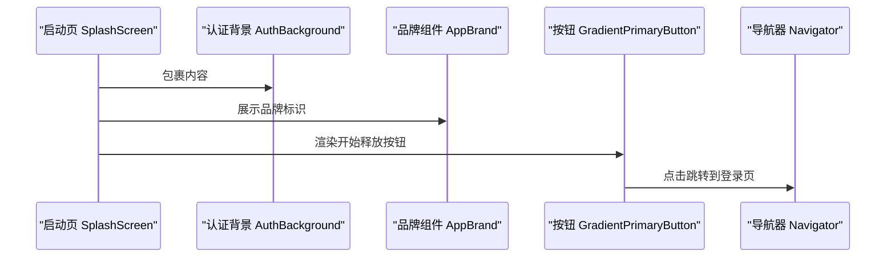
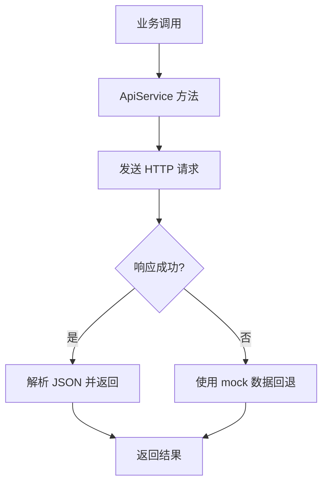
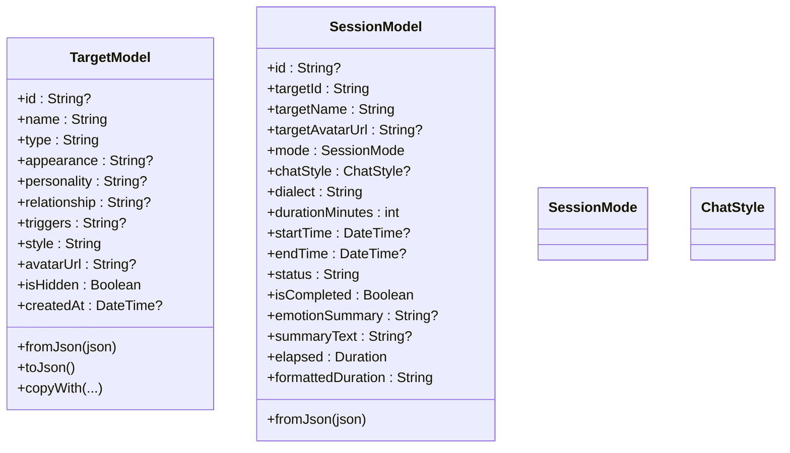
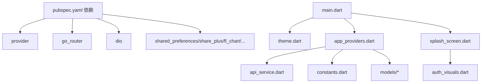

# 应用结构与启动流程

<cite>
**本文引用的文件**
- [main.dart](file://emo_outlet_app/lib/main.dart)
- [app_providers.dart](file://emo_outlet_app/lib/providers/app_providers.dart)
- [theme.dart](file://emo_outlet_app/lib/config/theme.dart)
- [constants.dart](file://emo_outlet_app/lib/config/constants.dart)
- [api_service.dart](file://emo_outlet_app/lib/services/api_service.dart)
- [splash_screen.dart](file://emo_outlet_app/lib/screens/splash_screen.dart)
- [target_model.dart](file://emo_outlet_app/lib/models/target_model.dart)
- [session_model.dart](file://emo_outlet_app/lib/models/session_model.dart)
- [auth_visuals.dart](file://emo_outlet_app/lib/widgets/auth/auth_visuals.dart)
- [pubspec.yaml](file://emo_outlet_app/pubspec.yaml)
- [README.md](file://emo_outlet_app/README.md)
</cite>

## 目录
1. [引言](#引言)
2. [项目结构](#项目结构)
3. [核心组件](#核心组件)
4. [架构总览](#架构总览)
5. [组件详解](#组件详解)
6. [依赖关系分析](#依赖关系分析)
7. [性能考量](#性能考量)
8. [故障排查指南](#故障排查指南)
9. [结论](#结论)
10. [附录](#附录)

## 引言
本文件系统性梳理 Emo Outlet Flutter 应用的结构与启动流程，重点覆盖以下方面：
- 应用入口点 main.dart 的初始化流程与根组件 EmoOutletApp 的构建过程
- 启动时的状态初始化、主题配置与 Provider 注册机制
- MultiProvider 的使用方式、Provider 间的依赖关系与状态共享策略
- 应用生命周期管理、调试模式配置与国际化支持现状
- 应用配置最佳实践、性能优化建议与内存管理策略
- 应用结构图与组件层次关系说明

## 项目结构
Emo Outlet Flutter 项目采用按功能域分层的组织方式，核心模块如下：
- 入口与根组件：lib/main.dart
- 配置：lib/config/theme.dart、lib/config/constants.dart
- 状态管理：lib/providers/app_providers.dart
- 网络服务：lib/services/api_service.dart
- 屏幕与页面：lib/screens/*
- 模型：lib/models/*
- 自定义组件：lib/widgets/*
- 依赖声明：pubspec.yaml

**图表来源**
- [main.dart:8-96](file://emo_outlet_app/lib/main.dart#L8-L96)
- [theme.dart:1-194](file://emo_outlet_app/lib/config/theme.dart#L1-L194)
- [app_providers.dart:1-416](file://emo_outlet_app/lib/providers/app_providers.dart#L1-L416)
- [splash_screen.dart:1-139](file://emo_outlet_app/lib/screens/splash_screen.dart#L1-L139)
- [auth_visuals.dart:1-800](file://emo_outlet_app/lib/widgets/auth/auth_visuals.dart#L1-L800)
- [api_service.dart:1-381](file://emo_outlet_app/lib/services/api_service.dart#L1-L381)
- [constants.dart:1-83](file://emo_outlet_app/lib/config/constants.dart#L1-L83)

**章节来源**
- [main.dart:8-96](file://emo_outlet_app/lib/main.dart#L8-L96)
- [pubspec.yaml:1-52](file://emo_outlet_app/pubspec.yaml#L1-L52)

## 核心组件
- 应用入口与初始化
  - main.dart 中通过 WidgetsFlutterBinding.ensureInitialized() 初始化框架绑定，随后直接运行根组件 EmoOutletApp。
- 根组件 EmoOutletApp
  - 使用 MultiProvider 注册三大 Provider：TargetProvider、SessionProvider、EmotionProvider，实现跨组件状态共享。
  - 在 MaterialApp 中集中配置主题、字体、颜色方案、卡片样式、输入框样式等。
  - home 指向启动页 SplashScreen。

**章节来源**
- [main.dart:8-96](file://emo_outlet_app/lib/main.dart#L8-L96)

## 架构总览
Emo Outlet 采用“根组件集中配置 + Provider 状态管理”的架构模式：
- 根组件负责主题与 Provider 的一次性注入
- Provider 负责业务状态与网络交互
- 屏幕组件通过 Provider 读取状态并触发变更
- 网络层通过 ApiService 统一处理请求与拦截器

**图表来源**
- [main.dart:8-96](file://emo_outlet_app/lib/main.dart#L8-L96)
- [splash_screen.dart:18-139](file://emo_outlet_app/lib/screens/splash_screen.dart#L18-L139)

## 组件详解

### 启动流程与初始化
- 入口初始化
  - 确保 Flutter 框架绑定已初始化
  - 直接运行 EmoOutletApp 根组件
- 根组件构建
  - 注册三个 ChangeNotifierProvider，分别对应目标、会话与情绪相关状态
  - 集中配置 ThemeData，启用 Material3、设置字体与颜色方案
  - 将 home 设为启动页

**图表来源**
- [main.dart:8-96](file://emo_outlet_app/lib/main.dart#L8-L96)

**章节来源**
- [main.dart:8-96](file://emo_outlet_app/lib/main.dart#L8-L96)

### Provider 注册与状态共享
- 注册方式
  - 使用 MultiProvider 在根组件一次性注册多个 ChangeNotifierProvider
  - 三个 Provider 分别负责目标、会话与情绪相关业务状态
- Provider 间关系
  - 无直接依赖：三者独立维护各自状态
  - 通过 ApiService 统一访问后端接口，形成横向耦合而非纵向继承
- 状态共享策略
  - 通过 Provider 的 ChangeNotifier 通知订阅者刷新 UI
  - 屏幕组件通过 Provider.of 或 Consumer 访问所需状态

**图表来源**
- [main.dart:18-24](file://emo_outlet_app/lib/main.dart#L18-L24)
- [app_providers.dart:10-132](file://emo_outlet_app/lib/providers/app_providers.dart#L10-L132)
- [app_providers.dart:135-328](file://emo_outlet_app/lib/providers/app_providers.dart#L135-L328)
- [app_providers.dart:331-415](file://emo_outlet_app/lib/providers/app_providers.dart#L331-L415)
- [api_service.dart:5-381](file://emo_outlet_app/lib/services/api_service.dart#L5-L381)

**章节来源**
- [main.dart:18-24](file://emo_outlet_app/lib/main.dart#L18-L24)
- [app_providers.dart:10-132](file://emo_outlet_app/lib/providers/app_providers.dart#L10-L132)
- [app_providers.dart:135-328](file://emo_outlet_app/lib/providers/app_providers.dart#L135-L328)
- [app_providers.dart:331-415](file://emo_outlet_app/lib/providers/app_providers.dart#L331-L415)

### 主题与样式配置
- 主题配置
  - 启用 Material3，设置种子色与颜色方案
  - 统一字体 PingFangSC，定义标题、正文、标签等文本样式
  - 配置 AppBar、BottomNavigationBar、ElevatedButton、InputDecoration、Card 等组件主题
- 颜色与间距
  - AppColors 提供主色、辅色、背景色、文字色、阴影等
  - AppTextStyles、AppSpacing、AppRadius 提供统一的排版与圆角规范

**图表来源**
- [theme.dart:1-194](file://emo_outlet_app/lib/config/theme.dart#L1-L194)
- [main.dart:27-91](file://emo_outlet_app/lib/main.dart#L27-L91)

**章节来源**
- [theme.dart:1-194](file://emo_outlet_app/lib/config/theme.dart#L1-L194)
- [main.dart:27-91](file://emo_outlet_app/lib/main.dart#L27-L91)

### 启动页与认证视觉元素
- 启动页 SplashScreen
  - 使用 AuthBackground 作为背景容器，内部包含品牌展示、引导文案、按钮与插画
  - 通过 Navigator 推入登录页
- 认证视觉组件
  - AuthBackground、AppBrand、HeroCloudIllustration、GradientPrimaryButton 等组件构成统一的品牌视觉语言

**图表来源**
- [splash_screen.dart:18-139](file://emo_outlet_app/lib/screens/splash_screen.dart#L18-L139)
- [auth_visuals.dart:15-80](file://emo_outlet_app/lib/widgets/auth/auth_visuals.dart#L15-L80)
- [auth_visuals.dart:82-113](file://emo_outlet_app/lib/widgets/auth/auth_visuals.dart#L82-L113)
- [auth_visuals.dart:175-257](file://emo_outlet_app/lib/widgets/auth/auth_visuals.dart#L175-L257)
- [auth_visuals.dart:298-378](file://emo_outlet_app/lib/widgets/auth/auth_visuals.dart#L298-L378)

**章节来源**
- [splash_screen.dart:18-139](file://emo_outlet_app/lib/screens/splash_screen.dart#L18-L139)
- [auth_visuals.dart:15-80](file://emo_outlet_app/lib/widgets/auth/auth_visuals.dart#L15-L80)

### 网络服务与容错策略
- ApiService
  - 单例封装 Dio，统一设置基础 URL、超时与请求头
  - 通过拦截器自动附加 Authorization 头
  - 提供登录、注册、目标、会话、消息、海报与报告等接口方法
  - 提供 mock 数据用于离线或后端不可用场景

**图表来源**
- [api_service.dart:5-381](file://emo_outlet_app/lib/services/api_service.dart#L5-L381)
- [app_providers.dart:20-38](file://emo_outlet_app/lib/providers/app_providers.dart#L20-L38)
- [app_providers.dart:158-174](file://emo_outlet_app/lib/providers/app_providers.dart#L158-L174)
- [app_providers.dart:346-379](file://emo_outlet_app/lib/providers/app_providers.dart#L346-L379)

**章节来源**
- [api_service.dart:5-381](file://emo_outlet_app/lib/services/api_service.dart#L5-L381)
- [app_providers.dart:20-38](file://emo_outlet_app/lib/providers/app_providers.dart#L20-L38)
- [app_providers.dart:158-174](file://emo_outlet_app/lib/providers/app_providers.dart#L158-L174)
- [app_providers.dart:346-379](file://emo_outlet_app/lib/providers/app_providers.dart#L346-L379)

### 模型与数据结构
- TargetModel
  - 描述泄愤对象的基本信息，包含名称、类型、外观、个性、关系、风格、头像、隐藏状态与创建时间
  - 提供 fromJson、toJson 与 copyWith 方法
- SessionModel
  - 描述一次会话的信息，包含模式（单向/双向）、聊天风格、方言、时长、起止时间、状态、摘要等
  - 提供枚举与格式化辅助方法

**图表来源**
- [target_model.dart:1-104](file://emo_outlet_app/lib/models/target_model.dart#L1-L104)
- [session_model.dart:1-151](file://emo_outlet_app/lib/models/session_model.dart#L1-L151)

**章节来源**
- [target_model.dart:1-104](file://emo_outlet_app/lib/models/target_model.dart#L1-L104)
- [session_model.dart:1-151](file://emo_outlet_app/lib/models/session_model.dart#L1-L151)

## 依赖关系分析
- 外部依赖
  - provider：状态管理
  - go_router：路由
  - dio：网络请求
  - shared_preferences、share_plus、fl_chart、flutter_screenutil、intl、uuid、path_provider、image_picker、cached_network_image 等
- 内部依赖
  - main.dart 依赖 theme.dart、app_providers.dart、splash_screen.dart
  - app_providers.dart 依赖 api_service.dart、constants.dart、models/*（如 target_model.dart、session_model.dart）
  - splash_screen.dart 依赖 auth_visuals.dart

**图表来源**
- [pubspec.yaml:9-40](file://emo_outlet_app/pubspec.yaml#L9-L40)
- [main.dart:4-6](file://emo_outlet_app/lib/main.dart#L4-L6)
- [app_providers.dart:1-7](file://emo_outlet_app/lib/providers/app_providers.dart#L1-L7)
- [api_service.dart:1-3](file://emo_outlet_app/lib/services/api_service.dart#L1-L3)
- [constants.dart:1-83](file://emo_outlet_app/lib/config/constants.dart#L1-L83)
- [splash_screen.dart:5-6](file://emo_outlet_app/lib/screens/splash_screen.dart#L5-L6)
- [auth_visuals.dart:1-3](file://emo_outlet_app/lib/widgets/auth/auth_visuals.dart#L1-L3)

**章节来源**
- [pubspec.yaml:9-40](file://emo_outlet_app/pubspec.yaml#L9-L40)
- [main.dart:4-6](file://emo_outlet_app/lib/main.dart#L4-L6)
- [app_providers.dart:1-7](file://emo_outlet_app/lib/providers/app_providers.dart#L1-L7)
- [api_service.dart:1-3](file://emo_outlet_app/lib/services/api_service.dart#L1-L3)
- [constants.dart:1-83](file://emo_outlet_app/lib/config/constants.dart#L1-L83)
- [splash_screen.dart:5-6](file://emo_outlet_app/lib/screens/splash_screen.dart#L5-L6)
- [auth_visuals.dart:1-3](file://emo_outlet_app/lib/widgets/auth/auth_visuals.dart#L1-L3)

## 性能考量
- Provider 刷新粒度
  - 仅在必要时调用 notifyListeners，避免过度刷新导致的 UI 重绘
- 网络请求优化
  - 合理设置连接与接收超时，减少阻塞
  - 对频繁操作（如消息发送）可考虑节流或本地预显示
- 主题与资源
  - 统一使用主题与样式常量，减少重复计算
  - 图片与图标尽量使用缓存与懒加载
- 内存管理
  - 及时清理定时器与监听器（如会话倒计时）
  - 在退出或切换用户时清理敏感缓存（Provider 提供 clearSensitiveCache）

[本节为通用指导，无需特定文件引用]

## 故障排查指南
- Provider 无法读取状态
  - 确认已在根组件通过 MultiProvider 注册
  - 检查 Consumer/Provider.of 的上下文是否正确
- 网络请求失败
  - 查看 ApiService 的拦截器是否正确附加 Token
  - 检查 baseUrl 与接口路径是否匹配
- 主题样式异常
  - 确认 ThemeData 中的颜色与字体配置未被覆盖
  - 检查局部样式是否显式覆盖了全局主题
- 启动页跳转问题
  - 确认 Navigator.pushReplacement 的路由参数正确
  - 检查目标页面是否存在

**章节来源**
- [main.dart:18-24](file://emo_outlet_app/lib/main.dart#L18-L24)
- [api_service.dart:22-31](file://emo_outlet_app/lib/services/api_service.dart#L22-L31)
- [constants.dart:8](file://emo_outlet_app/lib/config/constants.dart#L8)
- [splash_screen.dart:11-15](file://emo_outlet_app/lib/screens/splash_screen.dart#L11-L15)

## 结论
Emo Outlet 应用通过根组件集中注入 Provider 与主题，配合清晰的业务模型与网络层，实现了简洁而可扩展的架构。建议在后续迭代中进一步完善国际化支持、路由与导航策略，并持续优化网络与 UI 性能。

[本节为总结性内容，无需特定文件引用]

## 附录
- 项目依赖清单与用途概览见 pubspec.yaml
- 项目起步说明见 README.md

**章节来源**
- [pubspec.yaml:1-52](file://emo_outlet_app/pubspec.yaml#L1-L52)
- [README.md:1-18](file://emo_outlet_app/README.md#L1-L18)