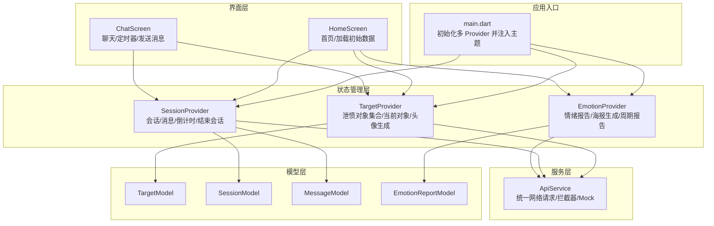
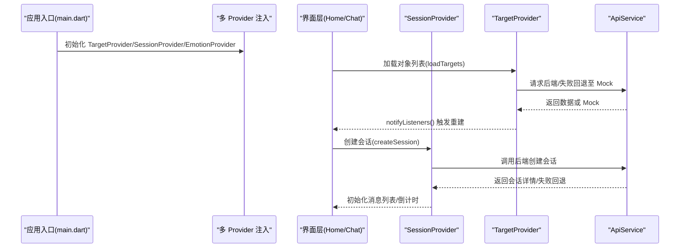
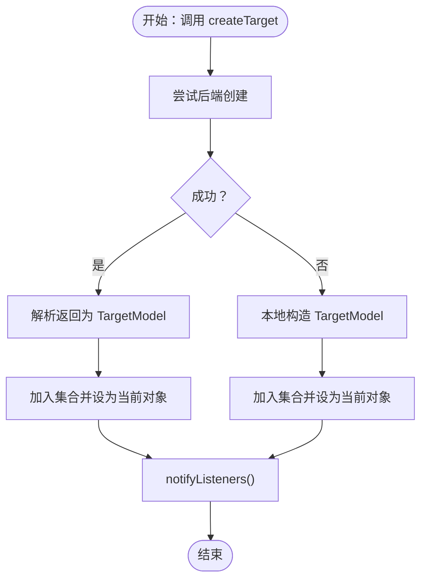
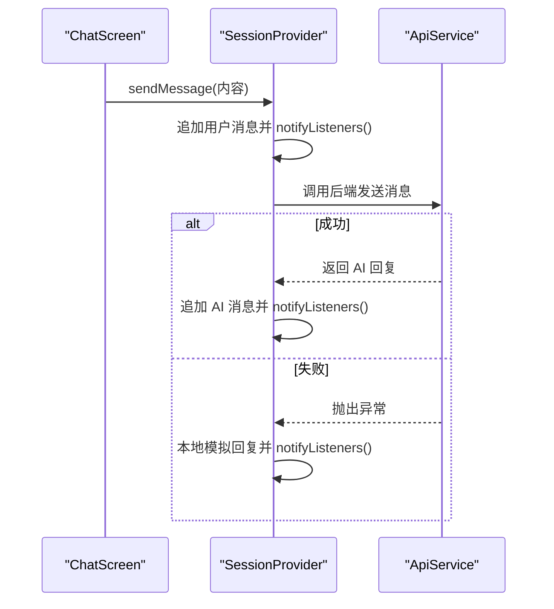
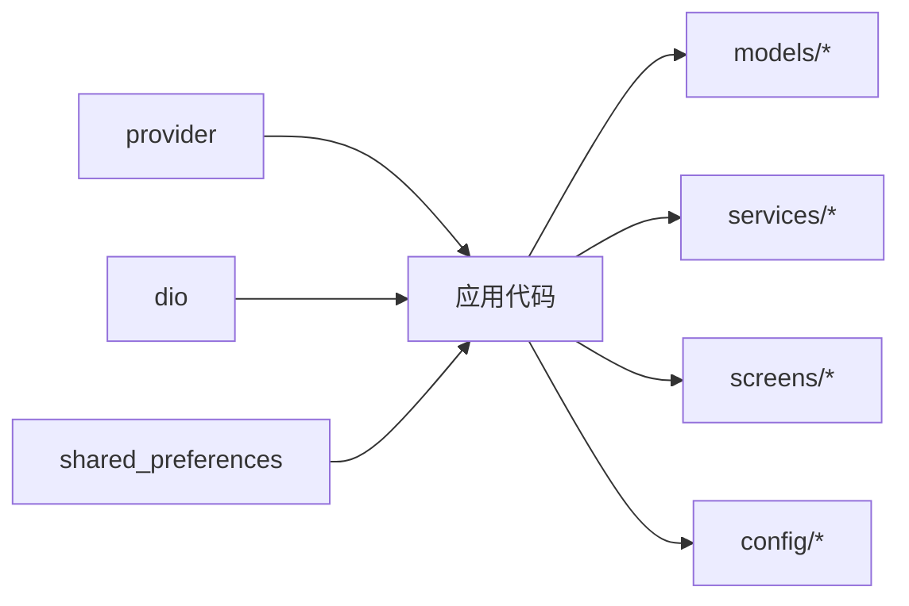

# 状态管理架构

<cite>
**本文引用的文件**
- [main.dart](file://emo_outlet_app/lib/main.dart)
- [app_providers.dart](file://emo_outlet_app/lib/providers/app_providers.dart)
- [target_model.dart](file://emo_outlet_app/lib/models/target_model.dart)
- [session_model.dart](file://emo_outlet_app/lib/models/session_model.dart)
- [message_model.dart](file://emo_outlet_app/lib/models/message_model.dart)
- [emotion_report_model.dart](file://emo_outlet_app/lib/models/emotion_report_model.dart)
- [api_service.dart](file://emo_outlet_app/lib/services/api_service.dart)
- [home_screen.dart](file://emo_outlet_app/lib/screens/home_screen.dart)
- [chat_screen.dart](file://emo_outlet_app/lib/screens/chat_screen.dart)
- [constants.dart](file://emo_outlet_app/lib/config/constants.dart)
- [pubspec.yaml](file://emo_outlet_app/pubspec.yaml)
</cite>

## 目录
1. [引言](#引言)
2. [项目结构](#项目结构)
3. [核心组件](#核心组件)
4. [架构总览](#架构总览)
5. [组件详解](#组件详解)
6. [依赖关系分析](#依赖关系分析)
7. [性能考量](#性能考量)
8. [故障排查指南](#故障排查指南)
9. [结论](#结论)
10. [附录](#附录)

## 引言
本文件系统性梳理 Emo Outlet 的状态管理架构，重点围绕 Provider 模式在应用中的落地实践，涵盖以下主题：
- Provider 设计与实现：TargetProvider、SessionProvider、EmotionProvider 的职责边界与协作方式
- ChangeNotifier 使用：状态变更通知机制与监听策略
- 状态提升与跨组件通信：Provider 间的依赖与数据流
- 状态持久化与重置：登录态、用户信息与敏感数据的生命周期管理
- 错误处理与降级：网络异常下的 Mock 回退策略
- 最佳实践、性能优化与调试方法
- 状态管理架构图与状态流转示例

## 项目结构
Emo Outlet 的前端采用 Flutter + Provider 架构，状态管理集中在 providers 目录，模型层位于 models，业务接口封装于 services，UI 层位于 screens。

图表来源
- [main.dart:18-24](file://emo_outlet_app/lib/main.dart#L18-L24)
- [app_providers.dart:9-132](file://emo_outlet_app/lib/providers/app_providers.dart#L9-L132)
- [app_providers.dart:134-328](file://emo_outlet_app/lib/providers/app_providers.dart#L134-L328)
- [app_providers.dart:330-415](file://emo_outlet_app/lib/providers/app_providers.dart#L330-L415)
- [api_service.dart:1-381](file://emo_outlet_app/lib/services/api_service.dart#L1-L381)
- [home_screen.dart:37-42](file://emo_outlet_app/lib/screens/home_screen.dart#L37-L42)
- [chat_screen.dart:29-44](file://emo_outlet_app/lib/screens/chat_screen.dart#L29-L44)

章节来源
- [main.dart:18-96](file://emo_outlet_app/lib/main.dart#L18-L96)
- [pubspec.yaml:13-14](file://emo_outlet_app/pubspec.yaml#L13-L14)

## 核心组件
- TargetProvider：负责“泄愤对象”集合与当前对象的管理，支持创建、更新、删除、AI 生成头像、AI 补全等操作，并提供加载对象列表的降级回退。
- SessionProvider：负责“会话”生命周期管理，包括创建会话、加载历史、发送消息、倒计时、结束会话与清理当前会话；同时维护消息列表与剩余时间。
- EmotionProvider：负责“情绪报告与海报”的生成与周期报告的加载，支持海报 URL 与数据缓存，并提供敏感数据清理能力。

章节来源
- [app_providers.dart:9-132](file://emo_outlet_app/lib/providers/app_providers.dart#L9-L132)
- [app_providers.dart:134-328](file://emo_outlet_app/lib/providers/app_providers.dart#L134-L328)
- [app_providers.dart:330-415](file://emo_outlet_app/lib/providers/app_providers.dart#L330-L415)

## 架构总览
Provider 在应用启动时通过 MultiProvider 注入，所有页面可直接通过 context.watch/context.read 访问所需状态。UI 层与业务层通过 ApiService 解耦，ApiService 统一处理网络请求、鉴权拦截与 Mock 数据回退。

图表来源
- [main.dart:18-24](file://emo_outlet_app/lib/main.dart#L18-L24)
- [app_providers.dart:20-38](file://emo_outlet_app/lib/providers/app_providers.dart#L20-L38)
- [app_providers.dart:176-231](file://emo_outlet_app/lib/providers/app_providers.dart#L176-L231)
- [api_service.dart:119-164](file://emo_outlet_app/lib/services/api_service.dart#L119-L164)

## 组件详解

### TargetProvider：泄愤对象状态管理
- 关键职责
  - 对象集合加载与当前对象切换
  - 对象 CRUD 操作（含后端失败时的本地回退）
  - AI 生成头像与补全信息
- 状态变更通知
  - 所有写操作均在完成后调用 notifyListeners()，确保 UI 实时刷新
- 降级策略
  - 后端异常时回退到 ApiService.mockTargets() 提供的示例数据
- 典型流程（创建对象）

图表来源
- [app_providers.dart:46-62](file://emo_outlet_app/lib/providers/app_providers.dart#L46-L62)
- [api_service.dart:129-132](file://emo_outlet_app/lib/services/api_service.dart#L129-L132)

章节来源
- [app_providers.dart:9-132](file://emo_outlet_app/lib/providers/app_providers.dart#L9-L132)
- [target_model.dart:1-104](file://emo_outlet_app/lib/models/target_model.dart#L1-L104)

### SessionProvider：会话与消息状态管理
- 关键职责
  - 会话创建、历史加载、结束会话
  - 消息发送与 AI 回复接收，支持本地模拟回复
  - 倒计时与超时处理，支持延长
  - 当前会话清理
- 状态变更通知
  - 每次消息添加、时间变化、会话状态切换均调用 notifyListeners()
- 降级策略
  - 后端异常时回退到本地模拟回复与本地会话对象
- 典型流程（发送消息）

图表来源
- [app_providers.dart:233-271](file://emo_outlet_app/lib/providers/app_providers.dart#L233-L271)
- [api_service.dart:207-215](file://emo_outlet_app/lib/services/api_service.dart#L207-L215)

章节来源
- [app_providers.dart:134-328](file://emo_outlet_app/lib/providers/app_providers.dart#L134-L328)
- [session_model.dart:1-151](file://emo_outlet_app/lib/models/session_model.dart#L1-L151)
- [message_model.dart:1-61](file://emo_outlet_app/lib/models/message_model.dart#L1-L61)

### EmotionProvider：情绪报告与海报状态管理
- 关键职责
  - 生成会话情绪报告与海报（含海报 URL 与数据缓存）
  - 加载周期情绪报告（周/月维度）
  - 清理当前报告与敏感缓存（登出时调用）
- 状态变更通知
  - 生成与加载过程均通过 notifyListeners() 推送 UI 更新
- 降级策略
  - 后端异常时回退到 ApiService.mockPoster()/mockEmotionReport()

章节来源
- [app_providers.dart:330-415](file://emo_outlet_app/lib/providers/app_providers.dart#L330-L415)
- [emotion_report_model.dart:1-121](file://emo_outlet_app/lib/models/emotion_report_model.dart#L1-L121)

### Provider 间通信与状态共享
- 跨 Provider 访问
  - ChatScreen 同时依赖 SessionProvider 与 TargetProvider，用于显示目标头像与模式标签
  - HomeScreen 在初始化时并行加载三类 Provider 的基础数据
- 状态提升策略
  - 将公共状态（如当前对象、会话）提升至顶层 Provider，避免在子树中重复拉取
  - 通过 context.watch 在 UI 中订阅所需 Provider，减少不必要的重建

章节来源
- [chat_screen.dart:253-256](file://emo_outlet_app/lib/screens/chat_screen.dart#L253-L256)
- [home_screen.dart:37-42](file://emo_outlet_app/lib/screens/home_screen.dart#L37-L42)

### ChangeNotifier 使用方式与通知机制
- 写操作后统一调用 notifyListeners()，确保订阅者收到最新状态
- 读取操作通过 getter 暴露内部状态，避免直接修改导致的遗漏通知
- UI 中使用 context.watch 订阅状态变化，context.read 仅在需要触发写操作时使用

章节来源
- [app_providers.dart:22-38](file://emo_outlet_app/lib/providers/app_providers.dart#L22-L38)
- [app_providers.dart:72-82](file://emo_outlet_app/lib/providers/app_providers.dart#L72-L82)
- [app_providers.dart:311-320](file://emo_outlet_app/lib/providers/app_providers.dart#L311-L320)

### 状态持久化与重置机制
- 登录态与用户信息持久化
  - 通过 shared_preferences 存储 token 与用户数据，应用启动时自动恢复
- 敏感数据清理
  - EmotionProvider 提供 clearSensitiveCache，在注销场景清理报告与海报缓存
- 应用退出/重启后的状态恢复
  - 首屏初始化时主动触发各 Provider 的数据加载，保证 UI 初次渲染即有数据

章节来源
- [api_service.dart:34-34](file://emo_outlet_app/lib/services/api_service.dart#L34-L34)
- [home_screen.dart:37-42](file://emo_outlet_app/lib/screens/home_screen.dart#L37-L42)
- [app_providers.dart:407-414](file://emo_outlet_app/lib/providers/app_providers.dart#L407-L414)

### 错误处理策略
- 网络异常回退
  - 所有外部调用均包裹 try/catch，失败时使用 ApiService.mock* 方法提供本地数据
- UI 友好提示
  - ChatScreen 在倒计时结束时弹窗提示是否延长或结束
- 日志与可观测性
  - 建议在生产环境增加统一错误上报与埋点，便于定位问题

章节来源
- [app_providers.dart:30-34](file://emo_outlet_app/lib/providers/app_providers.dart#L30-L34)
- [app_providers.dart:261-270](file://emo_outlet_app/lib/providers/app_providers.dart#L261-L270)
- [chat_screen.dart:143-194](file://emo_outlet_app/lib/screens/chat_screen.dart#L143-L194)

## 依赖关系分析
- 外部依赖
  - provider：状态管理核心库
  - dio：网络请求与拦截器
  - shared_preferences：本地持久化
- 内部依赖
  - providers 依赖 models 与 services
  - screens 依赖 providers 与 models
  - constants 为全局配置常量

图表来源
- [pubspec.yaml:13-24](file://emo_outlet_app/pubspec.yaml#L13-L24)

章节来源
- [pubspec.yaml:13-24](file://emo_outlet_app/pubspec.yaml#L13-L24)

## 性能考量
- 通知粒度控制
  - 将多个字段更新合并为一次 notifyListeners()，减少重建次数
- 列表渲染优化
  - 使用 ListView.builder，避免一次性构建大量子节点
- 定时器与后台任务
  - ChatScreen 的定时器仅在会话运行时生效，结束会话后及时取消
- 网络与渲染解耦
  - ApiService 统一封装请求，避免 UI 直接处理网络细节
- 缓存与回退
  - 合理使用 Mock 数据降低首屏等待时间

## 故障排查指南
- 症状：页面空白或长时间加载
  - 检查 Provider 初始化是否完成（MultiProvider 注入）
  - 确认 ApiService 的 baseUrl 与超时配置正确
- 症状：会话无法结束或倒计时异常
  - 检查 SessionProvider 的 endSession 与 tick 是否被调用
  - 确认 ChatScreen 的定时器生命周期管理
- 症状：头像未更新或补全失败
  - 检查 TargetProvider 的 generateAvatar 与 aiComplete 是否触发 notifyListeners()
- 症状：注销后仍显示敏感数据
  - 确认调用了 EmotionProvider.clearSensitiveCache

章节来源
- [main.dart:18-24](file://emo_outlet_app/lib/main.dart#L18-L24)
- [app_providers.dart:294-312](file://emo_outlet_app/lib/providers/app_providers.dart#L294-L312)
- [app_providers.dart:407-414](file://emo_outlet_app/lib/providers/app_providers.dart#L407-L414)

## 结论
Emo Outlet 的状态管理以 Provider 为核心，结合 ChangeNotifier 的细粒度通知与 ApiService 的统一网络层，实现了清晰的职责分离与良好的可维护性。通过合理的降级策略、状态提升与 UI 订阅模式，系统在复杂交互场景下保持稳定与流畅。建议在后续迭代中进一步引入错误监控与性能指标，持续优化用户体验。

## 附录
- 常用配置项参考
  - 基础地址与超时：见 constants.dart 中的 baseUrl、connectTimeout、receiveTimeout
  - 会话时长与方言映射：见 constants.dart 中的 sessionDurations、dialectMap
  - 情绪类型与颜色映射：见 constants.dart 中的 emotionTypes、emotionColors

章节来源
- [constants.dart:8-10](file://emo_outlet_app/lib/config/constants.dart#L8-L10)
- [constants.dart:12-29](file://emo_outlet_app/lib/config/constants.dart#L12-L29)
- [constants.dart:47-63](file://emo_outlet_app/lib/config/constants.dart#L47-L63)