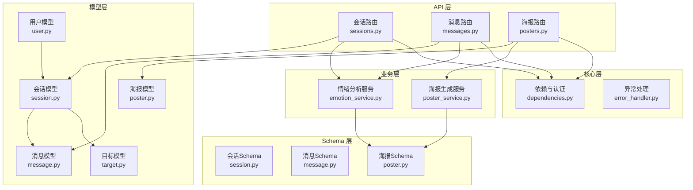
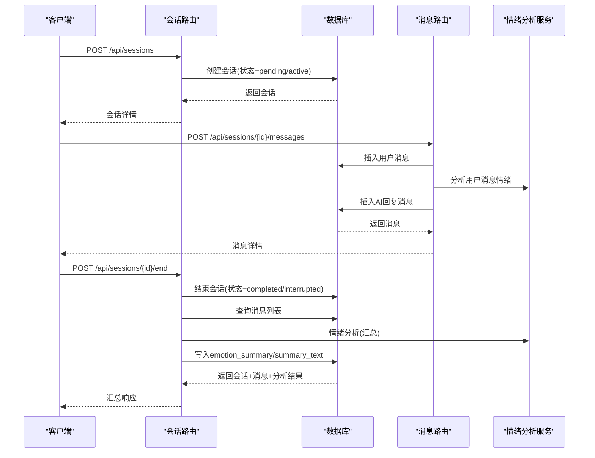
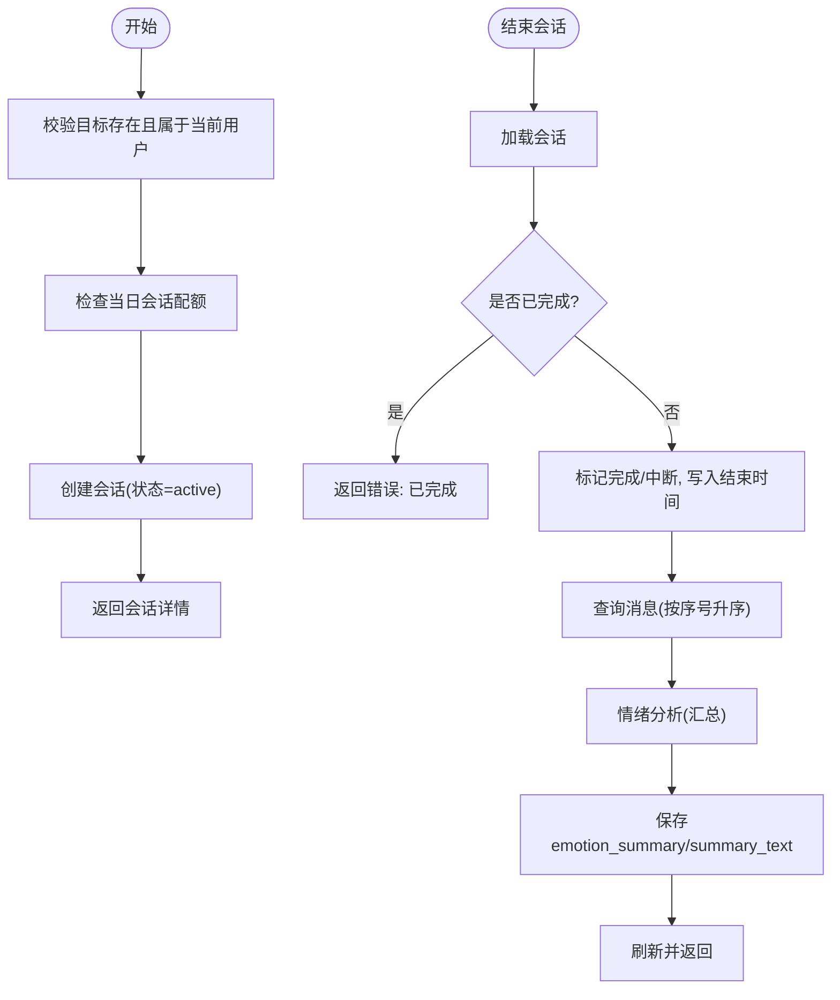
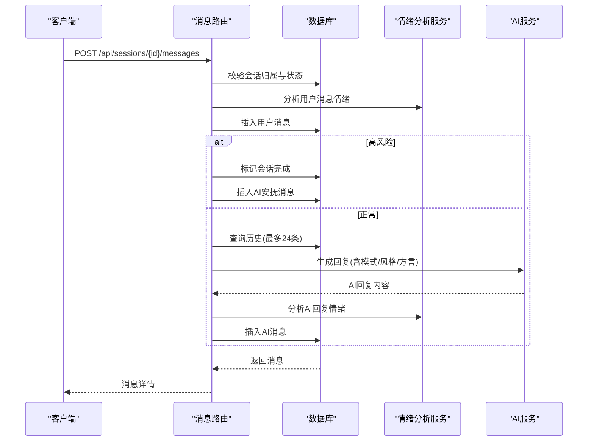
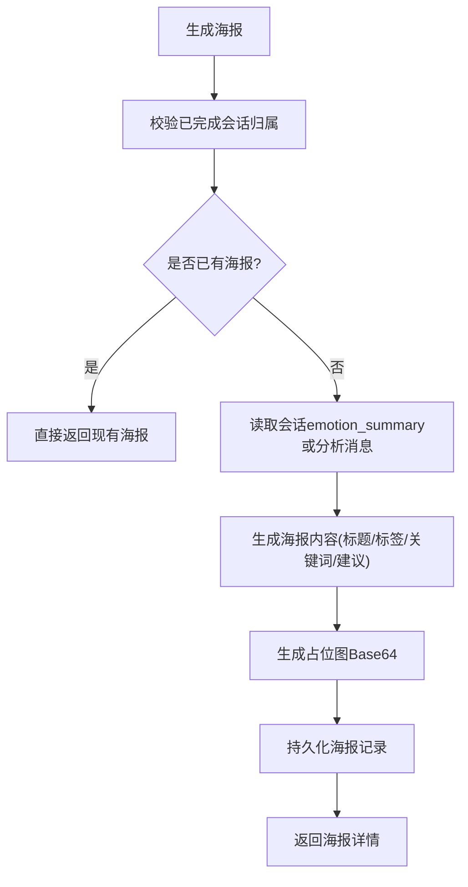
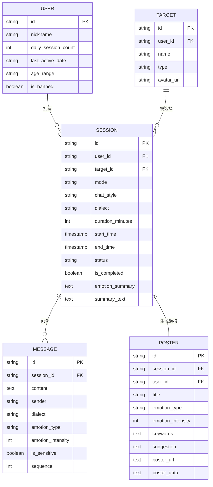
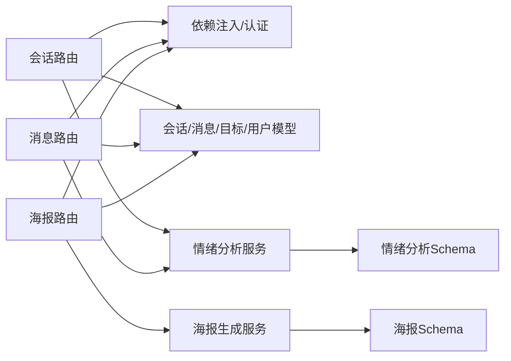

# 会话管理API

<cite>
**本文档引用的文件**
- [sessions.py](file://emo_outlet_api/app/api/sessions.py)
- [messages.py](file://emo_outlet_api/app/api/messages.py)
- [posters.py](file://emo_outlet_api/app/api/posters.py)
- [session.py](file://emo_outlet_api/app/models/session.py)
- [message.py](file://emo_outlet_api/app/models/message.py)
- [poster.py](file://emo_outlet_api/app/models/poster.py)
- [target.py](file://emo_outlet_api/app/models/target.py)
- [user.py](file://emo_outlet_api/app/models/user.py)
- [session.py](file://emo_outlet_api/app/schemas/session.py)
- [message.py](file://emo_outlet_api/app/schemas/message.py)
- [poster.py](file://emo_outlet_api/app/schemas/poster.py)
- [emotion_service.py](file://emo_outlet_api/app/services/emotion_service.py)
- [poster_service.py](file://emo_outlet_api/app/services/poster_service.py)
- [dependencies.py](file://emo_outlet_api/app/core/dependencies.py)
- [error_handler.py](file://emo_outlet_api/app/core/error_handler.py)
- [config.py](file://emo_outlet_api/app/config.py)
</cite>

## 目录
1. [简介](#简介)
2. [项目结构](#项目结构)
3. [核心组件](#核心组件)
4. [架构总览](#架构总览)
5. [详细组件分析](#详细组件分析)
6. [依赖分析](#依赖分析)
7. [性能考虑](#性能考虑)
8. [故障排除指南](#故障排除指南)
9. [结论](#结论)
10. [附录](#附录)

## 简介
本文件为 Emo Outlet 的会话管理 API 提供全面的技术文档，覆盖会话创建、状态管理、历史记录查询、会话结束与情绪分析、海报生成与情绪报告等核心能力。文档同时给出数据模型、状态枚举、时间字段定义，并说明会话与消息、情绪分析、海报生成之间的关联关系，以及实时会话监控与异常处理机制。

## 项目结构
后端采用 FastAPI + SQLAlchemy 异步 ORM 架构，按功能模块划分：
- API 层：会话、消息、海报、目标、用户等路由
- 核心层：依赖注入、认证与限流、异常处理
- 业务层：情绪分析、海报生成服务
- 模型层：数据库实体映射
- Schema 层：请求/响应数据结构
- 配置层：运行参数与环境变量

图表来源
- [sessions.py:1-220](file://emo_outlet_api/app/api/sessions.py#L1-L220)
- [messages.py:1-216](file://emo_outlet_api/app/api/messages.py#L1-L216)
- [posters.py:1-383](file://emo_outlet_api/app/api/posters.py#L1-L383)
- [session.py:1-79](file://emo_outlet_api/app/models/session.py#L1-L79)
- [message.py:1-46](file://emo_outlet_api/app/models/message.py#L1-L46)
- [poster.py:1-61](file://emo_outlet_api/app/models/poster.py#L1-L61)
- [target.py:1-56](file://emo_outlet_api/app/models/target.py#L1-L56)
- [user.py:1-56](file://emo_outlet_api/app/models/user.py#L1-L56)
- [session.py:1-49](file://emo_outlet_api/app/schemas/session.py#L1-L49)
- [message.py:1-33](file://emo_outlet_api/app/schemas/message.py#L1-L33)
- [poster.py:1-65](file://emo_outlet_api/app/schemas/poster.py#L1-L65)
- [emotion_service.py:1-181](file://emo_outlet_api/app/services/emotion_service.py#L1-L181)
- [poster_service.py:1-221](file://emo_outlet_api/app/services/poster_service.py#L1-L221)
- [dependencies.py:1-67](file://emo_outlet_api/app/core/dependencies.py#L1-L67)
- [error_handler.py:1-59](file://emo_outlet_api/app/core/error_handler.py#L1-L59)

章节来源
- [sessions.py:1-220](file://emo_outlet_api/app/api/sessions.py#L1-L220)
- [messages.py:1-216](file://emo_outlet_api/app/api/messages.py#L1-L216)
- [posters.py:1-383](file://emo_outlet_api/app/api/posters.py#L1-L383)

## 核心组件
- 会话管理 API：负责会话创建、列表查询、当前活动会话查询、详情查询、结束会话与情绪分析汇总
- 消息交互 API：负责消息发送、分页查询、剩余时长计算、敏感词拦截与合规处理
- 海报与报告 API：负责会话海报生成、海报列表与详情、情绪报告概览与详情
- 情绪分析服务：基于文本统计与关键词匹配的多维情绪评分与摘要生成
- 海报生成服务：根据情绪分析结果生成海报内容与HTML模板
- 依赖与认证：JWT 解析、用户鉴权、每日会话次数限制、会话拥有者校验
- 异常处理：统一 HTTP/验证/通用异常响应格式

章节来源
- [sessions.py:50-220](file://emo_outlet_api/app/api/sessions.py#L50-L220)
- [messages.py:32-195](file://emo_outlet_api/app/api/messages.py#L32-L195)
- [posters.py:72-383](file://emo_outlet_api/app/api/posters.py#L72-L383)
- [emotion_service.py:44-181](file://emo_outlet_api/app/services/emotion_service.py#L44-L181)
- [poster_service.py:66-221](file://emo_outlet_api/app/services/poster_service.py#L66-L221)
- [dependencies.py:18-67](file://emo_outlet_api/app/core/dependencies.py#L18-L67)
- [error_handler.py:10-59](file://emo_outlet_api/app/core/error_handler.py#L10-L59)

## 架构总览
会话生命周期从创建开始，进入“进行中”，期间可发送消息、受时长与轮数限制；结束后触发情绪分析，生成摘要与海报，并支持报告查看。

图表来源
- [sessions.py:50-220](file://emo_outlet_api/app/api/sessions.py#L50-L220)
- [messages.py:69-195](file://emo_outlet_api/app/api/messages.py#L69-L195)
- [emotion_service.py:44-71](file://emo_outlet_api/app/services/emotion_service.py#L44-L71)

## 详细组件分析

### 会话管理API
- 会话创建
  - 路径：POST /api/sessions
  - 权限：需有效 JWT 令牌
  - 参数：目标ID、会话模式、对话风格、方言、时长（分钟）
  - 逻辑：校验目标归属与日限额，创建会话并返回详情
  - 状态：默认“进行中”
  - 限额：按访客/年龄组动态限制
- 会话列表
  - 路径：GET /api/sessions
  - 参数：页码、每页数量
  - 过滤：仅返回已完成的会话
- 当前活动会话
  - 路径：GET /api/sessions/active
  - 返回：当前用户唯一“进行中”会话
- 会话详情
  - 路径：GET /api/sessions/{session_id}
  - 校验：仅会话所属用户可访问
- 结束会话
  - 路径：POST /api/sessions/{session_id}/end
  - 参数：force（强制中断）
  - 行为：标记完成，写入结束时间；拉取消息并执行情绪分析，生成摘要与建议
  - 响应：包含会话、消息列表与情绪分析结果

图表来源
- [sessions.py:50-220](file://emo_outlet_api/app/api/sessions.py#L50-L220)

章节来源
- [sessions.py:50-220](file://emo_outlet_api/app/api/sessions.py#L50-L220)
- [session.py:13-79](file://emo_outlet_api/app/models/session.py#L13-L79)
- [session.py:8-49](file://emo_outlet_api/app/schemas/session.py#L8-L49)

### 消息交互API
- 消息列表
  - 路径：GET /api/sessions/{session_id}/messages
  - 分页：页码、每页数量
  - 实时剩余秒数：若会话进行中且已开始，按时长计算剩余
- 发送消息
  - 路径：POST /api/sessions/{session_id}/messages
  - 敏感词检测：高风险时中断会话并返回安抚回复
  - 轮数限制：超过阈值自动完成会话
  - 时长限制：超出设定时长自动完成会话
  - AI 回复：携带历史上下文与会话风格参数

图表来源
- [messages.py:69-195](file://emo_outlet_api/app/api/messages.py#L69-L195)
- [emotion_service.py:44-71](file://emo_outlet_api/app/services/emotion_service.py#L44-L71)

章节来源
- [messages.py:32-195](file://emo_outlet_api/app/api/messages.py#L32-L195)
- [message.py:13-46](file://emo_outlet_api/app/models/message.py#L13-L46)
- [message.py:8-33](file://emo_outlet_api/app/schemas/message.py#L8-L33)

### 海报与报告API
- 生成海报
  - 路径：POST /api/posters/generate
  - 条件：会话必须已完成且属于当前用户
  - 逻辑：优先使用会话已有的情绪摘要，否则重新分析消息；生成海报内容与Base64占位图
- 海报列表
  - 路径：GET /api/posters
- 海报详情
  - 路径：GET /api/posters/detail/{poster_id}
  - 返回：标题、日期、标签、摘要、生成时间、来源会话标题、海报数据
- 按会话查询海报
  - 路径：GET /api/posters/session/{session_id}
- 删除海报
  - 路径：DELETE /api/posters/{poster_id}
- 情绪报告
  - 概览：GET /api/posters/report/overview
    - 支持周期：日/周/月/年/全部
    - 输出：会话总数、总时长、主导情绪、分布、趋势、建议
  - 详情：GET /api/posters/report/detail
    - 输出：模式分布、目标分布、时段分布、关键词统计

图表来源
- [posters.py:72-138](file://emo_outlet_api/app/api/posters.py#L72-L138)
- [poster_service.py:66-221](file://emo_outlet_api/app/services/poster_service.py#L66-L221)
- [emotion_service.py:44-71](file://emo_outlet_api/app/services/emotion_service.py#L44-L71)

章节来源
- [posters.py:72-383](file://emo_outlet_api/app/api/posters.py#L72-L383)
- [poster.py:13-61](file://emo_outlet_api/app/models/poster.py#L13-L61)
- [poster.py:17-65](file://emo_outlet_api/app/schemas/poster.py#L17-L65)

### 数据模型与状态枚举
- 会话模型
  - 字段要点：模式（单向/双向）、对话风格、方言、时长、开始/结束时间、状态（待开始/进行中/正常结束/中断）、是否完成、情绪摘要、创建/更新时间
  - 关系：属于用户与目标，包含消息集合
- 消息模型
  - 字段要点：内容、发送方（用户/AI/系统）、方言、情绪类型与强度、敏感标记、序号、创建时间
  - 关系：属于会话
- 目标模型
  - 字段要点：名称、类型、外貌/性格/关系描述、风格、头像、隐藏/删除状态
  - 关系：属于用户，反向关联会话
- 用户模型
  - 字段要点：设备标识、日会话计数、最后活跃日期、年龄组、封禁状态等
- 海报模型
  - 字段要点：标题、主导情绪、强度、关键词、建议、海报URL/Base64数据
  - 关系：一对一关联会话

图表来源
- [user.py:14-56](file://emo_outlet_api/app/models/user.py#L14-L56)
- [target.py:13-56](file://emo_outlet_api/app/models/target.py#L13-L56)
- [session.py:13-79](file://emo_outlet_api/app/models/session.py#L13-L79)
- [message.py:13-46](file://emo_outlet_api/app/models/message.py#L13-L46)
- [poster.py:13-61](file://emo_outlet_api/app/models/poster.py#L13-L61)

章节来源
- [session.py:13-79](file://emo_outlet_api/app/models/session.py#L13-L79)
- [message.py:13-46](file://emo_outlet_api/app/models/message.py#L13-L46)
- [poster.py:13-61](file://emo_outlet_api/app/models/poster.py#L13-L61)
- [target.py:13-56](file://emo_outlet_api/app/models/target.py#L13-L56)
- [user.py:14-56](file://emo_outlet_api/app/models/user.py#L14-L56)

### 状态与时间控制
- 会话状态
  - pending：待开始
  - active：进行中
  - completed：正常结束
  - interrupted：中断
- 时间控制
  - 设定时长（分钟），超时自动完成
  - 开始时间为空时不可计算剩余时长
- 日限额
  - 不同年龄段与访客有不同配额
  - 按天重置计数器

章节来源
- [session.py:50-55](file://emo_outlet_api/app/models/session.py#L50-L55)
- [dependencies.py:53-67](file://emo_outlet_api/app/core/dependencies.py#L53-L67)
- [config.py:97-107](file://emo_outlet_api/app/config.py#L97-L107)

### 情绪分析与海报生成
- 情绪分析
  - 输入：消息序列（内容、发送方）
  - 统计：字符数、感叹号/问号、重复字符
  - 评分：基于关键词库与标点/长度调整，归一化至百分比
  - 结果：主导情绪、情绪分布、强度、关键词、摘要、建议
- 海报生成
  - 根据主导情绪选择主题样式（标题/副标题/强调色/标语/总结）
  - 生成HTML模板与占位图Base64数据

章节来源
- [emotion_service.py:44-181](file://emo_outlet_api/app/services/emotion_service.py#L44-L181)
- [poster_service.py:66-221](file://emo_outlet_api/app/services/poster_service.py#L66-L221)
- [poster.py:8-15](file://emo_outlet_api/app/schemas/poster.py#L8-L15)

### 实时会话监控与异常处理
- 实时监控
  - 消息列表接口返回会话状态与剩余秒数
  - 结束会话接口返回完整消息与分析结果
- 异常处理
  - HTTP 异常：返回统一格式（状态码、错误码、详情）
  - 参数校验异常：返回字段级错误列表
  - 通用异常：统一 500 错误码与提示

章节来源
- [messages.py:32-66](file://emo_outlet_api/app/api/messages.py#L32-L66)
- [sessions.py:156-220](file://emo_outlet_api/app/api/sessions.py#L156-L220)
- [error_handler.py:10-59](file://emo_outlet_api/app/core/error_handler.py#L10-L59)

## 依赖分析
- 路由依赖
  - 会话路由依赖用户认证、数据库会话、目标与消息模型、情绪分析服务
  - 消息路由依赖用户认证、数据库会话、消息模型、情绪分析与AI服务、敏感词过滤
  - 海报路由依赖用户认证、数据库会话/海报/目标模型、情绪分析与海报服务
- 服务依赖
  - 情绪分析服务：依赖海报结果Schema
  - 海报服务：依赖海报结果Schema与HTML模板
- 核心依赖
  - 依赖注入：JWT 解析、用户鉴权、每日限额检查
  - 异常处理：全局注册

图表来源
- [sessions.py:1-26](file://emo_outlet_api/app/api/sessions.py#L1-L26)
- [messages.py:1-21](file://emo_outlet_api/app/api/messages.py#L1-L21)
- [posters.py:1-28](file://emo_outlet_api/app/api/posters.py#L1-L28)
- [emotion_service.py:1-7](file://emo_outlet_api/app/services/emotion_service.py#L1-L7)
- [poster_service.py:1-9](file://emo_outlet_api/app/services/poster_service.py#L1-L9)
- [dependencies.py:1-16](file://emo_outlet_api/app/core/dependencies.py#L1-L16)

章节来源
- [sessions.py:1-26](file://emo_outlet_api/app/api/sessions.py#L1-L26)
- [messages.py:1-21](file://emo_outlet_api/app/api/messages.py#L1-L21)
- [posters.py:1-28](file://emo_outlet_api/app/api/posters.py#L1-L28)
- [dependencies.py:1-16](file://emo_outlet_api/app/core/dependencies.py#L1-L16)

## 性能考虑
- 分页查询：消息列表与会话列表均支持分页，避免一次性加载大量数据
- 关联加载：使用 selectin 加载策略减少 N+1 查询
- 异步数据库：使用异步 ORM，提升并发吞吐
- 缓存友好：海报生成使用占位图，避免频繁外部调用
- 限额与风控：通过每日配额与敏感词拦截降低滥用风险

## 故障排除指南
- 401 未提供/无效令牌：检查 Authorization 头与 JWT 有效性
- 403 账号被封禁：确认用户封禁状态与原因
- 404 会话/海报不存在：确认资源归属与完成状态
- 400 会话已完成：结束会话仅对进行中的会话生效
- 429 达到日限额：检查用户年龄组与访客身份对应的配额
- 422 参数校验失败：核对请求体字段类型与范围

章节来源
- [dependencies.py:18-50](file://emo_outlet_api/app/core/dependencies.py#L18-L50)
- [sessions.py:64-78](file://emo_outlet_api/app/api/sessions.py#L64-L78)
- [posters.py:82-87](file://emo_outlet_api/app/api/posters.py#L82-L87)
- [error_handler.py:34-51](file://emo_outlet_api/app/core/error_handler.py#L34-L51)

## 结论
本会话管理API围绕“创建—进行—结束—分析—生成”的完整闭环设计，结合实时监控与合规风控，提供稳定、可扩展的情绪释放与记录能力。通过清晰的数据模型与状态机、完善的异常处理与限流策略，确保用户体验与系统稳定性。

## 附录

### API 接口清单与说明
- 会话管理
  - POST /api/sessions：创建会话
  - GET /api/sessions：查询已完成会话列表
  - GET /api/sessions/active：查询当前活动会话
  - GET /api/sessions/{session_id}：查询会话详情
  - POST /api/sessions/{session_id}/end：结束会话并返回汇总
- 消息交互
  - GET /api/sessions/{session_id}/messages：分页查询消息
  - POST /api/sessions/{session_id}/messages：发送消息
- 海报与报告
  - POST /api/posters/generate：生成海报
  - GET /api/posters：海报列表
  - GET /api/posters/detail/{poster_id}：海报详情
  - GET /api/posters/session/{session_id}：按会话查询海报
  - DELETE /api/posters/{poster_id}：删除海报
  - GET /api/posters/report/overview：情绪报告概览
  - GET /api/posters/report/detail：情绪报告详情

章节来源
- [sessions.py:50-220](file://emo_outlet_api/app/api/sessions.py#L50-L220)
- [messages.py:32-195](file://emo_outlet_api/app/api/messages.py#L32-L195)
- [posters.py:72-383](file://emo_outlet_api/app/api/posters.py#L72-L383)