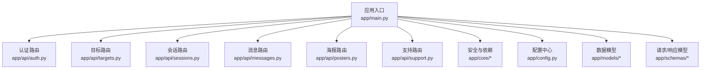
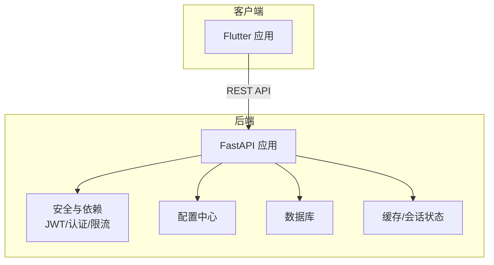
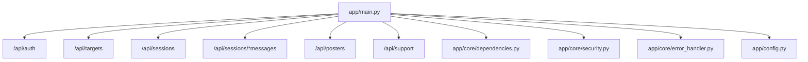
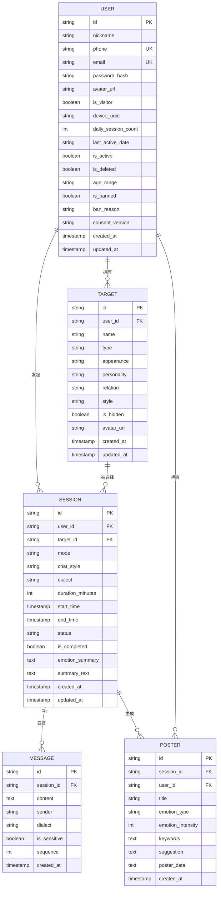

# 后端API文档

<cite>
**本文引用的文件**
- [app/main.py](file://emo_outlet_api/app/main.py)
- [app/api/auth.py](file://emo_outlet_api/app/api/auth.py)
- [app/api/targets.py](file://emo_outlet_api/app/api/targets.py)
- [app/api/sessions.py](file://emo_outlet_api/app/api/sessions.py)
- [app/api/messages.py](file://emo_outlet_api/app/api/messages.py)
- [app/api/posters.py](file://emo_outlet_api/app/api/posters.py)
- [app/api/support.py](file://emo_outlet_api/app/api/support.py)
- [app/config.py](file://emo_outlet_api/app/config.py)
- [app/core/security.py](file://emo_outlet_api/app/core/security.py)
- [app/core/dependencies.py](file://emo_outlet_api/app/core/dependencies.py)
- [app/core/error_handler.py](file://emo_outlet_api/app/core/error_handler.py)
- [app/models/user.py](file://emo_outlet_api/app/models/user.py)
- [app/models/session.py](file://emo_outlet_api/app/models/session.py)
- [app/schemas/user.py](file://emo_outlet_api/app/schemas/user.py)
- [app/schemas/session.py](file://emo_outlet_api/app/schemas/session.py)
- [run.py](file://emo_outlet_api/run.py)
</cite>

## 目录
1. [简介](#简介)
2. [项目结构](#项目结构)
3. [核心组件](#核心组件)
4. [架构总览](#架构总览)
5. [详细组件分析](#详细组件分析)
6. [依赖分析](#依赖分析)
7. [性能考虑](#性能考虑)
8. [故障排查指南](#故障排查指南)
9. [结论](#结论)
10. [附录](#附录)

## 简介
本文件为 Emo Outlet 后端 API 的完整技术文档，覆盖用户认证、目标管理、会话控制、消息处理、海报生成、支持反馈等核心功能模块。文档详细说明各 RESTful 接口的 HTTP 方法、URL 模式、请求/响应结构、认证方式、参数定义、返回值结构、错误码与异常处理，并提供请求与响应示例、使用限制、速率限制、版本信息、WebSocket 连接与实时交互模式、客户端实现指南与性能优化建议，以及调试与监控方法。

## 项目结构
后端基于 FastAPI 构建，采用分层架构：
- 应用入口与路由聚合：app/main.py
- 功能模块路由：app/api/*.py
- 核心安全与依赖：app/core/*
- 数据模型与数据库：app/models/*
- 请求/响应模型：app/schemas/*
- 配置中心：app/config.py
- 启动与部署：run.py

图表来源
- [app/main.py:23-63](file://emo_outlet_api/app/main.py#L23-L63)
- [app/api/auth.py:30](file://emo_outlet_api/app/api/auth.py#L30)
- [app/api/targets.py:23](file://emo_outlet_api/app/api/targets.py#L23)
- [app/api/sessions.py:50](file://emo_outlet_api/app/api/sessions.py#L50)
- [app/api/messages.py:24](file://emo_outlet_api/app/api/messages.py#L24)
- [app/api/posters.py:28](file://emo_outlet_api/app/api/posters.py#L28)
- [app/api/support.py:18](file://emo_outlet_api/app/api/support.py#L18)
- [app/core/security.py:1](file://emo_outlet_api/app/core/security.py#L1)
- [app/core/dependencies.py:1](file://emo_outlet_api/app/core/dependencies.py#L1)
- [app/config.py:12](file://emo_outlet_api/app/config.py#L12)
- [app/models/user.py:14](file://emo_outlet_api/app/models/user.py#L14)
- [app/models/session.py:13](file://emo_outlet_api/app/models/session.py#L13)
- [app/schemas/user.py:8](file://emo_outlet_api/app/schemas/user.py#L8)
- [app/schemas/session.py:9](file://emo_outlet_api/app/schemas/session.py#L9)

章节来源
- [app/main.py:23-82](file://emo_outlet_api/app/main.py#L23-L82)
- [run.py:8-31](file://emo_outlet_api/run.py#L8-L31)

## 核心组件
- 应用生命周期与中间件：健康检查、CORS、请求日志、异常处理注册
- 认证与授权：JWT 令牌签发与校验、访问保护、访客登录、合规同意
- 业务模块：目标管理、会话管理、消息收发、海报生成、支持反馈
- 配置中心：数据库、Redis、AI/ASR/TTS、安全与合规阈值
- 错误处理：统一异常处理与标准化错误响应

章节来源
- [app/main.py:14-82](file://emo_outlet_api/app/main.py#L14-L82)
- [app/core/security.py:16-43](file://emo_outlet_api/app/core/security.py#L16-L43)
- [app/core/dependencies.py:18-67](file://emo_outlet_api/app/core/dependencies.py#L18-L67)
- [app/core/error_handler.py:10-59](file://emo_outlet_api/app/core/error_handler.py#L10-L59)
- [app/config.py:12-125](file://emo_outlet_api/app/config.py#L12-L125)

## 架构总览
系统采用前后端分离，后端提供 RESTful API；会话期间的消息交互通过 WebSocket 实时推送（具体实现位于前端 Flutter 应用中）。后端通过依赖注入与中间件确保认证、限流与合规策略执行。

图表来源
- [app/main.py:23-82](file://emo_outlet_api/app/main.py#L23-L82)
- [app/core/security.py:26-43](file://emo_outlet_api/app/core/security.py#L26-L43)
- [app/core/dependencies.py:18-67](file://emo_outlet_api/app/core/dependencies.py#L18-L67)
- [app/config.py:12-125](file://emo_outlet_api/app/config.py#L12-L125)

## 详细组件分析

### 认证与用户管理
- 统一认证方式：Bearer Token（Authorization: Bearer <token>）
- 支持注册、登录、访客登录、个人资料查询与更新、隐私详情、账号注销、数据导出
- 访客登录：按设备 UUID 识别，自动创建访客用户
- 合规同意：注册时可记录同意版本，生成隐私与条款同意记录
- 限流与封禁：每日会话次数按年龄段与访客身份限制；封禁用户禁止访问

接口一览
- POST /api/auth/register
  - 请求体：UserRegisterRequest
  - 响应体：TokenResponse
  - 错误：409 手机号/邮箱已注册
- POST /api/auth/login
  - 请求体：UserLoginRequest
  - 响应体：TokenResponse
  - 错误：401 账号或密码错误
- POST /api/auth/visitor
  - 请求体：VisitorLoginRequest
  - 响应体：TokenResponse
- GET /api/auth/me
  - 响应体：UserResponse
- PUT /api/auth/me
  - 请求体：UserUpdateRequest
  - 响应体：UserResponse
- GET /api/auth/profile-detail
  - 响应体：UserProfileDetailResponse
- PUT /api/auth/profile-detail
  - 请求体：UserProfileDetailUpdateRequest
  - 响应体：UserProfileDetailResponse
- DELETE /api/auth/account
  - 响应体：{"message": "..."}
- GET /api/auth/data/export
  - 响应体：包含用户、目标、会话、消息、海报与导出时间的聚合数据

请求示例
- 注册
  - POST /api/auth/register
  - 请求体字段：nickname、phone、email、password、device_uuid、consent_version、age_range
- 登录
  - POST /api/auth/login
  - 请求体字段：account（手机/邮箱）、password
- 访客登录
  - POST /api/auth/visitor
  - 请求体字段：device_uuid、nickname

响应示例
- TokenResponse
  - 字段：access_token、token_type、user（包含 id、nickname、phone、email、avatar_url、is_visitor、daily_session_count、age_range、is_banned、is_admin、created_at）

错误码与异常
- 401 未提供认证令牌/令牌无效或已过期/用户不存在
- 403 账号被封禁
- 404 对象不存在/会话不存在
- 409 注册冲突（手机号/邮箱已存在）
- 429 达到每日会话上限
- 422 参数校验失败
- 500 服务器内部错误

章节来源
- [app/api/auth.py:33-332](file://emo_outlet_api/app/api/auth.py#L33-L332)
- [app/schemas/user.py:8-74](file://emo_outlet_api/app/schemas/user.py#L8-L74)
- [app/core/dependencies.py:18-67](file://emo_outlet_api/app/core/dependencies.py#L18-L67)
- [app/core/security.py:26-43](file://emo_outlet_api/app/core/security.py#L26-L43)
- [app/core/error_handler.py:10-59](file://emo_outlet_api/app/core/error_handler.py#L10-L59)

### 泄愤对象管理
- 列表、创建、详情、更新、删除（软删除）、AI 生成头像、AI 补全信息
- 支持隐藏/显示控制

接口一览
- GET /api/targets?include_hidden=false
  - 响应体：TargetResponse[]
- POST /api/targets
  - 请求体：TargetCreateRequest
  - 响应体：TargetResponse
- GET /api/targets/{target_id}
  - 响应体：TargetResponse
- PUT /api/targets/{target_id}
  - 请求体：TargetUpdateRequest
  - 响应体：TargetResponse
- DELETE /api/targets/{target_id}
  - 响应体：{"message": "..."}
- POST /api/targets/{target_id}/generate-avatar
  - 响应体：TargetResponse
- POST /api/targets/ai-complete
  - 请求体：TargetAiCompleteRequest
  - 响应体：TargetAiCompleteResponse

请求示例
- 创建目标
  - POST /api/targets
  - 请求体字段：name、type、appearance、personality、relationship、style
- AI 补全
  - POST /api/targets/ai-complete
  - 请求体字段：relationship（示例："老板"、"领导"等）

响应示例
- TargetResponse
  - 字段：id、user_id、name、type、appearance、personality、relation、style、is_hidden、avatar_url、created_at、updated_at

章节来源
- [app/api/targets.py:26-213](file://emo_outlet_api/app/api/targets.py#L26-L213)

### 会话管理
- 创建会话（校验目标存在、检查每日会话限制、更新用户计数）
- 会话历史列表（分页）
- 当前活跃会话
- 会话详情
- 结束会话（触发情绪分析，保存摘要与总结）

接口一览
- POST /api/sessions
  - 请求体：SessionCreateRequest
  - 响应体：SessionResponse
  - 错误：404 目标不存在；429 达到每日会话上限
- GET /api/sessions
  - 查询参数：page、page_size
  - 响应体：SessionResponse[]
- GET /api/sessions/active
  - 响应体：SessionResponse 或 null
- GET /api/sessions/{session_id}
  - 响应体：SessionResponse
- POST /api/sessions/{session_id}/end
  - 请求体：SessionEndRequest（可选 force）
  - 响应体：SessionSummaryResponse

请求示例
- 创建会话
  - POST /api/sessions
  - 请求体字段：target_id、mode、chat_style、dialect、duration_minutes

响应示例
- SessionResponse
  - 字段：id、user_id、target_id、target_name、target_avatar_url、mode、chat_style、dialect、duration_minutes、start_time、end_time、status、is_completed、emotion_summary、summary_text、created_at
- SessionSummaryResponse
  - 字段：session、messages、emotion_analysis

章节来源
- [app/api/sessions.py:53-242](file://emo_outlet_api/app/api/sessions.py#L53-L242)
- [app/schemas/session.py:9-62](file://emo_outlet_api/app/schemas/session.py#L9-L62)
- [app/models/session.py:13-79](file://emo_outlet_api/app/models/session.py#L13-L79)

### 消息处理
- 分页获取会话消息（计算剩余秒数）
- 发送消息（敏感词过滤、高风险中断、对话轮数上限、审计日志、AI 回复）
- 消息序号自增

接口一览
- GET /api/sessions/{session_id}/messages?page=1&page_size=50
  - 响应体：MessageListResponse
- POST /api/sessions/{session_id}/messages
  - 请求体：MessageSendRequest
  - 响应体：MessageResponse
  - 错误：404 会话不存在；400 会话已结束

请求示例
- 发送消息
  - POST /api/sessions/{session_id}/messages
  - 请求体字段：content

响应示例
- MessageListResponse
  - 字段：messages、total、session_status、remaining_seconds
- MessageResponse
  - 字段：id、session_id、content、sender、dialect、is_sensitive、sequence、created_at

章节来源
- [app/api/messages.py:27-243](file://emo_outlet_api/app/api/messages.py#L27-L243)

### 海报生成与情绪报告
- 生成海报（基于会话情绪分析或消息内容）
- 海报列表、详情、按会话查询
- 情绪概览报告（周期：weekly/monthly/yearly）
- 情绪详情报告（模式分布、目标分布、时间分布、关键词统计）

接口一览
- POST /api/posters/generate
  - 请求体：PosterGenerateRequest
  - 响应体：PosterResponse
- GET /api/posters
  - 响应体：PosterResponse[]
- GET /api/posters/detail/{poster_id}
  - 响应体：PosterDetailResponse
- GET /api/posters/session/{session_id}
  - 响应体：PosterResponse
- GET /api/posters/report/overview?period=weekly
  - 响应体：EmotionReportResponse
- GET /api/posters/report/detail?period=weekly
  - 响应体：EmotionReportDetailResponse

请求示例
- 生成海报
  - POST /api/posters/generate
  - 请求体字段：session_id

响应示例
- PosterResponse
  - 字段：id、session_id、user_id、title、emotion_type、emotion_intensity、keywords、suggestion、poster_data、created_at
- EmotionReportResponse
  - 字段：total_sessions、total_duration_minutes、dominant_emotion、emotion_distribution、daily_trend、suggestion

章节来源
- [app/api/posters.py:40-352](file://emo_outlet_api/app/api/posters.py#L40-L352)

### 支持与反馈
- 支持概览（在线状态、服务时间、联系方式、常见入口预览）
- 提交反馈（内容、图片、来源、状态）

接口一览
- GET /api/support/overview
  - 响应体：SupportOverviewResponse
- POST /api/support/feedback
  - 请求体：SupportFeedbackCreateRequest
  - 响应体：SupportFeedbackResponse

请求示例
- 提交反馈
  - POST /api/support/feedback
  - 请求体字段：content、image_urls、source

响应示例
- SupportFeedbackResponse
  - 字段：id、status、message、created_at

章节来源
- [app/api/support.py:21-71](file://emo_outlet_api/app/api/support.py#L21-L71)

### WebSocket 接口（概念性说明）
- 连接处理：前端通过 Flutter WebSocket 连接后端实时通道
- 消息格式：JSON 文本，包含事件类型与负载
- 事件类型：例如“消息送达”、“会话状态变更”、“敏感词拦截提示”
- 实时交互模式：会话进行中，AI 回复与系统提示通过 WebSocket 推送

[本节为概念性说明，不直接分析具体源文件]

## 依赖分析
- 中间件与路由
  - CORS、请求日志、异常处理注册
  - 路由挂载：auth、targets、sessions、messages、posters、support
- 安全与依赖
  - JWT 签发/解码、密码哈希/校验
  - 当前用户解析、每日会话限制检查
- 配置中心
  - 数据库、Redis、AI/ASR/TTS、安全阈值、合规配置
- 错误处理
  - 全局异常、HTTP 异常、参数校验异常

图表来源
- [app/main.py:51-63](file://emo_outlet_api/app/main.py#L51-L63)
- [app/core/dependencies.py:18-67](file://emo_outlet_api/app/core/dependencies.py#L18-L67)
- [app/core/security.py:26-43](file://emo_outlet_api/app/core/security.py#L26-L43)
- [app/core/error_handler.py:54-59](file://emo_outlet_api/app/core/error_handler.py#L54-L59)
- [app/config.py:12-125](file://emo_outlet_api/app/config.py#L12-L125)

章节来源
- [app/main.py:33-82](file://emo_outlet_api/app/main.py#L33-L82)
- [app/core/dependencies.py:18-67](file://emo_outlet_api/app/core/dependencies.py#L18-L67)
- [app/core/security.py:16-43](file://emo_outlet_api/app/core/security.py#L16-L43)
- [app/core/error_handler.py:10-59](file://emo_outlet_api/app/core/error_handler.py#L10-L59)
- [app/config.py:12-125](file://emo_outlet_api/app/config.py#L12-L125)

## 性能考虑
- 会话与消息分页：消息列表默认每页 50 条，会话历史默认每页 20 条，避免一次性传输大量数据
- 消息序号自增：保证消息顺序一致性，减少排序开销
- 情绪分析与海报生成：仅在会话结束后或显式请求时触发，避免重复计算
- 速率限制：按年龄段与访客身份设置每日会话上限，防止滥用
- 缓存与异步：建议使用 Redis 存储会话状态与热点数据，数据库使用异步驱动降低阻塞
- 日志与监控：开启请求耗时日志，结合指标埋点与链路追踪定位性能瓶颈

[本节提供通用指导，不直接分析具体源文件]

## 故障排查指南
- 认证失败
  - 检查 Authorization 头是否为 Bearer Token
  - 核对令牌是否过期或无效
  - 确认用户未被封禁
- 会话相关错误
  - 404：确认会话 ID 与用户绑定正确
  - 400：会话已结束不可再发送消息
  - 429：达到每日会话上限，提示用户明日再试
- 消息发送异常
  - 高风险内容将中断会话并返回系统提示
  - 审计日志开启时，敏感内容会被记录
- 海报生成
  - 确保会话已结束且存在情绪分析数据
- 统一错误响应
  - 422 参数校验失败：查看 errors 数组中的字段与消息
  - 500 服务器内部错误：检查后端日志与异常堆栈

章节来源
- [app/core/dependencies.py:18-67](file://emo_outlet_api/app/core/dependencies.py#L18-L67)
- [app/api/messages.py:80-243](file://emo_outlet_api/app/api/messages.py#L80-L243)
- [app/api/sessions.py:173-242](file://emo_outlet_api/app/api/sessions.py#L173-L242)
- [app/core/error_handler.py:10-59](file://emo_outlet_api/app/core/error_handler.py#L10-L59)

## 结论
Emo Outlet 后端 API 以清晰的模块化设计与完善的认证、限流与合规机制为基础，覆盖从用户管理到情绪释放全流程的核心能力。通过 RESTful 接口与可扩展的错误处理体系，为前端应用提供了稳定可靠的后端支撑。建议在生产环境中强化速率限制、缓存与监控，并持续优化情绪分析与海报生成的性能表现。

[本节为总结性内容，不直接分析具体源文件]

## 附录

### 版本信息与健康检查
- 应用名称与版本：来自配置中心
- 健康检查：GET /health 返回应用状态与版本
- 根路径：GET / 返回应用信息与文档地址

章节来源
- [app/main.py:23-82](file://emo_outlet_api/app/main.py#L23-L82)
- [app/config.py:14-15](file://emo_outlet_api/app/config.py#L14-L15)

### 启动与部署
- 开发环境：uvicorn app.main:app --reload --host 0.0.0.0 --port 8686
- 生产环境：uvicorn app.main:app --host 0.0.0.0 --port 8686 --workers 4
- Docker 部署：参考 run.py 中的注释说明

章节来源
- [run.py:8-31](file://emo_outlet_api/run.py#L8-L31)

### 数据模型与关系（简化）

图表来源
- [app/models/user.py:14-56](file://emo_outlet_api/app/models/user.py#L14-L56)
- [app/models/session.py:13-79](file://emo_outlet_api/app/models/session.py#L13-L79)