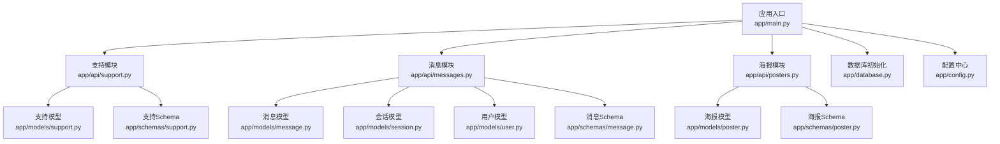
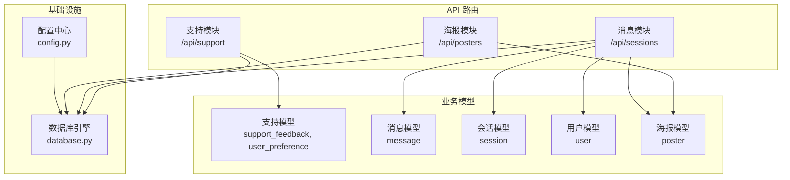
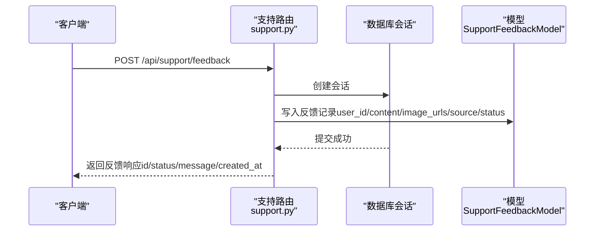
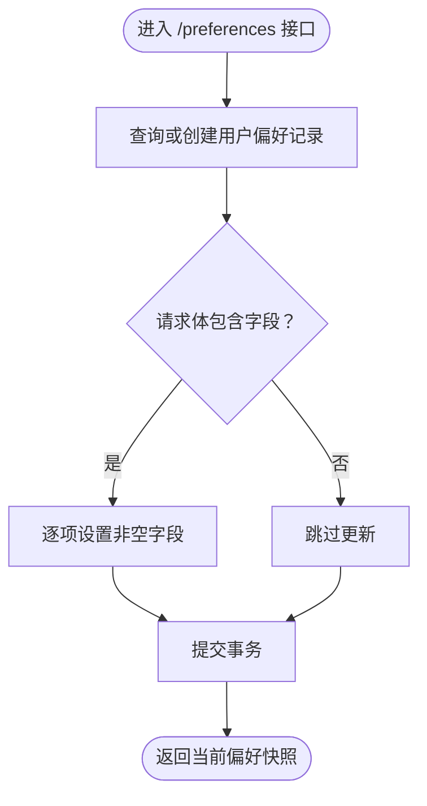
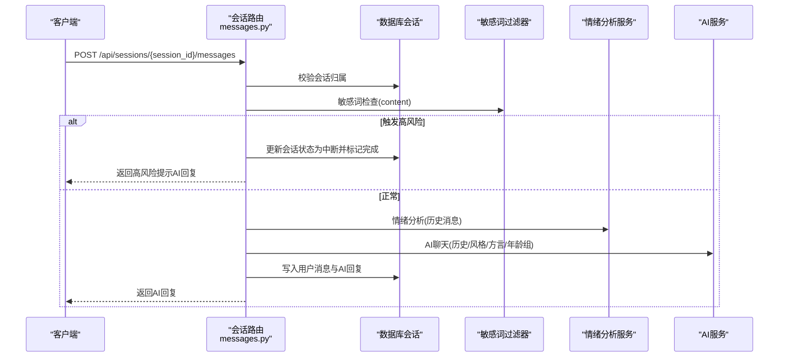
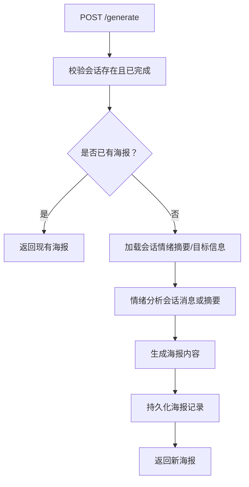
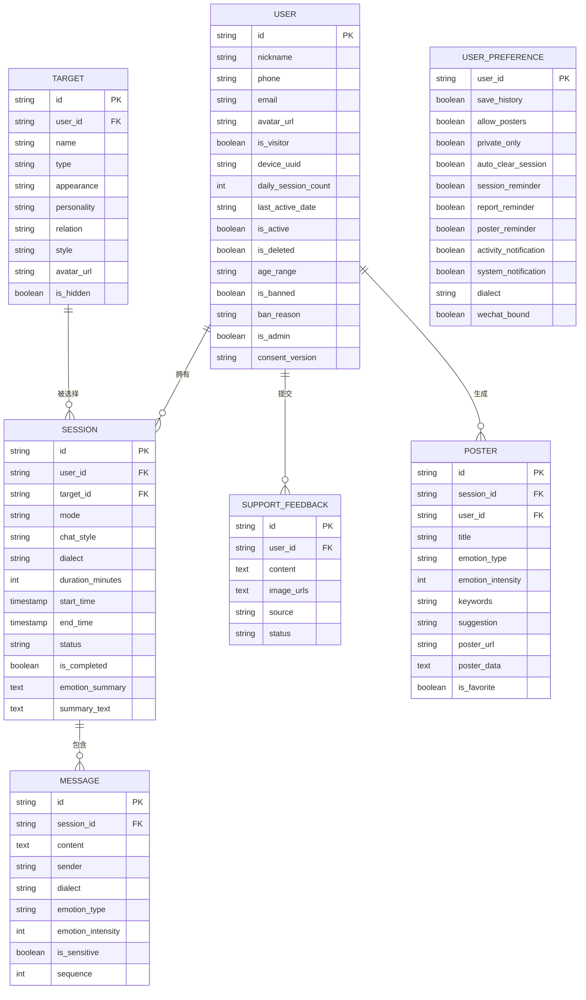
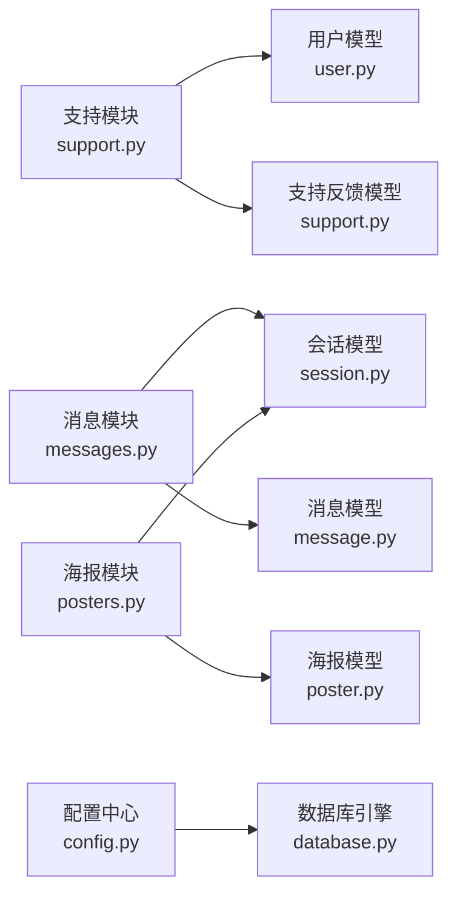

# 支持系统API

<cite>
**本文档引用的文件**
- [emo_outlet_api/app/main.py](file://emo_outlet_api/app/main.py)
- [emo_outlet_api/app/api/support.py](file://emo_outlet_api/app/api/support.py)
- [emo_outlet_api/app/models/support.py](file://emo_outlet_api/app/models/support.py)
- [emo_outlet_api/app/schemas/support.py](file://emo_outlet_api/app/schemas/support.py)
- [emo_outlet_api/app/models/message.py](file://emo_outlet_api/app/models/message.py)
- [emo_outlet_api/app/models/session.py](file://emo_outlet_api/app/models/session.py)
- [emo_outlet_api/app/models/user.py](file://emo_outlet_api/app/models/user.py)
- [emo_outlet_api/app/schemas/message.py](file://emo_outlet_api/app/schemas/message.py)
- [emo_outlet_api/app/schemas/poster.py](file://emo_outlet_api/app/schemas/poster.py)
- [emo_outlet_api/app/api/messages.py](file://emo_outlet_api/app/api/messages.py)
- [emo_outlet_api/app/api/posters.py](file://emo_outlet_api/app/api/posters.py)
- [emo_outlet_api/app/config.py](file://emo_outlet_api/app/config.py)
- [emo_outlet_api/app/database.py](file://emo_outlet_api/app/database.py)
</cite>

## 目录
1. [简介](#简介)
2. [项目结构](#项目结构)
3. [核心组件](#核心组件)
4. [架构总览](#架构总览)
5. [详细组件分析](#详细组件分析)
6. [依赖分析](#依赖分析)
7. [性能考虑](#性能考虑)
8. [故障排查指南](#故障排查指南)
9. [结论](#结论)
10. [附录](#附录)

## 简介
本文件为 Emo Outlet 支持系统 API 的完整技术文档，覆盖用户反馈、帮助中心、系统公告等支持功能接口；详细说明反馈提交、问题报告、FAQ 查询等客服相关功能的 API 实现；包含支持数据模型、反馈类型分类、处理状态管理的说明；提供用户支持流程、工单系统、客服回复等业务逻辑的 API 接口文档；记录系统配置、动态内容管理、多语言支持等功能的 API 实现；包含支持系统的权限控制、数据统计、服务质量监控等管理功能。

## 项目结构
后端采用 FastAPI 构建，路由按功能模块划分，数据库使用 SQLAlchemy ORM，异步连接池基于 asyncio。主程序负责注册中间件、异常处理器与各模块路由；支持模块提供“概览”“反馈”“偏好设置”等接口；消息与会话模块支撑情绪对话与审计；海报与报表模块提供可视化输出与趋势分析；配置模块集中管理运行参数与安全策略。

图表来源
- [emo_outlet_api/app/main.py:1-82](file://emo_outlet_api/app/main.py#L1-L82)
- [emo_outlet_api/app/api/support.py:1-140](file://emo_outlet_api/app/api/support.py#L1-L140)
- [emo_outlet_api/app/api/messages.py:1-216](file://emo_outlet_api/app/api/messages.py#L1-L216)
- [emo_outlet_api/app/api/posters.py:1-408](file://emo_outlet_api/app/api/posters.py#L1-L408)
- [emo_outlet_api/app/models/support.py:1-66](file://emo_outlet_api/app/models/support.py#L1-L66)
- [emo_outlet_api/app/models/message.py:1-46](file://emo_outlet_api/app/models/message.py#L1-L46)
- [emo_outlet_api/app/models/session.py:1-79](file://emo_outlet_api/app/models/session.py#L1-L79)
- [emo_outlet_api/app/models/user.py:1-52](file://emo_outlet_api/app/models/user.py#L1-L52)
- [emo_outlet_api/app/schemas/support.py:1-56](file://emo_outlet_api/app/schemas/support.py#L1-L56)
- [emo_outlet_api/app/schemas/message.py:1-33](file://emo_outlet_api/app/schemas/message.py#L1-L33)
- [emo_outlet_api/app/schemas/poster.py:1-71](file://emo_outlet_api/app/schemas/poster.py#L1-L71)
- [emo_outlet_api/app/database.py:1-43](file://emo_outlet_api/app/database.py#L1-L43)
- [emo_outlet_api/app/config.py:1-125](file://emo_outlet_api/app/config.py#L1-L125)

章节来源
- [emo_outlet_api/app/main.py:1-82](file://emo_outlet_api/app/main.py#L1-L82)

## 核心组件
- 支持模块（/api/support）
  - 提供支持概览、反馈提交、用户偏好读取与更新接口
  - 数据模型：支持反馈、用户偏好
  - Schema：概览响应、反馈请求/响应、偏好读取/更新
- 消息与会话模块（/api/sessions）
  - 提供会话内消息分页查询与发送，集成敏感词检测、情绪分析、合规审计
  - 数据模型：消息、会话、用户
  - Schema：消息请求/响应、列表响应
- 海报与报表模块（/api/posters）
  - 提供情绪海报生成、收藏管理、删除、详情查看；提供情绪概览与明细报表
  - 数据模型：海报（由会话派生）
  - Schema：海报请求/响应、详情响应、情绪分析结果、报表响应
- 配置与数据库
  - 配置中心集中管理数据库、Redis、AI服务、安全阈值等
  - 数据库初始化与会话生命周期管理

章节来源
- [emo_outlet_api/app/api/support.py:1-140](file://emo_outlet_api/app/api/support.py#L1-L140)
- [emo_outlet_api/app/models/support.py:1-66](file://emo_outlet_api/app/models/support.py#L1-L66)
- [emo_outlet_api/app/schemas/support.py:1-56](file://emo_outlet_api/app/schemas/support.py#L1-L56)
- [emo_outlet_api/app/api/messages.py:1-216](file://emo_outlet_api/app/api/messages.py#L1-L216)
- [emo_outlet_api/app/models/message.py:1-46](file://emo_outlet_api/app/models/message.py#L1-L46)
- [emo_outlet_api/app/models/session.py:1-79](file://emo_outlet_api/app/models/session.py#L1-L79)
- [emo_outlet_api/app/schemas/message.py:1-33](file://emo_outlet_api/app/schemas/message.py#L1-L33)
- [emo_outlet_api/app/api/posters.py:1-408](file://emo_outlet_api/app/api/posters.py#L1-L408)
- [emo_outlet_api/app/schemas/poster.py:1-71](file://emo_outlet_api/app/schemas/poster.py#L1-L71)
- [emo_outlet_api/app/config.py:1-125](file://emo_outlet_api/app/config.py#L1-L125)
- [emo_outlet_api/app/database.py:1-43](file://emo_outlet_api/app/database.py#L1-L43)

## 架构总览
系统采用模块化路由设计，统一通过主程序注册。支持模块与消息/会话/海报模块协同工作，形成“对话—分析—可视化—反馈”的闭环。数据库层统一由 async session 管理，配置层集中控制运行参数与安全策略。

图表来源
- [emo_outlet_api/app/main.py:51-63](file://emo_outlet_api/app/main.py#L51-L63)
- [emo_outlet_api/app/api/support.py:1-140](file://emo_outlet_api/app/api/support.py#L1-L140)
- [emo_outlet_api/app/api/messages.py:1-216](file://emo_outlet_api/app/api/messages.py#L1-L216)
- [emo_outlet_api/app/api/posters.py:1-408](file://emo_outlet_api/app/api/posters.py#L1-L408)
- [emo_outlet_api/app/models/support.py:27-66](file://emo_outlet_api/app/models/support.py#L27-L66)
- [emo_outlet_api/app/models/message.py:13-46](file://emo_outlet_api/app/models/message.py#L13-L46)
- [emo_outlet_api/app/models/session.py:13-79](file://emo_outlet_api/app/models/session.py#L13-L79)
- [emo_outlet_api/app/models/user.py:12-52](file://emo_outlet_api/app/models/user.py#L12-L52)
- [emo_outlet_api/app/config.py:1-125](file://emo_outlet_api/app/config.py#L1-L125)
- [emo_outlet_api/app/database.py:1-43](file://emo_outlet_api/app/database.py#L1-L43)

## 详细组件分析

### 支持模块 API
- 路由前缀：/api/support
- 主要接口
  - GET /overview：返回支持概览信息（在线状态、服务时间、联系方式、常见条目、预览消息）
  - POST /feedback：提交用户反馈（内容、图片URL列表、来源），返回反馈ID、状态、消息与创建时间
  - GET /preferences：获取用户偏好设置（历史保存、海报允许、仅私有、自动清理会话、提醒开关、通知开关、方言、微信绑定）
  - PUT /preferences：更新用户偏好设置（可部分更新）

图表来源
- [emo_outlet_api/app/api/support.py:64-91](file://emo_outlet_api/app/api/support.py#L64-L91)
- [emo_outlet_api/app/models/support.py:27-44](file://emo_outlet_api/app/models/support.py#L27-L44)
- [emo_outlet_api/app/schemas/support.py:17-28](file://emo_outlet_api/app/schemas/support.py#L17-L28)

图表来源
- [emo_outlet_api/app/api/support.py:93-140](file://emo_outlet_api/app/api/support.py#L93-L140)
- [emo_outlet_api/app/models/support.py:46-66](file://emo_outlet_api/app/models/support.py#L46-L66)
- [emo_outlet_api/app/schemas/support.py:30-56](file://emo_outlet_api/app/schemas/support.py#L30-L56)

章节来源
- [emo_outlet_api/app/api/support.py:1-140](file://emo_outlet_api/app/api/support.py#L1-L140)
- [emo_outlet_api/app/models/support.py:1-66](file://emo_outlet_api/app/models/support.py#L1-L66)
- [emo_outlet_api/app/schemas/support.py:1-56](file://emo_outlet_api/app/schemas/support.py#L1-L56)

### 消息与会话模块 API
- 路由前缀：/api/sessions
- 主要接口
  - GET /{session_id}/messages：分页获取会话消息（支持页码与每页大小），返回消息列表、总数、会话状态、剩余秒数
  - POST /{session_id}/messages：发送消息，执行敏感词检测、情绪分析、合规审计；根据规则中断或结束会话，并返回AI回复

图表来源
- [emo_outlet_api/app/api/messages.py:69-196](file://emo_outlet_api/app/api/messages.py#L69-L196)
- [emo_outlet_api/app/models/message.py:13-46](file://emo_outlet_api/app/models/message.py#L13-L46)
- [emo_outlet_api/app/models/session.py:13-79](file://emo_outlet_api/app/models/session.py#L13-L79)
- [emo_outlet_api/app/schemas/message.py:8-33](file://emo_outlet_api/app/schemas/message.py#L8-L33)

章节来源
- [emo_outlet_api/app/api/messages.py:1-216](file://emo_outlet_api/app/api/messages.py#L1-L216)
- [emo_outlet_api/app/models/message.py:1-46](file://emo_outlet_api/app/models/message.py#L1-L46)
- [emo_outlet_api/app/models/session.py:1-79](file://emo_outlet_api/app/models/session.py#L1-L79)
- [emo_outlet_api/app/schemas/message.py:1-33](file://emo_outlet_api/app/schemas/message.py#L1-L33)

### 海报与报表模块 API
- 路由前缀：/api/posters
- 主要接口
  - POST /generate：基于已完成会话生成情绪海报（若已存在则返回已有海报）
  - GET /：列出用户所有海报
  - GET /detail/{poster_id}：获取海报详情（含来源会话标题、标签、摘要等）
  - GET /session/{session_id}：按会话获取海报
  - PUT /{poster_id}/favorite：更新海报收藏状态
  - DELETE /{poster_id}：删除海报
  - GET /report/overview：按周期（日/周/月/年/全部）汇总情绪报告（主导情绪、分布、趋势、建议）
  - GET /report/detail：按周期统计模式分布、目标分布、时段分布、关键词TopN

图表来源
- [emo_outlet_api/app/api/posters.py:73-139](file://emo_outlet_api/app/api/posters.py#L73-L139)
- [emo_outlet_api/app/models/session.py:13-79](file://emo_outlet_api/app/models/session.py#L13-L79)
- [emo_outlet_api/app/schemas/poster.py:17-40](file://emo_outlet_api/app/schemas/poster.py#L17-L40)

章节来源
- [emo_outlet_api/app/api/posters.py:1-408](file://emo_outlet_api/app/api/posters.py#L1-L408)
- [emo_outlet_api/app/schemas/poster.py:1-71](file://emo_outlet_api/app/schemas/poster.py#L1-L71)

### 数据模型与关系
- 支持反馈（support_feedback）
  - 字段：主键ID、用户ID、内容、图片URL集合（JSON）、来源、状态、创建时间
  - 状态：提交（submitted）等
- 用户偏好（user_preference）
  - 字段：用户ID（主键）、历史保存、海报允许、仅私有、自动清理会话、各类提醒开关、通知开关、方言、微信绑定、更新时间
- 消息（message）
  - 字段：主键ID、会话ID、内容、发送方（user/ai/system）、方言、情绪类型、情绪强度、是否敏感、序列号、创建时间
- 会话（session）
  - 字段：主键ID、用户ID、目标ID、模式（单向/双向）、对话风格、方言、时长（分钟）、开始/结束时间、状态（待开始/进行中/正常结束/中断）、是否完成、情绪摘要、总结文本、创建/更新时间
- 用户（user）
  - 字段：主键ID、昵称、手机号/邮箱唯一、头像、访客标识、设备UUID、日均会话数、最后活跃日期、激活/删除状态、年龄区间、封禁状态与原因、管理员、同意版本、创建/更新时间

图表来源
- [emo_outlet_api/app/models/user.py:12-52](file://emo_outlet_api/app/models/user.py#L12-L52)
- [emo_outlet_api/app/models/session.py:13-79](file://emo_outlet_api/app/models/session.py#L13-L79)
- [emo_outlet_api/app/models/message.py:13-46](file://emo_outlet_api/app/models/message.py#L13-L46)
- [emo_outlet_api/app/models/support.py:27-66](file://emo_outlet_api/app/models/support.py#L27-L66)
- [emo_outlet_api/app/models/poster.py:1-408](file://emo_outlet_api/app/models/poster.py#L1-L408)

章节来源
- [emo_outlet_api/app/models/support.py:1-66](file://emo_outlet_api/app/models/support.py#L1-L66)
- [emo_outlet_api/app/models/message.py:1-46](file://emo_outlet_api/app/models/message.py#L1-L46)
- [emo_outlet_api/app/models/session.py:1-79](file://emo_outlet_api/app/models/session.py#L1-L79)
- [emo_outlet_api/app/models/user.py:1-52](file://emo_outlet_api/app/models/user.py#L1-L52)

## 依赖分析
- 组件耦合
  - 支持模块与用户模型存在一对一偏好关联，与反馈模型存在一对多关联
  - 消息模块与会话模块强关联，消息依赖会话状态与方言配置
  - 海报模块依赖会话完成状态与情绪摘要，间接依赖消息与目标模型
- 外部依赖
  - 数据库：MySQL 或 SQLite（异步引擎）
  - 配置：环境变量驱动的 Settings 类
  - 安全：敏感词过滤、合规审计日志、访问令牌与权限控制（依赖认证中间件与依赖注入）
- 循环依赖
  - 未发现模块间循环导入；模型与路由解耦良好

图表来源
- [emo_outlet_api/app/api/support.py:1-140](file://emo_outlet_api/app/api/support.py#L1-L140)
- [emo_outlet_api/app/api/messages.py:1-216](file://emo_outlet_api/app/api/messages.py#L1-L216)
- [emo_outlet_api/app/api/posters.py:1-408](file://emo_outlet_api/app/api/posters.py#L1-L408)
- [emo_outlet_api/app/models/user.py:12-52](file://emo_outlet_api/app/models/user.py#L12-L52)
- [emo_outlet_api/app/models/session.py:13-79](file://emo_outlet_api/app/models/session.py#L13-L79)
- [emo_outlet_api/app/models/message.py:13-46](file://emo_outlet_api/app/models/message.py#L13-L46)
- [emo_outlet_api/app/models/support.py:27-66](file://emo_outlet_api/app/models/support.py#L27-L66)
- [emo_outlet_api/app/config.py:1-125](file://emo_outlet_api/app/config.py#L1-L125)
- [emo_outlet_api/app/database.py:1-43](file://emo_outlet_api/app/database.py#L1-L43)

章节来源
- [emo_outlet_api/app/config.py:1-125](file://emo_outlet_api/app/config.py#L1-L125)
- [emo_outlet_api/app/database.py:1-43](file://emo_outlet_api/app/database.py#L1-L43)

## 性能考虑
- 异步数据库：使用 async engine 与 session，减少阻塞，提升并发
- 分页查询：消息列表支持分页，避免一次性加载大量数据
- 缓存与持久化：海报生成结果可复用，避免重复计算
- 敏感词与合规：高风险即时中断，降低后续处理成本
- 会话配额：按年龄组限制对话轮数，防止资源滥用

## 故障排查指南
- 常见错误与处理
  - 会话不存在或不属于当前用户：消息模块在查询会话时返回未找到错误
  - 会话已完成：消息模块禁止向已完成会话发送消息
  - 高风险内容：触发敏感词高风险时，会话状态转为中断并返回提示回复
  - 会话轮数上限：达到配置的对话轮数上限后自动结束
  - 海报生成：若会话未完成或已存在海报，返回相应错误或复用既有海报
- 日志与监控
  - 请求耗时中间件打印每个请求的耗时与状态码
  - 启动/关闭阶段打印应用生命周期日志
- 配置核对
  - 数据库连接串、AI服务密钥与地址、方言词库路径、合规开关等需正确配置

章节来源
- [emo_outlet_api/app/api/messages.py:32-67](file://emo_outlet_api/app/api/messages.py#L32-L67)
- [emo_outlet_api/app/api/messages.py:76-79](file://emo_outlet_api/app/api/messages.py#L76-L79)
- [emo_outlet_api/app/api/messages.py:109-113](file://emo_outlet_api/app/api/messages.py#L109-L113)
- [emo_outlet_api/app/api/messages.py:146-149](file://emo_outlet_api/app/api/messages.py#L146-L149)
- [emo_outlet_api/app/api/messages.py:186-192](file://emo_outlet_api/app/api/messages.py#L186-L192)
- [emo_outlet_api/app/api/posters.py:78-89](file://emo_outlet_api/app/api/posters.py#L78-L89)
- [emo_outlet_api/app/api/posters.py:232-248](file://emo_outlet_api/app/api/posters.py#L232-L248)
- [emo_outlet_api/app/main.py:33-39](file://emo_outlet_api/app/main.py#L33-L39)

## 结论
支持系统 API 已实现从“支持概览—用户反馈—偏好管理—消息对话—情绪海报—报表统计”的完整链路，具备敏感词检测、合规审计、会话配额与状态机控制等能力。通过模块化设计与异步数据库，系统在可用性与扩展性方面具有良好基础。建议后续完善客服工单系统、多语言动态内容管理与权限分级治理，以进一步增强支持体系的专业性与可运维性。

## 附录

### API 列表与说明

- 支持模块（/api/support）
  - GET /api/support/overview
    - 功能：获取支持概览（在线状态、服务时间、联系方式、常见条目、预览消息）
    - 权限：登录用户
    - 响应：概览响应对象
  - POST /api/support/feedback
    - 功能：提交用户反馈（内容、图片URL列表、来源）
    - 权限：登录用户
    - 请求体：反馈创建请求
    - 响应：反馈响应（含ID、状态、消息、创建时间）
  - GET /api/support/preferences
    - 功能：获取用户偏好设置
    - 权限：登录用户
    - 响应：偏好读取响应
  - PUT /api/support/preferences
    - 功能：更新用户偏好设置（可部分更新）
    - 权限：登录用户
    - 请求体：偏好更新请求
    - 响应：偏好读取响应

- 消息模块（/api/sessions）
  - GET /api/sessions/{session_id}/messages
    - 功能：分页获取会话消息
    - 权限：会话归属用户
    - 查询参数：page、page_size
    - 响应：消息列表与会话状态、剩余秒数
  - POST /api/sessions/{session_id}/messages
    - 功能：发送消息并获取AI回复
    - 权限：会话归属用户
    - 请求体：消息发送请求
    - 响应：消息响应（含情绪类型/强度、是否敏感）

- 海报与报表模块（/api/posters）
  - POST /api/posters/generate
    - 功能：基于已完成会话生成情绪海报
    - 权限：会话归属用户
    - 请求体：海报生成请求
    - 响应：海报响应
  - GET /api/posters/
    - 功能：列出用户所有海报
    - 权限：登录用户
    - 响应：海报数组
  - GET /api/posters/detail/{poster_id}
    - 功能：获取海报详情
    - 权限：海报归属用户
    - 响应：海报详情响应
  - GET /api/posters/session/{session_id}
    - 功能：按会话获取海报
    - 权限：会话归属用户
    - 响应：海报响应
  - PUT /api/posters/{poster_id}/favorite
    - 功能：更新海报收藏状态
    - 权限：海报归属用户
    - 请求体：收藏更新请求
    - 响应：海报响应
  - DELETE /api/posters/{poster_id}
    - 功能：删除海报
    - 权限：海报归属用户
    - 响应：无内容
  - GET /api/posters/report/overview
    - 功能：按周期汇总情绪报告
    - 权限：登录用户
    - 查询参数：period（daily/weekly/monthly/yearly/all）
    - 响应：情绪概览响应
  - GET /api/posters/report/detail
    - 功能：按周期明细统计
    - 权限：登录用户
    - 查询参数：period
    - 响应：情绪明细响应

章节来源
- [emo_outlet_api/app/api/support.py:41-140](file://emo_outlet_api/app/api/support.py#L41-L140)
- [emo_outlet_api/app/api/messages.py:32-196](file://emo_outlet_api/app/api/messages.py#L32-L196)
- [emo_outlet_api/app/api/posters.py:73-408](file://emo_outlet_api/app/api/posters.py#L73-L408)