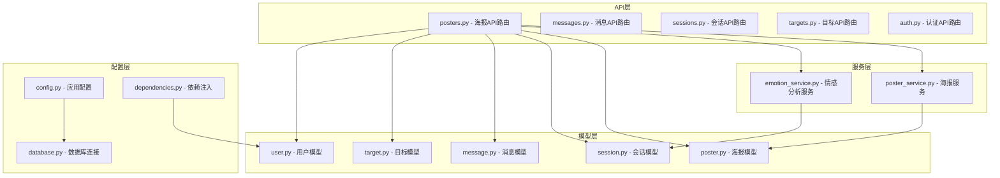
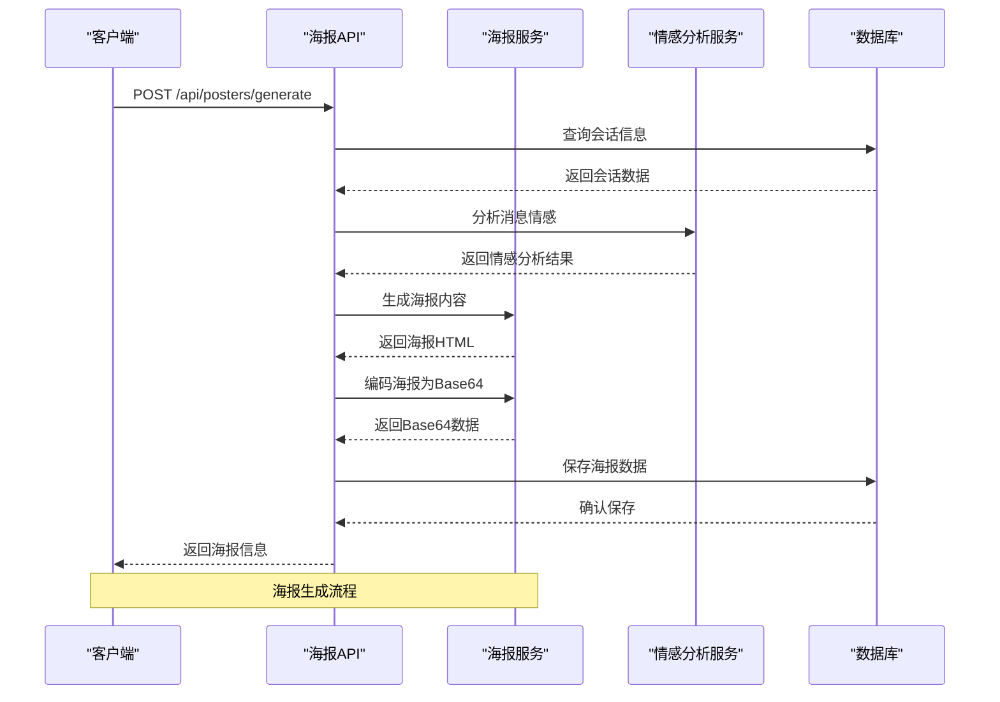
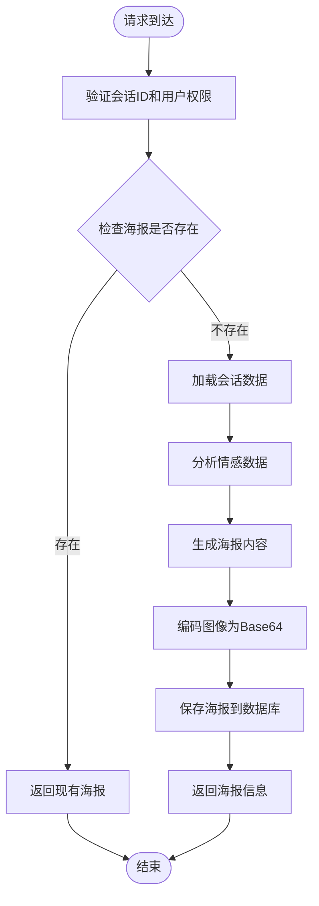
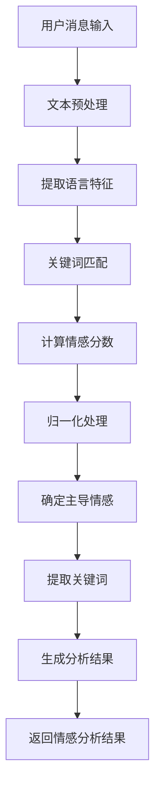
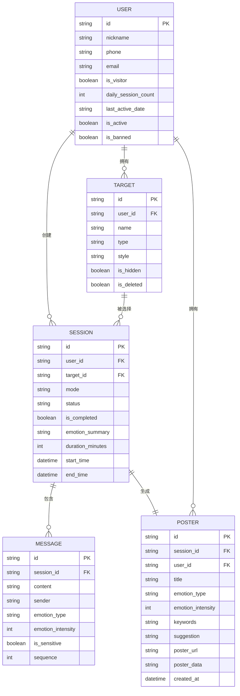
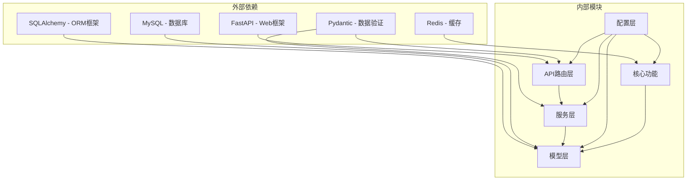

# 海报生成API

<cite>
**本文档引用的文件**
- [posters.py](file://emo_outlet_api/app/api/posters.py)
- [poster.py](file://emo_outlet_api/app/models/poster.py)
- [poster.py](file://emo_outlet_api/app/schemas/poster.py)
- [poster_service.py](file://emo_outlet_api/app/services/poster_service.py)
- [emotion_service.py](file://emo_outlet_api/app/services/emotion_service.py)
- [session.py](file://emo_outlet_api/app/models/session.py)
- [message.py](file://emo_outlet_api/app/models/message.py)
- [target.py](file://emo_outlet_api/app/models/target.py)
- [user.py](file://emo_outlet_api/app/models/user.py)
- [main.py](file://emo_outlet_api/app/main.py)
- [config.py](file://emo_outlet_api/app/config.py)
- [database.py](file://emo_outlet_api/app/database.py)
- [dependencies.py](file://emo_outlet_api/app/core/dependencies.py)
</cite>

## 目录
1. [简介](#简介)
2. [项目结构](#项目结构)
3. [核心组件](#核心组件)
4. [架构概览](#架构概览)
5. [详细组件分析](#详细组件分析)
6. [依赖关系分析](#依赖关系分析)
7. [性能考虑](#性能考虑)
8. [故障排除指南](#故障排除指南)
9. [结论](#结论)

## 简介

Emo Outlet海报生成API是一个基于FastAPI构建的后端服务，专门用于为情绪释放会话生成可视化海报。该API提供了完整的海报生命周期管理功能，包括海报创建、查询、详情获取、删除以及情绪分析报告生成等接口。

系统通过分析用户的情绪释放会话数据，自动生成具有情感色彩的视觉海报，并提供详细的情绪分析报告。海报采用响应式设计，支持多种情感类型的视觉呈现，每种情感都有独特的配色方案和设计元素。

## 项目结构

Emo Outlet API采用模块化架构设计，主要分为以下几个层次：

**图表来源**
- [posters.py:1-383](file://emo_outlet_api/app/api/posters.py#L1-L383)
- [poster_service.py:1-221](file://emo_outlet_api/app/services/poster_service.py#L1-L221)
- [emotion_service.py:1-181](file://emo_outlet_api/app/services/emotion_service.py#L1-L181)

**章节来源**
- [main.py:1-82](file://emo_outlet_api/app/main.py#L1-L82)
- [config.py:1-125](file://emo_outlet_api/app/config.py#L1-L125)

## 核心组件

### 海报生成服务

海报生成服务是整个系统的核心组件，负责将情绪分析结果转换为视觉海报。该服务包含以下关键功能：

- **情感样式映射**：为六种基本情感类型（愤怒、委屈、焦虑、疲惫、无奈、平静）提供独特的视觉样式
- **HTML模板生成**：动态生成符合要求的HTML模板
- **Base64图像编码**：将SVG图像转换为Base64格式便于传输
- **内容格式化**：处理海报标题、副标题、关键词等文本内容

### 情感分析服务

情感分析服务负责从用户的消息记录中提取情感信息，提供准确的情感分析结果：

- **关键词匹配**：基于预定义的情感关键词库进行匹配
- **统计特征提取**：分析文本中的标点符号、重复字符等语言特征
- **情感强度计算**：根据关键词出现频率和语言特征计算情感强度
- **摘要和建议生成**：为每种情感类型生成个性化的摘要和建议

### 数据模型

系统使用SQLAlchemy ORM定义了完整的数据模型，确保数据的一致性和完整性：

- **PosterModel**：海报实体，存储海报的基本信息和生成结果
- **SessionModel**：会话实体，记录用户的情绪释放会话
- **MessageModel**：消息实体，存储会话中的具体消息内容
- **TargetModel**：目标实体，管理用户的情绪释放对象
- **UserModel**：用户实体，存储用户基本信息和权限

**章节来源**
- [poster_service.py:66-221](file://emo_outlet_api/app/services/poster_service.py#L66-L221)
- [emotion_service.py:44-181](file://emo_outlet_api/app/services/emotion_service.py#L44-L181)
- [poster.py:13-61](file://emo_outlet_api/app/models/poster.py#L13-L61)

## 架构概览

系统采用分层架构设计，确保关注点分离和代码的可维护性：

**图表来源**
- [posters.py:72-137](file://emo_outlet_api/app/api/posters.py#L72-L137)
- [poster_service.py:66-90](file://emo_outlet_api/app/services/poster_service.py#L66-L90)
- [emotion_service.py:44-71](file://emo_outlet_api/app/services/emotion_service.py#L44-L71)

系统架构特点：
- **异步处理**：使用FastAPI的异步特性提升并发处理能力
- **依赖注入**：通过依赖注入机制管理数据库连接和认证
- **错误处理**：统一的异常处理机制确保系统的稳定性
- **数据验证**：使用Pydantic模型进行输入输出的数据验证

## 详细组件分析

### 海报API路由

海报API路由提供了完整的海报管理功能，包括创建、查询、详情获取和删除操作：

#### 创建海报接口

POST `/api/posters/generate` 接口负责根据会话数据生成海报：

**图表来源**
- [posters.py:72-137](file://emo_outlet_api/app/api/posters.py#L72-L137)

#### 海报查询接口

GET `/api/posters` 接口提供用户海报列表查询功能：

- 支持按创建时间倒序排列
- 仅返回当前用户的海报
- 返回标准化的海报响应格式

#### 情绪分析报告接口

系统提供两个级别的情绪分析报告：

1. **概览报告** (`/api/posters/report/overview`)
   - 统计指定时间段内的会话数量和总时长
   - 计算主导情感类型和分布情况
   - 生成每日趋势和个性化建议

2. **详细报告** (`/api/posters/report/detail`)
   - 提供更详细的时间分布、目标分布和关键词统计
   - 支持按时间段过滤数据
   - 包含会话模式分布和关键词频率分析

**章节来源**
- [posters.py:140-383](file://emo_outlet_api/app/api/posters.py#L140-L383)

### 海报服务实现

海报服务实现了完整的海报生成逻辑，包括内容生成、HTML模板构建和图像编码：

#### 情感样式系统

系统为每种情感类型定义了独特的视觉样式：

| 情感类型 | 主题色 | 强调色 | 标签 | 样式描述 |
|---------|--------|--------|------|----------|
| 愤怒 | #FF7B6B | #FFC29A | 释放·释放火气 | 红色渐变，火焰元素 |
| 委屈 | #FF8D9D | #FFD2D8 | 释放·接住委屈 | 粉色渐变，温暖元素 |
| 焦虑 | #8C7CFF | #D8D2FF | 释放·拆解压力 | 蓝紫色渐变，思考元素 |
| 疲惫 | #6CC6A2 | #D9F5E9 | 释放·安顿疲惫 | 绿色渐变，自然元素 |
| 无奈 | #F4A85A | #FFE3BC | 释放·松开执拗 | 橙色渐变，柔和元素 |
| 平静 | #6FA8FF | #D6E7FF | 释放·轻轻落地 | 蓝色渐变，稳定元素 |

#### HTML模板生成

海报服务使用内联CSS生成完整的HTML模板，确保在各种环境下都能正确显示：

- **响应式布局**：适配不同屏幕尺寸
- **渐变背景**：使用情感主题色的渐变效果
- **装饰元素**：包含圆形光晕等视觉装饰
- **关键词展示**：以标签形式展示提取的关键信息

**章节来源**
- [poster_service.py:10-59](file://emo_outlet_api/app/services/poster_service.py#L10-L59)
- [poster_service.py:92-189](file://emo_outlet_api/app/services/poster_service.py#L92-L189)

### 情感分析算法

情感分析服务使用综合算法分析用户的消息内容：

**图表来源**
- [emotion_service.py:44-71](file://emo_outlet_api/app/services/emotion_service.py#L44-L71)

#### 特征提取算法

情感分析包含多个维度的语言特征：

1. **关键词匹配**：基于预定义情感词汇库进行匹配
2. **标点符号分析**：统计感叹号、问号等标点符号的数量
3. **重复字符检测**：识别连续重复的字符模式
4. **文本长度统计**：分析文本的总体长度

#### 情感强度计算

情感强度通过以下公式计算：
- 关键词匹配得分：每个匹配的关键词贡献18分
- 标点符号调整：根据标点符号数量调整情感强度
- 文本长度影响：较长的文本通常代表更强的情感表达
- 重复字符权重：连续重复字符增加情感强度

**章节来源**
- [emotion_service.py:83-121](file://emo_outlet_api/app/services/emotion_service.py#L83-L121)

### 数据模型设计

系统使用SQLAlchemy ORM定义了完整的数据模型关系：

**图表来源**
- [user.py:12-52](file://emo_outlet_api/app/models/user.py#L12-L52)
- [target.py:13-56](file://emo_outlet_api/app/models/target.py#L13-L56)
- [session.py:13-79](file://emo_outlet_api/app/models/session.py#L13-L79)
- [message.py:13-46](file://emo_outlet_api/app/models/message.py#L13-L46)
- [poster.py:13-61](file://emo_outlet_api/app/models/poster.py#L13-L61)

**章节来源**
- [session.py:13-79](file://emo_outlet_api/app/models/session.py#L13-L79)
- [message.py:13-46](file://emo_outlet_api/app/models/message.py#L13-L46)
- [poster.py:13-61](file://emo_outlet_api/app/models/poster.py#L13-L61)

## 依赖关系分析

系统采用模块化设计，各组件之间的依赖关系清晰明确：

**图表来源**
- [main.py:51-64](file://emo_outlet_api/app/main.py#L51-L64)
- [config.py:12-125](file://emo_outlet_api/app/config.py#L12-L125)

### 核心依赖注入

系统使用依赖注入模式管理关键资源：

- **数据库连接**：通过异步会话工厂管理数据库连接池
- **认证服务**：JWT令牌验证和用户权限检查
- **配置管理**：集中式的应用配置管理
- **服务实例**：全局的服务实例共享

### 错误处理机制

系统实现了多层次的错误处理机制：

- **HTTP异常处理**：针对不同HTTP状态码的统一处理
- **数据库异常捕获**：自动事务回滚和异常传播
- **认证失败处理**：详细的认证错误信息
- **业务逻辑异常**：特定业务场景的异常处理

**章节来源**
- [dependencies.py:18-50](file://emo_outlet_api/app/core/dependencies.py#L18-L50)
- [database.py:22-32](file://emo_outlet_api/app/database.py#L22-L32)

## 性能考虑

### 缓存策略

系统采用多级缓存策略提升性能：

1. **内存缓存**：使用Redis作为分布式缓存
2. **数据库查询缓存**：对频繁查询的结果进行缓存
3. **静态资源缓存**：海报图像和模板文件的缓存
4. **会话数据缓存**：用户会话状态的短期缓存

### 数据库优化

- **异步数据库访问**：使用SQLAlchemy异步引擎提升并发性能
- **连接池管理**：合理配置连接池大小避免资源浪费
- **索引优化**：为常用查询字段建立合适的索引
- **批量操作**：支持批量插入和更新操作

### CDN集成

系统支持CDN集成以提升静态资源加载速度：

- **图像资源CDN**：海报图像和图标文件的CDN加速
- **静态文件CDN**：HTML模板和CSS文件的CDN分发
- **跨域资源共享**：支持CDN域名的CORS配置
- **缓存策略**：合理的缓存头设置和失效策略

### 性能监控

- **请求日志**：详细的请求处理时间和状态记录
- **数据库监控**：查询执行时间和慢查询监控
- **内存使用监控**：内存泄漏检测和内存使用优化
- **并发控制**：用户每日会话次数限制防止滥用

## 故障排除指南

### 常见问题诊断

#### 海报生成失败

**症状**：POST `/api/posters/generate` 返回错误

**可能原因**：
1. 会话不存在或不属于当前用户
2. 会话未完成或缺少情感分析数据
3. 数据库连接异常
4. 情感分析服务异常

**解决方案**：
1. 确认会话ID的有效性和用户权限
2. 检查会话状态是否为已完成
3. 验证数据库连接配置
4. 查看情感分析服务的日志

#### 海报查询为空

**症状**：GET `/api/posters` 返回空数组

**可能原因**：
1. 用户没有创建任何海报
2. 海报已被删除
3. 权限不足

**解决方案**：
1. 确认用户是否有有效的会话记录
2. 检查海报的删除状态
3. 验证用户认证状态

#### 情绪分析异常

**症状**：情感分析结果不符合预期

**可能原因**：
1. 消息内容为空或格式不正确
2. 关键词库配置错误
3. 分析算法参数不当

**解决方案**：
1. 检查消息数据的完整性和格式
2. 验证情感关键词库的配置
3. 调整情感分析的阈值参数

### 日志分析

系统提供了详细的日志记录功能：

- **请求日志**：记录所有HTTP请求的详细信息
- **数据库日志**：记录数据库操作的执行情况
- **错误日志**：记录系统异常和错误信息
- **性能日志**：记录关键操作的执行时间

**章节来源**
- [main.py:33-39](file://emo_outlet_api/app/main.py#L33-L39)
- [dependencies.py:39-43](file://emo_outlet_api/app/core/dependencies.py#L39-L43)

## 结论

Emo Outlet海报生成API是一个功能完整、架构清晰的后端服务系统。通过将情感分析与可视化设计相结合，为用户提供了一个独特的情绪释放体验。

系统的主要优势包括：

1. **完整的功能覆盖**：从会话管理到海报生成的全流程支持
2. **灵活的配置选项**：支持多种情感类型和视觉样式
3. **良好的扩展性**：模块化设计便于功能扩展和维护
4. **完善的错误处理**：多层次的异常处理确保系统稳定性
5. **性能优化**：异步处理和缓存策略提升系统性能

未来可以考虑的功能增强：
- 支持更多导出格式（PDF、PNG等）
- 增加海报模板自定义功能
- 实现海报分享和社交功能
- 添加更多的性能监控和分析工具