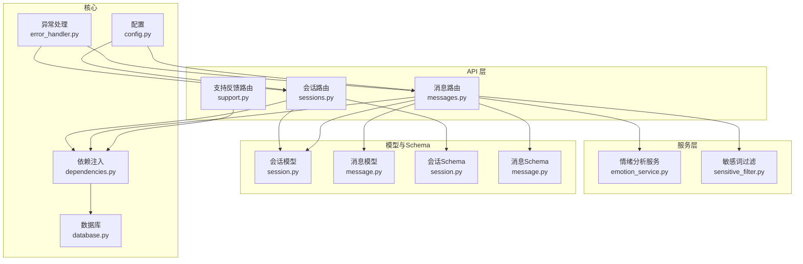
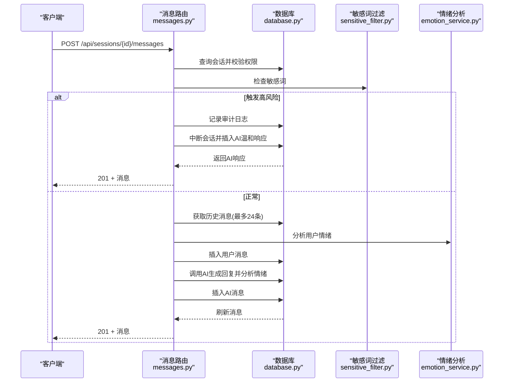
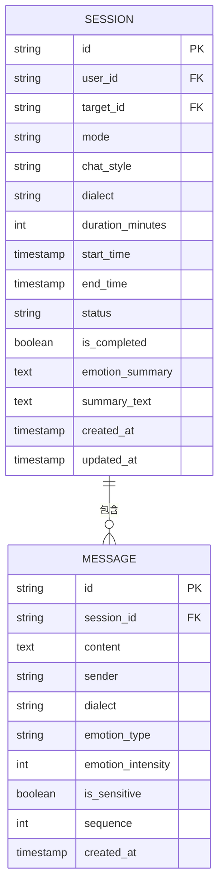
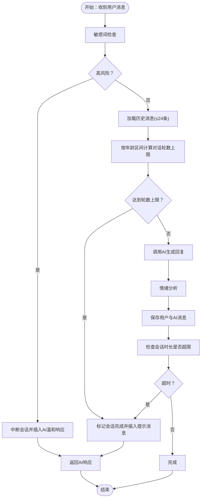
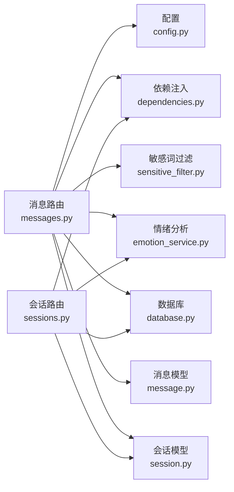

# 消息通信API

<cite>
**本文引用的文件**
- [app/main.py](file://emo_outlet_api/app/main.py)
- [app/api/messages.py](file://emo_outlet_api/app/api/messages.py)
- [app/api/sessions.py](file://emo_outlet_api/app/api/sessions.py)
- [app/models/message.py](file://emo_outlet_api/app/models/message.py)
- [app/models/session.py](file://emo_outlet_api/app/models/session.py)
- [app/schemas/message.py](file://emo_outlet_api/app/schemas/message.py)
- [app/schemas/session.py](file://emo_outlet_api/app/schemas/session.py)
- [app/services/emotion_service.py](file://emo_outlet_api/app/services/emotion_service.py)
- [app/utils/sensitive_filter.py](file://emo_outlet_api/app/utils/sensitive_filter.py)
- [app/config.py](file://emo_outlet_api/app/config.py)
- [app/core/dependencies.py](file://emo_outlet_api/app/core/dependencies.py)
- [app/core/error_handler.py](file://emo_outlet_api/app/core/error_handler.py)
- [app/database.py](file://emo_outlet_api/app/database.py)
- [app/api/support.py](file://emo_outlet_api/app/api/support.py)
- [app/models/compliance.py](file://emo_outlet_api/app/models/compliance.py)
- [app/schemas/poster.py](file://emo_outlet_api/app/schemas/poster.py)
- [run.py](file://emo_outlet_api/run.py)
</cite>

## 目录
1. [简介](#简介)
2. [项目结构](#项目结构)
3. [核心组件](#核心组件)
4. [架构总览](#架构总览)
5. [详细组件分析](#详细组件分析)
6. [依赖分析](#依赖分析)
7. [性能考虑](#性能考虑)
8. [故障排查指南](#故障排查指南)
9. [结论](#结论)
10. [附录](#附录)

## 简介
本文件为 Emo Outlet 消息通信 API 的完整技术文档，覆盖消息发送、接收、存储、会话管理、AI 回复生成、敏感词过滤、合规审计、情绪分析、分页查询、状态跟踪与错误处理等能力。文档同时给出数据模型、序列号管理、发送者标识、会话关联、实时交互模式与最佳实践建议。

## 项目结构
后端采用 FastAPI + SQLAlchemy Async 架构，按功能模块划分：
- API 层：会话与消息路由，负责请求入口与响应封装
- 服务层：情绪分析、海报生成等业务服务
- 工具层：敏感词过滤（DFA）
- 模型层：数据库 ORM 映射
- Schema 层：Pydantic 数据模型，用于请求/响应校验与序列化
- 核心模块：依赖注入、异常处理、数据库连接、配置

图表来源
- [app/api/sessions.py:26-220](file://emo_outlet_api/app/api/sessions.py#L26-L220)
- [app/api/messages.py:21-216](file://emo_outlet_api/app/api/messages.py#L21-L216)
- [app/api/support.py:18-71](file://emo_outlet_api/app/api/support.py#L18-L71)
- [app/services/emotion_service.py:44-181](file://emo_outlet_api/app/services/emotion_service.py#L44-L181)
- [app/utils/sensitive_filter.py:37-142](file://emo_outlet_api/app/utils/sensitive_filter.py#L37-L142)
- [app/models/session.py:13-79](file://emo_outlet_api/app/models/session.py#L13-L79)
- [app/models/message.py:13-46](file://emo_outlet_api/app/models/message.py#L13-L46)
- [app/schemas/session.py:8-49](file://emo_outlet_api/app/schemas/session.py#L8-L49)
- [app/schemas/message.py:8-33](file://emo_outlet_api/app/schemas/message.py#L8-L33)
- [app/core/dependencies.py:18-67](file://emo_outlet_api/app/core/dependencies.py#L18-L67)
- [app/core/error_handler.py:54-59](file://emo_outlet_api/app/core/error_handler.py#L54-L59)
- [app/database.py:34-43](file://emo_outlet_api/app/database.py#L34-L43)
- [app/config.py:12-125](file://emo_outlet_api/app/config.py#L12-L125)

章节来源
- [app/main.py:23-82](file://emo_outlet_api/app/main.py#L23-L82)
- [run.py:1-31](file://emo_outlet_api/run.py#L1-L31)

## 核心组件
- 会话管理：创建、查询、获取当前活动会话、结束会话并生成情绪分析摘要
- 消息通信：发送消息、分页获取消息列表、序列号管理、敏感词拦截与审计
- 情绪分析：基于关键词与统计特征计算情绪分布、强度与关键词提取
- 敏感词过滤：DFA + 正则高风险模式，支持高风险温和中断与响应
- 合规与审计：内容审计日志、同意记录
- 错误处理：统一异常处理与响应格式

章节来源
- [app/api/sessions.py:50-220](file://emo_outlet_api/app/api/sessions.py#L50-L220)
- [app/api/messages.py:32-196](file://emo_outlet_api/app/api/messages.py#L32-L196)
- [app/services/emotion_service.py:44-181](file://emo_outlet_api/app/services/emotion_service.py#L44-L181)
- [app/utils/sensitive_filter.py:37-142](file://emo_outlet_api/app/utils/sensitive_filter.py#L37-L142)
- [app/models/compliance.py:31-50](file://emo_outlet_api/app/models/compliance.py#L31-L50)
- [app/core/error_handler.py:54-59](file://emo_outlet_api/app/core/error_handler.py#L54-L59)

## 架构总览
系统通过 FastAPI 提供 REST 接口，使用 SQLAlchemy Async 进行数据库访问；消息发送流程串联敏感词过滤、情绪分析与 AI 服务，最终持久化并返回结果；会话维度贯穿消息的时序、方言、风格与状态。

图表来源
- [app/api/messages.py:69-196](file://emo_outlet_api/app/api/messages.py#L69-L196)
- [app/utils/sensitive_filter.py:102-119](file://emo_outlet_api/app/utils/sensitive_filter.py#L102-L119)
- [app/services/emotion_service.py:44-71](file://emo_outlet_api/app/services/emotion_service.py#L44-L71)
- [app/database.py:22-32](file://emo_outlet_api/app/database.py#L22-L32)

## 详细组件分析

### 会话管理 API
- 创建会话
  - 方法与路径：POST /api/sessions
  - 请求体：目标ID、模式、风格、方言、时长
  - 响应：会话信息（含目标名称、头像、状态、时间等）
  - 限制：按用户身份与年龄区间每日会话次数上限
- 查询会话列表
  - 方法与路径：GET /api/sessions
  - 参数：分页页码与大小
  - 响应：已完成会话列表
- 获取当前活动会话
  - 方法与路径：GET /api/sessions/active
  - 响应：活动会话或空
- 获取指定会话
  - 方法与路径：GET /api/sessions/{session_id}
  - 响应：会话详情
- 结束会话
  - 方法与路径：POST /api/sessions/{session_id}/end
  - 可选强制中断
  - 响应：会话、消息列表与情绪分析摘要

章节来源
- [app/api/sessions.py:50-220](file://emo_outlet_api/app/api/sessions.py#L50-L220)
- [app/schemas/session.py:8-49](file://emo_outlet_api/app/schemas/session.py#L8-L49)

### 消息通信 API
- 发送消息
  - 方法与路径：POST /api/sessions/{session_id}/messages
  - 请求体：消息内容（长度限制）
  - 流程要点：
    - 校验会话归属与状态
    - 敏感词检查（DFA + 高风险正则）
    - 高风险：中断会话并插入AI温和响应
    - 正常：读取历史消息（最多24条），根据用户年龄区间限制对话轮数
    - 调用AI生成回复并分析情绪，插入消息
    - 更新会话状态（超时或达到轮数上限）
  - 响应：新插入的消息
- 获取消息列表
  - 方法与路径：GET /api/sessions/{session_id}/messages
  - 参数：页码、每页数量
  - 响应：消息列表、总数、会话状态、剩余秒数

章节来源
- [app/api/messages.py:32-196](file://emo_outlet_api/app/api/messages.py#L32-L196)
- [app/schemas/message.py:8-33](file://emo_outlet_api/app/schemas/message.py#L8-L33)

### 实时交互与WebSocket（概念说明）
- 当前代码库未实现 WebSocket 路由或连接处理逻辑
- 若需实现实时推送，建议在现有消息写入后触发事件，配合 WebSocket 服务器推送增量消息
- 重连机制与心跳策略属于概念性建议，不在现有代码中体现

[本节为概念性说明，不直接分析具体文件，故无章节来源]

### 数据模型与序列号管理
- 消息模型
  - 字段：会话ID、内容、发送者（user/ai/system）、方言、情绪类型与强度、敏感标记、序列号、创建时间
  - 关系：属于会话，反向关联
- 会话模型
  - 字段：用户ID、目标ID、模式、风格、方言、时长、起止时间、状态、完成标记、情绪摘要、创建/更新时间
  - 关系：属于用户与目标，反向关联消息集合
- 序列号管理
  - 每个会话的消息按 sequence 升序排列，发送时通过查询当前最大值+1生成
  - 保证同一会话内消息顺序稳定，便于历史拼接与上下文分析

图表来源
- [app/models/session.py:13-79](file://emo_outlet_api/app/models/session.py#L13-L79)
- [app/models/message.py:13-46](file://emo_outlet_api/app/models/message.py#L13-L46)

章节来源
- [app/models/message.py:13-46](file://emo_outlet_api/app/models/message.py#L13-L46)
- [app/models/session.py:13-79](file://emo_outlet_api/app/models/session.py#L13-L79)
- [app/api/messages.py:211-216](file://emo_outlet_api/app/api/messages.py#L211-L216)

### 消息格式定义与事件类型
- 请求体
  - 发送消息：内容字符串（长度限制）
  - 创建会话：目标ID、模式、风格、方言、时长
- 响应体
  - 消息：包含发送者、方言、情绪类型与强度、敏感标记、序列号、创建时间
  - 会话：包含状态、时间、摘要、创建时间等
- 事件类型（概念性说明）
  - 当引入 WebSocket 时，可定义“消息新增”、“会话状态变更”等事件类型，由后端在写入完成后广播

章节来源
- [app/schemas/message.py:8-33](file://emo_outlet_api/app/schemas/message.py#L8-L33)
- [app/schemas/session.py:8-49](file://emo_outlet_api/app/schemas/session.py#L8-L49)

### 业务逻辑：AI 回复生成与情绪分析
- 情绪分析
  - 输入：消息列表（仅用户侧）
  - 输出：主情绪、情绪分布、强度、关键词、摘要与建议
  - 统计特征：字符数、感叹号/问号数量、重复字符等
- AI 回复
  - 输入：用户消息、会话模式、风格、方言、历史消息（最多24条）、用户年龄区间
  - 输出：AI 回复内容与情绪分析

图表来源
- [app/api/messages.py:69-196](file://emo_outlet_api/app/api/messages.py#L69-L196)
- [app/services/emotion_service.py:44-181](file://emo_outlet_api/app/services/emotion_service.py#L44-L181)
- [app/utils/sensitive_filter.py:102-119](file://emo_outlet_api/app/utils/sensitive_filter.py#L102-L119)

章节来源
- [app/services/emotion_service.py:44-181](file://emo_outlet_api/app/services/emotion_service.py#L44-L181)
- [app/utils/sensitive_filter.py:37-142](file://emo_outlet_api/app/utils/sensitive_filter.py#L37-L142)
- [app/api/messages.py:69-196](file://emo_outlet_api/app/api/messages.py#L69-L196)

### 敏感词过滤与合规审计
- 敏感词库：暴力/伤害、违法、政治敏感、色情/低俗、网暴/人身攻击等类别
- DFA 匹配：O(n) 复杂度，最长匹配优先
- 高风险正则：对自杀、杀人等高危意图进行补充识别
- 审计日志：当启用审计且存在敏感词时，记录用户ID、会话ID、命中关键词、处置动作等

章节来源
- [app/utils/sensitive_filter.py:11-142](file://emo_outlet_api/app/utils/sensitive_filter.py#L11-L142)
- [app/models/compliance.py:31-50](file://emo_outlet_api/app/models/compliance.py#L31-L50)
- [app/api/messages.py:96-113](file://emo_outlet_api/app/api/messages.py#L96-L113)

### 错误处理与安全
- 认证与授权：Bearer Token 解析与用户校验，封禁用户拒绝访问
- 异常处理：统一返回错误码与消息，区分 HTTP 异常与参数校验异常
- 依赖注入：统一获取当前用户与数据库会话

章节来源
- [app/core/dependencies.py:18-67](file://emo_outlet_api/app/core/dependencies.py#L18-L67)
- [app/core/error_handler.py:54-59](file://emo_outlet_api/app/core/error_handler.py#L54-L59)

## 依赖分析
- 组件耦合
  - 消息路由依赖会话模型、消息模型、情绪分析服务、敏感词过滤、配置与依赖注入
  - 会话路由依赖目标模型、用户模型、情绪服务与依赖注入
- 外部依赖
  - 数据库：SQLAlchemy Async（MySQL 或 SQLite）
  - 配置：pydantic-settings，支持多提供商（OpenAI/DeepSeek/DashScope）
  - 安全：JWT Bearer 认证
- 循环依赖
  - 未发现循环导入；各模块职责清晰

图表来源
- [app/api/messages.py:1-216](file://emo_outlet_api/app/api/messages.py#L1-L216)
- [app/api/sessions.py:1-220](file://emo_outlet_api/app/api/sessions.py#L1-L220)
- [app/config.py:64-80](file://emo_outlet_api/app/config.py#L64-L80)
- [app/core/dependencies.py:18-67](file://emo_outlet_api/app/core/dependencies.py#L18-L67)
- [app/utils/sensitive_filter.py:37-142](file://emo_outlet_api/app/utils/sensitive_filter.py#L37-L142)
- [app/services/emotion_service.py:44-181](file://emo_outlet_api/app/services/emotion_service.py#L44-L181)
- [app/database.py:34-43](file://emo_outlet_api/app/database.py#L34-L43)
- [app/models/message.py:13-46](file://emo_outlet_api/app/models/message.py#L13-L46)
- [app/models/session.py:13-79](file://emo_outlet_api/app/models/session.py#L13-L79)

章节来源
- [app/api/messages.py:1-216](file://emo_outlet_api/app/api/messages.py#L1-L216)
- [app/api/sessions.py:1-220](file://emo_outlet_api/app/api/sessions.py#L1-L220)
- [app/config.py:64-80](file://emo_outlet_api/app/config.py#L64-L80)
- [app/core/dependencies.py:18-67](file://emo_outlet_api/app/core/dependencies.py#L18-L67)
- [app/utils/sensitive_filter.py:37-142](file://emo_outlet_api/app/utils/sensitive_filter.py#L37-L142)
- [app/services/emotion_service.py:44-181](file://emo_outlet_api/app/services/emotion_service.py#L44-L181)
- [app/database.py:34-43](file://emo_outlet_api/app/database.py#L34-L43)

## 性能考虑
- 数据库
  - 使用异步引擎与会话工厂，减少阻塞
  - 分页查询与索引字段（会话ID、创建时间）有助于提升列表查询性能
- 敏感词过滤
  - DFA 构建 Trie 树，匹配复杂度 O(n)，适合高频文本扫描
- 情绪分析
  - 基于关键词与统计特征，避免深度学习开销；对历史消息限制在合理范围
- AI 调用
  - 通过配置切换不同提供商，结合缓存与并发控制优化吞吐

[本节提供通用指导，不直接分析具体文件，故无章节来源]

## 故障排查指南
- 常见错误
  - 401 未提供或无效令牌：检查 Authorization 头与签名
  - 403 账号被封禁：确认用户状态
  - 404 会话不存在：确认 session_id 与归属
  - 400 会话已完成：结束会话后无法继续发送消息
  - 429 达到每日会话上限：检查用户年龄区间与当日计数
  - 500 服务器内部错误：查看统一异常处理响应
- 审计与日志
  - 启用审计日志后，敏感内容会被记录；注意合规与隐私保护
- 本地调试
  - 开发环境使用 SQLite；生产环境使用 MySQL
  - 通过 run.py 查看启动与文档地址

章节来源
- [app/core/error_handler.py:54-59](file://emo_outlet_api/app/core/error_handler.py#L54-L59)
- [app/core/dependencies.py:18-67](file://emo_outlet_api/app/core/dependencies.py#L18-L67)
- [app/api/messages.py:77-78](file://emo_outlet_api/app/api/messages.py#L77-L78)
- [app/api/sessions.py:67-78](file://emo_outlet_api/app/api/sessions.py#L67-L78)
- [app/config.py:94-111](file://emo_outlet_api/app/config.py#L94-L111)
- [run.py:28-31](file://emo_outlet_api/run.py#L28-L31)

## 结论
本 API 以会话为中心，围绕消息的发送、存储与检索构建完整闭环，并集成敏感词过滤、情绪分析与 AI 回复生成，满足青少年与成人不同场景下的心理支持需求。建议后续引入 WebSocket 实现实时推送，并完善重连与心跳策略，持续优化性能与稳定性。

[本节为总结性内容，不直接分析具体文件，故无章节来源]

## 附录

### REST API 端点一览
- 会话
  - POST /api/sessions
  - GET /api/sessions
  - GET /api/sessions/active
  - GET /api/sessions/{session_id}
  - POST /api/sessions/{session_id}/end
- 消息
  - POST /api/sessions/{session_id}/messages
  - GET /api/sessions/{session_id}/messages
- 支持反馈
  - GET /api/support/overview
  - POST /api/support/feedback

章节来源
- [app/api/sessions.py:50-220](file://emo_outlet_api/app/api/sessions.py#L50-L220)
- [app/api/messages.py:32-196](file://emo_outlet_api/app/api/messages.py#L32-L196)
- [app/api/support.py:21-71](file://emo_outlet_api/app/api/support.py#L21-L71)

### 配置项要点
- 数据库：MySQL 或 SQLite
- AI 提供商与模型：OpenAI/DeepSeek/DashScope/Mock
- 安全：JWT 密钥、过期时间
- 业务限制：每日会话上限、对话轮数上限、消息长度、会话时长

章节来源
- [app/config.py:12-125](file://emo_outlet_api/app/config.py#L12-L125)