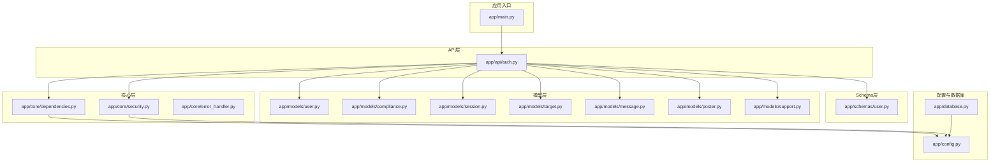
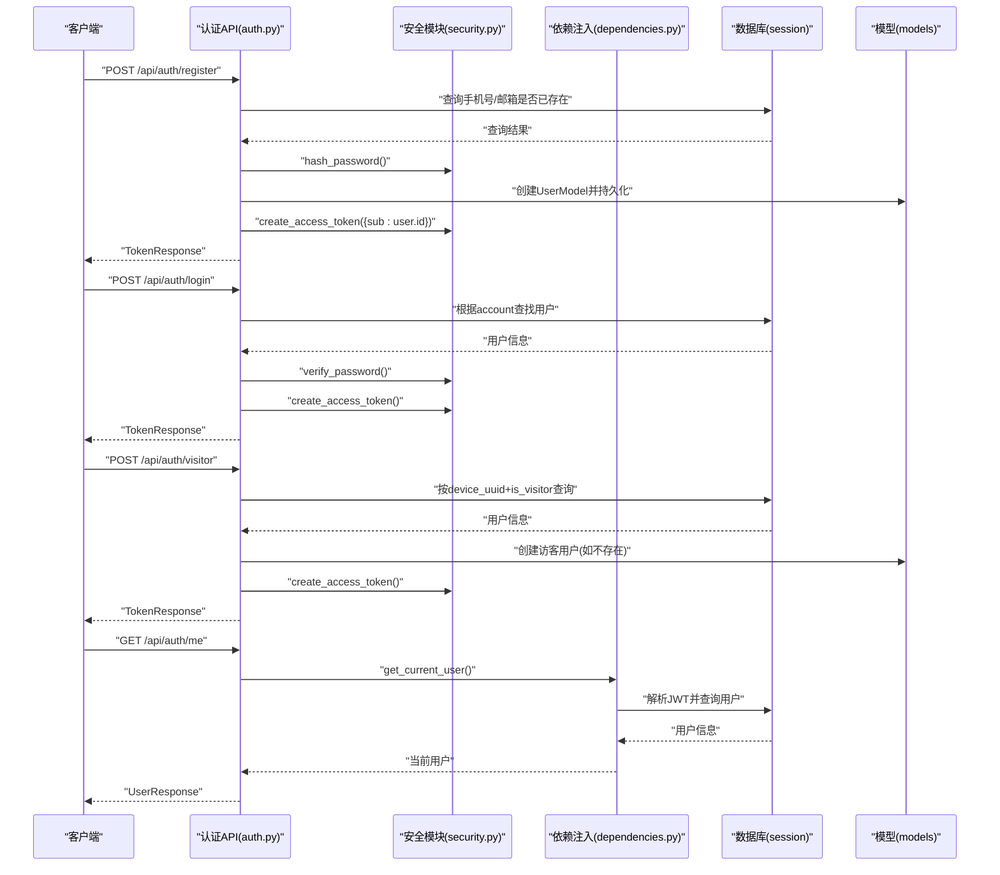
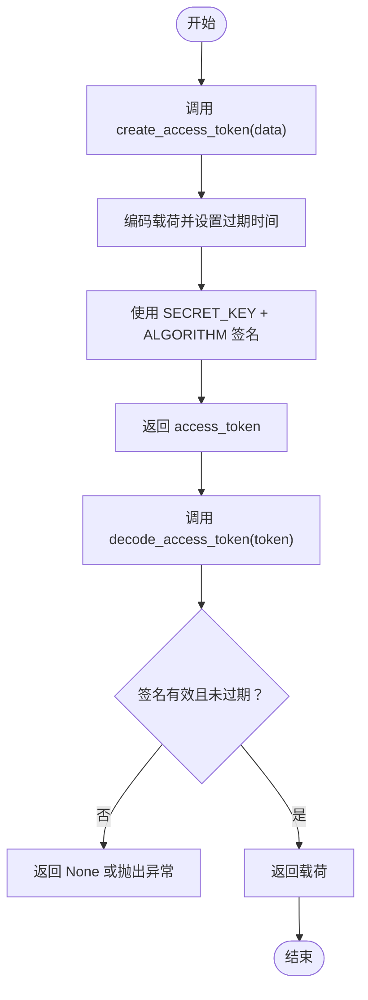
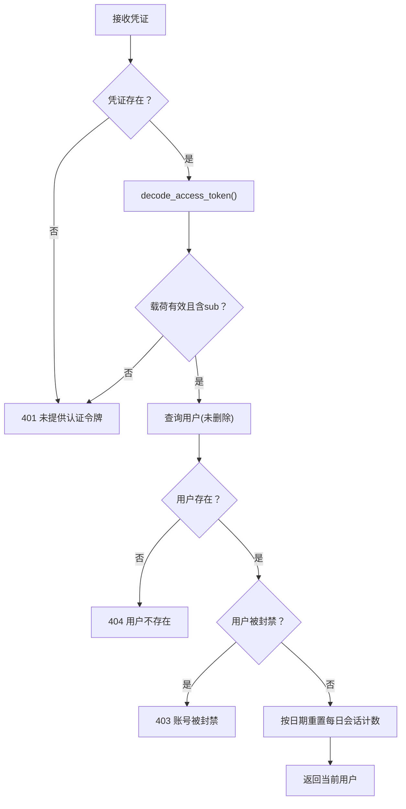
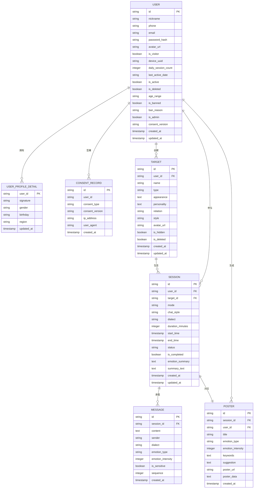
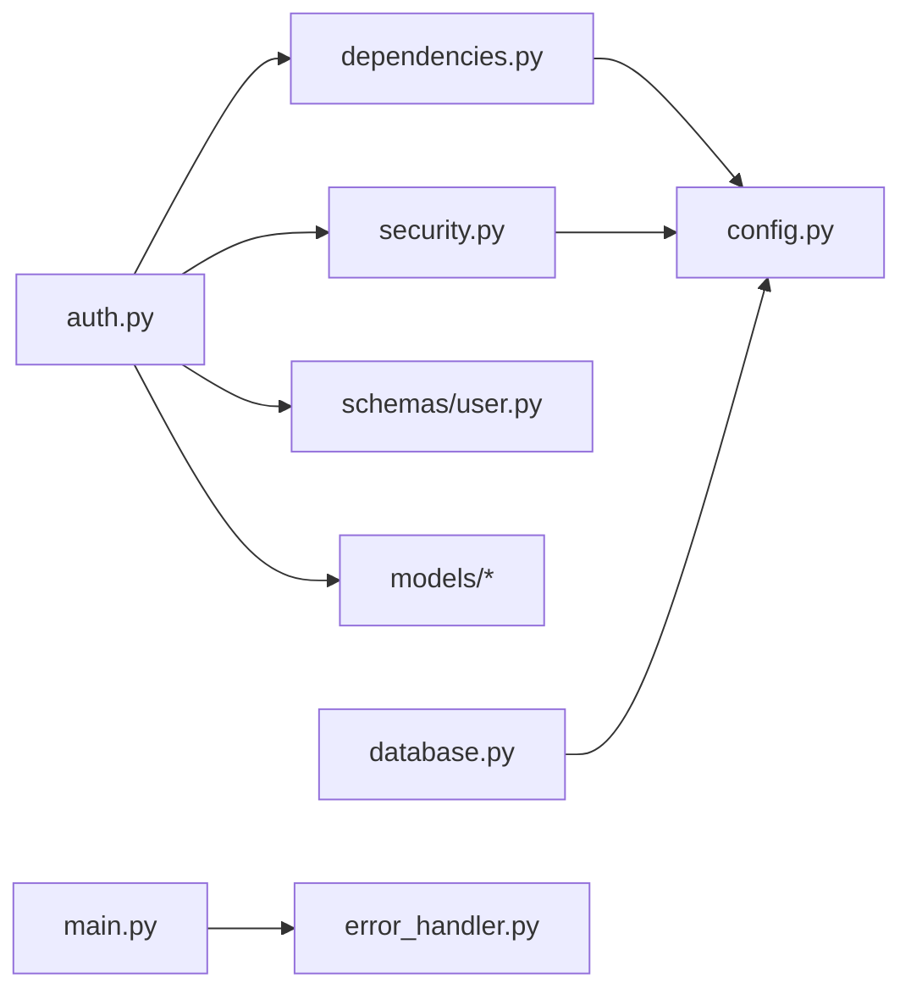

# 用户认证API

<cite>
**本文档引用的文件**
- [auth.py](file://emo_outlet_api/app/api/auth.py)
- [security.py](file://emo_outlet_api/app/core/security.py)
- [dependencies.py](file://emo_outlet_api/app/core/dependencies.py)
- [user.py](file://emo_outlet_api/app/models/user.py)
- [compliance.py](file://emo_outlet_api/app/models/compliance.py)
- [user.py（schemas）](file://emo_outlet_api/app/schemas/user.py)
- [config.py](file://emo_outlet_api/app/config.py)
- [database.py](file://emo_outlet_api/app/database.py)
- [main.py](file://emo_outlet_api/app/main.py)
- [error_handler.py](file://emo_outlet_api/app/core/error_handler.py)
- [session.py](file://emo_outlet_api/app/models/session.py)
- [target.py](file://emo_outlet_api/app/models/target.py)
- [message.py](file://emo_outlet_api/app/models/message.py)
- [poster.py](file://emo_outlet_api/app/models/poster.py)
- [support.py](file://emo_outlet_api/app/models/support.py)
</cite>

## 目录
1. [简介](#简介)
2. [项目结构](#项目结构)
3. [核心组件](#核心组件)
4. [架构总览](#架构总览)
5. [详细组件分析](#详细组件分析)
6. [依赖关系分析](#依赖关系分析)
7. [性能考虑](#性能考虑)
8. [故障排除指南](#故障排除指南)
9. [结论](#结论)
10. [附录](#附录)

## 简介
本文件为 Emo Outlet 用户认证API的权威技术文档，覆盖用户注册、登录、访客登录、个人信息与详情管理、账户注销、数据导出等完整认证与合规流程。文档详细说明了每个接口的HTTP方法、URL路径、请求参数、响应格式、错误处理策略；解释了JWT令牌生成与验证机制、用户权限控制、设备指纹识别与防沉迷策略；并提供了请求与响应示例、最佳实践与合规功能（隐私政策同意记录、年龄范围验证）的说明。

## 项目结构
后端采用FastAPI + SQLAlchemy异步ORM + Pydantic数据校验的分层架构：
- API层：路由定义与业务编排
- 核心层：安全与依赖注入（JWT、密码哈希、当前用户解析）
- 模型层：数据库实体与关系映射
- Schema层：请求/响应数据结构与校验规则
- 配置层：应用配置与环境变量
- 中间件与异常处理：CORS、健康检查、统一异常处理

图表来源
- [main.py:23-64](file://emo_outlet_api/app/main.py#L23-L64)
- [auth.py:30-332](file://emo_outlet_api/app/api/auth.py#L30-L332)
- [security.py:1-43](file://emo_outlet_api/app/core/security.py#L1-L43)
- [dependencies.py:18-67](file://emo_outlet_api/app/core/dependencies.py#L18-L67)
- [user.py（schemas）:8-74](file://emo_outlet_api/app/schemas/user.py#L8-L74)
- [user.py:14-56](file://emo_outlet_api/app/models/user.py#L14-L56)
- [compliance.py:12-50](file://emo_outlet_api/app/models/compliance.py#L12-L50)
- [session.py:13-79](file://emo_outlet_api/app/models/session.py#L13-L79)
- [target.py:13-56](file://emo_outlet_api/app/models/target.py#L13-L56)
- [message.py:13-46](file://emo_outlet_api/app/models/message.py#L13-L46)
- [poster.py:13-61](file://emo_outlet_api/app/models/poster.py#L13-L61)
- [support.py:12-44](file://emo_outlet_api/app/models/support.py#L12-L44)
- [config.py:12-125](file://emo_outlet_api/app/config.py#L12-L125)
- [database.py:1-43](file://emo_outlet_api/app/database.py#L1-L43)

章节来源
- [main.py:23-64](file://emo_outlet_api/app/main.py#L23-L64)
- [auth.py:30-332](file://emo_outlet_api/app/api/auth.py#L30-L332)

## 核心组件
- 路由器与前缀：认证相关接口位于 /api/auth 前缀下，标签为 auth
- 当前用户依赖：通过HTTP Bearer令牌解析当前用户，支持封禁状态检查与每日会话次数重置
- 安全模块：密码哈希与验证使用bcrypt；JWT令牌基于HS256算法，有效期7天
- 设备指纹：访客登录基于device_uuid唯一标识；注册可绑定device_uuid
- 合规与审计：隐私政策与服务条款同意记录；内容审计日志表结构预留
- 数据导出：按用户维度导出会话、消息、目标与海报数据

章节来源
- [auth.py:30-332](file://emo_outlet_api/app/api/auth.py#L30-L332)
- [dependencies.py:18-67](file://emo_outlet_api/app/core/dependencies.py#L18-L67)
- [security.py:16-43](file://emo_outlet_api/app/core/security.py#L16-L43)
- [compliance.py:12-50](file://emo_outlet_api/app/models/compliance.py#L12-L50)

## 架构总览
认证流程涉及客户端、API层、安全中间件、数据库与模型层的协作：

图表来源
- [auth.py:33-120](file://emo_outlet_api/app/api/auth.py#L33-L120)
- [auth.py:123-125](file://emo_outlet_api/app/api/auth.py#L123-L125)
- [security.py:16-43](file://emo_outlet_api/app/core/security.py#L16-L43)
- [dependencies.py:18-50](file://emo_outlet_api/app/core/dependencies.py#L18-L50)

## 详细组件分析

### 接口总览与最佳实践
- 所有需要身份认证的接口均需在请求头携带 Authorization: Bearer <token>
- 成功响应通常包含 access_token 与 user 字段；部分接口返回特定数据模型
- 参数校验失败返回422，未提供或无效令牌返回401，用户被封禁返回403
- 建议：生产环境务必更换默认密钥、启用HTTPS、限制跨域来源

章节来源
- [auth.py:30-332](file://emo_outlet_api/app/api/auth.py#L30-L332)
- [dependencies.py:18-50](file://emo_outlet_api/app/core/dependencies.py#L18-L50)
- [error_handler.py:10-59](file://emo_outlet_api/app/core/error_handler.py#L10-L59)

### 注册接口
- 方法与路径：POST /api/auth/register
- 请求体：UserRegisterRequest
  - 字段：nickname、phone、email、password、device_uuid、consent_version、age_range
  - 校验：手机号正则、密码长度、昵称长度、可选字段
- 业务逻辑：
  - 检查手机号/邮箱唯一性
  - 生成默认昵称（若未提供）
  - 密码哈希存储
  - 可选写入隐私政策与服务条款同意记录
  - 生成JWT访问令牌
- 响应：TokenResponse（access_token、token_type、user）

请求示例（路径）
- [注册请求示例:33-76](file://emo_outlet_api/app/api/auth.py#L33-L76)

响应示例（路径）
- [注册成功响应示例:74-75](file://emo_outlet_api/app/api/auth.py#L74-L75)

错误处理
- 409：手机号或邮箱已存在
- 422：请求参数校验失败
- 500：服务器内部错误

章节来源
- [auth.py:33-76](file://emo_outlet_api/app/api/auth.py#L33-L76)
- [user.py（schemas）:8-16](file://emo_outlet_api/app/schemas/user.py#L8-L16)
- [security.py:16-24](file://emo_outlet_api/app/core/security.py#L16-L24)

### 登录接口
- 方法与路径：POST /api/auth/login
- 请求体：UserLoginRequest
  - 字段：account（手机号或邮箱）、password
- 业务逻辑：
  - 根据account匹配用户
  - 验证密码哈希
  - 生成JWT访问令牌
- 响应：TokenResponse

请求示例（路径）
- [登录请求示例:78-94](file://emo_outlet_api/app/api/auth.py#L78-L94)

响应示例（路径）
- [登录成功响应示例:92-93](file://emo_outlet_api/app/api/auth.py#L92-L93)

错误处理
- 401：账号或密码错误
- 422：请求参数校验失败
- 500：服务器内部错误

章节来源
- [auth.py:78-94](file://emo_outlet_api/app/api/auth.py#L78-L94)
- [user.py（schemas）:18-21](file://emo_outlet_api/app/schemas/user.py#L18-L21)
- [security.py:21-24](file://emo_outlet_api/app/core/security.py#L21-L24)

### 访客登录接口
- 方法与路径：POST /api/auth/visitor
- 请求体：VisitorLoginRequest
  - 字段：device_uuid、nickname
- 业务逻辑：
  - 根据device_uuid与is_visitor=true查询
  - 若不存在则创建访客用户
  - 生成JWT访问令牌
- 响应：TokenResponse

请求示例（路径）
- [访客登录请求示例:96-121](file://emo_outlet_api/app/api/auth.py#L96-L121)

响应示例（路径）
- [访客登录成功响应示例:119-120](file://emo_outlet_api/app/api/auth.py#L119-L120)

错误处理
- 422：请求参数校验失败
- 500：服务器内部错误

章节来源
- [auth.py:96-121](file://emo_outlet_api/app/api/auth.py#L96-L121)
- [user.py（schemas）:23-26](file://emo_outlet_api/app/schemas/user.py#L23-L26)

### 获取当前用户资料
- 方法与路径：GET /api/auth/me
- 认证：需要Bearer令牌
- 响应：UserResponse

请求示例（路径）
- [获取当前用户请求示例:123-125](file://emo_outlet_api/app/api/auth.py#L123-L125)

响应示例（路径）
- [获取当前用户响应示例:124-125](file://emo_outlet_api/app/api/auth.py#L124-L125)

错误处理
- 401：未提供或无效令牌
- 404：用户不存在
- 403：用户被封禁
- 500：服务器内部错误

章节来源
- [auth.py:123-125](file://emo_outlet_api/app/api/auth.py#L123-L125)
- [dependencies.py:18-50](file://emo_outlet_api/app/core/dependencies.py#L18-L50)

### 更新当前用户资料
- 方法与路径：PUT /api/auth/me
- 请求体：UserUpdateRequest
  - 字段：nickname、avatar_url
- 认证：需要Bearer令牌
- 响应：UserResponse

请求示例（路径）
- [更新用户资料请求示例:128-142](file://emo_outlet_api/app/api/auth.py#L128-L142)

响应示例（路径）
- [更新用户资料响应示例:140-142](file://emo_outlet_api/app/api/auth.py#L140-L142)

错误处理
- 401：未提供或无效令牌
- 422：请求参数校验失败
- 500：服务器内部错误

章节来源
- [auth.py:128-142](file://emo_outlet_api/app/api/auth.py#L128-L142)
- [user.py（schemas）:51-54](file://emo_outlet_api/app/schemas/user.py#L51-L54)

### 获取用户详情
- 方法与路径：GET /api/auth/profile-detail
- 认证：需要Bearer令牌
- 响应：UserProfileDetailResponse（包含默认值）
- 业务逻辑：若无详情记录则返回默认值

请求示例（路径）
- [获取用户详情请求示例:145-166](file://emo_outlet_api/app/api/auth.py#L145-L166)

响应示例（路径）
- [获取用户详情响应示例:156-165](file://emo_outlet_api/app/api/auth.py#L156-L165)

错误处理
- 401：未提供或无效令牌
- 500：服务器内部错误

章节来源
- [auth.py:145-166](file://emo_outlet_api/app/api/auth.py#L145-L166)
- [user.py（schemas）:56-65](file://emo_outlet_api/app/schemas/user.py#L56-L65)

### 更新用户详情
- 方法与路径：PUT /api/auth/profile-detail
- 请求体：UserProfileDetailUpdateRequest
  - 字段：nickname、avatar_url、signature、gender、birthday、region
- 认证：需要Bearer令牌
- 响应：UserProfileDetailResponse

请求示例（路径）
- [更新用户详情请求示例:168-210](file://emo_outlet_api/app/api/auth.py#L168-L210)

响应示例（路径）
- [更新用户详情响应示例:200-209](file://emo_outlet_api/app/api/auth.py#L200-L209)

错误处理
- 401：未提供或无效令牌
- 422：请求参数校验失败
- 500：服务器内部错误

章节来源
- [auth.py:168-210](file://emo_outlet_api/app/api/auth.py#L168-L210)
- [user.py（schemas）:67-74](file://emo_outlet_api/app/schemas/user.py#L67-L74)

### 账户注销
- 方法与路径：DELETE /api/auth/account
- 认证：需要Bearer令牌
- 业务逻辑：级联删除会话、消息、目标、海报、同意记录与详情；软删除用户关键字段
- 响应：操作结果消息

请求示例（路径）
- [账户注销请求示例:212-240](file://emo_outlet_api/app/api/auth.py#L212-L240)

错误处理
- 401：未提供或无效令牌
- 500：服务器内部错误

章节来源
- [auth.py:212-240](file://emo_outlet_api/app/api/auth.py#L212-L240)

### 导出用户数据
- 方法与路径：GET /api/auth/data/export
- 认证：需要Bearer令牌
- 响应：包含用户、目标、会话、消息、海报与导出时间的聚合数据
- 业务逻辑：按用户关联查询并序列化

请求示例（路径）
- [数据导出请求示例:242-332](file://emo_outlet_api/app/api/auth.py#L242-L332)

错误处理
- 401：未提供或无效令牌
- 500：服务器内部错误

章节来源
- [auth.py:242-332](file://emo_outlet_api/app/api/auth.py#L242-L332)

### JWT令牌生成与验证机制
- 生成：create_access_token(data) 将 {sub: user_id} 编码，加入过期时间，使用SECRET_KEY与ALGORITHM生成
- 验证：decode_access_token(token) 解码并校验签名；get_current_user从Authorization中提取令牌并解析用户
- 过期策略：ACCESS_TOKEN_EXPIRE_MINUTES（默认7天）
- 安全建议：生产环境必须设置强密钥与HTTPS

图表来源
- [security.py:26-43](file://emo_outlet_api/app/core/security.py#L26-L43)
- [dependencies.py:25-27](file://emo_outlet_api/app/core/dependencies.py#L25-L27)

章节来源
- [security.py:16-43](file://emo_outlet_api/app/core/security.py#L16-L43)
- [config.py:54-62](file://emo_outlet_api/app/config.py#L54-L62)

### 用户权限控制与封禁机制
- get_current_user会：
  - 校验Bearer令牌有效性
  - 查询用户是否存在且未删除
  - 检查是否被封禁（返回403）
  - 按日期重置每日会话计数
- 年龄与访客限制：通过check_daily_session_limit按年龄段与访客类型限制每日会话数

图表来源
- [dependencies.py:18-50](file://emo_outlet_api/app/core/dependencies.py#L18-L50)

章节来源
- [dependencies.py:18-67](file://emo_outlet_api/app/core/dependencies.py#L18-L67)
- [config.py:97-107](file://emo_outlet_api/app/config.py#L97-L107)

### 设备指纹识别与访客登录
- 设备指纹：device_uuid作为访客唯一标识
- 访客登录：若同设备UUID且is_visitor=true的用户不存在，则自动创建访客用户
- 注册绑定：注册时可选择绑定device_uuid

章节来源
- [auth.py:96-121](file://emo_outlet_api/app/api/auth.py#L96-L121)
- [user.py（schemas）:23-26](file://emo_outlet_api/app/schemas/user.py#L23-L26)
- [user.py:26](file://emo_outlet_api/app/models/user.py#L26)

### 合规功能：隐私政策同意记录与年龄范围验证
- 隐私同意：注册时可传入consent_version，系统自动为隐私政策与服务条款各创建一条同意记录
- 年龄范围：注册时可传入age_range（"<14" / "14-18" / ">18"），用于后续防沉迷与内容策略

章节来源
- [auth.py:63-72](file://emo_outlet_api/app/api/auth.py#L63-L72)
- [compliance.py:12-29](file://emo_outlet_api/app/models/compliance.py#L12-L29)
- [user.py（models）:33-41](file://emo_outlet_api/app/models/user.py#L33-L41)
- [user.py（schemas）:13-15](file://emo_outlet_api/app/schemas/user.py#L13-L15)

### 数据模型与字段定义
用户相关核心模型与字段概览：

图表来源
- [user.py:14-56](file://emo_outlet_api/app/models/user.py#L14-L56)
- [support.py:12-24](file://emo_outlet_api/app/models/support.py#L12-L24)
- [compliance.py:12-29](file://emo_outlet_api/app/models/compliance.py#L12-L29)
- [target.py:13-56](file://emo_outlet_api/app/models/target.py#L13-L56)
- [session.py:13-79](file://emo_outlet_api/app/models/session.py#L13-L79)
- [message.py:13-46](file://emo_outlet_api/app/models/message.py#L13-L46)
- [poster.py:13-61](file://emo_outlet_api/app/models/poster.py#L13-L61)

## 依赖关系分析
- 组件耦合：
  - auth.py 依赖 security.py（密码与JWT）、dependencies.py（当前用户）、models与schemas
  - dependencies.py 依赖 config（JWT配置）、models.user（用户查询）
  - security.py 依赖 config（密钥与算法）
  - database.py 提供异步会话工厂，贯穿所有依赖
- 错误处理：全局异常处理器统一返回标准错误结构

图表来源
- [auth.py:30-332](file://emo_outlet_api/app/api/auth.py#L30-L332)
- [dependencies.py:18-67](file://emo_outlet_api/app/core/dependencies.py#L18-L67)
- [security.py:16-43](file://emo_outlet_api/app/core/security.py#L16-L43)
- [config.py:54-62](file://emo_outlet_api/app/config.py#L54-L62)
- [database.py:22-32](file://emo_outlet_api/app/database.py#L22-L32)
- [main.py:51-63](file://emo_outlet_api/app/main.py#L51-L63)
- [error_handler.py:54-59](file://emo_outlet_api/app/core/error_handler.py#L54-L59)

章节来源
- [auth.py:30-332](file://emo_outlet_api/app/api/auth.py#L30-L332)
- [dependencies.py:18-67](file://emo_outlet_api/app/core/dependencies.py#L18-L67)
- [security.py:16-43](file://emo_outlet_api/app/core/security.py#L16-L43)
- [config.py:54-62](file://emo_outlet_api/app/config.py#L54-L62)
- [database.py:22-32](file://emo_outlet_api/app/database.py#L22-L32)
- [main.py:51-63](file://emo_outlet_api/app/main.py#L51-L63)
- [error_handler.py:54-59](file://emo_outlet_api/app/core/error_handler.py#L54-L59)

## 性能考虑
- 数据库连接：使用异步引擎与会话工厂，减少阻塞
- 查询优化：按需加载关系（lazy="selectin"），避免N+1问题
- 令牌有效期：合理设置过期时间，平衡安全性与用户体验
- 日活重置：每日首次访问重置会话计数，避免长期累积导致的计算开销

## 故障排除指南
常见错误与排查要点：
- 401 未提供认证令牌：确认Authorization头格式为Bearer <token>
- 401 令牌无效或已过期：检查SECRET_KEY、ALGORITHM与过期时间配置
- 403 账号被封禁：检查用户is_banned与ban_reason字段
- 404 用户不存在：确认用户未被逻辑删除（is_deleted=false）
- 409 手机号/邮箱已注册：修改唯一字段或联系客服
- 422 参数校验失败：核对字段类型、长度与必填项
- 500 服务器内部错误：查看日志与异常处理器输出

章节来源
- [dependencies.py:22-43](file://emo_outlet_api/app/core/dependencies.py#L22-L43)
- [error_handler.py:10-59](file://emo_outlet_api/app/core/error_handler.py#L10-L59)

## 结论
本认证API以清晰的分层设计、完善的参数校验与统一的异常处理为基础，结合JWT令牌、设备指纹与合规记录，构建了安全、可扩展的用户认证体系。建议在生产环境中强化密钥管理、启用HTTPS与严格的CORS策略，并持续监控与审计用户行为与内容。

## 附录
- 健康检查：GET /
- 文档入口：/docs
- 健康检查：/health

章节来源
- [main.py:66-82](file://emo_outlet_api/app/main.py#L66-L82)