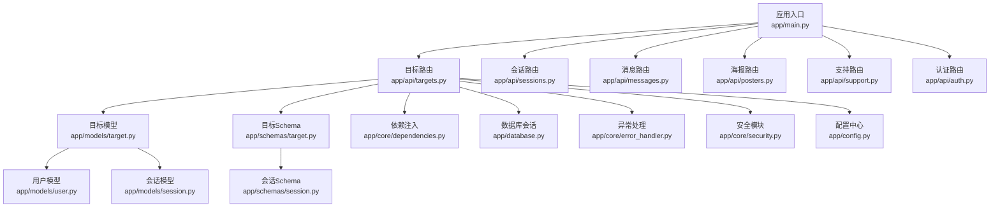
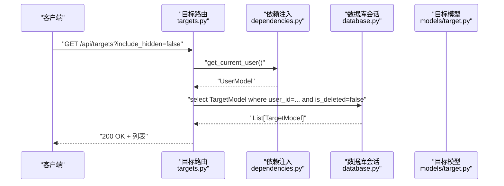
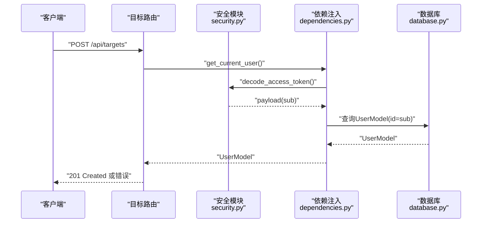
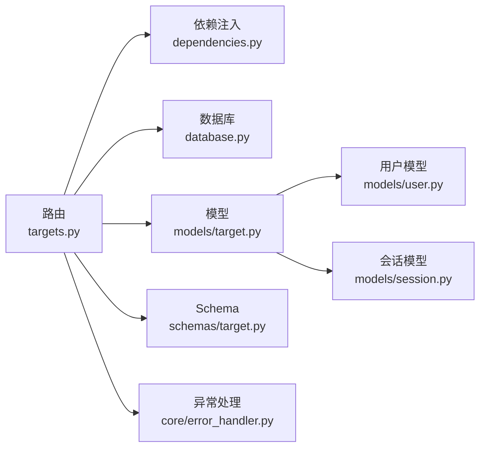

# 目标管理API

<cite>
**本文引用的文件**
- [emo_outlet_api/app/main.py](file://emo_outlet_api/app/main.py)
- [emo_outlet_api/app/api/targets.py](file://emo_outlet_api/app/api/targets.py)
- [emo_outlet_api/app/models/target.py](file://emo_outlet_api/app/models/target.py)
- [emo_outlet_api/app/schemas/target.py](file://emo_outlet_api/app/schemas/target.py)
- [emo_outlet_api/app/models/session.py](file://emo_outlet_api/app/models/session.py)
- [emo_outlet_api/app/schemas/session.py](file://emo_outlet_api/app/schemas/session.py)
- [emo_outlet_api/app/models/user.py](file://emo_outlet_api/app/models/user.py)
- [emo_outlet_api/app/core/dependencies.py](file://emo_outlet_api/app/core/dependencies.py)
- [emo_outlet_api/app/core/error_handler.py](file://emo_outlet_api/app/core/error_handler.py)
- [emo_outlet_api/app/core/security.py](file://emo_outlet_api/app/core/security.py)
- [emo_outlet_api/app/database.py](file://emo_outlet_api/app/database.py)
- [emo_outlet_api/app/config.py](file://emo_outlet_api/app/config.py)
</cite>

## 目录
1. [简介](#简介)
2. [项目结构](#项目结构)
3. [核心组件](#核心组件)
4. [架构总览](#架构总览)
5. [详细组件分析](#详细组件分析)
6. [依赖分析](#依赖分析)
7. [性能考虑](#性能考虑)
8. [故障排查指南](#故障排查指南)
9. [结论](#结论)
10. [附录](#附录)

## 简介
本文件为 Emo Outlet 的“目标管理API”提供完整、准确的接口文档，覆盖虚拟目标的创建、查询、更新、删除等CRUD能力，并补充目标与会话关联、使用统计等扩展能力。文档同时说明目标类型定义、个性化设置选项、用户权限控制、请求参数与响应格式、错误码与异常处理策略，以及目标数据模型与字段约束。

## 项目结构
后端采用 FastAPI + SQLAlchemy Async 架构，目标管理API位于独立路由模块，配合模型层、Schema层、依赖注入与安全模块协同工作。应用启动时初始化数据库并注册异常处理器，目标路由通过中间件与CORS支持接入。

图表来源
- [emo_outlet_api/app/main.py:51-63](file://emo_outlet_api/app/main.py#L51-L63)
- [emo_outlet_api/app/api/targets.py:23](file://emo_outlet_api/app/api/targets.py#L23)
- [emo_outlet_api/app/models/target.py:13](file://emo_outlet_api/app/models/target.py#L13)
- [emo_outlet_api/app/schemas/target.py:9](file://emo_outlet_api/app/schemas/target.py#L9)
- [emo_outlet_api/app/core/dependencies.py:18](file://emo_outlet_api/app/core/dependencies.py#L18)
- [emo_outlet_api/app/database.py:22](file://emo_outlet_api/app/database.py#L22)
- [emo_outlet_api/app/core/error_handler.py:54](file://emo_outlet_api/app/core/error_handler.py#L54)
- [emo_outlet_api/app/core/security.py:26](file://emo_outlet_api/app/core/security.py#L26)
- [emo_outlet_api/app/config.py:12](file://emo_outlet_api/app/config.py#L12)
- [emo_outlet_api/app/models/user.py:14](file://emo_outlet_api/app/models/user.py#L14)
- [emo_outlet_api/app/models/session.py:13](file://emo_outlet_api/app/models/session.py#L13)
- [emo_outlet_api/app/schemas/session.py:8](file://emo_outlet_api/app/schemas/session.py#L8)

章节来源
- [emo_outlet_api/app/main.py:14-82](file://emo_outlet_api/app/main.py#L14-L82)
- [emo_outlet_api/app/api/targets.py:23-213](file://emo_outlet_api/app/api/targets.py#L23-L213)

## 核心组件
- 目标路由与控制器：提供目标列表、创建、详情、更新、删除、AI补全、生成头像等接口。
- 目标模型与Schema：定义目标实体字段、约束与序列化/反序列化规则。
- 用户与会话模型：支撑目标与用户、会话的关联关系。
- 权限与安全：基于JWT的认证与授权、每日会话配额控制、封禁用户拦截。
- 数据库与异常处理：异步会话管理、统一异常响应格式。

章节来源
- [emo_outlet_api/app/api/targets.py:26-213](file://emo_outlet_api/app/api/targets.py#L26-L213)
- [emo_outlet_api/app/models/target.py:13-56](file://emo_outlet_api/app/models/target.py#L13-L56)
- [emo_outlet_api/app/schemas/target.py:9-63](file://emo_outlet_api/app/schemas/target.py#L9-L63)
- [emo_outlet_api/app/models/user.py:14-56](file://emo_outlet_api/app/models/user.py#L14-L56)
- [emo_outlet_api/app/models/session.py:13-79](file://emo_outlet_api/app/models/session.py#L13-L79)
- [emo_outlet_api/app/core/dependencies.py:18-67](file://emo_outlet_api/app/core/dependencies.py#L18-L67)
- [emo_outlet_api/app/core/error_handler.py:10-59](file://emo_outlet_api/app/core/error_handler.py#L10-L59)

## 架构总览
目标管理API遵循REST风格，使用FastAPI自动OpenAPI文档，接口均需携带有效的访问令牌。权限控制通过依赖注入获取当前用户并校验有效性；软删除机制避免物理删除；AI补全与头像生成功能通过服务层对接外部LLM与图像模型。

图表来源
- [emo_outlet_api/app/api/targets.py:26-44](file://emo_outlet_api/app/api/targets.py#L26-L44)
- [emo_outlet_api/app/core/dependencies.py:18-50](file://emo_outlet_api/app/core/dependencies.py#L18-L50)
- [emo_outlet_api/app/database.py:22-32](file://emo_outlet_api/app/database.py#L22-L32)
- [emo_outlet_api/app/models/target.py:13-56](file://emo_outlet_api/app/models/target.py#L13-L56)

## 详细组件分析

### 接口总览
- 路由前缀：/api/targets
- 标签：泄愤对象
- 认证方式：Bearer Token（JWT）
- 默认排序：按updated_at倒序

章节来源
- [emo_outlet_api/app/api/targets.py:23](file://emo_outlet_api/app/api/targets.py#L23)

### 获取目标列表
- 方法与路径：GET /api/targets
- 功能：返回当前用户的目标列表，支持过滤隐藏项
- 查询参数
  - include_hidden: bool，默认false；为true时包含is_hidden=true的目标
- 认证与权限
  - 依赖get_current_user，校验令牌有效性与用户状态
- 返回
  - 200 OK，数组形式的TargetResponse
- 错误
  - 401 未提供或无效令牌
  - 403 封禁用户
  - 404 用户不存在
  - 500 服务器内部错误

章节来源
- [emo_outlet_api/app/api/targets.py:26-44](file://emo_outlet_api/app/api/targets.py#L26-L44)
- [emo_outlet_api/app/core/dependencies.py:18-50](file://emo_outlet_api/app/core/dependencies.py#L18-L50)
- [emo_outlet_api/app/core/error_handler.py:21-31](file://emo_outlet_api/app/core/error_handler.py#L21-L31)

### 创建目标
- 方法与路径：POST /api/targets
- 功能：为当前用户创建新目标
- 请求体：TargetCreateRequest
  - name: 必填，字符串，最大长度100
  - type: 可选，默认custom
  - appearance: 可选，文本
  - personality: 可选，文本
  - relationship: 可选，字符串，最大长度100
  - style: 可选，默认“漫画”
- 返回
  - 201 Created，TargetResponse
- 错误
  - 422 参数校验失败
  - 401/403/404/500 同列表接口

章节来源
- [emo_outlet_api/app/api/targets.py:47-66](file://emo_outlet_api/app/api/targets.py#L47-L66)
- [emo_outlet_api/app/schemas/target.py:9-17](file://emo_outlet_api/app/schemas/target.py#L9-L17)

### 获取目标详情
- 方法与路径：GET /api/targets/{target_id}
- 功能：返回指定目标的详细信息
- 路径参数
  - target_id: 目标ID（字符串）
- 返回
  - 200 OK，TargetResponse
- 错误
  - 404 目标不存在或不属于当前用户
  - 401/403/500 同列表接口

章节来源
- [emo_outlet_api/app/api/targets.py:69-89](file://emo_outlet_api/app/api/targets.py#L69-L89)

### 更新目标
- 方法与路径：PUT /api/targets/{target_id}
- 功能：部分更新目标信息
- 路径参数
  - target_id: 目标ID
- 请求体：TargetUpdateRequest（字段均可选）
  - name/type/appearance/personality/relationship/style/is_hidden
- 返回
  - 200 OK，TargetResponse
- 错误
  - 404 目标不存在或不属于当前用户
  - 422 参数校验失败
  - 401/403/500 同列表接口

章节来源
- [emo_outlet_api/app/api/targets.py:92-128](file://emo_outlet_api/app/api/targets.py#L92-L128)
- [emo_outlet_api/app/schemas/target.py:19-28](file://emo_outlet_api/app/schemas/target.py#L19-L28)

### 删除目标
- 方法与路径：DELETE /api/targets/{target_id}
- 功能：软删除目标（标记is_deleted=true）
- 返回
  - 200 OK，{"message": "对象已删除"}
- 错误
  - 404 目标不存在或不属于当前用户
  - 401/403/500 同列表接口

章节来源
- [emo_outlet_api/app/api/targets.py:131-150](file://emo_outlet_api/app/api/targets.py#L131-L150)

### 生成AI头像
- 方法与路径：POST /api/targets/{target_id}/generate-avatar
- 功能：根据目标外观、性格、风格调用AI生成头像并回填avatar_url
- 返回
  - 200 OK，TargetResponse
- 错误
  - 404 目标不存在或不属于当前用户
  - 500 服务器内部错误（AI服务异常）

章节来源
- [emo_outlet_api/app/api/targets.py:153-181](file://emo_outlet_api/app/api/targets.py#L153-L181)

### AI补全目标信息
- 方法与路径：POST /api/targets/ai-complete
- 功能：根据关系字段给出外观、性格、风格的建议
- 请求体：TargetAiCompleteRequest
  - name: 必填，字符串
  - relationship: 必填，字符串
- 返回
  - 200 OK，TargetAiCompleteResponse
- 错误
  - 500 服务器内部错误（AI服务异常）

章节来源
- [emo_outlet_api/app/api/targets.py:184-213](file://emo_outlet_api/app/api/targets.py#L184-L213)
- [emo_outlet_api/app/schemas/target.py:52-63](file://emo_outlet_api/app/schemas/target.py#L52-L63)

### 目标数据模型与字段约束
- 主要字段
  - id: 字符串，主键
  - user_id: 字符串，外键指向用户
  - name: 字符串，必填，最大长度100
  - type: 字符串，默认custom
  - appearance: 文本，可空
  - personality: 文本，可空
  - relationship: 字符串，最大长度100，可空
  - style: 字符串，默认“漫画”
  - avatar_url: 字符串，可空
  - is_hidden: 布尔，默认false
  - is_deleted: 布尔，默认false
  - created_at/updated_at: 时间戳
- 关系
  - belongs to UserModel
  - has many SessionModel（通过sessions属性）

章节来源
- [emo_outlet_api/app/models/target.py:13-56](file://emo_outlet_api/app/models/target.py#L13-L56)

### 目标与会话关联与使用统计
- 关联关系
  - 目标与会话：一对多（Target -> Session）
  - 会话与目标：多对一（Session -> Target）
- 使用统计
  - 目标模型包含sessions关系，可用于统计该目标下的会话数量与行为
  - 会话模型包含状态、时长、情绪摘要等字段，便于统计分析

章节来源
- [emo_outlet_api/app/models/target.py:50-52](file://emo_outlet_api/app/models/target.py#L50-L52)
- [emo_outlet_api/app/models/session.py:13-79](file://emo_outlet_api/app/models/session.py#L13-L79)

### 权限控制与认证流程
- 认证方式：HTTP Bearer Token（JWT）
- 流程
  - 从Authorization头提取凭据
  - 解码并验证JWT，获取用户标识
  - 查询用户是否存在且未删除
  - 检查是否封禁
  - 每日会话配额检查（与目标管理相关接口亦受此影响）
- 异常
  - 401 未提供或无效令牌
  - 403 封禁用户
  - 404 用户不存在
  - 422 参数校验失败
  - 500 服务器内部错误

图表来源
- [emo_outlet_api/app/api/targets.py:47-66](file://emo_outlet_api/app/api/targets.py#L47-L66)
- [emo_outlet_api/app/core/dependencies.py:18-50](file://emo_outlet_api/app/core/dependencies.py#L18-L50)
- [emo_outlet_api/app/core/security.py:34](file://emo_outlet_api/app/core/security.py#L34)
- [emo_outlet_api/app/database.py:22-32](file://emo_outlet_api/app/database.py#L22-L32)

章节来源
- [emo_outlet_api/app/core/dependencies.py:18-67](file://emo_outlet_api/app/core/dependencies.py#L18-L67)
- [emo_outlet_api/app/core/security.py:26-43](file://emo_outlet_api/app/core/security.py#L26-L43)
- [emo_outlet_api/app/core/error_handler.py:21-59](file://emo_outlet_api/app/core/error_handler.py#L21-L59)

## 依赖分析
- 组件耦合
  - 路由层仅依赖依赖注入、数据库会话、模型与Schema
  - 模型层通过关系映射与用户、会话建立关联
  - 安全与异常处理作为横切关注点被统一注册
- 外部依赖
  - 数据库：SQLAlchemy Async + MySQL/SQLite
  - JWT：jose库
  - 异常处理：FastAPI内置异常体系
- 循环依赖
  - 未发现循环导入

图表来源
- [emo_outlet_api/app/api/targets.py:23](file://emo_outlet_api/app/api/targets.py#L23)
- [emo_outlet_api/app/core/dependencies.py:18](file://emo_outlet_api/app/core/dependencies.py#L18)
- [emo_outlet_api/app/database.py:22](file://emo_outlet_api/app/database.py#L22)
- [emo_outlet_api/app/models/target.py:13](file://emo_outlet_api/app/models/target.py#L13)
- [emo_outlet_api/app/schemas/target.py:9](file://emo_outlet_api/app/schemas/target.py#L9)
- [emo_outlet_api/app/core/error_handler.py:54](file://emo_outlet_api/app/core/error_handler.py#L54)
- [emo_outlet_api/app/models/user.py:14](file://emo_outlet_api/app/models/user.py#L14)
- [emo_outlet_api/app/models/session.py:13](file://emo_outlet_api/app/models/session.py#L13)

章节来源
- [emo_outlet_api/app/api/targets.py:23-213](file://emo_outlet_api/app/api/targets.py#L23-L213)
- [emo_outlet_api/app/models/target.py:13-56](file://emo_outlet_api/app/models/target.py#L13-L56)
- [emo_outlet_api/app/schemas/target.py:9-63](file://emo_outlet_api/app/schemas/target.py#L9-L63)
- [emo_outlet_api/app/models/user.py:14-56](file://emo_outlet_api/app/models/user.py#L14-L56)
- [emo_outlet_api/app/models/session.py:13-79](file://emo_outlet_api/app/models/session.py#L13-L79)

## 性能考虑
- 查询优化
  - 列表接口按updated_at倒序，减少全表扫描
  - 通过user_id与is_deleted过滤，避免加载已删除目标
- 数据库连接
  - 使用异步会话工厂，确保高并发下的连接复用
- 序列化
  - 使用Pydantic模型进行序列化，减少手动转换开销
- AI集成
  - 头像生成与AI补全为外部调用，建议在服务层增加超时与重试策略（当前代码未实现）

## 故障排查指南
- 400/422 参数校验失败
  - 检查请求体字段类型与长度限制
  - 参考Schema定义中的字段约束
- 401 未提供或无效令牌
  - 确认Authorization头格式为Bearer Token
  - 检查令牌是否过期或签名错误
- 403 封禁用户
  - 检查用户状态与封禁原因
- 404 目标不存在
  - 确认target_id正确且属于当前用户
- 500 服务器内部错误
  - 查看服务端日志，定位具体异常位置
- CORS问题
  - 应用已启用CORS，若仍跨域失败，请检查前端Origin配置

章节来源
- [emo_outlet_api/app/core/error_handler.py:10-59](file://emo_outlet_api/app/core/error_handler.py#L10-L59)
- [emo_outlet_api/app/core/dependencies.py:22-43](file://emo_outlet_api/app/core/dependencies.py#L22-L43)
- [emo_outlet_api/app/api/targets.py:84-88](file://emo_outlet_api/app/api/targets.py#L84-L88)

## 结论
目标管理API提供了完整的CRUD能力与扩展接口，结合权限控制与统一异常处理，满足用户对虚拟目标的个性化管理需求。建议后续增强AI服务的稳定性与可观测性，并完善批量操作与导出能力以提升用户体验。

## 附录

### 请求与响应示例（路径参考）
- 创建目标
  - 请求体：参见 [TargetCreateRequest:9-17](file://emo_outlet_api/app/schemas/target.py#L9-L17)
  - 成功响应：参见 [TargetResponse:30-50](file://emo_outlet_api/app/schemas/target.py#L30-L50)
- 更新目标
  - 请求体：参见 [TargetUpdateRequest:19-28](file://emo_outlet_api/app/schemas/target.py#L19-L28)
  - 成功响应：参见 [TargetResponse:30-50](file://emo_outlet_api/app/schemas/target.py#L30-L50)
- AI补全
  - 请求体：参见 [TargetAiCompleteRequest:52-56](file://emo_outlet_api/app/schemas/target.py#L52-L56)
  - 成功响应：参见 [TargetAiCompleteResponse:58-63](file://emo_outlet_api/app/schemas/target.py#L58-L63)

### 错误码与含义
- HTTP_400：HTTP异常（如参数错误）
- HTTP_401：未提供或无效令牌
- HTTP_403：封禁用户
- HTTP_404：资源不存在
- VALIDATION_ERROR：请求参数校验失败
- INTERNAL_ERROR：服务器内部错误

章节来源
- [emo_outlet_api/app/core/error_handler.py:21-59](file://emo_outlet_api/app/core/error_handler.py#L21-L59)