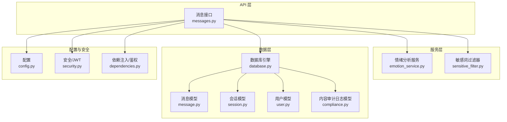
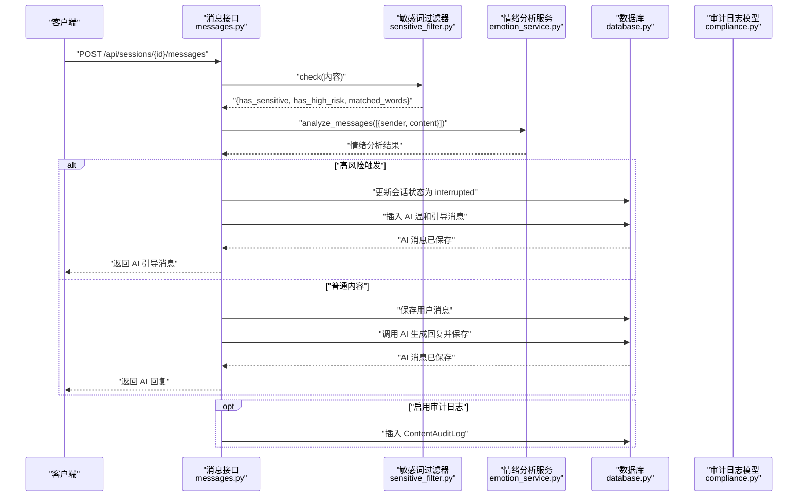
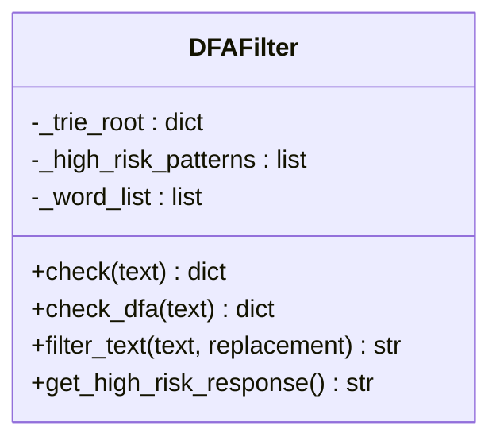
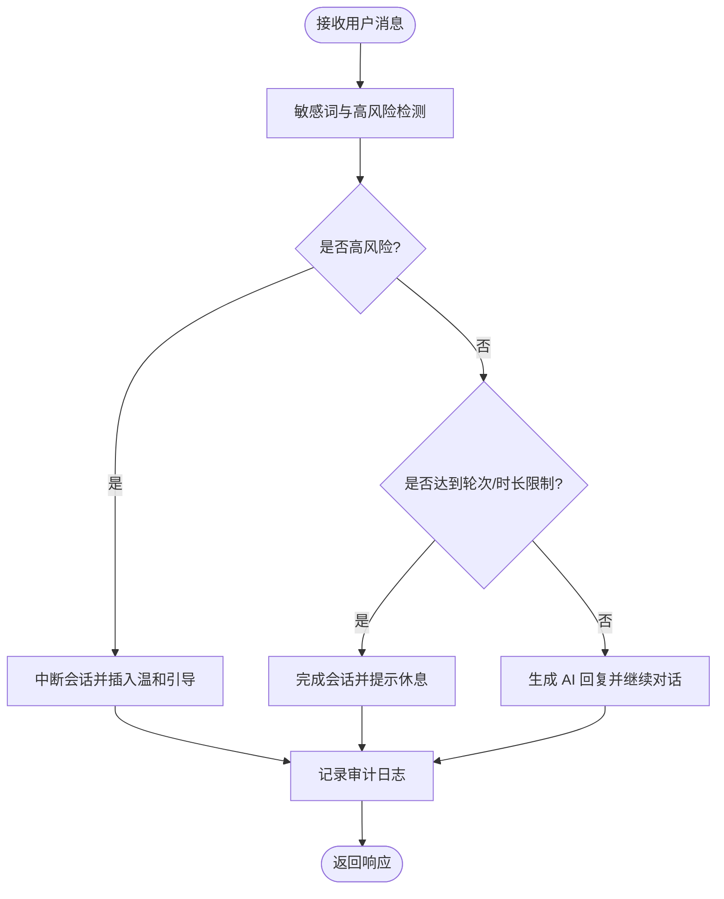
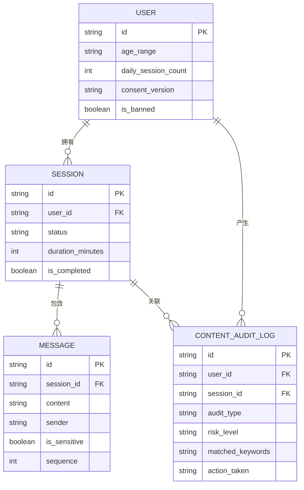
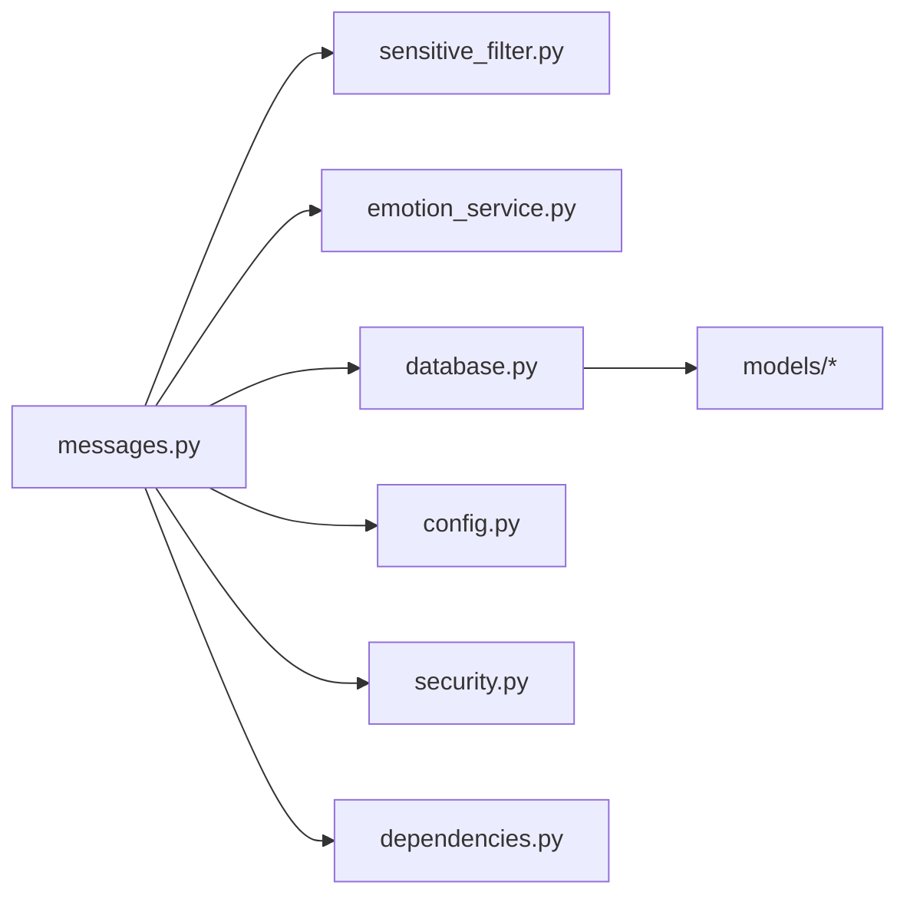

# 内容过滤与审核

<cite>
**本文引用的文件**
- [emo_outlet_api/app/utils/sensitive_filter.py](file://emo_outlet_api/app/utils/sensitive_filter.py)
- [emo_outlet_api/app/api/messages.py](file://emo_outlet_api/app/api/messages.py)
- [emo_outlet_api/app/models/compliance.py](file://emo_outlet_api/app/models/compliance.py)
- [emo_outlet_api/app/models/message.py](file://emo_outlet_api/app/models/message.py)
- [emo_outlet_api/app/models/session.py](file://emo_outlet_api/app/models/session.py)
- [emo_outlet_api/app/models/user.py](file://emo_outlet_api/app/models/user.py)
- [emo_outlet_api/app/config.py](file://emo_outlet_api/app/config.py)
- [emo_outlet_api/app/services/emotion_service.py](file://emo_outlet_api/app/services/emotion_service.py)
- [emo_outlet_api/app/core/security.py](file://emo_outlet_api/app/core/security.py)
- [emo_outlet_api/app/core/dependencies.py](file://emo_outlet_api/app/core/dependencies.py)
- [emo_outlet_api/app/database.py](file://emo_outlet_api/app/database.py)
- [emo_outlet_api/app/schemas/message.py](file://emo_outlet_api/app/schemas/message.py)
- [emo_outlet_api/app/core/error_handler.py](file://emo_outlet_api/app/core/error_handler.py)
</cite>

## 目录
1. [简介](#简介)
2. [项目结构](#项目结构)
3. [核心组件](#核心组件)
4. [架构总览](#架构总览)
5. [详细组件分析](#详细组件分析)
6. [依赖分析](#依赖分析)
7. [性能考虑](#性能考虑)
8. [故障排查指南](#故障排查指南)
9. [结论](#结论)
10. [附录](#附录)

## 简介
本文件面向 Emo Outlet 项目，系统化阐述内容过滤与审核体系，覆盖敏感词库管理、正则表达式匹配与高风险检测、内容审核流程、合规与年龄分级、配置与例外处理，以及安全策略与违规处置流程。文档以代码为依据，结合架构图与流程图，帮助技术与非技术读者全面理解系统如何在保障用户体验的同时，确保内容安全与合规。

## 项目结构
Emo Outlet 的内容过滤与审核主要集中在后端 API 服务中，涉及以下关键模块：
- 过滤与检测：基于 DFA 的敏感词过滤器与高风险正则检测
- 审核与日志：内容审计日志模型与接口层的审核动作
- 年龄与合规：用户模型中的年龄范围字段与合规版本
- 会话与消息：消息发送接口在其中集成过滤、情绪分析与自动中断
- 配置与限流：全局配置项控制审计日志开关、对话轮次上限与每日会话次数等

图表来源
- [emo_outlet_api/app/api/messages.py:1-216](file://emo_outlet_api/app/api/messages.py#L1-L216)
- [emo_outlet_api/app/utils/sensitive_filter.py:1-142](file://emo_outlet_api/app/utils/sensitive_filter.py#L1-L142)
- [emo_outlet_api/app/services/emotion_service.py:1-181](file://emo_outlet_api/app/services/emotion_service.py#L1-L181)
- [emo_outlet_api/app/models/message.py:1-46](file://emo_outlet_api/app/models/message.py#L1-L46)
- [emo_outlet_api/app/models/session.py:1-79](file://emo_outlet_api/app/models/session.py#L1-L79)
- [emo_outlet_api/app/models/user.py:1-52](file://emo_outlet_api/app/models/user.py#L1-L52)
- [emo_outlet_api/app/models/compliance.py:1-50](file://emo_outlet_api/app/models/compliance.py#L1-L50)
- [emo_outlet_api/app/config.py:1-125](file://emo_outlet_api/app/config.py#L1-L125)
- [emo_outlet_api/app/core/security.py:1-43](file://emo_outlet_api/app/core/security.py#L1-L43)
- [emo_outlet_api/app/core/dependencies.py:1-67](file://emo_outlet_api/app/core/dependencies.py#L1-L67)
- [emo_outlet_api/app/database.py:1-43](file://emo_outlet_api/app/database.py#L1-L43)

章节来源
- [emo_outlet_api/app/api/messages.py:1-216](file://emo_outlet_api/app/api/messages.py#L1-L216)
- [emo_outlet_api/app/config.py:1-125](file://emo_outlet_api/app/config.py#L1-L125)

## 核心组件
- 敏感词过滤器（DFA + 高风险正则）
  - 基于确定性有限自动机（DFA）构建 Trie 树，实现 O(n) 复杂度的敏感词匹配
  - 使用预编译正则表达式检测高风险模式，如自残、自杀倾向等
  - 提供温和引导响应，用于高风险触发后的自动中断
- 内容审核与日志
  - 在消息发送接口中执行敏感词检查，并根据结果记录审计日志
  - 高风险内容触发会话中断与自动回复
- 年龄与合规
  - 用户模型包含年龄范围字段，用于差异化会话轮次与每日会话限制
  - 合规版本字段用于追踪用户同意的合规条款版本
- 情绪分析与辅助
  - 情绪分析服务为内容提供情感维度，辅助判断与建议
- 配置与限流
  - 全局配置控制审计日志开关、对话轮次上限、每日会话次数、敏感词文件路径等

章节来源
- [emo_outlet_api/app/utils/sensitive_filter.py:1-142](file://emo_outlet_api/app/utils/sensitive_filter.py#L1-L142)
- [emo_outlet_api/app/models/compliance.py:1-50](file://emo_outlet_api/app/models/compliance.py#L1-L50)
- [emo_outlet_api/app/models/user.py:1-52](file://emo_outlet_api/app/models/user.py#L1-L52)
- [emo_outlet_api/app/services/emotion_service.py:1-181](file://emo_outlet_api/app/services/emotion_service.py#L1-L181)
- [emo_outlet_api/app/config.py:1-125](file://emo_outlet_api/app/config.py#L1-L125)

## 架构总览
下图展示内容过滤与审核在消息发送流程中的关键交互：

图表来源
- [emo_outlet_api/app/api/messages.py:69-195](file://emo_outlet_api/app/api/messages.py#L69-L195)
- [emo_outlet_api/app/utils/sensitive_filter.py:102-138](file://emo_outlet_api/app/utils/sensitive_filter.py#L102-L138)
- [emo_outlet_api/app/services/emotion_service.py:44-71](file://emo_outlet_api/app/services/emotion_service.py#L44-L71)
- [emo_outlet_api/app/models/compliance.py:31-49](file://emo_outlet_api/app/models/compliance.py#L31-L49)

## 详细组件分析

### 敏感词过滤器（DFA + 高风险正则）
- 敏感词库管理
  - 内置敏感词类别：暴力/伤害、违法、政治敏感、色情/低俗、网暴/人身攻击
  - 支持通过配置项指定外部敏感词文件路径，便于扩展与动态加载
- DFA 匹配算法
  - 构建 Trie 树，逐字符扫描输入文本，实现 O(n) 匹配复杂度
  - 最长匹配优先，避免重复与遗漏
- 高风险正则检测
  - 预定义高风险模式集合，用于识别自残、自杀、同归于尽等倾向
  - 触发后标记高风险并执行温和引导响应
- 文本过滤与响应
  - 提供文本替换方法用于简单过滤
  - 提供随机温和引导语句，用于高风险触发后的自动回复

图表来源
- [emo_outlet_api/app/utils/sensitive_filter.py:37-142](file://emo_outlet_api/app/utils/sensitive_filter.py#L37-L142)

章节来源
- [emo_outlet_api/app/utils/sensitive_filter.py:1-142](file://emo_outlet_api/app/utils/sensitive_filter.py#L1-L142)
- [emo_outlet_api/app/config.py:92-92](file://emo_outlet_api/app/config.py#L92-L92)

### 内容审核流程（预审 → 日志 → 中断/继续）
- 预审
  - 在消息发送接口中调用敏感词过滤器，同时进行情绪分析
- 审计日志
  - 当启用审计日志时，记录用户 ID、会话 ID、命中关键字、原始内容片段、动作类型（观察/中断）等
- 审核决策
  - 若检测到高风险，立即中断会话并插入 AI 温和引导消息
  - 若达到对话轮次上限或时长限制，自动完成会话并提示休息
- 人工复核
  - 可通过审计日志与用户行为数据进行人工复核与二次处理（当前实现以自动化为主）

图表来源
- [emo_outlet_api/app/api/messages.py:69-195](file://emo_outlet_api/app/api/messages.py#L69-L195)
- [emo_outlet_api/app/models/compliance.py:31-49](file://emo_outlet_api/app/models/compliance.py#L31-L49)
- [emo_outlet_api/app/utils/sensitive_filter.py:128-138](file://emo_outlet_api/app/utils/sensitive_filter.py#L128-L138)

章节来源
- [emo_outlet_api/app/api/messages.py:69-195](file://emo_outlet_api/app/api/messages.py#L69-L195)
- [emo_outlet_api/app/models/compliance.py:31-49](file://emo_outlet_api/app/models/compliance.py#L31-L49)

### 合规内容管理（法律法规、分级与年龄限制）
- 合规版本
  - 用户模型包含合规版本字段，用于记录用户接受的合规条款版本
- 年龄分级
  - 用户模型包含年龄范围字段，支持 <14、14-18、>18 三档
  - 不同年龄组享有不同的每日会话次数与对话轮次上限
- 法律法规遵循
  - 敏感词库覆盖暴力、违法、政治敏感、色情/低俗、网暴/人身攻击等高风险领域
  - 高风险正则检测与自动中断机制符合未成年人保护与心理健康干预要求

图表来源
- [emo_outlet_api/app/models/user.py:12-52](file://emo_outlet_api/app/models/user.py#L12-L52)
- [emo_outlet_api/app/models/session.py:13-79](file://emo_outlet_api/app/models/session.py#L13-L79)
- [emo_outlet_api/app/models/message.py:13-46](file://emo_outlet_api/app/models/message.py#L13-L46)
- [emo_outlet_api/app/models/compliance.py:31-49](file://emo_outlet_api/app/models/compliance.py#L31-L49)

章节来源
- [emo_outlet_api/app/models/user.py:1-52](file://emo_outlet_api/app/models/user.py#L1-L52)
- [emo_outlet_api/app/config.py:97-107](file://emo_outlet_api/app/config.py#L97-L107)

### 内容过滤配置（级别、白名单与例外）
- 过滤级别
  - 通过高风险正则与敏感词库实现两级判定：敏感词触发与高风险触发
- 白名单机制
  - 当前实现未见显式白名单机制；可通过扩展敏感词库与正则规则实现例外处理
- 例外处理
  - 高风险触发时自动插入温和引导消息，属于系统级例外处理
  - 可通过配置项调整审计日志采样率与开关，作为例外记录的补充

章节来源
- [emo_outlet_api/app/config.py:108-111](file://emo_outlet_api/app/config.py#L108-L111)
- [emo_outlet_api/app/utils/sensitive_filter.py:128-138](file://emo_outlet_api/app/utils/sensitive_filter.py#L128-L138)

### 审核标准与违规处理流程
- 审核标准
  - 敏感词命中即触发“观察/中断”动作；高风险命中触发“中断”
  - 审计日志记录风险等级、命中关键字与动作类型
- 违规处理
  - 高风险：中断会话并插入温和引导消息
  - 超限：完成会话并提示休息
  - 封禁：鉴权层拒绝访问

章节来源
- [emo_outlet_api/app/api/messages.py:96-127](file://emo_outlet_api/app/api/messages.py#L96-L127)
- [emo_outlet_api/app/core/dependencies.py:39-43](file://emo_outlet_api/app/core/dependencies.py#L39-L43)

## 依赖分析
- 组件耦合
  - 消息接口依赖敏感词过滤器与情绪分析服务，耦合度适中
  - 审计日志模型独立于业务逻辑，便于扩展
- 外部依赖
  - 数据库连接由异步引擎管理，事务在依赖注入中统一处理
  - JWT 认证与密码哈希用于用户鉴权与安全
- 循环依赖
  - 未发现循环导入；各模块职责清晰

图表来源
- [emo_outlet_api/app/api/messages.py:1-216](file://emo_outlet_api/app/api/messages.py#L1-L216)
- [emo_outlet_api/app/utils/sensitive_filter.py:1-142](file://emo_outlet_api/app/utils/sensitive_filter.py#L1-L142)
- [emo_outlet_api/app/services/emotion_service.py:1-181](file://emo_outlet_api/app/services/emotion_service.py#L1-L181)
- [emo_outlet_api/app/database.py:1-43](file://emo_outlet_api/app/database.py#L1-L43)
- [emo_outlet_api/app/config.py:1-125](file://emo_outlet_api/app/config.py#L1-L125)
- [emo_outlet_api/app/core/security.py:1-43](file://emo_outlet_api/app/core/security.py#L1-L43)
- [emo_outlet_api/app/core/dependencies.py:1-67](file://emo_outlet_api/app/core/dependencies.py#L1-L67)

章节来源
- [emo_outlet_api/app/api/messages.py:1-216](file://emo_outlet_api/app/api/messages.py#L1-L216)
- [emo_outlet_api/app/database.py:1-43](file://emo_outlet_api/app/database.py#L1-L43)
- [emo_outlet_api/app/core/security.py:1-43](file://emo_outlet_api/app/core/security.py#L1-L43)
- [emo_outlet_api/app/core/dependencies.py:1-67](file://emo_outlet_api/app/core/dependencies.py#L1-L67)

## 性能考虑
- 敏感词匹配
  - DFA 算法时间复杂度 O(n)，适合大规模敏感词库与高频文本检测
  - 建议定期对敏感词库进行压缩与排序，减少 Trie 树深度
- 正则匹配
  - 高风险正则采用预编译，避免重复编译开销
  - 正则数量与复杂度需平衡，避免影响整体吞吐
- 数据库写入
  - 审计日志与消息写入在同一事务中，建议按需采样（当前采样率为 1.0）
  - 可通过批量写入与索引优化提升写入性能
- 情绪分析
  - 情绪关键词统计与计数器使用合理，注意超长文本的分词与去噪

## 故障排查指南
- 敏感词误判/漏判
  - 检查敏感词库是否覆盖目标语言与方言
  - 调整高风险正则表达式，避免过度敏感或宽松
- 审计日志缺失
  - 确认审计日志开关与采样率配置
  - 检查数据库连接与事务提交
- 会话中断异常
  - 核对高风险触发条件与温和引导消息插入逻辑
  - 检查会话状态更新与消息序列号
- 鉴权失败
  - 检查 JWT 密钥、算法与过期时间配置
  - 确认用户状态（封禁、删除）与每日会话计数重置逻辑

章节来源
- [emo_outlet_api/app/config.py:108-111](file://emo_outlet_api/app/config.py#L108-L111)
- [emo_outlet_api/app/api/messages.py:96-127](file://emo_outlet_api/app/api/messages.py#L96-L127)
- [emo_outlet_api/app/core/dependencies.py:39-43](file://emo_outlet_api/app/core/dependencies.py#L39-L43)
- [emo_outlet_api/app/core/error_handler.py:1-59](file://emo_outlet_api/app/core/error_handler.py#L1-L59)

## 结论
Emo Outlet 的内容过滤与审核体系以 DFA 敏感词匹配为核心，结合高风险正则检测与情绪分析，实现了对高风险内容的快速识别与自动中断。通过审计日志与年龄分级配置，系统在保障用户体验的同时满足合规要求。建议后续引入白名单机制、动态敏感词库与更细粒度的审计采样策略，以进一步提升安全性与可维护性。

## 附录
- 关键配置项
  - 审计日志开关与采样率
  - 对话轮次上限与年龄分组阈值
  - 敏感词文件路径与最大消息长度
- 数据模型要点
  - 用户模型包含年龄范围与合规版本
  - 会话模型包含状态与完成标志
  - 审计日志模型记录风险等级与动作类型

章节来源
- [emo_outlet_api/app/config.py:94-111](file://emo_outlet_api/app/config.py#L94-L111)
- [emo_outlet_api/app/models/user.py:30-38](file://emo_outlet_api/app/models/user.py#L30-L38)
- [emo_outlet_api/app/models/session.py:50-56](file://emo_outlet_api/app/models/session.py#L50-L56)
- [emo_outlet_api/app/models/compliance.py:42-45](file://emo_outlet_api/app/models/compliance.py#L42-L45)