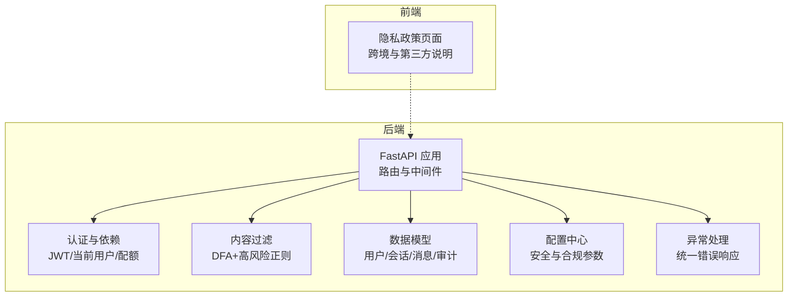
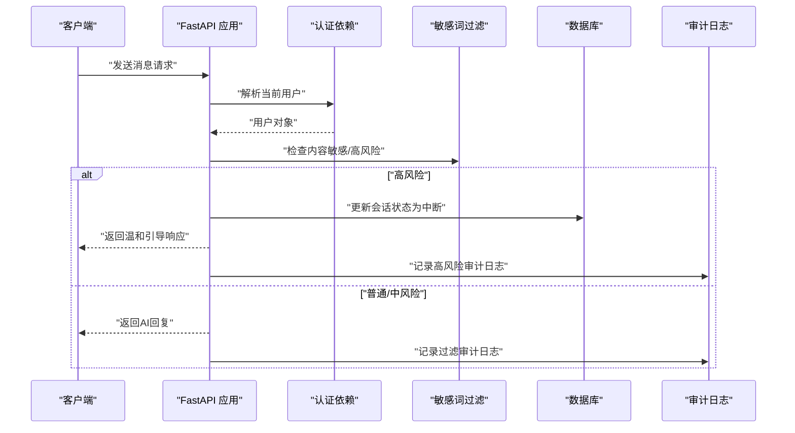
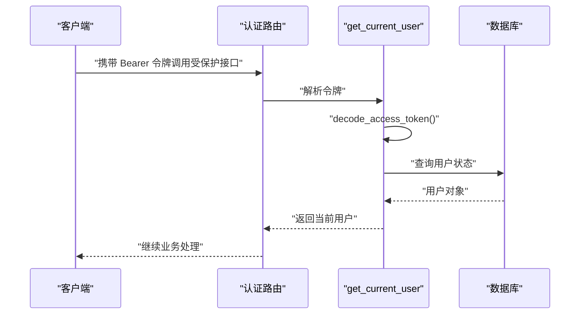
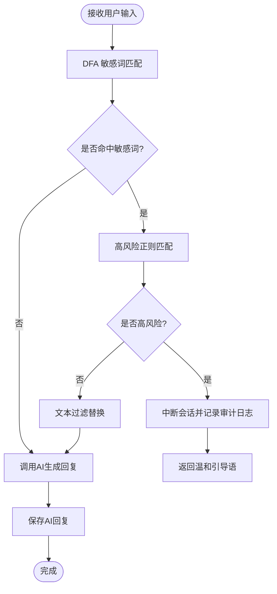
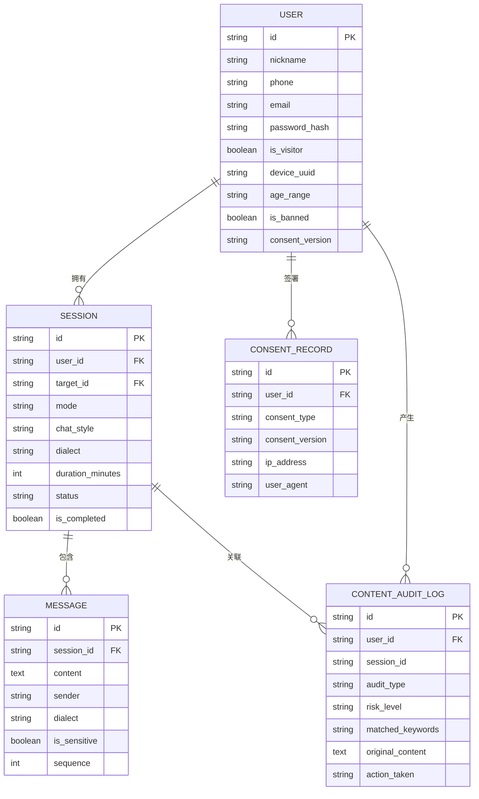
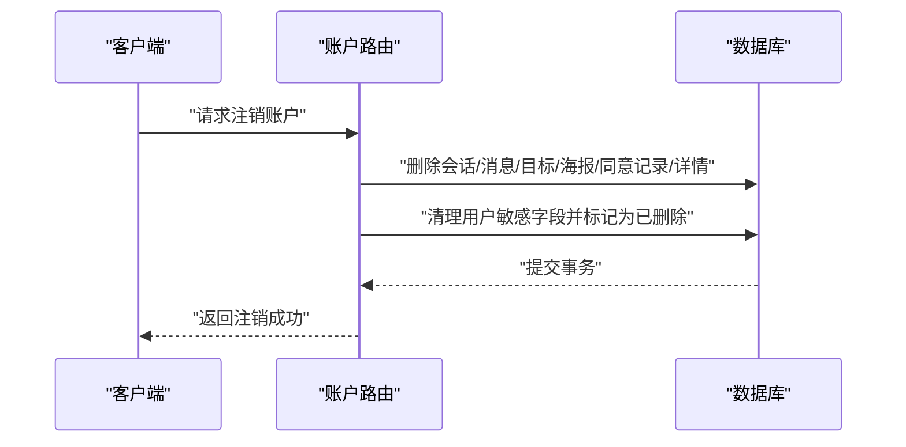
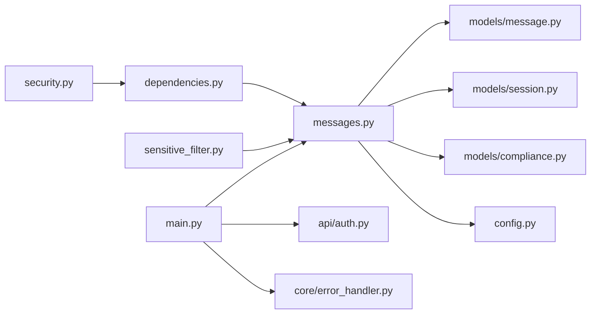

# 安全与合规

<cite>
**本文引用的文件**
- [emo_outlet_api/app/core/security.py](file://emo_outlet_api/app/core/security.py)
- [emo_outlet_api/app/core/dependencies.py](file://emo_outlet_api/app/core/dependencies.py)
- [emo_outlet_api/app/utils/sensitive_filter.py](file://emo_outlet_api/app/utils/sensitive_filter.py)
- [emo_outlet_api/app/models/compliance.py](file://emo_outlet_api/app/models/compliance.py)
- [emo_outlet_api/app/api/auth.py](file://emo_outlet_api/app/api/auth.py)
- [emo_outlet_api/app/api/messages.py](file://emo_outlet_api/app/api/messages.py)
- [emo_outlet_api/app/models/message.py](file://emo_outlet_api/app/models/message.py)
- [emo_outlet_api/app/models/session.py](file://emo_outlet_api/app/models/session.py)
- [emo_outlet_api/app/models/user.py](file://emo_outlet_api/app/models/user.py)
- [emo_outlet_api/app/schemas/user.py](file://emo_outlet_api/app/schemas/user.py)
- [emo_outlet_api/app/config.py](file://emo_outlet_api/app/config.py)
- [emo_outlet_api/app/main.py](file://emo_outlet_api/app/main.py)
- [emo_outlet_api/app/database.py](file://emo_outlet_api/app/database.py)
- [emo_outlet_api/app/core/error_handler.py](file://emo_outlet_api/app/core/error_handler.py)
- [emo_outlet_app/lib/screens/privacy_policy_screen.dart](file://emo_outlet_app/lib/screens/privacy_policy_screen.dart)
</cite>

## 目录
1. [引言](#引言)
2. [项目结构](#项目结构)
3. [核心组件](#核心组件)
4. [架构总览](#架构总览)
5. [详细组件分析](#详细组件分析)
6. [依赖分析](#依赖分析)
7. [性能考虑](#性能考虑)
8. [故障排查指南](#故障排查指南)
9. [结论](#结论)
10. [附录](#附录)

## 引言
本文件面向 Emo Outlet 项目，提供一套系统化的安全与合规文档，覆盖数据安全策略（JWT 令牌认证、密码哈希存储、传输与端侧处理）、内容过滤机制（敏感词库、高风险检测、自动中断与人工审核）、隐私保护措施（最小化收集、匿名化、用户权利与删除）、法律合规要求（个保法遵循、未成年人保护、内容监管与跨境传输）、安全审计与漏洞管理、应急响应预案、安全配置指南、威胁模型与风险评估、以及安全测试与监控策略。文档以代码为依据，结合前端隐私政策页面，形成前后端协同的安全合规体系。

## 项目结构
Emo Outlet 后端采用 FastAPI + SQLAlchemy Async 架构，安全与合规相关逻辑主要分布在以下模块：
- 认证与授权：JWT 令牌生成与校验、当前用户解析、每日会话配额控制
- 内容安全：敏感词 DFA 过滤、高风险模式识别、自动中断与审计日志
- 数据模型：用户、会话、消息、内容审计日志、同意记录
- 配置中心：安全参数、合规阈值、审计开关
- 异常处理：统一错误响应
- 前端隐私政策：跨境传输与第三方共享说明

**图表来源**
- [emo_outlet_api/app/main.py:23-64](file://emo_outlet_api/app/main.py#L23-L64)
- [emo_outlet_api/app/core/dependencies.py:18-67](file://emo_outlet_api/app/core/dependencies.py#L18-L67)
- [emo_outlet_api/app/utils/sensitive_filter.py:37-142](file://emo_outlet_api/app/utils/sensitive_filter.py#L37-L142)
- [emo_outlet_api/app/models/compliance.py:12-50](file://emo_outlet_api/app/models/compliance.py#L12-L50)
- [emo_outlet_api/app/config.py:54-114](file://emo_outlet_api/app/config.py#L54-L114)
- [emo_outlet_api/app/core/error_handler.py:10-59](file://emo_outlet_api/app/core/error_handler.py#L10-L59)
- [emo_outlet_app/lib/screens/privacy_policy_screen.dart:52-71](file://emo_outlet_app/lib/screens/privacy_policy_screen.dart#L52-L71)

**章节来源**
- [emo_outlet_api/app/main.py:23-64](file://emo_outlet_api/app/main.py#L23-L64)
- [emo_outlet_api/app/config.py:54-114](file://emo_outlet_api/app/config.py#L54-L114)

## 核心组件
- 认证与会话
  - JWT 令牌签发与校验，含过期时间控制
  - 当前用户解析与封禁状态检查
  - 每日会话次数限制（按访客/年龄段）
- 内容安全
  - DFA 敏感词过滤与最长匹配
  - 高风险正则模式识别
  - 自动中断与温和引导响应
  - 审计日志记录（含关键词与处置动作）
- 数据模型与合规
  - 用户模型含年龄区间、封禁标记、同意版本等
  - 内容审计日志表记录风险级别与处置
  - 同意记录表记录隐私与条款同意
- 配置中心
  - 安全参数（最大消息长度、会话时长、每日会话配额）
  - 合规阈值（对话轮次上限、审计开关与采样率）
  - 跨境传输提示（OpenAI 等海外服务）

**章节来源**
- [emo_outlet_api/app/core/security.py:16-42](file://emo_outlet_api/app/core/security.py#L16-L42)
- [emo_outlet_api/app/core/dependencies.py:18-67](file://emo_outlet_api/app/core/dependencies.py#L18-L67)
- [emo_outlet_api/app/utils/sensitive_filter.py:37-142](file://emo_outlet_api/app/utils/sensitive_filter.py#L37-L142)
- [emo_outlet_api/app/models/compliance.py:12-50](file://emo_outlet_api/app/models/compliance.py#L12-L50)
- [emo_outlet_api/app/config.py:88-114](file://emo_outlet_api/app/config.py#L88-L114)

## 架构总览
后端通过中间件与路由层实现统一安全控制；认证依赖 JWT 与数据库用户状态；消息路由在发送前执行敏感词与高风险检测，并根据配置决定是否中断与记录审计日志；前端隐私政策页面明确跨境与第三方共享场景。

**图表来源**
- [emo_outlet_api/app/api/messages.py:80-231](file://emo_outlet_api/app/api/messages.py#L80-L231)
- [emo_outlet_api/app/core/dependencies.py:18-50](file://emo_outlet_api/app/core/dependencies.py#L18-L50)
- [emo_outlet_api/app/utils/sensitive_filter.py:102-139](file://emo_outlet_api/app/utils/sensitive_filter.py#L102-L139)
- [emo_outlet_api/app/models/compliance.py:31-49](file://emo_outlet_api/app/models/compliance.py#L31-L49)

## 详细组件分析

### 认证与授权（JWT + 会话配额）
- JWT 策略
  - 使用 HS256 算法与可配置密钥，设置访问令牌过期时间
  - 解码时捕获 JWT 错误并返回空载荷
- 当前用户解析
  - 从 Authorization 头提取 Bearer 令牌
  - 解析载荷获取用户 ID，查询数据库并校验用户存在与未删除
  - 封禁用户直接拒绝访问
- 会话配额控制
  - 按日期重置每日会话计数
  - 不同用户类型与年龄段采用不同的每日最大会话数限制

**图表来源**
- [emo_outlet_api/app/api/auth.py:123-125](file://emo_outlet_api/app/api/auth.py#L123-L125)
- [emo_outlet_api/app/core/dependencies.py:18-50](file://emo_outlet_api/app/core/dependencies.py#L18-L50)
- [emo_outlet_api/app/core/security.py:26-42](file://emo_outlet_api/app/core/security.py#L26-L42)

**章节来源**
- [emo_outlet_api/app/core/security.py:16-42](file://emo_outlet_api/app/core/security.py#L16-L42)
- [emo_outlet_api/app/core/dependencies.py:18-67](file://emo_outlet_api/app/core/dependencies.py#L18-L67)
- [emo_outlet_api/app/config.py:97-107](file://emo_outlet_api/app/config.py#L97-L107)

### 密码哈希存储
- 使用 bcrypt 对密码进行哈希存储，避免明文存储
- 登录时通过哈希校验验证密码

**章节来源**
- [emo_outlet_api/app/core/security.py:16-23](file://emo_outlet_api/app/core/security.py#L16-L23)
- [emo_outlet_api/app/api/auth.py:54-54](file://emo_outlet_api/app/api/auth.py#L54-L54)

### 内容过滤与高风险检测
- 敏感词库扩展与 DFA 最长匹配
- 高风险正则模式集合，用于识别自残、自杀、暴力等高危意图
- 自动中断策略：触发高风险时终止会话并返回温和引导语
- 审计日志：记录风险级别、匹配关键词与处置动作

**图表来源**
- [emo_outlet_api/app/utils/sensitive_filter.py:74-139](file://emo_outlet_api/app/utils/sensitive_filter.py#L74-L139)
- [emo_outlet_api/app/api/messages.py:102-200](file://emo_outlet_api/app/api/messages.py#L102-L200)

**章节来源**
- [emo_outlet_api/app/utils/sensitive_filter.py:12-142](file://emo_outlet_api/app/utils/sensitive_filter.py#L12-L142)
- [emo_outlet_api/app/api/messages.py:102-200](file://emo_outlet_api/app/api/messages.py#L102-L200)

### 审计日志与合规数据模型
- 同意记录表：记录用户对隐私与条款的同意版本、IP、UA 等
- 内容审计日志表：记录用户输入、匹配关键词、风险级别、处置动作与时间
- 会话与消息模型：包含敏感标记、方言、情绪标签等，便于审计与溯源

**图表来源**
- [emo_outlet_api/app/models/user.py:14-56](file://emo_outlet_api/app/models/user.py#L14-L56)
- [emo_outlet_api/app/models/session.py:13-79](file://emo_outlet_api/app/models/session.py#L13-L79)
- [emo_outlet_api/app/models/message.py:13-46](file://emo_outlet_api/app/models/message.py#L13-L46)
- [emo_outlet_api/app/models/compliance.py:12-50](file://emo_outlet_api/app/models/compliance.py#L12-L50)

**章节来源**
- [emo_outlet_api/app/models/compliance.py:12-50](file://emo_outlet_api/app/models/compliance.py#L12-L50)
- [emo_outlet_api/app/models/user.py:14-56](file://emo_outlet_api/app/models/user.py#L14-L56)
- [emo_outlet_api/app/models/session.py:13-79](file://emo_outlet_api/app/models/session.py#L13-L79)
- [emo_outlet_api/app/models/message.py:13-46](file://emo_outlet_api/app/models/message.py#L13-L46)

### 隐私保护与数据最小化
- 注册与登录
  - 支持手机号/邮箱二选一或设备访客登录
  - 密码经哈希存储，不保存明文
- 用户数据最小化
  - 仅收集必要字段（昵称、设备标识、年龄区间等）
  - 提供导出接口，支持用户自助导出个人数据
- 删除机制
  - 账号注销时级联删除会话、消息、目标、海报、同意记录与详情
  - 清理敏感字段并标记为已删除与非活跃

**图表来源**
- [emo_outlet_api/app/api/auth.py:212-239](file://emo_outlet_api/app/api/auth.py#L212-L239)

**章节来源**
- [emo_outlet_api/app/api/auth.py:33-76](file://emo_outlet_api/app/api/auth.py#L33-L76)
- [emo_outlet_api/app/api/auth.py:212-239](file://emo_outlet_api/app/api/auth.py#L212-L239)
- [emo_outlet_api/app/schemas/user.py:8-26](file://emo_outlet_api/app/schemas/user.py#L8-L26)

### 法律合规要求
- 个人信息保护法遵循
  - 明示收集与使用目的、范围与方式
  - 提供用户访问、更正、删除与撤回同意的权利
  - 仅在用户同意范围内处理敏感信息
- 未成年人保护
  - 年龄区间字段用于差异化配额与对话轮次限制
  - 更严格的每日会话与对话轮次上限
- 内容监管合规
  - 敏感词库与高风险检测，自动中断与审计日志
  - 审计日志采样与风险分级，支持人工复核
- 跨境数据传输
  - 使用海外 AI 服务时，明确数据可能传输至境外服务器
  - 通过合同条款等措施保障数据安全

**章节来源**
- [emo_outlet_api/app/config.py:97-114](file://emo_outlet_api/app/config.py#L97-L114)
- [emo_outlet_app/lib/screens/privacy_policy_screen.dart:52-71](file://emo_outlet_app/lib/screens/privacy_policy_screen.dart#L52-L71)

### 安全审计与异常处理
- 统一异常处理
  - 捕获未处理异常、HTTP 异常与参数校验异常，返回标准化错误响应
- 请求日志中间件
  - 记录请求方法、路径与响应状态码及耗时，便于审计与问题定位

**章节来源**
- [emo_outlet_api/app/core/error_handler.py:10-59](file://emo_outlet_api/app/core/error_handler.py#L10-L59)
- [emo_outlet_api/app/main.py:33-39](file://emo_outlet_api/app/main.py#L33-L39)

## 依赖分析
- 组件耦合
  - 认证依赖与消息路由强耦合于当前用户解析与会话状态
  - 内容过滤模块独立，被消息路由调用
  - 审计日志与内容过滤共同作用于敏感内容处置
- 外部依赖
  - JWT 与密码哈希库
  - SQLALchemy Async 与数据库连接池
  - 前端隐私政策页面提供跨境与第三方共享说明

**图表来源**
- [emo_outlet_api/app/core/security.py:16-42](file://emo_outlet_api/app/core/security.py#L16-L42)
- [emo_outlet_api/app/core/dependencies.py:18-50](file://emo_outlet_api/app/core/dependencies.py#L18-L50)
- [emo_outlet_api/app/utils/sensitive_filter.py:102-139](file://emo_outlet_api/app/utils/sensitive_filter.py#L102-L139)
- [emo_outlet_api/app/api/messages.py:80-231](file://emo_outlet_api/app/api/messages.py#L80-L231)
- [emo_outlet_api/app/models/message.py:13-46](file://emo_outlet_api/app/models/message.py#L13-L46)
- [emo_outlet_api/app/models/session.py:13-79](file://emo_outlet_api/app/models/session.py#L13-L79)
- [emo_outlet_api/app/models/compliance.py:31-49](file://emo_outlet_api/app/models/compliance.py#L31-L49)
- [emo_outlet_api/app/config.py:88-114](file://emo_outlet_api/app/config.py#L88-L114)
- [emo_outlet_api/app/main.py:51-64](file://emo_outlet_api/app/main.py#L51-L64)
- [emo_outlet_api/app/api/auth.py:123-125](file://emo_outlet_api/app/api/auth.py#L123-L125)
- [emo_outlet_api/app/core/error_handler.py:10-59](file://emo_outlet_api/app/core/error_handler.py#L10-L59)

**章节来源**
- [emo_outlet_api/app/main.py:51-64](file://emo_outlet_api/app/main.py#L51-L64)
- [emo_outlet_api/app/database.py:34-43](file://emo_outlet_api/app/database.py#L34-L43)

## 性能考虑
- 敏感词过滤
  - DFA 构建 Trie 树，实现 O(n) 匹配复杂度，优于正则多次扫描
  - 高风险模式使用预编译正则，减少重复编译开销
- 会话与消息读取
  - 分页查询与历史上下文限制，避免大事务与内存峰值
- 审计日志
  - 可配置采样率与风险级别，平衡审计完整性与写入压力

**章节来源**
- [emo_outlet_api/app/utils/sensitive_filter.py:37-101](file://emo_outlet_api/app/utils/sensitive_filter.py#L37-L101)
- [emo_outlet_api/app/api/messages.py:27-77](file://emo_outlet_api/app/api/messages.py#L27-L77)

## 故障排查指南
- 认证失败
  - 检查令牌是否过期或算法/密钥配置是否正确
  - 确认用户未被封禁且未被删除
- 参数校验错误
  - 查看统一异常处理器返回的字段与错误明细
- 敏感内容误判
  - 调整敏感词库与高风险正则，结合审计日志复核
- 审计日志缺失
  - 确认审计开关与采样率配置，检查数据库写入是否成功

**章节来源**
- [emo_outlet_api/app/core/security.py:34-42](file://emo_outlet_api/app/core/security.py#L34-L42)
- [emo_outlet_api/app/core/dependencies.py:18-50](file://emo_outlet_api/app/core/dependencies.py#L18-L50)
- [emo_outlet_api/app/core/error_handler.py:34-51](file://emo_outlet_api/app/core/error_handler.py#L34-L51)
- [emo_outlet_api/app/config.py:109-110](file://emo_outlet_api/app/config.py#L109-L110)

## 结论
Emo Outlet 已在后端实现了完善的认证授权、敏感内容过滤与审计日志能力，并通过配置中心统一管理安全与合规参数。前端隐私政策明确了跨境与第三方共享场景。建议在生产环境强化 TLS、密钥轮换、速率限制与入侵检测，并持续优化敏感词库与高风险规则，完善人工审核流程与应急响应预案。

## 附录

### 安全配置指南（建议）
- 密钥与算法
  - 生产环境必须更换默认密钥，使用强随机源生成
  - 令牌过期时间应按业务需求与风险评估调整
- 数据库与连接
  - 使用生产数据库连接字符串，启用 SSL/TLS
  - 合理设置连接池大小与超时
- 审计与日志
  - 开启审计日志并设置合理采样率
  - 审计数据定期备份与脱敏归档
- 传输安全
  - 强制 HTTPS，禁用弱密码套件
  - 前端与后端均启用 HSTS 与安全头

### 威胁模型与风险评估
- 主要威胁
  - 令牌泄露与重放
  - 敏感内容绕过与高风险传播
  - 数据泄露与未授权访问
  - 参数注入与越权操作
- 风险等级
  - 高：令牌滥用、高风险内容导致人身伤害
  - 中：敏感词误判、审计日志缺失
  - 低：参数校验失败、性能退化
- 缓解措施
  - 强化令牌生命周期管理与刷新策略
  - 持续迭代敏感词库与高风险规则
  - 加强访问控制与最小权限原则
  - 实施 WAF 与速率限制

### 安全测试方法
- 单元测试
  - 密码哈希与校验、JWT 生成与解码
  - 敏感词匹配与高风险识别
- 集成测试
  - 敏感内容发送流程、自动中断与审计日志
  - 注销流程与数据清理
- 渗透测试
  - 权限绕过、SQL 注入、XSS/CSRF、令牌爆破
- 安全监控
  - 异常请求告警、高频失败与异常行为检测
  - 审计日志实时分析与风险事件联动