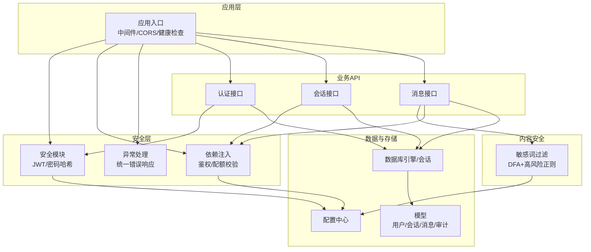
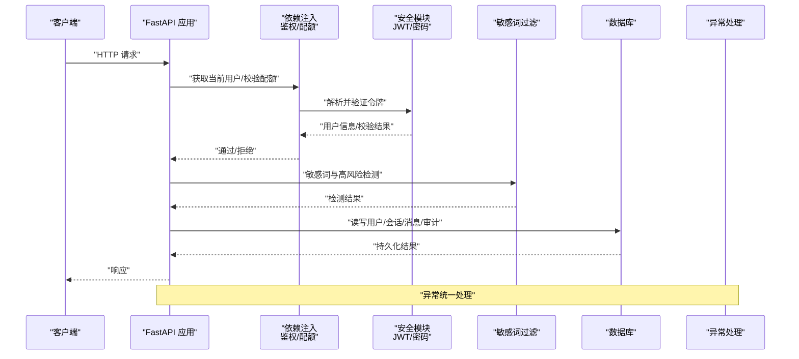
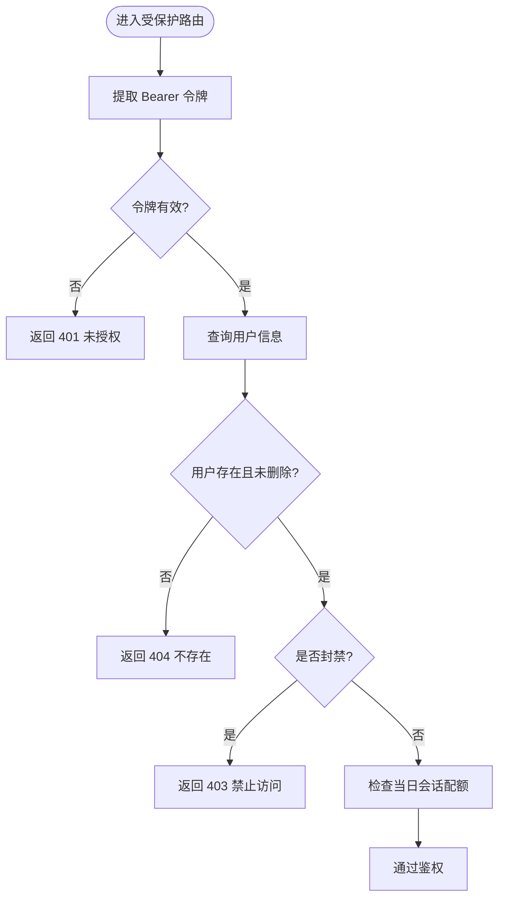
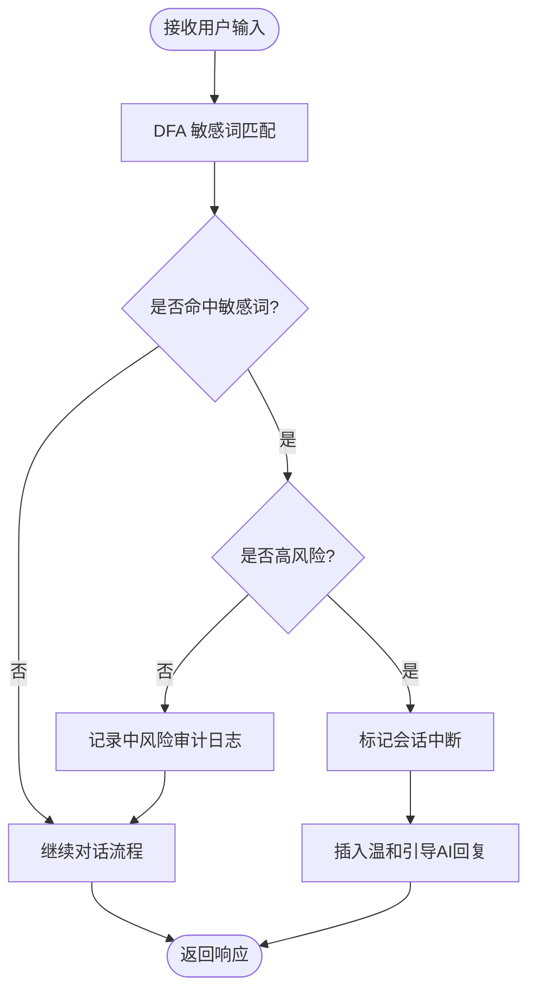
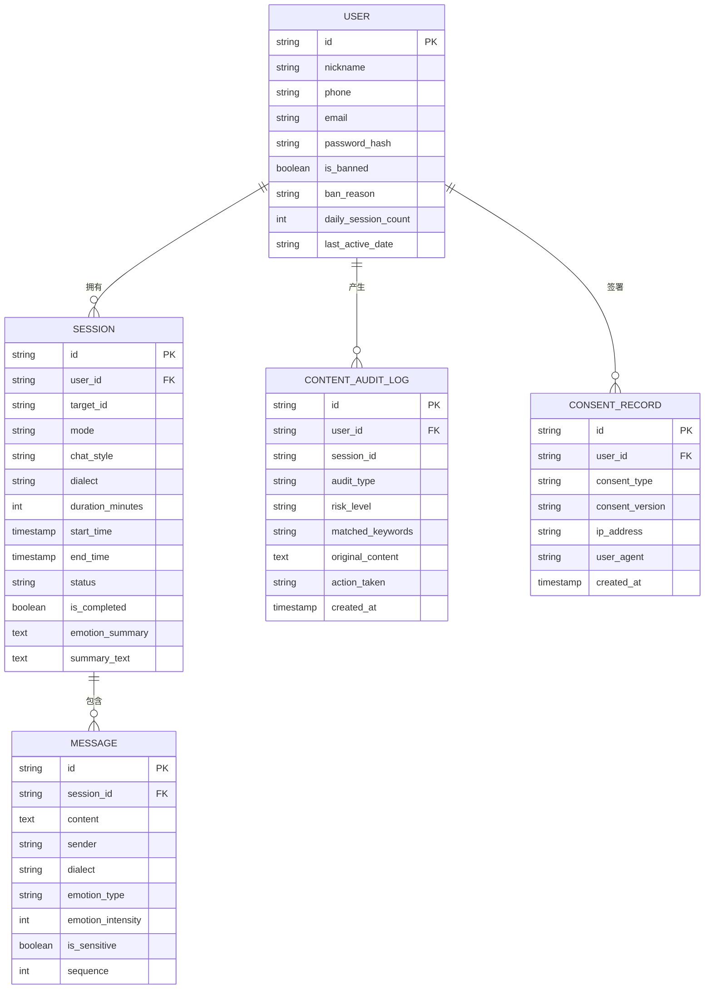
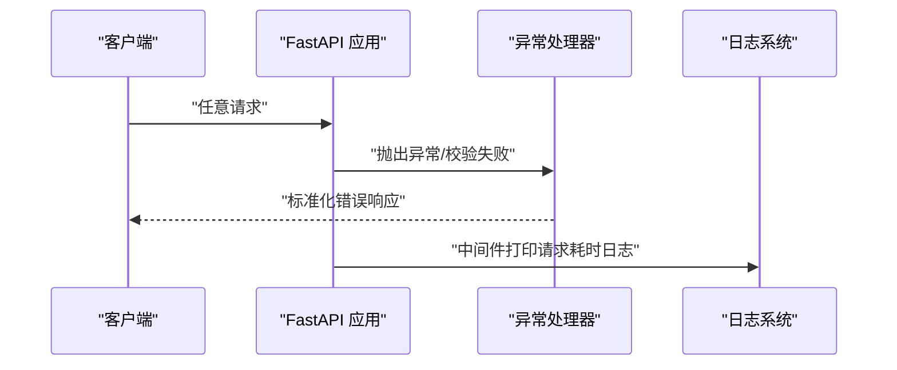
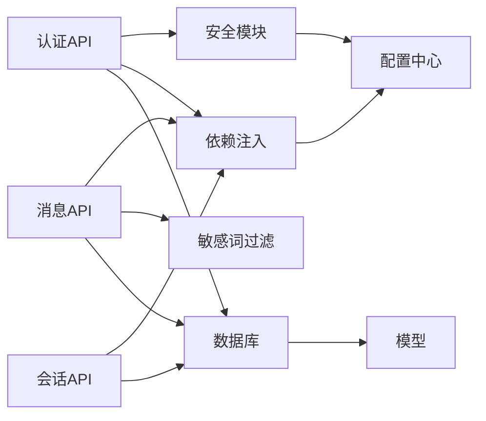

# 安全审计与监控

<cite>
**本文引用的文件**
- [emo_outlet_api/app/main.py](file://emo_outlet_api/app/main.py)
- [emo_outlet_api/app/config.py](file://emo_outlet_api/app/config.py)
- [emo_outlet_api/app/core/security.py](file://emo_outlet_api/app/core/security.py)
- [emo_outlet_api/app/core/error_handler.py](file://emo_outlet_api/app/core/error_handler.py)
- [emo_outlet_api/app/core/dependencies.py](file://emo_outlet_api/app/core/dependencies.py)
- [emo_outlet_api/app/api/auth.py](file://emo_outlet_api/app/api/auth.py)
- [emo_outlet_api/app/api/messages.py](file://emo_outlet_api/app/api/messages.py)
- [emo_outlet_api/app/api/sessions.py](file://emo_outlet_api/app/api/sessions.py)
- [emo_outlet_api/app/utils/sensitive_filter.py](file://emo_outlet_api/app/utils/sensitive_filter.py)
- [emo_outlet_api/app/models/compliance.py](file://emo_outlet_api/app/models/compliance.py)
- [emo_outlet_api/app/models/user.py](file://emo_outlet_api/app/models/user.py)
- [emo_outlet_api/app/models/session.py](file://emo_outlet_api/app/models/session.py)
- [emo_outlet_api/app/models/message.py](file://emo_outlet_api/app/models/message.py)
- [emo_outlet_api/app/database.py](file://emo_outlet_api/app/database.py)
- [emo_outlet_api/run.py](file://emo_outlet_api/run.py)
</cite>

## 目录
1. [简介](#简介)
2. [项目结构](#项目结构)
3. [核心组件](#核心组件)
4. [架构总览](#架构总览)
5. [详细组件分析](#详细组件分析)
6. [依赖分析](#依赖分析)
7. [性能考虑](#性能考虑)
8. [故障排查指南](#故障排查指南)
9. [结论](#结论)
10. [附录](#附录)

## 简介
本文件面向 Emo Outlet 项目，提供一套系统化的安全审计与监控方案。内容涵盖访问日志记录、操作审计跟踪、异常行为检测、实时监控告警、入侵检测与响应、漏洞管理流程、应急响应预案、安全配置管理以及安全测试与监控仪表板建议。文档以现有代码库为基础，结合可扩展实践，帮助团队在开发与运维阶段落实安全控制。

## 项目结构
Emo Outlet 后端采用 FastAPI + SQLAlchemy Async 架构，核心安全相关模块分布如下：
- 应用入口与中间件：应用生命周期、CORS、请求耗时日志
- 安全模块：JWT 认证、密码哈希、令牌解析
- 依赖注入：鉴权中间层、每日会话配额校验
- API 层：认证、会话、消息、目标、支持、海报
- 审计与合规：内容审计日志、同意记录
- 内容安全：敏感词过滤（DFA + 高风险正则）
- 数据模型：用户、会话、消息、审计日志
- 配置中心：数据库、Redis、AI 服务、安全阈值、审计开关
- 数据库初始化与连接池

图表来源
- [emo_outlet_api/app/main.py:1-82](file://emo_outlet_api/app/main.py#L1-L82)
- [emo_outlet_api/app/core/security.py:1-43](file://emo_outlet_api/app/core/security.py#L1-L43)
- [emo_outlet_api/app/core/dependencies.py:1-67](file://emo_outlet_api/app/core/dependencies.py#L1-L67)
- [emo_outlet_api/app/core/error_handler.py:1-59](file://emo_outlet_api/app/core/error_handler.py#L1-L59)
- [emo_outlet_api/app/api/auth.py:1-318](file://emo_outlet_api/app/api/auth.py#L1-L318)
- [emo_outlet_api/app/api/sessions.py:1-220](file://emo_outlet_api/app/api/sessions.py#L1-L220)
- [emo_outlet_api/app/api/messages.py:1-216](file://emo_outlet_api/app/api/messages.py#L1-L216)
- [emo_outlet_api/app/utils/sensitive_filter.py:1-142](file://emo_outlet_api/app/utils/sensitive_filter.py#L1-L142)
- [emo_outlet_api/app/config.py:1-125](file://emo_outlet_api/app/config.py#L1-L125)
- [emo_outlet_api/app/database.py:1-43](file://emo_outlet_api/app/database.py#L1-L43)
- [emo_outlet_api/app/models/compliance.py:1-50](file://emo_outlet_api/app/models/compliance.py#L1-L50)
- [emo_outlet_api/app/models/user.py:1-52](file://emo_outlet_api/app/models/user.py#L1-L52)
- [emo_outlet_api/app/models/session.py:1-79](file://emo_outlet_api/app/models/session.py#L1-L79)
- [emo_outlet_api/app/models/message.py:1-46](file://emo_outlet_api/app/models/message.py#L1-L46)

章节来源
- [emo_outlet_api/app/main.py:1-82](file://emo_outlet_api/app/main.py#L1-L82)
- [emo_outlet_api/app/config.py:1-125](file://emo_outlet_api/app/config.py#L1-L125)

## 核心组件
- 认证与授权
  - JWT 令牌签发与校验，密码哈希与验证
  - 基于 Bearer Token 的鉴权中间层
  - 用户状态与封禁校验
- 请求与异常处理
  - 统一异常处理器，HTTP/校验/通用异常
  - 请求耗时中间件打印
- 内容安全
  - DFA 敏感词过滤 + 高风险正则检测
  - 触发高风险时的温和引导与会话中断
- 审计与合规
  - 内容审计日志表结构与字段
  - 同意记录表结构与字段
- 会话与配额
  - 每日会话次数限制（按访客/年龄分组）
  - 会话时长与轮数上限控制
- 配置中心
  - 数据库/Redis/LLM/TTS/ASR/OSS 等配置项
  - 审计日志开关与采样率
  - 安全阈值（消息长度、会话时长、免费会话数）

章节来源
- [emo_outlet_api/app/core/security.py:1-43](file://emo_outlet_api/app/core/security.py#L1-L43)
- [emo_outlet_api/app/core/dependencies.py:1-67](file://emo_outlet_api/app/core/dependencies.py#L1-L67)
- [emo_outlet_api/app/core/error_handler.py:1-59](file://emo_outlet_api/app/core/error_handler.py#L1-L59)
- [emo_outlet_api/app/api/messages.py:1-216](file://emo_outlet_api/app/api/messages.py#L1-L216)
- [emo_outlet_api/app/models/compliance.py:1-50](file://emo_outlet_api/app/models/compliance.py#L1-L50)
- [emo_outlet_api/app/config.py:1-125](file://emo_outlet_api/app/config.py#L1-L125)

## 架构总览
下图展示从客户端到数据库的典型交互路径，标注了安全控制点（鉴权、敏感词、审计、异常处理）。

图表来源
- [emo_outlet_api/app/main.py:33-39](file://emo_outlet_api/app/main.py#L33-L39)
- [emo_outlet_api/app/core/dependencies.py:18-50](file://emo_outlet_api/app/core/dependencies.py#L18-L50)
- [emo_outlet_api/app/core/security.py:26-42](file://emo_outlet_api/app/core/security.py#L26-L42)
- [emo_outlet_api/app/api/messages.py:70-195](file://emo_outlet_api/app/api/messages.py#L70-L195)
- [emo_outlet_api/app/core/error_handler.py:10-51](file://emo_outlet_api/app/core/error_handler.py#L10-L51)

## 详细组件分析

### 认证与会话安全
- JWT 令牌
  - 使用密钥与算法生成访问令牌，并设置过期时间
  - 解码时进行错误捕获，防止异常泄露
- 密码安全
  - 使用 bcrypt 哈希存储密码，校验时进行对比
- 鉴权中间层
  - 从 Authorization 头提取 Bearer 令牌
  - 校验令牌有效性、用户存在性、封禁状态
  - 按日期重置每日会话计数
- 会话配额
  - 不同用户类型与年龄分组设置每日最大会话数
  - 超限时返回限流错误

图表来源
- [emo_outlet_api/app/core/dependencies.py:18-50](file://emo_outlet_api/app/core/dependencies.py#L18-L50)
- [emo_outlet_api/app/core/security.py:26-42](file://emo_outlet_api/app/core/security.py#L26-L42)
- [emo_outlet_api/app/api/sessions.py:67-78](file://emo_outlet_api/app/api/sessions.py#L67-L78)

章节来源
- [emo_outlet_api/app/core/security.py:1-43](file://emo_outlet_api/app/core/security.py#L1-L43)
- [emo_outlet_api/app/core/dependencies.py:1-67](file://emo_outlet_api/app/core/dependencies.py#L1-L67)
- [emo_outlet_api/app/api/sessions.py:1-220](file://emo_outlet_api/app/api/sessions.py#L1-L220)

### 敏感词与高风险检测
- DFA 敏感词过滤
  - 基于 Trie 树实现 O(n) 匹配，支持最长匹配
  - 提供过滤文本与替换功能
- 高风险正则
  - 针对自残、暴力、自杀等高危表达式进行识别
- 行为处置
  - 中等风险：记录审计日志
  - 高风险：中断会话并返回温和引导语
- 配置开关
  - 可通过配置启用/禁用审计日志与采样率

图表来源
- [emo_outlet_api/app/api/messages.py:70-195](file://emo_outlet_api/app/api/messages.py#L70-L195)
- [emo_outlet_api/app/utils/sensitive_filter.py:74-119](file://emo_outlet_api/app/utils/sensitive_filter.py#L74-L119)
- [emo_outlet_api/app/models/compliance.py:31-49](file://emo_outlet_api/app/models/compliance.py#L31-L49)

章节来源
- [emo_outlet_api/app/utils/sensitive_filter.py:1-142](file://emo_outlet_api/app/utils/sensitive_filter.py#L1-L142)
- [emo_outlet_api/app/api/messages.py:1-216](file://emo_outlet_api/app/api/messages.py#L1-L216)
- [emo_outlet_api/app/models/compliance.py:1-50](file://emo_outlet_api/app/models/compliance.py#L1-L50)

### 审计与合规
- 内容审计日志
  - 字段覆盖用户、会话、审计类型、风险等级、关键词、原始内容、处置动作、时间戳
- 同意记录
  - 记录用户同意类型、版本、IP、UA、时间
- 审计开关与采样
  - 配置项包含启用审计与采样率，便于生产环境降噪

图表来源
- [emo_outlet_api/app/models/user.py:12-48](file://emo_outlet_api/app/models/user.py#L12-L48)
- [emo_outlet_api/app/models/session.py:13-75](file://emo_outlet_api/app/models/session.py#L13-L75)
- [emo_outlet_api/app/models/message.py:13-42](file://emo_outlet_api/app/models/message.py#L13-L42)
- [emo_outlet_api/app/models/compliance.py:12-49](file://emo_outlet_api/app/models/compliance.py#L12-L49)

章节来源
- [emo_outlet_api/app/models/compliance.py:1-50](file://emo_outlet_api/app/models/compliance.py#L1-L50)
- [emo_outlet_api/app/models/user.py:1-52](file://emo_outlet_api/app/models/user.py#L1-L52)
- [emo_outlet_api/app/models/session.py:1-79](file://emo_outlet_api/app/models/session.py#L1-L79)
- [emo_outlet_api/app/models/message.py:1-46](file://emo_outlet_api/app/models/message.py#L1-L46)

### 异常处理与访问日志
- 统一异常处理
  - HTTP 异常、请求参数校验异常、通用异常
  - 返回标准化错误结构，避免泄露内部细节
- 访问日志
  - 中间件记录请求方法、路径、状态码与耗时
  - 便于后续接入集中式日志系统

图表来源
- [emo_outlet_api/app/core/error_handler.py:10-51](file://emo_outlet_api/app/core/error_handler.py#L10-L51)
- [emo_outlet_api/app/main.py:33-39](file://emo_outlet_api/app/main.py#L33-L39)

章节来源
- [emo_outlet_api/app/core/error_handler.py:1-59](file://emo_outlet_api/app/core/error_handler.py#L1-L59)
- [emo_outlet_api/app/main.py:1-82](file://emo_outlet_api/app/main.py#L1-L82)

### 会话与配额控制
- 会话生命周期
  - 创建、查询、获取活动会话、结束并生成情绪分析摘要
- 配额与限制
  - 每日会话次数按访客/年龄分组限制
  - 会话轮数上限与时长上限，超限自动完成
- 风险联动
  - 高风险输入导致会话中断并提示温和引导

章节来源
- [emo_outlet_api/app/api/sessions.py:1-220](file://emo_outlet_api/app/api/sessions.py#L1-L220)
- [emo_outlet_api/app/api/messages.py:1-216](file://emo_outlet_api/app/api/messages.py#L1-L216)
- [emo_outlet_api/app/config.py:88-107](file://emo_outlet_api/app/config.py#L88-L107)

## 依赖分析
- 组件耦合
  - API 层依赖安全模块与依赖注入，耦合集中在鉴权与配额
  - 消息接口同时依赖敏感词过滤与审计日志，形成内容安全闭环
- 外部依赖
  - 数据库引擎与会话工厂
  - 配置中心 Settings 提供统一配置入口
- 循环依赖
  - 未发现直接循环导入；模型在数据库初始化时被显式导入

图表来源
- [emo_outlet_api/app/api/auth.py:1-318](file://emo_outlet_api/app/api/auth.py#L1-L318)
- [emo_outlet_api/app/api/sessions.py:1-220](file://emo_outlet_api/app/api/sessions.py#L1-L220)
- [emo_outlet_api/app/api/messages.py:1-216](file://emo_outlet_api/app/api/messages.py#L1-L216)
- [emo_outlet_api/app/core/security.py:1-43](file://emo_outlet_api/app/core/security.py#L1-L43)
- [emo_outlet_api/app/core/dependencies.py:1-67](file://emo_outlet_api/app/core/dependencies.py#L1-L67)
- [emo_outlet_api/app/utils/sensitive_filter.py:1-142](file://emo_outlet_api/app/utils/sensitive_filter.py#L1-L142)
- [emo_outlet_api/app/database.py:1-43](file://emo_outlet_api/app/database.py#L1-L43)
- [emo_outlet_api/app/config.py:1-125](file://emo_outlet_api/app/config.py#L1-L125)

章节来源
- [emo_outlet_api/app/database.py:1-43](file://emo_outlet_api/app/database.py#L1-L43)
- [emo_outlet_api/app/config.py:1-125](file://emo_outlet_api/app/config.py#L1-L125)

## 性能考虑
- 敏感词匹配
  - DFA 基于 Trie 树，复杂度 O(n)，适合高频文本过滤
  - 建议将敏感词库与高风险正则缓存至内存，减少重复编译
- 审计日志
  - 采样率与批量入库可降低写放大
  - 审计表建立索引（user_id、session_id、created_at）提升查询效率
- 会话与消息
  - 分页查询与 LIMIT 控制单次返回量
  - 会话轮数与时长上限可避免长时间占用资源
- 数据库
  - 异步引擎与连接池配置需与并发规模匹配
  - 生产环境开启只读副本与慢查询日志

## 故障排查指南
- 认证失败
  - 检查令牌是否过期或格式错误
  - 确认用户未被封禁或不存在
- 会话配额受限
  - 核对用户类型与年龄分组对应的配额阈值
  - 查看当日计数与活跃日期是否正确更新
- 敏感词误判
  - 调整敏感词库与高风险正则规则
  - 开启审计日志核对命中关键词与处置动作
- 审计日志缺失
  - 确认配置项启用审计与采样率
  - 检查数据库连接与事务提交
- 异常响应
  - 查看统一异常处理器输出
  - 结合中间件日志定位耗时与错误点

章节来源
- [emo_outlet_api/app/core/dependencies.py:18-50](file://emo_outlet_api/app/core/dependencies.py#L18-L50)
- [emo_outlet_api/app/api/sessions.py:67-78](file://emo_outlet_api/app/api/sessions.py#L67-L78)
- [emo_outlet_api/app/api/messages.py:96-107](file://emo_outlet_api/app/api/messages.py#L96-L107)
- [emo_outlet_api/app/config.py:108-110](file://emo_outlet_api/app/config.py#L108-L110)
- [emo_outlet_api/app/core/error_handler.py:10-51](file://emo_outlet_api/app/core/error_handler.py#L10-L51)
- [emo_outlet_api/app/main.py:33-39](file://emo_outlet_api/app/main.py#L33-L39)

## 结论
Emo Outlet 已具备基础的安全能力：JWT 认证、密码哈希、敏感词过滤、内容审计与异常处理。建议在生产环境中进一步完善以下方面：
- 引入集中式日志与指标采集，完善实时监控与告警
- 增设 WAF、速率限制与 IP 黑名单
- 建立漏洞扫描与修复流程，定期进行渗透测试
- 制定应急响应预案与演练计划
- 强化配置基线与变更审计，确保最小权限与最小暴露面

## 附录

### 安全审计机制
- 访问日志记录
  - 中间件记录请求方法、路径、状态码与耗时
  - 建议接入 ELK/Cloud Logging，设置保留策略与检索规则
- 操作审计跟踪
  - 内容审计日志记录用户、会话、风险等级、关键词与处置动作
  - 同意记录记录用户同意类型、版本、IP 与 UA
- 异常行为检测
  - 高风险输入触发会话中断与温和引导
  - 可扩展为基于会话统计的异常检测（异常高峰、异常频率）

章节来源
- [emo_outlet_api/app/main.py:33-39](file://emo_outlet_api/app/main.py#L33-L39)
- [emo_outlet_api/app/models/compliance.py:1-50](file://emo_outlet_api/app/models/compliance.py#L1-L50)
- [emo_outlet_api/app/api/messages.py:96-126](file://emo_outlet_api/app/api/messages.py#L96-L126)

### 安全监控策略
- 实时监控告警
  - 指标：请求量、错误率、P95/P99 延迟、数据库连接数、审计日志写入速率
  - 告警：阈值告警、趋势告警、异常波动检测
- 入侵检测系统
  - 建议部署 WAF，识别 SQL 注入、XSS、暴力破解等
  - 结合 IP 黑名单与速率限制
- 安全事件响应
  - 事件分级：低/中/高/严重
  - 响应流程：隔离、取证、修复、复盘、改进

### 漏洞管理流程
- 漏洞扫描
  - 代码静态分析（Secrets、依赖漏洞）
  - 依赖扫描（Snyk/OSV）
- 风险评估
  - 影响面、利用难度、修复成本
- 修复优先级
  - P0：高危漏洞立即修复；P1：中危尽快修复；P2：低危纳入计划
- 验证确认
  - 回归测试、渗透测试、配置审计

### 应急响应预案
- 事件分类
  - 认证绕过、敏感数据泄露、DDoS、业务逻辑滥用
- 响应团队
  - 安全负责人、开发、运维、法务与公关
- 处置流程
  - 发现→评估→隔离→修复→复盘→改进
- 恢复计划
  - 快速回滚、数据恢复、服务重建、监控回归

### 安全配置管理
- 基线配置
  - 最小权限原则、默认拒绝、强口令、TLS/HTTPS、CORS 白名单
- 变更控制
  - 变更审批、灰度发布、回滚策略
- 配置审计
  - 配置清单、变更记录、定期巡检

### 安全测试方法与渗透测试指南
- 安全测试方法
  - 单元测试：鉴权、配额、敏感词过滤
  - 集成测试：会话生命周期、异常处理
  - 场景测试：高并发、异常输入、边界条件
- 渗透测试指南
  - 范围：API、数据库、配置文件、第三方服务
  - 方法：黑盒/白盒、自动化工具与手工验证结合
- 安全监控仪表板
  - 日志聚合、指标面板、告警看板、合规仪表盘