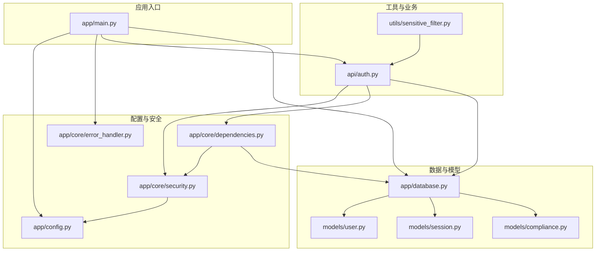
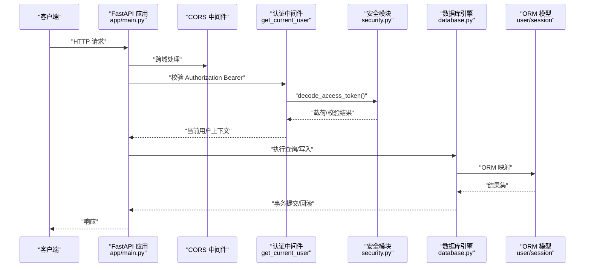
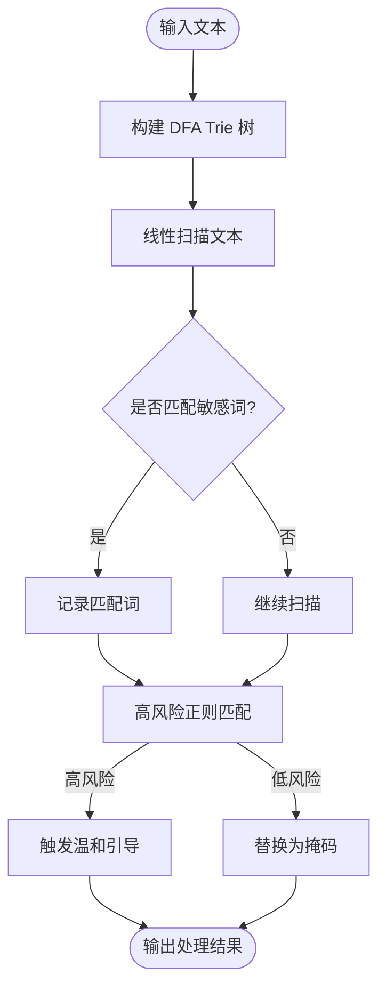
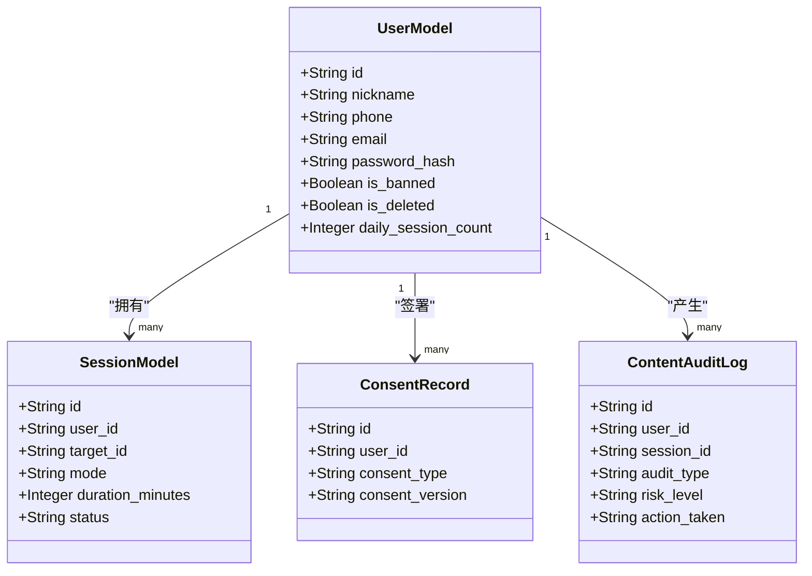
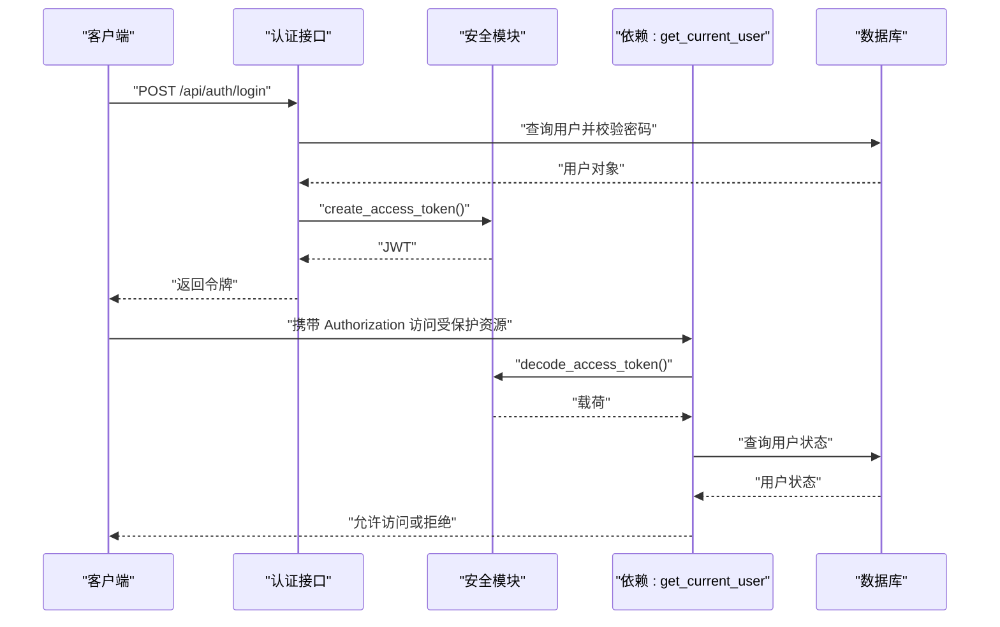
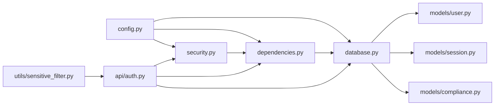

# 数据安全

<cite>
**本文引用的文件**
- [emo_outlet_api/app/config.py](file://emo_outlet_api/app/config.py)
- [emo_outlet_api/app/main.py](file://emo_outlet_api/app/main.py)
- [emo_outlet_api/app/core/security.py](file://emo_outlet_api/app/core/security.py)
- [emo_outlet_api/app/core/dependencies.py](file://emo_outlet_api/app/core/dependencies.py)
- [emo_outlet_api/app/core/error_handler.py](file://emo_outlet_api/app/core/error_handler.py)
- [emo_outlet_api/app/database.py](file://emo_outlet_api/app/database.py)
- [emo_outlet_api/app/utils/sensitive_filter.py](file://emo_outlet_api/app/utils/sensitive_filter.py)
- [emo_outlet_api/app/models/user.py](file://emo_outlet_api/app/models/user.py)
- [emo_outlet_api/app/models/session.py](file://emo_outlet_api/app/models/session.py)
- [emo_outlet_api/app/models/compliance.py](file://emo_outlet_api/app/models/compliance.py)
- [emo_outlet_api/run.py](file://emo_outlet_api/run.py)
</cite>

## 目录
1. [引言](#引言)
2. [项目结构](#项目结构)
3. [核心组件](#核心组件)
4. [架构总览](#架构总览)
5. [详细组件分析](#详细组件分析)
6. [依赖分析](#依赖分析)
7. [性能考虑](#性能考虑)
8. [故障排查指南](#故障排查指南)
9. [结论](#结论)
10. [附录](#附录)

## 引言
本文件面向 Emo Outlet 项目，系统化梳理数据安全设计与实现，覆盖以下方面：
- 数据传输加密机制：HTTPS 配置、TLS 证书管理、SSL/TLS 握手流程
- 端侧数据处理策略：本地数据加密、敏感信息脱敏、数据最小化原则
- 数据库安全：连接池安全配置、SQL 注入防护、数据访问控制
- 会话安全管理：会话超时、并发控制、会话固定攻击防护
- 数据备份与恢复：备份频率、加密备份、灾难恢复计划
- 安全配置指南、安全审计日志、威胁防护措施

本文件在技术深度与可读性之间取得平衡，既适用于开发者深入理解实现细节，也便于非技术读者把握整体安全策略。

## 项目结构
Emo Outlet 后端采用 FastAPI + SQLAlchemy Async 架构，核心安全相关模块分布如下：
- 配置层：集中管理应用配置、安全参数与合规阈值
- 安全层：JWT 认证、密码哈希、令牌解析与校验
- 数据层：异步数据库引擎、会话工厂、模型定义
- 业务层：认证路由、会话与消息等业务接口
- 工具层：敏感词过滤（DFA + 正则）、内容审计日志
- 中间件与异常：CORS、请求日志、统一异常处理

图表来源
- [emo_outlet_api/app/main.py:1-82](file://emo_outlet_api/app/main.py#L1-L82)
- [emo_outlet_api/app/config.py:1-125](file://emo_outlet_api/app/config.py#L1-L125)
- [emo_outlet_api/app/core/security.py:1-43](file://emo_outlet_api/app/core/security.py#L1-L43)
- [emo_outlet_api/app/core/dependencies.py:1-67](file://emo_outlet_api/app/core/dependencies.py#L1-L67)
- [emo_outlet_api/app/core/error_handler.py:1-59](file://emo_outlet_api/app/core/error_handler.py#L1-L59)
- [emo_outlet_api/app/database.py:1-43](file://emo_outlet_api/app/database.py#L1-L43)
- [emo_outlet_api/app/models/user.py:1-56](file://emo_outlet_api/app/models/user.py#L1-L56)
- [emo_outlet_api/app/models/session.py:1-79](file://emo_outlet_api/app/models/session.py#L1-L79)
- [emo_outlet_api/app/models/compliance.py:1-50](file://emo_outlet_api/app/models/compliance.py#L1-L50)
- [emo_outlet_api/app/utils/sensitive_filter.py:1-142](file://emo_outlet_api/app/utils/sensitive_filter.py#L1-L142)

章节来源
- [emo_outlet_api/app/main.py:1-82](file://emo_outlet_api/app/main.py#L1-L82)
- [emo_outlet_api/app/config.py:1-125](file://emo_outlet_api/app/config.py#L1-L125)

## 核心组件
- 配置中心：集中管理数据库连接、Redis、JWT、AI 服务、合规阈值、审计开关等
- 安全模块：密码哈希（bcrypt）、JWT 编解码、令牌校验中间件
- 数据层：异步 SQL 引擎、会话工厂、ORM 模型与约束
- 敏感词过滤：DFA 构建 Trie 树进行 O(n) 匹配，结合高风险正则模式
- 内容审计日志：记录关键词命中、风险等级、处置动作等
- 统一异常处理：规范化错误响应，避免信息泄露

章节来源
- [emo_outlet_api/app/config.py:1-125](file://emo_outlet_api/app/config.py#L1-L125)
- [emo_outlet_api/app/core/security.py:1-43](file://emo_outlet_api/app/core/security.py#L1-L43)
- [emo_outlet_api/app/database.py:1-43](file://emo_outlet_api/app/database.py#L1-L43)
- [emo_outlet_api/app/utils/sensitive_filter.py:1-142](file://emo_outlet_api/app/utils/sensitive_filter.py#L1-L142)
- [emo_outlet_api/app/models/compliance.py:1-50](file://emo_outlet_api/app/models/compliance.py#L1-L50)
- [emo_outlet_api/app/core/error_handler.py:1-59](file://emo_outlet_api/app/core/error_handler.py#L1-L59)

## 架构总览
下图展示从客户端到数据库的端到端数据流，以及安全控制点：

图表来源
- [emo_outlet_api/app/main.py:33-48](file://emo_outlet_api/app/main.py#L33-L48)
- [emo_outlet_api/app/core/dependencies.py:18-50](file://emo_outlet_api/app/core/dependencies.py#L18-L50)
- [emo_outlet_api/app/core/security.py:26-42](file://emo_outlet_api/app/core/security.py#L26-L42)
- [emo_outlet_api/app/database.py:22-31](file://emo_outlet_api/app/database.py#L22-L31)
- [emo_outlet_api/app/models/user.py:14-56](file://emo_outlet_api/app/models/user.py#L14-L56)
- [emo_outlet_api/app/models/session.py:13-79](file://emo_outlet_api/app/models/session.py#L13-L79)

## 详细组件分析

### 数据传输加密机制（HTTPS、TLS、证书）
- 当前实现要点
  - 应用通过 Uvicorn 启动，支持生产环境多进程运行
  - 未在仓库中发现显式的 HTTPS/SSL/TLS 配置片段
  - CORS 允许任意来源，生产环境应收紧来源白名单
- 建议实践
  - 在反向代理（Nginx/Traefik/Caddy）启用 TLS 终止，使用 Let’s Encrypt 自动签发证书
  - 强制 HSTS、安全 Cookie 属性（Secure、HttpOnly、SameSite）
  - 生产环境关闭 CORS 允许所有来源，仅放行前端域名
- 影响范围
  - 若直接由 Uvicorn 提供 HTTPS，需在部署层配置证书与密钥文件；否则应在网关层完成 TLS 终止

章节来源
- [emo_outlet_api/run.py:15-23](file://emo_outlet_api/run.py#L15-L23)
- [emo_outlet_api/app/main.py:42-48](file://emo_outlet_api/app/main.py#L42-L48)

### 端侧数据处理策略（本地加密、脱敏、最小化）
- 本地数据加密
  - 项目未实现端侧磁盘加密或传输加密（如 TLS 之外的额外加密层）
  - 建议：对敏感字段（如手机号、邮箱）在存储前进行对称加密，密钥由运维安全地轮换与备份
- 敏感信息脱敏
  - 使用 DFA（确定性有限自动机）与 Trie 树实现 O(n) 敏感词匹配
  - 高风险模式通过预编译正则表达式识别潜在危险表述
  - 触发高风险时生成温和引导语句，避免激化情绪
- 数据最小化原则
  - 用户模型包含必要字段，避免收集无关信息
  - 会话与消息按需记录，遵循“达成目的即删除”的原则
  - 提供数据导出与注销接口，支持用户行使“被遗忘权”

图表来源
- [emo_outlet_api/app/utils/sensitive_filter.py:37-139](file://emo_outlet_api/app/utils/sensitive_filter.py#L37-L139)

章节来源
- [emo_outlet_api/app/utils/sensitive_filter.py:1-142](file://emo_outlet_api/app/utils/sensitive_filter.py#L1-L142)
- [emo_outlet_api/app/models/user.py:14-56](file://emo_outlet_api/app/models/user.py#L14-L56)
- [emo_outlet_api/app/api/auth.py:212-239](file://emo_outlet_api/app/api/auth.py#L212-L239)

### 数据库安全（连接池、SQL 注入、访问控制）
- 连接池安全配置
  - 使用异步 SQLAlchemy 引擎与会话工厂，默认开启回滚与提交
  - 建议：限制最大连接数、设置连接超时、启用只读副本与主从分离
- SQL 注入防护
  - 项目使用 ORM 查询，未见原生 SQL 拼接，天然降低注入风险
  - 建议：严格审查第三方库与自定义 SQL，统一走 ORM 或参数化查询
- 数据访问控制
  - 用户状态（封禁/删除）在模型中体现，中间件在鉴权时进行校验
  - 日志审计表记录内容审核行为，支持追踪与复核

图表来源
- [emo_outlet_api/app/models/user.py:14-56](file://emo_outlet_api/app/models/user.py#L14-L56)
- [emo_outlet_api/app/models/session.py:13-79](file://emo_outlet_api/app/models/session.py#L13-L79)
- [emo_outlet_api/app/models/compliance.py:12-49](file://emo_outlet_api/app/models/compliance.py#L12-L49)

章节来源
- [emo_outlet_api/app/database.py:1-43](file://emo_outlet_api/app/database.py#L1-L43)
- [emo_outlet_api/app/models/user.py:14-56](file://emo_outlet_api/app/models/user.py#L14-L56)
- [emo_outlet_api/app/models/compliance.py:1-50](file://emo_outlet_api/app/models/compliance.py#L1-L50)

### 会话安全管理（超时、并发、固定攻击防护）
- 会话超时
  - JWT 访问令牌具有过期时间，过期后需重新登录
- 并发控制
  - 按日期重置每日会话计数，依据年龄分组限制日最大会话数
- 会话固定攻击防护
  - 登录成功后发放新令牌，避免复用旧令牌
  - 中间件校验令牌有效性与用户状态，拒绝封禁用户访问

图表来源
- [emo_outlet_api/app/api/auth.py:78-93](file://emo_outlet_api/app/api/auth.py#L78-L93)
- [emo_outlet_api/app/core/security.py:26-42](file://emo_outlet_api/app/core/security.py#L26-L42)
- [emo_outlet_api/app/core/dependencies.py:18-50](file://emo_outlet_api/app/core/dependencies.py#L18-L50)

章节来源
- [emo_outlet_api/app/config.py:88-110](file://emo_outlet_api/app/config.py#L88-L110)
- [emo_outlet_api/app/core/security.py:26-42](file://emo_outlet_api/app/core/security.py#L26-L42)
- [emo_outlet_api/app/core/dependencies.py:53-67](file://emo_outlet_api/app/core/dependencies.py#L53-L67)

### 数据备份与恢复策略
- 备份频率
  - 建议：增量/差异每日 + 全量每周；结合数据库快照与 WAL 归档
- 加密备份
  - 备份文件与归档日志使用强加密算法；密钥与介质分离存储
- 灾难恢复
  - 定期演练 RTO/RPO；确保主备切换与数据一致性；监控与告警联动

说明：本节为通用实践建议，未直接分析具体代码文件。

### 安全配置指南、审计日志与威胁防护
- 安全配置指南
  - 生产环境关闭 DEBUG；严格管理 SECRET_KEY 与数据库凭据
  - 限制 CORS 来源；强制 HTTPS；启用 CSRF 与安全头
- 审计日志
  - 内容审计日志记录关键词、风险等级与处置动作
  - 可选启用审计日志采样率，平衡性能与可观测性
- 威胁防护
  - 敏感词过滤与高风险模式识别，结合人工复核
  - 统一异常处理屏蔽内部错误细节，防止信息泄露

章节来源
- [emo_outlet_api/app/config.py:88-110](file://emo_outlet_api/app/config.py#L88-L110)
- [emo_outlet_api/app/models/compliance.py:31-49](file://emo_outlet_api/app/models/compliance.py#L31-L49)
- [emo_outlet_api/app/core/error_handler.py:10-51](file://emo_outlet_api/app/core/error_handler.py#L10-L51)

## 依赖分析
- 组件耦合
  - 安全模块与依赖模块紧耦合，负责令牌编解码与用户校验
  - 数据层通过异步引擎与会话工厂向上提供事务能力
- 外部依赖
  - JWT 编解码、密码哈希、异步 SQL、ORM 映射
- 风险点
  - CORS 允许所有来源；生产环境需收紧
  - JWT 密钥需妥善保管与轮换；令牌有效期需合理设置

图表来源
- [emo_outlet_api/app/config.py:1-125](file://emo_outlet_api/app/config.py#L1-L125)
- [emo_outlet_api/app/core/security.py:1-43](file://emo_outlet_api/app/core/security.py#L1-L43)
- [emo_outlet_api/app/core/dependencies.py:1-67](file://emo_outlet_api/app/core/dependencies.py#L1-L67)
- [emo_outlet_api/app/database.py:1-43](file://emo_outlet_api/app/database.py#L1-L43)
- [emo_outlet_api/app/models/user.py:1-56](file://emo_outlet_api/app/models/user.py#L1-L56)
- [emo_outlet_api/app/models/session.py:1-79](file://emo_outlet_api/app/models/session.py#L1-L79)
- [emo_outlet_api/app/models/compliance.py:1-50](file://emo_outlet_api/app/models/compliance.py#L1-L50)
- [emo_outlet_api/app/utils/sensitive_filter.py:1-142](file://emo_outlet_api/app/utils/sensitive_filter.py#L1-L142)
- [emo_outlet_api/app/api/auth.py:1-332](file://emo_outlet_api/app/api/auth.py#L1-L332)

章节来源
- [emo_outlet_api/app/main.py:51-63](file://emo_outlet_api/app/main.py#L51-L63)
- [emo_outlet_api/app/core/dependencies.py:15-16](file://emo_outlet_api/app/core/dependencies.py#L15-L16)

## 性能考虑
- 异步数据库：使用异步引擎与会话工厂，减少阻塞，提升吞吐
- JWT 解析：轻量级内存计算，建议缓存热点用户信息以降低数据库压力
- 敏感词过滤：DFA 构建一次，匹配 O(n)，适合高频文本处理
- CORS：生产环境限制来源，减少不必要的预检请求

说明：本节提供一般性指导，未直接分析具体代码文件。

## 故障排查指南
- 常见问题
  - 401 未提供或无效令牌：检查 Authorization 头与令牌签名
  - 403 封禁用户：确认用户状态与封禁原因
  - 409 注册冲突：手机号/邮箱重复
  - 500 服务器内部错误：查看统一异常处理输出
- 排查步骤
  - 开启调试日志与请求耗时统计
  - 核对数据库连接字符串与凭据
  - 检查 CORS 配置与来源白名单
  - 审核敏感词库与高风险正则更新情况

章节来源
- [emo_outlet_api/app/core/dependencies.py:22-43](file://emo_outlet_api/app/core/dependencies.py#L22-L43)
- [emo_outlet_api/app/api/auth.py:33-76](file://emo_outlet_api/app/api/auth.py#L33-L76)
- [emo_outlet_api/app/core/error_handler.py:10-51](file://emo_outlet_api/app/core/error_handler.py#L10-L51)

## 结论
Emo Outlet 的后端在安全层面具备清晰的边界：认证与授权通过 JWT 实现，数据库访问通过 ORM 与异步引擎保障，内容安全通过 DFA 与高风险正则进行实时过滤，并提供审计日志与统一异常处理。建议在生产环境中补齐 HTTPS/TLS 终止、收紧 CORS、强化密钥与凭据管理，并完善备份与灾难恢复流程，以满足更高等级的数据安全要求。

## 附录
- 部署与启动参考
  - 开发环境与生产环境启动方式、Docker 部署与健康检查
- 配置项速览
  - 数据库连接、Redis、JWT、AI 服务、合规阈值、审计开关

章节来源
- [emo_outlet_api/run.py:9-31](file://emo_outlet_api/run.py#L9-L31)
- [emo_outlet_api/app/config.py:12-125](file://emo_outlet_api/app/config.py#L12-L125)