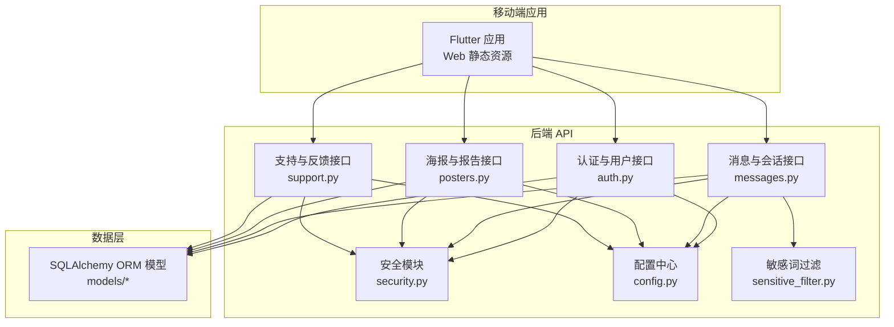
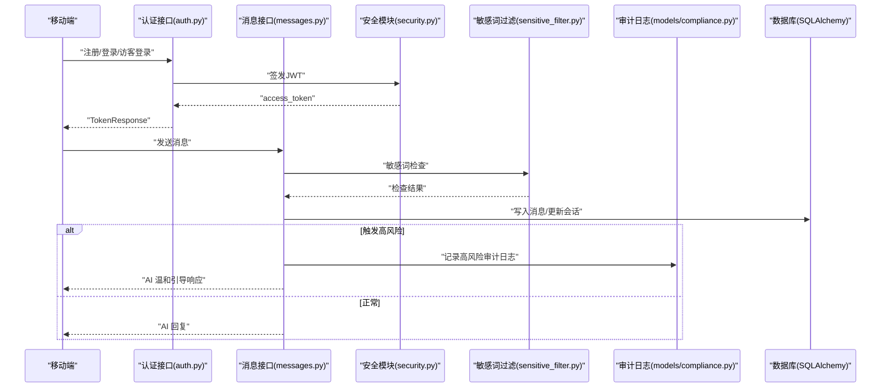
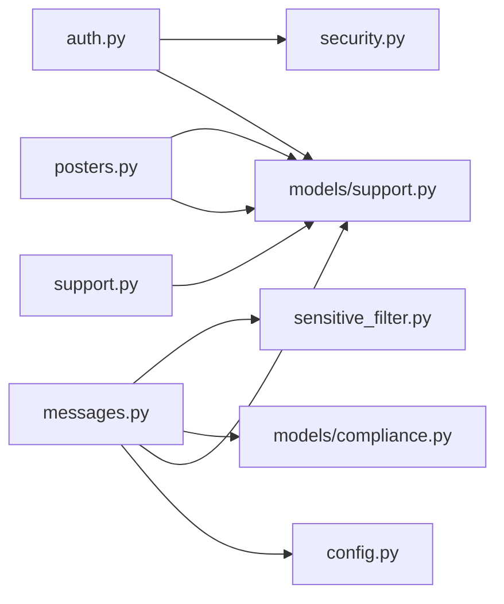

# 法律合规

<cite>
**本文引用的文件**
- [emo_outlet_api/app/models/compliance.py](file://emo_outlet_api/app/models/compliance.py)
- [emo_outlet_api/app/models/user.py](file://emo_outlet_api/app/models/user.py)
- [emo_outlet_api/app/models/message.py](file://emo_outlet_api/app/models/message.py)
- [emo_outlet_api/app/models/session.py](file://emo_outlet_api/app/models/session.py)
- [emo_outlet_api/app/models/target.py](file://emo_outlet_api/app/models/target.py)
- [emo_outlet_api/app/models/support.py](file://emo_outlet_api/app/models/support.py)
- [emo_outlet_api/app/schemas/user.py](file://emo_outlet_api/app/schemas/user.py)
- [emo_outlet_api/app/schemas/common.py](file://emo_outlet_api/app/schemas/common.py)
- [emo_outlet_api/app/api/auth.py](file://emo_outlet_api/app/api/auth.py)
- [emo_outlet_api/app/api/messages.py](file://emo_outlet_api/app/api/messages.py)
- [emo_outlet_api/app/api/posters.py](file://emo_outlet_api/app/api/posters.py)
- [emo_outlet_api/app/api/support.py](file://emo_outlet_api/app/api/support.py)
- [emo_outlet_api/app/utils/sensitive_filter.py](file://emo_outlet_api/app/utils/sensitive_filter.py)
- [emo_outlet_api/app/core/security.py](file://emo_outlet_api/app/core/security.py)
- [emo_outlet_api/app/config.py](file://emo_outlet_api/app/config.py)
</cite>

## 目录
1. [引言](#引言)
2. [项目结构](#项目结构)
3. [核心组件](#核心组件)
4. [架构总览](#架构总览)
5. [详细组件分析](#详细组件分析)
6. [依赖分析](#依赖分析)
7. [性能考虑](#性能考虑)
8. [故障排查指南](#故障排查指南)
9. [结论](#结论)
10. [附录](#附录)

## 引言
本文件面向 Emo Outlet 项目，围绕《中华人民共和国个人信息保护法》与相关配套制度，系统梳理平台在“合法性基础、目的限制、最小化原则、透明度义务”“未成年人保护”“内容监管合规”“跨境数据传输限制”“合规风险管理”等方面的现状与改进建议，并提供合规检查清单、法律意见书与合规审计报告模板索引，帮助项目在设计与运营阶段满足法律要求。

## 项目结构
Emo Outlet 采用前后端分离架构，移动端应用与后端 API 通过 REST 接口交互。后端 API 使用 FastAPI + SQLAlchemy，数据库为 MySQL/SQLite，Redis 用于缓存；前端使用 Flutter，Web 以静态资源形式部署。合规相关能力主要集中在后端 API 的认证授权、用户数据管理、内容敏感词过滤与审计日志、会话与消息生命周期管理等方面。

图表来源
- [emo_outlet_api/app/api/auth.py:1-318](file://emo_outlet_api/app/api/auth.py#L1-L318)
- [emo_outlet_api/app/api/messages.py:1-216](file://emo_outlet_api/app/api/messages.py#L1-L216)
- [emo_outlet_api/app/api/posters.py:1-383](file://emo_outlet_api/app/api/posters.py#L1-L383)
- [emo_outlet_api/app/api/support.py:1-71](file://emo_outlet_api/app/api/support.py#L1-L71)
- [emo_outlet_api/app/utils/sensitive_filter.py:1-142](file://emo_outlet_api/app/utils/sensitive_filter.py#L1-L142)
- [emo_outlet_api/app/core/security.py:1-43](file://emo_outlet_api/app/core/security.py#L1-L43)
- [emo_outlet_api/app/config.py:1-125](file://emo_outlet_api/app/config.py#L1-L125)

章节来源
- [emo_outlet_api/app/api/auth.py:1-318](file://emo_outlet_api/app/api/auth.py#L1-L318)
- [emo_outlet_api/app/api/messages.py:1-216](file://emo_outlet_api/app/api/messages.py#L1-L216)
- [emo_outlet_api/app/api/posters.py:1-383](file://emo_outlet_api/app/api/posters.py#L1-L383)
- [emo_outlet_api/app/api/support.py:1-71](file://emo_outlet_api/app/api/support.py#L1-L71)
- [emo_outlet_api/app/utils/sensitive_filter.py:1-142](file://emo_outlet_api/app/utils/sensitive_filter.py#L1-L142)
- [emo_outlet_api/app/core/security.py:1-43](file://emo_outlet_api/app/core/security.py#L1-L43)
- [emo_outlet_api/app/config.py:1-125](file://emo_outlet_api/app/config.py#L1-L125)

## 核心组件
- 用户与隐私：注册登录、访客登录、个人资料、隐私版本与同意记录、账号注销与数据导出。
- 内容与会话：消息发送与历史查询、会话状态与时长控制、敏感词检测与高风险干预、防沉迷与对话轮数限制。
- 审计与合规：内容审计日志、合规版本与策略、敏感词库与高风险模式、访问令牌签发与校验。
- 支持与反馈：在线客服概览、用户反馈收集与存储。

章节来源
- [emo_outlet_api/app/api/auth.py:34-318](file://emo_outlet_api/app/api/auth.py#L34-L318)
- [emo_outlet_api/app/api/messages.py:69-195](file://emo_outlet_api/app/api/messages.py#L69-L195)
- [emo_outlet_api/app/models/compliance.py:12-50](file://emo_outlet_api/app/models/compliance.py#L12-L50)
- [emo_outlet_api/app/config.py:94-114](file://emo_outlet_api/app/config.py#L94-L114)
- [emo_outlet_api/app/utils/sensitive_filter.py:1-142](file://emo_outlet_api/app/utils/sensitive_filter.py#L1-L142)
- [emo_outlet_api/app/api/support.py:21-71](file://emo_outlet_api/app/api/support.py#L21-L71)

## 架构总览
以下图展示用户在移动端发起请求后，后端如何调用安全、敏感词过滤与审计日志等模块，最终返回消息或生成海报的流程。

图表来源
- [emo_outlet_api/app/api/auth.py:34-118](file://emo_outlet_api/app/api/auth.py#L34-L118)
- [emo_outlet_api/app/api/messages.py:69-195](file://emo_outlet_api/app/api/messages.py#L69-L195)
- [emo_outlet_api/app/utils/sensitive_filter.py:74-119](file://emo_outlet_api/app/utils/sensitive_filter.py#L74-L119)
- [emo_outlet_api/app/models/compliance.py:31-49](file://emo_outlet_api/app/models/compliance.py#L31-L49)
- [emo_outlet_api/app/core/security.py:26-42](file://emo_outlet_api/app/core/security.py#L26-L42)

## 详细组件分析

### 个人信息保护法遵循要求
- 合法性基础与目的限制
  - 注册与登录接口明确仅用于提供情绪出口服务，符合“为订立、履行个人作为当事人的合同所必需”“为履行法定职责或法定义务所必需”等场景之一。
  - 用户资料字段与隐私版本字段存在，便于声明目的与范围。
- 最小化原则
  - 登录/注册请求仅接收必要字段；导出数据按会话聚合，避免冗余。
- 透明度义务
  - 注册时可传入 consent_version 字段，系统将记录隐私与条款同意记录；支持导出用户数据与删除账户，满足知情权与可携带权、删除权。

章节来源
- [emo_outlet_api/app/api/auth.py:34-74](file://emo_outlet_api/app/api/auth.py#L34-L74)
- [emo_outlet_api/app/api/auth.py:234-317](file://emo_outlet_api/app/api/auth.py#L234-L317)
- [emo_outlet_api/app/models/compliance.py:12-29](file://emo_outlet_api/app/models/compliance.py#L12-L29)
- [emo_outlet_api/app/schemas/user.py:8-16](file://emo_outlet_api/app/schemas/user.py#L8-L16)

### 未成年人保护措施
- 年龄验证与适龄控制
  - 用户模型包含 age_range 字段，注册时可传入；消息接口根据用户年龄动态调整对话轮数上限。
- 家长同意与内容适龄
  - 当前实现未见家长同意流程；建议补充家长绑定、监护人授权与内容分级策略。
- 防沉迷与高风险干预
  - 配置项支持不同年龄段每日会话上限与对话轮数上限；敏感词高风险触发时自动中断会话并返回温和引导语。

章节来源
- [emo_outlet_api/app/models/user.py:30-38](file://emo_outlet_api/app/models/user.py#L30-L38)
- [emo_outlet_api/app/config.py:97-107](file://emo_outlet_api/app/config.py#L97-L107)
- [emo_outlet_api/app/api/messages.py:140-164](file://emo_outlet_api/app/api/messages.py#L140-L164)
- [emo_outlet_api/app/utils/sensitive_filter.py:128-138](file://emo_outlet_api/app/utils/sensitive_filter.py#L128-L138)

### 内容监管合规
- 网络信息安全
  - 敏感词过滤模块基于 DFA 算法与高风险正则，实现 O(n) 匹配与高风险模式识别；支持温和引导响应。
- 青少年保护
  - 不同年龄段对话轮数上限；高风险内容触发时中断会话并记录审计日志。
- 违法不良信息处置
  - 审计日志记录匹配关键词、原始内容、处置动作与风险等级；支持全量采样。

章节来源
- [emo_outlet_api/app/utils/sensitive_filter.py:1-142](file://emo_outlet_api/app/utils/sensitive_filter.py#L1-L142)
- [emo_outlet_api/app/models/compliance.py:31-49](file://emo_outlet_api/app/models/compliance.py#L31-L49)
- [emo_outlet_api/app/config.py:108-111](file://emo_outlet_api/app/config.py#L108-L111)
- [emo_outlet_api/app/api/messages.py:96-127](file://emo_outlet_api/app/api/messages.py#L96-L127)

### 跨境数据传输限制
- 数据出境安全评估与标准合同
  - 当前未见数据出境评估流程与标准合同机制；建议在涉及跨境数据传输时，建立评估与审批流程，并签署标准合同。
- 境外调查配合
  - 建议在系统中预留“合规协助请求”通道与数据冻结/备份机制，确保在合法要求下可提供数据。

（本节为概念性建议，不直接对应具体源码）

### 合规风险管理
- 合规培训
  - 建议定期开展数据主体权利、敏感信息处理、未成年人保护等专题培训。
- 风险评估
  - 建立数据处理活动影响评估（DPIA）模板，覆盖注册/登录、消息/会话、海报生成、反馈收集等场景。
- 违规整改
  - 建立事件分级与处置流程，结合审计日志进行溯源与修复。

（本节为概念性建议，不直接对应具体源码）

## 依赖分析
- 组件耦合
  - 消息接口依赖敏感词过滤与审计日志；认证接口依赖安全模块签发令牌；海报接口依赖情绪分析与生成服务。
- 外部依赖
  - JWT 加密算法、密码哈希、AI 服务提供商配置、数据库连接、Redis 缓存。
- 潜在循环依赖
  - 当前模块间通过接口与模型解耦，未发现循环导入。

图表来源
- [emo_outlet_api/app/api/auth.py:1-318](file://emo_outlet_api/app/api/auth.py#L1-L318)
- [emo_outlet_api/app/api/messages.py:1-216](file://emo_outlet_api/app/api/messages.py#L1-L216)
- [emo_outlet_api/app/api/posters.py:1-383](file://emo_outlet_api/app/api/posters.py#L1-L383)
- [emo_outlet_api/app/api/support.py:1-71](file://emo_outlet_api/app/api/support.py#L1-L71)
- [emo_outlet_api/app/utils/sensitive_filter.py:1-142](file://emo_outlet_api/app/utils/sensitive_filter.py#L1-L142)
- [emo_outlet_api/app/core/security.py:1-43](file://emo_outlet_api/app/core/security.py#L1-L43)
- [emo_outlet_api/app/config.py:1-125](file://emo_outlet_api/app/config.py#L1-L125)
- [emo_outlet_api/app/models/user.py:1-52](file://emo_outlet_api/app/models/user.py#L1-L52)
- [emo_outlet_api/app/models/message.py:1-46](file://emo_outlet_api/app/models/message.py#L1-L46)
- [emo_outlet_api/app/models/session.py:1-79](file://emo_outlet_api/app/models/session.py#L1-L79)
- [emo_outlet_api/app/models/support.py:1-66](file://emo_outlet_api/app/models/support.py#L1-L66)

## 性能考虑
- 敏感词匹配
  - DFA 算法时间复杂度 O(n)，适合大规模文本；建议将敏感词库与高风险模式预编译，减少运行时开销。
- 会话与消息
  - 基于会话的消息序列号递增，避免全表扫描；建议对会话与消息表建立合适索引。
- 审计日志
  - 可配置采样率，降低高并发下的写入压力；建议异步落库或批量入库。

（本节为通用建议，不直接对应具体源码）

## 故障排查指南
- 注册失败（手机号/邮箱重复）
  - 检查用户模型唯一约束与注册接口重复判断逻辑。
- 登录失败（账号不存在或密码错误）
  - 检查密码哈希与校验流程。
- 消息发送异常
  - 检查敏感词过滤返回值、会话状态与轮数限制；确认审计日志是否正确写入。
- 数据导出/注销异常
  - 检查级联删除顺序与用户数据清理逻辑。

章节来源
- [emo_outlet_api/app/api/auth.py:39-47](file://emo_outlet_api/app/api/auth.py#L39-L47)
- [emo_outlet_api/app/api/auth.py:82-89](file://emo_outlet_api/app/api/auth.py#L82-L89)
- [emo_outlet_api/app/api/messages.py:76-79](file://emo_outlet_api/app/api/messages.py#L76-L79)
- [emo_outlet_api/app/api/messages.py:96-107](file://emo_outlet_api/app/api/messages.py#L96-L107)
- [emo_outlet_api/app/api/auth.py:206-231](file://emo_outlet_api/app/api/auth.py#L206-L231)

## 结论
Emo Outlet 在用户隐私、内容安全与未成年人保护方面已具备基础能力：同意记录、敏感词过滤与审计日志、会话与消息生命周期管理、防沉迷与高风险干预。建议下一步补齐家长同意流程、完善数据出境评估与标准合同机制、建立合规培训与风险评估体系，并持续优化审计与日志采样策略，确保项目在法律框架内稳健运营。

## 附录

### 合规检查清单（示例）
- 个人信息保护
  - 是否明确合法性基础与目的限制
  - 是否遵循最小化与透明度义务
  - 是否提供数据可携带权与删除权实现
- 未成年人保护
  - 是否实现年龄验证与内容适龄控制
  - 是否建立家长同意与监护人授权机制
  - 是否落实防沉迷与高风险干预
- 内容监管
  - 是否部署敏感词过滤与高风险识别
  - 是否记录审计日志并支持采样
  - 是否建立违法不良信息处置流程
- 跨境数据传输
  - 是否建立数据出境安全评估机制
  - 是否签署个人信息出境标准合同
  - 是否具备境外调查配合能力
- 合规管理
  - 是否开展合规培训与风险评估
  - 是否建立违规整改与事件处置流程

（本节为概念性清单，不直接对应具体源码）

### 法律意见书模板索引
- 个人信息保护法遵循评估
- 未成年人保护专项评估
- 内容监管与敏感词治理方案
- 跨境数据传输合规方案
- 合规培训与风险评估制度

（本节为概念性模板索引，不直接对应具体源码）

### 合规审计报告模板索引
- 数据处理活动清单与分类分级
- 敏感词库与高风险模式评估
- 审计日志采样与留存策略
- 事件处置与整改闭环记录
- 年度合规审计总结

（本节为概念性模板索引，不直接对应具体源码）