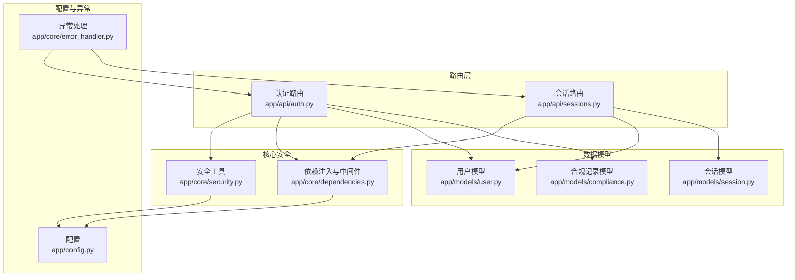
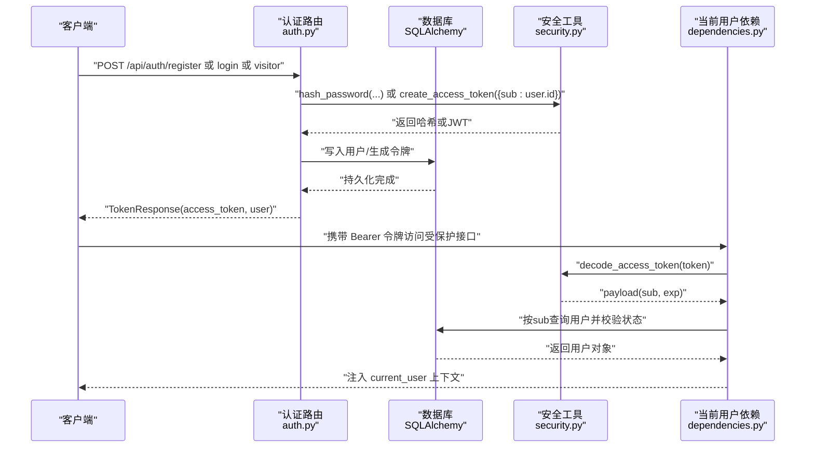
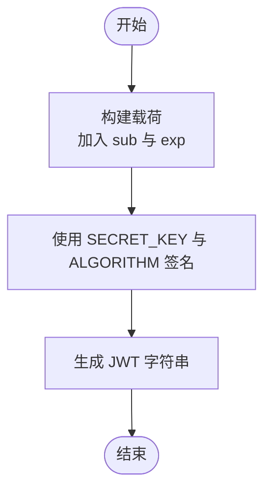
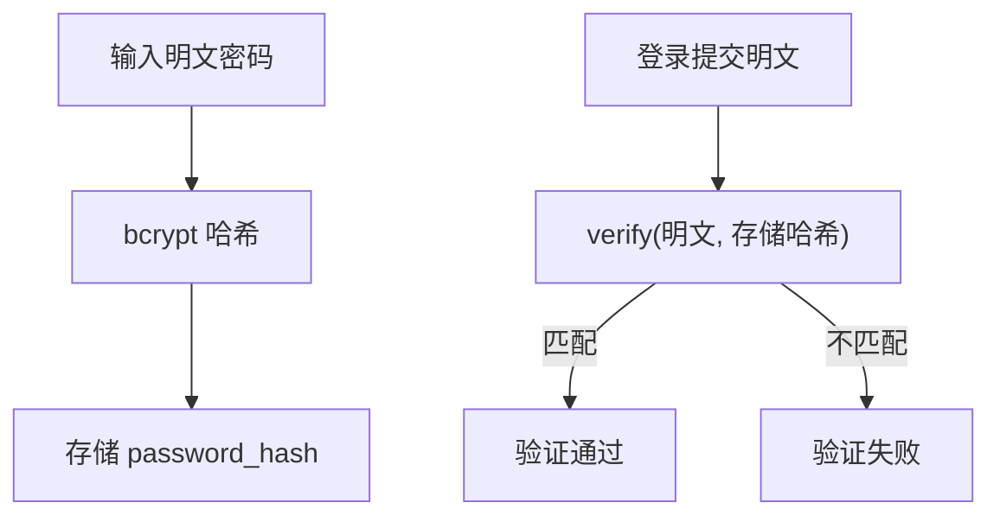
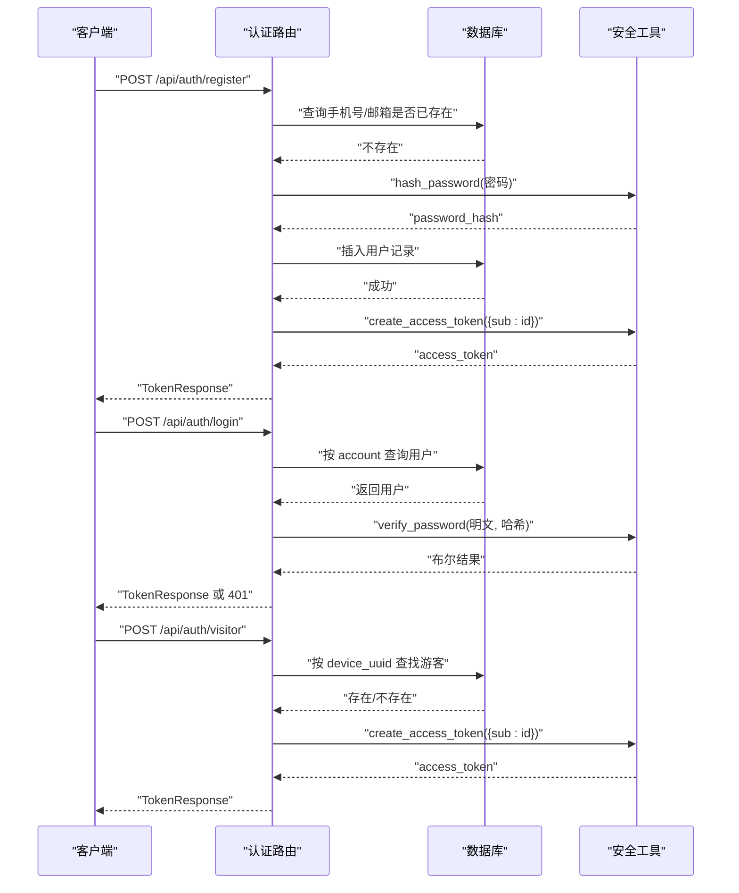
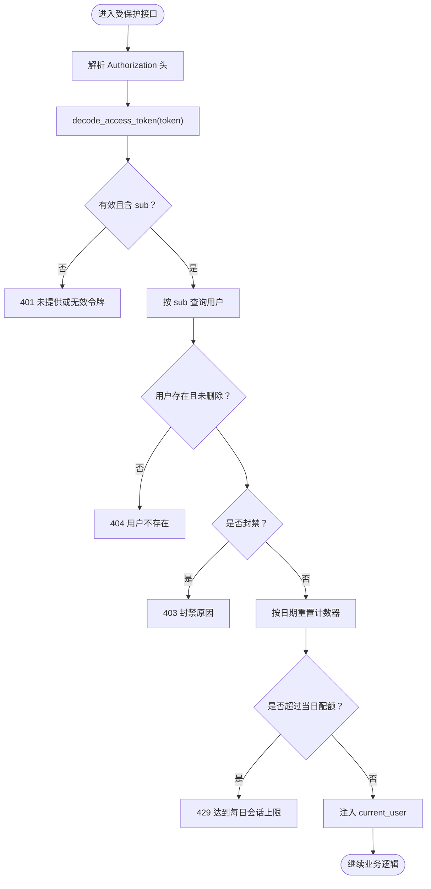
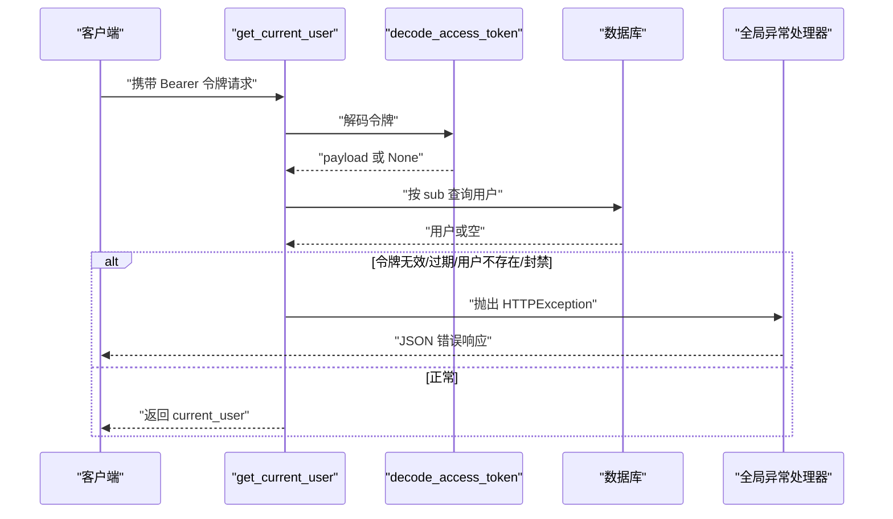
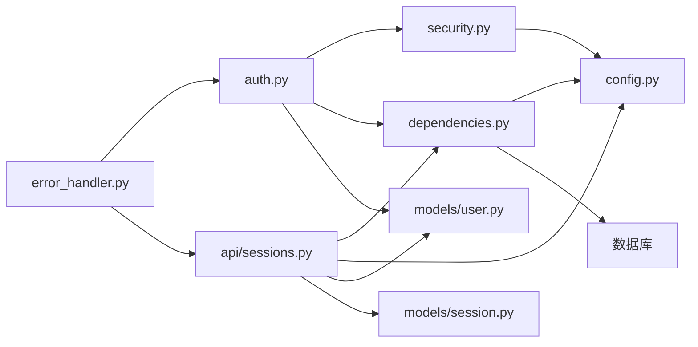

# 认证与授权

<cite>
**本文引用的文件**
- [emo_outlet_api/app/api/auth.py](file://emo_outlet_api/app/api/auth.py)
- [emo_outlet_api/app/core/security.py](file://emo_outlet_api/app/core/security.py)
- [emo_outlet_api/app/core/dependencies.py](file://emo_outlet_api/app/core/dependencies.py)
- [emo_outlet_api/app/models/user.py](file://emo_outlet_api/app/models/user.py)
- [emo_outlet_api/app/models/compliance.py](file://emo_outlet_api/app/models/compliance.py)
- [emo_outlet_api/app/models/session.py](file://emo_outlet_api/app/models/session.py)
- [emo_outlet_api/app/schemas/user.py](file://emo_outlet_api/app/schemas/user.py)
- [emo_outlet_api/app/schemas/common.py](file://emo_outlet_api/app/schemas/common.py)
- [emo_outlet_api/app/config.py](file://emo_outlet_api/app/config.py)
- [emo_outlet_api/app/main.py](file://emo_outlet_api/app/main.py)
- [emo_outlet_api/app/core/error_handler.py](file://emo_outlet_api/app/core/error_handler.py)
- [emo_outlet_api/app/api/sessions.py](file://emo_outlet_api/app/api/sessions.py)
</cite>

## 目录
1. [简介](#简介)
2. [项目结构](#项目结构)
3. [核心组件](#核心组件)
4. [架构总览](#架构总览)
5. [详细组件分析](#详细组件分析)
6. [依赖分析](#依赖分析)
7. [性能考虑](#性能考虑)
8. [故障排查指南](#故障排查指南)
9. [结论](#结论)
10. [附录](#附录)

## 简介
本文件系统性梳理 Emo Outlet 的认证与授权模块，覆盖以下主题：
- JWT 访问令牌的创建、签名、过期时间与解码验证
- 密码哈希存储方案（bcrypt）与验证流程
- 用户身份认证流程（手机号/邮箱注册登录、游客模式）
- 权限控制与访问限制（角色标记、每日会话配额）
- 认证中间件（令牌验证、用户上下文注入、异常处理）
- 配置项与安全最佳实践
- 常见问题与排障建议

## 项目结构
认证与授权相关代码主要分布在如下模块：
- 路由层：认证接口（注册、登录、游客登录、个人信息等）
- 核心安全：JWT 编解码、密码哈希与校验
- 依赖注入：当前用户解析、每日会话配额检查
- 数据模型：用户、会话、合规记录
- 配置：JWT 密钥、算法、过期时间、每日会话限额等
- 异常处理：统一错误响应

图表来源
- [emo_outlet_api/app/api/auth.py:1-332](file://emo_outlet_api/app/api/auth.py#L1-L332)
- [emo_outlet_api/app/api/sessions.py:60-220](file://emo_outlet_api/app/api/sessions.py#L60-L220)
- [emo_outlet_api/app/core/security.py:1-43](file://emo_outlet_api/app/core/security.py#L1-L43)
- [emo_outlet_api/app/core/dependencies.py:1-67](file://emo_outlet_api/app/core/dependencies.py#L1-L67)
- [emo_outlet_api/app/models/user.py:1-56](file://emo_outlet_api/app/models/user.py#L1-L56)
- [emo_outlet_api/app/models/session.py:1-79](file://emo_outlet_api/app/models/session.py#L1-L79)
- [emo_outlet_api/app/models/compliance.py:1-50](file://emo_outlet_api/app/models/compliance.py#L1-L50)
- [emo_outlet_api/app/config.py:1-125](file://emo_outlet_api/app/config.py#L1-L125)
- [emo_outlet_api/app/core/error_handler.py:1-59](file://emo_outlet_api/app/core/error_handler.py#L1-L59)

章节来源
- [emo_outlet_api/app/main.py:1-82](file://emo_outlet_api/app/main.py#L1-L82)
- [emo_outlet_api/app/config.py:54-61](file://emo_outlet_api/app/config.py#L54-L61)

## 核心组件
- JWT 工具：密码哈希、令牌创建与解码
- 当前用户依赖：从 Authorization 头解析令牌，查询用户并注入上下文
- 用户模型：包含基础信息、合规字段与管理员标记
- 会话模型：绑定用户与目标，记录状态与情绪分析结果
- 合规记录：记录隐私与条款同意版本与元信息
- 配置：密钥、算法、过期时间、每日会话限额等

章节来源
- [emo_outlet_api/app/core/security.py:16-43](file://emo_outlet_api/app/core/security.py#L16-L43)
- [emo_outlet_api/app/core/dependencies.py:18-51](file://emo_outlet_api/app/core/dependencies.py#L18-L51)
- [emo_outlet_api/app/models/user.py:14-56](file://emo_outlet_api/app/models/user.py#L14-L56)
- [emo_outlet_api/app/models/session.py:13-79](file://emo_outlet_api/app/models/session.py#L13-L79)
- [emo_outlet_api/app/models/compliance.py:12-29](file://emo_outlet_api/app/models/compliance.py#L12-L29)
- [emo_outlet_api/app/config.py:54-101](file://emo_outlet_api/app/config.py#L54-L101)

## 架构总览
认证与授权的整体交互流程如下：

图表来源
- [emo_outlet_api/app/api/auth.py:33-120](file://emo_outlet_api/app/api/auth.py#L33-L120)
- [emo_outlet_api/app/core/security.py:16-43](file://emo_outlet_api/app/core/security.py#L16-L43)
- [emo_outlet_api/app/core/dependencies.py:18-51](file://emo_outlet_api/app/core/dependencies.py#L18-L51)

## 详细组件分析

### JWT 令牌认证机制
- 令牌创建
  - 载荷包含用户标识（sub），附加过期时间（exp）
  - 使用配置中的密钥与算法进行签名
- 令牌解码与验证
  - 解码时使用相同密钥与算法
  - 捕获解码异常并判定为无效
- 过期时间
  - 通过配置项设置过期分钟数，转换为 timedelta

图表来源
- [emo_outlet_api/app/core/security.py:26-31](file://emo_outlet_api/app/core/security.py#L26-L31)
- [emo_outlet_api/app/config.py:55-61](file://emo_outlet_api/app/config.py#L55-L61)

章节来源
- [emo_outlet_api/app/core/security.py:26-43](file://emo_outlet_api/app/core/security.py#L26-L43)
- [emo_outlet_api/app/config.py:54-61](file://emo_outlet_api/app/config.py#L54-L61)

### 密码哈希与验证
- 存储方案
  - 使用 bcrypt 对明文密码进行哈希后存储
- 验证流程
  - 登录时使用哈希函数校验明文与存储值
- 安全策略
  - 不存储明文；采用强默认参数的 bcrypt

图表来源
- [emo_outlet_api/app/core/security.py:16-24](file://emo_outlet_api/app/core/security.py#L16-L24)
- [emo_outlet_api/app/api/auth.py:89](file://emo_outlet_api/app/api/auth.py#L89)

章节来源
- [emo_outlet_api/app/core/security.py:16-24](file://emo_outlet_api/app/core/security.py#L16-L24)
- [emo_outlet_api/app/api/auth.py:89](file://emo_outlet_api/app/api/auth.py#L89)

### 用户身份认证流程
- 注册
  - 校验手机号/邮箱唯一性
  - 生成随机昵称（若未提供）
  - 写入用户记录与可选的合规记录
  - 生成访问令牌返回
- 登录
  - 支持以手机号或邮箱作为账户名
  - 校验密码哈希
  - 生成访问令牌返回
- 游客模式
  - 依据设备 UUID 查找或创建游客用户
  - 生成访问令牌返回
- 个人信息管理
  - 获取与更新基本信息
  - 获取与更新详情表（签名、性别、生日、地区等）

图表来源
- [emo_outlet_api/app/api/auth.py:33-120](file://emo_outlet_api/app/api/auth.py#L33-L120)
- [emo_outlet_api/app/core/security.py:16-31](file://emo_outlet_api/app/core/security.py#L16-L31)

章节来源
- [emo_outlet_api/app/api/auth.py:33-120](file://emo_outlet_api/app/api/auth.py#L33-L120)
- [emo_outlet_api/app/schemas/user.py:8-26](file://emo_outlet_api/app/schemas/user.py#L8-L26)

### 权限控制与访问限制
- 角色与状态
  - 用户模型包含管理员标记与封禁状态
  - 封禁用户在解析当前用户时被拒绝
- 访问控制
  - 受保护接口通过依赖注入获取 current_user
  - 未提供令牌、令牌无效或过期、用户不存在或被封禁均触发错误
- 每日会话配额
  - 按年龄段与游客身份设置不同上限
  - 首次访问当日重置计数器
  - 超限时返回 429 Too Many Requests

图表来源
- [emo_outlet_api/app/core/dependencies.py:18-51](file://emo_outlet_api/app/core/dependencies.py#L18-L51)
- [emo_outlet_api/app/config.py:97-101](file://emo_outlet_api/app/config.py#L97-L101)
- [emo_outlet_api/app/api/sessions.py:67-78](file://emo_outlet_api/app/api/sessions.py#L67-L78)

章节来源
- [emo_outlet_api/app/core/dependencies.py:18-51](file://emo_outlet_api/app/core/dependencies.py#L18-L51)
- [emo_outlet_api/app/config.py:97-101](file://emo_outlet_api/app/config.py#L97-L101)
- [emo_outlet_api/app/api/sessions.py:67-78](file://emo_outlet_api/app/api/sessions.py#L67-L78)

### 认证中间件与异常处理
- 中间件
  - 使用 HTTP Bearer 从 Authorization 头提取令牌
  - 解码并校验有效性，注入 current_user
- 异常处理
  - 统一包装 500、HTTP 异常与参数校验错误
  - 返回标准化错误响应结构

图表来源
- [emo_outlet_api/app/core/dependencies.py:18-51](file://emo_outlet_api/app/core/dependencies.py#L18-L51)
- [emo_outlet_api/app/core/error_handler.py:10-59](file://emo_outlet_api/app/core/error_handler.py#L10-L59)

章节来源
- [emo_outlet_api/app/core/dependencies.py:18-51](file://emo_outlet_api/app/core/dependencies.py#L18-L51)
- [emo_outlet_api/app/core/error_handler.py:10-59](file://emo_outlet_api/app/core/error_handler.py#L10-L59)

## 依赖分析
- 组件耦合
  - 认证路由依赖安全工具与依赖注入
  - 依赖注入依赖配置与数据库
  - 会话模块复用当前用户依赖与配置
- 外部依赖
  - JWT 编解码、密码哈希
  - SQLAlchemy ORM 与异步会话
  - FastAPI 中间件与异常处理

图表来源
- [emo_outlet_api/app/api/auth.py:1-332](file://emo_outlet_api/app/api/auth.py#L1-L332)
- [emo_outlet_api/app/core/security.py:1-43](file://emo_outlet_api/app/core/security.py#L1-L43)
- [emo_outlet_api/app/core/dependencies.py:1-67](file://emo_outlet_api/app/core/dependencies.py#L1-L67)
- [emo_outlet_api/app/models/user.py:1-56](file://emo_outlet_api/app/models/user.py#L1-L56)
- [emo_outlet_api/app/models/session.py:1-79](file://emo_outlet_api/app/models/session.py#L1-L79)
- [emo_outlet_api/app/config.py:1-125](file://emo_outlet_api/app/config.py#L1-L125)
- [emo_outlet_api/app/core/error_handler.py:1-59](file://emo_outlet_api/app/core/error_handler.py#L1-L59)
- [emo_outlet_api/app/api/sessions.py:60-220](file://emo_outlet_api/app/api/sessions.py#L60-L220)

章节来源
- [emo_outlet_api/app/api/auth.py:1-332](file://emo_outlet_api/app/api/auth.py#L1-L332)
- [emo_outlet_api/app/core/security.py:1-43](file://emo_outlet_api/app/core/security.py#L1-L43)
- [emo_outlet_api/app/core/dependencies.py:1-67](file://emo_outlet_api/app/core/dependencies.py#L1-L67)
- [emo_outlet_api/app/models/user.py:1-56](file://emo_outlet_api/app/models/user.py#L1-L56)
- [emo_outlet_api/app/models/session.py:1-79](file://emo_outlet_api/app/models/session.py#L1-L79)
- [emo_outlet_api/app/config.py:1-125](file://emo_outlet_api/app/config.py#L1-L125)
- [emo_outlet_api/app/core/error_handler.py:1-59](file://emo_outlet_api/app/core/error_handler.py#L1-L59)
- [emo_outlet_api/app/api/sessions.py:60-220](file://emo_outlet_api/app/api/sessions.py#L60-L220)

## 性能考虑
- 令牌解码为 O(1) 操作，成本极低
- 密码哈希采用 bcrypt，默认参数已平衡安全性与性能
- 每日会话计数仅在首次访问或跨日时重置，避免频繁写入
- 建议
  - 在高并发场景下，确保数据库连接池配置合理
  - 对频繁调用的受保护接口，尽量减少不必要的字段加载（已使用惰性加载策略）

## 故障排查指南
- 401 未提供或无效令牌
  - 检查请求头是否包含 Bearer 令牌
  - 确认令牌未过期、密钥与算法一致
- 404 用户不存在
  - 确认 sub 对应的用户是否存在且未被删除
- 403 账号被封禁
  - 检查用户封禁状态与封禁原因
- 429 达到每日会话上限
  - 检查用户类型与年龄段对应的配额
  - 确认当日计数器是否正确重置
- 参数校验失败
  - 关注统一错误响应中的字段与消息
- 服务器内部错误
  - 查看统一异常处理器返回的错误码与描述

章节来源
- [emo_outlet_api/app/core/dependencies.py:22-43](file://emo_outlet_api/app/core/dependencies.py#L22-L43)
- [emo_outlet_api/app/api/sessions.py:67-78](file://emo_outlet_api/app/api/sessions.py#L67-L78)
- [emo_outlet_api/app/core/error_handler.py:21-51](file://emo_outlet_api/app/core/error_handler.py#L21-L51)

## 结论
本认证与授权模块以 JWT 为核心，结合 bcrypt 密码哈希与严格的用户状态校验，提供了完整的注册/登录/游客模式支持。通过配置化的令牌过期时间与每日会话配额，实现了灵活的安全策略。依赖注入与异常处理保证了接口的一致性与可维护性。

## 附录

### 认证配置指南
- 必填项
  - SECRET_KEY：生产环境必须替换为强密钥
  - ALGORITHM：建议使用 HS256
  - ACCESS_TOKEN_EXPIRE_MINUTES：根据业务需求调整
- 安全相关
  - MAX_DAILY_SESSIONS_*：针对不同用户群体设置合理上限
  - ENABLE_AUDIT_LOG：启用审计日志以追踪敏感操作

章节来源
- [emo_outlet_api/app/config.py:54-101](file://emo_outlet_api/app/config.py#L54-L101)

### 安全最佳实践
- 生产环境务必更换默认密钥与算法
- 严格限制令牌有效期，避免长期有效令牌
- 对外部暴露的接口统一使用 Bearer 令牌校验
- 定期清理过期令牌与历史审计日志
- 对敏感字段（如手机号、邮箱）进行最小化存储与传输加密

### 常见问题解答
- 如何切换第三方登录？
  - 当前代码未包含第三方登录实现，可在认证路由中扩展相应流程，并在用户模型中增加第三方标识字段
- 如何实现管理员权限？
  - 可在用户模型中使用管理员标记字段，并在依赖注入中增加管理员校验逻辑
- 如何导出用户数据？
  - 认证模块提供数据导出接口，可按需扩展导出范围与格式