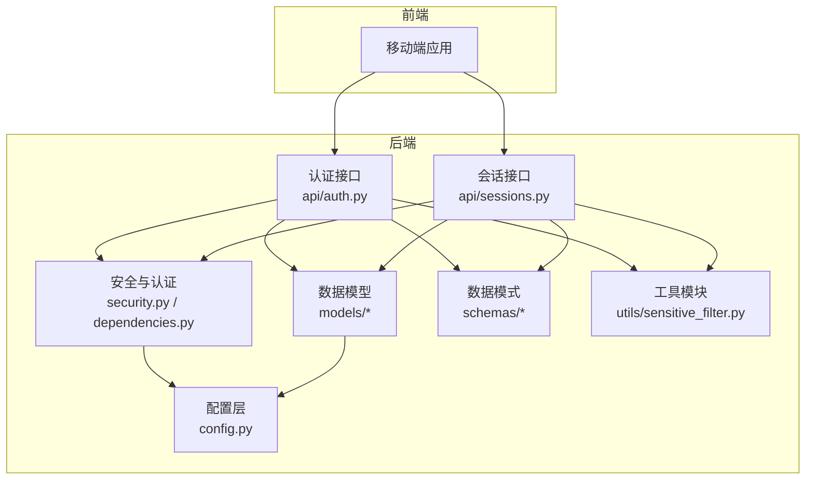
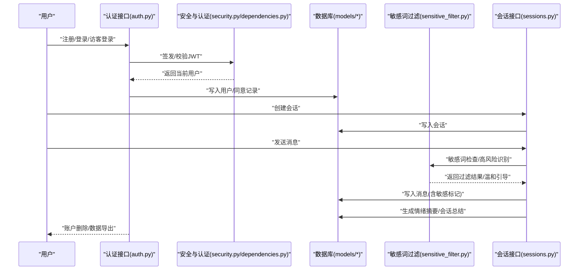
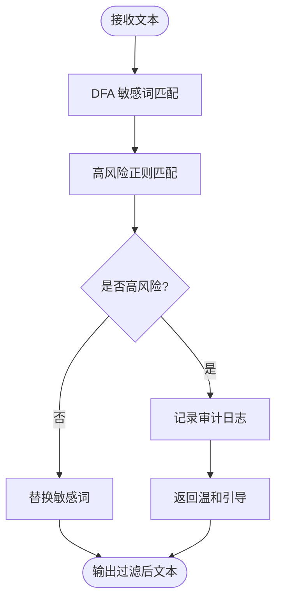
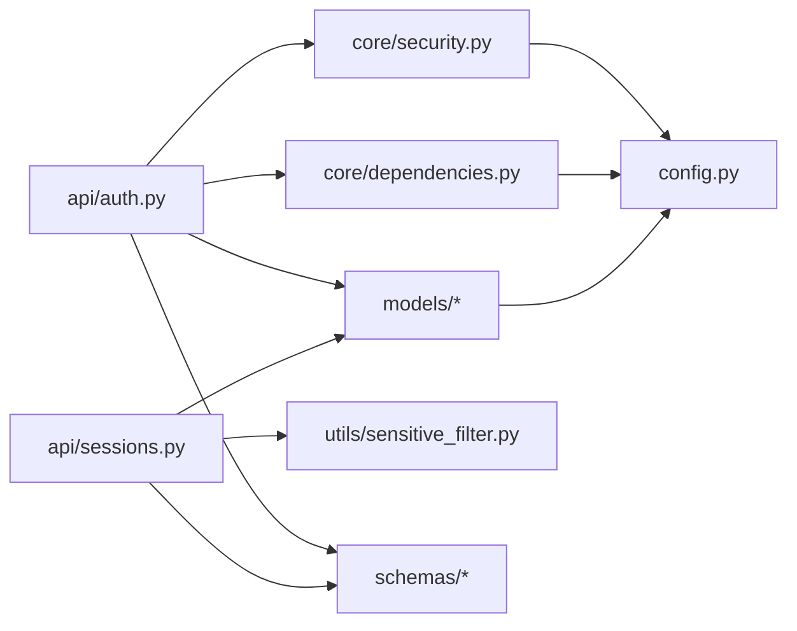

# 隐私保护

<cite>
**本文引用的文件**
- [emo_outlet_api/app/models/user.py](file://emo_outlet_api/app/models/user.py)
- [emo_outlet_api/app/models/compliance.py](file://emo_outlet_api/app/models/compliance.py)
- [emo_outlet_api/app/models/session.py](file://emo_outlet_api/app/models/session.py)
- [emo_outlet_api/app/models/message.py](file://emo_outlet_api/app/models/message.py)
- [emo_outlet_api/app/models/support.py](file://emo_outlet_api/app/models/support.py)
- [emo_outlet_api/app/schemas/user.py](file://emo_outlet_api/app/schemas/user.py)
- [emo_outlet_api/app/schemas/common.py](file://emo_outlet_api/app/schemas/common.py)
- [emo_outlet_api/app/schemas/message.py](file://emo_outlet_api/app/schemas/message.py)
- [emo_outlet_api/app/schemas/session.py](file://emo_outlet_api/app/schemas/session.py)
- [emo_outlet_api/app/api/auth.py](file://emo_outlet_api/app/api/auth.py)
- [emo_outlet_api/app/api/sessions.py](file://emo_outlet_api/app/api/sessions.py)
- [emo_outlet_api/app/core/security.py](file://emo_outlet_api/app/core/security.py)
- [emo_outlet_api/app/core/dependencies.py](file://emo_outlet_api/app/core/dependencies.py)
- [emo_outlet_api/app/utils/sensitive_filter.py](file://emo_outlet_api/app/utils/sensitive_filter.py)
- [emo_outlet_api/app/config.py](file://emo_outlet_api/app/config.py)
</cite>

## 目录
1. [引言](#引言)
2. [项目结构](#项目结构)
3. [核心组件](#核心组件)
4. [架构总览](#架构总览)
5. [详细组件分析](#详细组件分析)
6. [依赖分析](#依赖分析)
7. [性能考虑](#性能考虑)
8. [故障排查指南](#故障排查指南)
9. [结论](#结论)
10. [附录](#附录)

## 引言
本文件面向 Emo Outlet 项目，围绕“隐私保护”主题，系统梳理用户数据最小化收集、数据去标识化与匿名化、用户权利保障、数据生命周期管理、跨境数据传输限制、隐私政策实施以及隐私影响评估与合规检查清单等要点。文档以代码库为依据，结合现有实现与可扩展设计，提出可落地的隐私保护实践建议。

## 项目结构
Emo Outlet 采用前后端分离架构，移动端应用负责交互与展示，后端 API 提供认证授权、会话管理、消息处理与合规审计能力。隐私相关的关键实现分布在以下层次：
- 配置层：集中定义合规版本、会话配额、审计开关等策略
- 安全与认证：JWT 令牌签发与校验、密码哈希与校验
- 数据模型层：用户、会话、消息、合规记录、用户详情等
- 接口层：认证注册/登录/访客登录、个人资料维护、账户删除、数据导出
- 工具层：敏感词过滤与高风险提示

图表来源
- [emo_outlet_api/app/config.py:12-125](file://emo_outlet_api/app/config.py#L12-L125)
- [emo_outlet_api/app/core/security.py:1-43](file://emo_outlet_api/app/core/security.py#L1-L43)
- [emo_outlet_api/app/core/dependencies.py:1-67](file://emo_outlet_api/app/core/dependencies.py#L1-L67)
- [emo_outlet_api/app/api/auth.py:1-318](file://emo_outlet_api/app/api/auth.py#L1-L318)
- [emo_outlet_api/app/api/sessions.py:1-220](file://emo_outlet_api/app/api/sessions.py#L1-L220)
- [emo_outlet_api/app/utils/sensitive_filter.py:1-142](file://emo_outlet_api/app/utils/sensitive_filter.py#L1-L142)

章节来源
- [emo_outlet_api/app/config.py:12-125](file://emo_outlet_api/app/config.py#L12-L125)
- [emo_outlet_api/app/core/security.py:1-43](file://emo_outlet_api/app/core/security.py#L1-L43)
- [emo_outlet_api/app/core/dependencies.py:1-67](file://emo_outlet_api/app/core/dependencies.py#L1-L67)
- [emo_outlet_api/app/api/auth.py:1-318](file://emo_outlet_api/app/api/auth.py#L1-L318)
- [emo_outlet_api/app/api/sessions.py:1-220](file://emo_outlet_api/app/api/sessions.py#L1-L220)
- [emo_outlet_api/app/utils/sensitive_filter.py:1-142](file://emo_outlet_api/app/utils/sensitive_filter.py#L1-L142)

## 核心组件
- 用户模型与隐私字段
  - 用户表包含昵称、手机号、邮箱、头像、设备 UUID、年龄区间、是否访客、是否封禁、是否管理员、同意版本等字段；同时具备软删除标记与活跃状态
  - 该设计支持最小化收集：仅在用户自愿提供时存储手机号/邮箱，并通过设备 UUID 实现非强身份绑定
- 合规与审计
  - 同意记录表记录用户对隐私政策与服务条款的同意行为，包含版本、IP、UA 等上下文
  - 内容审计日志记录敏感内容检测、风险等级、处置动作等
- 会话与消息
  - 会话模型记录模式、方言、时长、状态、情绪摘要等；消息模型记录发送方、方言、情绪类型与强度、是否敏感等
  - 消息内容在进入系统前由敏感词过滤模块处理，高风险内容触发温和引导与审计
- 认证与访问控制
  - JWT 令牌签发与校验，配合当前用户解析与每日会话配额控制
- 数据导出与删除
  - 提供账户数据导出接口，按会话聚合消息与目标等数据
  - 提供账户删除接口，级联清理会话、消息、海报、目标、同意记录与用户详情，并对用户关键字段进行清空与软删除标记

章节来源
- [emo_outlet_api/app/models/user.py:12-52](file://emo_outlet_api/app/models/user.py#L12-L52)
- [emo_outlet_api/app/models/compliance.py:12-50](file://emo_outlet_api/app/models/compliance.py#L12-L50)
- [emo_outlet_api/app/models/session.py:13-79](file://emo_outlet_api/app/models/session.py#L13-L79)
- [emo_outlet_api/app/models/message.py:13-46](file://emo_outlet_api/app/models/message.py#L13-L46)
- [emo_outlet_api/app/api/auth.py:34-318](file://emo_outlet_api/app/api/auth.py#L34-L318)
- [emo_outlet_api/app/api/sessions.py:50-220](file://emo_outlet_api/app/api/sessions.py#L50-L220)
- [emo_outlet_api/app/utils/sensitive_filter.py:37-142](file://emo_outlet_api/app/utils/sensitive_filter.py#L37-L142)

## 架构总览
下图展示了用户从注册/访客登录到会话、消息、敏感词过滤与审计日志的端到端流程。

图表来源
- [emo_outlet_api/app/api/auth.py:34-318](file://emo_outlet_api/app/api/auth.py#L34-L318)
- [emo_outlet_api/app/api/sessions.py:50-220](file://emo_outlet_api/app/api/sessions.py#L50-L220)
- [emo_outlet_api/app/core/security.py:26-43](file://emo_outlet_api/app/core/security.py#L26-L43)
- [emo_outlet_api/app/core/dependencies.py:18-67](file://emo_outlet_api/app/core/dependencies.py#L18-L67)
- [emo_outlet_api/app/utils/sensitive_filter.py:74-139](file://emo_outlet_api/app/utils/sensitive_filter.py#L74-L139)

## 详细组件分析

### 用户数据最小化收集与去标识化
- 最小化收集
  - 注册请求允许仅提供昵称与密码，手机号/邮箱为可选项；访客登录仅需设备 UUID
  - 年龄区间与同意版本为可选字段，便于后续合规追踪
- 去标识化
  - 用户主键使用 UUID，避免顺序 ID 泄露；手机号/邮箱与头像等字段在导出时可选择性屏蔽
  - 设备 UUID 用于会话配额控制，不强制要求强身份绑定
- 匿名化
  - 访客登录默认匿名昵称，且可进一步在导出时对非必要字段清空

章节来源
- [emo_outlet_api/app/schemas/user.py:8-26](file://emo_outlet_api/app/schemas/user.py#L8-L26)
- [emo_outlet_api/app/api/auth.py:95-119](file://emo_outlet_api/app/api/auth.py#L95-L119)
- [emo_outlet_api/app/models/user.py:15-28](file://emo_outlet_api/app/models/user.py#L15-L28)

### 用户权利保障机制
- 数据访问权
  - 提供“导出我的数据”接口，按会话聚合消息、目标、海报等，便于用户自行下载
- 更正权
  - 提供更新个人资料与详情接口，支持昵称、头像、个性签名、性别、生日、地区等字段变更
- 删除权
  - 提供账户删除接口，级联清理会话、消息、海报、目标、同意记录与用户详情，并对关键字段清空与软删除标记
- 数据可携带权
  - 导出接口返回结构化 JSON，便于用户迁移至其他平台

章节来源
- [emo_outlet_api/app/api/auth.py:206-232](file://emo_outlet_api/app/api/auth.py#L206-L232)
- [emo_outlet_api/app/api/auth.py:234-318](file://emo_outlet_api/app/api/auth.py#L234-L318)
- [emo_outlet_api/app/api/auth.py:126-204](file://emo_outlet_api/app/api/auth.py#L126-L204)
- [emo_outlet_api/app/models/session.py:16-75](file://emo_outlet_api/app/models/session.py#L16-L75)
- [emo_outlet_api/app/models/message.py:16-42](file://emo_outlet_api/app/models/message.py#L16-L42)

### 数据生命周期管理
- 保留期限
  - 当前代码未显式设置统一的数据保留期限；建议在配置层新增保留天数参数
- 自动清理机制
  - 会话与消息按业务逻辑在完成/中断后生成摘要；建议引入定时任务清理超期未完成会话与历史消息
- 永久删除流程
  - 账户删除接口执行多表级联清理与字段清空，并标记软删除；建议补充硬删除与不可恢复确认

章节来源
- [emo_outlet_api/app/api/auth.py:206-232](file://emo_outlet_api/app/api/auth.py#L206-L232)
- [emo_outlet_api/app/config.py:94-111](file://emo_outlet_api/app/config.py#L94-L111)

### 跨境数据传输限制
- 数据本地化
  - 配置层支持多供应商 AI 服务与对象存储，建议在生产环境启用本地化部署或合规的第三方服务
- 传输安全保障
  - 使用 HTTPS 与 JWT 令牌；建议在跨域场景启用 CORS 白名单与安全头
- 合规审查
  - 建议建立数据出境清单与影响评估流程，确保满足监管要求

章节来源
- [emo_outlet_api/app/config.py:63-87](file://emo_outlet_api/app/config.py#L63-L87)

### 隐私政策实施
- 透明度报告
  - 建议定期发布数据处理活动与合规状态的公开报告
- 用户同意管理
  - 同意记录表记录版本、IP、UA 等上下文；建议在前端展示同意版本与时间戳
- 数据处理登记
  - 建议在系统内维护数据处理活动清单与处理目的、范围、期限

章节来源
- [emo_outlet_api/app/models/compliance.py:12-29](file://emo_outlet_api/app/models/compliance.py#L12-L29)

### 敏感内容处理与审计
- 敏感词过滤
  - 基于 DFA 的 O(n) 匹配与高风险正则组合，支持最长匹配与温和引导
- 审计日志
  - 内容审计日志记录用户 ID、会话 ID、风险等级、匹配关键词、处置动作等
- 风险处置
  - 高风险触发时返回温和引导语句，同时记录审计日志

图表来源
- [emo_outlet_api/app/utils/sensitive_filter.py:74-139](file://emo_outlet_api/app/utils/sensitive_filter.py#L74-L139)
- [emo_outlet_api/app/models/compliance.py:31-50](file://emo_outlet_api/app/models/compliance.py#L31-L50)

## 依赖分析
- 组件耦合
  - 认证接口依赖安全模块与数据库模型；会话接口依赖情绪分析服务与消息模型
  - 敏感词过滤独立于业务流程，通过函数调用注入
- 外部依赖
  - JWT、密码哈希、SQLAlchemy ORM、异步数据库驱动、AI 服务提供商 SDK
- 潜在循环依赖
  - 当前模块间无明显循环导入；建议保持工具模块无业务依赖

图表来源
- [emo_outlet_api/app/api/auth.py:10-31](file://emo_outlet_api/app/api/auth.py#L10-L31)
- [emo_outlet_api/app/api/sessions.py:10-25](file://emo_outlet_api/app/api/sessions.py#L10-L25)
- [emo_outlet_api/app/core/security.py:7-13](file://emo_outlet_api/app/core/security.py#L7-L13)
- [emo_outlet_api/app/core/dependencies.py:5-13](file://emo_outlet_api/app/core/dependencies.py#L5-L13)
- [emo_outlet_api/app/utils/sensitive_filter.py:37-52](file://emo_outlet_api/app/utils/sensitive_filter.py#L37-L52)
- [emo_outlet_api/app/config.py:12-125](file://emo_outlet_api/app/config.py#L12-L125)

## 性能考虑
- 敏感词匹配
  - DFA 构建 Trie 树，匹配复杂度 O(n)，适合高频文本处理；建议缓存常用词库与编译后的正则
- 会话与消息
  - 分页查询与延迟加载减少一次性数据量；建议对大字段使用分页或懒加载
- 审计日志
  - 可配置采样率与批量写入，降低对主业务的影响

章节来源
- [emo_outlet_api/app/utils/sensitive_filter.py:54-73](file://emo_outlet_api/app/utils/sensitive_filter.py#L54-L73)
- [emo_outlet_api/app/api/sessions.py:102-121](file://emo_outlet_api/app/api/sessions.py#L102-L121)
- [emo_outlet_api/app/config.py:108-111](file://emo_outlet_api/app/config.py#L108-L111)

## 故障排查指南
- 认证失败
  - 检查令牌格式与有效期；确认用户未被封禁或软删除
- 会话配额超限
  - 检查每日会话计数与年龄区间阈值；确认跨天重置逻辑
- 敏感词误判
  - 调整敏感词库与高风险正则；核对过滤后文本与温和引导是否正确返回
- 数据导出异常
  - 核对会话与消息关联关系；确认导出字段映射与时间序列排序

章节来源
- [emo_outlet_api/app/core/dependencies.py:18-51](file://emo_outlet_api/app/core/dependencies.py#L18-L51)
- [emo_outlet_api/app/api/sessions.py:67-78](file://emo_outlet_api/app/api/sessions.py#L67-L78)
- [emo_outlet_api/app/utils/sensitive_filter.py:102-139](file://emo_outlet_api/app/utils/sensitive_filter.py#L102-L139)
- [emo_outlet_api/app/api/auth.py:234-318](file://emo_outlet_api/app/api/auth.py#L234-L318)

## 结论
Emo Outlet 在隐私保护方面已具备基础能力：最小化收集、同意记录、敏感词过滤与审计日志、账户删除与数据导出。建议进一步完善数据保留期限、自动清理与永久删除流程、跨境传输合规与透明度报告，并在配置层增加生命周期策略与合规参数，形成闭环的隐私治理体系。

## 附录

### 隐私影响评估（PIA）清单
- 数据类型与用途
  - 明确收集的个人信息与处理目的（如会话分析、内容审核）
- 最小化与去标识化
  - 是否仅收集必要信息；是否使用 UUID 与设备标识替代强身份
- 用户权利
  - 是否提供访问、更正、删除、可携带权的实现与入口
- 安全与审计
  - 是否启用 HTTPS、JWT、敏感词过滤与审计日志
- 生命周期管理
  - 是否定义保留期限、清理策略与删除流程
- 跨境传输
  - 是否满足本地化与合规审查要求
- 透明度与同意
  - 是否记录同意版本、IP、UA，并在前端展示

### 合规检查清单
- 配置层
  - 新增数据保留天数、审计采样率、合规版本等参数
- 接口层
  - 补充硬删除确认、导出字段脱敏、删除后不可逆提示
- 工具层
  - 增加敏感词库热更新与误判上报
- 文档与培训
  - 更新隐私政策与用户协议；对运营与技术团队开展合规培训