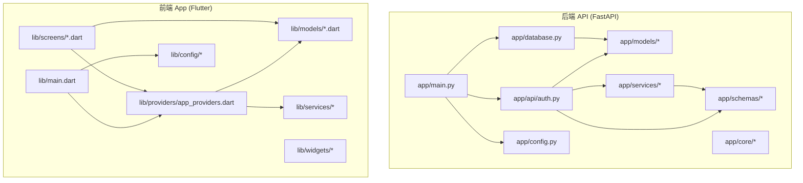
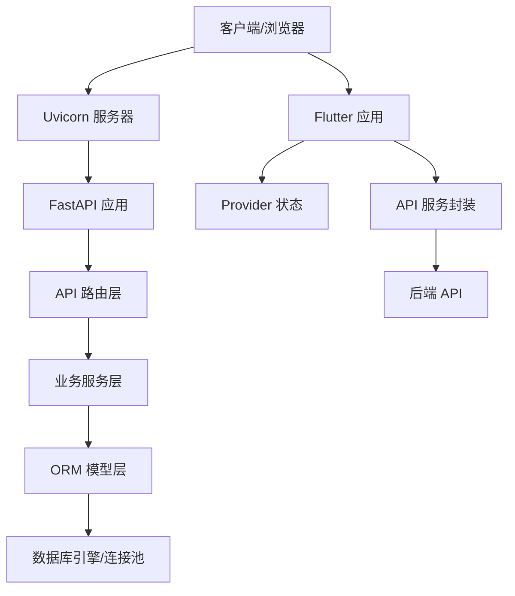
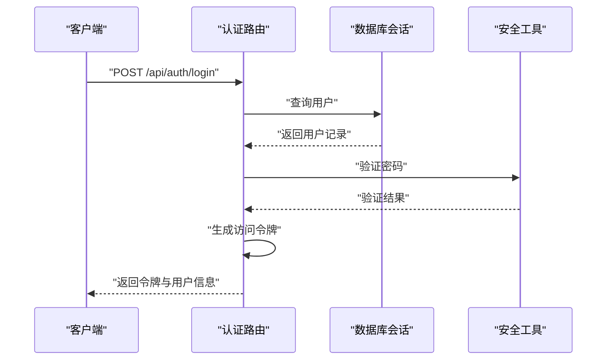
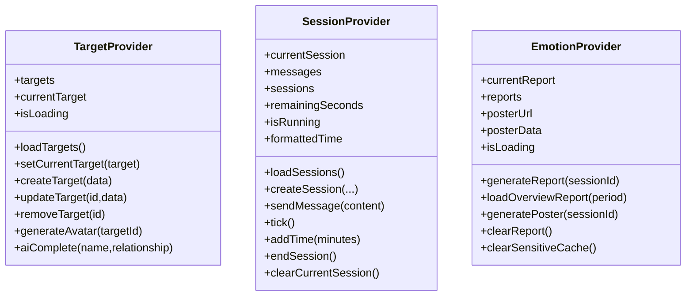
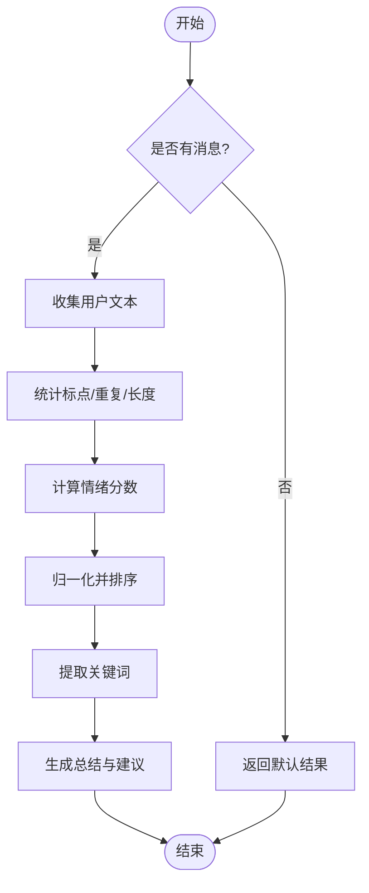
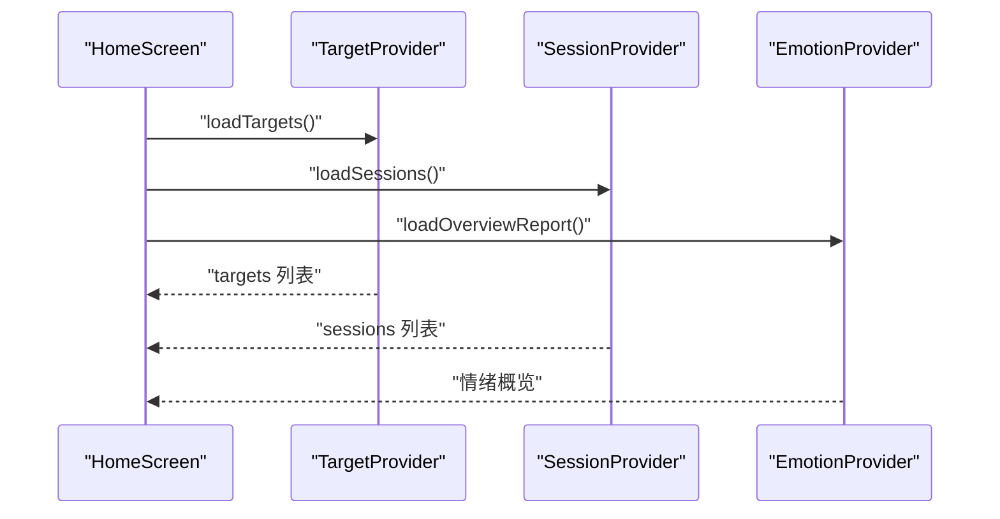
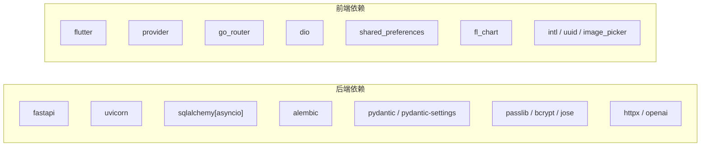

# 代码规范与最佳实践

<cite>
**本文引用的文件**
- [emo_outlet_api/requirements.txt](file://emo_outlet_api/requirements.txt)
- [emo_outlet_api/setup.cfg](file://emo_outlet_api/setup.cfg)
- [emo_outlet_api/run.py](file://emo_outlet_api/run.py)
- [emo_outlet_api/alembic.ini](file://emo_outlet_api/alembic.ini)
- [emo_outlet_api/app/main.py](file://emo_outlet_api/app/main.py)
- [emo_outlet_api/app/config.py](file://emo_outlet_api/app/config.py)
- [emo_outlet_api/app/database.py](file://emo_outlet_api/app/database.py)
- [emo_outlet_api/app/api/auth.py](file://emo_outlet_api/app/api/auth.py)
- [emo_outlet_api/app/models/user.py](file://emo_outlet_api/app/models/user.py)
- [emo_outlet_api/app/schemas/user.py](file://emo_outlet_api/app/schemas/user.py)
- [emo_outlet_api/app/services/emotion_service.py](file://emo_outlet_api/app/services/emotion_service.py)
- [emo_outlet_app/pubspec.yaml](file://emo_outlet_app/pubspec.yaml)
- [emo_outlet_app/analysis_options.yaml](file://emo_outlet_app/analysis_options.yaml)
- [emo_outlet_app/lib/main.dart](file://emo_outlet_app/lib/main.dart)
- [emo_outlet_app/lib/providers/app_providers.dart](file://emo_outlet_app/lib/providers/app_providers.dart)
- [emo_outlet_app/lib/models/target_model.dart](file://emo_outlet_app/lib/models/target_model.dart)
- [emo_outlet_app/lib/screens/home_screen.dart](file://emo_outlet_app/lib/screens/home_screen.dart)
</cite>

## 目录
1. [引言](#引言)
2. [项目结构](#项目结构)
3. [核心组件](#核心组件)
4. [架构总览](#架构总览)
5. [详细组件分析](#详细组件分析)
6. [依赖关系分析](#依赖关系分析)
7. [性能考虑](#性能考虑)
8. [故障排查指南](#故障排查指南)
9. [结论](#结论)
10. [附录](#附录)

## 引言
本文件为 Emo Outlet 项目的代码规范与最佳实践文档，覆盖后端 FastAPI 与前端 Flutter/Dart 的风格规范、项目结构、注释与文档标准、代码格式化与静态分析工具配置、以及质量检查与性能分析建议。目标是在保证一致性的同时提升可维护性与可读性。

## 项目结构
- 后端采用 FastAPI + SQLAlchemy Async + Alembic 的分层结构：路由/API 层、业务服务层、数据模型与 Pydantic Schema 层、数据库连接与生命周期管理、安全与异常处理。
- 前端采用 Flutter + Provider 的响应式状态管理模式，按功能域组织 providers、models、screens、services、widgets、config 等目录。

图表来源
- [emo_outlet_api/app/main.py:1-82](file://emo_outlet_api/app/main.py#L1-L82)
- [emo_outlet_api/app/config.py:1-125](file://emo_outlet_api/app/config.py#L1-L125)
- [emo_outlet_api/app/database.py:1-43](file://emo_outlet_api/app/database.py#L1-L43)
- [emo_outlet_api/app/api/auth.py:1-332](file://emo_outlet_api/app/api/auth.py#L1-L332)
- [emo_outlet_api/app/models/user.py:1-56](file://emo_outlet_api/app/models/user.py#L1-L56)
- [emo_outlet_api/app/schemas/user.py:1-74](file://emo_outlet_api/app/schemas/user.py#L1-L74)
- [emo_outlet_api/app/services/emotion_service.py:1-181](file://emo_outlet_api/app/services/emotion_service.py#L1-L181)
- [emo_outlet_app/lib/main.dart:1-97](file://emo_outlet_app/lib/main.dart#L1-L97)
- [emo_outlet_app/lib/providers/app_providers.dart:1-416](file://emo_outlet_app/lib/providers/app_providers.dart#L1-L416)

章节来源
- [emo_outlet_api/app/main.py:1-82](file://emo_outlet_api/app/main.py#L1-L82)
- [emo_outlet_app/lib/main.dart:1-97](file://emo_outlet_app/lib/main.dart#L1-L97)

## 核心组件
- 后端入口与中间件：应用生命周期管理、CORS、请求日志中间件、健康检查端点。
- 配置系统：Pydantic Settings 统一加载环境变量与默认值，支持数据库、Redis、JWT、AI 服务、合规与安全参数。
- 数据库层：SQLAlchemy Async 引擎、会话工厂、Base ORM 基类与依赖注入的异步会话提供器。
- 认证与用户：用户模型、Schema、认证路由（注册/登录/访客登录/资料维护/数据导出/注销）。
- 业务服务：情绪分析服务，基于关键词与统计特征计算情绪得分与摘要建议。
- 前端入口与主题：MultiProvider 注入多个 Provider，MaterialApp 主题与导航。
- Provider 状态：TargetProvider、SessionProvider、EmotionProvider 的 CRUD、异步交互与降级策略。
- 屏幕与组件：首页聚合卡片、底部导航、按钮与卡片组件组合。

章节来源
- [emo_outlet_api/app/main.py:14-82](file://emo_outlet_api/app/main.py#L14-L82)
- [emo_outlet_api/app/config.py:12-125](file://emo_outlet_api/app/config.py#L12-L125)
- [emo_outlet_api/app/database.py:10-43](file://emo_outlet_api/app/database.py#L10-L43)
- [emo_outlet_api/app/api/auth.py:33-332](file://emo_outlet_api/app/api/auth.py#L33-L332)
- [emo_outlet_api/app/models/user.py:14-56](file://emo_outlet_api/app/models/user.py#L14-L56)
- [emo_outlet_api/app/schemas/user.py:8-74](file://emo_outlet_api/app/schemas/user.py#L8-L74)
- [emo_outlet_api/app/services/emotion_service.py:44-181](file://emo_outlet_api/app/services/emotion_service.py#L44-L181)
- [emo_outlet_app/lib/main.dart:18-96](file://emo_outlet_app/lib/main.dart#L18-L96)
- [emo_outlet_app/lib/providers/app_providers.dart:10-416](file://emo_outlet_app/lib/providers/app_providers.dart#L10-L416)

## 架构总览
后端通过 Uvicorn 运行，FastAPI 路由挂载各模块；数据库通过 SQLAlchemy Async 进行 ORM 映射；认证与安全通过 Pydantic Settings 与依赖注入实现；前端通过 Provider 管理状态，API 调用封装在服务层，屏幕负责 UI 组合与交互。

图表来源
- [emo_outlet_api/app/main.py:23-63](file://emo_outlet_api/app/main.py#L23-L63)
- [emo_outlet_api/app/database.py:10-15](file://emo_outlet_api/app/database.py#L10-L15)
- [emo_outlet_app/lib/main.dart:18-96](file://emo_outlet_app/lib/main.dart#L18-L96)
- [emo_outlet_app/lib/providers/app_providers.dart:10-416](file://emo_outlet_app/lib/providers/app_providers.dart#L10-L416)

## 详细组件分析

### 后端：认证与用户模块
- 路由前缀与标签统一管理，便于文档生成与维护。
- 使用 Pydantic Schema 进行请求/响应校验与序列化。
- 依赖注入获取数据库会话与当前用户，确保业务逻辑与数据访问分离。
- 提供访客登录、资料详情读取与更新、账户注销与数据导出等完整流程。

图表来源
- [emo_outlet_api/app/api/auth.py:78-93](file://emo_outlet_api/app/api/auth.py#L78-L93)
- [emo_outlet_api/app/database.py:22-31](file://emo_outlet_api/app/database.py#L22-L31)
- [emo_outlet_api/app/config.py:55-61](file://emo_outlet_api/app/config.py#L55-L61)

章节来源
- [emo_outlet_api/app/api/auth.py:30-332](file://emo_outlet_api/app/api/auth.py#L30-L332)
- [emo_outlet_api/app/schemas/user.py:8-74](file://emo_outlet_api/app/schemas/user.py#L8-L74)
- [emo_outlet_api/app/models/user.py:14-56](file://emo_outlet_api/app/models/user.py#L14-L56)

### 前端：Provider 状态管理与异步交互
- TargetProvider：目标列表加载、当前目标切换、创建/更新/删除、AI 生成头像与补全。
- SessionProvider：历史会话加载、创建会话（含模式/方言/时长）、发送消息与 AI 回复、倒计时与结束会话。
- EmotionProvider：生成情绪报告与海报、周期性报告、清理敏感缓存。
- 所有网络调用均包含降级策略（Mock），保证离线或后端异常时可用性。

图表来源
- [emo_outlet_app/lib/providers/app_providers.dart:10-416](file://emo_outlet_app/lib/providers/app_providers.dart#L10-L416)

章节来源
- [emo_outlet_app/lib/providers/app_providers.dart:10-416](file://emo_outlet_app/lib/providers/app_providers.dart#L10-L416)

### 情绪分析服务
- 基于关键词集合与停用词进行统计评分，结合标点与文本长度进行权重调整。
- 输出主要情绪、情绪分布、强度、关键词、总结与建议。
- 提供空输入保护与默认结果，保证健壮性。

图表来源
- [emo_outlet_api/app/services/emotion_service.py:44-181](file://emo_outlet_api/app/services/emotion_service.py#L44-L181)

章节来源
- [emo_outlet_api/app/services/emotion_service.py:1-181](file://emo_outlet_api/app/services/emotion_service.py#L1-L181)

### 前端：首页与导航
- 首页聚合卡片、功能入口卡片、底部导航与页面切换。
- 初始化时加载目标、会话与情绪概览，并根据当前用户昵称动态展示。

图表来源
- [emo_outlet_app/lib/screens/home_screen.dart:37-42](file://emo_outlet_app/lib/screens/home_screen.dart#L37-L42)
- [emo_outlet_app/lib/providers/app_providers.dart:158-174](file://emo_outlet_app/lib/providers/app_providers.dart#L158-L174)
- [emo_outlet_app/lib/providers/app_providers.dart:365-379](file://emo_outlet_app/lib/providers/app_providers.dart#L365-L379)

章节来源
- [emo_outlet_app/lib/screens/home_screen.dart:19-63](file://emo_outlet_app/lib/screens/home_screen.dart#L19-L63)

## 依赖关系分析
- 后端依赖：FastAPI、Uvicorn、SQLAlchemy Async、Alembic、Pydantic/Settings、Passlib/Bcrypt、HTTPX、OpenAI 等。
- 前端依赖：Flutter SDK、Provider、go_router、dio、shared_preferences、fl_chart、intl、uuid、image_picker 等。
- 依赖版本与忽略项在 requirements.txt 与 pubspec.yaml 中明确；.gitignore 在 setup.cfg 中集中管理。

图表来源
- [emo_outlet_api/requirements.txt:4-29](file://emo_outlet_api/requirements.txt#L4-L29)
- [emo_outlet_app/pubspec.yaml:9-41](file://emo_outlet_app/pubspec.yaml#L9-L41)

章节来源
- [emo_outlet_api/requirements.txt:1-29](file://emo_outlet_api/requirements.txt#L1-L29)
- [emo_outlet_app/pubspec.yaml:1-52](file://emo_outlet_app/pubspec.yaml#L1-L52)
- [emo_outlet_api/setup.cfg:6-17](file://emo_outlet_api/setup.cfg#L6-L17)

## 性能考虑
- 后端
  - 使用 SQLAlchemy Async 减少阻塞，合理设置连接池与超时。
  - 会话自动提交/回滚与关闭，避免资源泄漏。
  - 路由层尽量减少 ORM 查询次数，批量操作与延迟加载配合使用。
- 前端
  - Provider 状态粒度控制，避免过度 notify 导致重绘。
  - 列表渲染使用惰性布局与固定宽高比，降低布局抖动。
  - 网络请求失败时使用本地 Mock 降级，保证用户体验。

## 故障排查指南
- 后端
  - 健康检查端点用于快速判断服务状态。
  - CORS 配置允许跨域访问，便于前后端联调。
  - 数据库初始化在 lifespan 中执行，确保连接正确建立与释放。
- 前端
  - Provider 状态变更通过 notifyListeners 触发重建，注意避免在回调中频繁刷新。
  - 网络异常时回退到 Mock 数据，定位问题时可对比后端接口与前端映射。

章节来源
- [emo_outlet_api/app/main.py:66-82](file://emo_outlet_api/app/main.py#L66-L82)
- [emo_outlet_api/app/main.py:42-48](file://emo_outlet_api/app/main.py#L42-L48)
- [emo_outlet_api/app/database.py:34-43](file://emo_outlet_api/app/database.py#L34-L43)
- [emo_outlet_app/lib/providers/app_providers.dart:21-38](file://emo_outlet_app/lib/providers/app_providers.dart#L21-L38)
- [emo_outlet_app/lib/providers/app_providers.dart:194-201](file://emo_outlet_app/lib/providers/app_providers.dart#L194-L201)

## 结论
本规范文档基于现有代码实现总结了项目风格与最佳实践，建议在后续迭代中持续完善测试与文档，确保团队协作一致性和代码质量稳定提升。

## 附录

### Python 代码风格与规范
- PEP8 基础
  - 缩进：使用 4 空格；行宽不超过 100 字符；模块导入分组与空行分隔。
  - 变量与函数：使用 snake_case；常量使用 UPPER_CASE；私有成员以下划线前缀。
  - 类命名：使用 PascalCase；方法与属性遵循 snake_case。
  - 注释：函数/类使用三引号 docstring；行内注释与代码至少 2 空格间隔。
- FastAPI 项目结构
  - 路由按功能模块划分；每个模块包含 router、schema、service、model。
  - 依赖注入统一从 core 或 utils 获取；异常处理集中注册。
- 变量命名与函数定义
  - 请求/响应使用明确的 Pydantic 模型；函数职责单一，参数与返回类型标注清晰。
- 类设计原则
  - ORM 模型继承统一基类；关系定义清晰；避免 N+1 查询。
- 注释与文档
  - 模块顶部添加模块级 docstring；复杂函数补充用途、参数、返回值与异常说明。
  - API 文档通过 FastAPI 自动生成，保持路由与 Schema 一致性。
- 代码格式化与静态分析
  - Black：统一缩进与排版；建议在 pre-commit 钩子中启用。
  - isort：按标准库、第三方、本地模块顺序排序导入。
  - flake8：结合 E/W 规则与行宽限制；PyCharm/VSCode 可直接集成。
  - mypy：可选的类型检查，建议在 CI 中启用。
- 代码质量与覆盖率
  - 建议引入 pytest + coverage.py，关键路径与异常分支覆盖率达到 80%+。
  - CI 中集成 lint、类型检查与覆盖率报告。
- 性能分析
  - 后端：使用 cProfile/line_profiler 分析热点函数；数据库慢查询日志开启。
  - 前端：DevTools Timeline/Performance 面板分析帧率与重绘；Provider 通知频率监控。

章节来源
- [emo_outlet_api/app/main.py:1-82](file://emo_outlet_api/app/main.py#L1-L82)
- [emo_outlet_api/app/config.py:1-125](file://emo_outlet_api/app/config.py#L1-L125)
- [emo_outlet_api/app/database.py:1-43](file://emo_outlet_api/app/database.py#L1-L43)
- [emo_outlet_api/app/api/auth.py:1-332](file://emo_outlet_api/app/api/auth.py#L1-L332)
- [emo_outlet_api/app/schemas/user.py:1-74](file://emo_outlet_api/app/schemas/user.py#L1-L74)
- [emo_outlet_api/app/models/user.py:1-56](file://emo_outlet_api/app/models/user.py#L1-L56)
- [emo_outlet_api/app/services/emotion_service.py:1-181](file://emo_outlet_api/app/services/emotion_service.py#L1-L181)

### Flutter/Dart 编码标准
- 文件与目录
  - 按功能域组织：providers、models、screens、services、widgets、config。
  - main.dart 作为应用入口，集中初始化 Provider 与主题。
- Widget 命名
  - 组件类使用 PascalCase；内部状态类以 _ 前缀区分。
- 状态管理
  - 使用 Provider 将状态与 UI 解耦；ChangeNotifier 仅在必要时 notify。
  - 屏幕内状态尽量下沉至局部状态，避免全局污染。
- Provider 使用模式
  - MultiProvider 统一注入；使用 read/watch 控制监听范围。
  - 异步操作在 Provider 内部完成，暴露简洁的业务方法。
- 异步编程最佳实践
  - 使用 async/await；错误捕获后提供降级方案（Mock）。
  - 避免在构建函数中执行耗时操作；使用 FutureBuilder 或初始化回调。
- 注释与文档
  - 类与公共方法添加注释；复杂逻辑在关键步骤添加说明。
- 代码格式化与静态分析
  - dartfmt：统一格式；建议在 IDE 中启用保存即格式化。
  - flutter_lints：基于官方推荐规则，避免冗余打印、缺失 key 等问题。
- 代码质量与覆盖率
  - 单元测试与 Widget 测试覆盖核心逻辑；集成测试覆盖关键流程。
  - CI 中运行 flutter analyze、flutter test 并生成覆盖率报告。
- 性能分析
  - 使用 DevTools 分析内存、CPU 与帧率；避免不必要的 rebuild。

章节来源
- [emo_outlet_app/lib/main.dart:1-97](file://emo_outlet_app/lib/main.dart#L1-L97)
- [emo_outlet_app/lib/providers/app_providers.dart:1-416](file://emo_outlet_app/lib/providers/app_providers.dart#L1-L416)
- [emo_outlet_app/lib/screens/home_screen.dart:1-325](file://emo_outlet_app/lib/screens/home_screen.dart#L1-L325)
- [emo_outlet_app/pubspec.yaml:1-52](file://emo_outlet_app/pubspec.yaml#L1-L52)
- [emo_outlet_app/analysis_options.yaml:1-9](file://emo_outlet_app/analysis_options.yaml#L1-L9)

### 工具配置与使用建议
- 后端
  - Black：pip install black；black . --exclude="venv/"
  - isort：pip install isort；isort . --profile=black
  - flake8：pip install flake8；flake8 . --max-line-length=100
  - mypy（可选）：pip install mypy；mypy .
  - Alembic：修改 alembic.ini 中 sqlalchemy.url 与日志级别；使用 alembic revision --autogenerate 管理迁移。
- 前端
  - dartfmt：dart format .
  - flutter analyze：flutter analyze
  - flutter test：flutter test；flutter test --coverage
  - flutter_lints：analysis_options.yaml 已包含官方规则集。

章节来源
- [emo_outlet_api/alembic.ini:1-38](file://emo_outlet_api/alembic.ini#L1-L38)
- [emo_outlet_api/run.py:1-31](file://emo_outlet_api/run.py#L1-L31)
- [emo_outlet_app/analysis_options.yaml:1-9](file://emo_outlet_app/analysis_options.yaml#L1-L9)