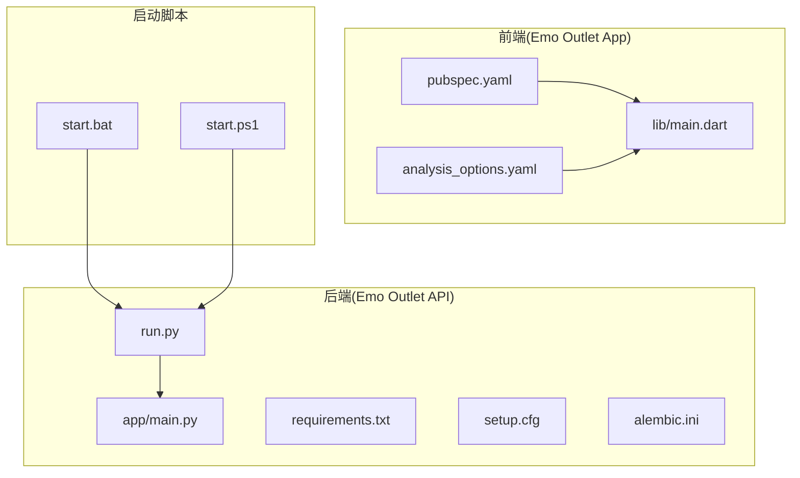
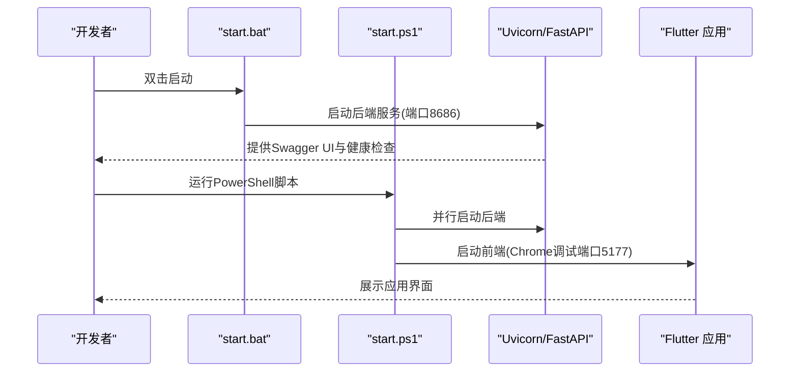
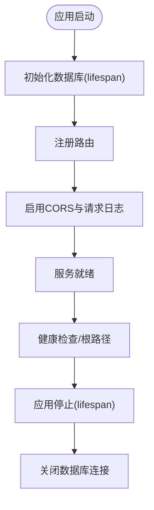
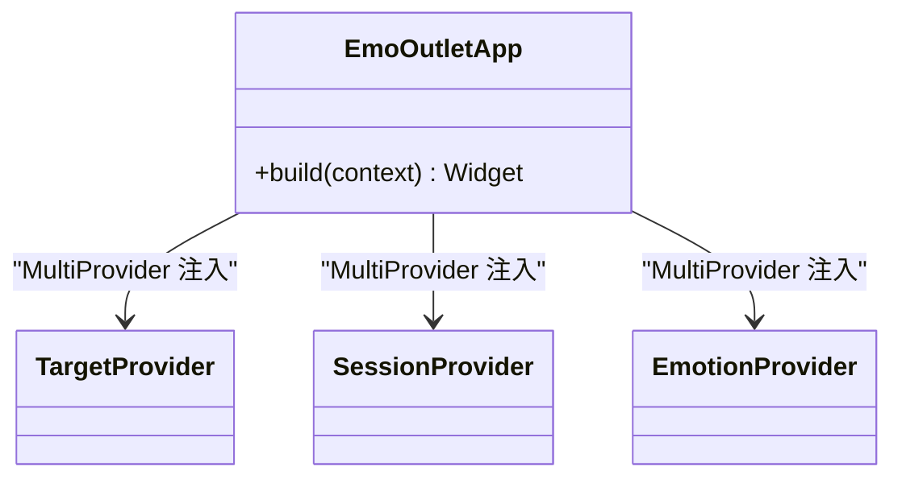
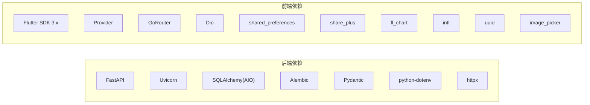
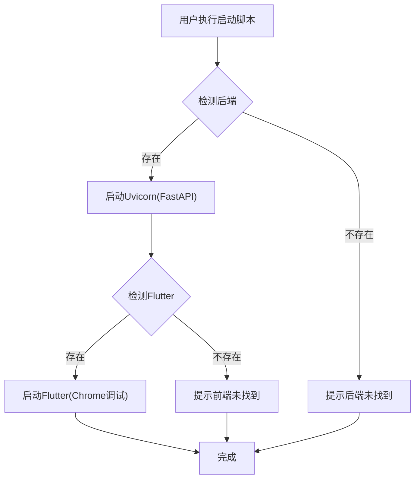
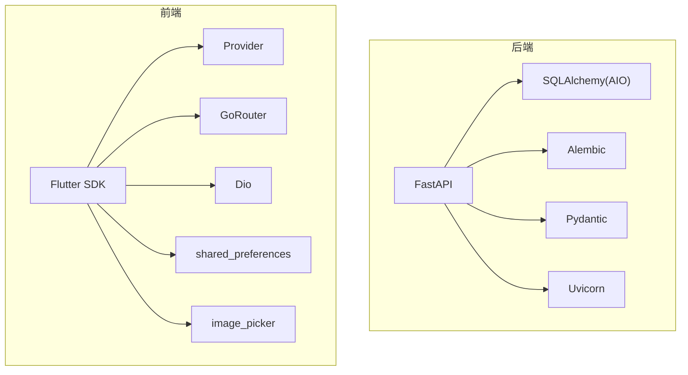

# 开发工具与配置

<cite>
**本文引用的文件**
- [emo_outlet_api/setup.cfg](file://emo_outlet_api/setup.cfg)
- [emo_outlet_api/requirements.txt](file://emo_outlet_api/requirements.txt)
- [emo_outlet_api/run.py](file://emo_outlet_api/run.py)
- [emo_outlet_api/app/main.py](file://emo_outlet_api/app/main.py)
- [emo_outlet_api/alembic.ini](file://emo_outlet_api/alembic.ini)
- [emo_outlet_app/pubspec.yaml](file://emo_outlet_app/pubspec.yaml)
- [emo_outlet_app/analysis_options.yaml](file://emo_outlet_app/analysis_options.yaml)
- [emo_outlet_app/lib/main.dart](file://emo_outlet_app/lib/main.dart)
- [start.bat](file://start.bat)
- [start.ps1](file://start.ps1)
</cite>

## 目录
1. [简介](#简介)
2. [项目结构](#项目结构)
3. [核心组件](#核心组件)
4. [架构总览](#架构总览)
5. [详细组件分析](#详细组件分析)
6. [依赖分析](#依赖分析)
7. [性能考虑](#性能考虑)
8. [故障排查指南](#故障排查指南)
9. [结论](#结论)
10. [附录](#附录)

## 简介
本文件面向Emo Outlet项目的开发与配置，聚焦以下方面：
- IDE与编辑器配置：VS Code、Android Studio、IntelliJ IDEA的插件推荐、快捷键与工作区设置建议
- 调试工具：Python调试器pdb、Flutter DevTools、Postman API测试、数据库管理工具的配置与使用
- 静态分析：flake8、pylint、dartanalyzer、ESLint的规则定制与集成
- 代码格式化：pre-commit钩子、GitHub Actions自动格式化与团队统一规范
- 依赖管理：Python虚拟环境、Flutter SDK版本管理、包依赖锁定与版本兼容性检查
- 性能分析：内存分析、CPU性能监控、网络请求分析与用户体验指标收集

本文件以仓库中现有配置文件为基础，结合实际代码结构给出可操作的配置建议与最佳实践。

## 项目结构
Emo Outlet采用前后端分离架构：
- 后端：基于FastAPI的Python应用，包含数据库迁移工具Alembic、依赖清单requirements.txt与项目配置setup.cfg
- 前端：基于Flutter的移动/Web应用，包含依赖清单pubspec.yaml、Dart静态分析配置analysis_options.yaml与入口main.dart
- 启动脚本：Windows批处理与PowerShell脚本用于一键启动后端与前端服务

**图表来源**
- [emo_outlet_api/app/main.py:1-82](file://emo_outlet_api/app/main.py#L1-L82)
- [emo_outlet_api/run.py:1-31](file://emo_outlet_api/run.py#L1-L31)
- [emo_outlet_api/requirements.txt:1-29](file://emo_outlet_api/requirements.txt#L1-L29)
- [emo_outlet_api/setup.cfg:1-18](file://emo_outlet_api/setup.cfg#L1-L18)
- [emo_outlet_api/alembic.ini:1-38](file://emo_outlet_api/alembic.ini#L1-L38)
- [emo_outlet_app/pubspec.yaml:1-52](file://emo_outlet_app/pubspec.yaml#L1-L52)
- [emo_outlet_app/analysis_options.yaml:1-9](file://emo_outlet_app/analysis_options.yaml#L1-L9)
- [emo_outlet_app/lib/main.dart:1-97](file://emo_outlet_app/lib/main.dart#L1-L97)
- [start.bat:1-43](file://start.bat#L1-L43)
- [start.ps1:1-65](file://start.ps1#L1-L65)

**章节来源**
- [emo_outlet_api/app/main.py:1-82](file://emo_outlet_api/app/main.py#L1-L82)
- [emo_outlet_api/run.py:1-31](file://emo_outlet_api/run.py#L1-L31)
- [emo_outlet_app/lib/main.dart:1-97](file://emo_outlet_app/lib/main.dart#L1-L97)
- [start.bat:1-43](file://start.bat#L1-L43)
- [start.ps1:1-65](file://start.ps1#L1-L65)

## 核心组件
- 后端服务入口与生命周期：FastAPI应用通过生命周期钩子初始化数据库并在应用停止时关闭连接；中间件包含CORS与请求日志打印；健康检查端点提供服务状态
- 前端主题与Provider：Flutter应用集中定义主题、颜色与样式，并通过MultiProvider注入多个业务Provider
- 依赖与版本：后端使用FastAPI、Uvicorn、SQLAlchemy、Alembic、Pydantic等；前端使用Flutter SDK 3.x、Provider、GoRouter、Dio等
- 迁移与配置：Alembic配置SQLite作为默认数据库；setup.cfg定义忽略项与Python版本

**章节来源**
- [emo_outlet_api/app/main.py:14-82](file://emo_outlet_api/app/main.py#L14-L82)
- [emo_outlet_app/lib/main.dart:13-96](file://emo_outlet_app/lib/main.dart#L13-L96)
- [emo_outlet_api/requirements.txt:1-29](file://emo_outlet_api/requirements.txt#L1-L29)
- [emo_outlet_app/pubspec.yaml:6-40](file://emo_outlet_app/pubspec.yaml#L6-L40)
- [emo_outlet_api/alembic.ini:1-38](file://emo_outlet_api/alembic.ini#L1-L38)
- [emo_outlet_api/setup.cfg:3-18](file://emo_outlet_api/setup.cfg#L3-L18)

## 架构总览
下图展示从启动脚本到后端服务、再到前端应用的整体流程：

**图表来源**
- [start.bat:10-30](file://start.bat#L10-L30)
- [start.ps1:15-51](file://start.ps1#L15-L51)
- [emo_outlet_api/run.py:8-31](file://emo_outlet_api/run.py#L8-L31)
- [emo_outlet_api/app/main.py:66-82](file://emo_outlet_api/app/main.py#L66-L82)

## 详细组件分析

### 后端服务配置与启动
- 生命周期管理：通过lifespan钩子在应用启动时初始化数据库，在停止时关闭连接，确保资源正确回收
- 中间件与日志：HTTP中间件记录请求方法、路径与响应状态码及耗时；CORS允许所有来源、方法与头
- 路由注册：将认证、消息、海报、会话、支持与目标模块路由统一挂载
- 健康检查：根路径与/health端点返回应用名称与版本信息，便于监控与部署验证

**图表来源**
- [emo_outlet_api/app/main.py:14-82](file://emo_outlet_api/app/main.py#L14-L82)

**章节来源**
- [emo_outlet_api/app/main.py:14-82](file://emo_outlet_api/app/main.py#L14-L82)

### 前端主题与Provider配置
- 主题系统：集中定义Material Design 3主题、字体、颜色方案、卡片与输入框样式
- Provider注入：通过MultiProvider注入TargetProvider、SessionProvider与EmotionProvider，支撑业务状态管理
- 入口与启动：main函数确保Flutter绑定初始化后运行应用

**图表来源**
- [emo_outlet_app/lib/main.dart:13-24](file://emo_outlet_app/lib/main.dart#L13-L24)

**章节来源**
- [emo_outlet_app/lib/main.dart:8-96](file://emo_outlet_app/lib/main.dart#L8-L96)

### 依赖与版本管理
- 后端依赖：FastAPI、Uvicorn、SQLAlchemy(AIO)、Alembic、Pydantic、Pydantic Settings、python-dotenv、httpx等
- 前端依赖：Flutter SDK 3.x、Provider、GoRouter、Dio、shared_preferences、share_plus、fl_chart、intl、uuid、image_picker等
- 迁移配置：Alembic默认使用SQLite数据库文件，日志级别与输出格式已配置

**图表来源**
- [emo_outlet_api/requirements.txt:4-29](file://emo_outlet_api/requirements.txt#L4-L29)
- [emo_outlet_app/pubspec.yaml:9-40](file://emo_outlet_app/pubspec.yaml#L9-L40)

**章节来源**
- [emo_outlet_api/requirements.txt:1-29](file://emo_outlet_api/requirements.txt#L1-L29)
- [emo_outlet_app/pubspec.yaml:6-40](file://emo_outlet_app/pubspec.yaml#L6-L40)
- [emo_outlet_api/alembic.ini:4-4](file://emo_outlet_api/alembic.ini#L4-L4)

### 启动脚本与一键环境
- Windows批处理：启动后端服务(端口8686)，检测Flutter存在后启动前端(Chrome调试端口5177)
- PowerShell脚本：与批处理相同逻辑，但使用PowerShell命令与颜色输出，便于调试

**图表来源**
- [start.bat:10-30](file://start.bat#L10-L30)
- [start.ps1:15-51](file://start.ps1#L15-L51)

**章节来源**
- [start.bat:1-43](file://start.bat#L1-L43)
- [start.ps1:1-65](file://start.ps1#L1-L65)

## 依赖分析
- 后端：FastAPI负责路由与中间件；SQLAlchemy用于ORM与异步数据库访问；Alembic用于迁移；Pydantic用于数据校验与配置；Uvicorn提供ASGI服务器
- 前端：Flutter SDK提供框架；Provider用于状态管理；GoRouter用于导航；Dio用于网络请求；shared_preferences与image_picker等提供平台能力

**图表来源**
- [emo_outlet_api/requirements.txt:4-29](file://emo_outlet_api/requirements.txt#L4-L29)
- [emo_outlet_app/pubspec.yaml:9-40](file://emo_outlet_app/pubspec.yaml#L9-L40)

**章节来源**
- [emo_outlet_api/requirements.txt:1-29](file://emo_outlet_api/requirements.txt#L1-L29)
- [emo_outlet_app/pubspec.yaml:6-40](file://emo_outlet_app/pubspec.yaml#L6-L40)

## 性能考虑
- 后端性能：生产环境建议使用多进程/多工作者模式与反向代理；开启GZip压缩与限流中间件；对慢查询进行日志与指标采集
- 前端性能：避免不必要的重建；合理使用缓存与懒加载；对图片与网络请求进行节流与重试策略
- 数据库性能：索引优化、连接池配置、事务批量提交；迁移前评估DDL变更影响
- 监控与日志：统一结构化日志格式；关键路径埋点与链路追踪；异常告警与SLA监控

[本节为通用指导，无需列出具体文件来源]

## 故障排查指南
- 后端无法启动
  - 检查端口占用与防火墙设置
  - 确认虚拟环境与依赖安装完整
  - 查看Uvicorn启动参数与日志输出
- 前端无法启动或白屏
  - 确认Flutter SDK安装与环境变量
  - 清理pub缓存并重新安装依赖
  - 检查Chrome调试端口冲突
- 数据库迁移失败
  - 检查alembic.ini中的数据库URL
  - 确认权限与文件路径
  - 使用--autogenerate生成差异迁移
- API文档不可用
  - 确认Swagger UI与ReDoc路径
  - 检查路由注册与中间件顺序

**章节来源**
- [emo_outlet_api/run.py:8-31](file://emo_outlet_api/run.py#L8-L31)
- [emo_outlet_api/alembic.ini:4-4](file://emo_outlet_api/alembic.ini#L4-L4)
- [start.bat:21-30](file://start.bat#L21-L30)
- [start.ps1:34-51](file://start.ps1#L34-L51)

## 结论
本文件基于仓库现有配置与代码，给出了IDE/编辑器、调试工具、静态分析、代码格式化、依赖管理与性能分析的配置建议与最佳实践。建议团队在CI/CD中集成自动化检查与格式化，确保跨平台与跨语言的一致性与稳定性。

[本节为总结性内容，无需列出具体文件来源]

## 附录

### IDE与编辑器配置建议
- VS Code
  - 插件推荐：Python、Pylance、Black、isort、flake8、pylint、Dart、Flutter、ESLint、Prettier
  - 快捷键：统一Ctrl/Cmd+Shift+P打开命令面板，使用Ctrl/Cmd+Shift+K删除行、Ctrl/Cmd+Shift+D复制行
  - 工作区设置：启用Editor: Insert Spaces、Editor: Tab Size=4、Files: Exclude匹配setup.cfg忽略项
- Android Studio / IntelliJ IDEA
  - 插件推荐：Flutter、Dart、String Manipulation、Rainbow Brackets、Statistic
  - 快捷键：Ctrl/Cmd+Alt+L格式化、Ctrl/Cmd+Alt+O优化导入、Ctrl/Cmd+Shift+Up/Down移动行
  - 工作区设置：启用Dart SDK路径、Flutter SDK路径、代码风格与编码格式

[本节为通用指导，无需列出具体文件来源]

### 调试工具使用
- Python调试器pdb
  - 在后端入口或测试中设置断点，使用python -m pdb运行或IDE集成调试
- Flutter DevTools
  - 启动后端与前端后，使用flutter pub run devtools启动性能面板与网络面板
- Postman API测试
  - 导入后端OpenAPI/Swagger文档，分环境配置端口与认证头，批量运行集合
- 数据库管理工具
  - 使用DB Browser for SQLite管理本地数据库；生产环境使用MySQL客户端或Adminer

[本节为通用指导，无需列出具体文件来源]

### 静态分析工具配置
- flake8
  - 配置文件：exclude、extend-ignore、max-line-length、per-file-ignores
  - 集成：在VS Code任务或pre-commit中调用
- pylint
  - 配置文件：disable、good-names、max-line-length、ignored-modules
  - 集成：与flake8并行，关注重复代码与复杂度阈值
- dartanalyzer
  - 使用analysis_options.yaml定义规则，如prefer_const_constructors、use_key_in_widget_constructors
- ESLint
  - 与前端工程集成，统一规则与格式化工具

**章节来源**
- [emo_outlet_app/analysis_options.yaml:1-9](file://emo_outlet_app/analysis_options.yaml#L1-L9)

### 代码格式化与CI集成
- pre-commit钩子
  - 钩子：black、isort、dart format、eslint --fix
  - 触发：git commit时自动执行
- GitHub Actions
  - 工作流：安装依赖 → 静态分析 → 单元测试 → 自动格式化(可选) → 构建与发布
- 团队规范
  - 统一缩进(4空格)、命名风格、注释规范、分支与合并策略

[本节为通用指导，无需列出具体文件来源]

### 开发环境依赖管理
- Python虚拟环境
  - 使用venv创建隔离环境，requirements.txt锁定版本，setup.cfg排除缓存与虚拟目录
- Flutter SDK版本管理
  - pubspec.yaml指定SDK范围，使用flutter upgrade保持同步
- 包依赖锁定
  - 后端：pip-tools或pipenv；前端：pubspec.lock
- 版本兼容性检查
  - 定期扫描依赖漏洞与废弃包，更新至兼容版本

**章节来源**
- [emo_outlet_api/setup.cfg:3-18](file://emo_outlet_api/setup.cfg#L3-L18)
- [emo_outlet_api/requirements.txt:1-29](file://emo_outlet_api/requirements.txt#L1-L29)
- [emo_outlet_app/pubspec.yaml:6-8](file://emo_outlet_app/pubspec.yaml#L6-L8)