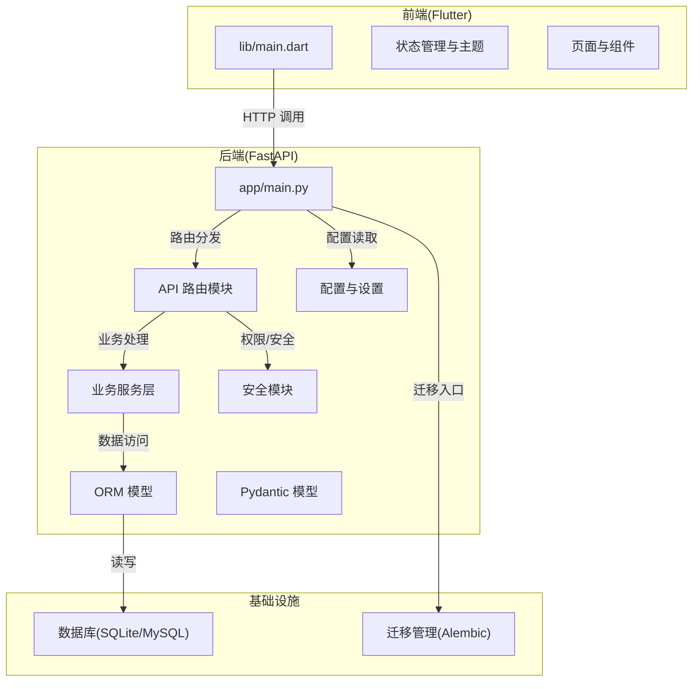
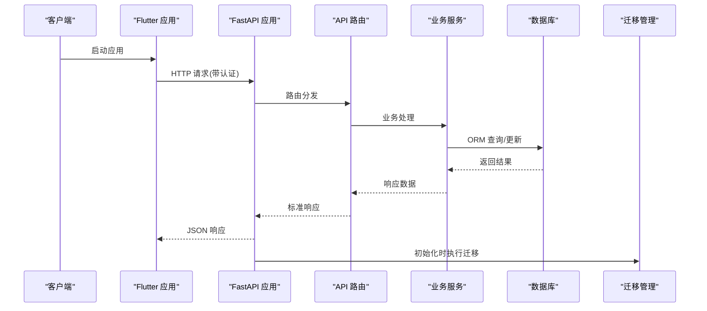
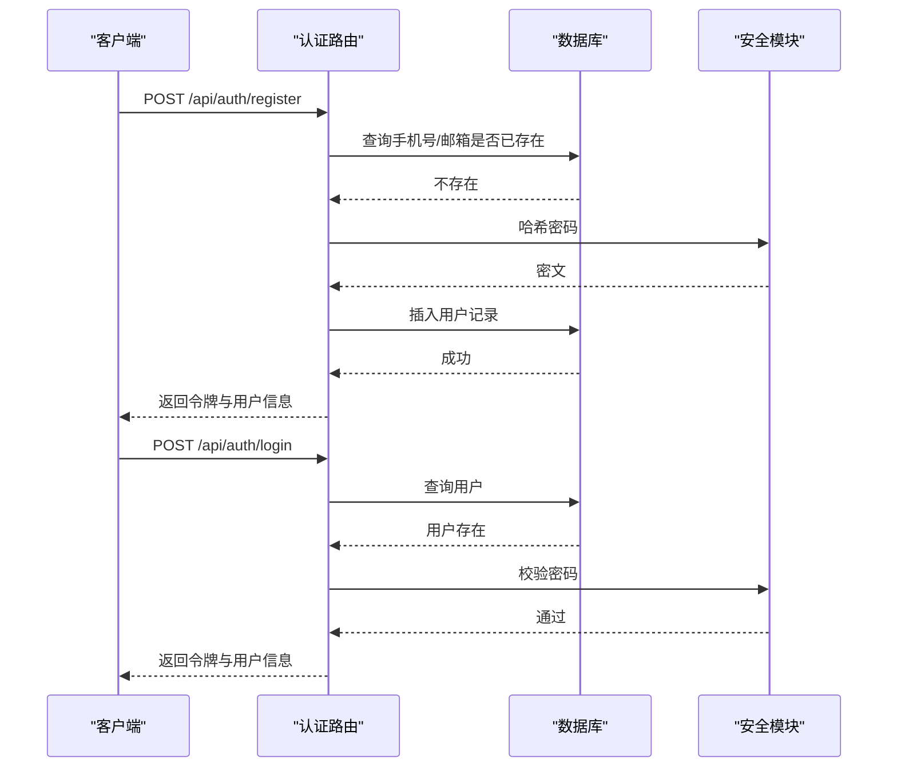
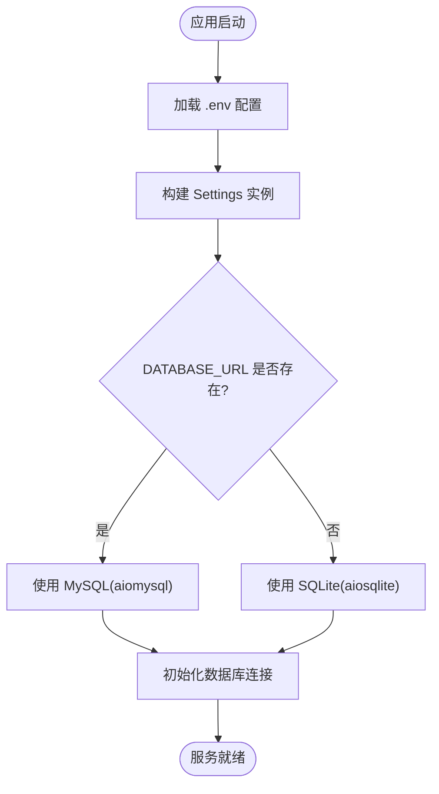
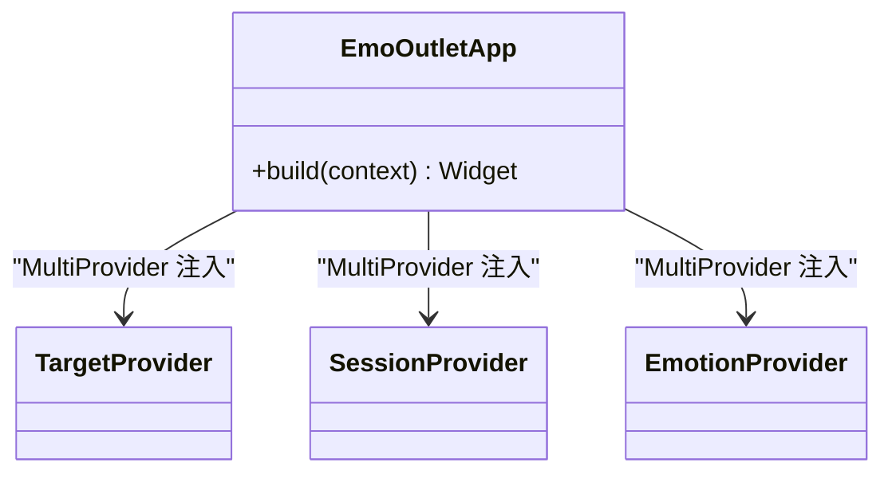
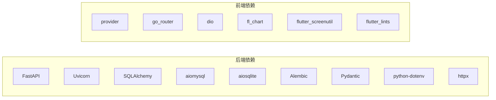

# 开发指南

<cite>
**本文引用的文件**
- [README.md](file://README.md)
- [emo_outlet_api/requirements.txt](file://emo_outlet_api/requirements.txt)
- [emo_outlet_app/pubspec.yaml](file://emo_outlet_app/pubspec.yaml)
- [emo_outlet_app/analysis_options.yaml](file://emo_outlet_app/analysis_options.yaml)
- [emo_outlet_api/setup.cfg](file://emo_outlet_api/setup.cfg)
- [emo_outlet_api/app/main.py](file://emo_outlet_api/app/main.py)
- [emo_outlet_api/app/config.py](file://emo_outlet_api/app/config.py)
- [emo_outlet_api/app/core/security.py](file://emo_outlet_api/app/core/security.py)
- [emo_outlet_api/app/api/auth.py](file://emo_outlet_api/app/api/auth.py)
- [emo_outlet_api/app/models/user.py](file://emo_outlet_api/app/models/user.py)
- [emo_outlet_api/app/schemas/user.py](file://emo_outlet_api/app/schemas/user.py)
- [emo_outlet_app/lib/main.dart](file://emo_outlet_app/lib/main.dart)
- [emo_outlet_app/test/widget_test.dart](file://emo_outlet_app/test/widget_test.dart)
- [emo_outlet_api/run.py](file://emo_outlet_api/run.py)
- [emo_outlet_api/alembic/env.py](file://emo_outlet_api/alembic/env.py)
</cite>

## 目录
1. [简介](#简介)
2. [项目结构](#项目结构)
3. [核心组件](#核心组件)
4. [架构总览](#架构总览)
5. [详细组件分析](#详细组件分析)
6. [依赖分析](#依赖分析)
7. [性能考虑](#性能考虑)
8. [故障排除指南](#故障排除指南)
9. [结论](#结论)
10. [附录](#附录)

## 简介
本开发指南面向Emo Outlet项目的开发者与贡献者，覆盖代码规范与最佳实践（Python风格、Flutter/Dart编码标准、命名约定与注释）、开发流程与工作流（分支管理、代码评审、版本发布与变更控制）、开发工具与配置（IDE设置、调试、静态分析与格式化）、测试策略（单元、集成、端到端与性能测试）、重构与技术债务管理、架构演进策略、贡献指南与社区协作，以及开发环境故障排除与效率提升技巧。目标是帮助团队在保持高质量与一致性的同时，高效推进功能迭代与维护。

## 项目结构
Emo Outlet采用前后端分离架构：
- 前端：Flutter应用，负责UI、状态管理、路由与网络调用。
- 后端：Python FastAPI服务，提供REST API、数据库访问、安全与业务逻辑。
- 数据库：通过SQLAlchemy ORM建模，使用Alembic进行迁移管理；默认开发环境使用SQLite，生产可切换MySQL。
- 配置：Pydantic Settings加载环境变量，支持多提供商AI接入与合规参数。

图表来源
- [emo_outlet_app/lib/main.dart:1-97](file://emo_outlet_app/lib/main.dart#L1-L97)
- [emo_outlet_api/app/main.py:1-82](file://emo_outlet_api/app/main.py#L1-L82)
- [emo_outlet_api/app/config.py:1-125](file://emo_outlet_api/app/config.py#L1-L125)
- [emo_outlet_api/alembic/env.py:1-71](file://emo_outlet_api/alembic/env.py#L1-L71)

章节来源
- [README.md:1-151](file://README.md#L1-L151)
- [emo_outlet_api/app/main.py:1-82](file://emo_outlet_api/app/main.py#L1-L82)
- [emo_outlet_app/lib/main.dart:1-97](file://emo_outlet_app/lib/main.dart#L1-L97)

## 核心组件
- 应用入口与生命周期
  - 后端：FastAPI应用初始化、CORS中间件、健康检查、路由挂载与生命周期管理。
  - 前端：MaterialApp主题配置、Provider状态注入、根页面渲染。
- 安全与认证
  - JWT令牌签发与校验、密码哈希与校验。
- 数据模型与Schema
  - 用户模型、Pydantic请求/响应模型，确保输入输出一致与可验证。
- 配置中心
  - 统一读取环境变量，支持数据库、AI提供商、合规参数与安全阈值。
- 迁移与数据库
  - Alembic根据配置选择SQLite或MySQL，自动迁移元数据。

章节来源
- [emo_outlet_api/app/main.py:1-82](file://emo_outlet_api/app/main.py#L1-L82)
- [emo_outlet_app/lib/main.dart:1-97](file://emo_outlet_app/lib/main.dart#L1-L97)
- [emo_outlet_api/app/core/security.py:1-43](file://emo_outlet_api/app/core/security.py#L1-L43)
- [emo_outlet_api/app/models/user.py:1-56](file://emo_outlet_api/app/models/user.py#L1-L56)
- [emo_outlet_api/app/schemas/user.py:1-74](file://emo_outlet_api/app/schemas/user.py#L1-L74)
- [emo_outlet_api/app/config.py:1-125](file://emo_outlet_api/app/config.py#L1-L125)
- [emo_outlet_api/alembic/env.py:1-71](file://emo_outlet_api/alembic/env.py#L1-L71)

## 架构总览
下图展示了从客户端到后端服务与数据库的整体交互路径，以及关键中间件与配置的作用。

图表来源
- [emo_outlet_api/app/main.py:1-82](file://emo_outlet_api/app/main.py#L1-L82)
- [emo_outlet_api/alembic/env.py:1-71](file://emo_outlet_api/alembic/env.py#L1-L71)

## 详细组件分析

### 后端认证与用户管理
- 功能要点
  - 支持手机号/邮箱注册、登录与游客登录。
  - 提供个人资料查询与更新、隐私协议签署记录。
  - 账号注销与数据导出，遵循软删除与合规要求。
- 关键流程
  - 注册：去重校验、密码哈希、生成令牌。
  - 登录：凭据校验、签发令牌。
  - 游客登录：按设备UUID查找或创建游客用户并签发令牌。
  - 资料管理：更新昵称、头像等字段。
  - 数据导出：按用户聚合会话、消息、目标与海报数据。
- 错误处理
  - 使用HTTP状态码与异常处理器返回统一错误响应。

图表来源
- [emo_outlet_api/app/api/auth.py:1-332](file://emo_outlet_api/app/api/auth.py#L1-L332)
- [emo_outlet_api/app/core/security.py:1-43](file://emo_outlet_api/app/core/security.py#L1-L43)
- [emo_outlet_api/app/models/user.py:1-56](file://emo_outlet_api/app/models/user.py#L1-L56)

章节来源
- [emo_outlet_api/app/api/auth.py:1-332](file://emo_outlet_api/app/api/auth.py#L1-L332)
- [emo_outlet_api/app/core/security.py:1-43](file://emo_outlet_api/app/core/security.py#L1-L43)
- [emo_outlet_api/app/models/user.py:1-56](file://emo_outlet_api/app/models/user.py#L1-L56)
- [emo_outlet_api/app/schemas/user.py:1-74](file://emo_outlet_api/app/schemas/user.py#L1-L74)

### 配置与环境管理
- 配置项分类
  - 应用基础：名称、版本、调试开关、主机与端口。
  - 数据库：MySQL连接参数或SQLite路径。
  - 缓存：Redis连接参数。
  - 安全：JWT密钥、算法、过期时间、敏感词与会话限制。
  - AI服务：提供商、API Key、Base URL、模型与方言词库路径。
  - 合规：版本、审计日志采样率、防沉迷策略。
- 加载方式
  - 通过Pydantic Settings从.env文件加载，支持UTF-8编码与大小写敏感。

图表来源
- [emo_outlet_api/app/config.py:1-125](file://emo_outlet_api/app/config.py#L1-L125)
- [emo_outlet_api/alembic/env.py:1-71](file://emo_outlet_api/alembic/env.py#L1-L71)

章节来源
- [emo_outlet_api/app/config.py:1-125](file://emo_outlet_api/app/config.py#L1-L125)
- [emo_outlet_api/setup.cfg:1-18](file://emo_outlet_api/setup.cfg#L1-L18)

### 前端应用入口与主题
- 入口行为
  - 初始化绑定、注入多个Provider、设置Material主题与颜色体系。
- 主题与样式
  - 使用Material3设计语言，定义主色、文本、卡片、输入框与按钮样式。
- 状态管理
  - 通过Provider管理目标、会话与情绪状态，便于跨页面共享。

图表来源
- [emo_outlet_app/lib/main.dart:1-97](file://emo_outlet_app/lib/main.dart#L1-L97)

章节来源
- [emo_outlet_app/lib/main.dart:1-97](file://emo_outlet_app/lib/main.dart#L1-L97)

### 测试策略与示例
- 单元测试
  - 建议针对业务服务函数与工具函数编写单元测试，使用Mock外部依赖（如LLM、数据库）。
- 集成测试
  - 针对API路由与数据库交互编写集成测试，使用测试数据库或内存数据库。
- 端到端测试
  - 使用Flutter驱动器或Web端E2E框架，覆盖关键用户旅程（注册/登录、创建目标、发起会话、生成海报）。
- 性能测试
  - 使用Locust或Artillery对关键API进行并发压测，关注P95/P99延迟与错误率。

章节来源
- [emo_outlet_app/test/widget_test.dart:1-13](file://emo_outlet_app/test/widget_test.dart#L1-L13)

## 依赖分析
- 后端依赖
  - Web框架：FastAPI、Uvicorn
  - 数据库：SQLAlchemy、Aiomysql/Aiosqlite、Alembic
  - 安全：python-jose、passlib(bcrypt)
  - 配置：Pydantic、Pydantic Settings、python-dotenv
  - 工具：httpx、python-multipart
- 前端依赖
  - 状态管理：provider
  - 路由：go_router
  - 网络：dio
  - UI与图表：fl_chart、flutter_screenutil
  - 工具：intl、uuid、shared_preferences、share_plus、image_picker、cached_network_image
  - 开发：flutter_lints

图表来源
- [emo_outlet_api/requirements.txt:1-29](file://emo_outlet_api/requirements.txt#L1-L29)
- [emo_outlet_app/pubspec.yaml:1-52](file://emo_outlet_app/pubspec.yaml#L1-L52)

章节来源
- [emo_outlet_api/requirements.txt:1-29](file://emo_outlet_api/requirements.txt#L1-L29)
- [emo_outlet_app/pubspec.yaml:1-52](file://emo_outlet_app/pubspec.yaml#L1-L52)

## 性能考虑
- 后端
  - 使用异步ORM减少阻塞；合理索引与查询优化；缓存热点数据（如用户偏好、方言词库）。
  - 控制会话轮数与消息长度，避免超长请求导致内存与CPU压力。
  - 在生产环境启用多进程与合适的工作者数量。
- 前端
  - 使用懒加载与按需渲染；避免不必要的重建；合理使用缓存与图片压缩。
- 数据库
  - 开发默认SQLite，生产使用MySQL；迁移前评估DDL成本，避免长时间锁表。

## 故障排除指南
- 后端启动失败
  - 检查端口占用与CORS配置；确认数据库连接字符串与可用性；查看日志输出定位异常。
- 前端无法连接后端
  - 确认baseUrl与后端地址一致；检查防火墙与跨域策略；验证网络连通性。
- 认证失败
  - 校验JWT密钥与算法配置；确认过期时间与客户端时间同步；检查密码哈希流程。
- 数据库迁移问题
  - 确认Alembic配置与数据库URL；离线/在线迁移模式正确；必要时回滚并修复冲突。
- 开发模式运行
  - 后端：使用uvicorn热重载模式启动；前端：使用flutter run；首次运行需先启动后端。

章节来源
- [emo_outlet_api/app/main.py:1-82](file://emo_outlet_api/app/main.py#L1-L82)
- [emo_outlet_api/run.py:1-31](file://emo_outlet_api/run.py#L1-L31)
- [emo_outlet_api/alembic/env.py:1-71](file://emo_outlet_api/alembic/env.py#L1-L71)

## 结论
本指南提供了从代码规范、开发流程、工具配置、测试策略到故障排除的完整实践路径。建议团队在日常开发中严格遵循命名与注释规范，持续进行静态分析与格式化，完善测试矩阵，并通过配置中心与迁移管理保障系统稳定性与可演进性。

## 附录

### 代码规范与最佳实践

- Python（后端）
  - 风格与格式
    - 使用类型注解与Pydantic模型保证类型安全；遵循PEP 8与Black风格（建议在CI中强制）。
    - 异步编程：优先使用async/await，避免阻塞操作；合理使用事务与连接池。
  - 命名约定
    - 模块与文件：小写下划线；类：大驼峰；常量：全大写；私有成员：下划线前缀。
  - 注释规范
    - 函数/类：简述用途、参数、返回值与异常；复杂逻辑添加行内注释；公共API提供清晰文档字符串。
  - 错误处理
    - 使用HTTPException与统一异常处理器；区分业务错误与系统错误；记录必要的审计日志。
  - 安全
    - JWT密钥与敏感配置放入环境变量；密码使用bcrypt；输入校验与输出净化；限制请求大小与频率。
  - 数据库
    - 使用SQLAlchemy ORM；为高频查询建立索引；迁移脚本版本化管理；软删除与合规字段规范化。

- Flutter/Dart（前端）
  - 编码标准
    - 使用Flutter Lints规则集；避免print调试；使用const构造器与不可变对象；合理拆分Widget。
  - 命名约定
    - 类/文件：大驼峰；属性/方法：小驼峰；资源：assets/images；常量：UPPER_SNAKE_CASE。
  - 注释规范
    - 公共API与复杂逻辑添加注释；使用///与/** */保持一致性；TODO/NOTE标注待办事项。
  - 状态管理
    - Provider用于轻量状态；复杂场景考虑Riverpod或Redux；避免过度重建。
  - 网络与缓存
    - 使用dio封装请求与拦截器；统一错误处理与重试策略；本地缓存与图片缓存结合使用。

章节来源
- [emo_outlet_app/analysis_options.yaml:1-9](file://emo_outlet_app/analysis_options.yaml#L1-L9)
- [emo_outlet_api/requirements.txt:1-29](file://emo_outlet_api/requirements.txt#L1-L29)
- [emo_outlet_app/pubspec.yaml:1-52](file://emo_outlet_app/pubspec.yaml#L1-L52)

### 开发流程与工作流
- 分支管理
  - 主分支：main（受保护，仅允许合并请求）。
  - 功能分支：feature/前缀，完成后合并到develop。
  - 发布分支：release/vX.Y.Z，预发布与回归测试。
  - 热修复：hotfix/前缀，直接合并到main与develop。
- 代码评审
  - PR必须包含测试与变更说明；至少一名Reviewer批准；CI通过后方可合并。
- 版本发布与变更控制
  - 语义化版本：补丁/次要/主要版本；变更日志记录重大改动；打Tag并发布Release。
- 配置与环境
  - 开发：.env.development；测试：.env.test；生产：.env.production；敏感信息不入库。

### 开发工具与配置
- IDE设置
  - VS Code：Python扩展、Dart/Flutter扩展、Pylance、Dart Code；启用格式化与Lint。
- 调试配置
  - 后端：Uvicorn热重载；前端：Flutter Run/Attach；断点与日志结合。
- 静态分析与格式化
  - Python：flake8、mypy、black、isort；CI中强制执行。
  - Flutter：flutter analyze、dart format；集成pre-commit钩子。
- 依赖管理
  - 后端：requirements.txt；前端：pubspec.yaml；锁定版本并定期升级。

章节来源
- [emo_outlet_api/setup.cfg:1-18](file://emo_outlet_api/setup.cfg#L1-L18)
- [emo_outlet_app/analysis_options.yaml:1-9](file://emo_outlet_app/analysis_options.yaml#L1-L9)

### 测试策略与方法
- 单元测试
  - 覆盖核心业务逻辑与边界条件；使用Mock外部依赖；断言明确且可读。
- 集成测试
  - 覆盖API路由与数据库交互；使用独立测试数据库；关注事务与并发。
- 端到端测试
  - 自动化关键用户旅程；截图与日志辅助定位问题；跨平台兼容性验证。
- 性能测试
  - 压测关键API与数据库；监控资源使用；制定SLA与告警阈值。

章节来源
- [emo_outlet_app/test/widget_test.dart:1-13](file://emo_outlet_app/test/widget_test.dart#L1-L13)

### 代码重构原则、技术债务与架构演进
- 重构原则
  - 小步快跑、持续重构；保持测试覆盖率；避免过度设计；关注可读性与可维护性。
- 技术债务
  - 债务分类：设计债、实现债、测试债、文档债；制定偿还计划与优先级。
- 架构演进
  - 微服务化：按领域拆分服务；事件驱动：引入消息队列；可观测性：日志、指标、追踪；弹性：熔断、降级、限流。

### 贡献指南与社区协作
- 提交规范
  - Commit信息：类型(范围): 概要；正文描述动机与影响；关闭Issue链接。
- 社区参与
  - Issue模板：重现步骤、期望/实际行为、环境信息；PR模板：变更摘要、测试方案、升级说明。
- 开源许可
  - MIT License，尊重版权与第三方依赖许可证。

章节来源
- [README.md:1-151](file://README.md#L1-L151)