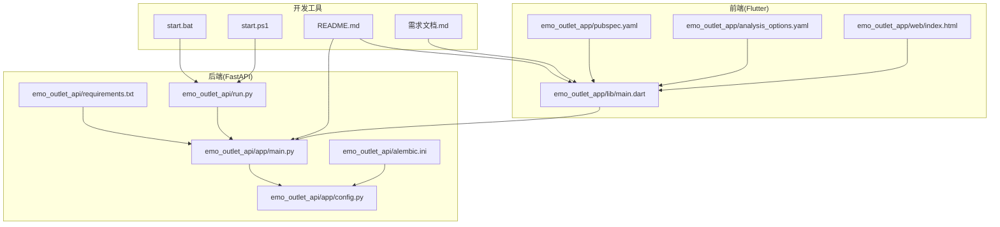
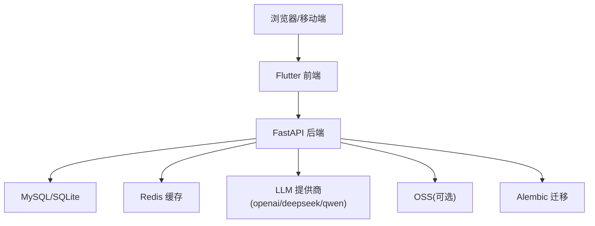
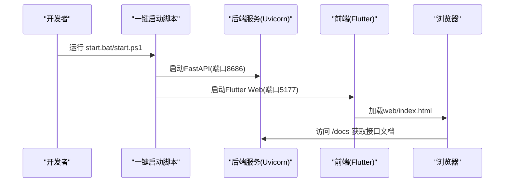
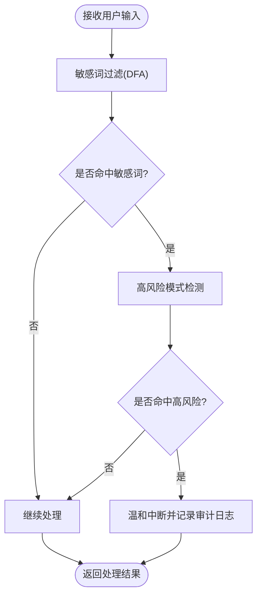
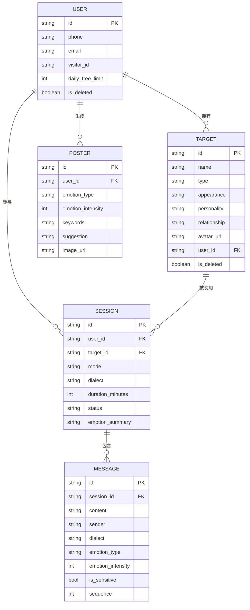
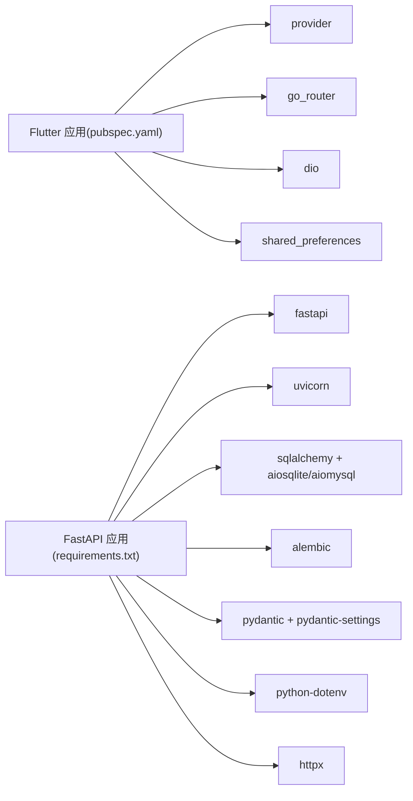

# 开发流程与工作流

<cite>
**本文引用的文件**
- [README.md](file://README.md)
- [start.bat](file://start.bat)
- [start.ps1](file://start.ps1)
- [emo_outlet_api/requirements.txt](file://emo_outlet_api/requirements.txt)
- [emo_outlet_api/run.py](file://emo_outlet_api/run.py)
- [emo_outlet_api/app/main.py](file://emo_outlet_api/app/main.py)
- [emo_outlet_api/app/config.py](file://emo_outlet_api/app/config.py)
- [emo_outlet_api/setup.cfg](file://emo_outlet_api/setup.cfg)
- [emo_outlet_api/alembic.ini](file://emo_outlet_api/alembic.ini)
- [emo_outlet_app/pubspec.yaml](file://emo_outlet_app/pubspec.yaml)
- [emo_outlet_app/analysis_options.yaml](file://emo_outlet_app/analysis_options.yaml)
- [emo_outlet_app/web/index.html](file://emo_outlet_app/web/index.html)
- [emo_outlet_api/app/utils/sensitive_filter.py](file://emo_outlet_api/app/utils/sensitive_filter.py)
- [emo_outlet_api/app/models/message.py](file://emo_outlet_api/app/models/message.py)
- [emo_outlet_api/app/api/posters.py](file://emo_outlet_api/app/api/posters.py)
- [需求文档.md](file://需求文档.md)
</cite>

## 目录
1. [引言](#引言)
2. [项目结构](#项目结构)
3. [核心组件](#核心组件)
4. [架构总览](#架构总览)
5. [详细组件分析](#详细组件分析)
6. [依赖分析](#依赖分析)
7. [性能考虑](#性能考虑)
8. [故障排查指南](#故障排查指南)
9. [结论](#结论)
10. [附录](#附录)

## 引言
本文件面向Emo Outlet项目团队，系统化梳理开发流程与工作流，覆盖Git分支管理、代码审查、版本发布、CI/CD、开发环境配置以及项目管理工具使用等关键环节。文档以仓库现有配置与代码为依据，结合产品需求文档中的范围与约束，形成可执行、可落地的工程实践指南。

## 项目结构
Emo Outlet采用前后端分离架构：
- 前端：Flutter应用，支持Web调试与多平台产物构建
- 后端：Python FastAPI + SQLAlchemy + MySQL/SQLite，提供REST API与健康检查
- 数据迁移：Alembic用于数据库版本管理
- 开发工具：一键启动脚本、依赖清单、静态分析配置

图表来源
- [emo_outlet_api/app/main.py:1-82](file://emo_outlet_api/app/main.py#L1-L82)
- [emo_outlet_api/app/config.py:1-125](file://emo_outlet_api/app/config.py#L1-L125)
- [emo_outlet_api/requirements.txt:1-29](file://emo_outlet_api/requirements.txt#L1-L29)
- [emo_outlet_api/run.py:1-31](file://emo_outlet_api/run.py#L1-L31)
- [emo_outlet_api/alembic.ini:1-38](file://emo_outlet_api/alembic.ini#L1-L38)
- [emo_outlet_app/pubspec.yaml:1-52](file://emo_outlet_app/pubspec.yaml#L1-L52)
- [emo_outlet_app/analysis_options.yaml:1-9](file://emo_outlet_app/analysis_options.yaml#L1-L9)
- [emo_outlet_app/web/index.html:1-47](file://emo_outlet_app/web/index.html#L1-L47)
- [start.bat:1-43](file://start.bat#L1-L43)
- [start.ps1:1-65](file://start.ps1#L1-L65)
- [README.md:1-151](file://README.md#L1-L151)
- [需求文档.md:1-449](file://需求文档.md#L1-L449)

章节来源
- [README.md:1-151](file://README.md#L1-L151)
- [emo_outlet_api/app/main.py:1-82](file://emo_outlet_api/app/main.py#L1-L82)
- [emo_outlet_api/app/config.py:1-125](file://emo_outlet_api/app/config.py#L1-L125)
- [emo_outlet_api/requirements.txt:1-29](file://emo_outlet_api/requirements.txt#L1-L29)
- [emo_outlet_api/run.py:1-31](file://emo_outlet_api/run.py#L1-L31)
- [emo_outlet_api/alembic.ini:1-38](file://emo_outlet_api/alembic.ini#L1-L38)
- [emo_outlet_app/pubspec.yaml:1-52](file://emo_outlet_app/pubspec.yaml#L1-L52)
- [emo_outlet_app/analysis_options.yaml:1-9](file://emo_outlet_app/analysis_options.yaml#L1-L9)
- [emo_outlet_app/web/index.html:1-47](file://emo_outlet_app/web/index.html#L1-L47)
- [start.bat:1-43](file://start.bat#L1-L43)
- [start.ps1:1-65](file://start.ps1#L1-L65)
- [需求文档.md:1-449](file://需求文档.md#L1-L449)

## 核心组件
- 前端应用：负责用户交互、路由、状态管理、网络请求与资源加载
- 后端API：提供认证、会话、消息、海报、支持等接口，内置健康检查
- 配置中心：集中管理应用名称、版本、数据库、Redis、JWT、AI提供商、合规参数等
- 数据层：SQLAlchemy ORM + Alembic迁移；开发默认SQLite，生产可选MySQL
- 安全与合规：敏感词过滤、高风险模式检测、审计日志采样、端侧数据策略
- 开发工具链：一键启动脚本、依赖清单、静态分析规则、Docker部署说明

章节来源
- [emo_outlet_api/app/main.py:1-82](file://emo_outlet_api/app/main.py#L1-L82)
- [emo_outlet_api/app/config.py:1-125](file://emo_outlet_api/app/config.py#L1-L125)
- [emo_outlet_api/app/utils/sensitive_filter.py:1-110](file://emo_outlet_api/app/utils/sensitive_filter.py#L1-L110)
- [emo_outlet_api/app/models/message.py:1-45](file://emo_outlet_api/app/models/message.py#L1-L45)
- [emo_outlet_api/alembic.ini:1-38](file://emo_outlet_api/alembic.ini#L1-L38)
- [emo_outlet_app/pubspec.yaml:1-52](file://emo_outlet_app/pubspec.yaml#L1-L52)
- [emo_outlet_api/run.py:1-31](file://emo_outlet_api/run.py#L1-L31)

## 架构总览
后端通过FastAPI提供REST接口，前端通过HTTP调用后端API；数据库采用异步SQLAlchemy，开发环境默认SQLite，生产可配置MySQL；AI能力通过多种提供商抽象；安全与合规策略贯穿数据采集、传输与存储。

图表来源
- [emo_outlet_api/app/main.py:1-82](file://emo_outlet_api/app/main.py#L1-L82)
- [emo_outlet_api/app/config.py:1-125](file://emo_outlet_api/app/config.py#L1-L125)
- [emo_outlet_api/alembic.ini:1-38](file://emo_outlet_api/alembic.ini#L1-L38)

## 详细组件分析

### Git分支管理策略
- 主分支保护
  - master/main仅接受通过合并请求(MR/PR)的变更
  - 保护规则：禁止直接推送；要求至少1名审查者批准；必须通过所有检查项
- 功能分支命名规范
  - feat/前缀：新增功能，如 feat/session-flow
  - fix/前缀：缺陷修复，如 fix/auth-login-bug
  - docs/前缀：文档更新，如 docs/readme-update
  - refactor/前缀：重构，如 refactor/api-auth-layer
  - chore/前缀：日常事务，如 chore/update-deps
  - hotfix/前缀：紧急线上修复，如 hotfix/security-patch
- 合并请求流程
  - 创建MR/PR，填写模板（见“代码审查流程”）
  - 自动化检查通过后，至少1名审查者批准
  - 合并后清理源分支
- 冲突解决机制
  - 优先rebase上游变更，保持线性历史
  - 若存在复杂冲突，拆分为更小的提交或子任务
  - 重大变更需同步团队讨论并评审

### 代码审查流程
- PR模板
  - 概述：简述变更目的与影响
  - 问题链接：关联需求/缺陷/任务
  - 变更摘要：列出主要改动
  - 测试方法：如何验证
  - 风险与回滚：潜在风险与回滚策略
- 审查清单
  - 代码质量：遵循静态分析规则，无警告
  - 安全合规：敏感词过滤、高风险检测、审计日志
  - 性能与稳定性：避免阻塞操作、合理超时与重试
  - 兼容性：数据库迁移、版本兼容
  - 文档：接口文档、变更日志
- 反馈处理
  - 明确标注“待修改”与“已修改”，逐条回复
  - 修改后重新触发自动化检查
- 批准标准
  - 至少1名审查者批准
  - 无“拒绝”意见
  - 所有问题闭环

### 版本发布管理
- 语义化版本控制
  - 主版本：破坏性变更
  - 次版本：新增功能且向后兼容
  - 修订版本：修复错误且向后兼容
- 发布标签规范
  - 前缀v，格式vMAJOR.MINOR.PATCH(+BUILD)，如 v1.2.3+1
- 变更日志维护
  - 每次发布更新CHANGELOG，记录新增、修复、变更与废弃
- 回滚策略
  - 快照与备份：数据库迁移前备份
  - 版本回退：容器镜像回滚至上一稳定版本
  - 紧急修复：hotfix分支快速修复并合并回主干

### 持续集成/持续部署(CI/CD)
- 自动化测试
  - 前端：静态分析与单元测试（lint/test）
  - 后端：单元测试与集成测试（pytest/HTTP接口）
- 构建验证
  - 依赖安装：pip/Flutter pub
  - 构建产物：后端Docker镜像、前端Web/Mac产物
- 部署流水线
  - 开发：本地一键启动脚本
  - 预发布：Docker镜像推送至制品库
  - 生产：Kubernetes/容器编排部署，滚动更新
- 监控告警
  - 健康检查：/health端点
  - 日志：结构化日志与审计日志
  - 告警：异常率、延迟、错误码阈值

### 开发环境配置指南
- 本地开发服务器启动
  - 后端：使用一键脚本启动Uvicorn服务，端口可配置
  - 前端：使用Flutter运行Web调试，端口可配置
- 数据库初始化
  - 开发：SQLite自动创建；生产：配置MySQL连接
  - 迁移：使用Alembic进行版本迁移
- 环境变量配置
  - 应用名称与版本、数据库、Redis、JWT、AI提供商、合规参数等
  - 示例：LLM_PROVIDER、DATABASE_URL、REDIS_URL、SECRET_KEY
- 依赖管理
  - 后端：requirements.txt声明依赖，安装后启动
  - 前端：pubspec.yaml声明依赖，Flutter SDK管理

图表来源
- [start.bat:1-43](file://start.bat#L1-L43)
- [start.ps1:1-65](file://start.ps1#L1-L65)
- [emo_outlet_api/run.py:1-31](file://emo_outlet_api/run.py#L1-L31)
- [emo_outlet_api/app/main.py:1-82](file://emo_outlet_api/app/main.py#L1-L82)
- [emo_outlet_app/web/index.html:1-47](file://emo_outlet_app/web/index.html#L1-L47)

章节来源
- [start.bat:1-43](file://start.bat#L1-L43)
- [start.ps1:1-65](file://start.ps1#L1-L65)
- [emo_outlet_api/run.py:1-31](file://emo_outlet_api/run.py#L1-L31)
- [emo_outlet_api/app/main.py:1-82](file://emo_outlet_api/app/main.py#L1-L82)
- [emo_outlet_api/app/config.py:1-125](file://emo_outlet_api/app/config.py#L1-L125)
- [emo_outlet_api/alembic.ini:1-38](file://emo_outlet_api/alembic.ini#L1-L38)
- [emo_outlet_app/web/index.html:1-47](file://emo_outlet_app/web/index.html#L1-L47)
- [emo_outlet_api/requirements.txt:1-29](file://emo_outlet_api/requirements.txt#L1-L29)
- [emo_outlet_app/pubspec.yaml:1-52](file://emo_outlet_app/pubspec.yaml#L1-L52)

### 安全与合规处理流程

图表来源
- [emo_outlet_api/app/utils/sensitive_filter.py:1-110](file://emo_outlet_api/app/utils/sensitive_filter.py#L1-L110)

章节来源
- [emo_outlet_api/app/utils/sensitive_filter.py:1-110](file://emo_outlet_api/app/utils/sensitive_filter.py#L1-L110)
- [需求文档.md:332-391](file://需求文档.md#L332-L391)

### 数据模型与关系

图表来源
- [emo_outlet_api/app/models/message.py:1-45](file://emo_outlet_api/app/models/message.py#L1-L45)
- [emo_outlet_api/app/api/posters.py:1-37](file://emo_outlet_api/app/api/posters.py#L1-L37)

章节来源
- [emo_outlet_api/app/models/message.py:1-45](file://emo_outlet_api/app/models/message.py#L1-L45)
- [emo_outlet_api/app/api/posters.py:1-37](file://emo_outlet_api/app/api/posters.py#L1-L37)

### 项目管理工具使用
- 任务分配与进度跟踪
  - 使用需求文档中的MVP规划与里程碑，分解为迭代任务
  - 通过分支命名与PR模板关联任务
- 里程碑管理
  - 每阶段交付物明确，验收标准清晰
- 团队协作规范
  - 代码审查与批准流程标准化
  - 变更日志与发布标签规范化

章节来源
- [需求文档.md:394-417](file://需求文档.md#L394-L417)
- [需求文档.md:428-449](file://需求文档.md#L428-L449)

## 依赖分析
- 前端依赖：Flutter SDK、provider、go_router、dio、shared_preferences、fl_chart、intl、uuid等
- 后端依赖：FastAPI、Uvicorn、SQLAlchemy、aiomysql/aiosqlite、Alembic、Pydantic、python-dotenv、httpx等
- 配置与忽略：setup.cfg定义Python版本与忽略文件；.gitignore未在仓库中提供

图表来源
- [emo_outlet_app/pubspec.yaml:1-52](file://emo_outlet_app/pubspec.yaml#L1-L52)
- [emo_outlet_api/requirements.txt:1-29](file://emo_outlet_api/requirements.txt#L1-L29)

章节来源
- [emo_outlet_app/pubspec.yaml:1-52](file://emo_outlet_app/pubspec.yaml#L1-L52)
- [emo_outlet_api/requirements.txt:1-29](file://emo_outlet_api/requirements.txt#L1-L29)
- [emo_outlet_api/setup.cfg:1-18](file://emo_outlet_api/setup.cfg#L1-L18)

## 性能考虑
- 后端
  - 异步数据库访问与连接池配置
  - 中间件日志开销控制
  - AI调用超时与重试策略
- 前端
  - 资源懒加载与缓存
  - 网络请求并发与节流
- 安全与合规
  - 敏感词过滤与高风险检测的性能权衡
  - 审计日志采样率与存储策略

## 故障排查指南
- 后端健康检查
  - 访问 /health 确认服务可用
- 数据库连接
  - 开发：确认SQLite文件存在；生产：检查MySQL连接参数
- 环境变量
  - 确认 .env 文件存在且包含必要键值
- 前端无法连接后端
  - 检查 baseUrl 与端口；确保后端已启动
- 敏感词与高风险拦截
  - 检查敏感词库与高风险正则配置

章节来源
- [emo_outlet_api/app/main.py:66-72](file://emo_outlet_api/app/main.py#L66-L72)
- [emo_outlet_api/app/config.py:1-125](file://emo_outlet_api/app/config.py#L1-L125)
- [emo_outlet_api/run.py:25-31](file://emo_outlet_api/run.py#L25-L31)
- [emo_outlet_app/web/index.html:1-47](file://emo_outlet_app/web/index.html#L1-L47)
- [emo_outlet_api/app/utils/sensitive_filter.py:1-110](file://emo_outlet_api/app/utils/sensitive_filter.py#L1-L110)

## 结论
本指南基于仓库现有配置与代码，建立了从分支管理、代码审查、版本发布到CI/CD与开发环境的完整工作流。建议团队在实践中持续完善自动化检查、监控告警与回滚预案，确保高质量交付与可持续演进。

## 附录
- 一键启动脚本
  - Windows批处理与PowerShell脚本分别启动后端与前端
- 配置与迁移
  - FastAPI配置集中于config.py；数据库迁移由Alembic管理
- 产品需求
  - 需求文档明确了功能边界、安全与合规策略、MVP规划与里程碑

章节来源
- [start.bat:1-43](file://start.bat#L1-L43)
- [start.ps1:1-65](file://start.ps1#L1-L65)
- [emo_outlet_api/app/config.py:1-125](file://emo_outlet_api/app/config.py#L1-L125)
- [emo_outlet_api/alembic.ini:1-38](file://emo_outlet_api/alembic.ini#L1-L38)
- [需求文档.md:1-449](file://需求文档.md#L1-L449)