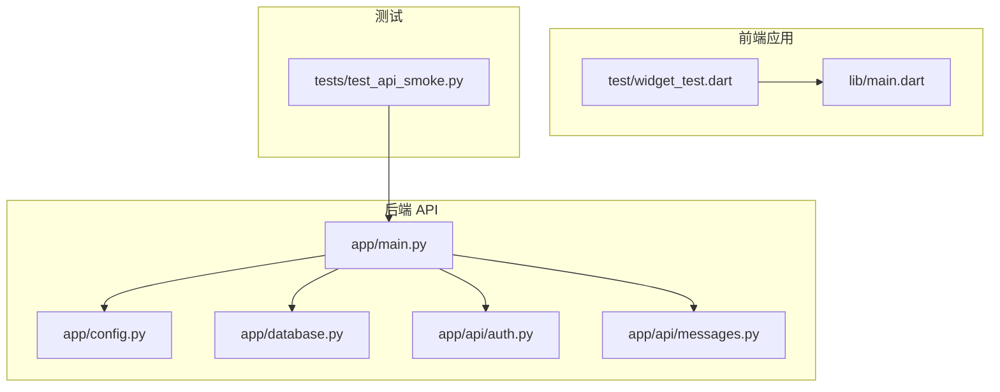
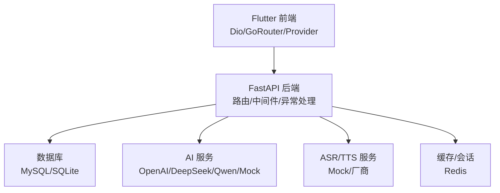
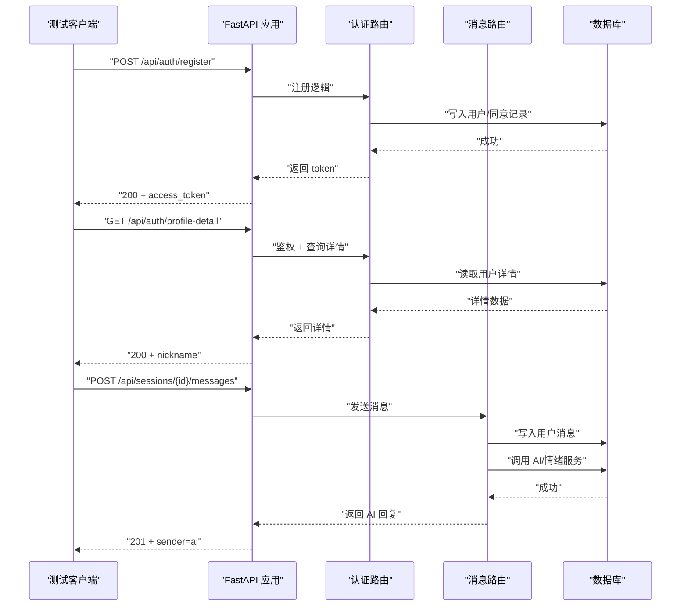
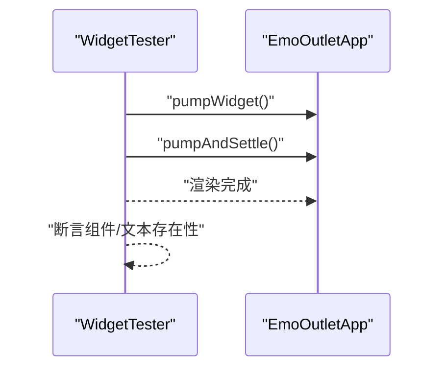
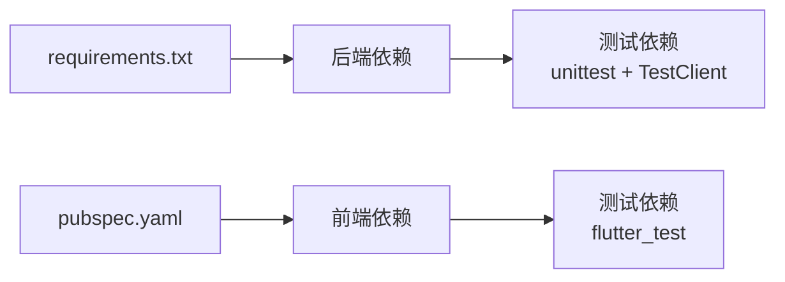

# 测试策略与实施

<cite>
**本文引用的文件**
- [emo_outlet_api/requirements.txt](file://emo_outlet_api/requirements.txt)
- [emo_outlet_api/setup.cfg](file://emo_outlet_api/setup.cfg)
- [emo_outlet_api/app/main.py](file://emo_outlet_api/app/main.py)
- [emo_outlet_api/app/config.py](file://emo_outlet_api/app/config.py)
- [emo_outlet_api/app/database.py](file://emo_outlet_api/app/database.py)
- [emo_outlet_api/tests/test_api_smoke.py](file://emo_outlet_api/tests/test_api_smoke.py)
- [emo_outlet_api/app/api/auth.py](file://emo_outlet_api/app/api/auth.py)
- [emo_outlet_api/app/api/messages.py](file://emo_outlet_api/app/api/messages.py)
- [emo_outlet_api/app/models/user.py](file://emo_outlet_api/app/models/user.py)
- [emo_outlet_api/app/models/message.py](file://emo_outlet_api/app/models/message.py)
- [emo_outlet_app/pubspec.yaml](file://emo_outlet_app/pubspec.yaml)
- [emo_outlet_app/lib/main.dart](file://emo_outlet_app/lib/main.dart)
- [emo_outlet_app/test/widget_test.dart](file://emo_outlet_app/test/widget_test.dart)
</cite>

## 目录
1. [引言](#引言)
2. [项目结构](#项目结构)
3. [核心组件](#核心组件)
4. [架构总览](#架构总览)
5. [详细组件分析](#详细组件分析)
6. [依赖关系分析](#依赖关系分析)
7. [性能考虑](#性能考虑)
8. [故障排查指南](#故障排查指南)
9. [结论](#结论)
10. [附录](#附录)

## 引言
本文件面向 Emo Outlet 项目的测试策略与实施，覆盖后端 API 的单元测试与集成测试、前端 Flutter 的组件测试、Mock 对象与测试数据准备、性能测试（负载/压力/内存/响应时间）、测试自动化（CI/CD 集成、报告与覆盖率、质量门禁）、测试环境管理（数据库、模拟服务、数据同步与隔离），以及测试工具与框架选型建议。目标是帮助团队建立可执行、可维护、可扩展的测试体系。

## 项目结构
Emo Outlet 采用前后端分离架构：
- 后端：FastAPI + SQLAlchemy Async + MySQL/SQLite，提供认证、会话、消息、海报、支持等接口。
- 前端：Flutter 应用，使用 Provider 管理状态，Dio 进行网络请求，GoRouter 路由。
- 测试：后端使用 unittest + FastAPI TestClient + SQLite 内存数据库；前端使用 flutter_test。

图表来源
- [emo_outlet_api/app/main.py:1-82](file://emo_outlet_api/app/main.py#L1-L82)
- [emo_outlet_api/app/config.py:1-125](file://emo_outlet_api/app/config.py#L1-L125)
- [emo_outlet_api/app/database.py:1-43](file://emo_outlet_api/app/database.py#L1-L43)
- [emo_outlet_api/app/api/auth.py:1-332](file://emo_outlet_api/app/api/auth.py#L1-L332)
- [emo_outlet_api/app/api/messages.py:1-216](file://emo_outlet_api/app/api/messages.py#L1-L216)
- [emo_outlet_api/tests/test_api_smoke.py:1-168](file://emo_outlet_api/tests/test_api_smoke.py#L1-L168)
- [emo_outlet_app/lib/main.dart:1-97](file://emo_outlet_app/lib/main.dart#L1-L97)
- [emo_outlet_app/test/widget_test.dart:1-13](file://emo_outlet_app/test/widget_test.dart#L1-L13)

章节来源
- [emo_outlet_api/app/main.py:1-82](file://emo_outlet_api/app/main.py#L1-L82)
- [emo_outlet_app/lib/main.dart:1-97](file://emo_outlet_app/lib/main.dart#L1-L97)

## 核心组件
- 后端应用入口与生命周期：应用启动时初始化数据库，关闭时清理连接；注册异常处理器与 CORS 中间件；挂载各路由模块；提供健康检查与根路径。
- 配置中心：集中管理数据库、Redis、JWT、AI/ASR/TTS、合规与安全阈值等配置项，并支持从环境变量覆盖。
- 数据层：基于 SQLAlchemy Async 的异步引擎与会话工厂，支持 MySQL/SQLite 切换；提供统一的 get_db 依赖注入与自动提交/回滚/关闭。
- 接口层：认证、会话、消息、海报、支持等模块化路由，使用 Pydantic 模型进行请求/响应校验。
- 前端应用：多 Provider 状态管理、主题与样式配置、主屏入口；测试用例验证应用可启动与基本 UI 结构。

章节来源
- [emo_outlet_api/app/main.py:14-82](file://emo_outlet_api/app/main.py#L14-L82)
- [emo_outlet_api/app/config.py:12-125](file://emo_outlet_api/app/config.py#L12-L125)
- [emo_outlet_api/app/database.py:8-43](file://emo_outlet_api/app/database.py#L8-L43)
- [emo_outlet_api/app/api/auth.py:30-332](file://emo_outlet_api/app/api/auth.py#L30-L332)
- [emo_outlet_api/app/api/messages.py:21-216](file://emo_outlet_api/app/api/messages.py#L21-L216)
- [emo_outlet_app/lib/main.dart:13-97](file://emo_outlet_app/lib/main.dart#L13-L97)

## 架构总览
后端通过 FastAPI 提供 REST 接口，前端通过 Dio 发起请求；数据库通过 SQLAlchemy Async 访问；AI/ASR/TTS 可通过配置切换至 Mock 或真实提供商；测试阶段使用 SQLite 内存数据库与 Mock AI 服务。

图表来源
- [emo_outlet_api/app/main.py:23-82](file://emo_outlet_api/app/main.py#L23-L82)
- [emo_outlet_api/app/config.py:63-87](file://emo_outlet_api/app/config.py#L63-L87)
- [emo_outlet_api/app/database.py:8-15](file://emo_outlet_api/app/database.py#L8-L15)

## 详细组件分析

### 单元测试与集成测试设计（后端）
- 测试框架与客户端：使用 unittest + FastAPI TestClient；通过环境变量切换 SQLite 内存数据库与 AI Provider 为 mock，确保测试可重复且无外部依赖。
- 测试数据准备：在测试类 setUpClass 中创建临时数据库文件，在 tearDownClass 清理；使用 TestClient 获取应用实例。
- 流程覆盖：从注册登录、获取/更新用户资料、创建目标、生成头像、开启会话、发送消息、结束会话并获取情绪分析、生成海报、查询海报列表与报表、提交反馈、删除海报，形成完整端到端流程。
- 断言要点：状态码、响应字段存在性与类型、业务逻辑一致性（如敏感词拦截、对话轮次限制、会话超时完成）。

图表来源
- [emo_outlet_api/tests/test_api_smoke.py:31-106](file://emo_outlet_api/tests/test_api_smoke.py#L31-L106)
- [emo_outlet_api/app/api/auth.py:33-120](file://emo_outlet_api/app/api/auth.py#L33-L120)
- [emo_outlet_api/app/api/messages.py:69-195](file://emo_outlet_api/app/api/messages.py#L69-L195)

章节来源
- [emo_outlet_api/tests/test_api_smoke.py:17-168](file://emo_outlet_api/tests/test_api_smoke.py#L17-L168)
- [emo_outlet_api/app/api/auth.py:33-120](file://emo_outlet_api/app/api/auth.py#L33-L120)
- [emo_outlet_api/app/api/messages.py:69-195](file://emo_outlet_api/app/api/messages.py#L69-L195)

### Flutter 组件测试
- 测试框架：使用 flutter_test；当前示例为“冒烟测试”，验证应用可启动、主组件存在。
- 建议扩展：针对关键页面（登录、会话、消息列表、海报详情）进行交互测试；对 Provider 状态变更进行断言；对 Dio 请求进行 Mock。

图表来源
- [emo_outlet_app/test/widget_test.dart:4-12](file://emo_outlet_app/test/widget_test.dart#L4-L12)
- [emo_outlet_app/lib/main.dart:8-24](file://emo_outlet_app/lib/main.dart#L8-L24)

章节来源
- [emo_outlet_app/test/widget_test.dart:1-13](file://emo_outlet_app/test/widget_test.dart#L1-L13)
- [emo_outlet_app/lib/main.dart:1-97](file://emo_outlet_app/lib/main.dart#L1-L97)

### Mock 对象与测试数据准备
- 后端：通过环境变量将 LLM_PROVIDER 设为 mock，避免真实第三方调用；SQLite 内存数据库位于 tests/test_emo_outlet.db，测试结束后删除。
- 前端：建议使用 MockHttpClient/Dio Mock Adapter 将网络请求重定向到本地 fixtures 或内存数据，保证测试稳定与可重复。
- 数据模型：用户与消息模型包含关键字段（如年龄区间、敏感标记、情绪类型/强度），测试中需覆盖边界条件与异常分支。

章节来源
- [emo_outlet_api/tests/test_api_smoke.py:8-10](file://emo_outlet_api/tests/test_api_smoke.py#L8-L10)
- [emo_outlet_api/app/models/user.py:12-52](file://emo_outlet_api/app/models/user.py#L12-L52)
- [emo_outlet_api/app/models/message.py:13-46](file://emo_outlet_api/app/models/message.py#L13-L46)

### API 接口测试要点
- 认证：注册（手机号/邮箱唯一性）、登录（账号/密码校验）、访客登录（设备指纹）、注销与数据导出。
- 会话与消息：消息分页查询、消息发送（含敏感词拦截、高风险中断、轮次上限、时长超限完成）、会话状态变更。
- 报表与支持：海报生成与详情、列表与趋势报表、反馈提交。

章节来源
- [emo_outlet_api/app/api/auth.py:33-332](file://emo_outlet_api/app/api/auth.py#L33-L332)
- [emo_outlet_api/app/api/messages.py:32-195](file://emo_outlet_api/app/api/messages.py#L32-L195)

### 数据库连接测试
- 引擎与会话：异步引擎创建、依赖注入 get_db 自动提交/回滚/关闭；初始化时按需创建表。
- 测试隔离：每个测试用例运行于独立 SQLite 文件，避免并发污染。

章节来源
- [emo_outlet_api/app/database.py:8-43](file://emo_outlet_api/app/database.py#L8-L43)
- [emo_outlet_api/tests/test_api_smoke.py:8-29](file://emo_outlet_api/tests/test_api_smoke.py#L8-L29)

### 第三方服务集成测试
- AI/ASR/TTS：通过配置项切换至 mock，测试中不依赖真实密钥与网络；生产环境可切换为 OpenAI/DeepSeek/Qwen 等。
- 缓存：Redis 配置项可按需启用，测试阶段可使用内存实现或跳过。

章节来源
- [emo_outlet_api/app/config.py:63-87](file://emo_outlet_api/app/config.py#L63-L87)
- [emo_outlet_api/app/config.py:42-52](file://emo_outlet_api/app/config.py#L42-L52)

### 端到端流程测试
- 覆盖从用户注册/登录到生成海报并查看报表的完整链路；断言关键节点的状态码与业务字段。
- 建议：拆分场景化用例（正常流、敏感词高风险流、超时完成流、轮次上限流）以提升可维护性。

章节来源
- [emo_outlet_api/tests/test_api_smoke.py:31-163](file://emo_outlet_api/tests/test_api_smoke.py#L31-L163)

## 依赖关系分析
- 后端依赖：FastAPI、Uvicorn、SQLAlchemy Async、aiomysql/aiosqlite、Alembic、Pydantic/Settings、httpx、OpenAI 等。
- 前端依赖：Flutter SDK、Provider、GoRouter、Dio、shared_preferences、share_plus、fl_chart、intl、uuid、cached_network_image 等。
- 测试依赖：后端使用 unittest/TestClient；前端使用 flutter_test。

图表来源
- [emo_outlet_api/requirements.txt:1-29](file://emo_outlet_api/requirements.txt#L1-L29)
- [emo_outlet_app/pubspec.yaml:9-45](file://emo_outlet_app/pubspec.yaml#L9-L45)

章节来源
- [emo_outlet_api/requirements.txt:1-29](file://emo_outlet_api/requirements.txt#L1-L29)
- [emo_outlet_app/pubspec.yaml:1-52](file://emo_outlet_app/pubspec.yaml#L1-L52)

## 性能考虑
- 负载测试：使用 Locust/JMeter/Artillery 对关键接口（注册、登录、消息发送、海报生成）施压，观察吞吐与延迟。
- 压力测试：逐步提高并发与数据量，定位数据库锁、AI 服务超时、内存峰值点。
- 内存泄漏检测：使用 Python memory_profiler、tracemalloc 或 PyCharm Profiler；Flutter 使用 DevTools Memory 视图。
- 响应时间优化：开启 FastAPI 中间件统计耗时；对高频查询添加索引；缓存热点数据（如用户资料、会话摘要）；合理分页与批量查询。
- 数据库优化：异步连接池参数调优；慢查询日志；事务粒度控制；必要时引入只读副本。

## 故障排查指南
- 健康检查：访问 /health 与 /，确认应用启动与路由挂载正常。
- 日志与中间件：HTTP 请求中间件输出请求方法、路径、状态码与耗时，便于定位慢接口。
- 数据库问题：确认 DATABASE_URL/SQLITE_URL 是否正确；初始化是否成功；会话工厂是否正确注入。
- 认证与权限：检查 JWT 密钥、算法与过期时间；确保 Authorization 头格式正确。
- 敏感词与合规：敏感词拦截触发时会中断会话并返回提示；检查 ENABLE_AUDIT_LOG 与合规版本。

章节来源
- [emo_outlet_api/app/main.py:66-81](file://emo_outlet_api/app/main.py#L66-L81)
- [emo_outlet_api/app/main.py:33-39](file://emo_outlet_api/app/main.py#L33-L39)
- [emo_outlet_api/app/config.py:88-110](file://emo_outlet_api/app/config.py#L88-L110)

## 结论
本测试策略以“后端冒烟测试 + 前端冒烟测试”为基础，结合 Mock 与内存数据库实现快速、稳定的回归保障。建议后续补充场景化单元测试、接口幂等性与边界条件测试、性能专项测试与自动化流水线集成，持续完善质量门禁与可观测性。

## 附录

### 测试自动化方案（CI/CD）
- 测试执行：在 CI 中安装依赖、启动内存数据库/Redis（如需）、运行后端 unittest 与前端 flutter_test。
- 报告生成：后端可使用 pytest-html 或 junitxml；前端可生成 HTML 报告。
- 覆盖率统计：后端使用 coverage.py；前端使用 flutter pub run coverage。
- 质量门禁：设定最小覆盖率阈值、失败即阻断、报告上传至制品库。

### 测试环境管理
- 测试数据库：使用 SQLite 内存文件，测试前创建、测试后删除；避免与开发/生产数据冲突。
- 模拟服务：AI/ASR/TTS 使用 mock；必要时使用 WireMock/httptestd 等搭建本地桩。
- 测试数据同步：通过 fixtures 或轻量迁移脚本预置少量测试数据；避免依赖真实业务数据。
- 环境隔离：通过环境变量区分 dev/test/prod；严格禁止在测试中使用生产密钥。

### 测试工具与框架
- 后端：pytest（可选）、unittest（当前）、FastAPI TestClient、httpx、coverage.py、pytest-html、Locust/JMeter。
- 前端：flutter_test、mockito（Mock 对象）、flutter_lints。
- 数据库：SQLAlchemy Async、Alembic 迁移工具。
- 配置与忽略：setup.cfg 控制 Python 打包/忽略规则；.gitignore 避免误提交测试产物。

章节来源
- [emo_outlet_api/setup.cfg:1-18](file://emo_outlet_api/setup.cfg#L1-L18)
- [emo_outlet_api/requirements.txt:1-29](file://emo_outlet_api/requirements.txt#L1-L29)
- [emo_outlet_app/pubspec.yaml:42-45](file://emo_outlet_app/pubspec.yaml#L42-L45)