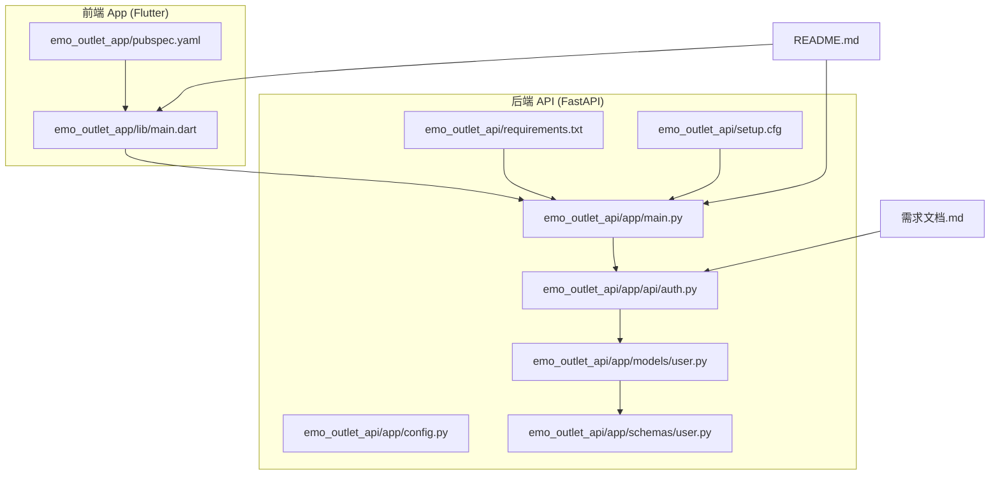
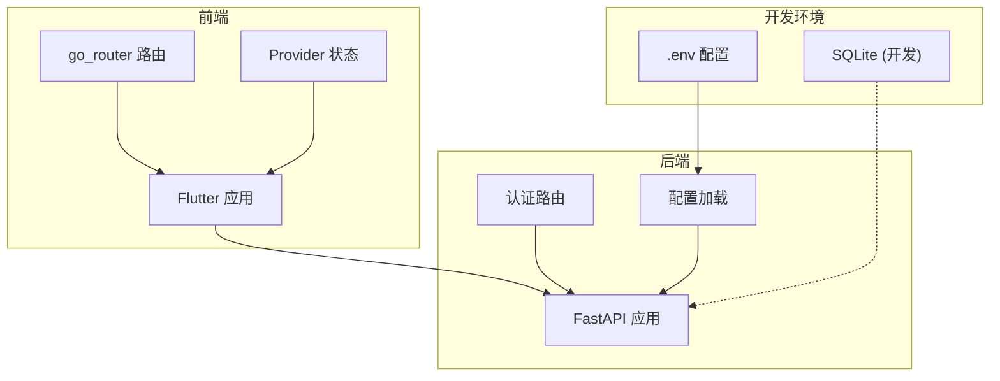
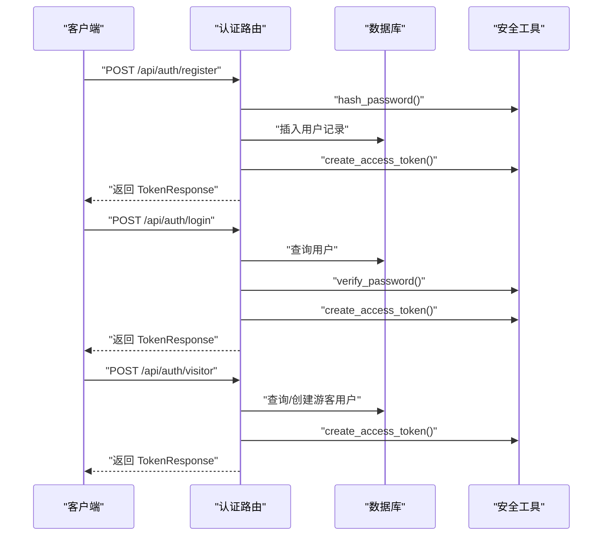
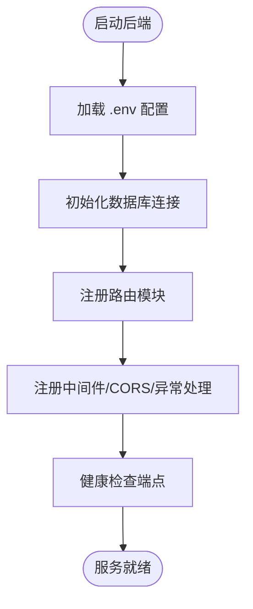
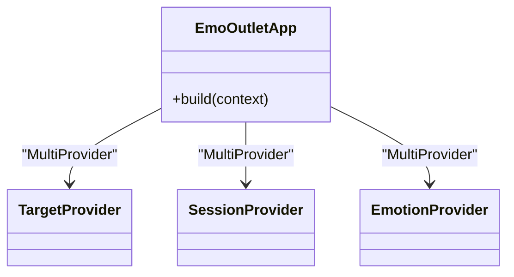
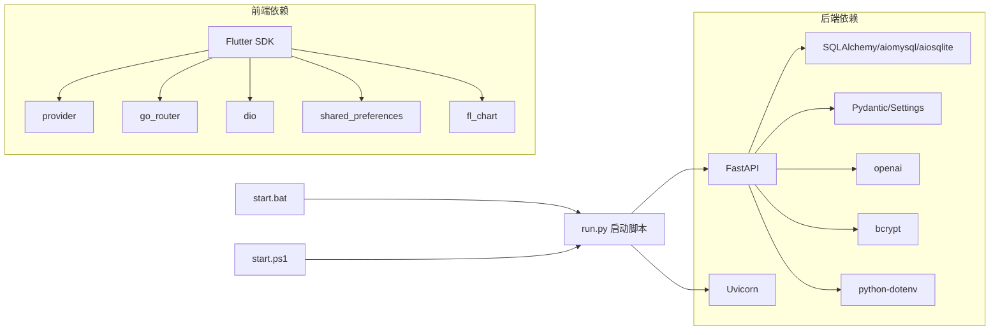

# 贡献指南与协作

<cite>
**本文引用的文件**
- [README.md](file://README.md)
- [需求文档.md](file://需求文档.md)
- [emo_outlet_api/app/main.py](file://emo_outlet_api/app/main.py)
- [emo_outlet_api/run.py](file://emo_outlet_api/run.py)
- [start.bat](file://start.bat)
- [start.ps1](file://start.ps1)
- [emo_outlet_api/requirements.txt](file://emo_outlet_api/requirements.txt)
- [emo_outlet_api/setup.cfg](file://emo_outlet_api/setup.cfg)
- [emo_outlet_api/app/config.py](file://emo_outlet_api/app/config.py)
- [emo_outlet_api/app/api/auth.py](file://emo_outlet_api/app/api/auth.py)
- [emo_outlet_api/app/models/user.py](file://emo_outlet_api/app/models/user.py)
- [emo_outlet_api/app/schemas/user.py](file://emo_outlet_api/app/schemas/user.py)
- [emo_outlet_app/lib/main.dart](file://emo_outlet_app/lib/main.dart)
- [emo_outlet_app/pubspec.yaml](file://emo_outlet_app/pubspec.yaml)
- [emo_outlet_app/README.md](file://emo_outlet_app/README.md)
</cite>

## 目录
1. [引言](#引言)
2. [项目结构](#项目结构)
3. [核心组件](#核心组件)
4. [架构总览](#架构总览)
5. [详细组件分析](#详细组件分析)
6. [依赖分析](#依赖分析)
7. [性能考虑](#性能考虑)
8. [故障排查指南](#故障排查指南)
9. [结论](#结论)
10. [附录](#附录)

## 引言
本指南面向希望参与 Emo Outlet 项目的贡献者，提供从 Fork 到 Pull Request 的完整流程、社区参与规范、行为准则与沟通礼仪、新成员入职路径、知识产权与许可证信息，以及项目治理结构与维护者职责。文档同时结合仓库现有实现，给出可操作的开发与协作建议。

## 项目结构
Emo Outlet 采用前后端分离架构：
- 前端 App：Flutter（Android/macOS），位于 emo_outlet_app/
- 后端 API：Python FastAPI + SQLAlchemy + MySQL/SQLite，位于 emo_outlet_api/
- 产品与需求文档：需求文档.md
- 项目总览与快速开始：README.md

图表来源
- [emo_outlet_app/lib/main.dart:1-97](file://emo_outlet_app/lib/main.dart#L1-L97)
- [emo_outlet_app/pubspec.yaml:1-52](file://emo_outlet_app/pubspec.yaml#L1-L52)
- [emo_outlet_api/app/main.py:1-82](file://emo_outlet_api/app/main.py#L1-L82)
- [emo_outlet_api/app/config.py:1-125](file://emo_outlet_api/app/config.py#L1-L125)
- [emo_outlet_api/app/api/auth.py:1-318](file://emo_outlet_api/app/api/auth.py#L1-L318)
- [emo_outlet_api/app/models/user.py:1-52](file://emo_outlet_api/app/models/user.py#L1-L52)
- [emo_outlet_api/app/schemas/user.py:1-74](file://emo_outlet_api/app/schemas/user.py#L1-L74)
- [emo_outlet_api/requirements.txt:1-29](file://emo_outlet_api/requirements.txt#L1-L29)
- [emo_outlet_api/setup.cfg:1-18](file://emo_outlet_api/setup.cfg#L1-L18)
- [README.md:1-151](file://README.md#L1-L151)
- [需求文档.md:1-449](file://需求文档.md#L1-L449)

章节来源
- [README.md:1-151](file://README.md#L1-L151)
- [需求文档.md:1-449](file://需求文档.md#L1-L449)

## 核心组件
- 前端应用：基于 Flutter，使用 Provider 管理状态，Material3 主题，路由 go_router，网络 dio，图表 fl_chart，本地存储 shared_preferences 等。
- 后端 API：FastAPI 应用，注册异常处理器、CORS 中间件、健康检查端点，包含认证、会话、消息、海报、支持等路由模块。
- 配置中心：Pydantic Settings 加载 .env，支持数据库、Redis、JWT、AI 服务提供商、方言词库、合规与风控参数。
- 认证与用户：用户模型、登录/注册/游客登录、资料详情读取与更新、数据导出与注销。

章节来源
- [emo_outlet_app/lib/main.dart:1-97](file://emo_outlet_app/lib/main.dart#L1-L97)
- [emo_outlet_app/pubspec.yaml:1-52](file://emo_outlet_app/pubspec.yaml#L1-L52)
- [emo_outlet_api/app/main.py:1-82](file://emo_outlet_api/app/main.py#L1-L82)
- [emo_outlet_api/app/config.py:1-125](file://emo_outlet_api/app/config.py#L1-L125)
- [emo_outlet_api/app/api/auth.py:1-318](file://emo_outlet_api/app/api/auth.py#L1-L318)
- [emo_outlet_api/app/models/user.py:1-52](file://emo_outlet_api/app/models/user.py#L1-L52)
- [emo_outlet_api/app/schemas/user.py:1-74](file://emo_outlet_api/app/schemas/user.py#L1-L74)

## 架构总览
后端以 FastAPI 为核心，通过路由模块组织业务域；前端通过 Dio 调用后端 API；配置通过 .env 注入；开发环境可使用 SQLite，生产环境可切换至 MySQL/Redis/OSS 等。

图表来源
- [emo_outlet_api/app/main.py:1-82](file://emo_outlet_api/app/main.py#L1-L82)
- [emo_outlet_api/app/config.py:1-125](file://emo_outlet_api/app/config.py#L1-L125)
- [emo_outlet_app/lib/main.dart:1-97](file://emo_outlet_app/lib/main.dart#L1-L97)

## 详细组件分析

### 认证与用户模块（后端）
该模块负责用户注册、登录、游客登录、资料读取与更新、数据导出与注销，使用 Pydantic 校验请求，SQLAlchemy ORM 操作数据库，JWT 生成访问令牌。

图表来源
- [emo_outlet_api/app/api/auth.py:1-318](file://emo_outlet_api/app/api/auth.py#L1-L318)
- [emo_outlet_api/app/models/user.py:1-52](file://emo_outlet_api/app/models/user.py#L1-L52)
- [emo_outlet_api/app/schemas/user.py:1-74](file://emo_outlet_api/app/schemas/user.py#L1-L74)

章节来源
- [emo_outlet_api/app/api/auth.py:1-318](file://emo_outlet_api/app/api/auth.py#L1-L318)
- [emo_outlet_api/app/models/user.py:1-52](file://emo_outlet_api/app/models/user.py#L1-L52)
- [emo_outlet_api/app/schemas/user.py:1-74](file://emo_outlet_api/app/schemas/user.py#L1-L74)

### 配置与启动（后端）
- 配置：通过 Settings 读取 .env，支持数据库、Redis、JWT、AI 服务、方言词库、合规与风控参数。
- 启动：run.py 提供开发/生产启动与 Docker 部署说明；main.py 注册中间件、异常处理器、路由，并提供健康检查端点。

图表来源
- [emo_outlet_api/app/config.py:1-125](file://emo_outlet_api/app/config.py#L1-L125)
- [emo_outlet_api/app/main.py:1-82](file://emo_outlet_api/app/main.py#L1-L82)
- [emo_outlet_api/run.py:1-31](file://emo_outlet_api/run.py#L1-L31)

章节来源
- [emo_outlet_api/app/config.py:1-125](file://emo_outlet_api/app/config.py#L1-L125)
- [emo_outlet_api/app/main.py:1-82](file://emo_outlet_api/app/main.py#L1-L82)
- [emo_outlet_api/run.py:1-31](file://emo_outlet_api/run.py#L1-L31)

### 前端应用（Flutter）
- 主题与样式：Material3 主题、颜色/字体/圆角等设计系统，底部导航栏与按钮样式统一。
- 状态管理：Provider 管理 Target、Session、Emotion 等状态。
- 依赖：go_router 路由、dio 网络、shared_preferences 本地存储、fl_chart 图表、intl/uuid/path_provider/image_picker 等工具库。

图表来源
- [emo_outlet_app/lib/main.dart:1-97](file://emo_outlet_app/lib/main.dart#L1-L97)

章节来源
- [emo_outlet_app/lib/main.dart:1-97](file://emo_outlet_app/lib/main.dart#L1-L97)
- [emo_outlet_app/pubspec.yaml:1-52](file://emo_outlet_app/pubspec.yaml#L1-L52)

## 依赖分析
- 后端依赖：FastAPI、Uvicorn、SQLAlchemy/aiomysql/aiosqlite、Alembic、Pydantic/Settings、python-dotenv、bcrypt、httpx、openai 等。
- 前端依赖：Flutter SDK、provider、go_router、dio、shared_preferences、share_plus、fl_chart、intl、uuid、path_provider、image_picker、cached_network_image 等。
- 开发与运行：run.py 提供开发/生产启动命令；start.bat/start.ps1 提供一键启动后端与前端（若已安装 Flutter）。

图表来源
- [emo_outlet_api/requirements.txt:1-29](file://emo_outlet_api/requirements.txt#L1-L29)
- [emo_outlet_api/run.py:1-31](file://emo_outlet_api/run.py#L1-L31)
- [start.bat:1-43](file://start.bat#L1-L43)
- [start.ps1:1-65](file://start.ps1#L1-L65)
- [emo_outlet_app/pubspec.yaml:1-52](file://emo_outlet_app/pubspec.yaml#L1-L52)

章节来源
- [emo_outlet_api/requirements.txt:1-29](file://emo_outlet_api/requirements.txt#L1-L29)
- [emo_outlet_api/run.py:1-31](file://emo_outlet_api/run.py#L1-L31)
- [start.bat:1-43](file://start.bat#L1-L43)
- [start.ps1:1-65](file://start.ps1#L1-L65)
- [emo_outlet_app/pubspec.yaml:1-52](file://emo_outlet_app/pubspec.yaml#L1-L52)

## 性能考虑
- 后端
  - 使用异步 SQLAlchemy（aiomysql/aiosqlite）提升并发。
  - 合理设置数据库连接池与超时，避免阻塞。
  - 仅在必要时启用审计日志采样率，降低开销。
- 前端
  - Provider 精准管理状态，避免不必要的重建。
  - 图表与图片懒加载，减少首屏压力。
  - 本地缓存与网络请求超时重试策略。

## 故障排查指南
- 后端启动
  - 确认 .env 配置项齐全，尤其是数据库与 AI 服务相关变量。
  - 开发环境可留空 DATABASE_URL 以使用 SQLite。
  - 健康检查端点 /health 用于确认服务可用。
- 前端联调
  - 确保后端已启动且端口正确。
  - 若使用浏览器调试，注意跨域与证书问题。
- 一键启动
  - Windows 下可使用 start.bat 或 start.ps1，若未检测到 Flutter，将提示手动运行。

章节来源
- [emo_outlet_api/app/main.py:66-82](file://emo_outlet_api/app/main.py#L66-L82)
- [emo_outlet_api/app/config.py:28-40](file://emo_outlet_api/app/config.py#L28-L40)
- [emo_outlet_api/run.py:1-31](file://emo_outlet_api/run.py#L1-L31)
- [start.bat:1-43](file://start.bat#L1-L43)
- [start.ps1:1-65](file://start.ps1#L1-L65)

## 结论
本指南提供了从环境搭建到贡献协作的全流程建议。请在提交前确保遵循代码风格与测试要求，在发起 Pull Request 前进行充分自测与文档更新。感谢每一位贡献者的付出。

## 附录

### 贡献流程（Fork 到 PR）
- Fork 仓库到个人账号
- 创建功能分支（建议以 issue 编号命名）
- 提交代码并编写变更说明
- 发起 Pull Request，填写模板中的必要信息
- 等待代码评审与 CI 检查，根据评审意见修改
- 合并后清理分支

### Issue 报告与功能请求
- Issue 类型：Bug 报告、功能请求、安全问题、文档改进
- 提供：复现步骤、期望结果、实际结果、环境信息（操作系统、Flutter/FastAPI 版本、依赖版本）
- Bug 报告需包含最小可复现步骤与日志片段

### 代码评审标准
- 功能正确性与边界条件处理
- 代码可读性与注释完整性
- 性能影响与资源占用
- 安全性（敏感信息处理、输入校验、权限控制）
- 兼容性与向后兼容
- 测试覆盖率与测试用例质量

### 沟通规范与行为准则
- 礼貌与尊重，避免人身攻击
- 明确表达观点，提供事实依据
- 遵守开源社区通用礼仪
- 遇分歧时寻求共识，必要时由维护者裁决

### 新成员入职指南
- 项目背景：阅读 README 与需求文档，理解产品定位与核心价值
- 技术栈：后端 Python/FastAPI/SQLAlchemy，前端 Flutter/Dart
- 学习路径：后端从配置与路由入手，前端从主题与 Provider 状态管理入手
- 导师制度：建议为新成员分配导师，协助完成首次贡献
- 技能评估：以首次 PR 的质量与后续贡献频率为评估依据

### 知识产权与许可证
- 许可证：MIT License © 2026 xiyao1203
- 贡献者需保证拥有相应权利，遵守许可证条款
- 代码版权归属：贡献者个人，授权 MIT 许可

### 项目治理与维护者
- 维护者职责：代码评审、问题分类与指派、版本发布、社区协调
- 决策流程：重大变更通过 Issue 讨论与 PR 评审，必要时由维护者投票决定
- 路线图制定：结合需求文档与社区反馈，按迭代周期推进
- 社区发展：鼓励文档改进、Bug 修复、功能扩展与安全加固

章节来源
- [README.md:148-151](file://README.md#L148-L151)
- [需求文档.md:1-449](file://需求文档.md#L1-L449)