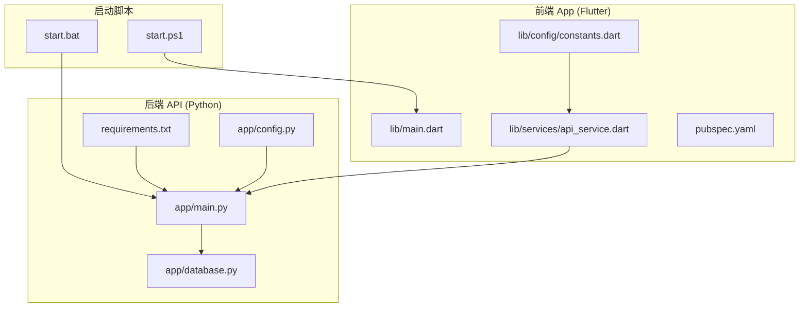
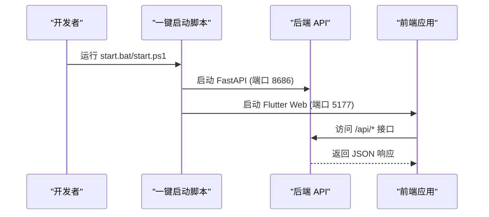
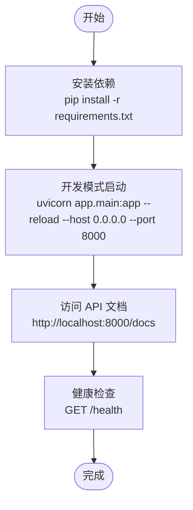
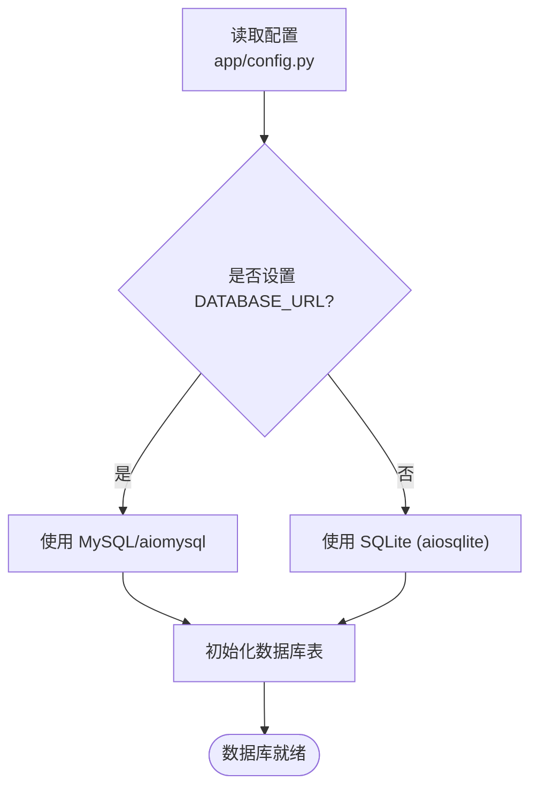
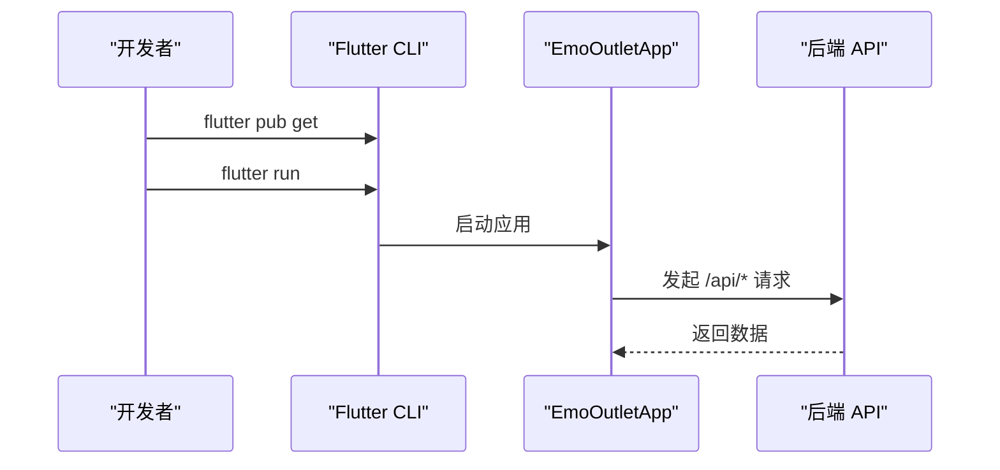
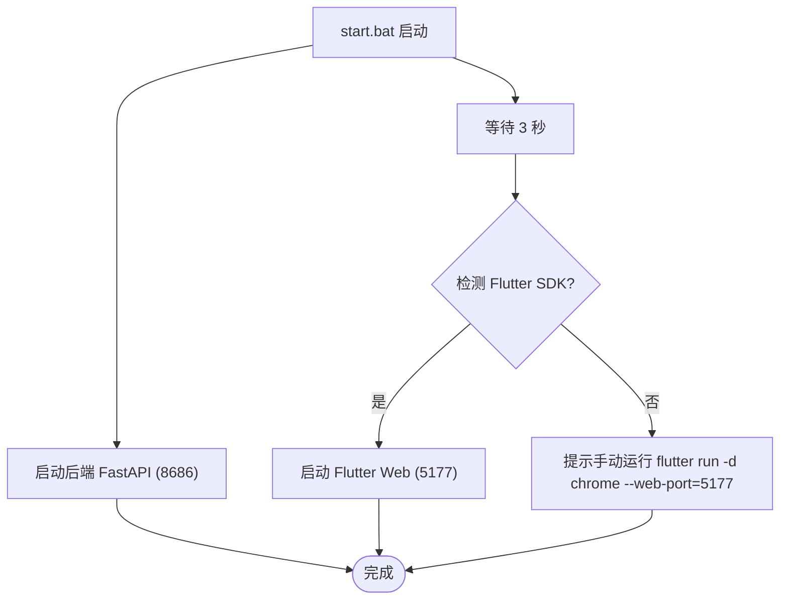
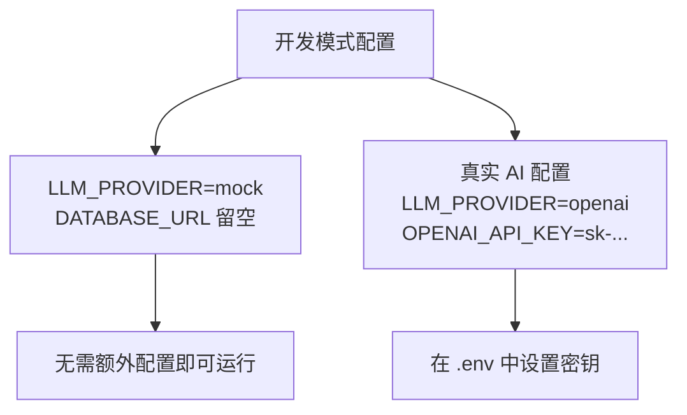
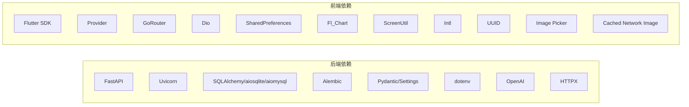

# 快速开始

<cite>
**本文引用的文件**
- [README.md](file://README.md)
- [start.bat](file://start.bat)
- [start.ps1](file://start.ps1)
- [emo_outlet_api/requirements.txt](file://emo_outlet_api/requirements.txt)
- [emo_outlet_api/run.py](file://emo_outlet_api/run.py)
- [emo_outlet_api/app/main.py](file://emo_outlet_api/app/main.py)
- [emo_outlet_api/app/config.py](file://emo_outlet_api/app/config.py)
- [emo_outlet_api/app/database.py](file://emo_outlet_api/app/database.py)
- [emo_outlet_api/app/services/emotion_service.py](file://emo_outlet_api/app/services/emotion_service.py)
- [emo_outlet_app/pubspec.yaml](file://emo_outlet_app/pubspec.yaml)
- [emo_outlet_app/lib/main.dart](file://emo_outlet_app/lib/main.dart)
- [emo_outlet_app/lib/config/constants.dart](file://emo_outlet_app/lib/config/constants.dart)
- [emo_outlet_app/lib/services/api_service.dart](file://emo_outlet_app/lib/services/api_service.dart)
</cite>

## 目录
1. [简介](#简介)
2. [项目结构](#项目结构)
3. [核心组件](#核心组件)
4. [架构总览](#架构总览)
5. [详细组件分析](#详细组件分析)
6. [依赖分析](#依赖分析)
7. [性能考虑](#性能考虑)
8. [故障排查指南](#故障排查指南)
9. [结论](#结论)
10. [附录](#附录)

## 简介
本指南面向新手开发者，帮助你在最短时间内成功运行 Emo Outlet 项目。你将学到如何准备环境（Python 3.8+、Flutter SDK、MySQL/SQLite）、启动后端 API 服务（依赖安装、环境变量与开发模式）、运行前端应用（Flutter 依赖安装、设备连接、应用启动）、使用一键启动脚本以及区分开发模式下的 Mock AI 与真实 AI 的配置差异。

## 项目结构
项目采用前后端分离架构：
- 后端 API：基于 Python FastAPI + SQLAlchemy，支持 MySQL/SQLite，提供认证、目标、会话、消息、海报、报告等接口。
- 前端 App：基于 Flutter，提供多页面、状态管理、网络请求、主题与本地存储等能力。
- 一键启动：Windows 下提供批处理与 PowerShell 脚本，同时启动后端与前端。

**图表来源**
- [emo_outlet_api/app/main.py:1-82](file://emo_outlet_api/app/main.py#L1-L82)
- [emo_outlet_api/app/config.py:1-125](file://emo_outlet_api/app/config.py#L1-L125)
- [emo_outlet_api/app/database.py:1-43](file://emo_outlet_api/app/database.py#L1-L43)
- [emo_outlet_api/requirements.txt:1-29](file://emo_outlet_api/requirements.txt#L1-L29)
- [emo_outlet_app/lib/main.dart:1-97](file://emo_outlet_app/lib/main.dart#L1-L97)
- [emo_outlet_app/lib/config/constants.dart:1-83](file://emo_outlet_app/lib/config/constants.dart#L1-L83)
- [emo_outlet_app/lib/services/api_service.dart:1-381](file://emo_outlet_app/lib/services/api_service.dart#L1-L381)
- [start.bat:1-43](file://start.bat#L1-L43)
- [start.ps1:1-65](file://start.ps1#L1-L65)

**章节来源**
- [README.md:32-56](file://README.md#L32-L56)
- [emo_outlet_api/app/main.py:1-82](file://emo_outlet_api/app/main.py#L1-L82)
- [emo_outlet_app/lib/main.dart:1-97](file://emo_outlet_app/lib/main.dart#L1-L97)

## 核心组件
- 后端 API 服务：提供健康检查、CORS 支持、路由注册、数据库初始化与关闭生命周期管理。
- 配置系统：集中管理数据库、Redis、JWT、AI Provider、合规与安全策略等配置项，并支持从 .env 文件加载。
- 数据库层：根据 DATABASE_URL 或默认 SQLite 自动选择数据源，初始化表结构。
- 前端应用：以 Provider 管理状态，统一的 API 服务封装，常量配置定义基础参数与枚举映射。
- 一键启动脚本：Windows 下同时启动后端（FastAPI）与前端（Flutter Web），并提示访问地址。

**章节来源**
- [emo_outlet_api/app/main.py:1-82](file://emo_outlet_api/app/main.py#L1-L82)
- [emo_outlet_api/app/config.py:1-125](file://emo_outlet_api/app/config.py#L1-L125)
- [emo_outlet_api/app/database.py:1-43](file://emo_outlet_api/app/database.py#L1-L43)
- [emo_outlet_app/lib/main.dart:1-97](file://emo_outlet_app/lib/main.dart#L1-L97)
- [emo_outlet_app/lib/config/constants.dart:1-83](file://emo_outlet_app/lib/config/constants.dart#L1-L83)
- [emo_outlet_app/lib/services/api_service.dart:1-381](file://emo_outlet_app/lib/services/api_service.dart#L1-L381)
- [start.bat:1-43](file://start.bat#L1-L43)
- [start.ps1:1-65](file://start.ps1#L1-L65)

## 架构总览
后端通过 FastAPI 暴露 REST 接口，前端通过 Dio 统一发起请求；数据库默认使用 SQLite（无需安装 MySQL），开发模式下可直接运行。一键启动脚本会分别启动后端（默认 8686 端口）与前端（默认 5177 端口）。

**图表来源**
- [start.bat:1-43](file://start.bat#L1-L43)
- [start.ps1:1-65](file://start.ps1#L1-L65)
- [emo_outlet_api/app/main.py:66-82](file://emo_outlet_api/app/main.py#L66-L82)
- [emo_outlet_app/lib/config/constants.dart:8](file://emo_outlet_app/lib/config/constants.dart#L8)

## 详细组件分析

### 后端 API：环境准备与启动
- Python 版本要求：Python 3.8+（推荐使用 3.10+）
- 依赖安装：进入后端目录，安装 requirements.txt 中声明的包
- 开发模式启动：使用 Uvicorn 在 0.0.0.0:8000（或脚本默认 8686）启动，启用热重载
- API 文档：访问 http://localhost:8000/docs（或 8686）查看 Swagger UI
- 健康检查：访问 /health 确认服务可用

**图表来源**
- [emo_outlet_api/requirements.txt:1-29](file://emo_outlet_api/requirements.txt#L1-L29)
- [emo_outlet_api/run.py:1-31](file://emo_outlet_api/run.py#L1-L31)
- [emo_outlet_api/app/main.py:66-82](file://emo_outlet_api/app/main.py#L66-L82)

**章节来源**
- [README.md:34-44](file://README.md#L34-L44)
- [emo_outlet_api/requirements.txt:1-29](file://emo_outlet_api/requirements.txt#L1-L29)
- [emo_outlet_api/run.py:1-31](file://emo_outlet_api/run.py#L1-L31)
- [emo_outlet_api/app/main.py:1-82](file://emo_outlet_api/app/main.py#L1-L82)

### 数据库配置：MySQL 与 SQLite
- 默认行为：若未设置 DATABASE_URL，则自动使用 SQLite（无需安装 MySQL）
- 生产环境：设置 DATABASE_URL 或配置 DB_HOST/DB_PORT/DB_USER/DB_PASSWORD/DB_NAME
- 初始化：应用启动时自动创建所有表

**图表来源**
- [emo_outlet_api/app/config.py:22-41](file://emo_outlet_api/app/config.py#L22-L41)
- [emo_outlet_api/app/database.py:8-38](file://emo_outlet_api/app/database.py#L8-L38)

**章节来源**
- [emo_outlet_api/app/config.py:22-41](file://emo_outlet_api/app/config.py#L22-L41)
- [emo_outlet_api/app/database.py:8-38](file://emo_outlet_api/app/database.py#L8-L38)

### 前端应用：Flutter 依赖与运行
- 依赖安装：进入前端目录，执行 flutter pub get
- 运行方式：flutter run 启动模拟器或连接设备；也可使用 Web 调试（Chrome）
- 首次运行提示：需先启动后端 API，或修改前端 baseUrl 指向实际后端地址
- 主题与状态：应用入口在 main.dart，使用 Provider 管理目标、会话、情绪状态

**图表来源**
- [emo_outlet_app/pubspec.yaml:1-52](file://emo_outlet_app/pubspec.yaml#L1-L52)
- [emo_outlet_app/lib/main.dart:1-97](file://emo_outlet_app/lib/main.dart#L1-L97)
- [emo_outlet_app/lib/config/constants.dart:8](file://emo_outlet_app/lib/config/constants.dart#L8)

**章节来源**
- [README.md:46-54](file://README.md#L46-L54)
- [emo_outlet_app/pubspec.yaml:1-52](file://emo_outlet_app/pubspec.yaml#L1-L52)
- [emo_outlet_app/lib/main.dart:1-97](file://emo_outlet_app/lib/main.dart#L1-L97)
- [emo_outlet_app/lib/config/constants.dart:1-83](file://emo_outlet_app/lib/config/constants.dart#L1-L83)

### 一键启动脚本：Windows
- start.bat：启动后端（默认 8686），稍等 3 秒后尝试启动前端（Chrome Web，端口 5177）。若未检测到 Flutter SDK，会提示手动运行
- start.ps1：同上，但使用 PowerShell 实现，输出更友好

**图表来源**
- [start.bat:1-43](file://start.bat#L1-L43)
- [start.ps1:1-65](file://start.ps1#L1-L65)

**章节来源**
- [start.bat:1-43](file://start.bat#L1-L43)
- [start.ps1:1-65](file://start.ps1#L1-L65)

### 开发模式与 AI 配置：Mock 与真实 AI
- 开发模式（无需 API Key）：LLM_PROVIDER=mock，DATABASE_URL 留空自动使用 SQLite
- 真实 AI 接入：在 .env 中设置 LLM_PROVIDER=openai 与对应密钥（如 OPENAI_API_KEY）

**图表来源**
- [README.md:130-146](file://README.md#L130-L146)
- [emo_outlet_api/app/config.py:63-76](file://emo_outlet_api/app/config.py#L63-L76)

**章节来源**
- [README.md:130-146](file://README.md#L130-L146)
- [emo_outlet_api/app/config.py:63-76](file://emo_outlet_api/app/config.py#L63-L76)

## 依赖分析
- 后端依赖：FastAPI、Uvicorn、SQLAlchemy/aiosqlite/aiomysql、Alembic、Pydantic/Settings、dotenv、OpenAI、HTTPX 等
- 前端依赖：Flutter SDK、Provider、GoRouter、Dio、Shared Preferences、Fl_Chart、ScreenUtil、Intl、UUID、Image Picker、Cached Network Image 等

**图表来源**
- [emo_outlet_api/requirements.txt:1-29](file://emo_outlet_api/requirements.txt#L1-L29)
- [emo_outlet_app/pubspec.yaml:1-52](file://emo_outlet_app/pubspec.yaml#L1-L52)

**章节来源**
- [emo_outlet_api/requirements.txt:1-29](file://emo_outlet_api/requirements.txt#L1-L29)
- [emo_outlet_app/pubspec.yaml:1-52](file://emo_outlet_app/pubspec.yaml#L1-L52)

## 性能考虑
- 开发阶段：使用 SQLite，避免外部数据库部署成本；Uvicorn --reload 便于快速迭代
- 生产部署：建议使用 MySQL，配合多进程与固定端口运行；合理设置超时与并发
- 前端：使用 Dio 缓存与合理的超时配置，避免频繁重复请求

[本节为通用指导，无需特定文件引用]

## 故障排查指南
- 后端无法启动
  - 确认 Python 版本满足要求（3.8+）
  - 在后端目录执行依赖安装
  - 检查端口占用，必要时修改默认端口
- 前端无法连接后端
  - 确认后端已启动且可访问
  - 若使用自定义端口，请同步修改前端 baseUrl
- 一键启动脚本未检测到 Flutter
  - 手动执行 flutter run -d chrome --web-port=5177
- 数据库异常
  - 开发模式下无需 MySQL，确认未设置 DATABASE_URL
  - 如需切换至 MySQL，请正确配置数据库连接信息

**章节来源**
- [start.bat:21-30](file://start.bat#L21-L30)
- [start.ps1:34-51](file://start.ps1#L34-L51)
- [emo_outlet_app/lib/config/constants.dart:8](file://emo_outlet_app/lib/config/constants.dart#L8)
- [emo_outlet_api/app/config.py:22-41](file://emo_outlet_api/app/config.py#L22-L41)

## 结论
按照本指南，你可以快速完成环境准备、启动后端 API、运行前端应用，并通过一键启动脚本实现前后端协同工作。开发模式下无需配置真实 AI Key 即可体验完整功能；如需接入真实 AI，请在 .env 中添加相应密钥与基础地址。

## 附录
- 常用命令与端口
  - 后端：cd emo_outlet_api && pip install -r requirements.txt && python -m uvicorn app.main:app --reload --host 0.0.0.0 --port 8000
  - 前端：cd emo_outlet_app && flutter pub get && flutter run
  - 一键启动：双击 start.bat 或运行 start.ps1
- API 文档：http://localhost:8000/docs（或 8686）
- 健康检查：http://localhost:8000/health（或 8686）

**章节来源**
- [README.md:32-56](file://README.md#L32-L56)
- [emo_outlet_api/run.py:1-31](file://emo_outlet_api/run.py#L1-L31)
- [start.bat:1-43](file://start.bat#L1-L43)
- [start.ps1:1-65](file://start.ps1#L1-L65)