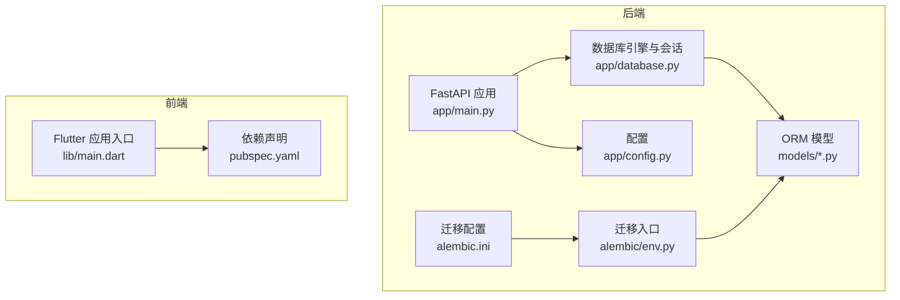
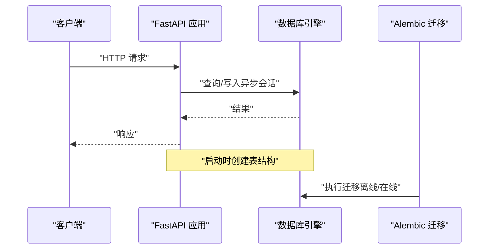
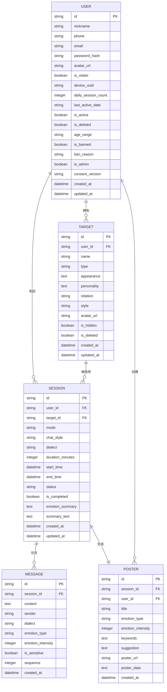
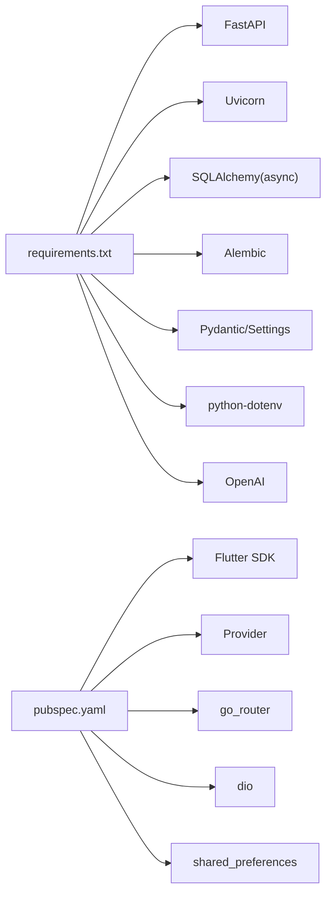

# 升级与迁移策略

<cite>
**本文引用的文件**
- [emo_outlet_api/requirements.txt](file://emo_outlet_api/requirements.txt)
- [emo_outlet_app/pubspec.yaml](file://emo_outlet_app/pubspec.yaml)
- [emo_outlet_api/alembic/env.py](file://emo_outlet_api/alembic/env.py)
- [emo_outlet_api/alembic.ini](file://emo_outlet_api/alembic.ini)
- [emo_outlet_api/app/config.py](file://emo_outlet_api/app/config.py)
- [emo_outlet_api/app/main.py](file://emo_outlet_api/app/main.py)
- [emo_outlet_api/app/database.py](file://emo_outlet_api/app/database.py)
- [emo_outlet_api/app/models/user.py](file://emo_outlet_api/app/models/user.py)
- [emo_outlet_api/app/models/target.py](file://emo_outlet_api/app/models/target.py)
- [emo_outlet_api/app/models/session.py](file://emo_outlet_api/app/models/session.py)
- [emo_outlet_api/app/models/message.py](file://emo_outlet_api/app/models/message.py)
- [emo_outlet_api/app/models/poster.py](file://emo_outlet_api/app/models/poster.py)
- [emo_outlet_api/run.py](file://emo_outlet_api/run.py)
- [emo_outlet_app/lib/main.dart](file://emo_outlet_app/lib/main.dart)
- [emo_outlet_api/setup.cfg](file://emo_outlet_api/setup.cfg)
</cite>

## 目录
1. [简介](#简介)
2. [项目结构](#项目结构)
3. [核心组件](#核心组件)
4. [架构总览](#架构总览)
5. [详细组件分析](#详细组件分析)
6. [依赖分析](#依赖分析)
7. [性能考虑](#性能考虑)
8. [故障排查指南](#故障排查指南)
9. [结论](#结论)
10. [附录](#附录)

## 简介
本策略文档面向 Emo Outlet 项目的版本升级与迁移工作，覆盖后端 Python 依赖升级、前端 Flutter 包升级以及数据库结构变更的完整流程。内容包括：升级前准备（环境检查、数据备份、风险评估）、升级过程中的监控与回滚策略（灰度发布、功能开关、紧急回滚）、升级后的验证与性能回归测试，以及版本兼容性矩阵与升级注意事项清单。文中所有技术细节均基于仓库现有实现与配置文件。

## 项目结构
Emo Outlet 采用前后端分离架构：
- 后端：FastAPI + SQLAlchemy(async) + Alembic，通过异步引擎连接数据库，支持 SQLite 和 MySQL。
- 前端：Flutter 应用，使用 Provider 管理状态，Material Design 主题。
- 数据库：通过模型定义与 Alembic 进行结构迁移；开发默认 SQLite，生产默认 MySQL。

图表来源
- [emo_outlet_api/app/main.py:1-82](file://emo_outlet_api/app/main.py#L1-L82)
- [emo_outlet_api/app/config.py:1-125](file://emo_outlet_api/app/config.py#L1-L125)
- [emo_outlet_api/app/database.py:1-43](file://emo_outlet_api/app/database.py#L1-L43)
- [emo_outlet_api/alembic/env.py:1-71](file://emo_outlet_api/alembic/env.py#L1-L71)
- [emo_outlet_api/alembic.ini:1-38](file://emo_outlet_api/alembic.ini#L1-L38)
- [emo_outlet_api/app/models/user.py:1-52](file://emo_outlet_api/app/models/user.py#L1-L52)
- [emo_outlet_api/app/models/target.py:1-56](file://emo_outlet_api/app/models/target.py#L1-L56)
- [emo_outlet_api/app/models/session.py:1-79](file://emo_outlet_api/app/models/session.py#L1-L79)
- [emo_outlet_api/app/models/message.py:1-46](file://emo_outlet_api/app/models/message.py#L1-L46)
- [emo_outlet_api/app/models/poster.py:1-61](file://emo_outlet_api/app/models/poster.py#L1-L61)
- [emo_outlet_app/lib/main.dart:1-97](file://emo_outlet_app/lib/main.dart#L1-L97)
- [emo_outlet_app/pubspec.yaml:1-52](file://emo_outlet_app/pubspec.yaml#L1-L52)

章节来源
- [emo_outlet_api/app/main.py:1-82](file://emo_outlet_api/app/main.py#L1-L82)
- [emo_outlet_api/app/config.py:1-125](file://emo_outlet_api/app/config.py#L1-L125)
- [emo_outlet_api/app/database.py:1-43](file://emo_outlet_api/app/database.py#L1-L43)
- [emo_outlet_api/alembic/env.py:1-71](file://emo_outlet_api/alembic/env.py#L1-L71)
- [emo_outlet_api/alembic.ini:1-38](file://emo_outlet_api/alembic.ini#L1-L38)
- [emo_outlet_app/lib/main.dart:1-97](file://emo_outlet_app/lib/main.dart#L1-L97)
- [emo_outlet_app/pubspec.yaml:1-52](file://emo_outlet_app/pubspec.yaml#L1-L52)

## 核心组件
- 后端应用生命周期与健康检查：应用在启动时初始化数据库并在关闭时清理连接；提供健康检查端点。
- 配置体系：统一读取环境变量与 .env 文件，支持数据库、Redis、认证、AI 服务、合规与安全参数。
- 数据库层：异步 SQLAlchemy 引擎，自动创建元数据；支持 SQLite 与 MySQL 切换。
- 迁移框架：Alembic 离线/在线迁移，按配置动态选择数据库 URL。
- 前端应用：主题与状态提供者初始化，Material3 设计规范。

章节来源
- [emo_outlet_api/app/main.py:14-82](file://emo_outlet_api/app/main.py#L14-L82)
- [emo_outlet_api/app/config.py:12-125](file://emo_outlet_api/app/config.py#L12-L125)
- [emo_outlet_api/app/database.py:34-43](file://emo_outlet_api/app/database.py#L34-L43)
- [emo_outlet_api/alembic/env.py:26-71](file://emo_outlet_api/alembic/env.py#L26-L71)
- [emo_outlet_app/lib/main.dart:13-97](file://emo_outlet_app/lib/main.dart#L13-L97)

## 架构总览
后端通过 FastAPI 提供 REST 接口，数据库通过 Alembic 管理结构演进；前端以 Flutter 实现用户界面与交互。整体数据流从客户端到后端 API，再到数据库持久化，并通过迁移脚本保障结构一致性。

图表来源
- [emo_outlet_api/app/main.py:14-82](file://emo_outlet_api/app/main.py#L14-L82)
- [emo_outlet_api/app/database.py:34-43](file://emo_outlet_api/app/database.py#L34-L43)
- [emo_outlet_api/alembic/env.py:33-71](file://emo_outlet_api/alembic/env.py#L33-L71)

## 详细组件分析

### 后端 Python 依赖升级策略
- 升级范围：Web 框架、数据库驱动、认证安全、AI/LLM、配置与工具等模块。
- 升级步骤：
  1) 在隔离环境中更新依赖清单并运行单元测试。
  2) 使用迁移工具生成离线 SQL 并人工审查。
  3) 在预生产环境执行在线迁移并验证接口。
  4) 回滚路径：保留旧版本镜像与数据库快照，必要时回退迁移。
- 风险控制：
  - 严格版本锁定与兼容性矩阵校验。
  - 逐步替换关键依赖（如数据库驱动），确保连接池与事务行为一致。
  - 配置项变更需同步更新 .env 与部署脚本。

章节来源
- [emo_outlet_api/requirements.txt:1-29](file://emo_outlet_api/requirements.txt#L1-L29)
- [emo_outlet_api/alembic/env.py:33-71](file://emo_outlet_api/alembic/env.py#L33-L71)
- [emo_outlet_api/run.py:1-31](file://emo_outlet_api/run.py#L1-L31)

### 前端 Flutter 包升级策略
- 升级范围：状态管理、路由、网络请求、本地存储、图表、工具类等。
- 升级步骤：
  1) 更新 pubspec.yaml 中的版本约束，运行依赖解析。
  2) 执行集成测试与 UI 测试，重点验证路由跳转与 Provider 状态。
  3) 在预生产环境进行 A/B 测试或灰度发布。
  4) 回滚路径：恢复上一稳定版本的 APK/APK 包与资源。
- 风险控制：
  - 保持 SDK 版本与编译器兼容。
  - 对第三方插件进行破坏性变更评估，必要时引入功能开关。

章节来源
- [emo_outlet_app/pubspec.yaml:1-52](file://emo_outlet_app/pubspec.yaml#L1-L52)
- [emo_outlet_app/lib/main.dart:1-97](file://emo_outlet_app/lib/main.dart#L1-L97)

### 数据库结构变更与迁移
- 结构现状：用户、目标、会话、消息、海报等模型定义清晰，主键为字符串 UUID，部分字段含注释与默认值。
- 迁移流程：
  1) 使用 Alembic 生成迁移脚本，离线模式生成 SQL 以便审阅。
  2) 在预生产环境执行在线迁移，核对目标元数据与已导入模型。
  3) 迁移完成后执行数据完整性检查与关键查询验证。
- 变更示例（以模型字段为例）：
  - 新增字段：需提供默认值或允许 NULL，并在业务层处理空值。
  - 删除字段：先做数据归档或迁移映射，再删除列。
  - 字段类型变更：优先向后兼容，避免破坏现有索引与查询计划。
- 兼容性检查：
  - ORM 映射与数据库实际结构一致。
  - 外键关系与级联行为符合预期。
  - 查询路径与索引使用无异常。

图表来源
- [emo_outlet_api/app/models/user.py:12-52](file://emo_outlet_api/app/models/user.py#L12-L52)
- [emo_outlet_api/app/models/target.py:13-56](file://emo_outlet_api/app/models/target.py#L13-L56)
- [emo_outlet_api/app/models/session.py:13-79](file://emo_outlet_api/app/models/session.py#L13-L79)
- [emo_outlet_api/app/models/message.py:13-46](file://emo_outlet_api/app/models/message.py#L13-L46)
- [emo_outlet_api/app/models/poster.py:13-61](file://emo_outlet_api/app/models/poster.py#L13-L61)

章节来源
- [emo_outlet_api/app/models/user.py:12-52](file://emo_outlet_api/app/models/user.py#L12-L52)
- [emo_outlet_api/app/models/target.py:13-56](file://emo_outlet_api/app/models/target.py#L13-L56)
- [emo_outlet_api/app/models/session.py:13-79](file://emo_outlet_api/app/models/session.py#L13-L79)
- [emo_outlet_api/app/models/message.py:13-46](file://emo_outlet_api/app/models/message.py#L13-L46)
- [emo_outlet_api/app/models/poster.py:13-61](file://emo_outlet_api/app/models/poster.py#L13-L61)

### 升级前准备
- 环境检查：
  - 后端：确认 Python 版本与依赖版本满足要求；检查 .env 配置项齐全。
  - 前端：确认 Flutter SDK 与编译器版本；清理缓存后重新构建。
  - 数据库：确认可访问性与权限，备份当前数据库。
- 数据备份：
  - 逻辑备份：导出 SQL 或使用数据库自带工具备份。
  - 物理备份：保存数据库文件（SQLite）或快照（MySQL）。
- 风险评估：
  - 识别破坏性变更（删除列、重命名索引、修改主键）。
  - 评估迁移窗口与停机时间，制定回滚预案。

章节来源
- [emo_outlet_api/setup.cfg:3-17](file://emo_outlet_api/setup.cfg#L3-L17)
- [emo_outlet_api/app/config.py:12-125](file://emo_outlet_api/app/config.py#L12-L125)
- [emo_outlet_api/alembic.ini:1-38](file://emo_outlet_api/alembic.ini#L1-L38)

### 升级过程中的监控与回滚策略
- 监控：
  - 后端：健康检查端点、请求耗时日志、异常捕获与告警。
  - 数据库：慢查询、连接数、锁等待与死锁统计。
  - 前端：崩溃上报、关键页面加载时延、用户路径转化率。
- 回滚策略：
  - 后端：回退到上一稳定镜像，必要时回滚 Alembic 版本。
  - 数据库：回滚到迁移前的备份，必要时重建索引。
  - 前端：回退到上一稳定版本的安装包。
- 灰度发布与功能开关：
  - 通过网关或服务注册中心控制流量比例。
  - 引入特性开关（Feature Flag）按用户维度开启/关闭新功能。

章节来源
- [emo_outlet_api/app/main.py:33-82](file://emo_outlet_api/app/main.py#L33-L82)
- [emo_outlet_api/alembic/env.py:33-71](file://emo_outlet_api/alembic/env.py#L33-L71)

### 升级后的验证与性能回归测试
- 功能验证：
  - 关键业务路径（登录、创建目标、发起会话、生成海报）端到端测试。
  - 数据一致性检查（主外键关系、唯一约束、默认值）。
- 性能回归：
  - 接口响应时间、并发吞吐量、内存与 CPU 占用。
  - 数据库查询计划与索引使用情况。
- 监控与告警：
  - 健康检查持续可用，错误率与延迟阈值告警。

章节来源
- [emo_outlet_api/app/main.py:66-82](file://emo_outlet_api/app/main.py#L66-L82)
- [emo_outlet_api/app/database.py:34-43](file://emo_outlet_api/app/database.py#L34-L43)

## 依赖分析
- 后端依赖关系：
  - FastAPI 作为 Web 框架，Uvicorn 作为 ASGI 服务器。
  - SQLAlchemy(async) 与 Alembic 用于 ORM 与迁移。
  - Pydantic/Settings 与 python-dotenv 用于配置管理。
  - OpenAI 用于 AI/LLM 能力。
- 前端依赖关系：
  - Flutter SDK、Provider、go_router、dio、shared_preferences 等。
- 耦合与内聚：
  - 后端各模块通过依赖注入与中间件解耦；数据库层与模型层高内聚。
  - 前端通过 Provider 统一状态管理，屏幕组件低耦合。

图表来源
- [emo_outlet_api/requirements.txt:1-29](file://emo_outlet_api/requirements.txt#L1-L29)
- [emo_outlet_app/pubspec.yaml:1-52](file://emo_outlet_app/pubspec.yaml#L1-L52)

章节来源
- [emo_outlet_api/requirements.txt:1-29](file://emo_outlet_api/requirements.txt#L1-L29)
- [emo_outlet_app/pubspec.yaml:1-52](file://emo_outlet_app/pubspec.yaml#L1-L52)

## 性能考虑
- 后端：
  - 异步 I/O 与连接池配置，避免阻塞；合理设置超时与重试。
  - 数据库查询尽量命中索引，避免 N+1 查询；批量写入减少往返。
- 前端：
  - 控制图片与资源体积，使用懒加载与缓存；避免不必要的重建。
- 迁移：
  - 大表变更分批执行，避开业务高峰期；必要时使用只读副本。

## 故障排查指南
- 健康检查失败：
  - 检查应用日志与异常处理器输出；确认数据库连接与配置项。
- 数据库迁移失败：
  - 审查 Alembic 生成的 SQL 与目标元数据；核对模型导入顺序。
- 前端白屏或崩溃：
  - 查看崩溃日志与堆栈信息；回退到上一版本验证问题是否复现。
- 配置错误：
  - 核对 .env 文件与环境变量；确保敏感配置不泄露。

章节来源
- [emo_outlet_api/app/main.py:66-82](file://emo_outlet_api/app/main.py#L66-L82)
- [emo_outlet_api/alembic/env.py:33-71](file://emo_outlet_api/alembic/env.py#L33-L71)
- [emo_outlet_api/app/config.py:115-125](file://emo_outlet_api/app/config.py#L115-L125)

## 结论
通过严格的升级前准备、受控的迁移流程、完善的监控与回滚机制，以及全面的验证与性能回归测试，Emo Outlet 可以在保证稳定性的同时平滑完成版本升级。建议将此策略固化为标准操作流程（SOP），并定期演练回滚与灰度发布场景。

## 附录

### 版本兼容性矩阵（示例）
- Python 3.11 与 FastAPI 0.109.x、SQLAlchemy 2.0.x、Alembic 1.13.x、OpenAI 1.12.x、Pydantic 2.5.x、Pydantic Settings 2.1.x、Uvicorn 0.27.x、httpx 0.26.x。
- Flutter SDK >=3.0.0 <4.0.0，Provider ^6.1.1，go_router ^14.0.0，dio ^5.4.0，shared_preferences ^2.2.2 等。

章节来源
- [emo_outlet_api/requirements.txt:1-29](file://emo_outlet_api/requirements.txt#L1-L29)
- [emo_outlet_app/pubspec.yaml:6-40](file://emo_outlet_app/pubspec.yaml#L6-L40)
- [emo_outlet_api/setup.cfg:3-4](file://emo_outlet_api/setup.cfg#L3-L4)

### 升级注意事项清单
- 后端
  - 逐项核对依赖版本，确保向后兼容。
  - 迁移前生成离线 SQL 并审阅。
  - 预生产环境充分测试后再上线。
  - 准备数据库与镜像快照。
- 前端
  - 清理缓存并重新构建，避免残留缓存导致的异常。
  - 验证路由、状态与 UI 组件。
  - 准备紧急回滚包。
- 数据库
  - 大表变更分批执行，避免长时间锁表。
  - 迁移后执行完整性检查与关键查询验证。
  - 保留回滚所需的备份与迁移脚本。