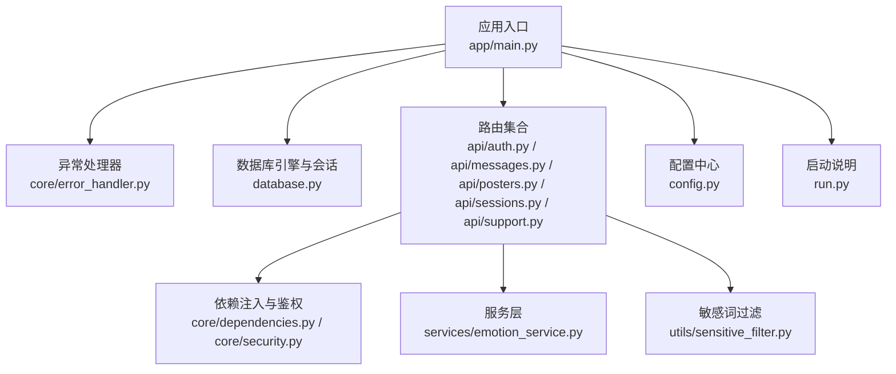
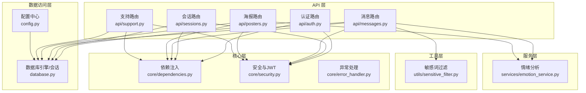
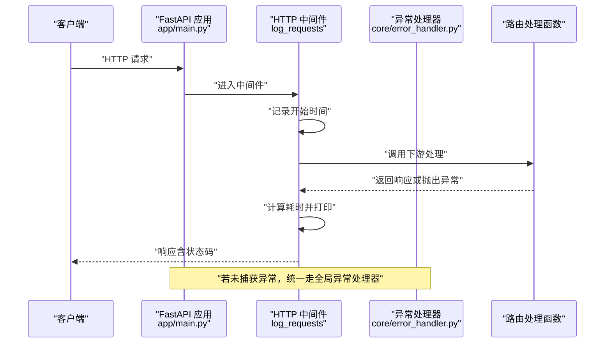
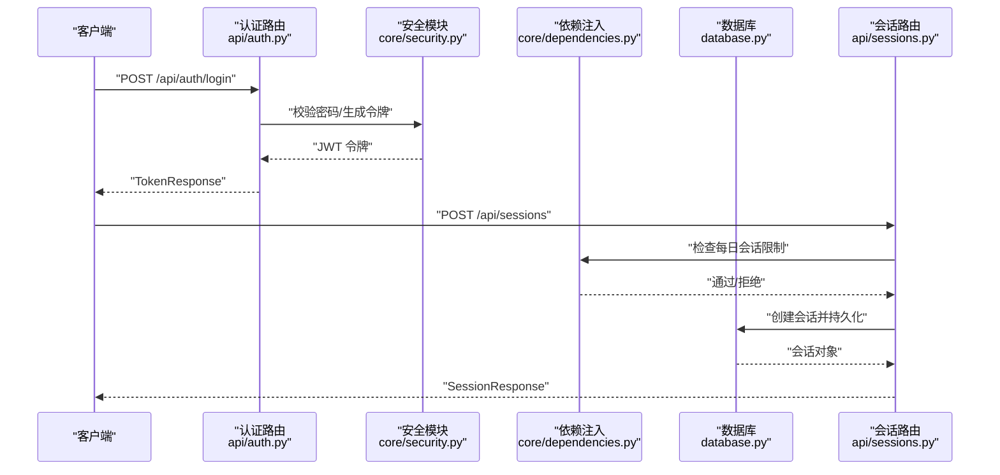
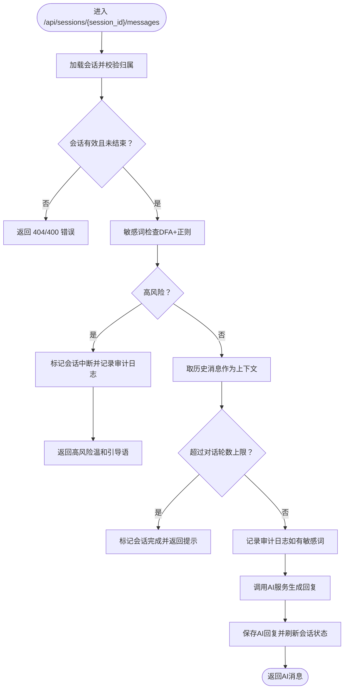
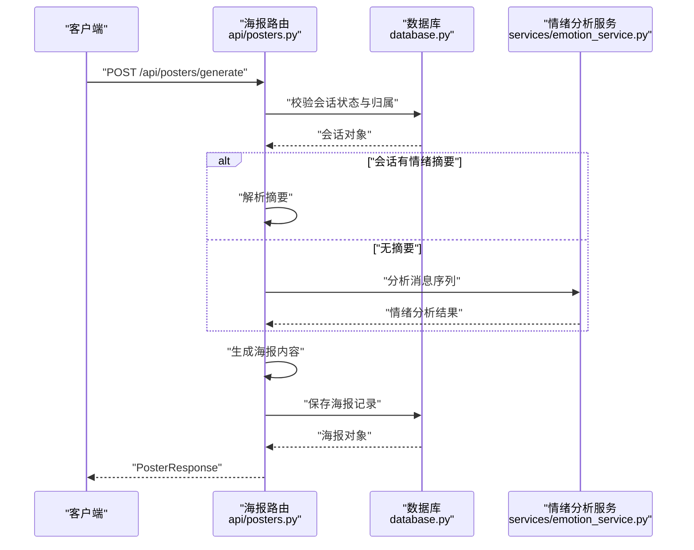
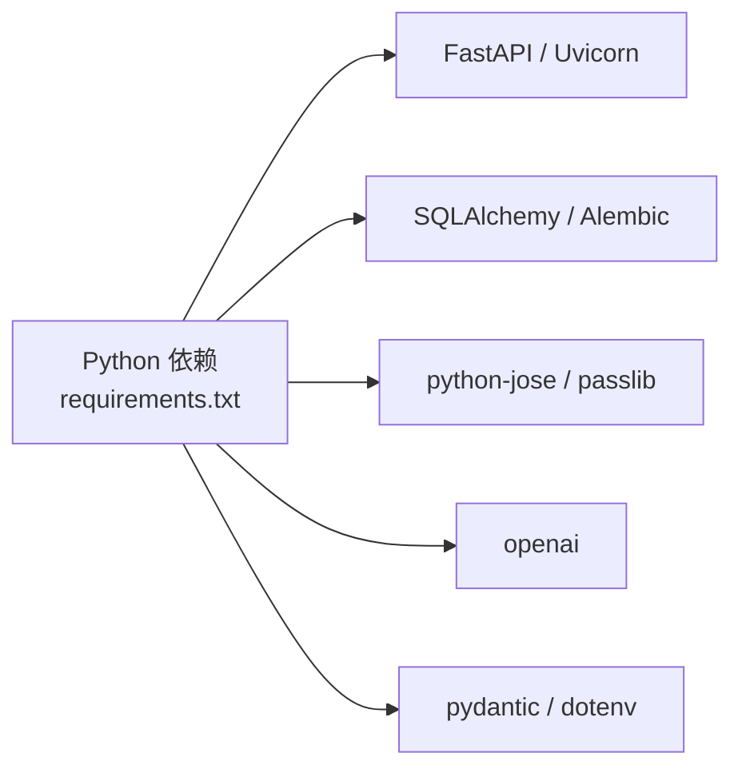

# 故障排除与维护

<cite>
**本文引用的文件**
- [emo_outlet_api/app/main.py](file://emo_outlet_api/app/main.py)
- [emo_outlet_api/run.py](file://emo_outlet_api/run.py)
- [emo_outlet_api/app/config.py](file://emo_outlet_api/app/config.py)
- [emo_outlet_api/app/core/error_handler.py](file://emo_outlet_api/app/core/error_handler.py)
- [emo_outlet_api/app/database.py](file://emo_outlet_api/app/database.py)
- [emo_outlet_api/app/api/auth.py](file://emo_outlet_api/app/api/auth.py)
- [emo_outlet_api/app/api/messages.py](file://emo_outlet_api/app/api/messages.py)
- [emo_outlet_api/app/api/posters.py](file://emo_outlet_api/app/api/posters.py)
- [emo_outlet_api/app/api/sessions.py](file://emo_outlet_api/app/api/sessions.py)
- [emo_outlet_api/app/api/support.py](file://emo_outlet_api/app/api/support.py)
- [emo_outlet_api/app/core/dependencies.py](file://emo_outlet_api/app/core/dependencies.py)
- [emo_outlet_api/app/core/security.py](file://emo_outlet_api/app/core/security.py)
- [emo_outlet_api/app/services/emotion_service.py](file://emo_outlet_api/app/services/emotion_service.py)
- [emo_outlet_api/app/utils/sensitive_filter.py](file://emo_outlet_api/app/utils/sensitive_filter.py)
- [emo_outlet_api/requirements.txt](file://emo_outlet_api/requirements.txt)
</cite>

## 目录
1. [简介](#简介)
2. [项目结构](#项目结构)
3. [核心组件](#核心组件)
4. [架构总览](#架构总览)
5. [详细组件分析](#详细组件分析)
6. [依赖分析](#依赖分析)
7. [性能考虑](#性能考虑)
8. [故障排除指南](#故障排除指南)
9. [调试技巧与工具](#调试技巧与工具)
10. [系统维护操作](#系统维护操作)
11. [升级与迁移策略](#升级与迁移策略)
12. [紧急情况处理与恢复](#紧急情况处理与恢复)
13. [结论](#结论)
14. [附录](#附录)

## 简介
本文件面向Emo Outlet项目的运维与开发团队，提供系统化的故障排除与维护指南。内容覆盖常见错误识别、日志分析方法、性能瓶颈定位、系统健康检查、错误码对照表、调试与工具使用、系统维护操作、升级与迁移策略以及紧急情况处理流程。文档以代码为依据，结合实际文件路径与行号，帮助快速定位问题并制定修复与优化方案。

## 项目结构
后端采用FastAPI框架，按功能模块划分：API路由、核心依赖与安全、数据库与模型、服务层（情绪分析、海报生成）、工具与过滤器等。应用通过统一的生命周期钩子初始化数据库并在健康检查接口中暴露运行状态。

**图示来源**
- [emo_outlet_api/app/main.py:1-82](file://emo_outlet_api/app/main.py#L1-L82)
- [emo_outlet_api/app/core/error_handler.py:1-59](file://emo_outlet_api/app/core/error_handler.py#L1-L59)
- [emo_outlet_api/app/database.py:1-43](file://emo_outlet_api/app/database.py#L1-L43)
- [emo_outlet_api/app/api/auth.py:1-332](file://emo_outlet_api/app/api/auth.py#L1-L332)
- [emo_outlet_api/app/api/messages.py:1-243](file://emo_outlet_api/app/api/messages.py#L1-L243)
- [emo_outlet_api/app/api/posters.py:1-352](file://emo_outlet_api/app/api/posters.py#L1-L352)
- [emo_outlet_api/app/api/sessions.py:1-242](file://emo_outlet_api/app/api/sessions.py#L1-L242)
- [emo_outlet_api/app/api/support.py:1-71](file://emo_outlet_api/app/api/support.py#L1-L71)
- [emo_outlet_api/app/core/dependencies.py:1-67](file://emo_outlet_api/app/core/dependencies.py#L1-L67)
- [emo_outlet_api/app/core/security.py:1-43](file://emo_outlet_api/app/core/security.py#L1-L43)
- [emo_outlet_api/app/services/emotion_service.py:1-181](file://emo_outlet_api/app/services/emotion_service.py#L1-L181)
- [emo_outlet_api/app/utils/sensitive_filter.py:1-142](file://emo_outlet_api/app/utils/sensitive_filter.py#L1-L142)
- [emo_outlet_api/app/config.py:1-125](file://emo_outlet_api/app/config.py#L1-L125)
- [emo_outlet_api/run.py:1-31](file://emo_outlet_api/run.py#L1-L31)

**章节来源**
- [emo_outlet_api/app/main.py:1-82](file://emo_outlet_api/app/main.py#L1-L82)
- [emo_outlet_api/run.py:1-31](file://emo_outlet_api/run.py#L1-L31)

## 核心组件
- 应用生命周期与中间件：通过生命周期钩子初始化/关闭数据库；HTTP中间件打印请求耗时与状态码；CORS跨域配置。
- 统一异常处理：捕获未处理异常、HTTP异常与请求参数校验异常，输出统一JSON结构。
- 数据库连接：支持MySQL与SQLite，异步引擎与会话工厂，自动建表与关闭。
- 路由模块：认证、会话、消息、海报、支持反馈等模块化API。
- 安全与依赖：JWT令牌解析与校验、每日会话次数限制、用户状态检查。
- 服务与工具：情绪分析服务、敏感词过滤（DFA+正则）。

**章节来源**
- [emo_outlet_api/app/main.py:14-82](file://emo_outlet_api/app/main.py#L14-L82)
- [emo_outlet_api/app/core/error_handler.py:10-59](file://emo_outlet_api/app/core/error_handler.py#L10-L59)
- [emo_outlet_api/app/database.py:34-43](file://emo_outlet_api/app/database.py#L34-L43)
- [emo_outlet_api/app/core/dependencies.py:18-67](file://emo_outlet_api/app/core/dependencies.py#L18-L67)
- [emo_outlet_api/app/core/security.py:26-43](file://emo_outlet_api/app/core/security.py#L26-L43)
- [emo_outlet_api/app/services/emotion_service.py:44-181](file://emo_outlet_api/app/services/emotion_service.py#L44-L181)
- [emo_outlet_api/app/utils/sensitive_filter.py:37-142](file://emo_outlet_api/app/utils/sensitive_filter.py#L37-L142)

## 架构总览
系统采用分层架构：API层负责路由与请求处理；核心层负责鉴权与依赖注入；服务层封装业务逻辑；工具层提供敏感词过滤与情绪分析；数据访问层通过SQLAlchemy异步ORM对接数据库。

**图示来源**
- [emo_outlet_api/app/api/auth.py:33-332](file://emo_outlet_api/app/api/auth.py#L33-L332)
- [emo_outlet_api/app/api/sessions.py:53-242](file://emo_outlet_api/app/api/sessions.py#L53-L242)
- [emo_outlet_api/app/api/messages.py:80-243](file://emo_outlet_api/app/api/messages.py#L80-L243)
- [emo_outlet_api/app/api/posters.py:40-352](file://emo_outlet_api/app/api/posters.py#L40-L352)
- [emo_outlet_api/app/api/support.py:21-71](file://emo_outlet_api/app/api/support.py#L21-L71)
- [emo_outlet_api/app/core/dependencies.py:18-67](file://emo_outlet_api/app/core/dependencies.py#L18-L67)
- [emo_outlet_api/app/core/security.py:26-43](file://emo_outlet_api/app/core/security.py#L26-L43)
- [emo_outlet_api/app/core/error_handler.py:54-59](file://emo_outlet_api/app/core/error_handler.py#L54-L59)
- [emo_outlet_api/app/services/emotion_service.py:44-181](file://emo_outlet_api/app/services/emotion_service.py#L44-L181)
- [emo_outlet_api/app/utils/sensitive_filter.py:37-142](file://emo_outlet_api/app/utils/sensitive_filter.py#L37-L142)
- [emo_outlet_api/app/database.py:34-43](file://emo_outlet_api/app/database.py#L34-L43)
- [emo_outlet_api/app/config.py:30-52](file://emo_outlet_api/app/config.py#L30-L52)

## 详细组件分析

### 组件A：请求与异常处理流水线
展示从请求进入、中间件统计耗时、异常捕获到统一响应的完整流程。

**图示来源**
- [emo_outlet_api/app/main.py:33-48](file://emo_outlet_api/app/main.py#L33-L48)
- [emo_outlet_api/app/core/error_handler.py:10-59](file://emo_outlet_api/app/core/error_handler.py#L10-L59)

**章节来源**
- [emo_outlet_api/app/main.py:33-48](file://emo_outlet_api/app/main.py#L33-L48)
- [emo_outlet_api/app/core/error_handler.py:54-59](file://emo_outlet_api/app/core/error_handler.py#L54-L59)

### 组件B：登录与会话创建流程
展示用户登录、令牌签发、每日会话限制检查与会话创建的顺序。

**图示来源**
- [emo_outlet_api/app/api/auth.py:78-94](file://emo_outlet_api/app/api/auth.py#L78-L94)
- [emo_outlet_api/app/core/security.py:26-43](file://emo_outlet_api/app/core/security.py#L26-L43)
- [emo_outlet_api/app/core/dependencies.py:53-67](file://emo_outlet_api/app/core/dependencies.py#L53-L67)
- [emo_outlet_api/app/api/sessions.py:53-109](file://emo_outlet_api/app/api/sessions.py#L53-L109)
- [emo_outlet_api/app/database.py:22-32](file://emo_outlet_api/app/database.py#L22-L32)

**章节来源**
- [emo_outlet_api/app/api/auth.py:78-94](file://emo_outlet_api/app/api/auth.py#L78-L94)
- [emo_outlet_api/app/core/security.py:26-43](file://emo_outlet_api/app/core/security.py#L26-L43)
- [emo_outlet_api/app/core/dependencies.py:53-67](file://emo_outlet_api/app/core/dependencies.py#L53-L67)
- [emo_outlet_api/app/api/sessions.py:53-109](file://emo_outlet_api/app/api/sessions.py#L53-L109)

### 组件C：消息发送与敏感词过滤流程
展示消息发送、敏感词检测、高风险拦截与AI回复的流程。

**图示来源**
- [emo_outlet_api/app/api/messages.py:80-232](file://emo_outlet_api/app/api/messages.py#L80-L232)
- [emo_outlet_api/app/utils/sensitive_filter.py:102-139](file://emo_outlet_api/app/utils/sensitive_filter.py#L102-L139)
- [emo_outlet_api/app/config.py:88-111](file://emo_outlet_api/app/config.py#L88-L111)

**章节来源**
- [emo_outlet_api/app/api/messages.py:80-232](file://emo_outlet_api/app/api/messages.py#L80-L232)
- [emo_outlet_api/app/utils/sensitive_filter.py:102-139](file://emo_outlet_api/app/utils/sensitive_filter.py#L102-L139)
- [emo_outlet_api/app/config.py:88-111](file://emo_outlet_api/app/config.py#L88-L111)

### 组件D：海报生成与情绪分析
展示会话结束后生成海报的流程，包括情绪分析、海报内容生成与存储。

**图示来源**
- [emo_outlet_api/app/api/posters.py:40-111](file://emo_outlet_api/app/api/posters.py#L40-L111)
- [emo_outlet_api/app/services/emotion_service.py:44-72](file://emo_outlet_api/app/services/emotion_service.py#L44-L72)
- [emo_outlet_api/app/database.py:22-32](file://emo_outlet_api/app/database.py#L22-L32)

**章节来源**
- [emo_outlet_api/app/api/posters.py:40-111](file://emo_outlet_api/app/api/posters.py#L40-L111)
- [emo_outlet_api/app/services/emotion_service.py:44-72](file://emo_outlet_api/app/services/emotion_service.py#L44-L72)

## 依赖分析
- Web框架与ASGI：FastAPI与Uvicorn，支持多工作进程部署。
- 数据库：SQLAlchemy异步引擎，支持MySQL与SQLite，Alembic迁移。
- 安全：JWT签名与校验、密码哈希（bcrypt）。
- AI集成：OpenAI SDK，支持多Provider配置。
- 配置：Pydantic Settings读取.env文件，集中管理数据库、Redis、AI、合规等配置。

**图示来源**
- [emo_outlet_api/requirements.txt:3-29](file://emo_outlet_api/requirements.txt#L3-L29)

**章节来源**
- [emo_outlet_api/requirements.txt:1-29](file://emo_outlet_api/requirements.txt#L1-L29)
- [emo_outlet_api/app/config.py:30-87](file://emo_outlet_api/app/config.py#L30-L87)

## 性能考虑
- 中间件耗时统计：HTTP中间件记录每个请求的耗时与状态码，便于定位慢请求。
- 异步数据库：使用异步引擎与会话，减少阻塞；注意批量查询与分页避免一次性加载过多数据。
- 敏感词过滤：DFA算法O(n)复杂度，建议预热词典与缓存常用响应。
- AI调用：合理控制上下文长度与轮数上限，避免长文本导致延迟增加。
- 并发与资源：生产环境使用多工作进程，注意数据库连接池与会话生命周期管理。

**章节来源**
- [emo_outlet_api/app/main.py:33-48](file://emo_outlet_api/app/main.py#L33-L48)
- [emo_outlet_api/app/utils/sensitive_filter.py:37-101](file://emo_outlet_api/app/utils/sensitive_filter.py#L37-L101)
- [emo_outlet_api/app/config.py:88-107](file://emo_outlet_api/app/config.py#L88-L107)

## 故障排除指南

### 常见错误识别与定位
- 401 未授权：缺少或无效的认证令牌，或用户被封禁。
  - 参考：[依赖注入与鉴权:18-50](file://emo_outlet_api/app/core/dependencies.py#L18-L50)
- 404 资源不存在：会话、海报、用户资料等不存在。
  - 参考：[消息路由:44-45](file://emo_outlet_api/app/api/messages.py#L44-L45)、[海报路由:140-141](file://emo_outlet_api/app/api/posters.py#L140-L141)
- 400 参数错误/会话状态异常：会话已结束仍发送消息。
  - 参考：[消息路由:99-100](file://emo_outlet_api/app/api/messages.py#L99-L100)
- 429 请求过于频繁：超出每日会话次数限制。
  - 参考：[会话路由:80-83](file://emo_outlet_api/app/api/sessions.py#L80-L83)、[每日限制:53-67](file://emo_outlet_api/app/core/dependencies.py#L53-L67)
- 500 服务器内部错误：未捕获异常，统一返回。
  - 参考：[异常处理注册:54-59](file://emo_outlet_api/app/core/error_handler.py#L54-L59)

**章节来源**
- [emo_outlet_api/app/core/dependencies.py:18-50](file://emo_outlet_api/app/core/dependencies.py#L18-L50)
- [emo_outlet_api/app/api/messages.py:44-100](file://emo_outlet_api/app/api/messages.py#L44-L100)
- [emo_outlet_api/app/api/posters.py:140-141](file://emo_outlet_api/app/api/posters.py#L140-L141)
- [emo_outlet_api/app/api/sessions.py:80-83](file://emo_outlet_api/app/api/sessions.py#L80-L83)
- [emo_outlet_api/app/core/error_handler.py:54-59](file://emo_outlet_api/app/core/error_handler.py#L54-L59)

### 日志分析方法
- 请求耗时与状态码：中间件打印每条请求的耗时与状态码，便于识别慢接口与异常响应。
  - 参考：[HTTP中间件:33-48](file://emo_outlet_api/app/main.py#L33-L48)
- 异常统一格式：全局异常处理器返回统一JSON结构，便于日志采集与告警。
  - 参考：[异常处理器:10-18](file://emo_outlet_api/app/core/error_handler.py#L10-L18)
- 审计日志：敏感词触发时可记录审计日志，包含风险级别、命中关键字、动作等。
  - 参考：[消息路由审计:187-199](file://emo_outlet_api/app/api/messages.py#L187-L199)、[配置开关:109-111](file://emo_outlet_api/app/config.py#L109-L111)

**章节来源**
- [emo_outlet_api/app/main.py:33-48](file://emo_outlet_api/app/main.py#L33-L48)
- [emo_outlet_api/app/core/error_handler.py:10-18](file://emo_outlet_api/app/core/error_handler.py#L10-L18)
- [emo_outlet_api/app/api/messages.py:187-199](file://emo_outlet_api/app/api/messages.py#L187-L199)
- [emo_outlet_api/app/config.py:109-111](file://emo_outlet_api/app/config.py#L109-L111)

### 性能瓶颈定位
- 接口耗时：通过中间件输出的耗时排序，优先优化Top N接口。
  - 参考：[中间件耗时统计:33-48](file://emo_outlet_api/app/main.py#L33-L48)
- 数据库查询：关注是否存在N+1查询、未加索引的字段、大批量分页。
  - 参考：[数据库引擎与会话:10-32](file://emo_outlet_api/app/database.py#L10-L32)
- 敏感词过滤：文本越长耗时越高，建议缩短输入或优化词典。
  - 参考：[敏感词过滤:102-119](file://emo_outlet_api/app/utils/sensitive_filter.py#L102-L119)
- AI调用：上下文过长或模型参数过大都会显著增加延迟。
  - 参考：[消息路由AI调用:201-209](file://emo_outlet_api/app/api/messages.py#L201-L209)

**章节来源**
- [emo_outlet_api/app/main.py:33-48](file://emo_outlet_api/app/main.py#L33-L48)
- [emo_outlet_api/app/database.py:10-32](file://emo_outlet_api/app/database.py#L10-L32)
- [emo_outlet_api/app/utils/sensitive_filter.py:102-119](file://emo_outlet_api/app/utils/sensitive_filter.py#L102-L119)
- [emo_outlet_api/app/api/messages.py:201-209](file://emo_outlet_api/app/api/messages.py#L201-L209)

### 系统健康检查
- 健康检查端点：返回应用名称与版本，确认服务可用。
  - 参考：[健康检查:66-72](file://emo_outlet_api/app/main.py#L66-L72)
- 数据库连接：启动时初始化数据库并建表，关闭时释放连接。
  - 参考：[生命周期与数据库:14-20](file://emo_outlet_api/app/main.py#L14-L20)、[初始化与关闭:34-43](file://emo_outlet_api/app/database.py#L34-L43)

**章节来源**
- [emo_outlet_api/app/main.py:66-72](file://emo_outlet_api/app/main.py#L66-L72)
- [emo_outlet_api/app/database.py:34-43](file://emo_outlet_api/app/database.py#L34-L43)

## 调试技巧与工具

### 断点调试
- 在关键路由函数与服务方法处设置断点，观察请求参数、数据库状态与AI调用结果。
  - 示例路径：[消息发送:80-232](file://emo_outlet_api/app/api/messages.py#L80-L232)、[情绪分析:44-72](file://emo_outlet_api/app/services/emotion_service.py#L44-L72)

**章节来源**
- [emo_outlet_api/app/api/messages.py:80-232](file://emo_outlet_api/app/api/messages.py#L80-L232)
- [emo_outlet_api/app/services/emotion_service.py:44-72](file://emo_outlet_api/app/services/emotion_service.py#L44-L72)

### 性能分析
- 使用中间件输出的耗时数据进行热点分析。
  - 参考：[HTTP中间件:33-48](file://emo_outlet_api/app/main.py#L33-L48)
- 对长文本与AI调用进行采样分析，逐步缩小范围。

**章节来源**
- [emo_outlet_api/app/main.py:33-48](file://emo_outlet_api/app/main.py#L33-L48)

### 内存泄漏检测
- 关注会话与消息对象的生命周期，确保在异常分支也执行回滚与关闭。
  - 参考：[数据库事务与关闭:22-32](file://emo_outlet_api/app/database.py#L22-L32)

**章节来源**
- [emo_outlet_api/app/database.py:22-32](file://emo_outlet_api/app/database.py#L22-L32)

### 并发问题排查
- 确保数据库会话在每次请求内正确创建与关闭，避免跨请求共享会话。
  - 参考：[异步会话工厂:11-15](file://emo_outlet_api/app/database.py#L11-L15)
- 使用只读查询与必要写入分离，减少锁竞争。

**章节来源**
- [emo_outlet_api/app/database.py:11-15](file://emo_outlet_api/app/database.py#L11-L15)

## 系统维护操作

### 数据库维护
- 初始化与建表：应用启动时自动创建所有表。
  - 参考：[初始化:34-38](file://emo_outlet_api/app/database.py#L34-L38)
- 连接池与URL：根据环境切换MySQL或SQLite。
  - 参考：[数据库URL:30-40](file://emo_outlet_api/app/config.py#L30-L40)、[数据库引擎:8-10](file://emo_outlet_api/app/database.py#L8-L10)

**章节来源**
- [emo_outlet_api/app/database.py:34-38](file://emo_outlet_api/app/database.py#L34-L38)
- [emo_outlet_api/app/config.py:30-40](file://emo_outlet_api/app/config.py#L30-L40)

### 缓存清理
- 当前未发现显式缓存组件；如需引入Redis，可通过配置项启用并按需清理。
  - 参考：[Redis配置:42-52](file://emo_outlet_api/app/config.py#L42-L52)

**章节来源**
- [emo_outlet_api/app/config.py:42-52](file://emo_outlet_api/app/config.py#L42-L52)

### 日志轮转与磁盘空间管理
- 建议将Uvicorn日志重定向到文件并配合系统日志轮转工具（如logrotate）进行轮转与压缩。
  - 参考：[启动说明:8-31](file://emo_outlet_api/run.py#L8-L31)

**章节来源**
- [emo_outlet_api/run.py:8-31](file://emo_outlet_api/run.py#L8-L31)

## 升级与迁移策略

### 版本升级步骤
- 依赖升级：更新requirements.txt中的版本并测试兼容性。
  - 参考：[依赖清单:3-29](file://emo_outlet_api/requirements.txt#L3-L29)
- 配置变更：检查新增或废弃的配置项，确保.env文件一致。
  - 参考：[配置类:12-121](file://emo_outlet_api/app/config.py#L12-L121)

**章节来源**
- [emo_outlet_api/requirements.txt:3-29](file://emo_outlet_api/requirements.txt#L3-L29)
- [emo_outlet_api/app/config.py:12-121](file://emo_outlet_api/app/config.py#L12-L121)

### 数据迁移方案
- 使用Alembic进行数据库迁移，遵循“先备份、再迁移、最后回滚验证”的原则。
  - 参考：[Alembic配置](file://emo_outlet_api/alembic/env.py)

**章节来源**
- [emo_outlet_api/alembic/env.py](file://emo_outlet_api/alembic/env.py)

### 兼容性检查
- 关键依赖版本：FastAPI、SQLAlchemy、OpenAI SDK等需满足最低版本要求。
  - 参考：[依赖清单:3-29](file://emo_outlet_api/requirements.txt#L3-L29)

**章节来源**
- [emo_outlet_api/requirements.txt:3-29](file://emo_outlet_api/requirements.txt#L3-L29)

### 回滚计划
- 回退到上一版本镜像或包，恢复数据库备份，验证健康检查与核心接口。
  - 参考：[健康检查:66-72](file://emo_outlet_api/app/main.py#L66-L72)

**章节来源**
- [emo_outlet_api/app/main.py:66-72](file://emo_outlet_api/app/main.py#L66-L72)

## 紧急情况处理与恢复

### 紧急响应流程
- 快速评估：查看中间件耗时与异常日志，定位受影响模块。
  - 参考：[中间件:33-48](file://emo_outlet_api/app/main.py#L33-L48)、[异常处理器:10-18](file://emo_outlet_api/app/core/error_handler.py#L10-L18)
- 降级措施：暂时关闭高风险功能（如AI调用），保障基础功能可用。
- 限流与熔断：对异常接口实施限流，防止雪崩。

**章节来源**
- [emo_outlet_api/app/main.py:33-48](file://emo_outlet_api/app/main.py#L33-L48)
- [emo_outlet_api/app/core/error_handler.py:10-18](file://emo_outlet_api/app/core/error_handler.py#L10-L18)

### 故障恢复程序
- 数据库：确认连接池与URL配置，重启服务后验证建表与连通性。
  - 参考：[数据库引擎:10-15](file://emo_outlet_api/app/database.py#L10-L15)、[初始化:34-38](file://emo_outlet_api/app/database.py#L34-L38)
- 认证：检查密钥与算法配置，确保JWT签发与校验正常。
  - 参考：[安全配置:54-61](file://emo_outlet_api/app/config.py#L54-L61)、[JWT工具:26-43](file://emo_outlet_api/app/core/security.py#L26-L43)

**章节来源**
- [emo_outlet_api/app/database.py:10-15](file://emo_outlet_api/app/database.py#L10-L15)
- [emo_outlet_api/app/database.py:34-38](file://emo_outlet_api/app/database.py#L34-L38)
- [emo_outlet_api/app/config.py:54-61](file://emo_outlet_api/app/config.py#L54-L61)
- [emo_outlet_api/app/core/security.py:26-43](file://emo_outlet_api/app/core/security.py#L26-L43)

### 业务影响最小化策略
- 通过健康检查与中间件耗时快速止损，优先保证登录与会话创建等核心链路。
- 对高风险内容（敏感词）实施温和中断与审计记录，避免法律与合规风险。
  - 参考：[敏感词过滤:102-139](file://emo_outlet_api/app/utils/sensitive_filter.py#L102-L139)、[消息路由审计:187-199](file://emo_outlet_api/app/api/messages.py#L187-L199)

**章节来源**
- [emo_outlet_api/app/utils/sensitive_filter.py:102-139](file://emo_outlet_api/app/utils/sensitive_filter.py#L102-L139)
- [emo_outlet_api/app/api/messages.py:187-199](file://emo_outlet_api/app/api/messages.py#L187-L199)

## 结论
本指南基于代码实现提供了系统化的故障排除与维护方法，涵盖错误识别、日志分析、性能定位、健康检查、调试工具、系统维护、升级迁移与紧急响应。建议在生产环境中结合中间件耗时、异常统一响应与审计日志，建立完善的监控与告警体系，并定期演练回滚与恢复流程，确保业务连续性与合规安全。

## 附录

### 错误码对照表
- HTTP状态码
  - 200 OK：请求成功
  - 201 Created：创建成功
  - 400 Bad Request：会话已结束或参数错误
  - 401 Unauthorized：未提供或无效令牌
  - 403 Forbidden：用户被封禁
  - 404 Not Found：资源不存在（会话/海报/用户）
  - 409 Conflict：手机号或邮箱已注册
  - 413 Payload Too Large：消息长度超限（由配置控制）
  - 422 Unprocessable Entity：请求参数校验失败
  - 429 Too Many Requests：超出每日会话次数限制
  - 500 Internal Server Error：未捕获异常
- 业务错误码
  - VALIDATION_ERROR：请求参数校验失败
  - HTTP_{状态码}：HTTP异常统一包装
  - INTERNAL_ERROR：服务器内部错误

**章节来源**
- [emo_outlet_api/app/api/messages.py:99-100](file://emo_outlet_api/app/api/messages.py#L99-L100)
- [emo_outlet_api/app/api/auth.py:38-47](file://emo_outlet_api/app/api/auth.py#L38-L47)
- [emo_outlet_api/app/core/error_handler.py:21-51](file://emo_outlet_api/app/core/error_handler.py#L21-L51)
- [emo_outlet_api/app/main.py:66-72](file://emo_outlet_api/app/main.py#L66-L72)