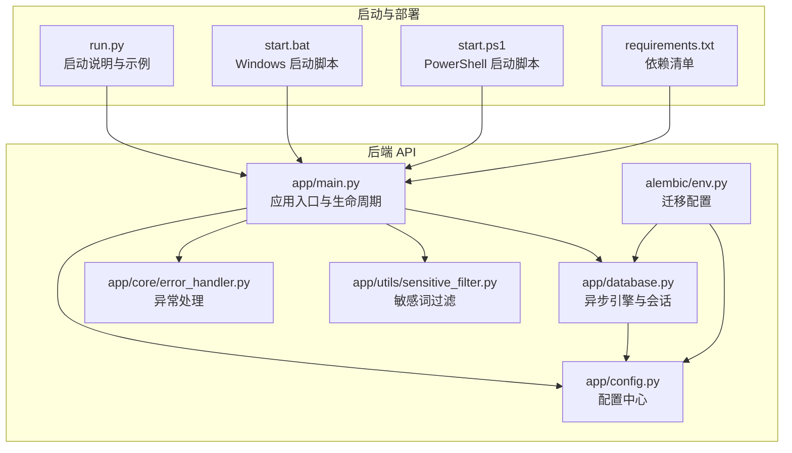
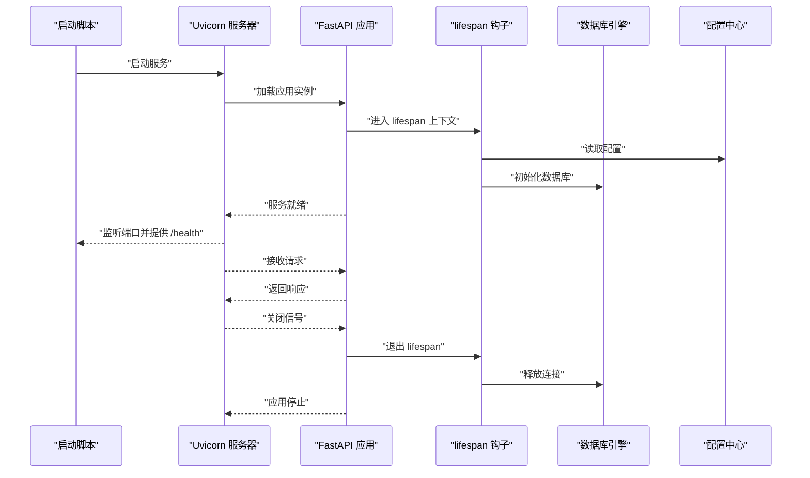
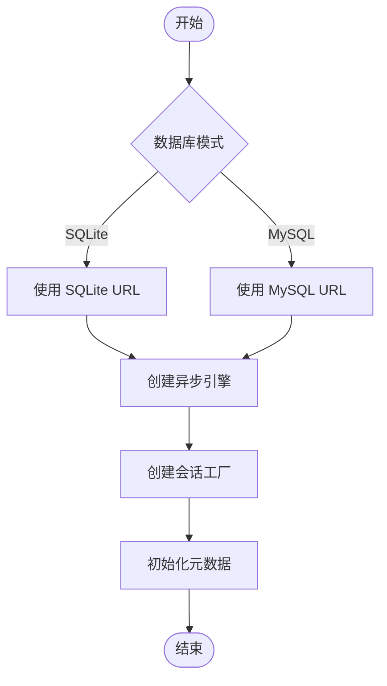
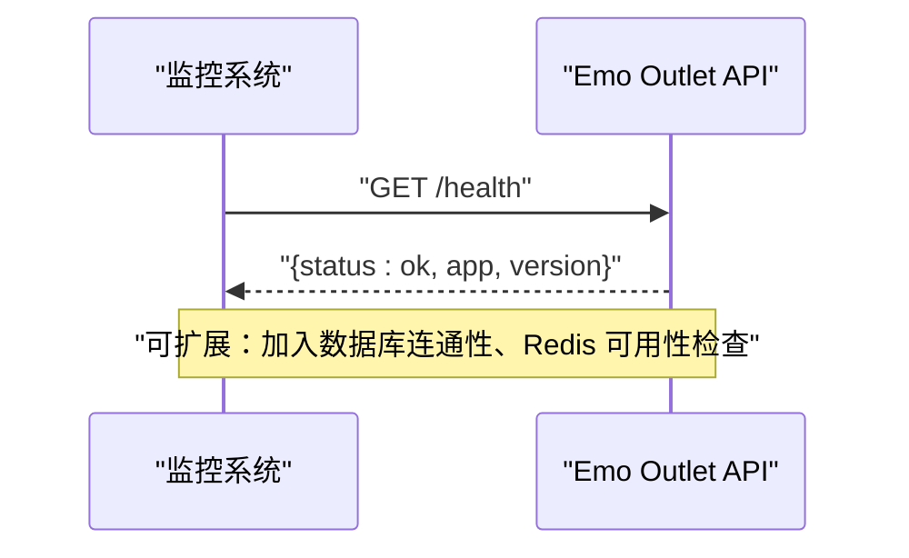
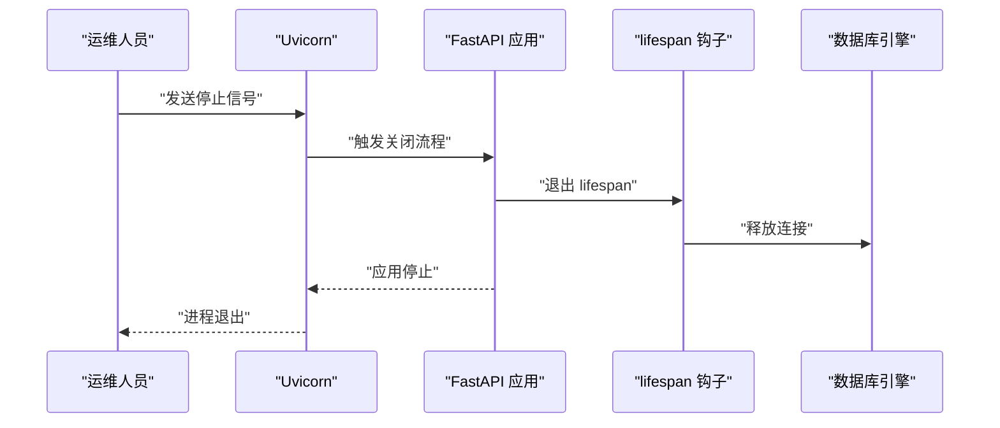
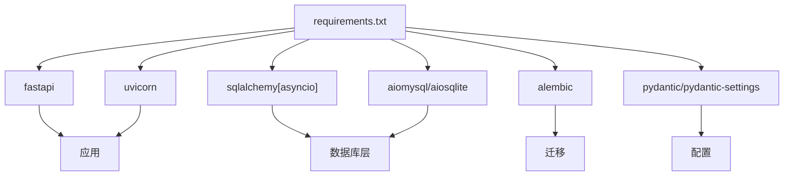
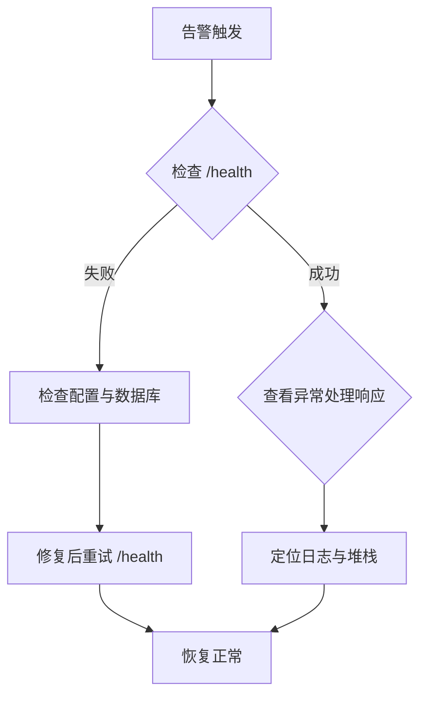

# 系统维护操作

<cite>
**本文引用的文件**
- [emo_outlet_api/app/config.py](file://emo_outlet_api/app/config.py)
- [emo_outlet_api/app/database.py](file://emo_outlet_api/app/database.py)
- [emo_outlet_api/app/main.py](file://emo_outlet_api/app/main.py)
- [emo_outlet_api/run.py](file://emo_outlet_api/run.py)
- [emo_outlet_api/alembic/env.py](file://emo_outlet_api/alembic/env.py)
- [emo_outlet_api/app/core/error_handler.py](file://emo_outlet_api/app/core/error_handler.py)
- [emo_outlet_api/app/utils/sensitive_filter.py](file://emo_outlet_api/app/utils/sensitive_filter.py)
- [start.bat](file://start.bat)
- [start.ps1](file://start.ps1)
- [emo_outlet_api/requirements.txt](file://emo_outlet_api/requirements.txt)
</cite>

## 目录
1. [简介](#简介)
2. [项目结构](#项目结构)
3. [核心组件](#核心组件)
4. [架构总览](#架构总览)
5. [详细组件分析](#详细组件分析)
6. [依赖分析](#依赖分析)
7. [性能考量](#性能考量)
8. [故障排查指南](#故障排查指南)
9. [结论](#结论)
10. [附录](#附录)

## 简介
本文件面向系统运维与平台工程师，围绕 Emo Outlet 项目的后端 API（FastAPI）提供系统维护操作指南。内容涵盖数据库维护、缓存清理策略、日志轮转与磁盘空间管理、系统健康检查、备份与恢复、系统重启与重载、维护窗口规划、维护任务自动化以及维护报告生成方法。文档以仓库现有代码为依据，结合可操作的实践步骤，帮助在不同环境下稳定运行与维护该系统。

## 项目结构
后端采用 FastAPI + SQLAlchemy Async + Alembic 迁移的典型架构；前端为 Flutter Web（Chrome），通过一键启动脚本同时运行前后端服务。后端主要入口为应用生命周期钩子、路由注册与健康检查端点；数据库连接与会话由异步引擎与工厂管理；配置集中于 Settings 类并通过 .env 文件加载。

**图示来源**
- [emo_outlet_api/app/main.py:1-82](file://emo_outlet_api/app/main.py#L1-L82)
- [emo_outlet_api/app/config.py:1-125](file://emo_outlet_api/app/config.py#L1-L125)
- [emo_outlet_api/app/database.py:1-43](file://emo_outlet_api/app/database.py#L1-L43)
- [emo_outlet_api/app/core/error_handler.py:1-59](file://emo_outlet_api/app/core/error_handler.py#L1-L59)
- [emo_outlet_api/app/utils/sensitive_filter.py:1-142](file://emo_outlet_api/app/utils/sensitive_filter.py#L1-L142)
- [emo_outlet_api/alembic/env.py:1-71](file://emo_outlet_api/alembic/env.py#L1-L71)
- [emo_outlet_api/run.py:1-31](file://emo_outlet_api/run.py#L1-L31)
- [start.bat:1-43](file://start.bat#L1-L43)
- [start.ps1:1-65](file://start.ps1#L1-L65)
- [emo_outlet_api/requirements.txt:1-29](file://emo_outlet_api/requirements.txt#L1-L29)

**章节来源**
- [emo_outlet_api/app/main.py:1-82](file://emo_outlet_api/app/main.py#L1-L82)
- [emo_outlet_api/app/config.py:1-125](file://emo_outlet_api/app/config.py#L1-L125)
- [emo_outlet_api/app/database.py:1-43](file://emo_outlet_api/app/database.py#L1-L43)
- [emo_outlet_api/alembic/env.py:1-71](file://emo_outlet_api/alembic/env.py#L1-L71)
- [emo_outlet_api/run.py:1-31](file://emo_outlet_api/run.py#L1-L31)
- [start.bat:1-43](file://start.bat#L1-L43)
- [start.ps1:1-65](file://start.ps1#L1-L65)
- [emo_outlet_api/requirements.txt:1-29](file://emo_outlet_api/requirements.txt#L1-L29)

## 核心组件
- 应用生命周期与健康检查：通过 lifespan 钩子初始化数据库并在应用停止时释放连接；提供 /health 健康检查端点。
- 配置中心：集中管理数据库、Redis、AI 服务、安全与合规等配置项，并支持从 .env 加载。
- 数据库层：异步 SQLAlchemy 引擎与会话工厂，支持 SQLite（开发）与 MySQL（生产）两种模式。
- 异常处理：统一捕获未处理异常、HTTP 异常与参数校验异常，返回一致的错误响应格式。
- 敏感词过滤：基于 DFA 的高性能敏感词匹配，辅助内容安全与合规。

**章节来源**
- [emo_outlet_api/app/main.py:14-21](file://emo_outlet_api/app/main.py#L14-L21)
- [emo_outlet_api/app/main.py:66-72](file://emo_outlet_api/app/main.py#L66-L72)
- [emo_outlet_api/app/config.py:12-125](file://emo_outlet_api/app/config.py#L12-L125)
- [emo_outlet_api/app/database.py:8-43](file://emo_outlet_api/app/database.py#L8-L43)
- [emo_outlet_api/app/core/error_handler.py:10-59](file://emo_outlet_api/app/core/error_handler.py#L10-L59)
- [emo_outlet_api/app/utils/sensitive_filter.py:37-142](file://emo_outlet_api/app/utils/sensitive_filter.py#L37-L142)

## 架构总览
下图展示后端服务在启动、运行与关闭过程中的关键交互，以及与数据库、配置与异常处理的关系。

**图示来源**
- [emo_outlet_api/app/main.py:14-21](file://emo_outlet_api/app/main.py#L14-L21)
- [emo_outlet_api/app/main.py:66-72](file://emo_outlet_api/app/main.py#L66-L72)
- [emo_outlet_api/app/config.py:12-125](file://emo_outlet_api/app/config.py#L12-L125)
- [emo_outlet_api/app/database.py:34-43](file://emo_outlet_api/app/database.py#L34-L43)

## 详细组件分析

### 数据库维护与迁移
- 连接与会话
  - 使用异步引擎与会话工厂，支持 SQLite（开发）与 MySQL（生产）两种模式，具体取决于配置项。
  - 提供初始化与关闭函数，确保在应用生命周期内正确建立与释放连接。
- 迁移工具
  - Alembic 迁移配置根据当前环境选择数据库 URL，并导入模型元数据执行迁移。
  - 支持离线与在线迁移模式，便于在不同环境中生成或执行迁移脚本。

**图示来源**
- [emo_outlet_api/app/database.py:8-38](file://emo_outlet_api/app/database.py#L8-L38)
- [emo_outlet_api/alembic/env.py:26-64](file://emo_outlet_api/alembic/env.py#L26-L64)

**章节来源**
- [emo_outlet_api/app/database.py:1-43](file://emo_outlet_api/app/database.py#L1-L43)
- [emo_outlet_api/alembic/env.py:1-71](file://emo_outlet_api/alembic/env.py#L1-L71)
- [emo_outlet_api/app/config.py:22-41](file://emo_outlet_api/app/config.py#L22-L41)

### 缓存清理策略（Redis）
- 配置项
  - 支持通过主机、端口、数据库索引与完整 URL 配置 Redis。
- 清理建议
  - 业务层面：对会话、临时内容与用户画像等键空间进行周期性扫描与淘汰。
  - 系统层面：在维护窗口内执行 flushdb 或 flushall 前务必备份重要键空间；或使用 keys + del 组合按前缀清理。
  - 注意：生产环境谨慎使用全局清理，优先采用 TTL 控制与键空间淘汰策略。

**章节来源**
- [emo_outlet_api/app/config.py:42-52](file://emo_outlet_api/app/config.py#L42-L52)

### 日志轮转与磁盘空间管理
- 应用日志
  - 当前代码未内置日志轮转配置，建议结合系统级日志轮转工具（如 logrotate、Windows Event Viewer）对 Uvicorn 输出进行轮转。
- 磁盘空间
  - 定期清理临时文件与缓存目录；监控数据库日志与审计日志大小，必要时压缩或归档。
  - 建议在维护窗口内执行磁盘清理与日志归档，避免影响线上流量。

**章节来源**
- [emo_outlet_api/app/main.py:33-39](file://emo_outlet_api/app/main.py#L33-L39)

### 系统健康检查流程
- 健康检查端点
  - 提供 /health 端点返回应用状态、名称与版本，便于外部监控系统探测。
- 监控维度
  - 服务状态：访问 /health 判断存活。
  - 资源使用：结合系统监控工具采集 CPU、内存、磁盘与网络。
  - 性能指标：结合请求耗时打印与外部 APM 工具评估延迟与吞吐。

**图示来源**
- [emo_outlet_api/app/main.py:66-72](file://emo_outlet_api/app/main.py#L66-L72)

**章节来源**
- [emo_outlet_api/app/main.py:66-72](file://emo_outlet_api/app/main.py#L66-L72)

### 备份与恢复操作指南
- 数据库备份
  - SQLite：直接复制 .db 文件进行备份。
  - MySQL：使用逻辑备份（mysqldump）或物理备份（xtrabackup/LVM 快照），建议在维护窗口内执行。
- 配置文件备份
  - .env 与配置中心相关文件需纳入版本控制或独立备份。
- 增量备份策略
  - 基于时间戳与变更追踪的增量备份方案，结合数据库二进制日志（binlog）恢复到指定时间点。
- 恢复演练
  - 定期进行恢复演练，验证备份完整性与恢复时间目标（RTO/RPO）。

**章节来源**
- [emo_outlet_api/app/config.py:22-41](file://emo_outlet_api/app/config.py#L22-L41)
- [emo_outlet_api/app/database.py:8-15](file://emo_outlet_api/app/database.py#L8-L15)

### 系统重启与重载操作
- 优雅关闭
  - 应用通过 lifespan 在关闭时释放数据库连接，确保事务回滚与资源回收。
- 服务重启
  - 使用启动脚本或容器编排工具重启服务；生产环境建议滚动重启以降低停机时间。
- 配置热更新
  - 配置中心 Settings 通过 .env 加载，修改后需重启服务以生效；若需热更新，可在应用中增加配置刷新机制（例如监听文件变化或引入配置中心）。

**图示来源**
- [emo_outlet_api/app/main.py:14-21](file://emo_outlet_api/app/main.py#L14-L21)
- [emo_outlet_api/app/database.py:41-43](file://emo_outlet_api/app/database.py#L41-L43)

**章节来源**
- [emo_outlet_api/app/main.py:14-21](file://emo_outlet_api/app/main.py#L14-L21)
- [emo_outlet_api/app/database.py:41-43](file://emo_outlet_api/app/database.py#L41-L43)

### 维护窗口规划与自动化
- 维护窗口
  - 选择业务低峰时段（如凌晨 2-6 点），预留足够缓冲时间。
- 自动化任务
  - 数据库备份、日志轮转、缓存清理与健康巡检可通过定时任务执行。
  - 结合 CI/CD 流水线实现配置变更与发布自动化。
- 报告生成
  - 统计备份成功率、恢复演练结果、资源使用趋势与异常事件，形成周报/月报。

**章节来源**
- [emo_outlet_api/run.py:1-31](file://emo_outlet_api/run.py#L1-L31)
- [start.bat:1-43](file://start.bat#L1-L43)
- [start.ps1:1-65](file://start.ps1#L1-L65)

## 依赖分析
后端依赖以 FastAPI、SQLAlchemy Async、Alembic、Pydantic Settings 为核心，辅以认证、AI 服务与工具类库。这些依赖直接影响部署与维护策略（如 Python 版本、数据库驱动、迁移工具等）。

**图示来源**
- [emo_outlet_api/requirements.txt:1-29](file://emo_outlet_api/requirements.txt#L1-L29)

**章节来源**
- [emo_outlet_api/requirements.txt:1-29](file://emo_outlet_api/requirements.txt#L1-L29)

## 性能考量
- 数据库性能
  - 使用异步连接池与合理的超时设置；定期分析慢查询与索引优化。
- 缓存命中率
  - 通过 TTL 与淘汰策略提升缓存命中率，减少数据库压力。
- 请求处理
  - 结合应用日志中的请求耗时统计，识别热点接口与瓶颈。
- 资源监控
  - 监控 CPU、内存、连接数与队列长度，结合弹性伸缩策略应对流量波动。

**章节来源**
- [emo_outlet_api/app/main.py:33-39](file://emo_outlet_api/app/main.py#L33-L39)
- [emo_outlet_api/app/database.py:10-15](file://emo_outlet_api/app/database.py#L10-L15)

## 故障排查指南
- 健康检查失败
  - 访问 /health 确认应用存活；若失败，检查数据库连接与配置项。
- 数据库异常
  - 查看连接字符串与驱动版本；确认数据库服务可用与权限正确。
- 异常处理
  - 应用统一返回 500 错误与一致的错误结构；结合日志定位具体问题。
- 启动问题
  - 使用启动脚本与 run.py 中的示例命令核对端口、主机与工作进程数量。

**图示来源**
- [emo_outlet_api/app/main.py:66-72](file://emo_outlet_api/app/main.py#L66-L72)
- [emo_outlet_api/app/core/error_handler.py:10-59](file://emo_outlet_api/app/core/error_handler.py#L10-L59)

**章节来源**
- [emo_outlet_api/app/main.py:66-72](file://emo_outlet_api/app/main.py#L66-L72)
- [emo_outlet_api/app/core/error_handler.py:1-59](file://emo_outlet_api/app/core/error_handler.py#L1-L59)

## 结论
本维护文档基于仓库现有代码，给出了数据库维护、缓存清理、日志轮转、健康检查、备份恢复、重启重载与自动化运维的实践建议。建议在生产环境中补充系统级日志轮转、数据库备份与恢复演练、配置热更新机制与监控告警体系，以保障系统的稳定性与可维护性。

## 附录
- 启动与部署参考
  - 后端启动命令与示例见 run.py。
  - Windows 一键启动脚本 start.bat 与 PowerShell 脚本 start.ps1。
- 配置与环境
  - 配置中心 Settings 通过 .env 加载，包含数据库、Redis、AI 服务、安全与合规等关键参数。

**章节来源**
- [emo_outlet_api/run.py:1-31](file://emo_outlet_api/run.py#L1-L31)
- [start.bat:1-43](file://start.bat#L1-L43)
- [start.ps1:1-65](file://start.ps1#L1-L65)
- [emo_outlet_api/app/config.py:115-125](file://emo_outlet_api/app/config.py#L115-L125)