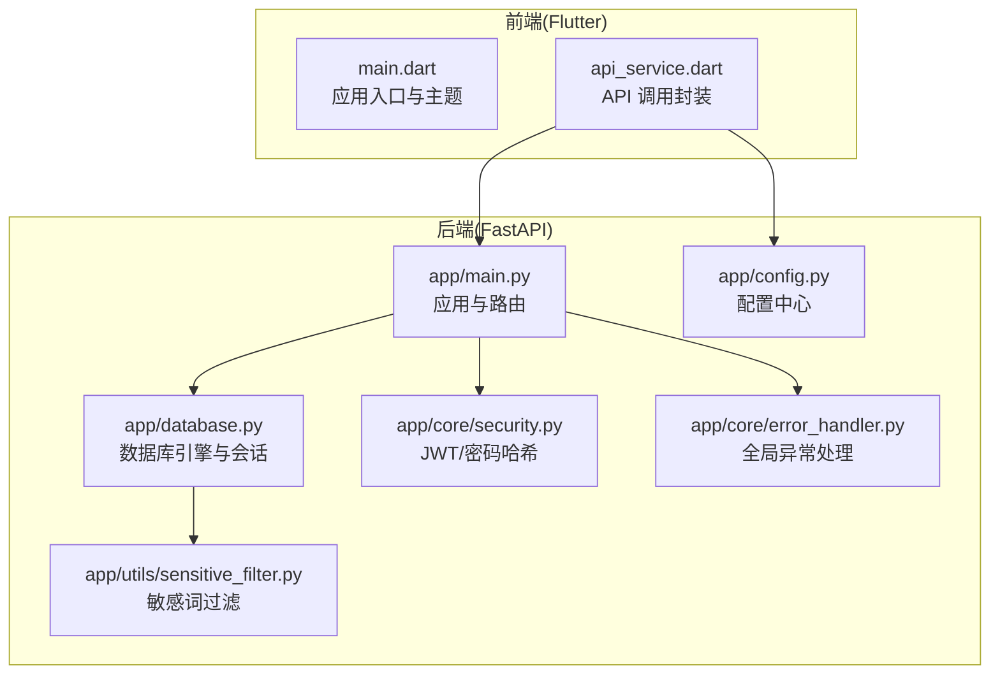
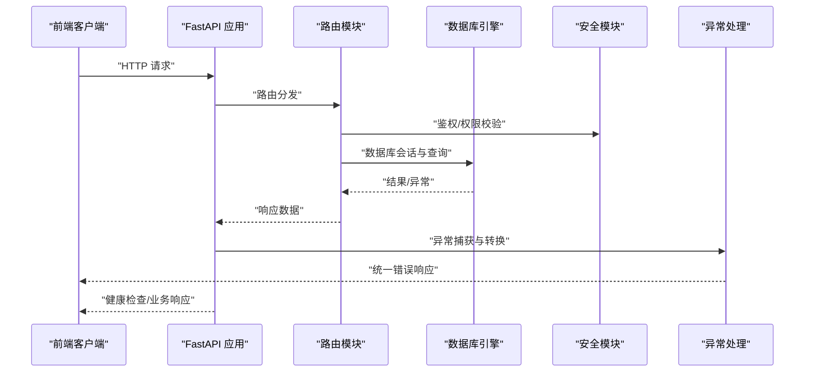
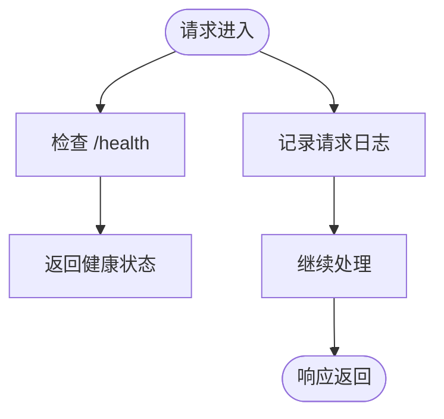
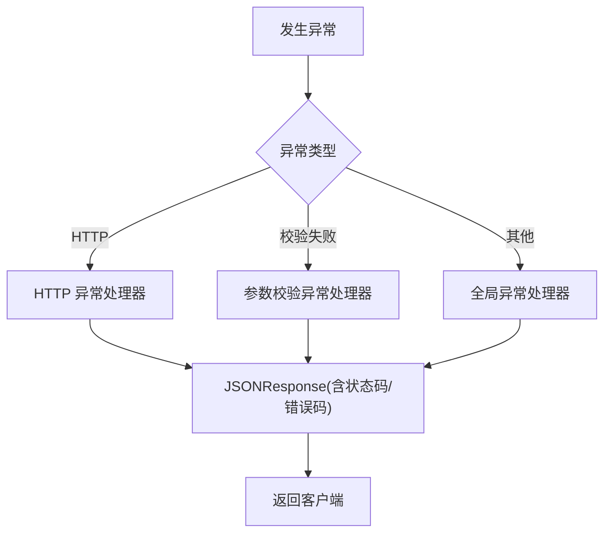
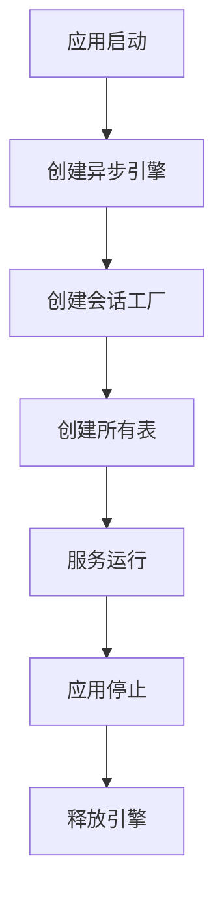
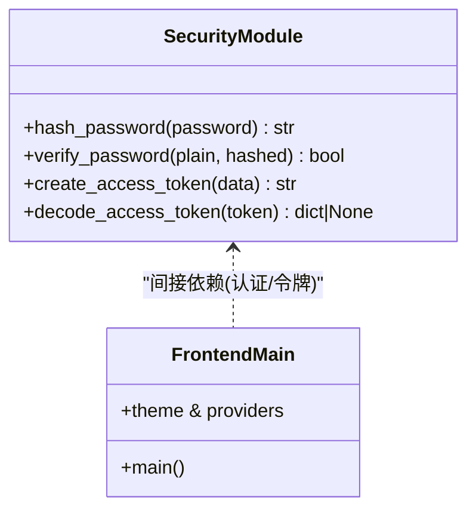
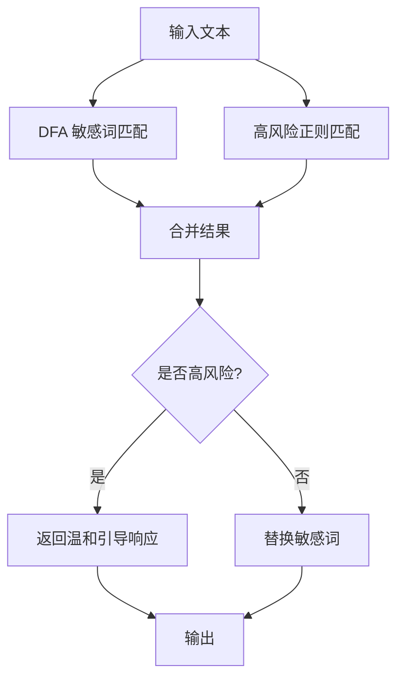
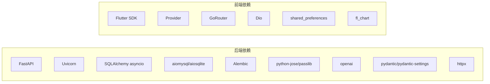

# 紧急情况处理

<cite>
**本文引用的文件**
- [README.md](file://README.md)
- [emo_outlet_api/app/main.py](file://emo_outlet_api/app/main.py)
- [emo_outlet_api/app/config.py](file://emo_outlet_api/app/config.py)
- [emo_outlet_api/app/core/error_handler.py](file://emo_outlet_api/app/core/error_handler.py)
- [emo_outlet_api/app/core/security.py](file://emo_outlet_api/app/core/security.py)
- [emo_outlet_api/app/database.py](file://emo_outlet_api/app/database.py)
- [emo_outlet_api/app/utils/sensitive_filter.py](file://emo_outlet_api/app/utils/sensitive_filter.py)
- [emo_outlet_api/run.py](file://emo_outlet_api/run.py)
- [emo_outlet_api/requirements.txt](file://emo_outlet_api/requirements.txt)
- [emo_outlet_app/lib/main.dart](file://emo_outlet_app/lib/main.dart)
- [emo_outlet_app/pubspec.yaml](file://emo_outlet_app/pubspec.yaml)
- [emo_outlet_app/lib/services/api_service.dart](file://emo_outlet_app/lib/services/api_service.dart)
</cite>

## 目录
1. [简介](#简介)
2. [项目结构](#项目结构)
3. [核心组件](#核心组件)
4. [架构总览](#架构总览)
5. [详细组件分析](#详细组件分析)
6. [依赖分析](#依赖分析)
7. [性能考虑](#性能考虑)
8. [故障排查指南](#故障排查指南)
9. [结论](#结论)
10. [附录](#附录)

## 简介
本文件为 Emo Outlet 项目的紧急情况处理文档，面向系统宕机、服务异常、数据丢失与安全事件的应急响应，提供标准化流程、分级标准、响应时限、恢复程序、业务影响最小化策略以及复盘改进机制。文档结合项目现有技术栈与代码实现，确保流程可执行、可追踪、可优化。

## 项目结构
Emo Outlet 采用前后端分离架构：
- 前端：Flutter 应用，负责用户界面、状态管理与网络请求。
- 后端：Python FastAPI + SQLAlchemy + MySQL/SQLite，提供认证、会话、消息、海报与支持反馈等接口。
- AI 引擎：通过 OpenAI/DeepSeek/通义千问等外部服务实现情绪分析与内容生成。
- 安全与合规：JWT 认证、敏感词过滤、高风险自动中断、软删除与端侧加密。

图表来源
- [emo_outlet_api/app/main.py:1-82](file://emo_outlet_api/app/main.py#L1-L82)
- [emo_outlet_api/app/config.py:1-125](file://emo_outlet_api/app/config.py#L1-L125)
- [emo_outlet_api/app/database.py:1-43](file://emo_outlet_api/app/database.py#L1-L43)
- [emo_outlet_api/app/core/security.py:1-43](file://emo_outlet_api/app/core/security.py#L1-L43)
- [emo_outlet_api/app/core/error_handler.py:1-59](file://emo_outlet_api/app/core/error_handler.py#L1-L59)
- [emo_outlet_api/app/utils/sensitive_filter.py:1-142](file://emo_outlet_api/app/utils/sensitive_filter.py#L1-L142)
- [emo_outlet_app/lib/main.dart:1-97](file://emo_outlet_app/lib/main.dart#L1-L97)
- [emo_outlet_app/lib/services/api_service.dart:224-270](file://emo_outlet_app/lib/services/api_service.dart#L224-L270)

章节来源
- [README.md:1-151](file://README.md#L1-L151)
- [emo_outlet_api/app/main.py:1-82](file://emo_outlet_api/app/main.py#L1-L82)
- [emo_outlet_api/app/config.py:1-125](file://emo_outlet_api/app/config.py#L1-L125)
- [emo_outlet_app/lib/main.dart:1-97](file://emo_outlet_app/lib/main.dart#L1-L97)

## 核心组件
- 应用入口与生命周期：FastAPI 应用初始化、中间件注册、路由挂载与健康检查。
- 配置中心：数据库、Redis、JWT、AI 提供商、合规与安全阈值等集中配置。
- 数据层：异步 SQLAlchemy 引擎、会话工厂、元数据创建与连接关闭。
- 安全模块：JWT 令牌签发/解码、密码哈希与校验。
- 异常处理：统一 HTTP/校验/全局异常响应格式。
- 敏感词过滤：DFA + 正则高风险模式，支持温和引导响应。
- 前端入口：主题、路由与 Provider 状态管理；API 封装调用后端接口。

章节来源
- [emo_outlet_api/app/main.py:14-82](file://emo_outlet_api/app/main.py#L14-L82)
- [emo_outlet_api/app/config.py:12-125](file://emo_outlet_api/app/config.py#L12-L125)
- [emo_outlet_api/app/database.py:10-43](file://emo_outlet_api/app/database.py#L10-L43)
- [emo_outlet_api/app/core/security.py:16-43](file://emo_outlet_api/app/core/security.py#L16-L43)
- [emo_outlet_api/app/core/error_handler.py:10-59](file://emo_outlet_api/app/core/error_handler.py#L10-L59)
- [emo_outlet_api/app/utils/sensitive_filter.py:37-142](file://emo_outlet_api/app/utils/sensitive_filter.py#L37-L142)
- [emo_outlet_app/lib/main.dart:8-97](file://emo_outlet_app/lib/main.dart#L8-L97)

## 架构总览
后端提供统一健康检查端点与多模块路由；前端通过 Dio 统一发起请求，后端通过依赖注入获取数据库会话，异常统一拦截并返回标准格式。

图表来源
- [emo_outlet_api/app/main.py:33-82](file://emo_outlet_api/app/main.py#L33-L82)
- [emo_outlet_api/app/core/error_handler.py:54-59](file://emo_outlet_api/app/core/error_handler.py#L54-L59)
- [emo_outlet_api/app/database.py:22-32](file://emo_outlet_api/app/database.py#L22-L32)
- [emo_outlet_api/app/core/security.py:26-43](file://emo_outlet_api/app/core/security.py#L26-L43)

## 详细组件分析

### 健康检查与可用性
- 健康检查端点：/health 返回应用名称与版本，便于探活与编排。
- 日志中间件：记录请求方法、路径、状态码与耗时，辅助定位性能与异常。

图表来源
- [emo_outlet_api/app/main.py:66-82](file://emo_outlet_api/app/main.py#L66-L82)
- [emo_outlet_api/app/main.py:33-40](file://emo_outlet_api/app/main.py#L33-L40)

章节来源
- [emo_outlet_api/app/main.py:66-82](file://emo_outlet_api/app/main.py#L66-L82)
- [emo_outlet_api/app/main.py:33-40](file://emo_outlet_api/app/main.py#L33-L40)

### 异常处理与错误响应
- 全局异常处理器：捕获未处理异常，返回统一错误结构。
- HTTP 异常处理器：将 HTTP 错误映射为标准 JSON。
- 参数校验异常处理器：解析校验错误并返回字段级信息。

图表来源
- [emo_outlet_api/app/core/error_handler.py:10-59](file://emo_outlet_api/app/core/error_handler.py#L10-L59)

章节来源
- [emo_outlet_api/app/core/error_handler.py:10-59](file://emo_outlet_api/app/core/error_handler.py#L10-L59)

### 数据库连接与事务
- 异步引擎与会话工厂：支持 SQLite/MySQL 切换，开发默认 SQLite。
- 生命周期：应用启动时初始化表结构，关闭时释放连接。
- 会话管理：自动提交/回滚与关闭，保证一致性。

图表来源
- [emo_outlet_api/app/database.py:10-43](file://emo_outlet_api/app/database.py#L10-L43)
- [emo_outlet_api/app/config.py:39-40](file://emo_outlet_api/app/config.py#L39-L40)

章节来源
- [emo_outlet_api/app/database.py:10-43](file://emo_outlet_api/app/database.py#L10-L43)
- [emo_outlet_api/app/config.py:39-40](file://emo_outlet_api/app/config.py#L39-L40)

### 安全与认证
- JWT 令牌：签发带过期时间，解码校验失败返回空。
- 密码哈希：bcrypt 哈希与校验。
- 前端入口：应用主题与 Provider 初始化，保障 UI 与状态稳定。

图表来源
- [emo_outlet_api/app/core/security.py:16-43](file://emo_outlet_api/app/core/security.py#L16-L43)
- [emo_outlet_app/lib/main.dart:8-97](file://emo_outlet_app/lib/main.dart#L8-L97)

章节来源
- [emo_outlet_api/app/core/security.py:16-43](file://emo_outlet_api/app/core/security.py#L16-L43)
- [emo_outlet_app/lib/main.dart:8-97](file://emo_outlet_app/lib/main.dart#L8-L97)

### 敏感词过滤与高风险中断
- DFA Trie 树：O(n) 匹配敏感词，支持最长匹配。
- 高风险正则：检测自伤/他伤意图，触发温和引导响应。
- 过滤策略：支持文本替换与高风险响应提示。

图表来源
- [emo_outlet_api/app/utils/sensitive_filter.py:74-139](file://emo_outlet_api/app/utils/sensitive_filter.py#L74-L139)

章节来源
- [emo_outlet_api/app/utils/sensitive_filter.py:37-142](file://emo_outlet_api/app/utils/sensitive_filter.py#L37-L142)

## 依赖分析
- 后端依赖：FastAPI、Uvicorn、SQLAlchemy asyncio、aiomysql/aiosqlite、Alembic、JTW、Passlib、OpenAI、Pydantic Settings、httpx 等。
- 前端依赖：Flutter SDK、Provider、GoRouter、Dio、共享存储与图表库等。

图表来源
- [emo_outlet_api/requirements.txt:4-29](file://emo_outlet_api/requirements.txt#L4-L29)
- [emo_outlet_app/pubspec.yaml:9-41](file://emo_outlet_app/pubspec.yaml#L9-L41)

章节来源
- [emo_outlet_api/requirements.txt:1-29](file://emo_outlet_api/requirements.txt#L1-L29)
- [emo_outlet_app/pubspec.yaml:1-52](file://emo_outlet_app/pubspec.yaml#L1-L52)

## 性能考虑
- 健康检查与日志中间件：便于快速定位慢请求与异常端点。
- 异步数据库：减少阻塞，提升并发能力。
- 前端网络库：Dio 支持统一拦截与重试策略，建议在紧急情况下启用指数退避与超时控制。

章节来源
- [emo_outlet_api/app/main.py:33-40](file://emo_outlet_api/app/main.py#L33-L40)
- [emo_outlet_api/app/database.py:10-15](file://emo_outlet_api/app/database.py#L10-L15)
- [emo_outlet_app/lib/services/api_service.dart:224-270](file://emo_outlet_app/lib/services/api_service.dart#L224-L270)

## 故障排查指南

### 系统宕机
- 现象：/health 不可用、端口不可达、进程退出。
- 快速检查：
  - 确认进程状态与端口占用。
  - 查看日志中间件输出与异常处理器返回。
  - 核对数据库连接串与驱动。
- 恢复步骤：
  - 重启服务（开发/生产启动命令参考运行脚本）。
  - 若使用 SQLite，确认文件权限与磁盘空间。
  - 若使用 MySQL，确认主机/端口/账号/密码。

章节来源
- [emo_outlet_api/app/main.py:66-82](file://emo_outlet_api/app/main.py#L66-L82)
- [emo_outlet_api/app/main.py:33-40](file://emo_outlet_api/app/main.py#L33-L40)
- [emo_outlet_api/app/config.py:30-40](file://emo_outlet_api/app/config.py#L30-L40)
- [emo_outlet_api/run.py:11-23](file://emo_outlet_api/run.py#L11-L23)

### 服务异常（5xx/4xx）
- 现象：接口返回 500/422/404 等。
- 快速检查：
  - 查看 HTTP 异常处理器与参数校验异常处理器返回。
  - 检查 JWT 令牌有效性与过期时间。
- 恢复步骤：
  - 修复参数校验问题或更新令牌。
  - 临时放宽限流/频率限制以保障基本功能。

章节来源
- [emo_outlet_api/app/core/error_handler.py:21-51](file://emo_outlet_api/app/core/error_handler.py#L21-L51)
- [emo_outlet_api/app/core/security.py:26-43](file://emo_outlet_api/app/core/security.py#L26-L43)

### 数据丢失
- 现象：会话/消息/海报缺失或为空。
- 快速检查：
  - 确认数据库引擎与会话工厂是否正常。
  - 检查表是否创建成功（metadata.create_all）。
- 恢复步骤：
  - 如使用 SQLite，备份 .db 文件并恢复。
  - 如使用 MySQL，检查备份策略与只读副本。
  - 在前端进行数据重载与缓存清理。

章节来源
- [emo_outlet_api/app/database.py:34-43](file://emo_outlet_api/app/database.py#L34-L43)
- [emo_outlet_api/app/config.py:39-40](file://emo_outlet_api/app/config.py#L39-L40)

### 安全事件（高风险内容）
- 现象：触发高风险模式，出现自伤/他伤意图。
- 快速检查：
  - 检查敏感词过滤与高风险正则匹配结果。
  - 确认温和引导响应是否返回。
- 恢复步骤：
  - 立即中断当前会话，提示用户联系专业支持。
  - 记录审计日志，必要时上报合规部门。

章节来源
- [emo_outlet_api/app/utils/sensitive_filter.py:102-139](file://emo_outlet_api/app/utils/sensitive_filter.py#L102-L139)

## 故障分级与响应时限
- P0（最高优先级）：系统全面不可用、大规模数据泄露或安全事件导致严重社会影响。响应时限：15 分钟内响应，1 小时内控制，4 小时内恢复。
- P1：核心功能不可用（如认证/会话/消息/海报），影响大量用户。响应时限：30 分钟内响应，2 小时内控制，8 小时内恢复。
- P2：部分功能异常（如接口偶发 5xx、性能显著下降）。响应时限：1 小时内响应，12 小时内控制，1 天内恢复。
- P3（最低优先级）：轻微异常（如 UI 小问题、非关键接口延迟）。响应时限：2 小时内响应，2 天内解决。

## 紧急联系人与响应时间
- 开发团队负责人：[填写姓名/邮箱/电话]
- 运维团队负责人：[填写姓名/邮箱/电话]
- 项目经理/产品经理：[填写姓名/邮箱/电话]
- 安全与合规联络人：[填写姓名/邮箱/电话]
- 第三方 AI 服务支持：[OpenAI/DeepSeek/通义千问 官方支持渠道]

响应时间要求（按故障级别）
- P0：15 分钟内首次响应，1 小时内控制，4 小时内恢复
- P1：30 分钟内首次响应，2 小时内控制，8 小时内恢复
- P2：1 小时内首次响应，12 小时内控制，1 天内恢复
- P3：2 小时内首次响应，2 天内解决

## 故障恢复程序
- 快速恢复（RTO/RPO 最小化）
  - 启动/重启服务（参考运行脚本中的开发/生产启动命令）。
  - 切换到备用数据库（如 MySQL 主从切换）。
  - 回滚最近一次变更（版本控制与发布流水线）。
- 数据恢复
  - SQLite：从 .db 文件恢复；检查权限与磁盘空间。
  - MySQL：使用备份恢复，核对 binlog 与 GTID。
- 系统重建
  - 重新初始化数据库表结构（metadata.create_all）。
  - 重新部署容器镜像（如使用 Docker）。
  - 验证 /health 与关键接口可用性。

章节来源
- [emo_outlet_api/run.py:11-23](file://emo_outlet_api/run.py#L11-L23)
- [emo_outlet_api/app/database.py:34-43](file://emo_outlet_api/app/database.py#L34-L43)

## 业务影响最小化策略
- 降级模式
  - 仅开放健康检查与基础认证接口，屏蔽高负载功能（如海报生成）。
  - 降低 AI 模型调用频率或切换为本地模拟。
- 流量控制
  - 前端启用指数退避与超时重试；后端启用限流与熔断。
- 用户通知机制
  - 在 UI 层显示维护公告与预计恢复时间。
  - 通过邮件/站内信推送故障通知。

## 故障复盘流程与改进措施跟踪
- 复盘流程
  - 收集事件时间线、影响范围与处理过程。
  - 分析根本原因（代码缺陷/配置错误/第三方服务异常）。
  - 明确责任人与改进计划，设定完成时限。
- 改进措施跟踪
  - 将改进项纳入需求管理与迭代计划。
  - 建立回归测试与监控告警，避免同类问题再次发生。

## 结论
本应急响应文档结合 Emo Outlet 的技术栈与代码实现，提供了从故障分级、响应时限、恢复程序到复盘改进的全流程规范。建议在实际运行中持续完善监控与演练，确保在真实故障场景下能够快速、有序地恢复业务。