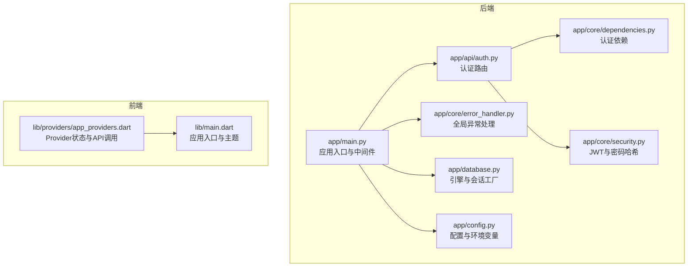
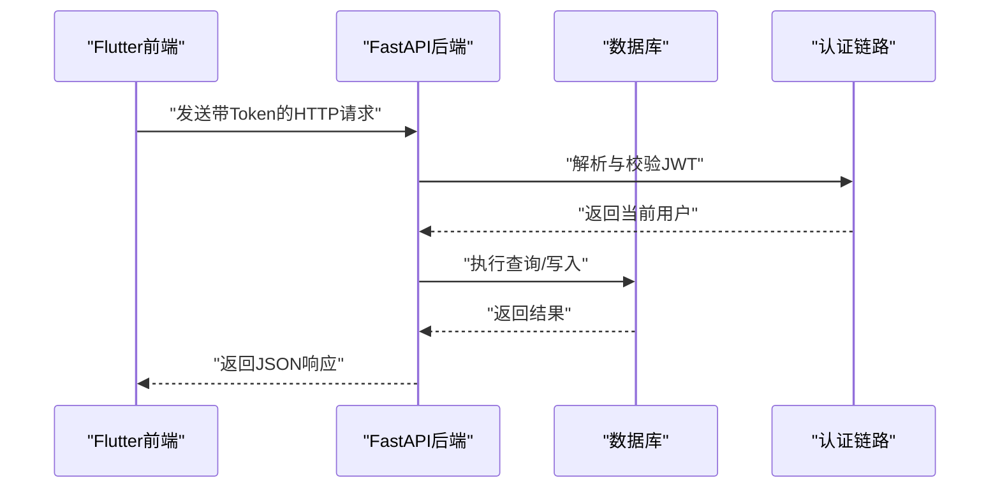
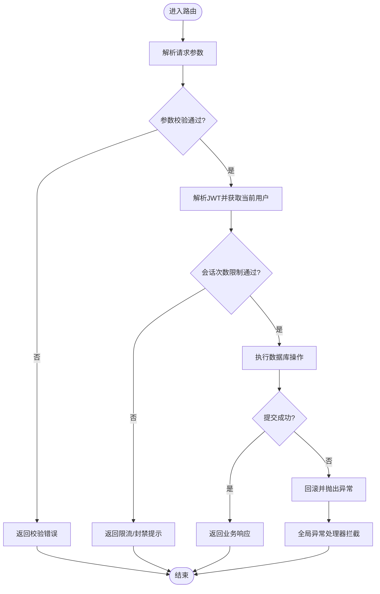
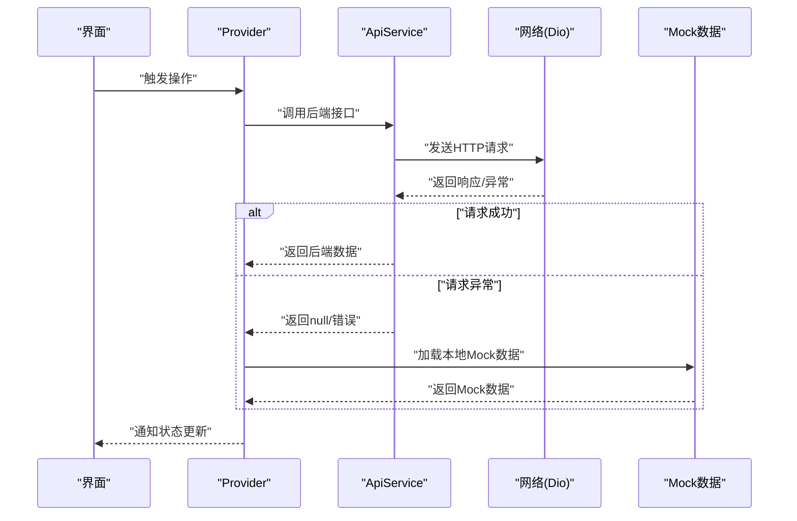
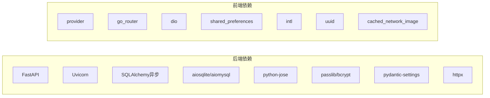

# 调试工具与技巧

<cite>
**本文引用的文件**
- [emo_outlet_api/app/main.py](file://emo_outlet_api/app/main.py)
- [emo_outlet_api/run.py](file://emo_outlet_api/run.py)
- [emo_outlet_api/app/config.py](file://emo_outlet_api/app/config.py)
- [emo_outlet_api/app/database.py](file://emo_outlet_api/app/database.py)
- [emo_outlet_api/app/core/error_handler.py](file://emo_outlet_api/app/core/error_handler.py)
- [emo_outlet_api/app/core/dependencies.py](file://emo_outlet_api/app/core/dependencies.py)
- [emo_outlet_api/app/core/security.py](file://emo_outlet_api/app/core/security.py)
- [emo_outlet_api/app/models/user.py](file://emo_outlet_api/app/models/user.py)
- [emo_outlet_api/app/api/auth.py](file://emo_outlet_api/app/api/auth.py)
- [emo_outlet_api/requirements.txt](file://emo_outlet_api/requirements.txt)
- [emo_outlet_app/lib/main.dart](file://emo_outlet_app/lib/main.dart)
- [emo_outlet_app/lib/providers/app_providers.dart](file://emo_outlet_app/lib/providers/app_providers.dart)
- [emo_outlet_app/test/widget_test.dart](file://emo_outlet_app/test/widget_test.dart)
- [emo_outlet_app/pubspec.yaml](file://emo_outlet_app/pubspec.yaml)
</cite>

## 目录
1. [简介](#简介)
2. [项目结构](#项目结构)
3. [核心组件](#核心组件)
4. [架构总览](#架构总览)
5. [详细组件分析](#详细组件分析)
6. [依赖分析](#依赖分析)
7. [性能考虑](#性能考虑)
8. [故障排查指南](#故障排查指南)
9. [结论](#结论)
10. [附录](#附录)

## 简介
本文件面向Emo Outlet项目的开发与测试团队，提供一套完整的调试工具与技巧指南。内容覆盖Python后端的断点调试、FastAPI路由调试、数据库查询调试；Flutter前端的Widget调试、状态变化追踪与网络请求调试；以及性能分析工具的使用建议（含内存与并发问题排查思路）。同时给出IDE配置要点（PyCharm与Android Studio），并结合项目现有代码结构，提供可操作的调试流程与最佳实践。

## 项目结构
- 后端采用FastAPI + SQLAlchemy异步ORM + Uvicorn运行，支持SQLite开发与MySQL生产切换。
- 前端采用Flutter + Provider状态管理，通过Dio发起HTTP请求，具备Mock回退能力。
- 项目包含健康检查接口、CORS中间件、统一异常处理与JWT认证链路。

**图表来源**
- [emo_outlet_api/app/main.py:1-82](file://emo_outlet_api/app/main.py#L1-L82)
- [emo_outlet_api/app/config.py:1-125](file://emo_outlet_api/app/config.py#L1-L125)
- [emo_outlet_api/app/database.py:1-43](file://emo_outlet_api/app/database.py#L1-L43)
- [emo_outlet_api/app/core/error_handler.py:1-59](file://emo_outlet_api/app/core/error_handler.py#L1-L59)
- [emo_outlet_api/app/core/security.py:1-43](file://emo_outlet_api/app/core/security.py#L1-L43)
- [emo_outlet_api/app/core/dependencies.py:1-67](file://emo_outlet_api/app/core/dependencies.py#L1-L67)
- [emo_outlet_api/app/api/auth.py:1-332](file://emo_outlet_api/app/api/auth.py#L1-L332)
- [emo_outlet_app/lib/main.dart:1-97](file://emo_outlet_app/lib/main.dart#L1-L97)
- [emo_outlet_app/lib/providers/app_providers.dart:1-416](file://emo_outlet_app/lib/providers/app_providers.dart#L1-L416)

**章节来源**
- [emo_outlet_api/app/main.py:1-82](file://emo_outlet_api/app/main.py#L1-L82)
- [emo_outlet_api/app/config.py:1-125](file://emo_outlet_api/app/config.py#L1-L125)
- [emo_outlet_api/app/database.py:1-43](file://emo_outlet_api/app/database.py#L1-L43)
- [emo_outlet_app/lib/main.dart:1-97](file://emo_outlet_app/lib/main.dart#L1-L97)

## 核心组件
- 应用入口与生命周期：在应用启动时初始化数据库，在关闭时清理连接，并打印启动/停止日志。
- 中间件：HTTP请求日志记录与CORS跨域配置。
- 配置中心：集中管理DEBUG开关、数据库URL、Redis、JWT、AI服务等配置项。
- 数据库层：根据DEBUG自动开启SQL回显，便于调试SQL执行细节。
- 异常处理：统一JSON响应格式，区分HTTP异常、参数校验异常与通用异常。
- 认证与依赖：基于Bearer Token的JWT解析与当前用户解析，配合每日会话次数限制。
- 前端状态与网络：Provider封装API调用，具备Mock回退策略，便于离线调试。

**章节来源**
- [emo_outlet_api/app/main.py:14-82](file://emo_outlet_api/app/main.py#L14-L82)
- [emo_outlet_api/app/config.py:12-125](file://emo_outlet_api/app/config.py#L12-L125)
- [emo_outlet_api/app/database.py:8-43](file://emo_outlet_api/app/database.py#L8-L43)
- [emo_outlet_api/app/core/error_handler.py:10-59](file://emo_outlet_api/app/core/error_handler.py#L10-L59)
- [emo_outlet_api/app/core/dependencies.py:18-67](file://emo_outlet_api/app/core/dependencies.py#L18-L67)
- [emo_outlet_api/app/core/security.py:26-43](file://emo_outlet_api/app/core/security.py#L26-L43)
- [emo_outlet_app/lib/providers/app_providers.dart:1-416](file://emo_outlet_app/lib/providers/app_providers.dart#L1-L416)

## 架构总览
后端通过Uvicorn运行，FastAPI负责路由与中间件；数据库层使用SQLAlchemy异步引擎；前端通过Provider管理状态并通过Dio发起HTTP请求。认证链路贯穿前后端，后端依赖JWT校验，前端在Provider中携带Token。

**图表来源**
- [emo_outlet_api/app/main.py:33-48](file://emo_outlet_api/app/main.py#L33-L48)
- [emo_outlet_api/app/core/dependencies.py:18-50](file://emo_outlet_api/app/core/dependencies.py#L18-L50)
- [emo_outlet_api/app/database.py:22-31](file://emo_outlet_api/app/database.py#L22-L31)
- [emo_outlet_app/lib/providers/app_providers.dart:1-416](file://emo_outlet_app/lib/providers/app_providers.dart#L1-L416)

## 详细组件分析

### Python后端调试指南
- 断点调试
  - 使用Uvicorn的reload模式启动后端，修改代码后自动重启，便于热调试。
  - 在路由函数、依赖解析函数、数据库事务处设置断点，观察请求上下文与数据库状态。
- FastAPI路由调试
  - 利用中间件记录请求耗时与状态码，定位慢接口与异常端点。
  - 通过Swagger UI或ReDoc查看路由定义与示例请求，核对参数与响应结构。
- 数据库查询调试
  - 将DEBUG设为True，启用SQL回显，观察每条SQL的执行情况与参数绑定。
  - 在事务边界设置断点，确认commit/rollback是否按预期执行。
- 统一异常处理
  - 全局异常处理器返回标准化错误结构，便于前端统一提示。
  - 参数校验异常会返回字段级错误列表，有助于快速定位问题字段。

**图表来源**
- [emo_outlet_api/app/api/auth.py:33-120](file://emo_outlet_api/app/api/auth.py#L33-L120)
- [emo_outlet_api/app/core/dependencies.py:53-67](file://emo_outlet_api/app/core/dependencies.py#L53-L67)
- [emo_outlet_api/app/database.py:22-31](file://emo_outlet_api/app/database.py#L22-L31)
- [emo_outlet_api/app/core/error_handler.py:34-51](file://emo_outlet_api/app/core/error_handler.py#L34-L51)

**章节来源**
- [emo_outlet_api/app/main.py:33-82](file://emo_outlet_api/app/main.py#L33-L82)
- [emo_outlet_api/app/config.py:16-40](file://emo_outlet_api/app/config.py#L16-L40)
- [emo_outlet_api/app/database.py:10-31](file://emo_outlet_api/app/database.py#L10-L31)
- [emo_outlet_api/app/core/error_handler.py:10-59](file://emo_outlet_api/app/core/error_handler.py#L10-L59)
- [emo_outlet_api/app/api/auth.py:33-120](file://emo_outlet_api/app/api/auth.py#L33-L120)

### Flutter前端调试指南
- Widget调试
  - 使用Flutter DevTools的Widget树检查与绘制区域高亮，定位布局异常。
  - 在关键Widget上添加占位颜色或日志输出，验证渲染路径。
- 状态变化追踪
  - 通过Provider的notifyListeners()调用点设置断点，观察状态变更序列。
  - 使用DevTools的状态面板查看ChangeNotifier属性变化。
- 网络请求调试
  - 在Provider中对API调用进行分层包装，分别捕获后端可用与Mock回退分支。
  - 使用Flutter DevTools Network面板观察请求/响应，或在Dio拦截器中打印请求详情。
- Mock回退策略
  - 当后端不可用时，自动降级到本地Mock数据，保证UI可交互性，便于离线调试。

**图表来源**
- [emo_outlet_app/lib/providers/app_providers.dart:20-131](file://emo_outlet_app/lib/providers/app_providers.dart#L20-L131)
- [emo_outlet_app/lib/providers/app_providers.dart:158-328](file://emo_outlet_app/lib/providers/app_providers.dart#L158-L328)
- [emo_outlet_app/lib/providers/app_providers.dart:346-416](file://emo_outlet_app/lib/providers/app_providers.dart#L346-L416)

**章节来源**
- [emo_outlet_app/lib/main.dart:1-97](file://emo_outlet_app/lib/main.dart#L1-L97)
- [emo_outlet_app/lib/providers/app_providers.dart:1-416](file://emo_outlet_app/lib/providers/app_providers.dart#L1-L416)
- [emo_outlet_app/pubspec.yaml:19-20](file://emo_outlet_app/pubspec.yaml#L19-L20)

### 性能分析与并发排查
- Python性能分析
  - 使用cProfile或py-spy对Uvicorn进程进行采样，识别热点函数与慢SQL。
  - 在DEBUG下开启SQL回显，结合日志统计接口耗时，定位瓶颈路由。
- 内存与并发
  - 关注异步会话生命周期，确保在finally中正确关闭会话，避免连接泄漏。
  - 并发场景下注意数据库锁与事务粒度，必要时引入重试与幂等设计。
- 前端性能
  - 使用Flutter DevTools Timeline与Memory面板，观察UI帧率与GC行为。
  - 对频繁notifyListeners()的场景进行节流或批量更新，减少重建开销。

**章节来源**
- [emo_outlet_api/app/database.py:22-31](file://emo_outlet_api/app/database.py#L22-L31)
- [emo_outlet_api/app/main.py:33-39](file://emo_outlet_api/app/main.py#L33-L39)

### IDE配置与调试环境
- PyCharm（后端）
  - 使用Uvicorn运行配置，勾选reload，指定应用入口与主机端口。
  - 在断点处设置条件断点，过滤特定路由或用户ID。
  - 在Run/Debug Configurations中配置环境变量与.env文件。
- Android Studio（前端）
  - 使用Flutter插件的Debug模式运行，打开DevTools进行Widget与性能分析。
  - 在Provider中设置断点，观察状态变更与API调用路径。
  - 使用Flutter Test Runner运行widget测试，确保Smoke Test通过。

**章节来源**
- [emo_outlet_api/run.py:12-17](file://emo_outlet_api/run.py#L12-L17)
- [emo_outlet_app/test/widget_test.dart:4-12](file://emo_outlet_app/test/widget_test.dart#L4-L12)

### 实际调试案例与最佳实践
- 常见Bug定位
  - 登录失败：检查JWT签名算法与密钥一致性，确认依赖解析函数返回的用户存在且未被封禁。
  - 数据库写入异常：在事务边界设置断点，确认commit/rollback逻辑与异常传播。
  - 前端状态不更新：在Provider的notifyListeners()处设置断点，确认数据更新与通知顺序。
- 最佳实践
  - 后端：统一异常处理、参数校验前置、日志埋点（请求/响应/耗时）、最小权限Token。
  - 前端：Provider职责单一、API调用分层、Mock回退、状态持久化与恢复。

**章节来源**
- [emo_outlet_api/app/core/error_handler.py:10-59](file://emo_outlet_api/app/core/error_handler.py#L10-L59)
- [emo_outlet_api/app/core/dependencies.py:18-50](file://emo_outlet_api/app/core/dependencies.py#L18-L50)
- [emo_outlet_app/lib/providers/app_providers.dart:20-131](file://emo_outlet_app/lib/providers/app_providers.dart#L20-L131)

## 依赖分析
- 后端依赖
  - Web框架：FastAPI、Uvicorn
  - 数据库：SQLAlchemy异步、aiosqlite/aiomysql、Alembic
  - 安全：python-jose、passlib/bcrypt
  - 配置：pydantic/pydantic-settings/python-dotenv
  - 工具：httpx、python-multipart
- 前端依赖
  - 状态管理：provider
  - 路由：go_router
  - 网络：dio
  - 工具：shared_preferences、intl、uuid、cached_network_image等

**图表来源**
- [emo_outlet_api/requirements.txt:3-29](file://emo_outlet_api/requirements.txt#L3-L29)
- [emo_outlet_app/pubspec.yaml:9-41](file://emo_outlet_app/pubspec.yaml#L9-L41)

**章节来源**
- [emo_outlet_api/requirements.txt:1-29](file://emo_outlet_api/requirements.txt#L1-L29)
- [emo_outlet_app/pubspec.yaml:1-52](file://emo_outlet_app/pubspec.yaml#L1-L52)

## 性能考虑
- 后端
  - SQL回显与日志：在DEBUG下开启，便于发现慢查询与重复查询。
  - 事务与连接池：确保会话在finally中关闭，避免连接泄漏。
  - 中间件：仅保留必要中间件，避免额外开销。
- 前端
  - Provider更新：合并多次状态变更，减少重建。
  - 网络请求：使用缓存与去抖，避免重复请求。
  - 图片与资源：使用缓存网络图片与懒加载策略。

[本节为通用指导，无需具体文件引用]

## 故障排查指南
- 后端
  - 健康检查：访问/health确认服务可用。
  - CORS问题：检查中间件allow_origins与请求头。
  - 异常响应：统一错误格式，结合日志定位具体路由。
- 前端
  - 网络异常：在Provider中区分后端异常与Mock回退分支，确保UI可降级。
  - 状态不一致：在Provider关键节点设置断点，确认数据流向。

**章节来源**
- [emo_outlet_api/app/main.py:66-82](file://emo_outlet_api/app/main.py#L66-L82)
- [emo_outlet_api/app/main.py:42-48](file://emo_outlet_api/app/main.py#L42-L48)
- [emo_outlet_api/app/core/error_handler.py:10-59](file://emo_outlet_api/app/core/error_handler.py#L10-L59)
- [emo_outlet_app/lib/providers/app_providers.dart:20-131](file://emo_outlet_app/lib/providers/app_providers.dart#L20-L131)

## 结论
通过结合后端的统一异常处理、参数校验与SQL回显，以及前端的Provider状态追踪与Mock回退机制，可以高效定位与修复问题。配合IDE断点调试与DevTools性能分析，能够系统性提升开发效率与系统稳定性。

[本节为总结，无需具体文件引用]

## 附录
- 快速启动与文档
  - 开发环境启动与API文档地址已在脚本中注释，可直接参考。
- 基础测试
  - 提供基础的widget Smoke Test，可在启动阶段验证应用主入口。

**章节来源**
- [emo_outlet_api/run.py:12-30](file://emo_outlet_api/run.py#L12-L30)
- [emo_outlet_app/test/widget_test.dart:4-12](file://emo_outlet_app/test/widget_test.dart#L4-L12)