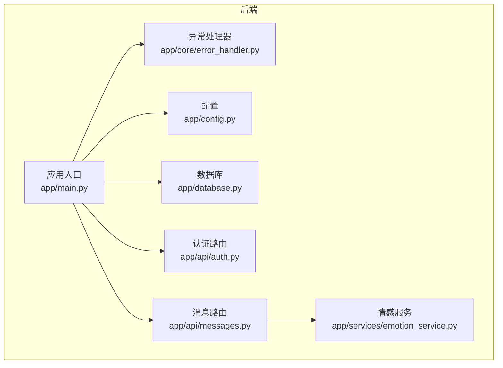
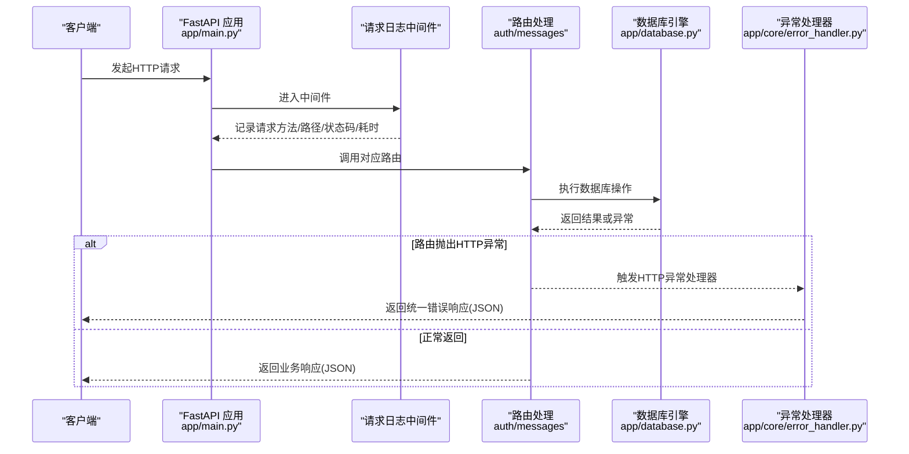
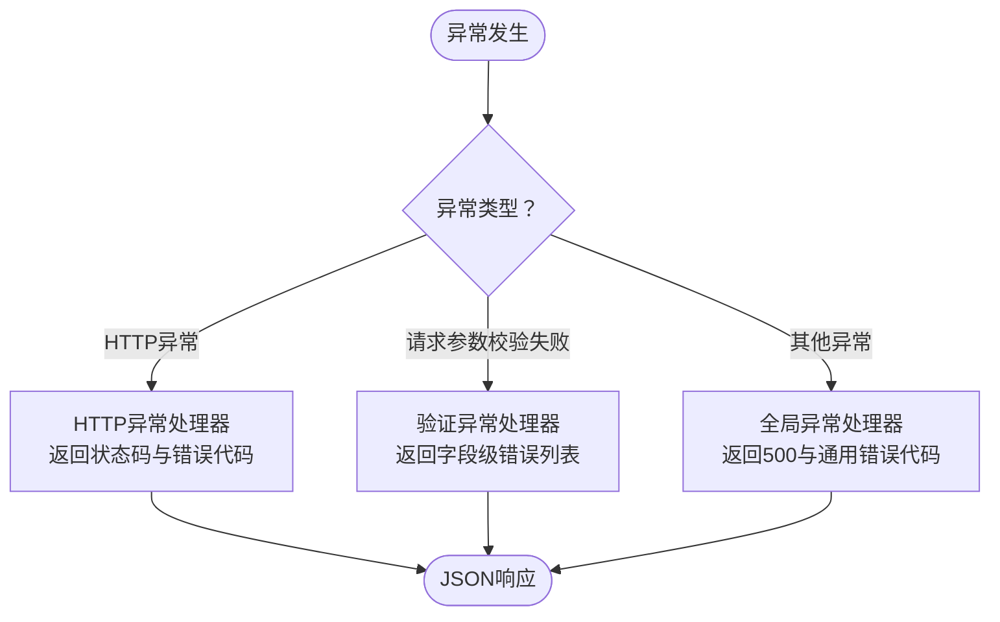
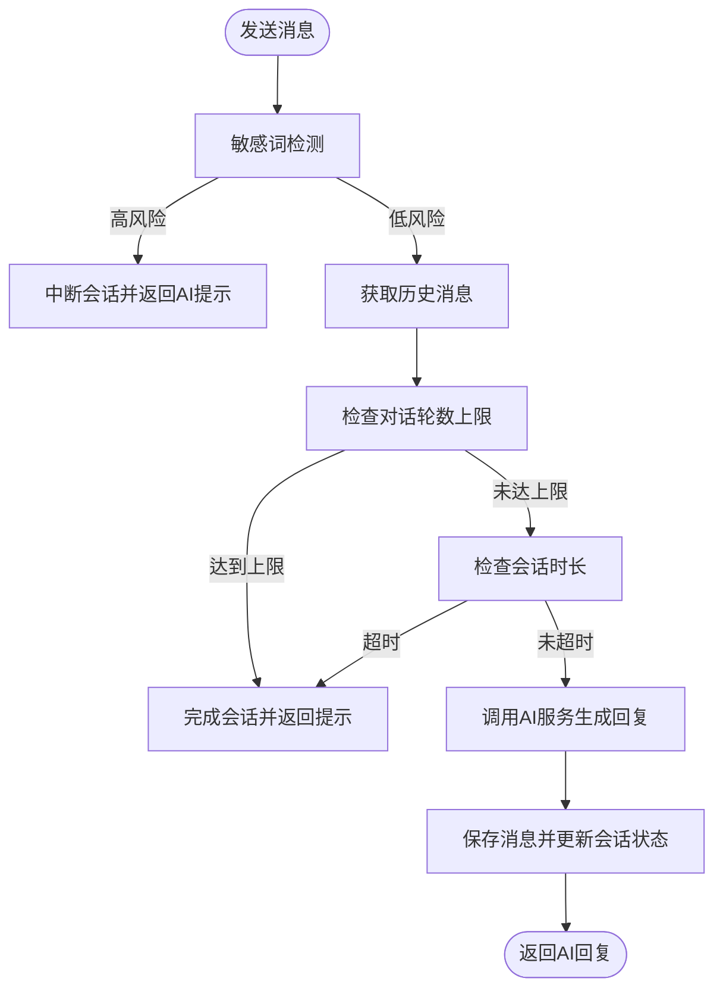
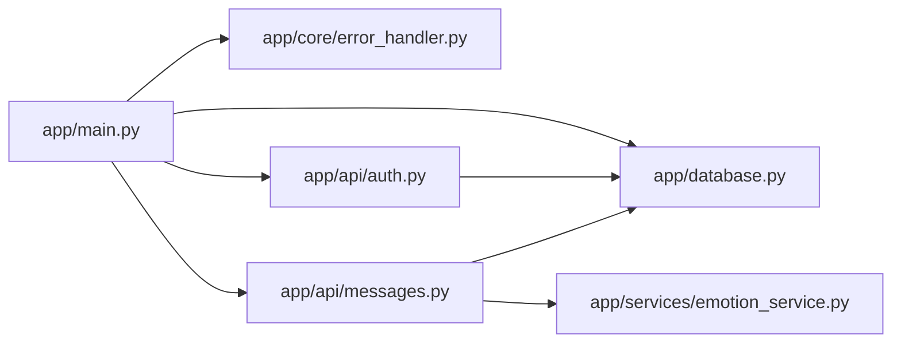

# 错误诊断与日志分析

<cite>
**本文引用的文件**
- [emo_outlet_api/app/main.py](file://emo_outlet_api/app/main.py)
- [emo_outlet_api/app/core/error_handler.py](file://emo_outlet_api/app/core/error_handler.py)
- [emo_outlet_api/app/config.py](file://emo_outlet_api/app/config.py)
- [emo_outlet_api/app/database.py](file://emo_outlet_api/app/database.py)
- [emo_outlet_api/app/api/auth.py](file://emo_outlet_api/app/api/auth.py)
- [emo_outlet_api/app/api/messages.py](file://emo_outlet_api/app/api/messages.py)
- [emo_outlet_api/app/models/user.py](file://emo_outlet_api/app/models/user.py)
- [emo_outlet_api/app/models/message.py](file://emo_outlet_api/app/models/message.py)
- [emo_outlet_api/app/schemas/user.py](file://emo_outlet_api/app/schemas/user.py)
- [emo_outlet_api/app/services/emotion_service.py](file://emo_outlet_api/app/services/emotion_service.py)
- [emo_outlet_api/run.py](file://emo_outlet_api/run.py)
- [emo_outlet_app/lib/main.dart](file://emo_outlet_app/lib/main.dart)
- [emo_outlet_app/flutter-web.log](file://emo_outlet_app/flutter-web.log)
</cite>

## 目录
1. [简介](#简介)
2. [项目结构](#项目结构)
3. [核心组件](#核心组件)
4. [架构总览](#架构总览)
5. [详细组件分析](#详细组件分析)
6. [依赖分析](#依赖分析)
7. [性能考虑](#性能考虑)
8. [故障排查指南](#故障排查指南)
9. [结论](#结论)
10. [附录](#附录)

## 简介
本文件面向Emo Outlet项目的运维与开发人员，提供系统性错误诊断与日志分析指南。内容覆盖：
- 错误类型识别与分析：HTTP错误、验证错误、数据库错误、系统异常
- 全局异常处理器工作原理与错误响应格式
- 错误码对照表与错误信息解读
- 日志采集与分析：后端中间件日志、数据库回显、前端控制台与日志文件
- 常见错误场景的诊断流程：认证失败、API调用异常、数据库连接问题、AI服务调用失败
- 日志分析工具使用与性能指标监控建议

## 项目结构
后端采用FastAPI框架，按功能分层组织：
- 核心层：异常处理、安全、依赖注入
- API层：认证、消息、海报、会话、支持、目标等路由
- 服务层：情感分析、AI对话等业务服务
- 模型与Schema：ORM模型与Pydantic输入输出定义
- 配置与数据库：运行配置、异步数据库引擎与会话管理

图表来源
- [emo_outlet_api/app/main.py:23-63](file://emo_outlet_api/app/main.py#L23-L63)
- [emo_outlet_api/app/core/error_handler.py:54-59](file://emo_outlet_api/app/core/error_handler.py#L54-L59)
- [emo_outlet_api/app/config.py:12-121](file://emo_outlet_api/app/config.py#L12-L121)
- [emo_outlet_api/app/database.py:8-43](file://emo_outlet_api/app/database.py#L8-L43)
- [emo_outlet_api/app/api/auth.py:30-332](file://emo_outlet_api/app/api/auth.py#L30-L332)
- [emo_outlet_api/app/api/messages.py:21-208](file://emo_outlet_api/app/api/messages.py#L21-L208)
- [emo_outlet_api/app/services/emotion_service.py:44-181](file://emo_outlet_api/app/services/emotion_service.py#L44-L181)

章节来源
- [emo_outlet_api/app/main.py:14-82](file://emo_outlet_api/app/main.py#L14-L82)
- [emo_outlet_api/app/core/error_handler.py:10-59](file://emo_outlet_api/app/core/error_handler.py#L10-L59)
- [emo_outlet_api/app/config.py:12-121](file://emo_outlet_api/app/config.py#L12-L121)
- [emo_outlet_api/app/database.py:8-43](file://emo_outlet_api/app/database.py#L8-L43)

## 核心组件
- 全局异常处理器：统一捕获未处理异常、HTTP异常与请求参数校验失败，并返回一致的错误响应格式
- 请求日志中间件：记录每个请求的方法、路径、状态码与耗时
- 数据库引擎与会话：基于SQLAlchemy异步引擎，自动提交/回滚与关闭
- 配置中心：集中管理数据库、Redis、AI服务、合规与审计日志开关等
- 路由与业务：认证路由抛出标准HTTP异常；消息路由在敏感词拦截、会话配额、时长限制等场景返回明确错误

章节来源
- [emo_outlet_api/app/core/error_handler.py:10-59](file://emo_outlet_api/app/core/error_handler.py#L10-L59)
- [emo_outlet_api/app/main.py:33-39](file://emo_outlet_api/app/main.py#L33-L39)
- [emo_outlet_api/app/database.py:22-32](file://emo_outlet_api/app/database.py#L22-L32)
- [emo_outlet_api/app/config.py:30-121](file://emo_outlet_api/app/config.py#L30-L121)
- [emo_outlet_api/app/api/auth.py:38-46](file://emo_outlet_api/app/api/auth.py#L38-L46)
- [emo_outlet_api/app/api/messages.py:68-70](file://emo_outlet_api/app/api/messages.py#L68-L70)

## 架构总览
后端通过中间件统一记录请求日志，异常处理器统一返回错误响应；数据库引擎在会话生命周期内自动管理事务；消息路由在多个业务分支中抛出HTTP异常，确保客户端能获得明确的错误信息。

图表来源
- [emo_outlet_api/app/main.py:33-39](file://emo_outlet_api/app/main.py#L33-L39)
- [emo_outlet_api/app/api/auth.py:88-90](file://emo_outlet_api/app/api/auth.py#L88-L90)
- [emo_outlet_api/app/api/messages.py:68-70](file://emo_outlet_api/app/api/messages.py#L68-L70)
- [emo_outlet_api/app/database.py:22-32](file://emo_outlet_api/app/database.py#L22-L32)
- [emo_outlet_api/app/core/error_handler.py:21-31](file://emo_outlet_api/app/core/error_handler.py#L21-L31)

## 详细组件分析

### 全局异常处理器
- 统一错误响应格式包含：状态码、错误代码、错误详情；校验失败额外返回字段级错误列表
- 注册方式：在应用启动时调用注册函数，绑定三类异常处理器

图表来源
- [emo_outlet_api/app/core/error_handler.py:10-59](file://emo_outlet_api/app/core/error_handler.py#L10-L59)
- [emo_outlet_api/app/main.py:29](file://emo_outlet_api/app/main.py#L29)

章节来源
- [emo_outlet_api/app/core/error_handler.py:10-59](file://emo_outlet_api/app/core/error_handler.py#L10-L59)
- [emo_outlet_api/app/main.py:29](file://emo_outlet_api/app/main.py#L29)

### 请求日志中间件
- 在每次请求完成后打印方法、路径、状态码与耗时，便于快速定位慢接口与异常状态码

章节来源
- [emo_outlet_api/app/main.py:33-39](file://emo_outlet_api/app/main.py#L33-L39)

### 数据库引擎与会话
- 使用异步引擎与工厂会话，自动提交/回滚与关闭，避免资源泄漏
- 初始化时创建所有模型表结构

章节来源
- [emo_outlet_api/app/database.py:8-43](file://emo_outlet_api/app/database.py#L8-L43)

### 认证路由与错误
- 注册/登录/游客登录等接口在重复注册、账号密码错误等场景抛出HTTP异常，返回明确错误信息
- 用户模型包含合规字段与敏感信息字段，便于后续审计

章节来源
- [emo_outlet_api/app/api/auth.py:38-46](file://emo_outlet_api/app/api/auth.py#L38-L46)
- [emo_outlet_api/app/api/auth.py:88-90](file://emo_outlet_api/app/api/auth.py#L88-L90)
- [emo_outlet_api/app/models/user.py:14-56](file://emo_outlet_api/app/models/user.py#L14-L56)

### 消息路由与多分支错误
- 敏感词拦截：高风险内容直接中断会话并返回AI提示消息
- 会话轮数上限：达到上限自动完成会话并返回提示消息
- 会话时长限制：超时自动完成会话并返回提示消息
- 会话不存在：返回404

图表来源
- [emo_outlet_api/app/api/messages.py:68-187](file://emo_outlet_api/app/api/messages.py#L68-L187)

章节来源
- [emo_outlet_api/app/api/messages.py:68-187](file://emo_outlet_api/app/api/messages.py#L68-L187)

### 情感分析服务
- 提供情绪分析结果，包含主情绪、强度、关键词、摘要与建议
- 作为消息路由的一部分，用于标注用户消息与AI回复的情绪属性

章节来源
- [emo_outlet_api/app/services/emotion_service.py:44-181](file://emo_outlet_api/app/services/emotion_service.py#L44-L181)

## 依赖分析
- 应用入口依赖异常处理器注册、数据库初始化与各路由
- 路由依赖数据库会话、安全依赖、配置与服务
- 异常处理器独立于业务逻辑，仅负责统一错误响应

图表来源
- [emo_outlet_api/app/main.py:51-63](file://emo_outlet_api/app/main.py#L51-L63)
- [emo_outlet_api/app/core/error_handler.py:54-59](file://emo_outlet_api/app/core/error_handler.py#L54-L59)
- [emo_outlet_api/app/database.py:8-43](file://emo_outlet_api/app/database.py#L8-L43)
- [emo_outlet_api/app/api/auth.py:30-332](file://emo_outlet_api/app/api/auth.py#L30-L332)
- [emo_outlet_api/app/api/messages.py:21-208](file://emo_outlet_api/app/api/messages.py#L21-L208)
- [emo_outlet_api/app/services/emotion_service.py:44-181](file://emo_outlet_api/app/services/emotion_service.py#L44-L181)

章节来源
- [emo_outlet_api/app/main.py:51-63](file://emo_outlet_api/app/main.py#L51-L63)

## 性能考虑
- 中间件记录请求耗时，可用于识别慢接口
- 数据库回显开启（调试模式）有助于定位SQL问题，生产环境建议关闭
- 会话轮数与时长限制可防止长时间占用资源
- 建议结合外部APM工具（如Prometheus/Grafana）采集接口耗时、错误率与数据库连接池指标

章节来源
- [emo_outlet_api/app/main.py:33-39](file://emo_outlet_api/app/main.py#L33-L39)
- [emo_outlet_api/app/config.py:30-37](file://emo_outlet_api/app/config.py#L30-L37)
- [emo_outlet_api/app/api/messages.py:132-184](file://emo_outlet_api/app/api/messages.py#L132-L184)

## 故障排查指南

### 错误响应格式与错误码对照
- 统一错误响应包含字段：状态码、错误代码、错误详情；参数校验失败包含字段级错误数组
- 错误代码示例：
  - HTTP_404：未找到资源
  - VALIDATION_ERROR：请求参数校验失败
  - INTERNAL_ERROR：服务器内部错误
- 业务错误示例：
  - 账号或密码错误（401）
  - 手机号/邮箱已注册（409）
  - 会话已完成（400）

章节来源
- [emo_outlet_api/app/core/error_handler.py:21-51](file://emo_outlet_api/app/core/error_handler.py#L21-L51)
- [emo_outlet_api/app/api/auth.py:38-46](file://emo_outlet_api/app/api/auth.py#L38-L46)
- [emo_outlet_api/app/api/auth.py:88-90](file://emo_outlet_api/app/api/auth.py#L88-L90)
- [emo_outlet_api/app/api/messages.py:68-70](file://emo_outlet_api/app/api/messages.py#L68-L70)

### 日志收集与分析方法
- 后端日志
  - 请求日志：中间件打印方法、路径、状态码与耗时
  - 数据库回显：调试模式下开启，便于观察SQL执行
  - 启动与停止日志：应用生命周期事件
- 前端日志
  - 控制台日志：浏览器开发者工具Network/Console面板
  - Flutter Web日志：本地开发服务器输出的日志文件
- 实时监控
  - 结合中间件耗时与健康检查端点，建立告警阈值

章节来源
- [emo_outlet_api/app/main.py:33-39](file://emo_outlet_api/app/main.py#L33-L39)
- [emo_outlet_api/app/config.py:30-37](file://emo_outlet_api/app/config.py#L30-L37)
- [emo_outlet_api/app/main.py:16-20](file://emo_outlet_api/app/main.py#L16-L20)
- [emo_outlet_app/flutter-web.log:1-21](file://emo_outlet_app/flutter-web.log#L1-L21)

### 常见错误场景诊断流程

#### 用户认证失败
- 现象：登录返回401
- 排查步骤：
  - 检查账号是否存在且密码正确
  - 查看异常处理器返回的错误详情
  - 核对请求体字段与Schema定义
- 参考文件
  - [emo_outlet_api/app/api/auth.py:88-90](file://emo_outlet_api/app/api/auth.py#L88-L90)
  - [emo_outlet_api/app/core/error_handler.py:21-31](file://emo_outlet_api/app/core/error_handler.py#L21-L31)
  - [emo_outlet_api/app/schemas/user.py:18-21](file://emo_outlet_api/app/schemas/user.py#L18-L21)

章节来源
- [emo_outlet_api/app/api/auth.py:88-90](file://emo_outlet_api/app/api/auth.py#L88-L90)
- [emo_outlet_api/app/core/error_handler.py:21-31](file://emo_outlet_api/app/core/error_handler.py#L21-L31)
- [emo_outlet_api/app/schemas/user.py:18-21](file://emo_outlet_api/app/schemas/user.py#L18-L21)

#### API调用异常
- 现象：返回404/400/409等HTTP错误
- 排查步骤：
  - 确认URL路径与方法正确
  - 检查请求参数是否满足Schema校验
  - 查看异常处理器返回的错误详情与字段级错误
- 参考文件
  - [emo_outlet_api/app/api/auth.py:38-46](file://emo_outlet_api/app/api/auth.py#L38-L46)
  - [emo_outlet_api/app/api/messages.py:68-70](file://emo_outlet_api/app/api/messages.py#L68-L70)
  - [emo_outlet_api/app/core/error_handler.py:34-51](file://emo_outlet_api/app/core/error_handler.py#L34-L51)

章节来源
- [emo_outlet_api/app/api/auth.py:38-46](file://emo_outlet_api/app/api/auth.py#L38-L46)
- [emo_outlet_api/app/api/messages.py:68-70](file://emo_outlet_api/app/api/messages.py#L68-L70)
- [emo_outlet_api/app/core/error_handler.py:34-51](file://emo_outlet_api/app/core/error_handler.py#L34-L51)

#### 数据库连接问题
- 现象：初始化失败、查询异常
- 排查步骤：
  - 检查数据库URL与凭据配置
  - 确认数据库服务可用
  - 查看数据库回显日志（调试模式）
- 参考文件
  - [emo_outlet_api/app/config.py:30-37](file://emo_outlet_api/app/config.py#L30-L37)
  - [emo_outlet_api/app/database.py:8-43](file://emo_outlet_api/app/database.py#L8-L43)

章节来源
- [emo_outlet_api/app/config.py:30-37](file://emo_outlet_api/app/config.py#L30-L37)
- [emo_outlet_api/app/database.py:8-43](file://emo_outlet_api/app/database.py#L8-L43)

#### AI服务调用失败
- 现象：消息发送后无法生成AI回复
- 排查步骤：
  - 检查AI提供商配置与密钥
  - 查看消息路由中AI服务调用分支
  - 关注异常处理器对未捕获异常的统一处理
- 参考文件
  - [emo_outlet_api/app/config.py:63-80](file://emo_outlet_api/app/config.py#L63-L80)
  - [emo_outlet_api/app/api/messages.py:157-164](file://emo_outlet_api/app/api/messages.py#L157-L164)
  - [emo_outlet_api/app/core/error_handler.py:10-18](file://emo_outlet_api/app/core/error_handler.py#L10-L18)

章节来源
- [emo_outlet_api/app/config.py:63-80](file://emo_outlet_api/app/config.py#L63-L80)
- [emo_outlet_api/app/api/messages.py:157-164](file://emo_outlet_api/app/api/messages.py#L157-L164)
- [emo_outlet_api/app/core/error_handler.py:10-18](file://emo_outlet_api/app/core/error_handler.py#L10-L18)

### 日志分析工具使用指南
- 后端
  - 使用中间件输出的请求日志进行慢接口筛选
  - 结合健康检查端点与数据库回显定位异常
- 前端
  - 浏览器Network面板查看请求状态与响应
  - Flutter Web日志文件辅助定位前端运行期问题
- 建议
  - 将日志输出重定向至集中式日志系统（如ELK/Fluentd）
  - 设置错误率与延迟告警

章节来源
- [emo_outlet_api/app/main.py:33-39](file://emo_outlet_api/app/main.py#L33-L39)
- [emo_outlet_api/app/main.py:66-72](file://emo_outlet_api/app/main.py#L66-L72)
- [emo_outlet_app/flutter-web.log:1-21](file://emo_outlet_app/flutter-web.log#L1-L21)

## 结论
通过统一的异常处理与中间件日志，Emo Outlet后端能够稳定地对外输出一致的错误信息，并为问题定位提供清晰线索。配合前端日志与健康检查端点，可实现从接口到会话全流程的可观测性。建议在生产环境关闭数据库回显，启用集中化日志与性能监控，持续优化用户体验与系统稳定性。

## 附录

### 快速启动与文档地址
- 开发/生产启动命令与API文档地址见脚本文件

章节来源
- [emo_outlet_api/run.py:11-30](file://emo_outlet_api/run.py#L11-L30)

### 前端应用入口
- Flutter应用入口与主题配置

章节来源
- [emo_outlet_app/lib/main.dart:8-97](file://emo_outlet_app/lib/main.dart#L8-L97)