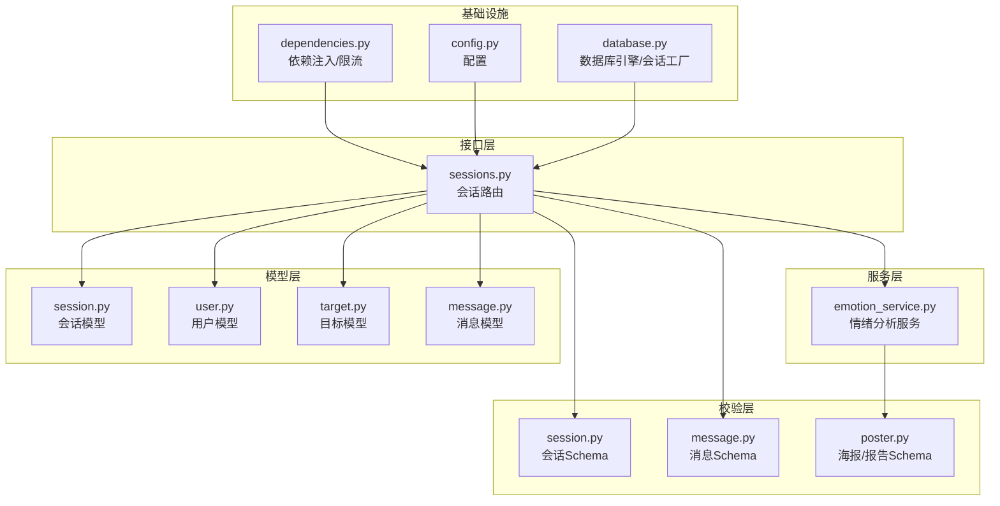
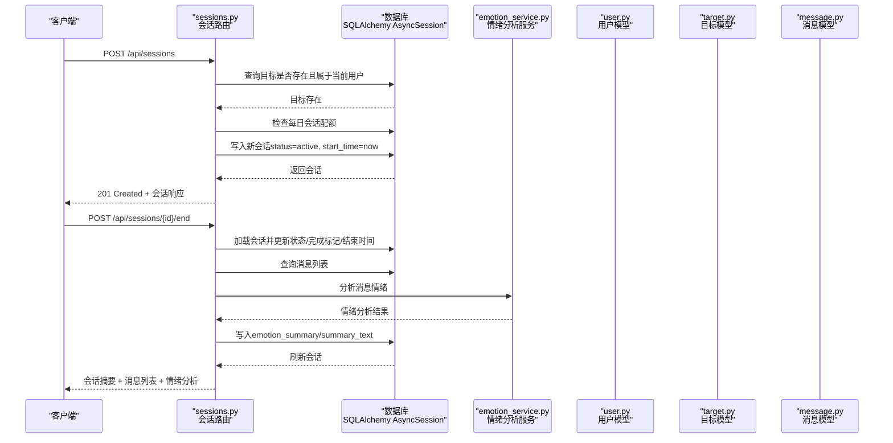
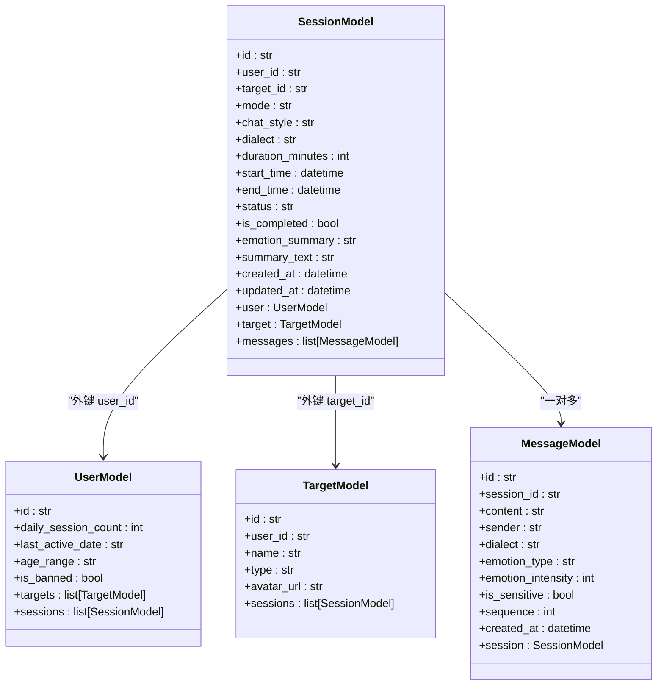
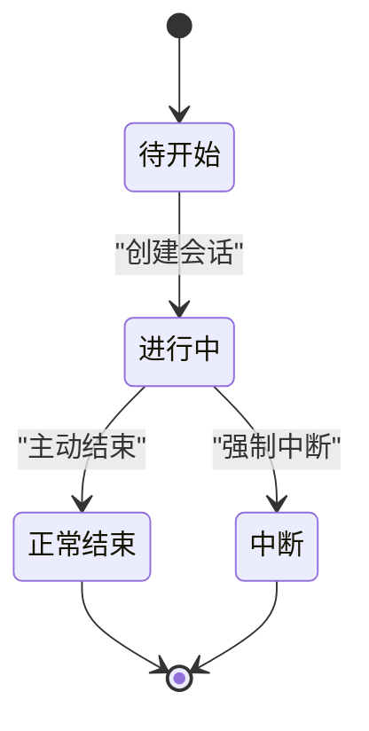
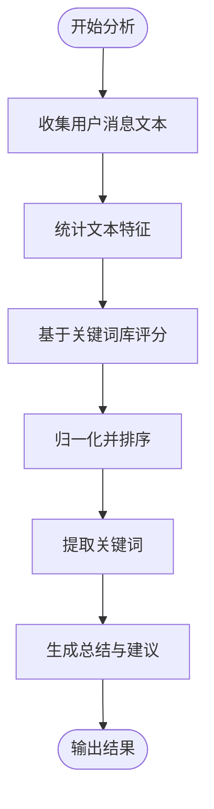
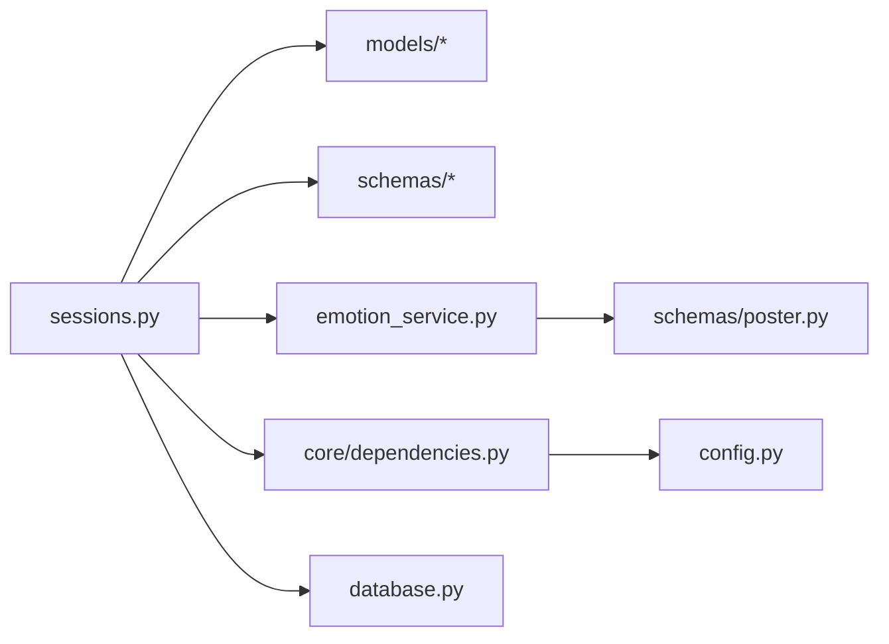

# 会话模型

<cite>
**本文引用的文件**
- [session.py](file://emo_outlet_api/app/models/session.py)
- [session.py](file://emo_outlet_api/app/schemas/session.py)
- [sessions.py](file://emo_outlet_api/app/api/sessions.py)
- [emotion_service.py](file://emo_outlet_api/app/services/emotion_service.py)
- [user.py](file://emo_outlet_api/app/models/user.py)
- [target.py](file://emo_outlet_api/app/models/target.py)
- [message.py](file://emo_outlet_api/app/models/message.py)
- [message.py](file://emo_outlet_api/app/schemas/message.py)
- [dependencies.py](file://emo_outlet_api/app/core/dependencies.py)
- [config.py](file://emo_outlet_api/app/config.py)
- [database.py](file://emo_outlet_api/app/database.py)
- [poster.py](file://emo_outlet_api/app/schemas/poster.py)
</cite>

## 目录
1. [简介](#简介)
2. [项目结构](#项目结构)
3. [核心组件](#核心组件)
4. [架构总览](#架构总览)
5. [详细组件分析](#详细组件分析)
6. [依赖分析](#依赖分析)
7. [性能考虑](#性能考虑)
8. [故障排查指南](#故障排查指南)
9. [结论](#结论)
10. [附录](#附录)

## 简介
本文件为 Emo Outlet 项目的会话模型（Session）提供系统化、可操作的技术文档。重点覆盖：
- 会话标识、参与者关联、时间控制与状态管理
- 会话与用户、目标的关系及生命周期
- 会话数据的验证规则、时间限制与业务约束
- 并发处理、实时通信支持与数据同步机制
- 会话操作的代码示例与最佳实践
- 会话数据的安全保护与审计日志记录

## 项目结构
围绕会话模型的关键文件组织如下：
- 模型层：会话、用户、目标、消息
- 接口层：会话 API 路由
- 服务层：情绪分析服务
- 校验层：请求/响应 Pydantic 模型
- 基础设施：数据库连接、依赖注入、配置

图表来源
- [sessions.py:1-220](file://emo_outlet_api/app/api/sessions.py#L1-L220)
- [session.py:1-79](file://emo_outlet_api/app/models/session.py#L1-L79)
- [user.py:1-52](file://emo_outlet_api/app/models/user.py#L1-L52)
- [target.py:1-56](file://emo_outlet_api/app/models/target.py#L1-L56)
- [message.py:1-46](file://emo_outlet_api/app/models/message.py#L1-L46)
- [session.py:1-49](file://emo_outlet_api/app/schemas/session.py#L1-L49)
- [message.py:1-33](file://emo_outlet_api/app/schemas/message.py#L1-L33)
- [emotion_service.py:1-181](file://emo_outlet_api/app/services/emotion_service.py#L1-L181)
- [dependencies.py:1-67](file://emo_outlet_api/app/core/dependencies.py#L1-L67)
- [config.py:1-125](file://emo_outlet_api/app/config.py#L1-L125)
- [database.py:1-43](file://emo_outlet_api/app/database.py#L1-L43)

章节来源
- [sessions.py:1-220](file://emo_outlet_api/app/api/sessions.py#L1-L220)
- [session.py:1-79](file://emo_outlet_api/app/models/session.py#L1-L79)
- [config.py:1-125](file://emo_outlet_api/app/config.py#L1-L125)

## 核心组件
- 会话模型（SessionModel）
  - 主键：字符串 UUID（36 字符）
  - 参与者关联：user_id（用户）、target_id（目标）
  - 会话模式：single（单向）、dual（双向）
  - 对话风格：apologetic、stubborn、cold、sarcastic、rational
  - 方言：mandarin、cantonese、sichuan、northeastern、shanghainese
  - 时间控制：duration_minutes（默认 3，范围 1-10）、start_time、end_time
  - 状态：pending、active、completed、interrupted；is_completed 标记完成
  - 情绪总结：emotion_summary（JSON 文本）、summary_text
  - 时间戳：created_at、updated_at（自动维护）
  - 关系：与 User、Target、Message 的一对多/多对一关系
- 会话 Schema
  - 创建请求：校验 target_id、mode、chat_style、dialect、duration_minutes（1-10）
  - 响应：包含目标信息（名称、头像）、状态、摘要等
  - 结束请求：force 中断标记
  - 摘要响应：会话 + 消息列表 + 情绪分析结果
- 情绪分析服务（EmotionService）
  - 输入：消息序列（content、sender、emotion_type、emotion_intensity）
  - 输出：主要情绪、情绪分布、强度、关键词、总结、建议
- 用户与目标模型
  - 用户：每日会话计数、最后活跃日期、年龄分组、封禁状态等
  - 目标：名称、类型、外貌/性格/关系描述、风格、头像等

章节来源
- [session.py:13-79](file://emo_outlet_api/app/models/session.py#L13-L79)
- [session.py:8-49](file://emo_outlet_api/app/schemas/session.py#L8-L49)
- [emotion_service.py:44-181](file://emo_outlet_api/app/services/emotion_service.py#L44-L181)
- [user.py:12-52](file://emo_outlet_api/app/models/user.py#L12-L52)
- [target.py:13-56](file://emo_outlet_api/app/models/target.py#L13-L56)

## 架构总览
会话模型贯穿“接口层-服务层-模型层-校验层-基础设施”，形成清晰的数据流与职责分离。

图表来源
- [sessions.py:50-220](file://emo_outlet_api/app/api/sessions.py#L50-L220)
- [emotion_service.py:44-71](file://emo_outlet_api/app/services/emotion_service.py#L44-L71)
- [user.py:12-52](file://emo_outlet_api/app/models/user.py#L12-L52)
- [target.py:13-56](file://emo_outlet_api/app/models/target.py#L13-L56)
- [message.py:13-46](file://emo_outlet_api/app/models/message.py#L13-L46)

## 详细组件分析

### 会话模型类图

图表来源
- [session.py:13-79](file://emo_outlet_api/app/models/session.py#L13-L79)
- [user.py:12-52](file://emo_outlet_api/app/models/user.py#L12-L52)
- [target.py:13-56](file://emo_outlet_api/app/models/target.py#L13-L56)
- [message.py:13-46](file://emo_outlet_api/app/models/message.py#L13-L46)

章节来源
- [session.py:13-79](file://emo_outlet_api/app/models/session.py#L13-L79)
- [user.py:12-52](file://emo_outlet_api/app/models/user.py#L12-L52)
- [target.py:13-56](file://emo_outlet_api/app/models/target.py#L13-L56)
- [message.py:13-46](file://emo_outlet_api/app/models/message.py#L13-L46)

### 会话生命周期与状态转换
- 生命周期阶段
  - 待开始（pending）：创建后初始状态
  - 进行中（active）：开始会话时进入
  - 正常结束（completed）：主动结束
  - 中断（interrupted）：强制中断
- 状态转换
  - pending → active：创建会话时
  - active → completed 或 interrupted：结束会话时
- 业务约束
  - 每日会话次数限制按用户身份与年龄分组动态调整
  - 会话时长限制（1-10 分钟），超过阈值需另行处理
  - 会话完成后禁止重复结束

图表来源
- [session.py:50-56](file://emo_outlet_api/app/models/session.py#L50-L56)
- [sessions.py:50-99](file://emo_outlet_api/app/api/sessions.py#L50-L99)
- [sessions.py:156-220](file://emo_outlet_api/app/api/sessions.py#L156-L220)

章节来源
- [session.py:50-56](file://emo_outlet_api/app/models/session.py#L50-L56)
- [sessions.py:50-99](file://emo_outlet_api/app/api/sessions.py#L50-L99)
- [sessions.py:156-220](file://emo_outlet_api/app/api/sessions.py#L156-L220)

### 会话与用户、目标的关系
- 一对一关系
  - SessionModel.user → UserModel
  - SessionModel.target → TargetModel
- 一对多关系
  - SessionModel.messages ← MessageModel.session
- 关联查询优化
  - 使用 selectin 加载策略减少 N+1 查询

章节来源
- [session.py:72-76](file://emo_outlet_api/app/models/session.py#L72-L76)
- [user.py:47-48](file://emo_outlet_api/app/models/user.py#L47-L48)
- [target.py:50-52](file://emo_outlet_api/app/models/target.py#L50-L52)
- [message.py:41-42](file://emo_outlet_api/app/models/message.py#L41-L42)

### 会话数据验证规则与业务约束
- 请求参数校验
  - 创建会话：target_id 必填；mode 默认 single；chat_style 默认 apologetic；dialect 默认 mandarin；duration_minutes 默认 3，范围 1-10
  - 结束会话：force 默认 false
- 业务规则
  - 目标必须属于当前用户且未删除
  - 每日会话次数限制按用户类型与年龄分组配置
  - 会话结束时自动生成情绪摘要与总结文案
- 数据完整性
  - created_at/updated_at 自动维护
  - is_completed 与 status 保持一致

章节来源
- [session.py:8-14](file://emo_outlet_api/app/schemas/session.py#L8-L14)
- [sessions.py:50-99](file://emo_outlet_api/app/api/sessions.py#L50-L99)
- [dependencies.py:53-67](file://emo_outlet_api/app/core/dependencies.py#L53-L67)
- [config.py:97-107](file://emo_outlet_api/app/config.py#L97-L107)

### 并发处理、实时通信与数据同步
- 并发与事务
  - 使用 SQLAlchemy 异步会话，确保事务一致性
  - 会话创建与用户计数更新在同一事务内提交
- 实时通信
  - 当前实现基于 REST API；若需实时通信，可在现有会话模型基础上扩展 WebSocket 路由与消息推送
- 数据同步
  - 会话结束时，消息列表与情绪分析结果同步写入会话记录
  - 使用 flush/refresh 确保返回给客户端的数据是最新的

章节来源
- [database.py:22-32](file://emo_outlet_api/app/database.py#L22-L32)
- [sessions.py:80-99](file://emo_outlet_api/app/api/sessions.py#L80-L99)
- [sessions.py:175-214](file://emo_outlet_api/app/api/sessions.py#L175-L214)

### 情绪分析与摘要生成
- 输入数据
  - 消息序列：content、sender、emotion_type、emotion_intensity
- 分析流程
  - 统计文本长度、标点、重复字符
  - 基于关键词库打分并归一化
  - 提取关键词与生成总结与建议
- 输出结构
  - 主要情绪、情绪分布、强度、关键词、总结、建议

图表来源
- [emotion_service.py:44-181](file://emo_outlet_api/app/services/emotion_service.py#L44-L181)

章节来源
- [emotion_service.py:44-181](file://emo_outlet_api/app/services/emotion_service.py#L44-L181)
- [sessions.py:180-219](file://emo_outlet_api/app/api/sessions.py#L180-L219)

### 会话操作代码示例与最佳实践
- 创建会话
  - 请求：POST /api/sessions
  - 参数：target_id、mode、chat_style、dialect、duration_minutes
  - 响应：会话详情（含目标名称/头像）
- 获取活动会话
  - GET /api/sessions/active
  - 返回当前用户正在进行中的会话
- 结束会话
  - POST /api/sessions/{id}/end
  - 参数：force（可选）
  - 响应：会话摘要 + 消息列表 + 情绪分析
- 最佳实践
  - 在调用创建会话前检查目标归属与有效性
  - 控制会话时长与频率，避免超限
  - 结束会话后及时读取摘要与情绪分析结果

章节来源
- [sessions.py:50-220](file://emo_outlet_api/app/api/sessions.py#L50-L220)
- [session.py:8-49](file://emo_outlet_api/app/schemas/session.py#L8-L49)

### 安全保护与审计日志
- 认证与授权
  - 使用 HTTP Bearer Token，解码后校验用户存在性与封禁状态
- 会话配额与合规
  - 按年龄分组与访客身份限制每日会话次数
- 审计日志
  - 支持启用审计日志与采样率配置
- 敏感词过滤
  - 消息模型包含敏感词标记字段，可结合敏感词过滤服务使用

章节来源
- [dependencies.py:18-51](file://emo_outlet_api/app/core/dependencies.py#L18-L51)
- [config.py:88-111](file://emo_outlet_api/app/config.py#L88-L111)
- [message.py:35-36](file://emo_outlet_api/app/models/message.py#L35-L36)

## 依赖分析
- 模块耦合
  - sessions.py 依赖模型层、Schema 层与服务层
  - emotion_service.py 仅依赖自身内部数据结构与外部结果模型
  - 依赖注入与配置通过 dependencies.py 与 config.py 提供
- 外部依赖
  - 数据库：SQLAlchemy AsyncEngine/AsyncSession
  - 配置：Pydantic Settings
  - 认证：HTTP Bearer Token 解码

图表来源
- [sessions.py:1-26](file://emo_outlet_api/app/api/sessions.py#L1-L26)
- [emotion_service.py:1-10](file://emo_outlet_api/app/services/emotion_service.py#L1-L10)
- [dependencies.py:1-15](file://emo_outlet_api/app/core/dependencies.py#L1-L15)
- [config.py:1-125](file://emo_outlet_api/app/config.py#L1-L125)
- [database.py:1-43](file://emo_outlet_api/app/database.py#L1-L43)

章节来源
- [sessions.py:1-26](file://emo_outlet_api/app/api/sessions.py#L1-L26)
- [emotion_service.py:1-10](file://emo_outlet_api/app/services/emotion_service.py#L1-L10)
- [dependencies.py:1-15](file://emo_outlet_api/app/core/dependencies.py#L1-L15)
- [config.py:1-125](file://emo_outlet_api/app/config.py#L1-L125)
- [database.py:1-43](file://emo_outlet_api/app/database.py#L1-L43)

## 性能考虑
- 查询优化
  - 使用 selectin 加载策略减少 N+1 查询
  - 会话列表按创建时间倒序分页
- 事务与锁
  - 所有写操作在单事务内完成，避免脏读
- 缓存与异步
  - 可在情绪分析结果上增加缓存策略以降低重复计算成本
- 数据库连接
  - 异步会话工厂与连接池配置，避免阻塞

章节来源
- [session.py:75-76](file://emo_outlet_api/app/models/session.py#L75-L76)
- [sessions.py:109-120](file://emo_outlet_api/app/api/sessions.py#L109-L120)
- [database.py:10-15](file://emo_outlet_api/app/database.py#L10-L15)

## 故障排查指南
- 常见错误与处理
  - 目标不存在或不属于当前用户：返回 404 Not Found
  - 达到每日会话上限：返回 429 Too Many Requests
  - 会话已完成：结束会话时报 400 Bad Request
  - 未提供或无效令牌：返回 401 Unauthorized
  - 用户被封禁：返回 403 Forbidden
- 日志与审计
  - 启用审计日志以追踪关键会话事件
  - 检查数据库连接与事务提交/回滚行为

章节来源
- [sessions.py:64-78](file://emo_outlet_api/app/api/sessions.py#L64-L78)
- [sessions.py:150-174](file://emo_outlet_api/app/api/sessions.py#L150-L174)
- [dependencies.py:22-44](file://emo_outlet_api/app/core/dependencies.py#L22-L44)
- [config.py:108-111](file://emo_outlet_api/app/config.py#L108-L111)

## 结论
会话模型在 Emo Outlet 中承担核心角色：统一管理会话标识、参与者关系、时间与状态，并通过情绪分析服务提供会话价值闭环。其设计遵循分层架构与数据模型规范，具备良好的可扩展性与可维护性。建议后续在实时通信、缓存与审计方面进一步增强，以满足更高并发与合规要求。

## 附录
- 术语表
  - 会话：一次用户与目标之间的交互过程
  - 活动会话：当前处于进行中状态的会话
  - 情绪摘要：基于消息内容生成的情绪分析结果
- 参考路径
  - 会话模型定义：[session.py:13-79](file://emo_outlet_api/app/models/session.py#L13-L79)
  - 会话 API：[sessions.py:50-220](file://emo_outlet_api/app/api/sessions.py#L50-L220)
  - 情绪分析服务：[emotion_service.py:44-181](file://emo_outlet_api/app/services/emotion_service.py#L44-L181)
  - 配额与配置：[dependencies.py:53-67](file://emo_outlet_api/app/core/dependencies.py#L53-L67)，[config.py:97-107](file://emo_outlet_api/app/config.py#L97-L107)