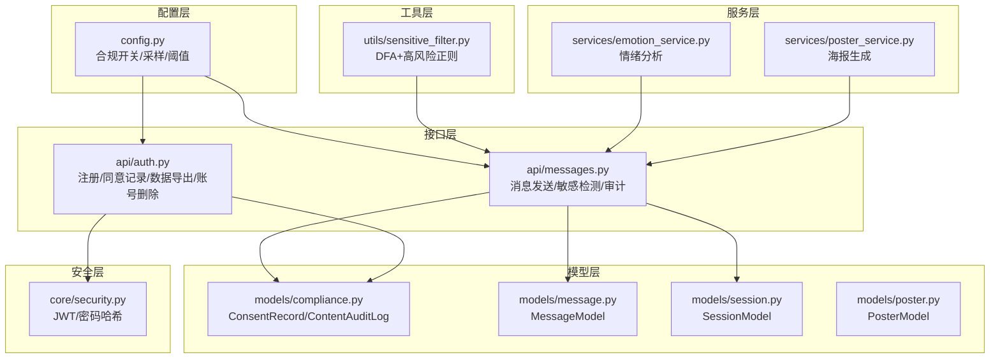
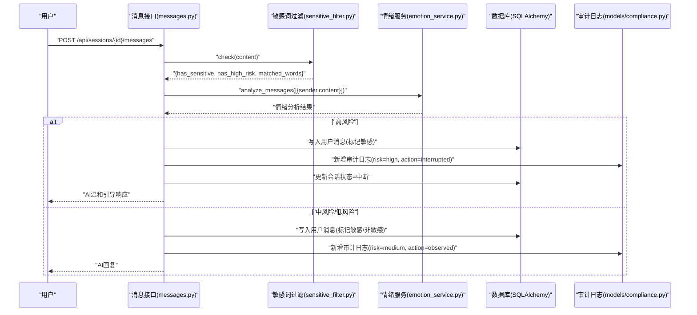
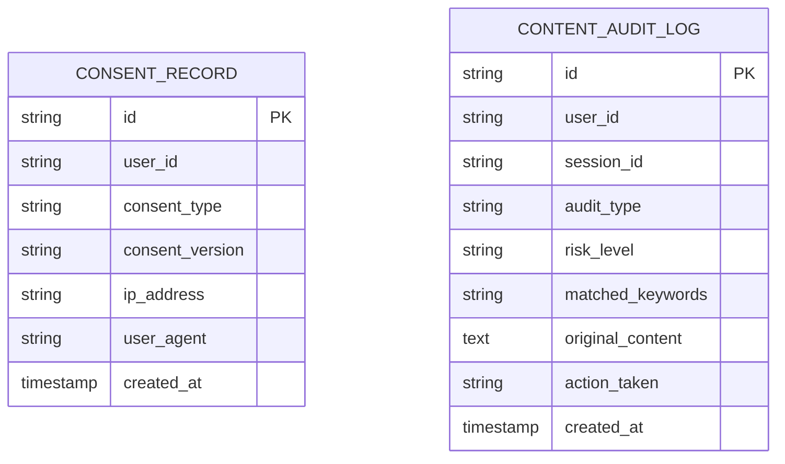
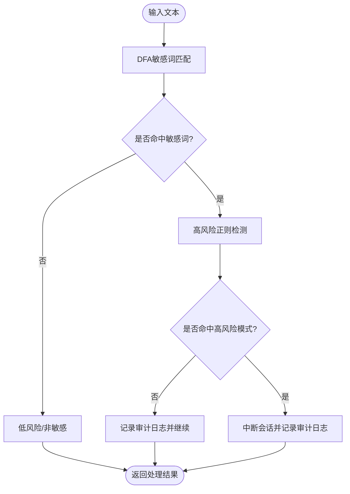
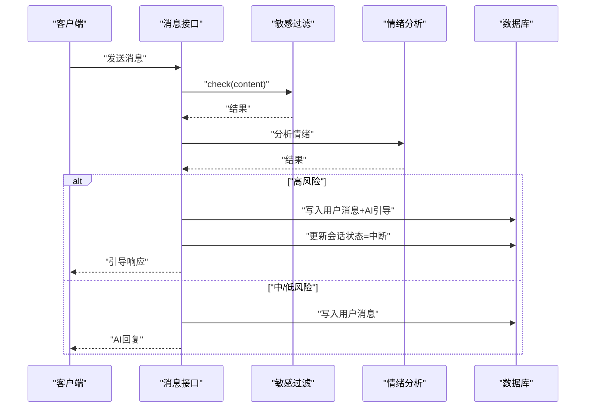
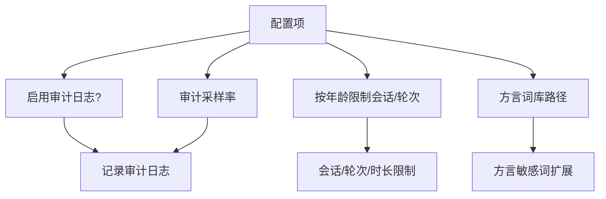
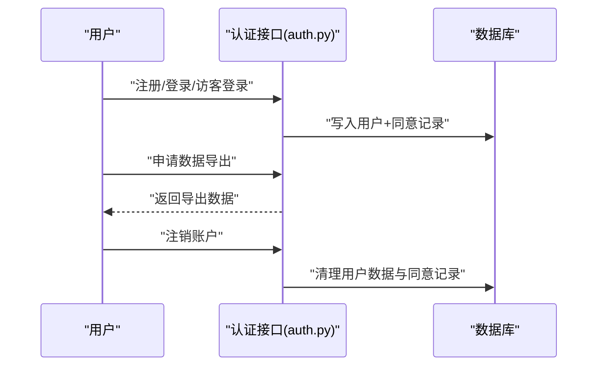
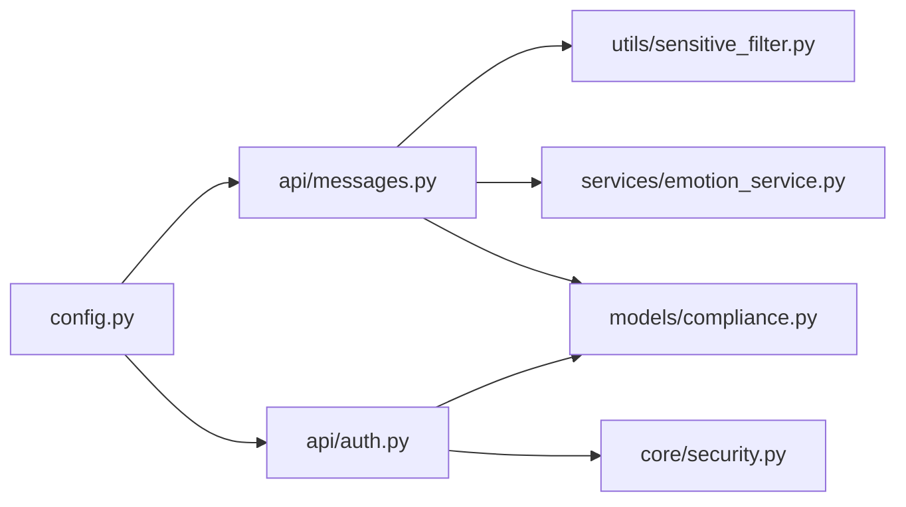

# 合规模型

<cite>
**本文引用的文件**
- [compliance.py](file://emo_outlet_api/app/models/compliance.py)
- [sensitive_filter.py](file://emo_outlet_api/app/utils/sensitive_filter.py)
- [messages.py](file://emo_outlet_api/app/api/messages.py)
- [config.py](file://emo_outlet_api/app/config.py)
- [message.py](file://emo_outlet_api/app/models/message.py)
- [session.py](file://emo_outlet_api/app/models/session.py)
- [poster.py](file://emo_outlet_api/app/models/poster.py)
- [emotion_service.py](file://emo_outlet_api/app/services/emotion_service.py)
- [poster_service.py](file://emo_outlet_api/app/services/poster_service.py)
- [auth.py](file://emo_outlet_api/app/api/auth.py)
- [security.py](file://emo_outlet_api/app/core/security.py)
- [schemas/common.py](file://emo_outlet_api/app/schemas/common.py)
- [schemas/message.py](file://emo_outlet_api/app/schemas/message.py)
- [schemas/poster.py](file://emo_outlet_api/app/schemas/poster.py)
</cite>

## 目录
1. [简介](#简介)
2. [项目结构](#项目结构)
3. [核心组件](#核心组件)
4. [架构总览](#架构总览)
5. [详细组件分析](#详细组件分析)
6. [依赖分析](#依赖分析)
7. [性能考虑](#性能考虑)
8. [故障排查指南](#故障排查指南)
9. [结论](#结论)
10. [附录](#附录)

## 简介
本文件面向Emo Outlet项目的合规模型，系统化阐述合规设计目标与实现：包括合规检查、内容审核、风险评估与审计记录；梳理合规数据采集机制、审核流程与决策逻辑；明确数据验证规则、风险指标与处理策略；解释自动化检测、人工复核与报告生成；提供合规配置示例与监控机制，并覆盖隐私保护、数据安全与法律遵循要求。

## 项目结构
Emo Outlet后端采用FastAPI + SQLAlchemy异步ORM，合规模型主要分布在以下层次：
- 配置层：集中定义合规开关、采样率、防沉迷阈值等
- 模型层：定义同意记录与内容审计日志表结构
- 工具层：敏感词过滤与高风险模式检测
- 服务层：情绪分析与海报生成（为合规报告与风险提示提供依据）
- 接口层：消息发送接口内嵌敏感词检测与审计日志落库
- 安全层：认证与密码哈希，保障访问与数据安全

**图表来源**
- [config.py:94-114](file://emo_outlet_api/app/config.py#L94-L114)
- [compliance.py:12-50](file://emo_outlet_api/app/models/compliance.py#L12-L50)
- [sensitive_filter.py:37-142](file://emo_outlet_api/app/utils/sensitive_filter.py#L37-L142)
- [emotion_service.py:44-181](file://emo_outlet_api/app/services/emotion_service.py#L44-L181)
- [poster_service.py](file://emo_outlet_api/app/services/poster_service.py)
- [messages.py:69-195](file://emo_outlet_api/app/api/messages.py#L69-L195)
- [auth.py:34-74](file://emo_outlet_api/app/api/auth.py#L34-L74)
- [security.py:16-43](file://emo_outlet_api/app/core/security.py#L16-L43)

**章节来源**
- [config.py:94-114](file://emo_outlet_api/app/config.py#L94-L114)
- [compliance.py:12-50](file://emo_outlet_api/app/models/compliance.py#L12-L50)
- [sensitive_filter.py:37-142](file://emo_outlet_api/app/utils/sensitive_filter.py#L37-L142)
- [messages.py:69-195](file://emo_outlet_api/app/api/messages.py#L69-L195)
- [auth.py:34-74](file://emo_outlet_api/app/api/auth.py#L34-L74)
- [security.py:16-43](file://emo_outlet_api/app/core/security.py#L16-L43)

## 核心组件
- 合规数据模型
  - 同意记录：记录用户对隐私政策与服务条款的同意版本与来源信息
  - 内容审计日志：记录每次输入的敏感性、风险等级、命中关键词、原始内容与处置动作
- 敏感词过滤器：基于DFA的O(n)敏感词匹配，结合高风险正则模式，支持温和引导响应
- 消息发送流程：在消息写入数据库前执行敏感检测，按风险级别采取中断或观察策略，并生成审计日志
- 配置项：启用/禁用审计日志、采样率、每日会话上限、对话轮次上限、方言词库路径等
- 用户生命周期：注册时写入同意记录；账户删除时清理用户数据与同意记录；支持数据导出

**章节来源**
- [compliance.py:12-50](file://emo_outlet_api/app/models/compliance.py#L12-L50)
- [sensitive_filter.py:37-142](file://emo_outlet_api/app/utils/sensitive_filter.py#L37-L142)
- [messages.py:69-195](file://emo_outlet_api/app/api/messages.py#L69-L195)
- [config.py:94-114](file://emo_outlet_api/app/config.py#L94-L114)
- [auth.py:34-74](file://emo_outlet_api/app/api/auth.py#L34-L74)
- [auth.py:206-231](file://emo_outlet_api/app/api/auth.py#L206-L231)
- [auth.py:234-317](file://emo_outlet_api/app/api/auth.py#L234-L317)

## 架构总览
合规子系统围绕“消息发送”主流程展开，形成“检测—评估—处置—记录”的闭环，并通过配置中心统一治理。

**图表来源**
- [messages.py:69-195](file://emo_outlet_api/app/api/messages.py#L69-L195)
- [sensitive_filter.py:102-119](file://emo_outlet_api/app/utils/sensitive_filter.py#L102-L119)
- [emotion_service.py:44-71](file://emo_outlet_api/app/services/emotion_service.py#L44-L71)
- [compliance.py:31-50](file://emo_outlet_api/app/models/compliance.py#L31-L50)

## 详细组件分析

### 合规数据模型
- 同意记录（ConsentRecord）
  - 字段要点：用户ID、同意类型（隐私/条款）、版本、IP、UA、时间戳
  - 用途：证明用户同意，支持审计与数据主体权利
- 内容审计日志（ContentAuditLog）
  - 字段要点：用户ID、会话ID、审计类型、风险等级、命中关键词、原始内容、处置动作、时间戳
  - 用途：记录敏感内容处置轨迹，支撑风控与合规审查

**图表来源**
- [compliance.py:12-50](file://emo_outlet_api/app/models/compliance.py#L12-L50)

**章节来源**
- [compliance.py:12-50](file://emo_outlet_api/app/models/compliance.py#L12-L50)

### 敏感词过滤与高风险检测
- DFA敏感词匹配
  - 构建Trie树，实现O(n)复杂度的敏感词查找
  - 支持最长匹配，避免重复与遗漏
- 高风险正则模式
  - 针对自残、自杀、暴力倾向等高危表达进行补充识别
- 温和引导响应
  - 高风险触发时返回安抚式AI回复，降低二次伤害风险

**图表来源**
- [sensitive_filter.py:74-119](file://emo_outlet_api/app/utils/sensitive_filter.py#L74-L119)
- [messages.py:96-126](file://emo_outlet_api/app/api/messages.py#L96-L126)

**章节来源**
- [sensitive_filter.py:37-142](file://emo_outlet_api/app/utils/sensitive_filter.py#L37-L142)
- [messages.py:80-126](file://emo_outlet_api/app/api/messages.py#L80-L126)

### 消息发送与合规处置
- 输入校验与长度限制
  - 请求体字段长度上限由配置项控制
- 情绪分析
  - 基于关键词与标点统计计算情绪分数与关键词提取
- 敏感检测与处置
  - 中高风险时中断会话并插入AI温和引导消息
  - 记录审计日志，包含风险等级与处置动作
- 会话轮次与时长控制
  - 根据年龄区间与配置项限制对话轮次
  - 超时时自动结束会话

**图表来源**
- [messages.py:69-195](file://emo_outlet_api/app/api/messages.py#L69-L195)
- [emotion_service.py:44-181](file://emo_outlet_api/app/services/emotion_service.py#L44-L181)
- [schemas/message.py:8-26](file://emo_outlet_api/app/schemas/message.py#L8-L26)

**章节来源**
- [messages.py:69-195](file://emo_outlet_api/app/api/messages.py#L69-L195)
- [emotion_service.py:44-181](file://emo_outlet_api/app/services/emotion_service.py#L44-L181)
- [schemas/message.py:8-26](file://emo_outlet_api/app/schemas/message.py#L8-L26)

### 合规配置与策略
- 合规版本与开关
  - 合规版本号用于审计追溯
  - 审计日志开关与采样率控制成本与覆盖面
- 防沉迷与会话限制
  - 不同年龄段每日最大会话数
  - 对话轮次上限与会话时长限制
- 方言词库路径
  - 可选方言词库目录，便于扩展本地化敏感词

**图表来源**
- [config.py:94-114](file://emo_outlet_api/app/config.py#L94-L114)

**章节来源**
- [config.py:94-114](file://emo_outlet_api/app/config.py#L94-L114)

### 用户生命周期与数据权利
- 注册时写入同意记录
- 账户删除时级联清理用户数据与同意记录
- 数据导出接口支持用户获取自身历史数据

**图表来源**
- [auth.py:34-74](file://emo_outlet_api/app/api/auth.py#L34-L74)
- [auth.py:206-231](file://emo_outlet_api/app/api/auth.py#L206-L231)
- [auth.py:234-317](file://emo_outlet_api/app/api/auth.py#L234-L317)

**章节来源**
- [auth.py:34-74](file://emo_outlet_api/app/api/auth.py#L34-L74)
- [auth.py:206-231](file://emo_outlet_api/app/api/auth.py#L206-L231)
- [auth.py:234-317](file://emo_outlet_api/app/api/auth.py#L234-L317)

## 依赖分析
- 组件耦合
  - 消息接口依赖敏感过滤与情绪服务，耦合度适中，职责清晰
  - 审计日志模型独立，便于扩展与审计
- 外部依赖
  - 配置中心集中管理合规策略
  - 安全模块提供JWT与密码哈希，保障访问安全

**图表来源**
- [messages.py:69-195](file://emo_outlet_api/app/api/messages.py#L69-L195)
- [sensitive_filter.py:37-142](file://emo_outlet_api/app/utils/sensitive_filter.py#L37-L142)
- [emotion_service.py:44-181](file://emo_outlet_api/app/services/emotion_service.py#L44-L181)
- [compliance.py:12-50](file://emo_outlet_api/app/models/compliance.py#L12-L50)
- [auth.py:34-74](file://emo_outlet_api/app/api/auth.py#L34-L74)
- [security.py:16-43](file://emo_outlet_api/app/core/security.py#L16-L43)
- [config.py:94-114](file://emo_outlet_api/app/config.py#L94-L114)

**章节来源**
- [messages.py:69-195](file://emo_outlet_api/app/api/messages.py#L69-L195)
- [auth.py:34-74](file://emo_outlet_api/app/api/auth.py#L34-L74)
- [security.py:16-43](file://emo_outlet_api/app/core/security.py#L16-L43)
- [config.py:94-114](file://emo_outlet_api/app/config.py#L94-L114)

## 性能考虑
- 敏感词检测
  - DFA算法O(n)线性扫描，适合高频消息流
  - 高风险正则仅在命中敏感词后触发，降低额外开销
- 审计日志
  - 通过采样率与开关控制写入频率，平衡成本与覆盖
- 情绪分析
  - 关键词计数与统计量计算，复杂度与文本长度线性相关
- 会话轮次与时长
  - 在接口层快速判定，避免无效AI调用

[本节为通用性能讨论，无需具体文件引用]

## 故障排查指南
- 审计日志缺失
  - 检查配置项中的审计开关与采样率
  - 确认消息发送接口是否正确写入日志
- 高风险未中断
  - 核对敏感词库与高风险正则是否覆盖目标表达
  - 检查会话状态更新逻辑
- 情绪分析异常
  - 核对关键词库与停用词集合
  - 检查消息历史截断与序列号
- 数据导出/删除不完整
  - 确认级联删除逻辑与外键约束
  - 核对用户身份校验中间件

**章节来源**
- [config.py:94-114](file://emo_outlet_api/app/config.py#L94-L114)
- [messages.py:96-126](file://emo_outlet_api/app/api/messages.py#L96-L126)
- [emotion_service.py:83-121](file://emo_outlet_api/app/services/emotion_service.py#L83-L121)
- [auth.py:206-231](file://emo_outlet_api/app/api/auth.py#L206-L231)

## 结论
Emo Outlet的合规模型以“检测—评估—处置—记录”为主线，结合配置中心实现策略可插拔治理。敏感词过滤与高风险正则构成自动化检测基石，情绪分析与温和引导提升干预质量，审计日志与同意记录完善合规证据链。通过会话轮次与时长限制、数据导出与删除机制，满足未成年人保护与数据主体权利要求。

[本节为总结性内容，无需具体文件引用]

## 附录

### 合规数据验证规则
- 输入长度与格式
  - 消息内容长度上限由配置项控制
  - 审计日志字段长度与类型严格对应模型定义
- 风险等级映射
  - 高风险：命中高危表达
  - 中风险：命中敏感词但非高危
  - 低风险：未命中敏感词
- 处置动作
  - 高风险：中断会话并插入AI引导
  - 中/低风险：继续对话并记录审计日志

**章节来源**
- [schemas/message.py:8-26](file://emo_outlet_api/app/schemas/message.py#L8-L26)
- [messages.py:96-126](file://emo_outlet_api/app/api/messages.py#L96-L126)
- [compliance.py:31-50](file://emo_outlet_api/app/models/compliance.py#L31-L50)

### 风险指标与处理策略
- 风险指标
  - 是否命中敏感词、是否命中高风险模式、命中关键词列表
- 处理策略
  - 高风险：立即中断、记录审计日志、返回温和引导
  - 中/低风险：记录审计日志、继续对话
  - 会话轮次与时长：超限自动结束

**章节来源**
- [sensitive_filter.py:102-119](file://emo_outlet_api/app/utils/sensitive_filter.py#L102-L119)
- [messages.py:140-164](file://emo_outlet_api/app/api/messages.py#L140-L164)

### 自动化检测、人工复核与报告生成
- 自动化检测
  - DFA+高风险正则实现毫秒级检测
- 人工复核
  - 审计日志可作为人工复核线索，支持抽样与全量
- 报告生成
  - 情绪报告与详情报告基于已完成会话与情绪摘要生成

**章节来源**
- [sensitive_filter.py:37-142](file://emo_outlet_api/app/utils/sensitive_filter.py#L37-L142)
- [poster_service.py](file://emo_outlet_api/app/services/poster_service.py)
- [posters.py:251-318](file://emo_outlet_api/app/api/posters.py#L251-318)
- [posters.py:321-407](file://emo_outlet_api/app/api/posters.py#L321-407)

### 配置示例与监控机制
- 配置示例
  - 启用审计日志与设置采样率
  - 设置不同年龄段的每日会话上限与对话轮次上限
  - 指定方言词库目录
- 监控机制
  - 审计日志数量与风险分布统计
  - 高风险触发率与中断会话比例
  - 消息处理延迟与失败率

**章节来源**
- [config.py:94-114](file://emo_outlet_api/app/config.py#L94-L114)

### 隐私保护、数据安全与法律遵循
- 隐私保护
  - 明确同意记录与版本管理
  - 支持数据导出与删除，满足数据主体权利
- 数据安全
  - JWT认证与密码哈希
  - 审计日志最小化原则与脱敏存储
- 法律遵循
  - 防沉迷与未成年人保护策略
  - 高风险内容干预与记录保存

**章节来源**
- [auth.py:34-74](file://emo_outlet_api/app/api/auth.py#L34-L74)
- [auth.py:234-317](file://emo_outlet_api/app/api/auth.py#L234-L317)
- [security.py:16-43](file://emo_outlet_api/app/core/security.py#L16-L43)
- [config.py:97-107](file://emo_outlet_api/app/config.py#L97-L107)