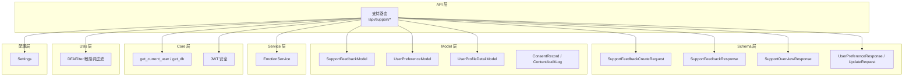
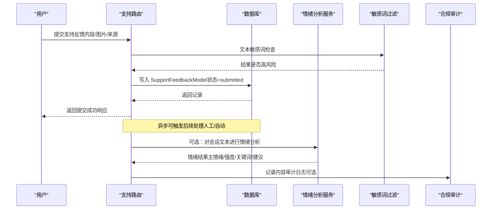
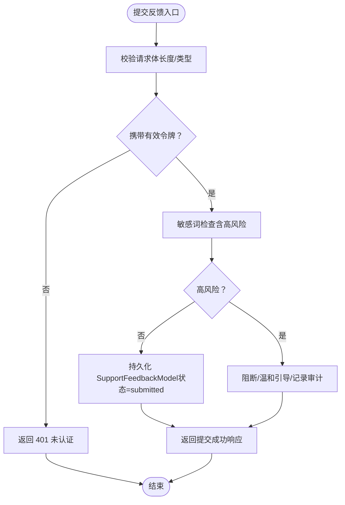
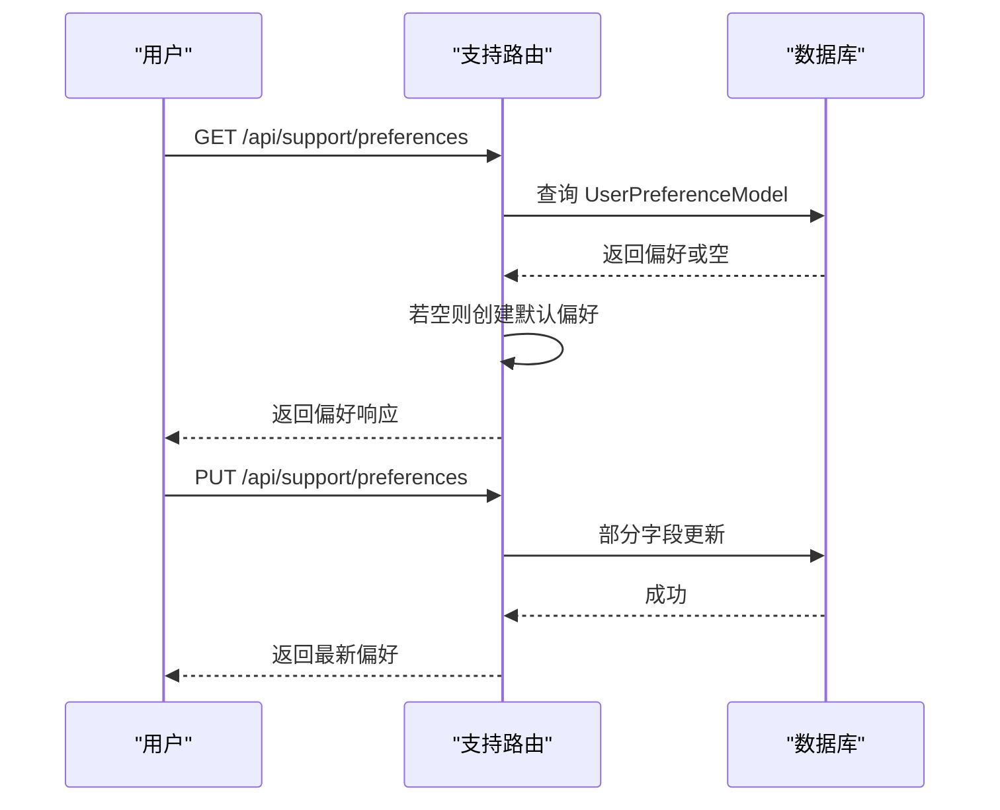
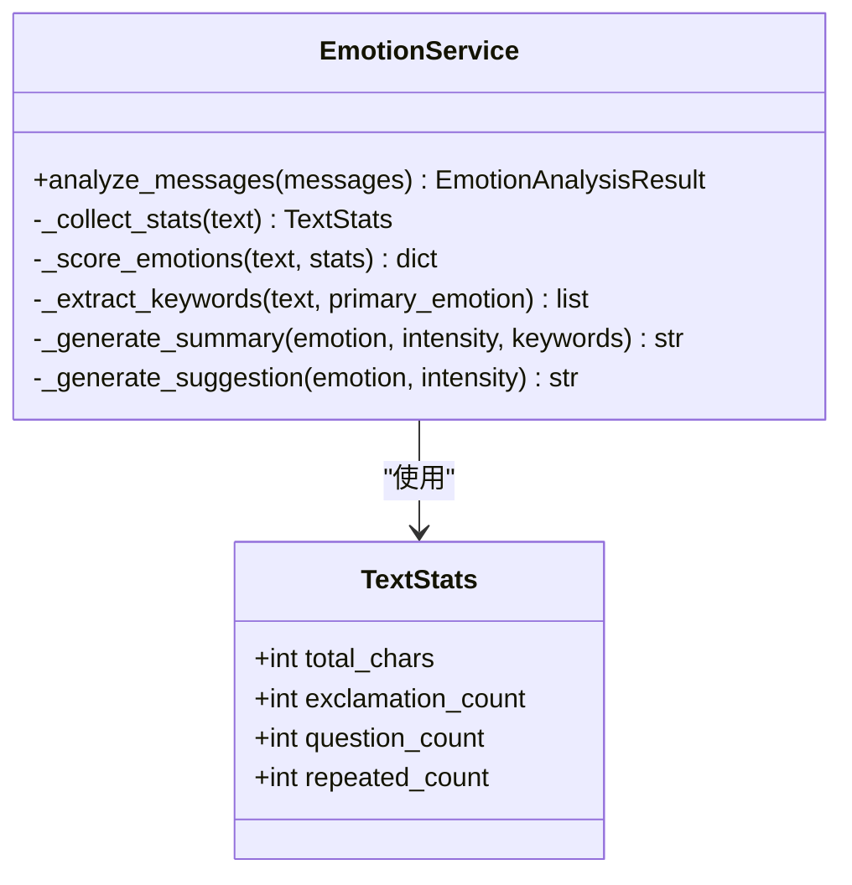
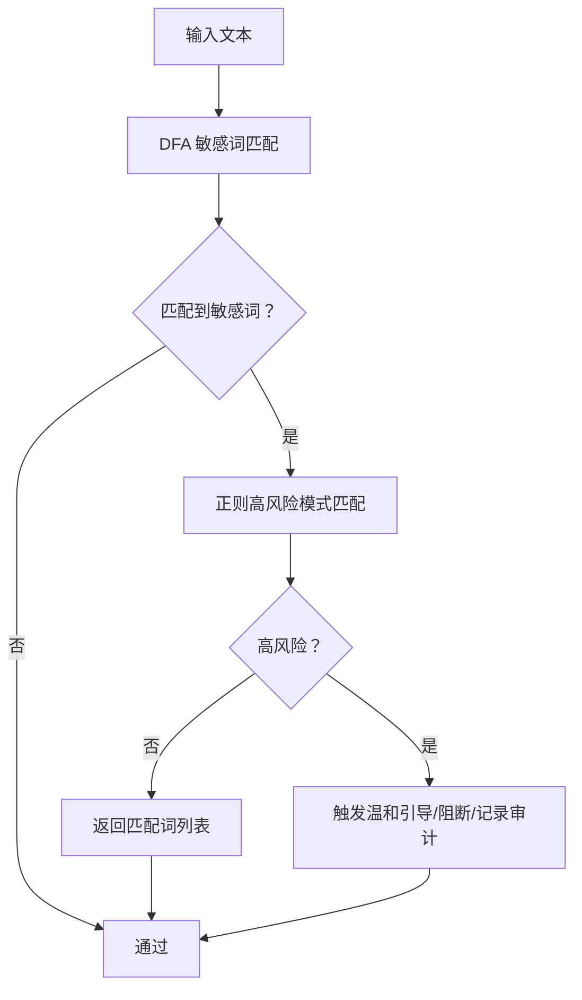
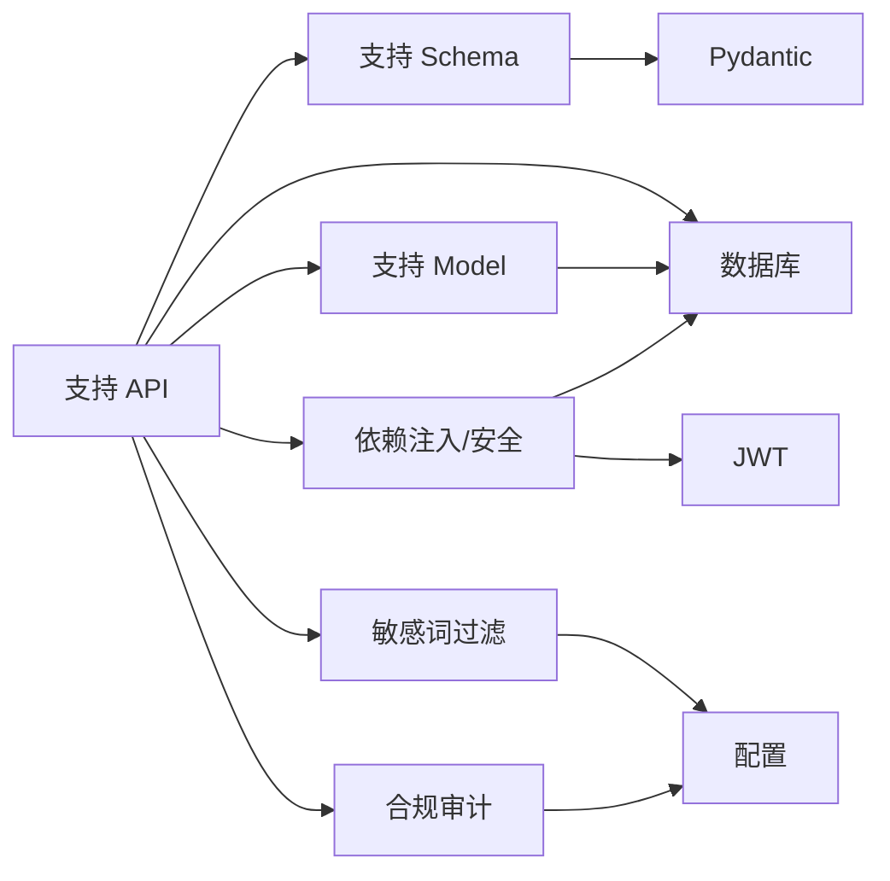

# 支持模型

<cite>
**本文引用的文件**
- [support.py](file://emo_outlet_api/app/models/support.py)
- [support.py](file://emo_outlet_api/app/schemas/support.py)
- [support.py](file://emo_outlet_api/app/api/support.py)
- [emotion_service.py](file://emo_outlet_api/app/services/emotion_service.py)
- [user.py](file://emo_outlet_api/app/models/user.py)
- [user.py](file://emo_outlet_api/app/schemas/user.py)
- [database.py](file://emo_outlet_api/app/database.py)
- [dependencies.py](file://emo_outlet_api/app/core/dependencies.py)
- [sensitive_filter.py](file://emo_outlet_api/app/utils/sensitive_filter.py)
- [compliance.py](file://emo_outlet_api/app/models/compliance.py)
- [config.py](file://emo_outlet_api/app/config.py)
- [main.py](file://emo_outlet_api/app/main.py)
- [security.py](file://emo_outlet_api/app/core/security.py)
</cite>

## 目录
1. [简介](#简介)
2. [项目结构](#项目结构)
3. [核心组件](#核心组件)
4. [架构总览](#架构总览)
5. [详细组件分析](#详细组件分析)
6. [依赖关系分析](#依赖关系分析)
7. [性能考量](#性能考量)
8. [故障排查指南](#故障排查指南)
9. [结论](#结论)
10. [附录](#附录)

## 简介
本文件面向 Emo Outlet 项目的“支持模型”，系统化阐述支持请求、问题分类、处理状态与用户反馈的业务定位与实现机制。重点覆盖：
- 支持数据的业务流程与优先级管理
- 支持模型的数据验证规则、分类标准与状态转换逻辑
- 自动化处理、人工干预与跟踪机制
- 支持操作的实现示例与工作流程
- 支持数据的隐私保护与客户服务最佳实践

## 项目结构
支持模型位于后端 API 子系统中，采用分层设计：
- API 层：定义支持相关的路由与对外接口
- Schema 层：定义请求/响应模型与字段校验规则
- Model 层：定义数据库表结构与字段约束
- Service 层：提供情绪分析能力，辅助支持场景
- Core 层：认证、依赖注入、数据库连接与安全工具
- Utils 层：敏感词过滤与合规审计日志
- 配置层：全局参数与合规阈值

图表来源
- [support.py:22-140](file://emo_outlet_api/app/api/support.py#L22-L140)
- [support.py:8-56](file://emo_outlet_api/app/schemas/support.py#L8-L56)
- [support.py:27-66](file://emo_outlet_api/app/models/support.py#L27-L66)
- [emotion_service.py:44-181](file://emo_outlet_api/app/services/emotion_service.py#L44-L181)
- [dependencies.py:18-67](file://emo_outlet_api/app/core/dependencies.py#L18-L67)
- [sensitive_filter.py:37-142](file://emo_outlet_api/app/utils/sensitive_filter.py#L37-L142)
- [config.py:12-125](file://emo_outlet_api/app/config.py#L12-L125)

章节来源
- [main.py:51-63](file://emo_outlet_api/app/main.py#L51-L63)
- [database.py:34-43](file://emo_outlet_api/app/database.py#L34-L43)

## 核心组件
- 支持反馈模型（SupportFeedbackModel）
  - 字段：id、user_id、content、image_urls、source、status、created_at
  - 约束：主键、索引、默认值、时间戳
- 用户偏好模型（UserPreferenceModel）
  - 字段：user_id 主键、多项布尔开关、语言方言、微信绑定标记、更新时间
- 支持反馈 Schema
  - 请求：内容长度限制、图片 URL 列表、来源标识
  - 响应：状态、消息提示、创建时间
- 支持概览 Schema
  - 在线状态、服务时间、邮箱、社区名称、预览对话与常见条目
- 用户偏好 Schema
  - 查询响应与更新请求体
- 情绪分析服务（EmotionService）
  - 基于关键词与统计特征计算情绪分数、提取关键词、生成摘要与建议
- 敏感词过滤（DFAFilter）
  - DFA Trie 树 + 正则高风险模式，支持温和引导语
- 合规与审计（ConsentRecord、ContentAuditLog）
  - 记录同意版本、IP/UA、风险等级、动作与原始内容

章节来源
- [support.py:27-43](file://emo_outlet_api/app/models/support.py#L27-L43)
- [support.py:17-28](file://emo_outlet_api/app/schemas/support.py#L17-L28)
- [support.py:8-15](file://emo_outlet_api/app/schemas/support.py#L8-L15)
- [support.py:30-56](file://emo_outlet_api/app/schemas/support.py#L30-L56)
- [emotion_service.py:44-181](file://emo_outlet_api/app/services/emotion_service.py#L44-L181)
- [sensitive_filter.py:37-142](file://emo_outlet_api/app/utils/sensitive_filter.py#L37-L142)
- [compliance.py:12-50](file://emo_outlet_api/app/models/compliance.py#L12-L50)

## 架构总览
支持模型围绕“反馈提交—状态流转—偏好管理—合规审计—情绪辅助”展开，形成闭环的客户服务与风险控制体系。

图表来源
- [support.py:64-91](file://emo_outlet_api/app/api/support.py#L64-L91)
- [support.py:27-43](file://emo_outlet_api/app/models/support.py#L27-L43)
- [emotion_service.py:44-72](file://emo_outlet_api/app/services/emotion_service.py#L44-L72)
- [sensitive_filter.py:102-119](file://emo_outlet_api/app/utils/sensitive_filter.py#L102-L119)
- [compliance.py:31-50](file://emo_outlet_api/app/models/compliance.py#L31-L50)

## 详细组件分析

### 支持反馈模型与流程
- 数据模型
  - 支持反馈表包含用户标识、内容、图片链接、来源、状态与创建时间；状态默认为“submitted”
  - 用户偏好表包含多项通知与行为开关、方言与绑定标记
- 提交流程
  - 用户通过认证后提交反馈，后端写入数据库并返回统一响应
  - 图片 URL 以 JSON 字符串存储，便于扩展多图场景
- 状态管理
  - 当前仅定义“submitted”初始状态；后续可扩展为“待处理/处理中/已解决/已关闭”等
- 业务规则
  - 内容长度限制由 Schema 控制；图片 URL 列表为空时可直接提交
- 验证规则
  - 请求体字段长度与类型约束在 Schema 中定义
  - 认证依赖在 API 层通过当前用户依赖注入强制执行

图表来源
- [support.py:64-91](file://emo_outlet_api/app/api/support.py#L64-L91)
- [support.py:17-20](file://emo_outlet_api/app/schemas/support.py#L17-L20)
- [dependencies.py:18-50](file://emo_outlet_api/app/core/dependencies.py#L18-L50)
- [sensitive_filter.py:102-119](file://emo_outlet_api/app/utils/sensitive_filter.py#L102-L119)

章节来源
- [support.py:27-43](file://emo_outlet_api/app/models/support.py#L27-L43)
- [support.py:17-28](file://emo_outlet_api/app/schemas/support.py#L17-L28)
- [support.py:64-91](file://emo_outlet_api/app/api/support.py#L64-L91)
- [dependencies.py:18-50](file://emo_outlet_api/app/core/dependencies.py#L18-L50)

### 用户偏好管理
- 查询与更新
  - 若用户偏好不存在，首次访问时自动创建默认值
  - 更新接口支持部分字段更新，避免覆盖未变更项
- 默认值与开关
  - 包含历史保存、海报权限、私密模式、自动清理会话、各类提醒、系统通知、方言与微信绑定标记
- 与支持流程的关系
  - 偏好可影响客服侧的沟通策略与推送节奏，例如提醒开关与方言设置

图表来源
- [support.py:93-140](file://emo_outlet_api/app/api/support.py#L93-L140)
- [support.py:46-66](file://emo_outlet_api/app/models/support.py#L46-L66)

章节来源
- [support.py:25-38](file://emo_outlet_api/app/api/support.py#L25-L38)
- [support.py:93-140](file://emo_outlet_api/app/api/support.py#L93-L140)
- [support.py:46-66](file://emo_outlet_api/app/models/support.py#L46-L66)

### 情绪分析与支持联动
- 情绪分析服务
  - 基于关键词集合与统计特征（标点、重复字符、长度）计算情绪分数
  - 输出主情绪、强度、关键词、摘要与建议
- 与支持的结合
  - 可对用户会话文本进行分析，辅助客服判断情绪状态与风险等级
  - 作为“智能辅助”提升支持效率与质量

图表来源
- [emotion_service.py:44-181](file://emo_outlet_api/app/services/emotion_service.py#L44-L181)

章节来源
- [emotion_service.py:44-181](file://emo_outlet_api/app/services/emotion_service.py#L44-L181)

### 敏感词过滤与高风险处置
- 敏感词库与高风险模式
  - 基于 DFA Trie 树实现 O(n) 匹配，同时使用正则识别高风险模式
- 高风险处置
  - 触发高风险时可采取温和引导、阻断或记录审计日志
- 与支持流程的衔接
  - 在反馈提交阶段即进行敏感词检查，确保内容安全

图表来源
- [sensitive_filter.py:74-119](file://emo_outlet_api/app/utils/sensitive_filter.py#L74-L119)

章节来源
- [sensitive_filter.py:37-142](file://emo_outlet_api/app/utils/sensitive_filter.py#L37-L142)

### 合规与审计日志
- 同意记录（ConsentRecord）
  - 记录用户同意类型、版本、IP/UA、时间
- 内容审计日志（ContentAuditLog）
  - 记录用户 ID、会话 ID、审计类型、风险等级、匹配关键词、原始内容、处理动作与时间
- 与支持的关联
  - 支持反馈可作为审计日志的输入源之一，便于追踪与复核

章节来源
- [compliance.py:12-50](file://emo_outlet_api/app/models/compliance.py#L12-L50)

## 依赖关系分析
- 组件耦合
  - API 层依赖 Schema、Model、依赖注入与安全模块
  - 模型层依赖数据库基类与 SQLAlchemy 映射
  - 服务层独立于 API，可被其他模块调用
- 外部依赖
  - 数据库：异步 SQLAlchemy
  - 认证：JWT
  - 配置：Pydantic Settings
- 潜在循环依赖
  - 通过模块导入顺序与延迟初始化避免循环

图表来源
- [support.py:14-21](file://emo_outlet_api/app/api/support.py#L14-L21)
- [database.py:10-15](file://emo_outlet_api/app/database.py#L10-L15)
- [dependencies.py:18-50](file://emo_outlet_api/app/core/dependencies.py#L18-L50)
- [security.py:26-42](file://emo_outlet_api/app/core/security.py#L26-L42)
- [config.py:12-125](file://emo_outlet_api/app/config.py#L12-L125)

章节来源
- [main.py:51-63](file://emo_outlet_api/app/main.py#L51-L63)
- [database.py:34-43](file://emo_outlet_api/app/database.py#L34-L43)
- [dependencies.py:18-50](file://emo_outlet_api/app/core/dependencies.py#L18-L50)

## 性能考量
- 敏感词匹配
  - DFA Trie 树实现 O(n) 匹配，适合高频文本扫描
- 数据库写入
  - 使用异步 Session，提交与回滚在依赖中统一管理，减少连接开销
- 情绪分析
  - 关键词计数与统计特征计算复杂度较低，适合实时分析
- 建议
  - 对高并发场景可引入缓存与队列异步处理，降低峰值延迟

## 故障排查指南
- 常见错误与定位
  - 401 未认证：检查令牌有效性与依赖注入
  - 403 被封禁：检查用户状态与封禁原因
  - 404 用户不存在：检查令牌对应的用户是否存在
  - 数据库异常：确认 Session 生命周期与回滚逻辑
- 排查步骤
  - 查看请求日志与响应状态
  - 核对 Schema 校验失败字段
  - 检查敏感词过滤触发与审计日志
  - 确认用户偏好是否正确创建与更新

章节来源
- [dependencies.py:18-50](file://emo_outlet_api/app/core/dependencies.py#L18-L50)
- [database.py:22-32](file://emo_outlet_api/app/database.py#L22-L32)

## 结论
支持模型以“反馈提交—状态流转—偏好管理—合规审计—情绪辅助”为核心闭环，既满足客户服务的即时需求，又兼顾风险控制与隐私保护。当前实现聚焦于反馈收集与偏好管理，后续可在状态机扩展、自动化处理与人工干预流程上进一步完善，以提升支持效率与用户体验。

## 附录

### 支持操作实现示例与工作流程
- 提交支持反馈
  - 路径：POST /api/support/feedback
  - 输入：内容、图片 URL 列表、来源
  - 输出：状态、消息、创建时间
  - 流程：认证校验 → 敏感词检查 → 写入数据库 → 返回响应
- 获取支持概览
  - 路径：GET /api/support/overview
  - 输出：在线状态、服务时间、邮箱、社区名称、常见条目与预览对话
- 获取与更新用户偏好
  - 路径：GET /api/support/preferences
  - 路径：PUT /api/support/preferences
  - 行为：若不存在则创建默认偏好；支持部分字段更新

章节来源
- [support.py:41-62](file://emo_outlet_api/app/api/support.py#L41-L62)
- [support.py:64-91](file://emo_outlet_api/app/api/support.py#L64-L91)
- [support.py:93-140](file://emo_outlet_api/app/api/support.py#L93-L140)

### 支持数据的隐私保护与客户服务最佳实践
- 隐私保护
  - 仅存储必要字段，避免敏感信息冗余
  - 审计日志记录 IP/UA 与风险等级，不存储完整明文内容
  - 敏感词过滤与高风险处置，防止不当内容传播
- 客户服务最佳实践
  - 提供温和引导与资源链接，避免激化情绪
  - 通过偏好管理优化沟通节奏与方式
  - 建立状态机与工单系统，确保可追溯与闭环

章节来源
- [sensitive_filter.py:128-138](file://emo_outlet_api/app/utils/sensitive_filter.py#L128-L138)
- [compliance.py:31-50](file://emo_outlet_api/app/models/compliance.py#L31-L50)
- [config.py:94-111](file://emo_outlet_api/app/config.py#L94-L111)