# 数据库概览

<cite>
**本文档引用的文件**
- [config.py](file://emo_outlet_api/app/config.py)
- [database.py](file://emo_outlet_api/app/database.py)
- [main.py](file://emo_outlet_api/app/main.py)
- [dependencies.py](file://emo_outlet_api/app/core/dependencies.py)
- [user.py](file://emo_outlet_api/app/models/user.py)
- [message.py](file://emo_outlet_api/app/models/message.py)
- [session.py](file://emo_outlet_api/app/models/session.py)
- [env.py](file://emo_outlet_api/alembic/env.py)
- [alembic.ini](file://emo_outlet_api/alembic.ini)
- [requirements.txt](file://emo_outlet_api/requirements.txt)
- [run.py](file://emo_outlet_api/run.py)
</cite>

## 目录
1. [简介](#简介)
2. [项目结构](#项目结构)
3. [核心组件](#核心组件)
4. [架构概览](#架构概览)
5. [详细组件分析](#详细组件分析)
6. [依赖关系分析](#依赖关系分析)
7. [性能考虑](#性能考虑)
8. [故障排除指南](#故障排除指南)
9. [结论](#结论)

## 简介

Emo Outlet项目采用现代化的异步数据库架构，基于SQLAlchemy 2.0的异步功能和FastAPI框架构建。该数据库系统支持MySQL和SQLite两种存储后端，提供了完整的连接池管理、会话生命周期控制和ORM模型设计。

## 项目结构

数据库相关的核心文件组织如下：

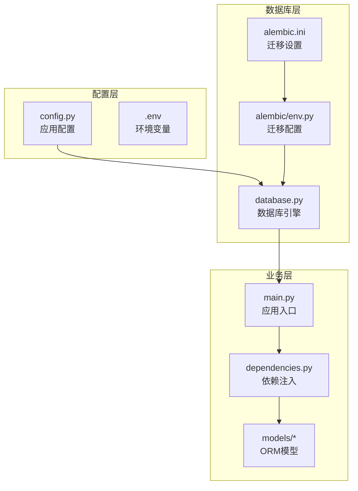

**图表来源**
- [config.py:1-125](file://emo_outlet_api/app/config.py#L1-L125)
- [database.py:1-43](file://emo_outlet_api/app/database.py#L1-L43)
- [main.py:1-82](file://emo_outlet_api/app/main.py#L1-L82)

**章节来源**
- [config.py:1-125](file://emo_outlet_api/app/config.py#L1-L125)
- [database.py:1-43](file://emo_outlet_api/app/database.py#L1-L43)
- [main.py:1-82](file://emo_outlet_api/app/main.py#L1-L82)

## 核心组件

### 数据库配置系统

项目采用Pydantic Settings实现的强类型配置系统，支持多种数据库后端：

- **MySQL配置**：通过环境变量配置主机、端口、用户名、密码和数据库名
- **SQLite配置**：提供开发环境的本地文件数据库
- **动态URL选择**：根据DATABASE_URL环境变量自动选择数据库类型

### 异步数据库引擎

使用SQLAlchemy 2.0的异步功能创建高性能的数据库连接：

- **异步引擎**：基于aiomysql驱动的异步MySQL连接
- **SQLite支持**：开发环境下的本地文件数据库
- **连接池配置**：默认的异步连接池设置

### ORM模型基类

Base类作为所有数据库模型的基类，提供统一的元数据管理和表结构定义。

**章节来源**
- [config.py:22-41](file://emo_outlet_api/app/config.py#L22-L41)
- [database.py:8-19](file://emo_outlet_api/app/database.py#L8-L19)
- [database.py:18](file://emo_outlet_api/app/database.py#L18)

## 架构概览

数据库系统的整体架构采用分层设计，确保了良好的可维护性和扩展性：

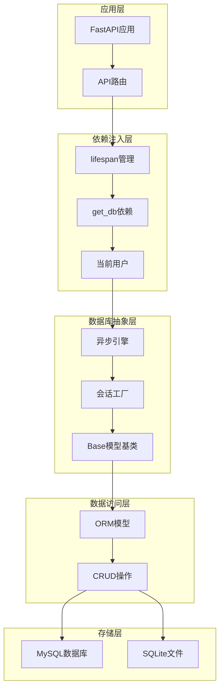

**图表来源**
- [main.py:14-21](file://emo_outlet_api/app/main.py#L14-L21)
- [database.py:22-32](file://emo_outlet_api/app/database.py#L22-L32)
- [dependencies.py:18-50](file://emo_outlet_api/app/core/dependencies.py#L18-L50)

## 详细组件分析

### 数据库连接配置

#### 配置类设计

配置系统采用继承BaseSettings的Settings类，提供类型安全的配置管理：

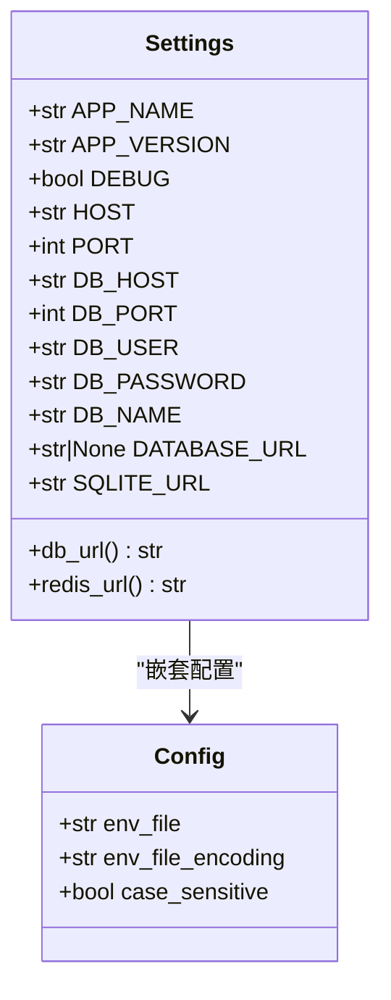

**图表来源**
- [config.py:12-62](file://emo_outlet_api/app/config.py#L12-L62)

#### 数据库URL构建逻辑

数据库URL的构建遵循优先级原则：

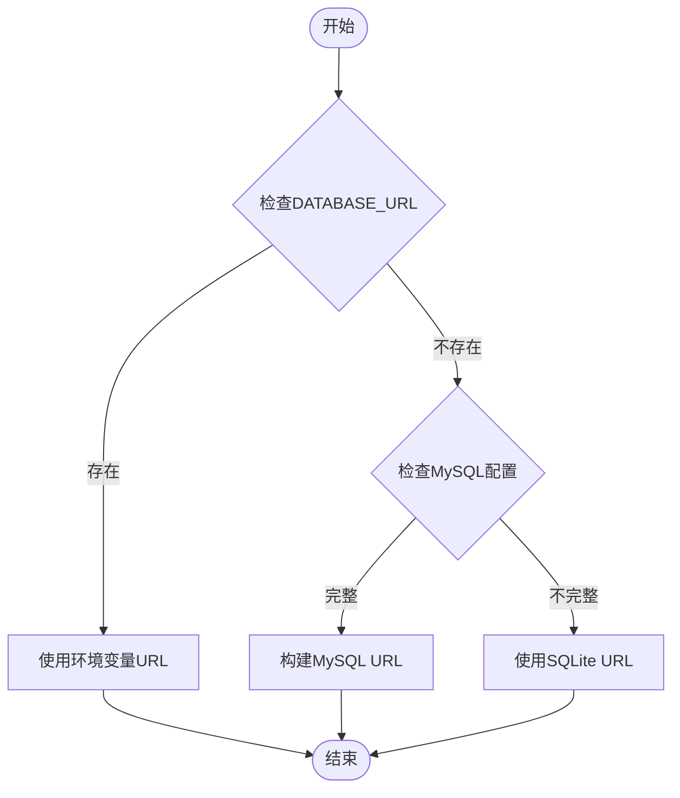

**图表来源**
- [config.py:30-40](file://emo_outlet_api/app/config.py#L30-L40)

**章节来源**
- [config.py:12-62](file://emo_outlet_api/app/config.py#L12-L62)
- [config.py:30-40](file://emo_outlet_api/app/config.py#L30-L40)

### 异步连接池设置

#### 引擎创建配置

数据库引擎采用异步配置，支持高性能并发操作：

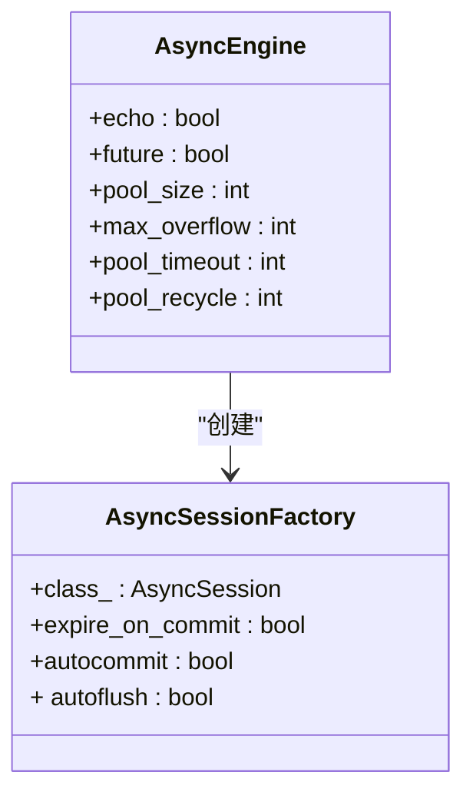

**图表来源**
- [database.py:10-15](file://emo_outlet_api/app/database.py#L10-L15)

#### 连接池参数说明

- **异步特性**：使用aiomysql驱动支持异步I/O操作
- **连接超时**：默认超时时间适用于大多数场景
- **连接回收**：定期回收长时间未使用的连接
- **回滚机制**：异常情况下自动回滚事务

**章节来源**
- [database.py:10-15](file://emo_outlet_api/app/database.py#L10-L15)

### 数据库初始化流程

#### 应用生命周期管理

应用启动和关闭过程中的数据库管理：

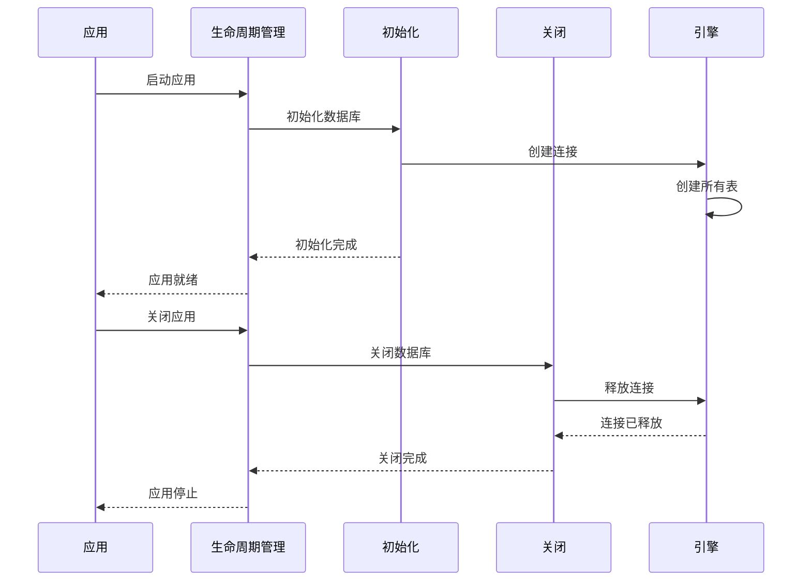

**图表来源**
- [main.py:14-21](file://emo_outlet_api/app/main.py#L14-L21)
- [database.py:34-43](file://emo_outlet_api/app/database.py#L34-L43)

#### 表结构初始化

初始化过程中自动创建所有定义的表结构，包括用户、会话、消息等核心业务表。

**章节来源**
- [main.py:14-21](file://emo_outlet_api/app/main.py#L14-L21)
- [database.py:34-38](file://emo_outlet_api/app/database.py#L34-L38)

### SQLAlchemy ORM配置

#### Base模型基类设计

Base类作为所有ORM模型的基类，提供统一的元数据管理：

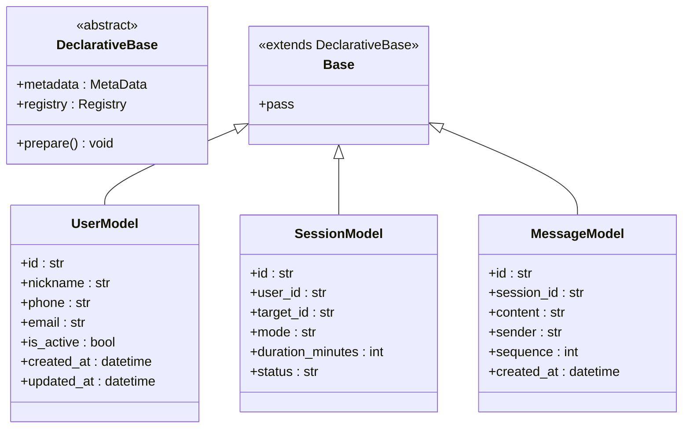

**图表来源**
- [database.py:18](file://emo_outlet_api/app/database.py#L18)
- [user.py:14](file://emo_outlet_api/app/models/user.py#L14)
- [session.py:13](file://emo_outlet_api/app/models/session.py#L13)
- [message.py:13](file://emo_outlet_api/app/models/message.py#L13)

#### 模型关系设计

各模型之间的关系设计体现了业务逻辑的完整性：

- **用户-会话关系**：一对多关系，一个用户可以有多个会话
- **会话-消息关系**：一对多关系，一个会话包含多条消息
- **外键约束**：确保数据一致性和引用完整性

**章节来源**
- [user.py:51-52](file://emo_outlet_api/app/models/user.py#L51-L52)
- [session.py:73-75](file://emo_outlet_api/app/models/session.py#L73-L75)
- [message.py:42](file://emo_outlet_api/app/models/message.py#L42)

### 依赖注入机制

#### 会话管理器配置

依赖注入系统提供了完整的数据库会话管理：

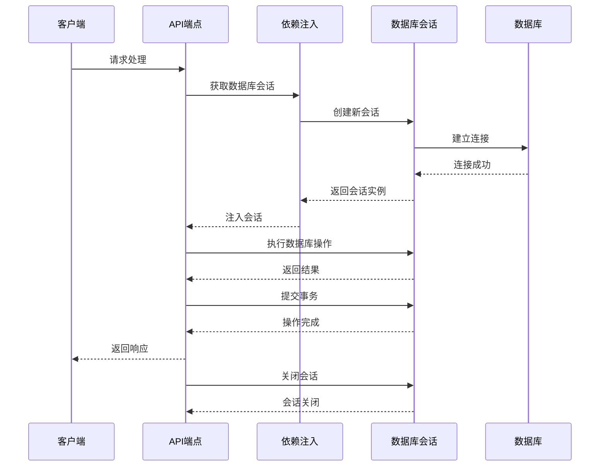

**图表来源**
- [database.py:22-32](file://emo_outlet_api/app/database.py#L22-L32)
- [dependencies.py:18-50](file://emo_outlet_api/app/core/dependencies.py#L18-L50)

#### 用户认证集成

依赖注入系统与用户认证紧密集成：

- **令牌验证**：通过HTTP Bearer令牌验证用户身份
- **会话绑定**：每个请求都绑定到独立的数据库会话
- **权限检查**：集成用户状态和权限验证

**章节来源**
- [dependencies.py:18-50](file://emo_outlet_api/app/core/dependencies.py#L18-L50)
- [database.py:22-32](file://emo_outlet_api/app/database.py#L22-L32)

### 数据库URL配置

#### 环境变量配置

数据库连接支持灵活的环境变量配置：

| 配置项 | 默认值 | 描述 |
|--------|--------|------|
| DATABASE_URL | None | 完整的数据库连接字符串 |
| DB_HOST | localhost | MySQL主机地址 |
| DB_PORT | 3306 | MySQL端口号 |
| DB_USER | root | 数据库用户名 |
| DB_PASSWORD | root | 数据库密码 |
| DB_NAME | emo_outlet | 数据库名称 |
| SQLITE_URL | sqlite:///./emo_outlet.db | SQLite文件路径 |

#### 连接参数详解

- **字符集设置**：使用utf8mb4支持完整的Unicode字符
- **SSL配置**：生产环境建议启用SSL连接
- **连接超时**：合理的超时设置避免资源泄露
- **重试机制**：网络异常时的自动重连策略

**章节来源**
- [config.py:22-41](file://emo_outlet_api/app/config.py#L22-L41)
- [config.py:34-37](file://emo_outlet_api/app/config.py#L34-L37)

### 调试模式设置

#### 开发环境配置

调试模式提供了丰富的开发工具：

- **SQL输出**：开启echo参数输出所有SQL语句
- **错误详情**：详细的错误信息便于问题诊断
- **性能监控**：内置的性能指标收集
- **日志记录**：完整的数据库操作日志

#### 生产环境优化

生产环境关闭调试功能以获得最佳性能：

- **SQL抑制**：关闭SQL语句输出减少开销
- **错误简化**：简化的错误信息防止敏感信息泄露
- **性能优先**：优化的连接池配置

**章节来源**
- [config.py:16](file://emo_outlet_api/app/config.py#L16)
- [database.py:10](file://emo_outlet_api/app/database.py#L10)

### 连接生命周期管理

#### 会话生命周期

每个请求都有独立的数据库会话生命周期：

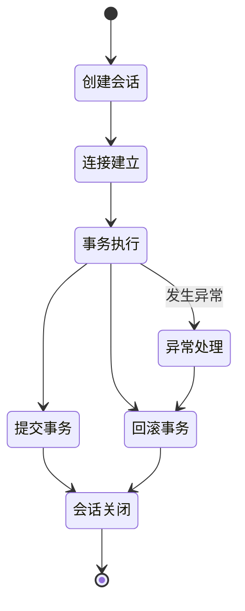

**图表来源**
- [database.py:22-32](file://emo_outlet_api/app/database.py#L22-L32)

#### 资源清理机制

- **自动关闭**：会话在finally块中自动关闭
- **异常处理**：异常情况下自动回滚并清理资源
- **连接回收**：引擎负责连接池的连接回收

**章节来源**
- [database.py:22-32](file://emo_outlet_api/app/database.py#L22-L32)

### 数据库关闭和资源清理

#### 应用关闭流程

应用关闭时的资源清理过程：

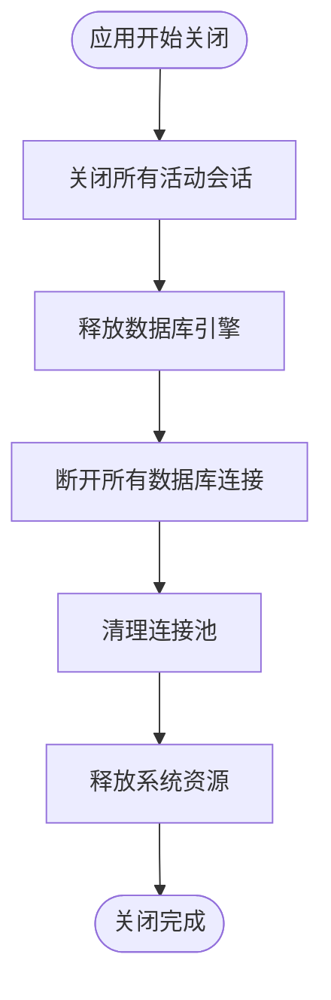

**图表来源**
- [database.py:41-43](file://emo_outlet_api/app/database.py#L41-L43)
- [main.py:19](file://emo_outlet_api/app/main.py#L19)

#### 最佳实践

- **及时清理**：确保所有资源在应用退出时正确释放
- **优雅关闭**：给正在进行的操作足够的时间完成
- **错误处理**：关闭过程中的异常应该被妥善处理

**章节来源**
- [database.py:41-43](file://emo_outlet_api/app/database.py#L41-L43)
- [main.py:19](file://emo_outlet_api/app/main.py#L19)

## 依赖关系分析

### 外部依赖关系

项目数据库相关的外部依赖：

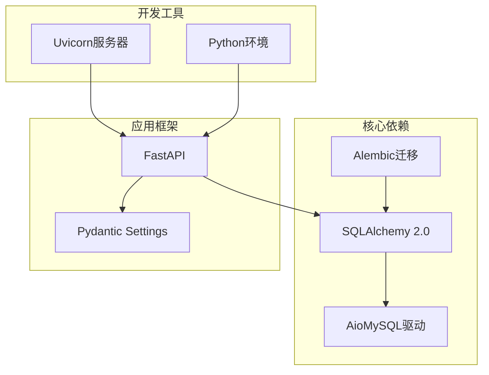

**图表来源**
- [requirements.txt:7-11](file://emo_outlet_api/requirements.txt#L7-L11)
- [requirements.txt:4](file://emo_outlet_api/requirements.txt#L4)
- [requirements.txt:22-24](file://emo_outlet_api/requirements.txt#L22-L24)

### 内部模块依赖

内部模块间的依赖关系：

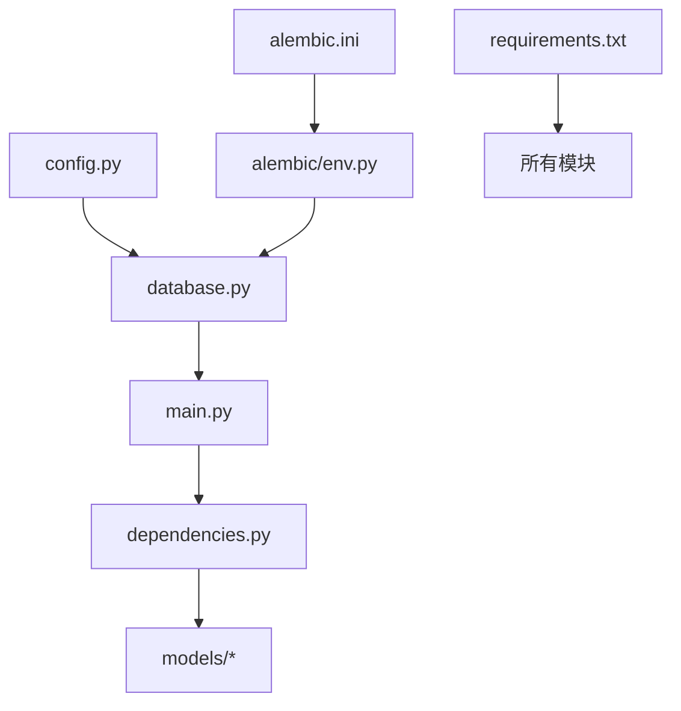

**图表来源**
- [config.py:6](file://emo_outlet_api/app/config.py#L6)
- [database.py:6](file://emo_outlet_api/app/database.py#L6)
- [main.py:9](file://emo_outlet_api/app/main.py#L9)

**章节来源**
- [requirements.txt:1-29](file://emo_outlet_api/requirements.txt#L1-L29)
- [config.py:6](file://emo_outlet_api/app/config.py#L6)
- [database.py:6](file://emo_outlet_api/app/database.py#L6)

## 性能考虑

### 连接池优化

- **连接复用**：异步连接池支持连接复用减少连接开销
- **并发控制**：合理的连接池大小平衡并发需求和资源消耗
- **超时设置**：适当的超时配置避免资源泄露

### 查询优化

- **批量操作**：支持批量插入和更新提高效率
- **索引设计**：为常用查询字段建立合适的索引
- **查询缓存**：对于静态数据考虑使用缓存机制

### 内存管理

- **会话生命周期**：短生命周期的会话减少内存占用
- **对象清理**：及时清理不再使用的对象引用
- **垃圾回收**：合理利用Python的垃圾回收机制

## 故障排除指南

### 常见连接问题

#### 连接失败排查

1. **检查数据库服务状态**
   - 确认MySQL服务正在运行
   - 验证网络连接可用性
   - 检查防火墙设置

2. **验证连接参数**
   - 确认主机地址和端口正确
   - 验证用户名和密码
   - 检查数据库名称是否存在

3. **环境变量配置**
   - 确认.env文件存在且格式正确
   - 验证DATABASE_URL配置
   - 检查字符集设置

#### 连接池问题

- **连接泄漏**：确保所有会话都在finally块中正确关闭
- **连接超时**：调整超时参数适应实际需求
- **连接池耗尽**：增加连接池大小或优化查询性能

### 迁移问题

#### Alembic迁移故障

1. **迁移脚本问题**
   - 检查迁移脚本语法
   - 验证模型定义与数据库结构
   - 确认迁移依赖关系

2. **数据库权限**
   - 确认用户具有足够的权限
   - 检查数据库锁定状态
   - 验证表空间和存储权限

**章节来源**
- [alembic/env.py:26-30](file://emo_outlet_api/alembic/env.py#L26-L30)
- [alembic.ini:1-38](file://emo_outlet_api/alembic.ini#L1-L38)

## 结论

Emo Outlet项目的数据库系统采用了现代化的异步架构设计，具备以下特点：

- **类型安全**：基于Pydantic Settings的强类型配置系统
- **异步支持**：完整的SQLAlchemy 2.0异步功能支持
- **灵活配置**：支持MySQL和SQLite双后端切换
- **依赖注入**：与FastAPI深度集成的依赖管理系统
- **生命周期管理**：完善的连接和会话生命周期控制

该系统为情绪出口应用提供了稳定可靠的数据存储基础，支持高并发场景下的数据访问需求。通过合理的配置和最佳实践，可以确保系统的高性能和高可用性。