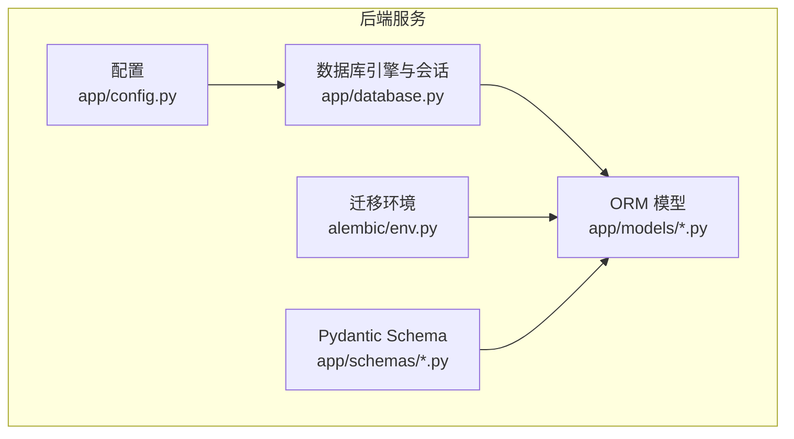
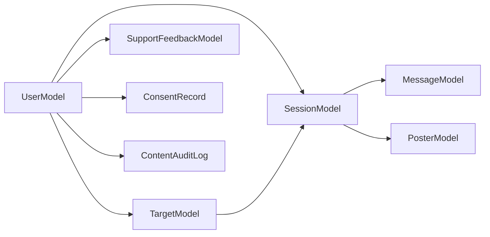

# 数据库设计

<cite>
**本文引用的文件**
- [emo_outlet_api/app/models/user.py](file://emo_outlet_api/app/models/user.py)
- [emo_outlet_api/app/models/session.py](file://emo_outlet_api/app/models/session.py)
- [emo_outlet_api/app/models/target.py](file://emo_outlet_api/app/models/target.py)
- [emo_outlet_api/app/models/message.py](file://emo_outlet_api/app/models/message.py)
- [emo_outlet_api/app/models/poster.py](file://emo_outlet_api/app/models/poster.py)
- [emo_outlet_api/app/models/support.py](file://emo_outlet_api/app/models/support.py)
- [emo_outlet_api/app/models/compliance.py](file://emo_outlet_api/app/models/compliance.py)
- [emo_outlet_api/app/database.py](file://emo_outlet_api/app/database.py)
- [emo_outlet_api/app/config.py](file://emo_outlet_api/app/config.py)
- [emo_outlet_api/alembic/env.py](file://emo_outlet_api/alembic/env.py)
- [emo_outlet_api/app/schemas/user.py](file://emo_outlet_api/app/schemas/user.py)
- [emo_outlet_api/app/schemas/session.py](file://emo_outlet_api/app/schemas/session.py)
- [emo_outlet_api/app/schemas/message.py](file://emo_outlet_api/app/schemas/message.py)
- [emo_outlet_api/app/schemas/target.py](file://emo_outlet_api/app/schemas/target.py)
</cite>

## 目录
1. [简介](#简介)
2. [项目结构](#项目结构)
3. [核心组件](#核心组件)
4. [架构总览](#架构总览)
5. [详细组件分析](#详细组件分析)
6. [依赖分析](#依赖分析)
7. [性能考虑](#性能考虑)
8. [故障排查指南](#故障排查指南)
9. [结论](#结论)
10. [附录](#附录)

## 简介
本文件为 Emo Outlet 项目的数据库设计与建模文档，覆盖数据表结构、字段定义、主键/外键关系、索引设计、业务含义与约束、数据访问模式、缓存策略、性能考量、数据生命周期与合规策略、迁移与版本管理、数据安全与隐私、初始化与种子数据、备份与灾难恢复等内容。文档以 SQLAlchemy ORM 模型为基础，结合 Alembic 迁移框架与 Pydantic Schema 的输入输出约束，形成从模型到部署的完整数据库设计闭环。

## 项目结构
后端采用异步 SQLAlchemy（MySQL/SQLite）与 Alembic 迁移，模型集中于 app/models，数据库连接与初始化在 app/database 中完成；配置位于 app/config；迁移入口在 alembic/env.py；Pydantic Schema 定义了输入输出约束。



图表来源
- [emo_outlet_api/app/config.py:1-125](file://emo_outlet_api/app/config.py#L1-L125)
- [emo_outlet_api/app/database.py:1-43](file://emo_outlet_api/app/database.py#L1-L43)
- [emo_outlet_api/alembic/env.py:1-71](file://emo_outlet_api/alembic/env.py#L1-L71)

章节来源
- [emo_outlet_api/app/config.py:1-125](file://emo_outlet_api/app/config.py#L1-L125)
- [emo_outlet_api/app/database.py:1-43](file://emo_outlet_api/app/database.py#L1-L43)
- [emo_outlet_api/alembic/env.py:1-71](file://emo_outlet_api/alembic/env.py#L1-L71)

## 核心组件
- 用户(User)：存储用户基本信息、设备标识、活跃度统计、合规标记与时间戳。
- 泄愤对象(Target)：用户自定义或由 AI 补全的对象画像，支持隐藏与删除。
- 会话(Session)：一次情绪疏导过程，包含模式、风格、方言、时长、状态与情绪总结。
- 消息(Message)：会话中的消息条目，支持情绪标注、敏感词标记与序列号。
- 海报(Poster)：会话产物，包含标题、主导情绪、关键词、建议与生成资源链接。
- 支持反馈(SupportFeedback)：用户反馈与帮助类工单，带来源与状态。
- 合规审计(ConsentRecord、ContentAuditLog)：用户授权记录与内容审计日志。

章节来源
- [emo_outlet_api/app/models/user.py:14-56](file://emo_outlet_api/app/models/user.py#L14-L56)
- [emo_outlet_api/app/models/target.py:13-56](file://emo_outlet_api/app/models/target.py#L13-L56)
- [emo_outlet_api/app/models/session.py:13-79](file://emo_outlet_api/app/models/session.py#L13-L79)
- [emo_outlet_api/app/models/message.py:13-46](file://emo_outlet_api/app/models/message.py#L13-L46)
- [emo_outlet_api/app/models/poster.py:13-61](file://emo_outlet_api/app/models/poster.py#L13-L61)
- [emo_outlet_api/app/models/support.py:12-44](file://emo_outlet_api/app/models/support.py#L12-L44)
- [emo_outlet_api/app/models/compliance.py:12-50](file://emo_outlet_api/app/models/compliance.py#L12-L50)

## 架构总览
数据库层通过异步引擎连接 MySQL 或 SQLite，使用 Declarative Base 声明式映射各模型；Alembic 读取 Base.metadata 执行迁移；Schema 层负责输入校验与输出序列化。

```mermaid
erDiagram
USER {
string id PK
string nickname
string phone
string email
string password_hash
string avatar_url
boolean is_visitor
string device_uuid
int daily_session_count
string last_active_date
boolean is_active
boolean is_deleted
string age_range
boolean is_banned
string ban_reason
boolean is_admin
string consent_version
timestamp created_at
timestamp updated_at
}
TARGET {
string id PK
string user_id FK
string name
string type
text appearance
text personality
string relation
string style
string avatar_url
boolean is_hidden
boolean is_deleted
timestamp created_at
timestamp updated_at
}
SESSION {
string id PK
string user_id FK
string target_id FK
string mode
string chat_style
string dialect
int duration_minutes
timestamp start_time
timestamp end_time
string status
boolean is_completed
text emotion_summary
text summary_text
timestamp created_at
timestamp updated_at
}
MESSAGE {
string id PK
string session_id FK
text content
string sender
string dialect
string emotion_type
int emotion_intensity
boolean is_sensitive
int sequence
timestamp created_at
}
POSTER {
string id PK
string session_id FK UK
string user_id FK
string title
string emotion_type
int emotion_intensity
text keywords
text suggestion
string poster_url
text poster_data
timestamp created_at
}
SUPPORT_FEEDBACK {
string id PK
string user_id FK
text content
text image_urls
string source
string status
timestamp created_at
}
CONSENT_RECORD {
string id PK
string user_id FK
string consent_type
string consent_version
string ip_address
string user_agent
timestamp created_at
}
CONTENT_AUDIT_LOG {
string id PK
string user_id FK
string session_id
string audit_type
string risk_level
string matched_keywords
text original_content
string action_taken
timestamp created_at
}
USER ||--o{ TARGET : "拥有"
USER ||--o{ SESSION : "参与"
TARGET ||--o{ SESSION : "被选择"
SESSION ||--o{ MESSAGE : "包含"
SESSION ||--|{ POSTER : "生成"
USER ||--o{ SUPPORT_FEEDBACK : "提交"
USER ||--o{ CONSENT_RECORD : "签署"
USER ||--o{ CONTENT_AUDIT_LOG : "产生"
```

图表来源
- [emo_outlet_api/app/models/user.py:14-56](file://emo_outlet_api/app/models/user.py#L14-L56)
- [emo_outlet_api/app/models/target.py:13-56](file://emo_outlet_api/app/models/target.py#L13-L56)
- [emo_outlet_api/app/models/session.py:13-79](file://emo_outlet_api/app/models/session.py#L13-L79)
- [emo_outlet_api/app/models/message.py:13-46](file://emo_outlet_api/app/models/message.py#L13-L46)
- [emo_outlet_api/app/models/poster.py:13-61](file://emo_outlet_api/app/models/poster.py#L13-L61)
- [emo_outlet_api/app/models/support.py:12-44](file://emo_outlet_api/app/models/support.py#L12-L44)
- [emo_outlet_api/app/models/compliance.py:12-50](file://emo_outlet_api/app/models/compliance.py#L12-L50)

## 详细组件分析

### 用户(User)
- 主键：id（UUID 字符串）
- 关键字段与约束
  - 昵称、头像、访客标记、设备 UUID
  - 手机号/邮箱唯一性（可空），密码哈希（可空）
  - 活跃度统计与最后活跃日期
  - 合规字段：年龄段、封禁标记、封禁原因、管理员标记、同意版本
  - 软删除标记
- 关系
  - 一对多：targets、sessions
- 索引
  - phone、email 唯一性（由数据库约束保证）
- 业务含义
  - 标识系统用户身份，区分注册用户与访客；承载合规与风控信息；记录每日会话次数用于防沉迷。

章节来源
- [emo_outlet_api/app/models/user.py:14-56](file://emo_outlet_api/app/models/user.py#L14-L56)

### 泄愤对象(Target)
- 主键：id（UUID 字符串）
- 关键字段与约束
  - 名称、类型、外貌/性格描述、关系、风格
  - 头像 URL、隐藏/删除标记
- 外键：user_id → USER(id)
- 关系
  - 多对一：user
  - 一对多：sessions
- 业务含义
  - 用户自定义或由 AI 补全的“泄愤对象”画像，支持多种风格与关系维度。

章节来源
- [emo_outlet_api/app/models/target.py:13-56](file://emo_outlet_api/app/models/target.py#L13-L56)

### 会话(Session)
- 主键：id（UUID 字符串）
- 关键字段与约束
  - 模式：single/dual
  - 对话风格：stubborn/apologetic/cold/sarcastic/rational
  - 方言：mandarin/cantonese/sichuan/northeastern/shanghainese
  - 时长（分钟）、起止时间、状态、完成标记
  - 情绪总结与文案
- 外键：user_id → USER(id)，target_id → TARGET(id)
- 关系
  - 多对一：user、target
  - 一对多：messages
- 业务含义
  - 一次完整的“情绪疏导”过程，承载对话风格、方言与时间控制，以及最终的情绪总结。

章节来源
- [emo_outlet_api/app/models/session.py:13-79](file://emo_outlet_api/app/models/session.py#L13-L79)

### 消息(Message)
- 主键：id（UUID 字符串）
- 关键字段与约束
  - 内容（文本）、发送方（user/ai/system）、方言、情绪类型与强度、敏感词标记、消息序号
- 外键：session_id → SESSION(id)
- 关系
  - 多对一：session
- 业务含义
  - 会话内逐条消息的载体，支持情绪标注与敏感词识别。

章节来源
- [emo_outlet_api/app/models/message.py:13-46](file://emo_outlet_api/app/models/message.py#L13-L46)

### 海报(Poster)
- 主键：id（UUID 字符串）
- 关键字段与约束
  - 标题、主导情绪、强度、关键词、建议
  - 海报 URL 与 Base64 数据（开发用途）
- 外键：session_id → SESSION(id)（唯一），user_id → USER(id)
- 关系
  - 多对一：session、user
- 业务含义
  - 会话产物的可视化呈现，包含情绪分析摘要与建议。

章节来源
- [emo_outlet_api/app/models/poster.py:13-61](file://emo_outlet_api/app/models/poster.py#L13-L61)

### 支持反馈(SupportFeedback)
- 主键：id（UUID 字符串）
- 关键字段与约束
  - user_id（索引）、内容、图片 URL、来源、状态
- 业务含义
  - 用户反馈与帮助工单，便于运营与客服处理。

章节来源
- [emo_outlet_api/app/models/support.py:12-44](file://emo_outlet_api/app/models/support.py#L12-L44)

### 合规审计(ConsentRecord、ContentAuditLog)
- ConsentRecord
  - 主键：id；外键：user_id；字段：同意类型、版本、IP、UA；时间戳
- ContentAuditLog
  - 主键：id；外键：user_id；可选：session_id；字段：审计类型、风险等级、匹配关键词、原始内容、已采取动作；时间戳
- 业务含义
  - 记录用户授权行为与内容审核轨迹，满足合规与审计要求。

章节来源
- [emo_outlet_api/app/models/compliance.py:12-50](file://emo_outlet_api/app/models/compliance.py#L12-L50)

### 数据访问模式与缓存策略
- 访问模式
  - 异步会话工厂：通过 app/database.py 提供的 async_session_factory 获取 AsyncSession，自动提交/回滚/关闭。
  - 初始化：init_db 在连接建立后调用 metadata.create_all 创建所有表。
- 缓存策略
  - 配置中包含 Redis 地址与端口，可用于会话状态、限流、热点数据缓存等，但当前模型未直接声明缓存字段。
- 性能考量
  - 支持索引：SupportFeedback.user_id、ConsentRecord.user_id、ContentAuditLog.user_id 已建立索引以加速查询。
  - 建议：对高频查询字段（如 Session.user_id、Message.session_id）可考虑复合索引或分区策略（视业务量而定）。

章节来源
- [emo_outlet_api/app/database.py:22-43](file://emo_outlet_api/app/database.py#L22-L43)
- [emo_outlet_api/app/models/support.py:35](file://emo_outlet_api/app/models/support.py#L35)
- [emo_outlet_api/app/models/compliance.py:20](file://emo_outlet_api/app/models/compliance.py#L20)

### 数据生命周期管理、保留策略与归档规则
- 软删除
  - 用户与目标提供 is_deleted 标记，便于逻辑删除与后续归档。
- 时间戳
  - 所有模型均包含 created_at 与 updated_at，便于按时间维度进行清理与归档。
- 建议策略
  - 会话与消息：按用户维度保留 N 年，超期归档至冷存储。
  - 用户资料：保留永久，软删除后脱敏导出。
  - 审计日志：按法规要求保留 6-24 个月，到期销毁。
- 归档实现
  - 使用分区表或独立归档库，配合定时任务执行数据迁移与清理。

章节来源
- [emo_outlet_api/app/models/user.py:30](file://emo_outlet_api/app/models/user.py#L30)
- [emo_outlet_api/app/models/target.py:42](file://emo_outlet_api/app/models/target.py#L42)
- [emo_outlet_api/app/models/session.py:65-79](file://emo_outlet_api/app/models/session.py#L65-L79)
- [emo_outlet_api/app/models/message.py:37-46](file://emo_outlet_api/app/models/message.py#L37-L46)
- [emo_outlet_api/app/models/compliance.py:25-50](file://emo_outlet_api/app/models/compliance.py#L25-L50)

### 数据迁移路径与版本管理
- 迁移框架
  - Alembic 读取 app/database 的 Base.metadata，扫描 app/models 下的模型以生成迁移。
- 迁移入口
  - alembic/env.py 中根据配置动态决定数据库 URL（MySQL 或 SQLite），并分别支持离线与在线迁移。
- 版本管理
  - 建议每次模型变更提交新版本文件，并在 PR 中同步迁移脚本与注释。
- 最佳实践
  - 避免删除列；使用 alter 添加列并设置默认值；对大表变更使用在线 DDL 或分批执行。

章节来源
- [emo_outlet_api/alembic/env.py:1-71](file://emo_outlet_api/alembic/env.py#L1-L71)
- [emo_outlet_api/app/database.py:34-43](file://emo_outlet_api/app/database.py#L34-L43)

### 数据安全、隐私与访问控制
- 敏感字段
  - 用户：phone、email、password_hash、device_uuid；消息：content；审计：ip_address、user_agent。
- 存储与传输
  - 生产环境使用 DATABASE_URL 连接 MySQL；Redis 用于会话与缓存，需启用 TLS 与最小权限。
- 访问控制
  - 用户仅可访问自身数据；管理员具备审计与封禁能力；审计日志记录操作轨迹。
- 合规
  - ConsentRecord 记录用户授权版本与来源；ContentAuditLog 记录敏感内容处理动作。

章节来源
- [emo_outlet_api/app/config.py:22-53](file://emo_outlet_api/app/config.py#L22-L53)
- [emo_outlet_api/app/models/user.py:21-29](file://emo_outlet_api/app/models/user.py#L21-L29)
- [emo_outlet_api/app/models/message.py:22-36](file://emo_outlet_api/app/models/message.py#L22-L36)
- [emo_outlet_api/app/models/compliance.py:23-28](file://emo_outlet_api/app/models/compliance.py#L23-L28)

### 数据库初始化脚本与种子数据
- 初始化
  - init_db 在连接建立后调用 metadata.create_all 创建所有表。
- 种子数据
  - 当前仓库未包含种子数据脚本；可在迁移版本中添加 insert 语句或通过 Alembic post_write_hook 注入。
- 开发环境
  - 默认 SQLite（emo_outlet.db），便于本地开发与测试。

章节来源
- [emo_outlet_api/app/database.py:34-43](file://emo_outlet_api/app/database.py#L34-L43)
- [emo_outlet_api/app/config.py:39-41](file://emo_outlet_api/app/config.py#L39-L41)

### 备份与灾难恢复
- 备份策略
  - MySQL：使用逻辑备份（mysqldump/xtrabackup）与增量备份；定期快照；跨机房异地复制。
  - SQLite：文件级备份与 WAL 模式下的连续归档。
- 恢复流程
  - RTO/RPO 目标明确；自动化演练；监控失败与延迟。
- 审计与合规
  - 审计日志与备份链路均需加密与权限控制。

章节来源
- [emo_outlet_api/app/config.py:22-41](file://emo_outlet_api/app/config.py#L22-L41)
- [emo_outlet_api/app/models/compliance.py:31-50](file://emo_outlet_api/app/models/compliance.py#L31-L50)

## 依赖分析
- 组件耦合
  - Session 依赖 User 与 Target；Message 依赖 Session；Poster 依赖 Session 与 User；SupportFeedback 依赖 User；ConsentRecord 与 ContentAuditLog 依赖 User。
- 外部依赖
  - MySQL/SQLite 引擎、Redis（可选）、AI 服务（OpenAI/DeepSeek/Qwen）。
- 潜在环依赖
  - 当前模型无循环导入；若扩展更多模型，应避免相互 import。



图表来源
- [emo_outlet_api/app/models/user.py:51-56](file://emo_outlet_api/app/models/user.py#L51-L56)
- [emo_outlet_api/app/models/target.py:50-56](file://emo_outlet_api/app/models/target.py#L50-L56)
- [emo_outlet_api/app/models/session.py:73-79](file://emo_outlet_api/app/models/session.py#L73-L79)
- [emo_outlet_api/app/models/message.py:42-46](file://emo_outlet_api/app/models/message.py#L42-L46)
- [emo_outlet_api/app/models/poster.py:55-61](file://emo_outlet_api/app/models/poster.py#L55-L61)
- [emo_outlet_api/app/models/support.py:12-44](file://emo_outlet_api/app/models/support.py#L12-L44)
- [emo_outlet_api/app/models/compliance.py:12-50](file://emo_outlet_api/app/models/compliance.py#L12-L50)

## 性能考虑
- 索引与查询
  - 已在 user_id 上建立索引；建议对 session.user_id、message.session_id 增加复合索引以优化联表查询。
- 分区与归档
  - 按时间分区（如按月）可提升大数据量场景下的查询与维护效率。
- 缓存
  - 利用 Redis 缓存热点用户画像、会话状态与限流阈值，降低数据库压力。
- 异步 I/O
  - 使用异步引擎与会话，提高并发吞吐。

章节来源
- [emo_outlet_api/app/models/support.py:35](file://emo_outlet_api/app/models/support.py#L35)
- [emo_outlet_api/app/models/compliance.py:20](file://emo_outlet_api/app/models/compliance.py#L20)

## 故障排查指南
- 连接问题
  - 检查 DATABASE_URL 或 SQLITE_URL 是否正确；确认数据库服务可达。
- 迁移失败
  - 使用 alembic/env.py 的离线模式生成 SQL 脚本核对；在线模式检查连接参数。
- 事务异常
  - app/database.py 的 get_db 已封装 commit/rollback，定位异常点后重试。
- 数据不一致
  - 核对 created_at/updated_at 时间戳；检查软删除标记与逻辑删除策略。

章节来源
- [emo_outlet_api/app/config.py:30-41](file://emo_outlet_api/app/config.py#L30-L41)
- [emo_outlet_api/alembic/env.py:26-71](file://emo_outlet_api/alembic/env.py#L26-L71)
- [emo_outlet_api/app/database.py:22-43](file://emo_outlet_api/app/database.py#L22-L43)

## 结论
本数据库设计围绕用户、对象、会话、消息、海报与合规审计六大核心域展开，采用异步 SQLAlchemy 与 Alembic 迁移，兼顾性能、可维护性与合规要求。建议在生产环境中完善索引、分区与缓存策略，制定清晰的数据生命周期与备份恢复方案，并持续演进 Schema 与迁移脚本以支撑业务增长。

## 附录

### 字段与约束对照（模型→Schema）
- 用户
  - 模型字段：nickname、phone、email、avatar_url、is_visitor、device_uuid、daily_session_count、age_range、is_banned、is_admin、consent_version、created_at、updated_at
  - Schema 输入：UserRegisterRequest、VisitorLoginRequest、UserUpdateRequest
  - Schema 输出：UserResponse、UserProfileDetailResponse
- 会话
  - 模型字段：mode、chat_style、dialect、duration_minutes、status、emotion_summary、summary_text、created_at、updated_at
  - Schema 输入：SessionCreateRequest、SessionEndRequest
  - Schema 输出：SessionResponse、SessionSummaryResponse
- 消息
  - 模型字段：content、sender、dialect、emotion_type、emotion_intensity、is_sensitive、sequence、created_at
  - Schema 输入：MessageSendRequest
  - Schema 输出：MessageResponse、MessageListResponse
- 对象
  - 模型字段：name、type、appearance、personality、relation、style、avatar_url、is_hidden、is_deleted、created_at、updated_at
  - Schema 输入：TargetCreateRequest、TargetUpdateRequest、TargetAiCompleteRequest
  - Schema 输出：TargetResponse、TargetAiCompleteResponse

章节来源
- [emo_outlet_api/app/models/user.py:14-56](file://emo_outlet_api/app/models/user.py#L14-L56)
- [emo_outlet_api/app/schemas/user.py:8-74](file://emo_outlet_api/app/schemas/user.py#L8-L74)
- [emo_outlet_api/app/models/session.py:13-79](file://emo_outlet_api/app/models/session.py#L13-L79)
- [emo_outlet_api/app/schemas/session.py:9-62](file://emo_outlet_api/app/schemas/session.py#L9-L62)
- [emo_outlet_api/app/models/message.py:13-46](file://emo_outlet_api/app/models/message.py#L13-L46)
- [emo_outlet_api/app/schemas/message.py:9-39](file://emo_outlet_api/app/schemas/message.py#L9-L39)
- [emo_outlet_api/app/models/target.py:13-56](file://emo_outlet_api/app/models/target.py#L13-L56)
- [emo_outlet_api/app/schemas/target.py:9-63](file://emo_outlet_api/app/schemas/target.py#L9-L63)