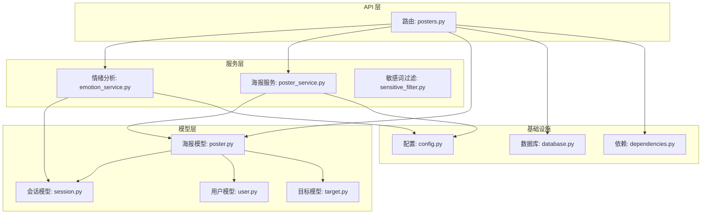
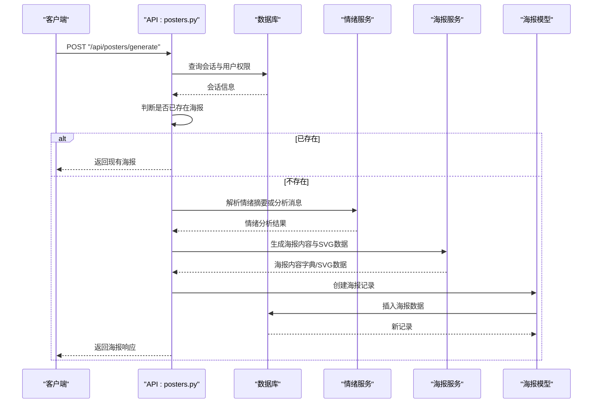
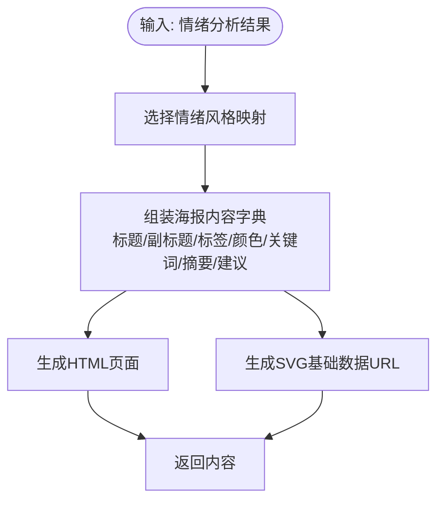
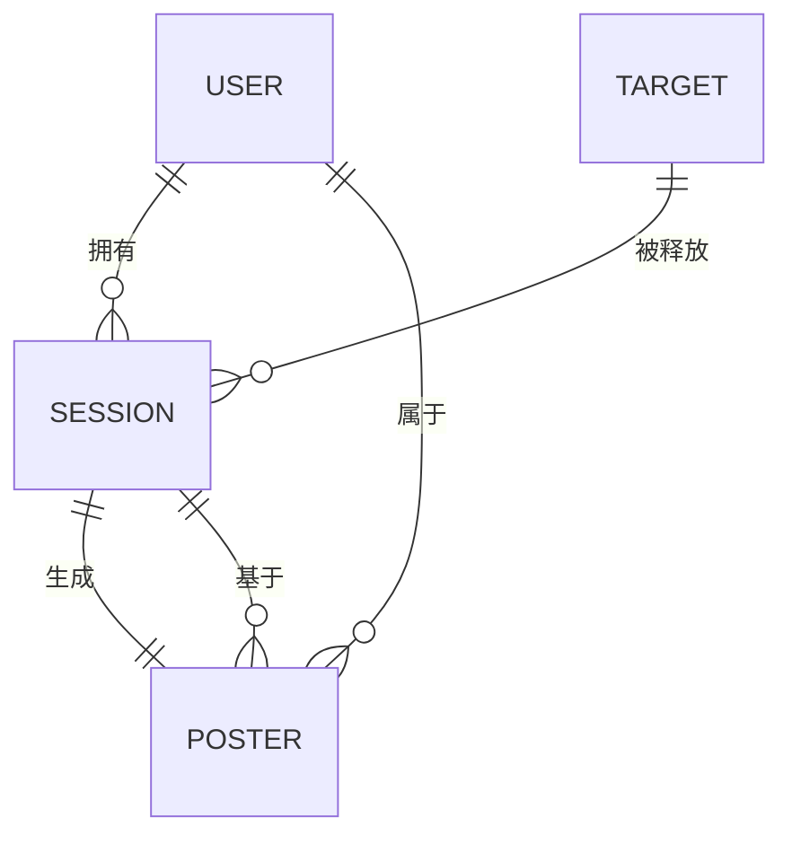
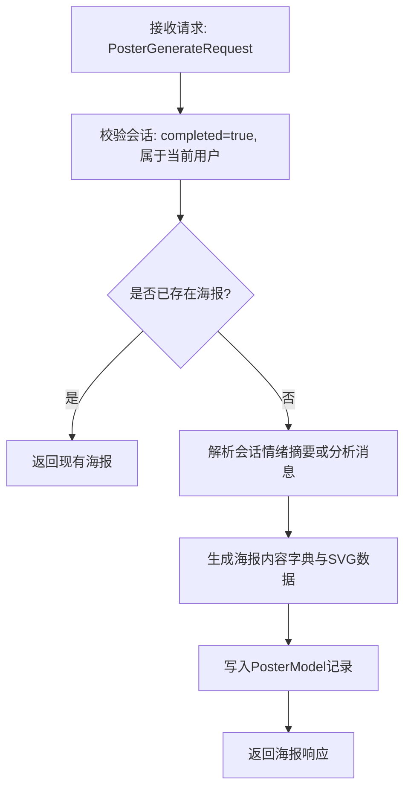
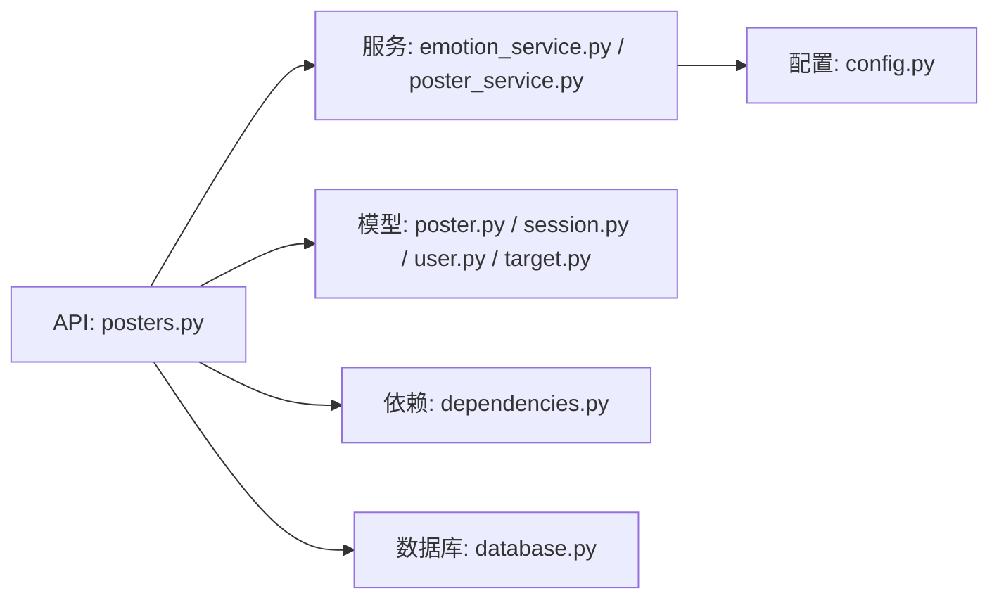

# 海报模型

<cite>
**本文引用的文件**
- [emo_outlet_api/app/models/poster.py](file://emo_outlet_api/app/models/poster.py)
- [emo_outlet_api/app/schemas/poster.py](file://emo_outlet_api/app/schemas/poster.py)
- [emo_outlet_api/app/services/poster_service.py](file://emo_outlet_api/app/services/poster_service.py)
- [emo_outlet_api/app/api/posters.py](file://emo_outlet_api/app/api/posters.py)
- [emo_outlet_api/app/models/session.py](file://emo_outlet_api/app/models/session.py)
- [emo_outlet_api/app/models/user.py](file://emo_outlet_api/app/models/user.py)
- [emo_outlet_api/app/models/target.py](file://emo_outlet_api/app/models/target.py)
- [emo_outlet_api/app/utils/sensitive_filter.py](file://emo_outlet_api/app/utils/sensitive_filter.py)
- [emo_outlet_api/app/services/emotion_service.py](file://emo_outlet_api/app/services/emotion_service.py)
- [emo_outlet_api/app/database.py](file://emo_outlet_api/app/database.py)
- [emo_outlet_api/app/core/dependencies.py](file://emo_outlet_api/app/core/dependencies.py)
- [emo_outlet_api/app/config.py](file://emo_outlet_api/app/config.py)
</cite>

## 目录
1. [简介](#简介)
2. [项目结构](#项目结构)
3. [核心组件](#核心组件)
4. [架构总览](#架构总览)
5. [详细组件分析](#详细组件分析)
6. [依赖关系分析](#依赖关系分析)
7. [性能考量](#性能考量)
8. [故障排查指南](#故障排查指南)
9. [结论](#结论)
10. [附录](#附录)

## 简介
本文件围绕 Emo Outlet 的海报模型（PosterModel）进行系统化技术文档梳理，覆盖海报内容与样式、生成时间与状态、海报与用户/会话的关系、模板与自定义样式支持、数据校验与生成流程、存储策略、导出与分享机制、版本管理、版权与内容安全措施，并提供可直接定位到源码的路径指引与可视化图示，帮助开发者快速理解与扩展海报能力。

## 项目结构
Emo Outlet 的海报功能位于后端 API 子项目中，采用 FastAPI + SQLAlchemy 异步 ORM 的分层设计：
- API 层：负责请求路由、鉴权与业务编排
- 服务层：封装海报生成、情绪分析、敏感词过滤等业务逻辑
- 模型层：定义数据库表结构及关系
- 配置与依赖：统一管理数据库连接、安全认证与环境参数



图表来源
- [emo_outlet_api/app/api/posters.py:1-408](file://emo_outlet_api/app/api/posters.py#L1-L408)
- [emo_outlet_api/app/services/emotion_service.py:1-181](file://emo_outlet_api/app/services/emotion_service.py#L1-L181)
- [emo_outlet_api/app/services/poster_service.py:1-221](file://emo_outlet_api/app/services/poster_service.py#L1-L221)
- [emo_outlet_api/app/utils/sensitive_filter.py:1-142](file://emo_outlet_api/app/utils/sensitive_filter.py#L1-L142)
- [emo_outlet_api/app/models/poster.py:1-41](file://emo_outlet_api/app/models/poster.py#L1-L41)
- [emo_outlet_api/app/models/session.py:1-79](file://emo_outlet_api/app/models/session.py#L1-L79)
- [emo_outlet_api/app/models/user.py:1-52](file://emo_outlet_api/app/models/user.py#L1-L52)
- [emo_outlet_api/app/models/target.py:1-56](file://emo_outlet_api/app/models/target.py#L1-L56)
- [emo_outlet_api/app/database.py:1-43](file://emo_outlet_api/app/database.py#L1-L43)
- [emo_outlet_api/app/core/dependencies.py:1-67](file://emo_outlet_api/app/core/dependencies.py#L1-L67)
- [emo_outlet_api/app/config.py:1-125](file://emo_outlet_api/app/config.py#L1-L125)

章节来源
- [emo_outlet_api/app/api/posters.py:1-408](file://emo_outlet_api/app/api/posters.py#L1-L408)
- [emo_outlet_api/app/models/poster.py:1-41](file://emo_outlet_api/app/models/poster.py#L1-L41)
- [emo_outlet_api/app/database.py:1-43](file://emo_outlet_api/app/database.py#L1-L43)

## 核心组件
- 海报模型 PosterModel：持久化海报元数据与二进制数据，维护与用户、会话的关联关系
- 海报服务 PosterService：负责根据情绪分析结果生成海报内容、HTML 与 SVG 基础数据
- 情绪服务 EmotionService：从会话消息中提取情绪、关键词与强度，输出标准化分析结果
- API 路由 posters.py：对外暴露海报生成、查询、收藏、删除与情绪报告接口
- 数据模型：SessionModel、UserModel、TargetModel 提供海报生成所需的上下文数据

章节来源
- [emo_outlet_api/app/models/poster.py:12-41](file://emo_outlet_api/app/models/poster.py#L12-L41)
- [emo_outlet_api/app/services/poster_service.py:66-221](file://emo_outlet_api/app/services/poster_service.py#L66-L221)
- [emo_outlet_api/app/services/emotion_service.py:44-181](file://emo_outlet_api/app/services/emotion_service.py#L44-L181)
- [emo_outlet_api/app/api/posters.py:73-248](file://emo_outlet_api/app/api/posters.py#L73-L248)

## 架构总览
海报生成的端到端流程如下：
- 用户提交会话 ID 请求生成海报
- API 校验当前用户与会话状态（必须已完成）
- 若会话已有海报则直接返回；否则解析会话情绪摘要或调用情绪服务分析消息
- 使用海报服务生成海报内容字典与 SVG 基础数据
- 写入数据库并返回响应



图表来源
- [emo_outlet_api/app/api/posters.py:73-138](file://emo_outlet_api/app/api/posters.py#L73-L138)
- [emo_outlet_api/app/services/emotion_service.py:44-71](file://emo_outlet_api/app/services/emotion_service.py#L44-L71)
- [emo_outlet_api/app/services/poster_service.py:66-90](file://emo_outlet_api/app/services/poster_service.py#L66-L90)

## 详细组件分析

### 海报模型 PosterModel
- 设计理念
  - 以会话为中心：每个海报绑定唯一会话，确保海报与具体释放过程一一对应
  - 以用户为中心：海报归属用户，便于个人资产与隐私控制
  - 结构化存储：除二进制数据外，其余字段均结构化存储，便于检索与报告
- 字段与约束
  - 主键 id：UUID 字符串
  - session_id：外键，唯一约束，保证会话仅生成一张海报
  - user_id：外键，非空
  - 标题、情绪类型、强度、关键词、建议、海报 URL、海报数据、收藏标记、创建时间
- 关系
  - 与 SessionModel 的一对一关系（会话唯一）
  - 与 UserModel 的多对一关系（用户）

```mermaid
classDiagram
class PosterModel {
+id : str
+session_id : str
+user_id : str
+title : str?
+emotion_type : str?
+emotion_intensity : int?
+keywords : str?
+suggestion : str?
+poster_url : str?
+poster_data : str?
+is_favorite : bool
+created_at : datetime
}
class SessionModel {
+id : str
+user_id : str
+target_id : str
+mode : str
+duration_minutes : int
+status : str
+is_completed : bool
+emotion_summary : str?
+summary_text : str?
}
class UserModel {
+id : str
+nickname : str
+email : str?
+is_visitor : bool
+is_banned : bool
}
PosterModel --> SessionModel : "外键 : session_id"
PosterModel --> UserModel : "外键 : user_id"
```

图表来源
- [emo_outlet_api/app/models/poster.py:12-41](file://emo_outlet_api/app/models/poster.py#L12-L41)
- [emo_outlet_api/app/models/session.py:13-79](file://emo_outlet_api/app/models/session.py#L13-L79)
- [emo_outlet_api/app/models/user.py:12-52](file://emo_outlet_api/app/models/user.py#L12-L52)

章节来源
- [emo_outlet_api/app/models/poster.py:12-41](file://emo_outlet_api/app/models/poster.py#L12-L41)

### 海报内容与样式配置
- 情绪风格映射
  - 不同情绪类型映射到标题、副标题、徽标、强调色、辅助色与总结语
  - 默认回退到“平静”
- 海报内容生成
  - 从情绪分析结果抽取主情绪、强度、关键词、摘要与建议
  - 可选目标名参与标题渲染
- HTML 与 SVG 渲染
  - 生成完整 HTML 页面，内嵌样式与动态内容
  - 生成 SVG 基础数据 URL，便于前端展示或导出



图表来源
- [emo_outlet_api/app/services/poster_service.py:10-59](file://emo_outlet_api/app/services/poster_service.py#L10-L59)
- [emo_outlet_api/app/services/poster_service.py:66-90](file://emo_outlet_api/app/services/poster_service.py#L66-L90)
- [emo_outlet_api/app/services/poster_service.py:92-189](file://emo_outlet_api/app/services/poster_service.py#L92-L189)
- [emo_outlet_api/app/services/poster_service.py:191-217](file://emo_outlet_api/app/services/poster_service.py#L191-L217)

章节来源
- [emo_outlet_api/app/services/poster_service.py:10-59](file://emo_outlet_api/app/services/poster_service.py#L10-L59)
- [emo_outlet_api/app/services/poster_service.py:66-217](file://emo_outlet_api/app/services/poster_service.py#L66-L217)

### 生成时间与状态管理
- 生成时间
  - created_at 字段由服务器默认写入，精确到秒级
- 状态管理
  - 会话状态：pending/active/completed/interrupted
  - 海报状态：通过是否已存在海报体现；支持收藏标记
  - 会话完成后才允许生成海报，避免重复与无效生成

章节来源
- [emo_outlet_api/app/models/poster.py:32-34](file://emo_outlet_api/app/models/poster.py#L32-L34)
- [emo_outlet_api/app/models/session.py:50-55](file://emo_outlet_api/app/models/session.py#L50-L55)
- [emo_outlet_api/app/api/posters.py:79-88](file://emo_outlet_api/app/api/posters.py#L79-L88)

### 海报与用户/会话的关联关系
- 一对一绑定会话：每个会话仅生成一张海报
- 多海报属于同一用户：用户可拥有多个会话对应的海报
- 目标信息：海报标题可结合目标名称，增强个性化体验



图表来源
- [emo_outlet_api/app/models/poster.py:18-23](file://emo_outlet_api/app/models/poster.py#L18-L23)
- [emo_outlet_api/app/models/session.py:16-24](file://emo_outlet_api/app/models/session.py#L16-L24)
- [emo_outlet_api/app/models/user.py:15-28](file://emo_outlet_api/app/models/user.py#L15-L28)
- [emo_outlet_api/app/models/target.py:16-22](file://emo_outlet_api/app/models/target.py#L16-L22)

章节来源
- [emo_outlet_api/app/models/poster.py:18-23](file://emo_outlet_api/app/models/poster.py#L18-L23)
- [emo_outlet_api/app/models/session.py:16-24](file://emo_outlet_api/app/models/session.py#L16-L24)
- [emo_outlet_api/app/models/target.py:22-36](file://emo_outlet_api/app/models/target.py#L22-L36)

### 海报模板系统与自定义样式支持
- 模板系统
  - 基于情绪风格映射的模板：标题、副标题、徽标、强调色、辅助色、总结语
  - HTML 模板：固定结构与动态内容拼接，支持关键词气泡渲染
  - SVG 模板：固定尺寸与渐变背景，支持动态文本与圆形装饰
- 自定义样式支持
  - 可通过扩展情绪风格映射增加新情绪类型
  - 可调整 HTML/CSS 样式常量以适配品牌风格
  - 可在服务层新增样式参数以支持主题切换

章节来源
- [emo_outlet_api/app/services/poster_service.py:10-59](file://emo_outlet_api/app/services/poster_service.py#L10-L59)
- [emo_outlet_api/app/services/poster_service.py:92-189](file://emo_outlet_api/app/services/poster_service.py#L92-L189)
- [emo_outlet_api/app/services/poster_service.py:191-217](file://emo_outlet_api/app/services/poster_service.py#L191-L217)

### 数据验证规则、生成流程与存储策略
- 数据验证
  - 情绪强度范围：0-100
  - 关键词数量：最多 6 个
  - JSON 安全解析：对会话情绪摘要进行安全解析，异常时回退到消息分析
- 生成流程
  - 会话完成校验 → 是否已存在海报 → 解析摘要或分析消息 → 生成内容与 SVG → 写入数据库
- 存储策略
  - poster_data 存储 SVG 基础数据 URL，便于前端直接渲染
  - 元数据字段结构化存储，便于检索与报告
  - 会话唯一约束防止重复生成



图表来源
- [emo_outlet_api/app/api/posters.py:73-138](file://emo_outlet_api/app/api/posters.py#L73-L138)
- [emo_outlet_api/app/schemas/poster.py:8-14](file://emo_outlet_api/app/schemas/poster.py#L8-L14)
- [emo_outlet_api/app/schemas/poster.py:17-18](file://emo_outlet_api/app/schemas/poster.py#L17-L18)

章节来源
- [emo_outlet_api/app/api/posters.py:73-138](file://emo_outlet_api/app/api/posters.py#L73-L138)
- [emo_outlet_api/app/schemas/poster.py:8-14](file://emo_outlet_api/app/schemas/poster.py#L8-L14)
- [emo_outlet_api/app/schemas/poster.py:17-18](file://emo_outlet_api/app/schemas/poster.py#L17-L18)

### 导出格式、分享机制与版本管理
- 导出格式
  - poster_data 为 SVG 基础数据 URL，可直接在前端渲染或下载
  - HTML 页面可用于预览与二次编辑
- 分享机制
  - 通过海报详情接口返回包含海报数据与来源会话信息的详情响应
  - 支持收藏标记，便于用户管理个人资产
- 版本管理
  - 应用版本号与合规版本在配置中集中管理
  - 可通过版本号控制兼容性与迁移策略

章节来源
- [emo_outlet_api/app/services/poster_service.py:62-63](file://emo_outlet_api/app/services/poster_service.py#L62-L63)
- [emo_outlet_api/app/api/posters.py:154-188](file://emo_outlet_api/app/api/posters.py#L154-L188)
- [emo_outlet_api/app/api/posters.py:209-229](file://emo_outlet_api/app/api/posters.py#L209-L229)
- [emo_outlet_api/app/config.py:14-16](file://emo_outlet_api/app/config.py#L14-L16)
- [emo_outlet_api/app/config.py:95-96](file://emo_outlet_api/app/config.py#L95-L96)

### 版权保护与内容安全措施
- 内容安全
  - 敏感词过滤：基于 DFA Trie 树与高风险正则模式，支持高风险触发的温和引导
  - 文本过滤：提供替换与随机引导响应，降低风险传播
- 版权保护
  - 海报数据与会话数据严格按用户隔离
  - 删除与收藏接口保障用户对个人资产的控制
  - 可扩展为水印或访问控制策略

章节来源
- [emo_outlet_api/app/utils/sensitive_filter.py:37-142](file://emo_outlet_api/app/utils/sensitive_filter.py#L37-L142)
- [emo_outlet_api/app/api/posters.py:232-248](file://emo_outlet_api/app/api/posters.py#L232-L248)
- [emo_outlet_api/app/api/posters.py:209-229](file://emo_outlet_api/app/api/posters.py#L209-L229)

## 依赖关系分析
- 组件耦合
  - API 层依赖服务层与模型层，承担编排职责
  - 服务层内部通过情绪服务与海报服务协作，保持高内聚低耦合
  - 模型层通过外键约束维护数据一致性
- 外部依赖
  - 数据库：异步 SQLAlchemy
  - 认证：JWT Bearer Token
  - 配置：Pydantic Settings



图表来源
- [emo_outlet_api/app/api/posters.py:1-28](file://emo_outlet_api/app/api/posters.py#L1-L28)
- [emo_outlet_api/app/services/emotion_service.py:1-6](file://emo_outlet_api/app/services/emotion_service.py#L1-L6)
- [emo_outlet_api/app/services/poster_service.py:1-9](file://emo_outlet_api/app/services/poster_service.py#L1-L9)
- [emo_outlet_api/app/models/poster.py:1-9](file://emo_outlet_api/app/models/poster.py#L1-L9)
- [emo_outlet_api/app/models/session.py:1-10](file://emo_outlet_api/app/models/session.py#L1-L10)
- [emo_outlet_api/app/models/user.py:1-9](file://emo_outlet_api/app/models/user.py#L1-L9)
- [emo_outlet_api/app/models/target.py:1-10](file://emo_outlet_api/app/models/target.py#L1-L10)
- [emo_outlet_api/app/config.py:1-125](file://emo_outlet_api/app/config.py#L1-L125)
- [emo_outlet_api/app/core/dependencies.py:1-15](file://emo_outlet_api/app/core/dependencies.py#L1-L15)
- [emo_outlet_api/app/database.py:1-10](file://emo_outlet_api/app/database.py#L1-L10)

章节来源
- [emo_outlet_api/app/api/posters.py:1-28](file://emo_outlet_api/app/api/posters.py#L1-L28)
- [emo_outlet_api/app/services/emotion_service.py:1-6](file://emo_outlet_api/app/services/emotion_service.py#L1-L6)
- [emo_outlet_api/app/services/poster_service.py:1-9](file://emo_outlet_api/app/services/poster_service.py#L1-L9)
- [emo_outlet_api/app/models/poster.py:1-9](file://emo_outlet_api/app/models/poster.py#L1-L9)
- [emo_outlet_api/app/models/session.py:1-10](file://emo_outlet_api/app/models/session.py#L1-L10)
- [emo_outlet_api/app/models/user.py:1-9](file://emo_outlet_api/app/models/user.py#L1-L9)
- [emo_outlet_api/app/models/target.py:1-10](file://emo_outlet_api/app/models/target.py#L1-L10)
- [emo_outlet_api/app/config.py:1-125](file://emo_outlet_api/app/config.py#L1-L125)
- [emo_outlet_api/app/core/dependencies.py:1-15](file://emo_outlet_api/app/core/dependencies.py#L1-L15)
- [emo_outlet_api/app/database.py:1-10](file://emo_outlet_api/app/database.py#L1-L10)

## 性能考量
- 异步数据库访问：使用 SQLAlchemy 异步引擎，减少阻塞
- 会话唯一约束：避免重复生成海报，减少数据库写入
- JSON 安全解析：异常时快速回退，避免长时间阻塞
- HTML/SVG 生成：纯字符串拼接，复杂度线性于内容长度
- 建议优化
  - 对高频生成场景引入缓存（如会话情绪摘要）
  - 对 HTML/SVG 生成进行模板缓存与压缩
  - 对敏感词过滤进行批量处理与缓存

## 故障排查指南
- 常见错误
  - 会话未完成或不属于当前用户：返回 404
  - 会话已存在海报：直接返回现有海报
  - JSON 解析失败：回退到消息分析
- 排查步骤
  - 确认会话状态与用户权限
  - 检查情绪摘要字段格式
  - 核对海报数据是否成功写入
  - 查看数据库外键约束与唯一性约束

章节来源
- [emo_outlet_api/app/api/posters.py:79-88](file://emo_outlet_api/app/api/posters.py#L79-L88)
- [emo_outlet_api/app/api/posters.py:90-95](file://emo_outlet_api/app/api/posters.py#L90-L95)
- [emo_outlet_api/app/api/posters.py:32-38](file://emo_outlet_api/app/api/posters.py#L32-L38)

## 结论
海报模型以“会话为中心、用户为边界”的设计，结合结构化数据与模板化渲染，实现了从情绪分析到海报生成的闭环。通过严格的权限控制、内容安全与数据隔离，保障了用户隐私与平台安全。未来可在模板扩展、缓存与导出格式方面进一步增强。

## 附录
- 代码示例与配置选项（路径指引）
  - 海报生成请求体定义：[emo_outlet_api/app/schemas/poster.py:17-18](file://emo_outlet_api/app/schemas/poster.py#L17-L18)
  - 海报响应体定义：[emo_outlet_api/app/schemas/poster.py:25-39](file://emo_outlet_api/app/schemas/poster.py#L25-L39)
  - 海报详情响应体定义：[emo_outlet_api/app/schemas/poster.py:42-52](file://emo_outlet_api/app/schemas/poster.py#L42-L52)
  - 情绪分析结果定义：[emo_outlet_api/app/schemas/poster.py:8-14](file://emo_outlet_api/app/schemas/poster.py#L8-L14)
  - 海报生成接口：[emo_outlet_api/app/api/posters.py:73-138](file://emo_outlet_api/app/api/posters.py#L73-L138)
  - 海报列表接口：[emo_outlet_api/app/api/posters.py:141-151](file://emo_outlet_api/app/api/posters.py#L141-L151)
  - 海报详情接口：[emo_outlet_api/app/api/posters.py:154-188](file://emo_outlet_api/app/api/posters.py#L154-L188)
  - 收藏更新接口：[emo_outlet_api/app/api/posters.py:209-229](file://emo_outlet_api/app/api/posters.py#L209-L229)
  - 删除接口：[emo_outlet_api/app/api/posters.py:232-248](file://emo_outlet_api/app/api/posters.py#L232-L248)
  - 情绪报告接口：[emo_outlet_api/app/api/posters.py:251-318](file://emo_outlet_api/app/api/posters.py#L251-L318)
  - 情绪报告详情接口：[emo_outlet_api/app/api/posters.py:321-407](file://emo_outlet_api/app/api/posters.py#L321-L407)
  - 海报服务：[emo_outlet_api/app/services/poster_service.py:66-221](file://emo_outlet_api/app/services/poster_service.py#L66-L221)
  - 情绪服务：[emo_outlet_api/app/services/emotion_service.py:44-181](file://emo_outlet_api/app/services/emotion_service.py#L44-L181)
  - 敏感词过滤：[emo_outlet_api/app/utils/sensitive_filter.py:37-142](file://emo_outlet_api/app/utils/sensitive_filter.py#L37-L142)
  - 数据库初始化：[emo_outlet_api/app/database.py:34-38](file://emo_outlet_api/app/database.py#L34-L38)
  - 认证依赖：[emo_outlet_api/app/core/dependencies.py:18-50](file://emo_outlet_api/app/core/dependencies.py#L18-L50)
  - 应用配置：[emo_outlet_api/app/config.py:12-125](file://emo_outlet_api/app/config.py#L12-L125)