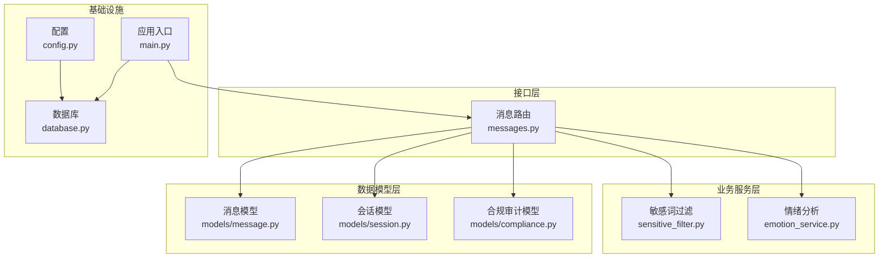
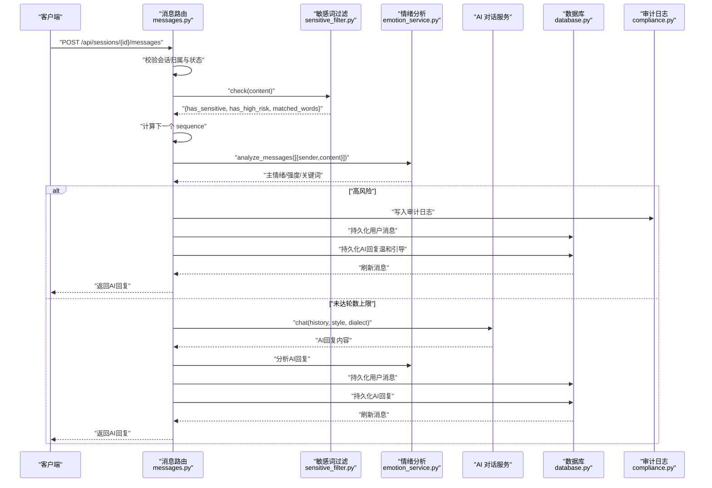
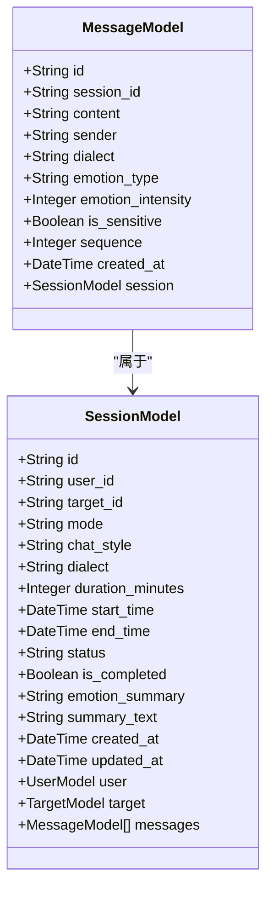
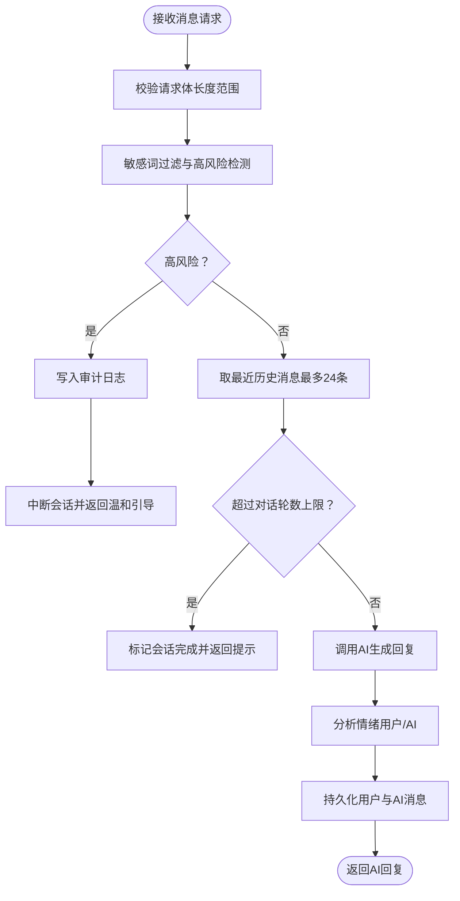
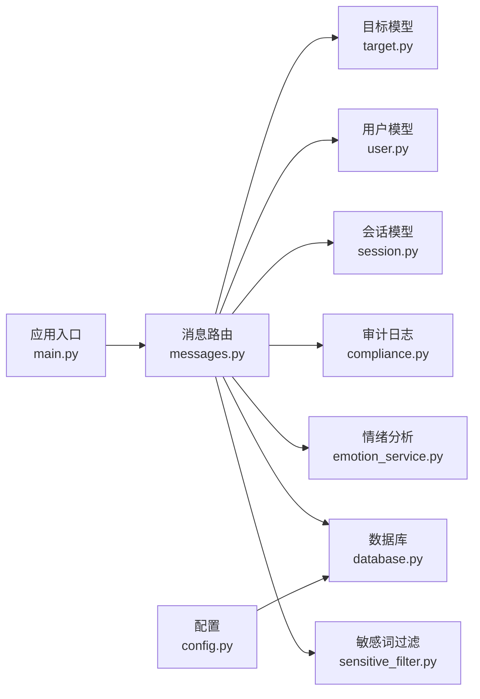

# 消息模型

<cite>
**本文引用的文件**
- [emo_outlet_api/app/models/message.py](file://emo_outlet_api/app/models/message.py)
- [emo_outlet_api/app/schemas/message.py](file://emo_outlet_api/app/schemas/message.py)
- [emo_outlet_api/app/api/messages.py](file://emo_outlet_api/app/api/messages.py)
- [emo_outlet_api/app/models/session.py](file://emo_outlet_api/app/models/session.py)
- [emo_outlet_api/app/utils/sensitive_filter.py](file://emo_outlet_api/app/utils/sensitive_filter.py)
- [emo_outlet_api/app/services/emotion_service.py](file://emo_outlet_api/app/services/emotion_service.py)
- [emo_outlet_api/app/models/compliance.py](file://emo_outlet_api/app/models/compliance.py)
- [emo_outlet_api/app/config.py](file://emo_outlet_api/app/config.py)
- [emo_outlet_api/app/database.py](file://emo_outlet_api/app/database.py)
- [emo_outlet_api/app/main.py](file://emo_outlet_api/app/main.py)
- [emo_outlet_api/app/models/user.py](file://emo_outlet_api/app/models/user.py)
- [emo_outlet_api/app/models/target.py](file://emo_outlet_api/app/models/target.py)
</cite>

## 目录
1. [简介](#简介)
2. [项目结构](#项目结构)
3. [核心组件](#核心组件)
4. [架构总览](#架构总览)
5. [详细组件分析](#详细组件分析)
6. [依赖分析](#依赖分析)
7. [性能考虑](#性能考虑)
8. [故障排查指南](#故障排查指南)
9. [结论](#结论)
10. [附录](#附录)

## 简介
本文件面向 Emo Outlet 项目的消息模型，系统性阐述消息实体结构、与会话的关系、消息排序与检索机制、内容验证与安全检查、实时通信支持现状、消息持久化与历史记录管理，并提供操作示例与性能优化建议。同时覆盖隐私保护与内容审核机制，帮助开发者与产品人员快速理解与正确使用消息能力。

## 项目结构
消息子系统主要由以下层次构成：
- 数据模型层：消息与会话的 ORM 映射
- 接口层：消息的增删查改 API
- 业务服务层：敏感词过滤、情绪分析、AI 对话集成
- 配置与基础设施：数据库连接、运行生命周期、合规审计

图表来源
- [emo_outlet_api/app/api/messages.py:1-216](file://emo_outlet_api/app/api/messages.py#L1-L216)
- [emo_outlet_api/app/utils/sensitive_filter.py:1-142](file://emo_outlet_api/app/utils/sensitive_filter.py#L1-L142)
- [emo_outlet_api/app/services/emotion_service.py:1-181](file://emo_outlet_api/app/services/emotion_service.py#L1-L181)
- [emo_outlet_api/app/models/message.py:1-46](file://emo_outlet_api/app/models/message.py#L1-L46)
- [emo_outlet_api/app/models/session.py:1-79](file://emo_outlet_api/app/models/session.py#L1-L79)
- [emo_outlet_api/app/models/compliance.py:1-50](file://emo_outlet_api/app/models/compliance.py#L1-L50)
- [emo_outlet_api/app/config.py:1-125](file://emo_outlet_api/app/config.py#L1-L125)
- [emo_outlet_api/app/database.py:1-43](file://emo_outlet_api/app/database.py#L1-L43)
- [emo_outlet_api/app/main.py:1-82](file://emo_outlet_api/app/main.py#L1-L82)

章节来源
- [emo_outlet_api/app/main.py:51-64](file://emo_outlet_api/app/main.py#L51-L64)
- [emo_outlet_api/app/database.py:34-38](file://emo_outlet_api/app/database.py#L34-L38)

## 核心组件
- 消息模型（MessageModel）：承载消息内容、发送者、方言、情绪标签、敏感标记、序列号与时间戳，并与会话建立一对多关系。
- 会话模型（SessionModel）：承载会话元信息（模式、风格、方言、时长、状态、完成态）、与用户/目标对象关联，并维护消息集合。
- 消息 Schema：定义对外传输的数据结构，包括请求体与响应体字段。
- 敏感词过滤（DFAFilter）：基于确定性有限自动机与高风险正则的组合方案，提供 O(n) 匹配与高风险响应。
- 情绪分析（EmotionService）：基于关键词统计与标点、重复等语言学特征的综合评分，输出主情绪、强度与关键词。
- 合规审计（ContentAuditLog）：记录敏感内容的审计日志，支持风险等级与处置动作追踪。
- 配置（Settings）：集中管理消息长度、会话时长、对话轮数上限、审计开关等策略。

章节来源
- [emo_outlet_api/app/models/message.py:13-46](file://emo_outlet_api/app/models/message.py#L13-L46)
- [emo_outlet_api/app/models/session.py:13-79](file://emo_outlet_api/app/models/session.py#L13-L79)
- [emo_outlet_api/app/schemas/message.py:8-33](file://emo_outlet_api/app/schemas/message.py#L8-L33)
- [emo_outlet_api/app/utils/sensitive_filter.py:37-142](file://emo_outlet_api/app/utils/sensitive_filter.py#L37-L142)
- [emo_outlet_api/app/services/emotion_service.py:44-181](file://emo_outlet_api/app/services/emotion_service.py#L44-L181)
- [emo_outlet_api/app/models/compliance.py:31-50](file://emo_outlet_api/app/models/compliance.py#L31-L50)
- [emo_outlet_api/app/config.py:88-114](file://emo_outlet_api/app/config.py#L88-L114)

## 架构总览
消息从客户端进入后，经认证与权限校验，进入消息路由处理流程。流程中依次执行敏感词检查、情绪分析、AI 对话生成、会话状态更新与持久化，最终返回标准化响应。高风险内容会触发审计日志与会话中断逻辑。

图表来源
- [emo_outlet_api/app/api/messages.py:69-195](file://emo_outlet_api/app/api/messages.py#L69-L195)
- [emo_outlet_api/app/utils/sensitive_filter.py:102-119](file://emo_outlet_api/app/utils/sensitive_filter.py#L102-L119)
- [emo_outlet_api/app/services/emotion_service.py:44-71](file://emo_outlet_api/app/services/emotion_service.py#L44-L71)
- [emo_outlet_api/app/models/compliance.py:31-50](file://emo_outlet_api/app/models/compliance.py#L31-L50)
- [emo_outlet_api/app/database.py:22-31](file://emo_outlet_api/app/database.py#L22-L31)

## 详细组件分析

### 消息模型（MessageModel）
- 字段设计
  - 标识与关联：UUID 主键、会话外键，确保消息与会话一一对应。
  - 内容与来源：文本内容、发送者标识（user/ai/system），方言与情绪标签（类型与强度）。
  - 安全与顺序：敏感标记、递增序列号，便于按序检索与风控。
  - 时间戳：服务器默认创建时间，支持时区。
- 关系映射：与会话模型建立 back_populates 的一对多关系，支持懒加载。
- 设计要点
  - 使用 Text 存储长文本，满足心理倾诉场景。
  - sequence 作为全局单调递增序号，避免依赖时间戳排序带来的并发问题。
  - is_sensitive 与 ContentAuditLog 联动，形成闭环审计。

图表来源
- [emo_outlet_api/app/models/message.py:13-46](file://emo_outlet_api/app/models/message.py#L13-L46)
- [emo_outlet_api/app/models/session.py:13-79](file://emo_outlet_api/app/models/session.py#L13-L79)

章节来源
- [emo_outlet_api/app/models/message.py:13-46](file://emo_outlet_api/app/models/message.py#L13-L46)

### 会话与消息的关系
- 一对多：一个会话包含多条消息；消息通过外键绑定到会话。
- 查询策略：按 sequence 升序排列，支持分页；在读取时可结合会话状态与剩余时长返回给前端。
- 状态与生命周期：会话状态（待开始/进行中/正常结束/中断）与完成态共同决定消息写入与中断行为。

章节来源
- [emo_outlet_api/app/models/session.py:72-75](file://emo_outlet_api/app/models/session.py#L72-L75)
- [emo_outlet_api/app/api/messages.py:32-66](file://emo_outlet_api/app/api/messages.py#L32-L66)

### 消息排序与检索机制
- 排序：以 sequence 升序排列，保证对话顺序稳定。
- 分页：支持 page/page_size 参数，限制每次返回数量，默认 50 条。
- 历史截断：AI 生成上下文仅取最近 24 条非 system 消息，兼顾性能与上下文质量。
- 会话剩余时长：当会话处于 active 状态且存在起始时间时，计算剩余秒数返回给前端。

章节来源
- [emo_outlet_api/app/api/messages.py:32-66](file://emo_outlet_api/app/api/messages.py#L32-L66)
- [emo_outlet_api/app/api/messages.py:128-138](file://emo_outlet_api/app/api/messages.py#L128-L138)

### 消息数据验证规则、内容过滤与安全检查
- 请求体校验：Pydantic 定义最小长度与最大长度约束，防止超长或空内容。
- 敏感词过滤：DFA Trie 树实现 O(n) 匹配，支持高风险正则补充识别。
- 风险处置：
  - 中低风险：记录审计日志并继续对话。
  - 高风险：中断会话并写入审计日志，返回预设温和引导语。
- 情绪分析：对用户与 AI 回复分别分析，输出主情绪、强度与关键词，辅助情绪可视化与总结。

图表来源
- [emo_outlet_api/app/schemas/message.py:8-10](file://emo_outlet_api/app/schemas/message.py#L8-L10)
- [emo_outlet_api/app/utils/sensitive_filter.py:102-119](file://emo_outlet_api/app/utils/sensitive_filter.py#L102-L119)
- [emo_outlet_api/app/api/messages.py:69-195](file://emo_outlet_api/app/api/messages.py#L69-L195)
- [emo_outlet_api/app/services/emotion_service.py:44-71](file://emo_outlet_api/app/services/emotion_service.py#L44-L71)

章节来源
- [emo_outlet_api/app/schemas/message.py:8-10](file://emo_outlet_api/app/schemas/message.py#L8-L10)
- [emo_outlet_api/app/utils/sensitive_filter.py:37-142](file://emo_outlet_api/app/utils/sensitive_filter.py#L37-L142)
- [emo_outlet_api/app/api/messages.py:69-195](file://emo_outlet_api/app/api/messages.py#L69-L195)

### 实时通信支持
- 当前实现：基于 HTTP 的同步请求/响应，未见 WebSocket 或长轮询等实时推送机制。
- 建议：若需实时体验，可在现有消息持久化基础上引入 WebSocket 广播或服务端事件（SSE），将新消息推送给订阅者。

章节来源
- [emo_outlet_api/app/api/messages.py:69-195](file://emo_outlet_api/app/api/messages.py#L69-L195)

### 消息持久化与历史记录管理
- 持久化：使用异步 SQLAlchemy 会话，提交成功后返回响应；异常时回滚并抛出。
- 历史管理：
  - 用户消息：按 sequence 有序存储，支持分页查询。
  - AI 回复：与用户消息交替出现，保持对话节奏。
  - 审计日志：对高风险内容进行记录，便于合规追溯。
- 时长与轮数控制：结合会话起止时间与配置项，动态判断会话是否应结束。

章节来源
- [emo_outlet_api/app/database.py:22-31](file://emo_outlet_api/app/database.py#L22-L31)
- [emo_outlet_api/app/models/compliance.py:31-50](file://emo_outlet_api/app/models/compliance.py#L31-L50)
- [emo_outlet_api/app/api/messages.py:186-192](file://emo_outlet_api/app/api/messages.py#L186-L192)

### 消息操作实现示例
- 发送消息（含敏感词与情绪分析）
  - 步骤：校验会话归属与状态 → 敏感词检查 → 计算 sequence → 情绪分析 → 若高风险则中断并记录审计 → 否则取历史上下文调用 AI → 持久化用户与 AI 消息 → 返回响应。
  - 参考路径：[send_message:69-195](file://emo_outlet_api/app/api/messages.py#L69-L195)
- 获取消息列表（分页与剩余时长）
  - 步骤：校验会话归属 → 统计总数 → 按 sequence 升序分页查询 → 计算剩余秒数 → 返回列表与会话状态。
  - 参考路径：[get_messages:32-66](file://emo_outlet_api/app/api/messages.py#L32-L66)

章节来源
- [emo_outlet_api/app/api/messages.py:32-66](file://emo_outlet_api/app/api/messages.py#L32-L66)
- [emo_outlet_api/app/api/messages.py:69-195](file://emo_outlet_api/app/api/messages.py#L69-L195)

### 隐私保护与内容审核机制
- 隐私保护
  - 用户身份：通过认证中间件绑定当前用户，所有消息均与 user_id 关联，确保可追溯。
  - 审计日志：记录原始内容片段、匹配关键字、处置动作，支持合规审计。
- 内容审核
  - 敏感词库：内置扩展词库，支持暴力/违法/政治/色情/低俗/网暴等类别。
  - 高风险模式：通过正则识别自残/自杀/同归于尽等高危意图。
  - 风险处置：高风险时中断会话并返回温和引导语，降低二次伤害风险。

章节来源
- [emo_outlet_api/app/models/user.py:12-52](file://emo_outlet_api/app/models/user.py#L12-L52)
- [emo_outlet_api/app/models/compliance.py:31-50](file://emo_outlet_api/app/models/compliance.py#L31-L50)
- [emo_outlet_api/app/utils/sensitive_filter.py:11-34](file://emo_outlet_api/app/utils/sensitive_filter.py#L11-L34)
- [emo_outlet_api/app/api/messages.py:96-113](file://emo_outlet_api/app/api/messages.py#L96-L113)

## 依赖分析
- 模块耦合
  - 消息路由依赖敏感词过滤、情绪分析、AI 服务、数据库与合规模型。
  - 消息模型与会话模型通过外键关联，形成稳定的领域模型。
- 外部依赖
  - 数据库：异步 SQLAlchemy（MySQL/SQLite）。
  - 配置：集中式 Settings 提供策略开关与阈值。
  - 应用生命周期：FastAPI lifespan 管理数据库初始化与关闭。

图表来源
- [emo_outlet_api/app/api/messages.py:1-216](file://emo_outlet_api/app/api/messages.py#L1-L216)
- [emo_outlet_api/app/utils/sensitive_filter.py:1-142](file://emo_outlet_api/app/utils/sensitive_filter.py#L1-L142)
- [emo_outlet_api/app/services/emotion_service.py:1-181](file://emo_outlet_api/app/services/emotion_service.py#L1-L181)
- [emo_outlet_api/app/models/compliance.py:1-50](file://emo_outlet_api/app/models/compliance.py#L1-L50)
- [emo_outlet_api/app/models/session.py:1-79](file://emo_outlet_api/app/models/session.py#L1-L79)
- [emo_outlet_api/app/models/user.py:1-52](file://emo_outlet_api/app/models/user.py#L1-L52)
- [emo_outlet_api/app/models/target.py:1-56](file://emo_outlet_api/app/models/target.py#L1-L56)
- [emo_outlet_api/app/config.py:1-125](file://emo_outlet_api/app/config.py#L1-L125)
- [emo_outlet_api/app/main.py:1-82](file://emo_outlet_api/app/main.py#L1-L82)

章节来源
- [emo_outlet_api/app/api/messages.py:1-216](file://emo_outlet_api/app/api/messages.py#L1-L216)
- [emo_outlet_api/app/config.py:88-114](file://emo_outlet_api/app/config.py#L88-L114)
- [emo_outlet_api/app/database.py:10-15](file://emo_outlet_api/app/database.py#L10-L15)

## 性能考虑
- 敏感词匹配：DFA Trie 树实现 O(n) 匹配，避免正则多次扫描；建议定期预热词库与缓存高频模式。
- 情绪分析：关键词统计与标点特征评分，复杂度与文本长度线性相关；建议对长文本进行分段或截断，减少计算开销。
- 数据库访问：
  - 分页查询使用 offset/limit，大数据量下建议引入基于游标的分页或索引优化。
  - 历史截断限制为 24 条，兼顾上下文质量与查询性能。
- 事务与回滚：统一在会话中批量提交，异常时回滚，避免脏数据。
- 并发与序列号：通过数据库聚合函数获取最大 sequence 并加一，保证序列唯一性。

章节来源
- [emo_outlet_api/app/utils/sensitive_filter.py:74-100](file://emo_outlet_api/app/utils/sensitive_filter.py#L74-L100)
- [emo_outlet_api/app/api/messages.py:128-138](file://emo_outlet_api/app/api/messages.py#L128-L138)
- [emo_outlet_api/app/database.py:22-31](file://emo_outlet_api/app/database.py#L22-L31)
- [emo_outlet_api/app/api/messages.py:211-215](file://emo_outlet_api/app/api/messages.py#L211-L215)

## 故障排查指南
- 会话不存在或不属于当前用户
  - 现象：返回 404。
  - 排查：确认 session_id 与用户绑定关系。
  - 参考路径：[_get_owned_session:198-208](file://emo_outlet_api/app/api/messages.py#L198-L208)
- 会话已完成
  - 现象：发送消息时报错会话已完成。
  - 排查：检查会话状态与完成标志位。
  - 参考路径：[send_message:77-78](file://emo_outlet_api/app/api/messages.py#L77-L78)
- 高风险内容被拦截
  - 现象：立即中断并返回温和引导语。
  - 排查：查看审计日志中的匹配关键字与风险等级。
  - 参考路径：[send_message:109-126](file://emo_outlet_api/app/api/messages.py#L109-L126)
- 情绪分析结果为空
  - 现象：返回默认“平静”状态。
  - 排查：确认输入文本非空与关键词库覆盖情况。
  - 参考路径：[_empty_result:73-81](file://emo_outlet_api/app/services/emotion_service.py#L73-L81)
- 数据库连接异常
  - 现象：启动失败或查询报错。
  - 排查：核对数据库 URL、驱动与网络连通性。
  - 参考路径：[database.py:8-15](file://emo_outlet_api/app/database.py#L8-L15)

章节来源
- [emo_outlet_api/app/api/messages.py:198-208](file://emo_outlet_api/app/api/messages.py#L198-L208)
- [emo_outlet_api/app/api/messages.py:77-78](file://emo_outlet_api/app/api/messages.py#L77-L78)
- [emo_outlet_api/app/api/messages.py:109-126](file://emo_outlet_api/app/api/messages.py#L109-L126)
- [emo_outlet_api/app/services/emotion_service.py:73-81](file://emo_outlet_api/app/services/emotion_service.py#L73-L81)
- [emo_outlet_api/app/database.py:8-15](file://emo_outlet_api/app/database.py#L8-L15)

## 结论
消息模型围绕“结构清晰、顺序稳定、安全可控、可审计”的目标设计，结合敏感词过滤与情绪分析，形成从内容到情感的双维度治理。当前以同步 API 为主，建议在保持现有稳定性的前提下，逐步引入实时通信能力，进一步提升用户体验与干预效率。

## 附录
- 关键配置项（节选）
  - 最大消息长度、会话时长、每日会话上限、对话轮数上限、审计开关等。
  - 参考路径：[config.py:88-114](file://emo_outlet_api/app/config.py#L88-L114)
- 应用入口与路由注册
  - 参考路径：[main.py:51-64](file://emo_outlet_api/app/main.py#L51-L64)