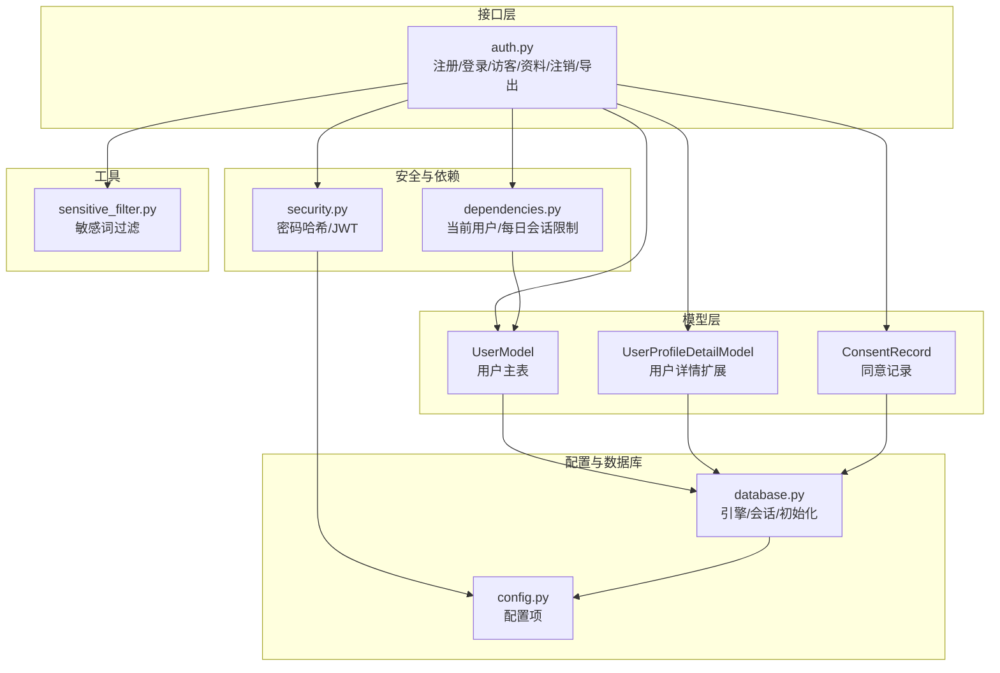
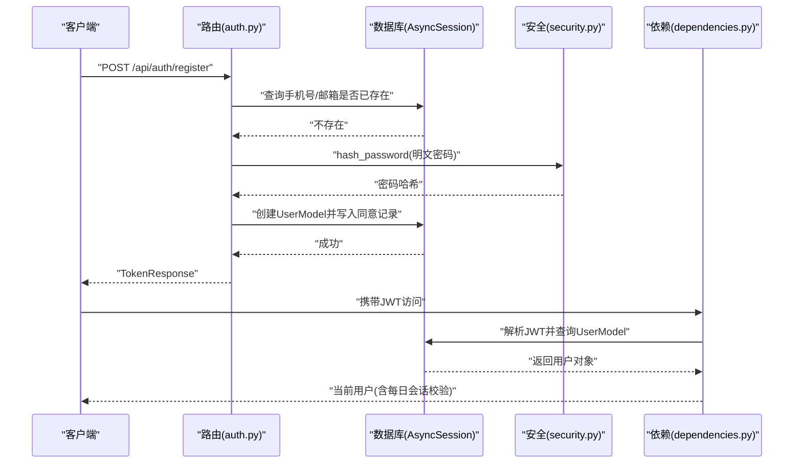
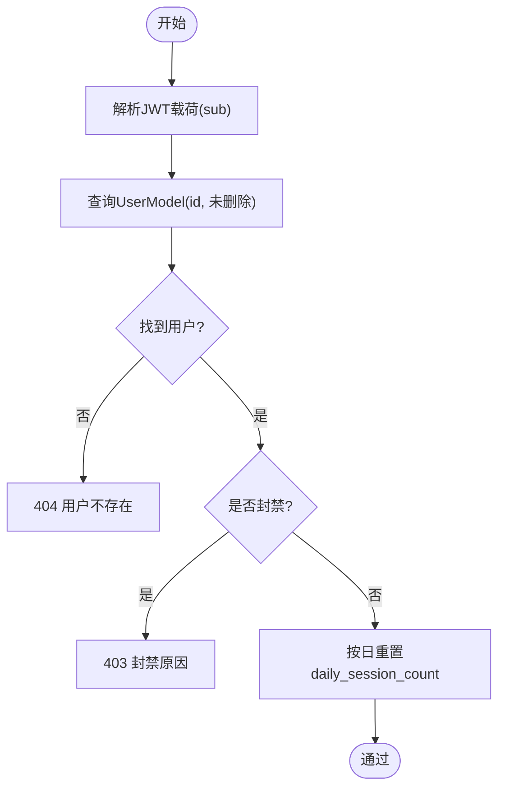
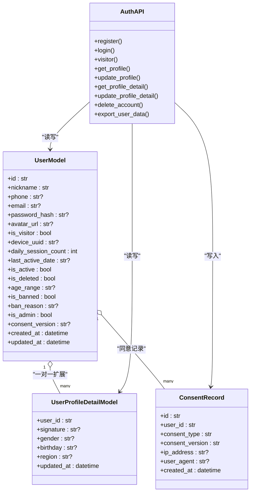

# 用户模型

<cite>
**本文引用的文件**
- [emo_outlet_api/app/models/user.py](file://emo_outlet_api/app/models/user.py)
- [emo_outlet_api/app/schemas/user.py](file://emo_outlet_api/app/schemas/user.py)
- [emo_outlet_api/app/api/auth.py](file://emo_outlet_api/app/api/auth.py)
- [emo_outlet_api/app/core/security.py](file://emo_outlet_api/app/core/security.py)
- [emo_outlet_api/app/core/dependencies.py](file://emo_outlet_api/app/core/dependencies.py)
- [emo_outlet_api/app/models/compliance.py](file://emo_outlet_api/app/models/compliance.py)
- [emo_outlet_api/app/models/support.py](file://emo_outlet_api/app/models/support.py)
- [emo_outlet_api/app/database.py](file://emo_outlet_api/app/database.py)
- [emo_outlet_api/app/config.py](file://emo_outlet_api/app/config.py)
- [emo_outlet_api/app/utils/sensitive_filter.py](file://emo_outlet_api/app/utils/sensitive_filter.py)
- [emo_outlet_api/tests/test_api_smoke.py](file://emo_outlet_api/tests/test_api_smoke.py)
</cite>

## 目录
1. [简介](#简介)
2. [项目结构](#项目结构)
3. [核心组件](#核心组件)
4. [架构总览](#架构总览)
5. [详细组件分析](#详细组件分析)
6. [依赖分析](#依赖分析)
7. [性能考虑](#性能考虑)
8. [故障排查指南](#故障排查指南)
9. [结论](#结论)
10. [附录](#附录)

## 简介
本文件系统化梳理 Emo Outlet 项目的用户模型设计与实现，覆盖数据结构、字段约束、认证与授权、合规与安全、数据验证规则、业务逻辑约束、数据完整性保障、CRUD 示例与最佳实践，以及隐私保护与合规要求。目标是帮助开发者与产品人员快速理解并正确使用用户模型。

## 项目结构
用户模型相关代码主要分布在以下模块：
- 模型层：用户表、合规记录、用户详情扩展表
- 接口层：认证与用户资料相关接口
- 安全与依赖：密码哈希、JWT、当前用户解析与每日会话限制
- 配置与数据库：连接、初始化、事务与回滚
- 工具：敏感词过滤（用于内容安全）

图表来源
- [emo_outlet_api/app/models/user.py:14-56](file://emo_outlet_api/app/models/user.py#L14-L56)
- [emo_outlet_api/app/models/support.py:12-24](file://emo_outlet_api/app/models/support.py#L12-L24)
- [emo_outlet_api/app/models/compliance.py:12-28](file://emo_outlet_api/app/models/compliance.py#L12-L28)
- [emo_outlet_api/app/api/auth.py:33-332](file://emo_outlet_api/app/api/auth.py#L33-L332)
- [emo_outlet_api/app/core/security.py:16-42](file://emo_outlet_api/app/core/security.py#L16-L42)
- [emo_outlet_api/app/core/dependencies.py:18-66](file://emo_outlet_api/app/core/dependencies.py#L18-L66)
- [emo_outlet_api/app/database.py:8-43](file://emo_outlet_api/app/database.py#L8-L43)
- [emo_outlet_api/app/config.py:54-121](file://emo_outlet_api/app/config.py#L54-L121)
- [emo_outlet_api/app/utils/sensitive_filter.py:37-142](file://emo_outlet_api/app/utils/sensitive_filter.py#L37-L142)

章节来源
- [emo_outlet_api/app/models/user.py:14-56](file://emo_outlet_api/app/models/user.py#L14-L56)
- [emo_outlet_api/app/api/auth.py:33-332](file://emo_outlet_api/app/api/auth.py#L33-L332)
- [emo_outlet_api/app/core/dependencies.py:18-66](file://emo_outlet_api/app/core/dependencies.py#L18-L66)
- [emo_outlet_api/app/database.py:8-43](file://emo_outlet_api/app/database.py#L8-L43)

## 核心组件
- 用户模型（UserModel）：定义用户标识、认证信息、个人资料、账户状态与合规字段，以及与目标、会话的关系。
- 用户请求/响应模型（schemas.user）：定义注册、登录、访客登录、更新、详情读取与返回格式。
- 合规模型（ConsentRecord）：记录用户对隐私与服务条款的同意版本与时间。
- 用户详情扩展（UserProfileDetailModel）：存储签名、性别、生日、地区等扩展资料。
- 安全与依赖：密码哈希、JWT、当前用户解析、每日会话次数校验。
- 配置与数据库：连接、初始化、事务管理。
- 敏感词过滤：用于内容安全与高风险提示。

章节来源
- [emo_outlet_api/app/models/user.py:14-56](file://emo_outlet_api/app/models/user.py#L14-L56)
- [emo_outlet_api/app/schemas/user.py:8-74](file://emo_outlet_api/app/schemas/user.py#L8-L74)
- [emo_outlet_api/app/models/compliance.py:12-28](file://emo_outlet_api/app/models/compliance.py#L12-L28)
- [emo_outlet_api/app/models/support.py:12-24](file://emo_outlet_api/app/models/support.py#L12-L24)
- [emo_outlet_api/app/core/security.py:16-42](file://emo_outlet_api/app/core/security.py#L16-L42)
- [emo_outlet_api/app/core/dependencies.py:18-66](file://emo_outlet_api/app/core/dependencies.py#L18-L66)
- [emo_outlet_api/app/config.py:54-121](file://emo_outlet_api/app/config.py#L54-L121)
- [emo_outlet_api/app/database.py:8-43](file://emo_outlet_api/app/database.py#L8-L43)
- [emo_outlet_api/app/utils/sensitive_filter.py:37-142](file://emo_outlet_api/app/utils/sensitive_filter.py#L37-L142)

## 架构总览
用户模型在系统中的交互流程如下：

图表来源
- [emo_outlet_api/app/api/auth.py:33-76](file://emo_outlet_api/app/api/auth.py#L33-L76)
- [emo_outlet_api/app/core/security.py:16-23](file://emo_outlet_api/app/core/security.py#L16-L23)
- [emo_outlet_api/app/core/dependencies.py:18-50](file://emo_outlet_api/app/core/dependencies.py#L18-L50)
- [emo_outlet_api/app/database.py:22-31](file://emo_outlet_api/app/database.py#L22-L31)

## 详细组件分析

### 用户模型数据结构与字段说明
- 标识与凭证
  - id：字符串，UUID，主键，默认生成
  - nickname：字符串，最大长度50，匿名用户默认值
  - phone：字符串，最大20，可空且唯一
  - email：字符串，最大100，可空且唯一
  - password_hash：字符串，最大128，可空
  - avatar_url：字符串，最大500，可空
- 角色与状态
  - is_visitor：布尔，访客标记
  - is_active：布尔，默认True
  - is_deleted：布尔，默认False
  - is_banned：布尔，默认False
  - ban_reason：字符串，最大200，可空
  - is_admin：布尔，默认False
- 设备与活跃度
  - device_uuid：字符串，最大100，可空
  - daily_session_count：整数，默认0
  - last_active_date：字符串，日期格式，可空
- 合规字段
  - age_range：字符串，最大5，可空，取值示例：<14 / 14-18 / >18
  - consent_version：字符串，最大20，可空，记录同意协议版本
- 时间戳
  - created_at：带时区的时间，默认服务器时间
  - updated_at：带时区时间，默认服务器时间，更新时自动刷新
- 关系
  - targets：与目标模型一对多
  - sessions：与会话模型一对多

字段约束与业务含义
- 唯一性：phone、email 唯一；id 主键
- 默认值：匿名昵称、非访客、活跃、未删除、未封禁、管理员否、每日会话0
- 可空性：手机号、邮箱、头像、设备UUID、年龄分组、封禁原因、密码哈希、最后活跃日期
- 合规：年龄分组用于限制每日会话与对话轮数；同意版本用于审计与合规追踪
- 安全：仅存储密码哈希，不存储明文密码

章节来源
- [emo_outlet_api/app/models/user.py:17-48](file://emo_outlet_api/app/models/user.py#L17-L48)

### 用户请求/响应模型与验证规则
- 注册请求（UserRegisterRequest）
  - nickname：必填或默认，最大50
  - phone：可选，需符合手机号格式
  - email：可选
  - password：必填，最小6，最大50
  - device_uuid：可选
  - consent_version：可选
  - age_range：可选
- 登录请求（UserLoginRequest）
  - account：账号（手机号或邮箱）
  - password：密码
- 访客登录（VisitorLoginRequest）
  - device_uuid：必填
  - nickname：默认“匿名用户”，最大50
- 响应模型（UserResponse）
  - 包含基本字段与默认值，支持从属性序列化
- 更新请求（UserUpdateRequest）
  - nickname、avatar_url 可选更新
- 详情读取/更新（UserProfileDetailResponse/UpdateRequest）
  - 包含签名、性别、生日、地区等，均有长度限制

验证规则与约束
- 字段长度与格式：手机号正则、昵称/签名/性别/生日/地区长度限制
- 必填与可选：密码注册必填，其他可空
- 默认行为：匿名用户昵称、默认签名/性别/生日/地区

章节来源
- [emo_outlet_api/app/schemas/user.py:8-74](file://emo_outlet_api/app/schemas/user.py#L8-L74)

### 认证与授权流程
- 密码处理：bcrypt 哈希与校验
- JWT：签发与解码，包含过期时间
- 当前用户解析：从 Authorization Bearer 中提取并校验 JWT，查询用户，拒绝已删除/封禁用户
- 每日会话限制：按用户类型与年龄分组动态限制

图表来源
- [emo_outlet_api/app/core/dependencies.py:18-50](file://emo_outlet_api/app/core/dependencies.py#L18-L50)
- [emo_outlet_api/app/core/security.py:26-42](file://emo_outlet_api/app/core/security.py#L26-L42)

章节来源
- [emo_outlet_api/app/core/security.py:16-42](file://emo_outlet_api/app/core/security.py#L16-L42)
- [emo_outlet_api/app/core/dependencies.py:18-66](file://emo_outlet_api/app/core/dependencies.py#L18-L66)

### 合规与审计
- 同意记录（ConsentRecord）
  - 记录用户对隐私与服务条款的同意版本与时间，支持IP与UA记录
- 内容审计日志（ContentAuditLog）
  - 记录用户会话内容的审核结果、风险等级、关键词匹配与处置动作
- 年龄分组与限制
  - 不同年龄段与访客的每日会话上限由配置控制

章节来源
- [emo_outlet_api/app/models/compliance.py:12-49](file://emo_outlet_api/app/models/compliance.py#L12-L49)
- [emo_outlet_api/app/config.py:97-110](file://emo_outlet_api/app/config.py#L97-L110)

### 用户资料扩展
- 用户详情扩展表（UserProfileDetailModel）
  - 存储签名、性别、生日、地区，支持更新时间戳
- 详情读取/更新接口
  - 读取时若无记录则填充默认值；更新时同步修改主表昵称与头像

章节来源
- [emo_outlet_api/app/models/support.py:12-24](file://emo_outlet_api/app/models/support.py#L12-L24)
- [emo_outlet_api/app/api/auth.py:145-209](file://emo_outlet_api/app/api/auth.py#L145-L209)

### 数据库与事务
- 异步引擎与会话工厂
- 初始化元数据（创建所有模型表）
- 事务：提交、回滚与关闭

章节来源
- [emo_outlet_api/app/database.py:8-43](file://emo_outlet_api/app/database.py#L8-L43)

### 敏感词与内容安全
- DFA 敏感词过滤器：O(n) 匹配，支持高风险正则模式
- 高风险触发时提供温和引导语句
- 可用于消息内容审核与风险处置

章节来源
- [emo_outlet_api/app/utils/sensitive_filter.py:37-142](file://emo_outlet_api/app/utils/sensitive_filter.py#L37-L142)

## 依赖分析
用户模型与周边模块的耦合关系如下：

图表来源
- [emo_outlet_api/app/models/user.py:14-56](file://emo_outlet_api/app/models/user.py#L14-L56)
- [emo_outlet_api/app/models/support.py:12-24](file://emo_outlet_api/app/models/support.py#L12-L24)
- [emo_outlet_api/app/models/compliance.py:12-28](file://emo_outlet_api/app/models/compliance.py#L12-L28)
- [emo_outlet_api/app/api/auth.py:33-332](file://emo_outlet_api/app/api/auth.py#L33-L332)

章节来源
- [emo_outlet_api/app/models/user.py:14-56](file://emo_outlet_api/app/models/user.py#L14-L56)
- [emo_outlet_api/app/models/support.py:12-24](file://emo_outlet_api/app/models/support.py#L12-L24)
- [emo_outlet_api/app/models/compliance.py:12-28](file://emo_outlet_api/app/models/compliance.py#L12-L28)
- [emo_outlet_api/app/api/auth.py:33-332](file://emo_outlet_api/app/api/auth.py#L33-L332)

## 性能考虑
- 查询优化
  - phone/email 唯一索引，注册/登录时快速去重与定位
  - 用户详情扩展表以 user_id 为主键，避免额外索引
- 事务与连接
  - 异步会话减少阻塞；统一提交/回滚降低异常成本
- 密码与JWT
  - bcrypt 哈希成本可控；JWT 载荷轻量，避免频繁数据库查询
- 敏感词过滤
  - DFA 构建 Trie 树，O(n) 匹配，适合高频内容审核

[本节为通用性能建议，不直接分析具体文件]

## 故障排查指南
- 认证失败
  - 未提供令牌、令牌无效或过期：检查 Authorization Bearer 与过期时间
  - 账号或密码错误：确认手机号/邮箱与密码哈希匹配
- 用户不存在或已删除
  - 当前用户解析会拒绝 is_deleted=True 的用户
- 被封禁
  - is_banned=True 时返回封禁原因
- 注册冲突
  - 手机号/邮箱重复：确保唯一性后再注册
- 资料更新失败
  - 确认传入字段长度与格式符合 Pydantic 校验
- 数据导出与注销
  - 注销会级联清理会话、消息、海报、目标、同意记录与详情；注意幂等性与事务一致性

章节来源
- [emo_outlet_api/app/core/dependencies.py:22-43](file://emo_outlet_api/app/core/dependencies.py#L22-L43)
- [emo_outlet_api/app/api/auth.py:38-46](file://emo_outlet_api/app/api/auth.py#L38-L46)
- [emo_outlet_api/app/api/auth.py:212-239](file://emo_outlet_api/app/api/auth.py#L212-L239)

## 结论
用户模型围绕“身份标识、认证安全、资料扩展、合规与审计”构建，配合 Pydantic 请求模型与 FastAPI 接口，形成清晰的输入输出边界。通过 JWT 与每日会话限制实现访问控制，结合敏感词过滤与审计日志满足内容安全与合规要求。建议在生产环境强化密钥管理、启用 HTTPS、定期审计与备份。

[本节为总结性内容，不直接分析具体文件]

## 附录

### 字段一览与约束摘要
- 标识与凭证
  - id：主键，UUID
  - nickname：默认“匿名用户”，最大50
  - phone：唯一，最大20
  - email：唯一，最大100
  - password_hash：最大128
  - avatar_url：最大500
- 角色与状态
  - is_visitor/is_active/is_deleted：布尔
  - is_banned：布尔，默认False
  - ban_reason：最大200
  - is_admin：布尔，默认False
- 设备与活跃度
  - device_uuid：最大100
  - daily_session_count：整数，默认0
  - last_active_date：日期字符串
- 合规字段
  - age_range：最大5，取值示例：<14 / 14-18 / >18
  - consent_version：最大20
- 时间戳
  - created_at/updated_at：带时区，默认服务器时间

章节来源
- [emo_outlet_api/app/models/user.py:17-48](file://emo_outlet_api/app/models/user.py#L17-L48)

### CRUD 操作示例与最佳实践
- 创建（注册）
  - 输入：手机号/邮箱/密码/nickname/device_uuid/consent_version/age_range
  - 流程：查重 -> 哈希密码 -> 写入用户 -> 可选写入同意记录 -> 生成JWT -> 返回TokenResponse
  - 最佳实践：确保手机号/邮箱唯一性；密码必须哈希存储；同意版本可选但建议收集
- 读取（我的资料）
  - 输入：Authorization Bearer
  - 输出：UserResponse
  - 最佳实践：使用 get_current_user 依赖解析当前用户
- 更新（修改昵称/头像）
  - 输入：UserUpdateRequest
  - 流程：逐字段判断非空 -> 更新 -> 刷新
  - 最佳实践：字段粒度更新，避免全量覆盖
- 详情读取/更新
  - 读取：无记录时填充默认值
  - 更新：同步更新主表昵称与头像
- 删除（注销）
  - 流程：级联删除会话/消息/海报/目标/同意记录/详情 -> 清理敏感字段 -> 标记is_active=False/is_deleted=True
  - 最佳实践：确保数据清理完整，避免残留敏感信息
- 导出数据
  - 流程：查询会话/消息/目标/海报 -> 组装JSON -> 返回
  - 最佳实践：分页与限流，避免大查询阻塞

章节来源
- [emo_outlet_api/app/api/auth.py:33-332](file://emo_outlet_api/app/api/auth.py#L33-L332)
- [emo_outlet_api/app/schemas/user.py:8-74](file://emo_outlet_api/app/schemas/user.py#L8-L74)

### 隐私保护与合规要求
- 数据最小化：仅收集必要字段（手机号/邮箱/密码/昵称），其余可选
- 加密存储：密码使用 bcrypt 哈希；传输使用 HTTPS
- 同意记录：记录隐私与服务条款版本，支持审计
- 内容安全：敏感词过滤与高风险提示，必要时记录审计日志
- 数据生命周期：注销时彻底清理，导出时遵循最小暴露原则
- 年龄分组：根据 age_range 实施差异化限制与保护

章节来源
- [emo_outlet_api/app/models/compliance.py:12-49](file://emo_outlet_api/app/models/compliance.py#L12-L49)
- [emo_outlet_api/app/utils/sensitive_filter.py:37-142](file://emo_outlet_api/app/utils/sensitive_filter.py#L37-L142)
- [emo_outlet_api/app/config.py:94-110](file://emo_outlet_api/app/config.py#L94-L110)