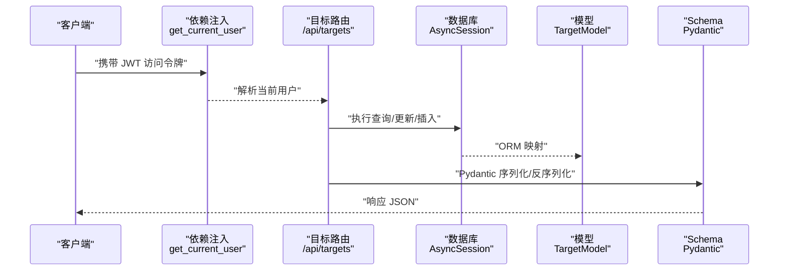
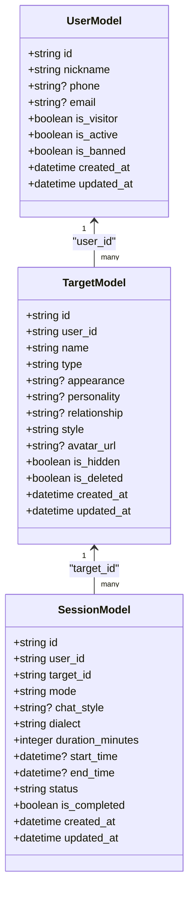
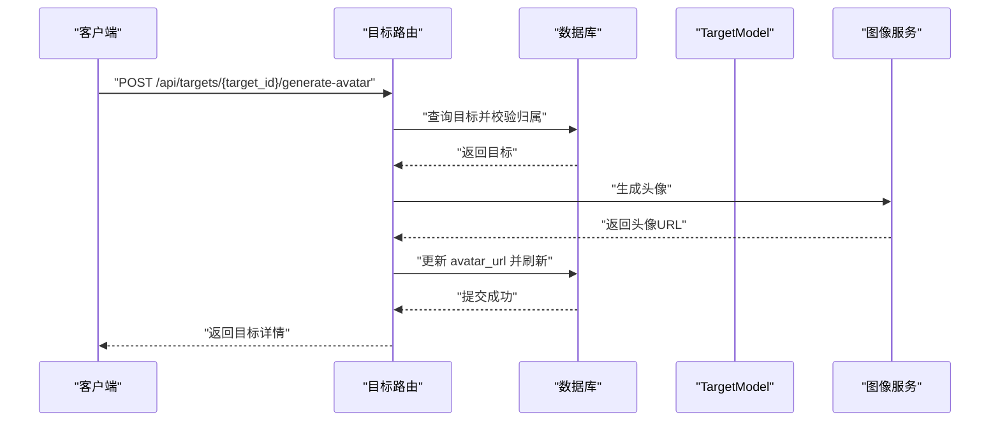
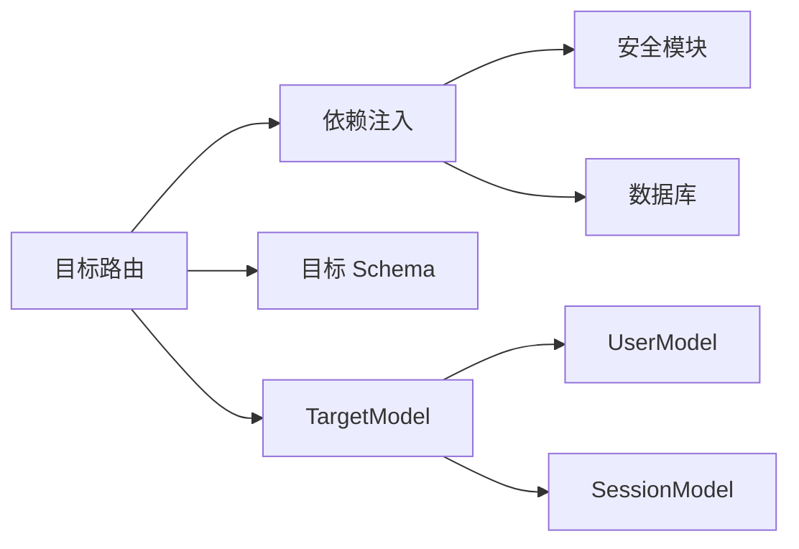

# 目标模型

<cite>
**本文引用的文件**
- [emo_outlet_api/app/models/target.py](file://emo_outlet_api/app/models/target.py)
- [emo_outlet_api/app/schemas/target.py](file://emo_outlet_api/app/schemas/target.py)
- [emo_outlet_api/app/api/targets.py](file://emo_outlet_api/app/api/targets.py)
- [emo_outlet_api/app/models/user.py](file://emo_outlet_api/app/models/user.py)
- [emo_outlet_api/app/models/session.py](file://emo_outlet_api/app/models/session.py)
- [emo_outlet_api/app/core/dependencies.py](file://emo_outlet_api/app/core/dependencies.py)
- [emo_outlet_api/app/core/security.py](file://emo_outlet_api/app/core/security.py)
- [emo_outlet_api/app/database.py](file://emo_outlet_api/app/database.py)
- [emo_outlet_api/app/schemas/common.py](file://emo_outlet_api/app/schemas/common.py)
- [emo_outlet_app/lib/models/target_model.dart](file://emo_outlet_app/lib/models/target_model.dart)
- [emo_outlet_app/lib/screens/target_list_screen.dart](file://emo_outlet_app/lib/screens/target_list_screen.dart)
</cite>

## 目录
1. [简介](#简介)
2. [项目结构](#项目结构)
3. [核心组件](#核心组件)
4. [架构总览](#架构总览)
5. [详细组件分析](#详细组件分析)
6. [依赖分析](#依赖分析)
7. [性能考虑](#性能考虑)
8. [故障排查指南](#故障排查指南)
9. [结论](#结论)
10. [附录](#附录)

## 简介
本文件系统化梳理 Emo Outlet 项目中的“目标模型”（TargetModel），覆盖其数据库模型、API 接口、Schema 校验、前后端数据结构、状态管理、隐私与访问控制等关键方面。目标模型用于记录用户设定的“泄愤对象”，包含对象名称、类型、外观、个性、关系、风格、头像 URL，以及隐藏/删除状态与时间戳等字段；同时通过关系映射与用户、会话模型建立关联，支撑后续会话与情绪分析流程。

## 项目结构
围绕目标模型的关键文件分布如下：
- 后端模型层：目标模型、用户模型、会话模型
- 后端接口层：目标相关 API 路由
- 后端数据校验层：目标相关 Pydantic Schema
- 安全与依赖：认证中间件、当前用户解析、数据库连接
- 前端模型层：目标数据结构与 UI 展示

```mermaid
graph TB
subgraph "后端"
T["目标模型<br/>TargetModel"]
U["用户模型<br/>UserModel"]
S["会话模型<br/>SessionModel"]
API["目标路由<br/>/api/targets"]
SCH["目标 Schema<br/>TargetCreate/Update/Response/AI"]
SEC["安全与依赖<br/>JWT/依赖注入"]
DB["数据库<br/>SQLAlchemy 异步引擎"]
end
subgraph "前端"
DT["目标模型<br/>TargetModel(Dart)"]
UI["目标列表界面<br/>TargetListScreen"]
end
API --> T
T <- --> U
T <- --> S
API --> SCH
API --> SEC
SEC --> DB
DT --> UI
```

图表来源
- [emo_outlet_api/app/models/target.py:13-56](file://emo_outlet_api/app/models/target.py#L13-L56)
- [emo_outlet_api/app/models/user.py:14-56](file://emo_outlet_api/app/models/user.py#L14-L56)
- [emo_outlet_api/app/models/session.py:13-79](file://emo_outlet_api/app/models/session.py#L13-L79)
- [emo_outlet_api/app/api/targets.py:23-213](file://emo_outlet_api/app/api/targets.py#L23-L213)
- [emo_outlet_api/app/schemas/target.py:9-63](file://emo_outlet_api/app/schemas/target.py#L9-L63)
- [emo_outlet_api/app/core/dependencies.py:18-67](file://emo_outlet_api/app/core/dependencies.py#L18-L67)
- [emo_outlet_api/app/database.py:1-43](file://emo_outlet_api/app/database.py#L1-L43)
- [emo_outlet_app/lib/models/target_model.dart:1-104](file://emo_outlet_app/lib/models/target_model.dart#L1-L104)
- [emo_outlet_app/lib/screens/target_list_screen.dart:1-285](file://emo_outlet_app/lib/screens/target_list_screen.dart#L1-L285)

章节来源
- [emo_outlet_api/app/models/target.py:13-56](file://emo_outlet_api/app/models/target.py#L13-L56)
- [emo_outlet_api/app/api/targets.py:23-213](file://emo_outlet_api/app/api/targets.py#L23-L213)
- [emo_outlet_api/app/schemas/target.py:9-63](file://emo_outlet_api/app/schemas/target.py#L9-L63)
- [emo_outlet_api/app/models/user.py:14-56](file://emo_outlet_api/app/models/user.py#L14-L56)
- [emo_outlet_api/app/models/session.py:13-79](file://emo_outlet_api/app/models/session.py#L13-L79)
- [emo_outlet_api/app/core/dependencies.py:18-67](file://emo_outlet_api/app/core/dependencies.py#L18-L67)
- [emo_outlet_api/app/database.py:1-43](file://emo_outlet_api/app/database.py#L1-L43)
- [emo_outlet_app/lib/models/target_model.dart:1-104](file://emo_outlet_app/lib/models/target_model.dart#L1-L104)
- [emo_outlet_app/lib/screens/target_list_screen.dart:1-285](file://emo_outlet_app/lib/screens/target_list_screen.dart#L1-L285)

## 核心组件
- 数据库模型：TargetModel
  - 主键：字符串型 UUID
  - 外键：user_id 关联用户
  - 字段：name、type、appearance、personality、relationship、style、avatar_url、is_hidden、is_deleted、created_at、updated_at
  - 关系：与 UserModel 的 back_populates，与 SessionModel 的 back_populates
- API 路由：/api/targets
  - 列表、创建、详情、更新、删除（软删除）、生成头像、AI 补全
- Schema 校验：TargetCreateRequest、TargetUpdateRequest、TargetResponse、TargetAiCompleteRequest、TargetAiCompleteResponse
- 前端模型：TargetModel(Dart)，包含序列化/反序列化与类型标签转换

章节来源
- [emo_outlet_api/app/models/target.py:13-56](file://emo_outlet_api/app/models/target.py#L13-L56)
- [emo_outlet_api/app/api/targets.py:26-213](file://emo_outlet_api/app/api/targets.py#L26-L213)
- [emo_outlet_api/app/schemas/target.py:9-63](file://emo_outlet_api/app/schemas/target.py#L9-L63)
- [emo_outlet_app/lib/models/target_model.dart:1-104](file://emo_outlet_app/lib/models/target_model.dart#L1-L104)

## 架构总览
目标模型贯穿“认证与依赖注入 → 数据库模型 → API 控制器 → Schema 校验 → 前端模型”的完整链路，并与用户、会话模型形成关联，支撑后续会话与情绪分析。



图表来源
- [emo_outlet_api/app/api/targets.py:26-213](file://emo_outlet_api/app/api/targets.py#L26-L213)
- [emo_outlet_api/app/core/dependencies.py:18-67](file://emo_outlet_api/app/core/dependencies.py#L18-L67)
- [emo_outlet_api/app/database.py:22-32](file://emo_outlet_api/app/database.py#L22-L32)
- [emo_outlet_api/app/schemas/target.py:9-63](file://emo_outlet_api/app/schemas/target.py#L9-L63)

## 详细组件分析

### 数据库模型：TargetModel
- 结构要点
  - 主键 id：字符串 UUID
  - 外键 user_id：指向用户模型
  - 名称与类型：name（必填，最大长度 100）、type（默认 custom）
  - 外观与个性：appearance、personality（Text，可空）
  - 关系：relationship（字符串，可空）
  - 风格：style（默认 漫画）
  - 头像：avatar_url（字符串，可空）
  - 状态：is_hidden（默认 False）、is_deleted（默认 False）
  - 时间：created_at、updated_at（带时区，默认值与更新触发）
  - 关系：user、sessions
- 设计考量
  - 使用 Text 存储较长描述文本，便于 AI 补全与生成
  - 默认值与注释明确字段用途，利于前端展示与后端逻辑
  - 软删除字段 is_deleted 支持数据恢复与审计



图表来源
- [emo_outlet_api/app/models/user.py:14-56](file://emo_outlet_api/app/models/user.py#L14-L56)
- [emo_outlet_api/app/models/target.py:13-56](file://emo_outlet_api/app/models/target.py#L13-L56)
- [emo_outlet_api/app/models/session.py:13-79](file://emo_outlet_api/app/models/session.py#L13-L79)

章节来源
- [emo_outlet_api/app/models/target.py:13-56](file://emo_outlet_api/app/models/target.py#L13-L56)

### API 路由：目标相关接口
- 列表：按用户过滤，支持 include_hidden 参数，按更新时间倒序
- 创建：基于请求体填充字段，非空字段统一转为空字符串处理
- 详情：按用户与 ID 查询，不存在返回 404
- 更新：逐项可选更新，支持隐藏状态切换
- 删除：软删除标记 is_deleted
- 生成头像：调用图像服务生成并回填 avatar_url
- AI 补全：根据关系词匹配预设模板，返回外观、个性、风格



图表来源
- [emo_outlet_api/app/api/targets.py:153-182](file://emo_outlet_api/app/api/targets.py#L153-L182)

章节来源
- [emo_outlet_api/app/api/targets.py:26-213](file://emo_outlet_api/app/api/targets.py#L26-L213)

### Schema 校验：请求与响应
- 创建请求：name、type、appearance、personality、relationship、style
- 更新请求：name、type、appearance、personality、relationship、style、is_hidden
- 响应：包含所有字段，relationship 对外别名为 relation
- AI 补全：输入 name 与 relationship，输出 appearance、personality、style

章节来源
- [emo_outlet_api/app/schemas/target.py:9-63](file://emo_outlet_api/app/schemas/target.py#L9-L63)

### 前端模型：TargetModel(Dart)
- 字段：id、name、type、appearance、personality、relationship、triggers、style、avatarUrl、isHidden、createdAt
- 序列化/反序列化：toJson/fromJson，兼容后端字段命名
- 类型标签：typeLabel 将枚举映射为中文标签
- UI 使用：目标列表界面按 name、relationship、typeLabel 进行筛选与展示

章节来源
- [emo_outlet_app/lib/models/target_model.dart:1-104](file://emo_outlet_app/lib/models/target_model.dart#L1-L104)
- [emo_outlet_app/lib/screens/target_list_screen.dart:20-34](file://emo_outlet_app/lib/screens/target_list_screen.dart#L20-L34)

### 验证规则、业务约束与数据完整性
- 必填与长度
  - name 最大长度 100；type 默认值 custom；style 默认 漫画
  - relationship 最大长度 100
- 空值策略
  - appearance/personality/relationship/avatar_url 可空
  - 创建时若为空，后端统一转为空字符串存储
- 状态与可见性
  - is_hidden 控制是否参与默认列表
  - is_deleted 实现软删除
- 关系约束
  - user_id 外键必须存在且有效
  - 与 SessionModel 一对多关联，确保会话归属正确
- 时间戳
  - created_at、updated_at 自动维护，含时区

章节来源
- [emo_outlet_api/app/models/target.py:16-48](file://emo_outlet_api/app/models/target.py#L16-L48)
- [emo_outlet_api/app/schemas/target.py:11-16](file://emo_outlet_api/app/schemas/target.py#L11-L16)
- [emo_outlet_api/app/api/targets.py:54-66](file://emo_outlet_api/app/api/targets.py#L54-L66)

### 扩展性设计与自定义属性支持
- 字段扩展
  - appearance、personality、relationship、style 为可扩展描述维度
  - avatar_url 支持外部资源链接，便于集成不同生成服务
- 架构扩展
  - AI 补全接口预留，可接入 LLM 或外部服务
  - triggers 在前端模型中存在，可在后端逐步引入以支持触发事件
- 前后端一致性
  - 前端模型与后端 Schema 字段对齐，避免命名差异导致的兼容问题

章节来源
- [emo_outlet_api/app/schemas/target.py:52-63](file://emo_outlet_api/app/schemas/target.py#L52-L63)
- [emo_outlet_app/lib/models/target_model.dart:8-26](file://emo_outlet_app/lib/models/target_model.dart#L8-L26)

### 操作示例与使用场景
- 创建目标
  - 请求体包含 name、type、appearance、personality、relationship、style
  - 返回目标详情，包含 avatar_url（初始为空）
- 列表与筛选
  - 默认不包含隐藏目标；可通过 include_hidden 控制
  - 前端按 name、relationship、typeLabel 过滤
- 生成头像
  - 基于当前外观、个性、风格调用图像服务
- AI 补全
  - 输入关系词，返回推荐外观、个性、风格
- 更新与删除
  - 支持部分字段更新与软删除

章节来源
- [emo_outlet_api/app/api/targets.py:47-151](file://emo_outlet_api/app/api/targets.py#L47-L151)
- [emo_outlet_app/lib/screens/target_list_screen.dart:27-34](file://emo_outlet_app/lib/screens/target_list_screen.dart#L27-L34)

### 隐私保护与访问控制
- 认证与授权
  - 通过 HTTP Bearer 令牌鉴权，解码 JWT 获取用户标识
  - 当前用户依赖函数校验用户存在、未删除、未封禁
- 数据隔离
  - 所有读写操作均强制绑定 user_id，防止越权访问
- 会话与合规
  - 用户模型包含年龄范围、封禁状态等合规字段，影响会话配额与权限
- 传输安全
  - 建议在生产环境启用 HTTPS，令牌通过安全通道传输

章节来源
- [emo_outlet_api/app/core/dependencies.py:18-67](file://emo_outlet_api/app/core/dependencies.py#L18-L67)
- [emo_outlet_api/app/core/security.py:26-42](file://emo_outlet_api/app/core/security.py#L26-L42)
- [emo_outlet_api/app/models/user.py:32-41](file://emo_outlet_api/app/models/user.py#L32-L41)

## 依赖分析
- 组件耦合
  - TargetModel 与 UserModel、SessionModel 形成清晰的一对多关系
  - API 路由依赖依赖注入解析当前用户与数据库会话
  - Schema 作为请求/响应契约，保证前后端一致
- 外部依赖
  - SQLAlchemy ORM、FastAPI、Pydantic、JWt、Passlib
- 循环依赖
  - 未发现循环导入；模型间关系通过字符串引用避免循环



图表来源
- [emo_outlet_api/app/api/targets.py:10-23](file://emo_outlet_api/app/api/targets.py#L10-L23)
- [emo_outlet_api/app/core/dependencies.py:18-50](file://emo_outlet_api/app/core/dependencies.py#L18-L50)
- [emo_outlet_api/app/models/target.py:50-52](file://emo_outlet_api/app/models/target.py#L50-L52)

章节来源
- [emo_outlet_api/app/api/targets.py:10-23](file://emo_outlet_api/app/api/targets.py#L10-L23)
- [emo_outlet_api/app/core/dependencies.py:18-50](file://emo_outlet_api/app/core/dependencies.py#L18-L50)
- [emo_outlet_api/app/models/target.py:50-52](file://emo_outlet_api/app/models/target.py#L50-L52)

## 性能考虑
- 查询优化
  - 列表接口按 user_id 与 is_deleted 过滤，结合 updated_at 排序，建议在相关字段建立索引
- 写入优化
  - 创建与更新采用 flush+refresh，减少并发冲突；批量更新时可合并事务
- 图像生成
  - 生成头像为异步调用，建议引入队列或后台任务，避免阻塞请求
- 前端渲染
  - 列表筛选在内存完成，建议后端支持分页与服务端过滤

## 故障排查指南
- 404 未找到
  - 目标不存在或已被软删除；检查 user_id 是否匹配当前用户
- 401 未认证
  - 缺少或无效 JWT 令牌；确认 Authorization 头格式与签名
- 403 禁止访问
  - 用户被封禁；检查用户状态与封禁原因
- 数据不一致
  - appearance/personality/relationship 为空时后端统一存空字符串；如需区分，请在前端或后端增加空值语义

章节来源
- [emo_outlet_api/app/api/targets.py:84-88](file://emo_outlet_api/app/api/targets.py#L84-L88)
- [emo_outlet_api/app/core/dependencies.py:22-43](file://emo_outlet_api/app/core/dependencies.py#L22-L43)

## 结论
目标模型以简洁的字段集合与清晰的关系映射，支撑了用户对“泄愤对象”的个性化管理，并与用户、会话模型协同，为后续会话与情绪分析奠定基础。通过 Schema 校验、JWT 认证与软删除策略，兼顾了数据完整性与隐私安全。未来可在后端引入 triggers 等字段，增强触发式体验；同时完善分页与索引，提升大规模数据下的查询性能。

## 附录
- 字段对照与默认值
  - name：必填，最大 100
  - type：默认 custom
  - appearance/personality/relationship：可空
  - style：默认 漫画
  - is_hidden/is_deleted：默认 False
  - avatar_url：可空
- 前端字段对齐
  - Dart 模型包含 triggers 字段，后端暂未实现；建议在后端补充以保持一致性