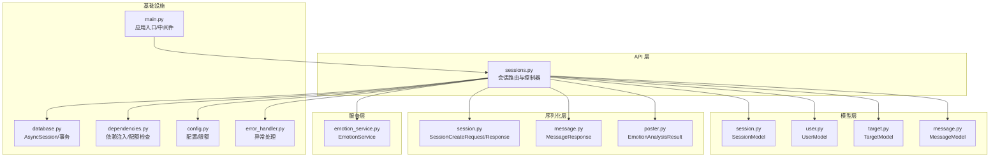
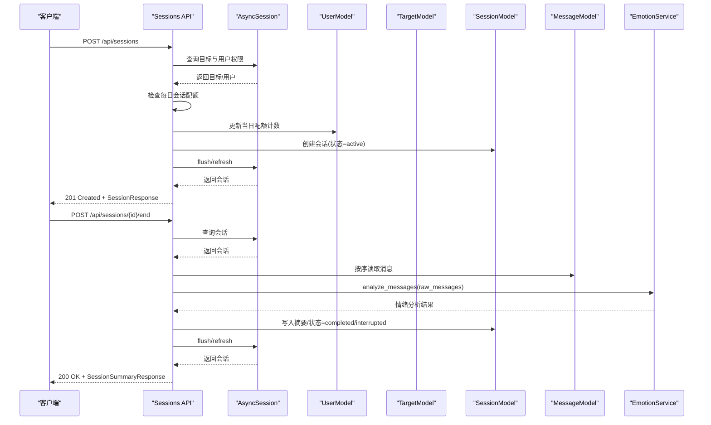
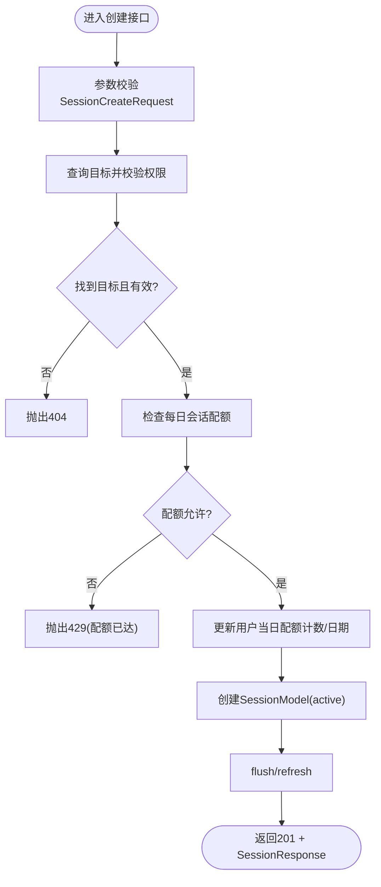
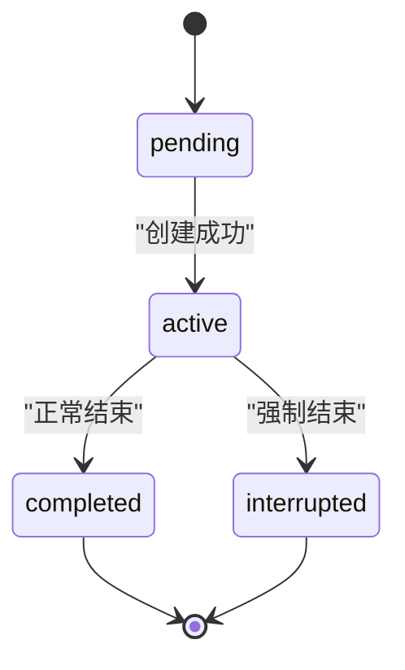
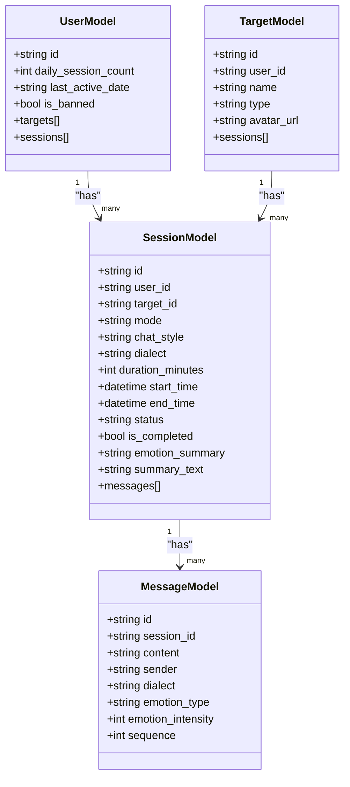
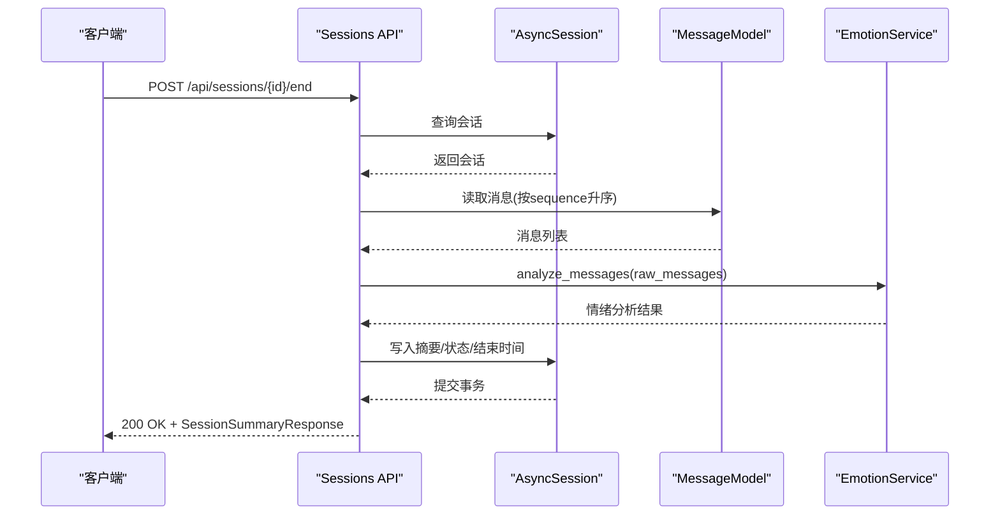
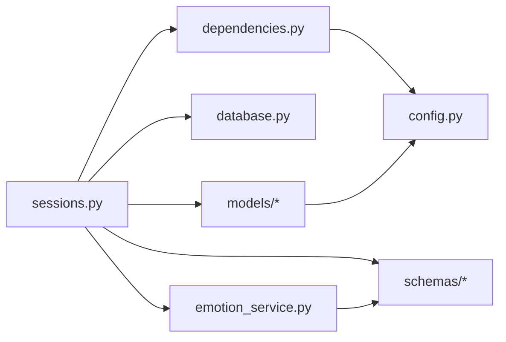

# 会话创建与生命周期

<cite>
**本文引用的文件列表**
- [sessions.py](file://emo_outlet_api/app/api/sessions.py)
- [session.py](file://emo_outlet_api/app/models/session.py)
- [session.py](file://emo_outlet_api/app/schemas/session.py)
- [emotion_service.py](file://emo_outlet_api/app/services/emotion_service.py)
- [database.py](file://emo_outlet_api/app/database.py)
- [dependencies.py](file://emo_outlet_api/app/core/dependencies.py)
- [user.py](file://emo_outlet_api/app/models/user.py)
- [target.py](file://emo_outlet_api/app/models/target.py)
- [message.py](file://emo_outlet_api/app/models/message.py)
- [message.py](file://emo_outlet_api/app/schemas/message.py)
- [config.py](file://emo_outlet_api/app/config.py)
- [poster.py](file://emo_outlet_api/app/schemas/poster.py)
- [main.py](file://emo_outlet_api/app/main.py)
- [error_handler.py](file://emo_outlet_api/app/core/error_handler.py)
</cite>

## 目录
1. [简介](#简介)
2. [项目结构](#项目结构)
3. [核心组件](#核心组件)
4. [架构总览](#架构总览)
5. [详细组件分析](#详细组件分析)
6. [依赖关系分析](#依赖关系分析)
7. [性能考量](#性能考量)
8. [故障排查指南](#故障排查指南)
9. [结论](#结论)
10. [附录](#附录)

## 简介
本文件围绕“会话创建与生命周期管理”功能，系统性梳理后端实现，覆盖以下关键主题：
- 会话创建流程：参数校验、目标权限检查、每日会话限制验证、用户配额更新机制
- 会话状态管理：active、completed、interrupted 等状态转换规则与业务逻辑
- 会话初始化：目标绑定、模式配置（单向/双向）、方言设置与时长参数处理
- 会话持久化：数据库事务处理、关系映射与数据一致性保障
- 会话超时与异常处理：连接中断、系统故障、用户主动终止的处理流程
- 完整生命周期 API 文档：创建、查询、状态更新与清理机制

## 项目结构
后端采用 FastAPI + SQLAlchemy Async 架构，会话模块位于 API 层，模型与序列化位于 models 与 schemas，服务层包含情绪分析服务，依赖注入与安全由 core 层提供，数据库连接与事务由 database 层封装。

图表来源
- [sessions.py:1-220](file://emo_outlet_api/app/api/sessions.py#L1-L220)
- [session.py:1-79](file://emo_outlet_api/app/models/session.py#L1-L79)
- [user.py:1-52](file://emo_outlet_api/app/models/user.py#L1-L52)
- [target.py:1-56](file://emo_outlet_api/app/models/target.py#L1-L56)
- [message.py:1-46](file://emo_outlet_api/app/models/message.py#L1-L46)
- [session.py:1-49](file://emo_outlet_api/app/schemas/session.py#L1-L49)
- [message.py:1-33](file://emo_outlet_api/app/schemas/message.py#L1-L33)
- [poster.py:1-71](file://emo_outlet_api/app/schemas/poster.py#L1-L71)
- [emotion_service.py:1-181](file://emo_outlet_api/app/services/emotion_service.py#L1-L181)
- [database.py:1-43](file://emo_outlet_api/app/database.py#L1-L43)
- [dependencies.py:1-67](file://emo_outlet_api/app/core/dependencies.py#L1-L67)
- [config.py:1-125](file://emo_outlet_api/app/config.py#L1-L125)
- [error_handler.py:1-59](file://emo_outlet_api/app/core/error_handler.py#L1-L59)
- [main.py:1-82](file://emo_outlet_api/app/main.py#L1-L82)

章节来源
- [main.py:1-82](file://emo_outlet_api/app/main.py#L1-L82)
- [database.py:1-43](file://emo_outlet_api/app/database.py#L1-L43)

## 核心组件
- 会话 API 控制器：负责接收请求、执行权限与配额校验、创建/查询/结束会话，并调用情绪分析服务生成摘要。
- 会话模型：定义会话字段、状态枚举、时间戳、外键关系及默认值。
- 会话序列化：定义创建请求、响应体、结束请求与摘要响应的数据结构。
- 用户与目标模型：提供权限校验与配额统计的基础。
- 消息模型：承载会话中的消息记录，用于情绪分析输入。
- 情绪分析服务：对用户消息进行统计、评分、关键词提取与摘要生成。
- 数据库与依赖注入：提供异步会话、事务提交/回滚、每日配额重置与当前用户解析。

章节来源
- [sessions.py:50-220](file://emo_outlet_api/app/api/sessions.py#L50-L220)
- [session.py:13-79](file://emo_outlet_api/app/models/session.py#L13-L79)
- [session.py:8-49](file://emo_outlet_api/app/schemas/session.py#L8-L49)
- [user.py:12-52](file://emo_outlet_api/app/models/user.py#L12-L52)
- [target.py:13-56](file://emo_outlet_api/app/models/target.py#L13-L56)
- [message.py:13-46](file://emo_outlet_api/app/models/message.py#L13-L46)
- [emotion_service.py:44-181](file://emo_outlet_api/app/services/emotion_service.py#L44-L181)
- [database.py:22-43](file://emo_outlet_api/app/database.py#L22-L43)
- [dependencies.py:18-67](file://emo_outlet_api/app/core/dependencies.py#L18-L67)

## 架构总览
会话生命周期贯穿“创建—进行中—完成/中断—持久化—摘要生成”的完整链路，涉及 FastAPI 路由、SQLAlchemy ORM、异步数据库事务、Pydantic 序列化与情绪分析服务。

图表来源
- [sessions.py:50-220](file://emo_outlet_api/app/api/sessions.py#L50-L220)
- [emotion_service.py:44-71](file://emo_outlet_api/app/services/emotion_service.py#L44-L71)
- [message.py:13-46](file://emo_outlet_api/app/models/message.py#L13-L46)

## 详细组件分析

### 会话创建流程
- 参数验证：使用 Pydantic 请求模型对目标、模式、风格、方言与时长进行约束。
- 目标权限检查：通过外键与用户ID联合查询，确保目标属于当前用户且未删除。
- 每日会话限制验证：依赖注入函数按年龄分组与访客身份计算限额，若超过则拒绝。
- 用户配额更新：当日首次访问自动重置配额计数；每次成功创建会话递增计数并更新日期。
- 会话初始化：设置初始状态为“进行中”，记录起始时间，持久化后返回响应。

图表来源
- [sessions.py:50-99](file://emo_outlet_api/app/api/sessions.py#L50-L99)
- [dependencies.py:53-67](file://emo_outlet_api/app/core/dependencies.py#L53-L67)
- [user.py:25-26](file://emo_outlet_api/app/models/user.py#L25-L26)

章节来源
- [sessions.py:50-99](file://emo_outlet_api/app/api/sessions.py#L50-L99)
- [session.py:8-14](file://emo_outlet_api/app/schemas/session.py#L8-L14)
- [dependencies.py:53-67](file://emo_outlet_api/app/core/dependencies.py#L53-L67)
- [user.py:25-26](file://emo_outlet_api/app/models/user.py#L25-L26)

### 会话状态管理
- 状态枚举：pending、active、completed、interrupted。
- 转换规则：
  - 创建后：pending → active（在创建逻辑中直接设为 active）
  - 结束时：completed 或 interrupted（取决于是否强制结束）
  - 查询过滤：活跃会话仅返回 status=active 的记录
- 业务逻辑：
  - completed 表示正常结束，is_completed=true
  - interrupted 表示强制中断，is_completed=true
  - 结束时写入结束时间与摘要文本

图表来源
- [session.py:50-55](file://emo_outlet_api/app/models/session.py#L50-L55)
- [sessions.py:175-177](file://emo_outlet_api/app/api/sessions.py#L175-L177)

章节来源
- [session.py:50-55](file://emo_outlet_api/app/models/session.py#L50-L55)
- [sessions.py:175-177](file://emo_outlet_api/app/api/sessions.py#L175-L177)

### 会话初始化细节
- 目标绑定：通过 target_id 与 user_id 双条件查询，确保归属正确。
- 模式配置：mode 支持 single/dual，默认 single；chat_style 默认 apologetic；dialect 默认 mandarin。
- 时长参数：duration_minutes 默认 3 分钟，范围 1-10。
- 时间戳：start_time 在创建时写入 UTC 时间；end_time 在结束时写入。

章节来源
- [sessions.py:85-94](file://emo_outlet_api/app/api/sessions.py#L85-L94)
- [session.py:26-48](file://emo_outlet_api/app/models/session.py#L26-L48)
- [session.py:8-14](file://emo_outlet_api/app/schemas/session.py#L8-L14)

### 会话持久化与一致性
- 事务处理：数据库连接工厂在 yield 前后自动 commit/rollback，异常时回滚并重新抛出。
- 关系映射：SessionModel 与 UserModel、TargetModel、MessageModel 建立一对多关系，支持懒加载。
- 刷新策略：创建后 flush/refresh 确保返回的会话包含最新状态与关联信息。
- 数据一致性：
  - 用户配额更新与会话创建在同一事务内，避免并发导致的配额不一致
  - 结束会话时，消息读取与摘要写入在同一事务内，保证最终一致性

图表来源
- [user.py:12-52](file://emo_outlet_api/app/models/user.py#L12-L52)
- [target.py:13-56](file://emo_outlet_api/app/models/target.py#L13-L56)
- [session.py:13-79](file://emo_outlet_api/app/models/session.py#L13-L79)
- [message.py:13-46](file://emo_outlet_api/app/models/message.py#L13-L46)

章节来源
- [database.py:22-43](file://emo_outlet_api/app/database.py#L22-L43)
- [session.py:73-75](file://emo_outlet_api/app/models/session.py#L73-L75)

### 会话结束与摘要生成
- 结束请求：支持 force 字段决定是否强制中断。
- 消息读取：按 sequence 升序读取当前会话的所有消息，作为情绪分析输入。
- 情绪分析：调用 EmotionService，产出主情绪、分布、强度、关键词、摘要与建议。
- 摘要持久化：将 JSON 结果写入 emotion_summary，同时生成 summary_text。
- 响应结构：包含会话信息、消息列表与情绪分析结果。

图表来源
- [sessions.py:156-220](file://emo_outlet_api/app/api/sessions.py#L156-L220)
- [emotion_service.py:44-71](file://emo_outlet_api/app/services/emotion_service.py#L44-L71)
- [message.py:19-36](file://emo_outlet_api/app/models/message.py#L19-L36)

章节来源
- [sessions.py:156-220](file://emo_outlet_api/app/api/sessions.py#L156-L220)
- [emotion_service.py:44-181](file://emo_outlet_api/app/services/emotion_service.py#L44-L181)

### 会话查询与活跃会话
- 列表查询：返回当前用户已完成的会话，按创建时间倒序分页。
- 活跃查询：返回当前用户唯一的 active 会话，不存在则返回空。
- 单条查询：根据会话ID与用户ID查询，不存在返回404。

章节来源
- [sessions.py:102-154](file://emo_outlet_api/app/api/sessions.py#L102-L154)

## 依赖关系分析
- 会话 API 依赖：
  - 当前用户解析：从 Authorization 头解析 JWT，校验用户存在与未封禁
  - 每日配额检查：按年龄与访客身份计算限额
  - 数据库：异步会话、事务提交/回滚
  - 情绪分析：异步分析消息并生成摘要
- 模型间依赖：
  - SessionModel 依赖 User、Target、Message 的外键关系
  - User 与 Target 维护会话与目标的反向关系
- 配置依赖：
  - 各年龄段每日最大会话数、最大会话时长、敏感词长度等

图表来源
- [sessions.py:1-26](file://emo_outlet_api/app/api/sessions.py#L1-L26)
- [dependencies.py:1-67](file://emo_outlet_api/app/core/dependencies.py#L1-L67)
- [database.py:1-43](file://emo_outlet_api/app/database.py#L1-L43)
- [config.py:97-107](file://emo_outlet_api/app/config.py#L97-L107)

章节来源
- [sessions.py:1-26](file://emo_outlet_api/app/api/sessions.py#L1-L26)
- [dependencies.py:1-67](file://emo_outlet_api/app/core/dependencies.py#L1-L67)
- [config.py:97-107](file://emo_outlet_api/app/config.py#L97-L107)

## 性能考量
- 异步数据库：使用 SQLAlchemy AsyncSession，减少阻塞，提升高并发下的吞吐。
- 关联加载：通过 relationship 的 lazy="selectin" 减少 N+1 查询风险。
- 事务粒度：创建与结束均在单事务内完成，避免部分提交导致的状态不一致。
- 情绪分析：异步调用，避免阻塞请求线程；对空消息快速返回默认结果。
- 缓存与限流：可在网关或服务层引入 Redis 缓存与限流策略以进一步优化。

## 故障排查指南
- 401 未认证：检查 Authorization 头是否携带有效 JWT。
- 403 封禁：用户被封禁，需联系管理员或解除封禁。
- 404 目标/会话不存在：确认 target_id 或 session_id 是否正确，以及是否属于当前用户。
- 429 配额已达：检查用户年龄分组与访客身份对应的每日限额。
- 400 会话已结束：结束接口不允许重复结束同一会话。
- 500 服务器内部错误：查看全局异常处理器输出的统一错误格式。

章节来源
- [dependencies.py:22-43](file://emo_outlet_api/app/core/dependencies.py#L22-L43)
- [sessions.py:64-78](file://emo_outlet_api/app/api/sessions.py#L64-L78)
- [sessions.py:151-173](file://emo_outlet_api/app/api/sessions.py#L151-L173)
- [error_handler.py:10-59](file://emo_outlet_api/app/core/error_handler.py#L10-L59)

## 结论
会话模块通过清晰的职责划分与严格的约束设计，实现了从创建到结束的完整生命周期管理。配合异步数据库与事务保障，确保了高并发场景下的稳定性与一致性；通过情绪分析服务，为用户提供会话后的洞察与建议。建议后续在网关层增加限流与缓存策略，并完善会话超时与心跳检测机制以增强健壮性。

## 附录

### 会话生命周期管理 API 文档

- 创建会话
  - 方法与路径：POST /api/sessions
  - 请求体：SessionCreateRequest
    - target_id: 目标ID
    - mode: 模式，single 或 dual，默认 single
    - chat_style: 对话风格，默认 apologetic
    - dialect: 方言，默认 mandarin
    - duration_minutes: 时长(分钟)，默认 3，范围 1-10
  - 成功响应：201 Created + SessionResponse
  - 错误：
    - 404：目标不存在
    - 429：当日会话配额已达
    - 401/403：未认证或封禁

- 查询活跃会话
  - 方法与路径：GET /api/sessions/active
  - 成功响应：200 OK + SessionResponse 或 null

- 查询历史会话（分页）
  - 方法与路径：GET /api/sessions?page&page_size
  - 查询参数：page 默认 1，page_size 默认 20
  - 成功响应：200 OK + SessionResponse 数组

- 查询单个会话
  - 方法与路径：GET /api/sessions/{session_id}
  - 成功响应：200 OK + SessionResponse
  - 错误：404 会话不存在

- 结束会话
  - 方法与路径：POST /api/sessions/{session_id}/end
  - 请求体：SessionEndRequest
    - force: 是否强制中断，默认 false
  - 成功响应：200 OK + SessionSummaryResponse
  - 错误：
    - 404：会话不存在
    - 400：会话已结束

章节来源
- [sessions.py:50-220](file://emo_outlet_api/app/api/sessions.py#L50-L220)
- [session.py:8-49](file://emo_outlet_api/app/schemas/session.py#L8-L49)