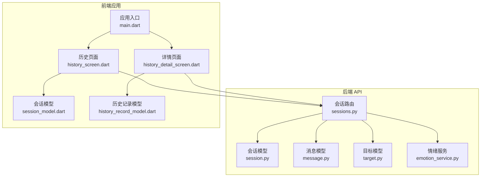
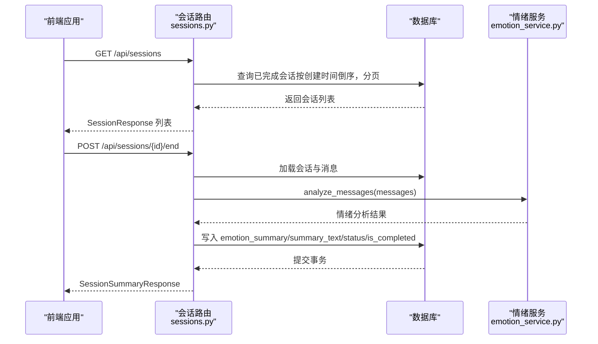
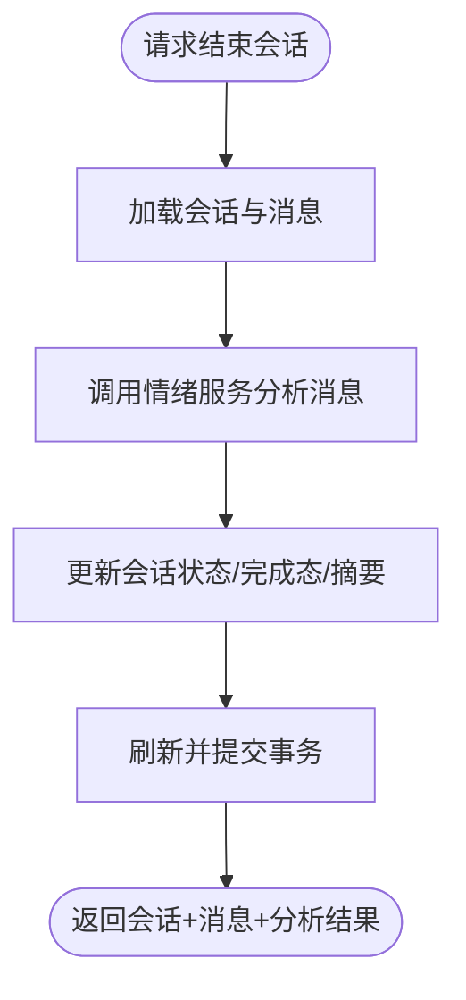
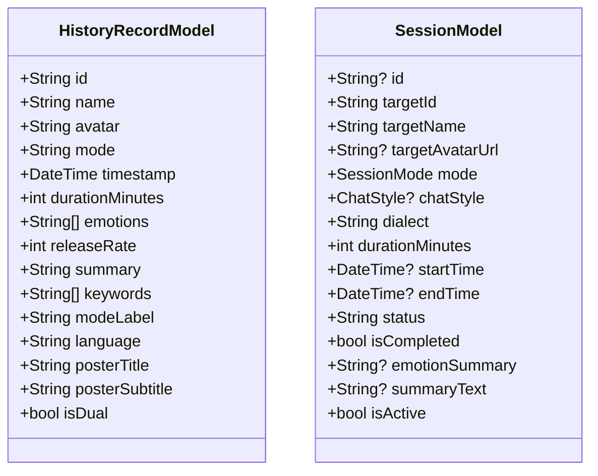
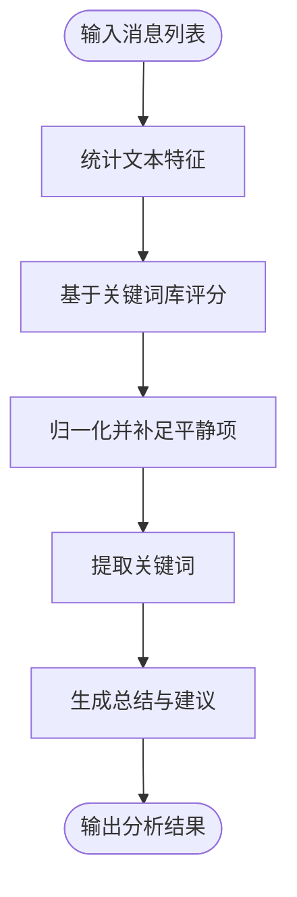
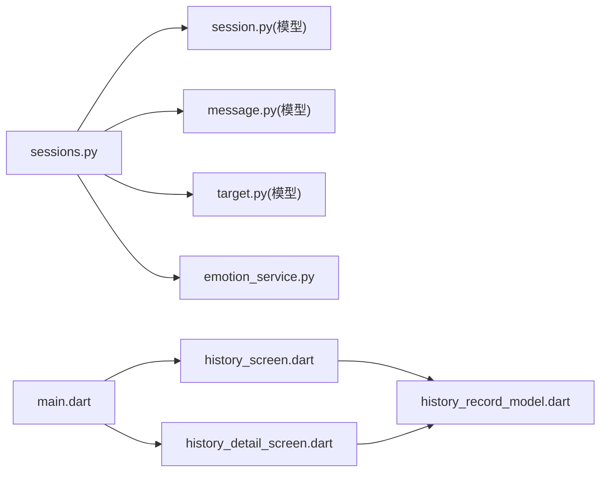

# 会话历史管理

<cite>
**本文引用的文件**
- [sessions.py](file://emo_outlet_api/app/api/sessions.py)
- [session.py](file://emo_outlet_api/app/models/session.py)
- [session.py](file://emo_outlet_api/app/schemas/session.py)
- [emotion_service.py](file://emo_outlet_api/app/services/emotion_service.py)
- [message.py](file://emo_outlet_api/app/models/message.py)
- [message.py](file://emo_outlet_api/app/schemas/message.py)
- [target.py](file://emo_outlet_api/app/models/target.py)
- [history_screen.dart](file://emo_outlet_app/lib/screens/history_screen.dart)
- [history_detail_screen.dart](file://emo_outlet_app/lib/screens/history_detail_screen.dart)
- [session_model.dart](file://emo_outlet_app/lib/models/session_model.dart)
- [history_record_model.dart](file://emo_outlet_app/lib/models/history_record_model.dart)
- [main.dart](file://emo_outlet_app/lib/main.dart)
</cite>

## 目录
1. [简介](#简介)
2. [项目结构](#项目结构)
3. [核心组件](#核心组件)
4. [架构总览](#架构总览)
5. [详细组件分析](#详细组件分析)
6. [依赖分析](#依赖分析)
7. [性能考虑](#性能考虑)
8. [故障排查指南](#故障排查指南)
9. [结论](#结论)
10. [附录](#附录)

## 简介
本文件围绕“会话历史管理”功能，系统化梳理后端 API 的会话列表查询、状态跟踪与统计聚合，以及前端历史页面的筛选、排序与详情展示。重点覆盖以下方面：
- 后端会话列表分页查询、排序规则与完成态筛选
- 会话状态跟踪（完成态标识、统计指标与聚合）
- 会话详情渲染、关联数据加载与多媒体内容处理
- 历史记录搜索与过滤（时间范围、目标类型、情感状态等）
- 统计分析（使用频率、情感趋势、行为洞察）
- 导出与分享（数据格式转换、报告生成、外部分享）
- 完整 API 文档与前端展示组件实现指南

## 项目结构
本项目采用前后端分离架构：
- 后端基于 FastAPI，提供会话生命周期管理、消息与目标关联、情绪分析服务
- 前端基于 Flutter，提供历史记录列表、筛选排序、详情页与海报生成等 UI 能力

图表来源
- [sessions.py:102-120](file://emo_outlet_api/app/api/sessions.py#L102-L120)
- [session.py:13-79](file://emo_outlet_api/app/models/session.py#L13-L79)
- [message.py:13-46](file://emo_outlet_api/app/models/message.py#L13-L46)
- [target.py:13-56](file://emo_outlet_api/app/models/target.py#L13-L56)
- [emotion_service.py:44-71](file://emo_outlet_api/app/services/emotion_service.py#L44-L71)
- [history_screen.dart:103-134](file://emo_outlet_app/lib/screens/history_screen.dart#L103-L134)
- [history_detail_screen.dart:1-50](file://emo_outlet_app/lib/screens/history_detail_screen.dart#L1-L50)
- [session_model.dart:5-36](file://emo_outlet_app/lib/models/session_model.dart#L5-L36)
- [history_record_model.dart:1-36](file://emo_outlet_app/lib/models/history_record_model.dart#L1-L36)
- [main.dart:13-96](file://emo_outlet_app/lib/main.dart#L13-L96)

章节来源
- [sessions.py:102-120](file://emo_outlet_api/app/api/sessions.py#L102-L120)
- [session.py:13-79](file://emo_outlet_api/app/models/session.py#L13-L79)
- [message.py:13-46](file://emo_outlet_api/app/models/message.py#L13-L46)
- [target.py:13-56](file://emo_outlet_api/app/models/target.py#L13-L56)
- [emotion_service.py:44-71](file://emo_outlet_api/app/services/emotion_service.py#L44-L71)
- [history_screen.dart:103-134](file://emo_outlet_app/lib/screens/history_screen.dart#L103-L134)
- [history_detail_screen.dart:1-50](file://emo_outlet_app/lib/screens/history_detail_screen.dart#L1-L50)
- [session_model.dart:5-36](file://emo_outlet_app/lib/models/session_model.dart#L5-L36)
- [history_record_model.dart:1-36](file://emo_outlet_app/lib/models/history_record_model.dart#L1-L36)
- [main.dart:13-96](file://emo_outlet_app/lib/main.dart#L13-L96)

## 核心组件
- 后端会话 API：提供创建、列表、当前活动会话查询、详情查询与结束会话接口；结束会话时执行情绪分析并生成摘要
- 会话模型：定义会话字段、状态枚举、时间控制、完成态标记与情绪摘要存储
- 消息模型：承载每条消息的内容、发送方、方言、情绪类型与强度等
- 目标模型：关联会话与目标对象，支持名称、类型、外貌、个性、关系与头像等属性
- 情绪服务：对用户消息进行统计与评分，输出主要情绪、强度、关键词、总结与建议
- 前端历史页面：提供时间范围、模式、情感标签筛选与排序；支持搜索与删除
- 前端详情页面：展示情绪概览、关键词、安抚总结、海报预览与操作入口

章节来源
- [sessions.py:102-220](file://emo_outlet_api/app/api/sessions.py#L102-L220)
- [session.py:13-79](file://emo_outlet_api/app/models/session.py#L13-L79)
- [message.py:13-46](file://emo_outlet_api/app/models/message.py#L13-L46)
- [target.py:13-56](file://emo_outlet_api/app/models/target.py#L13-L56)
- [emotion_service.py:44-181](file://emo_outlet_api/app/services/emotion_service.py#L44-L181)
- [history_screen.dart:103-134](file://emo_outlet_app/lib/screens/history_screen.dart#L103-L134)
- [history_detail_screen.dart:107-194](file://emo_outlet_app/lib/screens/history_detail_screen.dart#L107-L194)

## 架构总览
后端通过 FastAPI 路由暴露会话能力，ORM 映射至数据库表；结束会话时调用情绪服务进行分析，并将结果持久化到会话记录中。前端通过路由与 Provider 管理状态，渲染历史列表与详情页。

图表来源
- [sessions.py:102-120](file://emo_outlet_api/app/api/sessions.py#L102-L120)
- [sessions.py:156-220](file://emo_outlet_api/app/api/sessions.py#L156-L220)
- [emotion_service.py:44-71](file://emo_outlet_api/app/services/emotion_service.py#L44-L71)

## 详细组件分析

### 后端会话 API 与数据模型
- 列表查询
  - 过滤条件：仅返回当前用户且已完成的会话
  - 排序规则：按创建时间降序
  - 分页参数：page、page_size（默认 20）
- 结束会话
  - 校验会话存在性与未完成状态
  - 更新状态为“completed”或“interrupted”，设置结束时间
  - 加载消息序列并调用情绪服务，生成 JSON 摘要与总结文案
  - 返回会话、消息列表与情绪分析结果

图表来源
- [sessions.py:156-220](file://emo_outlet_api/app/api/sessions.py#L156-L220)
- [emotion_service.py:44-71](file://emo_outlet_api/app/services/emotion_service.py#L44-L71)

章节来源
- [sessions.py:102-120](file://emo_outlet_api/app/api/sessions.py#L102-L120)
- [sessions.py:156-220](file://emo_outlet_api/app/api/sessions.py#L156-L220)
- [session.py:13-79](file://emo_outlet_api/app/models/session.py#L13-L79)
- [message.py:13-46](file://emo_outlet_api/app/models/message.py#L13-L46)
- [emotion_service.py:44-181](file://emo_outlet_api/app/services/emotion_service.py#L44-L181)

### 前端历史页面与详情页面
- 历史页面
  - 筛选维度：时间范围（全部/本周/本月）、模式（单向/双向）、情感标签、关键词搜索
  - 排序方式：最近优先、时长优先
  - 支持长按删除与底部筛选面板
- 详情页面
  - 展示目标头像、模式、时长、语言、日期等元信息
  - 情绪概览（柱状图）与释放度（圆形进度）
  - 关键词标签、安抚总结、海报预览与操作入口

图表来源
- [history_record_model.dart:1-36](file://emo_outlet_app/lib/models/history_record_model.dart#L1-L36)
- [session_model.dart:5-36](file://emo_outlet_app/lib/models/session_model.dart#L5-L36)

章节来源
- [history_screen.dart:103-134](file://emo_outlet_app/lib/screens/history_screen.dart#L103-L134)
- [history_detail_screen.dart:107-194](file://emo_outlet_app/lib/screens/history_detail_screen.dart#L107-L194)
- [history_record_model.dart:1-36](file://emo_outlet_app/lib/models/history_record_model.dart#L1-L36)
- [session_model.dart:5-36](file://emo_outlet_app/lib/models/session_model.dart#L5-L36)

### 情绪分析服务
- 输入：用户消息列表（内容、发送方、情绪类型、强度）
- 处理：统计字符数、感叹号/问号数量、重复字符；基于关键词库打分并归一化
- 输出：主要情绪、情绪分布、强度、关键词、总结文案、建议

图表来源
- [emotion_service.py:44-181](file://emo_outlet_api/app/services/emotion_service.py#L44-L181)

章节来源
- [emotion_service.py:44-181](file://emo_outlet_api/app/services/emotion_service.py#L44-L181)

## 依赖分析
- 后端模块耦合
  - 会话路由依赖会话模型、消息模型、目标模型与情绪服务
  - 模型间通过外键建立一对多关系（目标-会话、会话-消息）
- 前端模块耦合
  - 历史页面依赖历史记录模型与筛选逻辑
  - 详情页面依赖历史记录模型与 UI 组件
  - 应用入口统一注入 Provider 与主题配置

图表来源
- [sessions.py:102-220](file://emo_outlet_api/app/api/sessions.py#L102-L220)
- [session.py:13-79](file://emo_outlet_api/app/models/session.py#L13-L79)
- [message.py:13-46](file://emo_outlet_api/app/models/message.py#L13-L46)
- [target.py:13-56](file://emo_outlet_api/app/models/target.py#L13-L56)
- [emotion_service.py:44-181](file://emo_outlet_api/app/services/emotion_service.py#L44-L181)
- [history_screen.dart:103-134](file://emo_outlet_app/lib/screens/history_screen.dart#L103-L134)
- [history_detail_screen.dart:107-194](file://emo_outlet_app/lib/screens/history_detail_screen.dart#L107-L194)
- [history_record_model.dart:1-36](file://emo_outlet_app/lib/models/history_record_model.dart#L1-L36)
- [main.dart:13-96](file://emo_outlet_app/lib/main.dart#L13-L96)

章节来源
- [sessions.py:102-220](file://emo_outlet_api/app/api/sessions.py#L102-L220)
- [session.py:13-79](file://emo_outlet_api/app/models/session.py#L13-L79)
- [message.py:13-46](file://emo_outlet_api/app/models/message.py#L13-L46)
- [target.py:13-56](file://emo_outlet_api/app/models/target.py#L13-L56)
- [emotion_service.py:44-181](file://emo_outlet_api/app/services/emotion_service.py#L44-L181)
- [history_screen.dart:103-134](file://emo_outlet_app/lib/screens/history_screen.dart#L103-L134)
- [history_detail_screen.dart:107-194](file://emo_outlet_app/lib/screens/history_detail_screen.dart#L107-L194)
- [history_record_model.dart:1-36](file://emo_outlet_app/lib/models/history_record_model.dart#L1-L36)
- [main.dart:13-96](file://emo_outlet_app/lib/main.dart#L13-L96)

## 性能考虑
- 数据库访问
  - 列表查询已按用户与完成态过滤并按创建时间倒序，建议在用户与完成态字段上建立索引以提升分页性能
  - 分页使用 offset/limit，大数据量下可考虑基于游标的分页策略
- 情绪分析
  - 分析过程为内存计算，建议对消息列表长度与关键词匹配复杂度进行评估；必要时可异步化或缓存热点会话的分析结果
- 前端渲染
  - 历史页面的筛选与排序在内存中进行，建议对数据源进行分页或懒加载优化

## 故障排查指南
- 会话列表为空
  - 确认当前用户是否存在已完成会话；检查 is_completed 字段与 created_at 排序
- 结束会话失败
  - 检查会话是否存在且未完成；确认消息表中存在对应记录
- 情绪分析结果异常
  - 检查消息内容是否为空或仅包含空格；确认关键词库与停用词集合配置正确
- 前端筛选无效
  - 确认筛选参数传递正确；检查时间范围与情感标签映射逻辑

章节来源
- [sessions.py:102-120](file://emo_outlet_api/app/api/sessions.py#L102-L120)
- [sessions.py:156-220](file://emo_outlet_api/app/api/sessions.py#L156-L220)
- [emotion_service.py:44-181](file://emo_outlet_api/app/services/emotion_service.py#L44-L181)
- [history_screen.dart:103-134](file://emo_outlet_app/lib/screens/history_screen.dart#L103-L134)

## 结论
本功能通过后端的会话生命周期管理与情绪分析服务，结合前端的历史与详情页面，实现了从“查询—分析—展示—交互”的完整闭环。后续可在数据库索引、分页策略与分析服务异步化等方面进一步优化性能与用户体验。

## 附录

### API 文档（后端）

- 获取会话列表
  - 方法：GET
  - 路径：/api/sessions
  - 查询参数：
    - page: int，默认 1
    - page_size: int，默认 20
  - 认证：需要登录
  - 响应：SessionResponse 数组（按创建时间倒序，仅返回已完成会话）

- 获取当前活动会话
  - 方法：GET
  - 路径：/api/sessions/active
  - 认证：需要登录
  - 响应：SessionResponse 或 null

- 获取指定会话详情
  - 方法：GET
  - 路径：/api/sessions/{session_id}
  - 认证：需要登录
  - 响应：SessionResponse

- 结束会话并生成摘要
  - 方法：POST
  - 路径：/api/sessions/{session_id}/end
  - 请求体：SessionEndRequest（force: bool，默认 false）
  - 认证：需要登录
  - 响应：SessionSummaryResponse（包含会话、消息列表与情绪分析结果）

章节来源
- [sessions.py:102-120](file://emo_outlet_api/app/api/sessions.py#L102-L120)
- [sessions.py:123-135](file://emo_outlet_api/app/api/sessions.py#L123-L135)
- [sessions.py:138-154](file://emo_outlet_api/app/api/sessions.py#L138-L154)
- [sessions.py:156-220](file://emo_outlet_api/app/api/sessions.py#L156-L220)
- [session.py:13-79](file://emo_outlet_api/app/models/session.py#L13-L79)
- [message.py:13-46](file://emo_outlet_api/app/models/message.py#L13-L46)
- [emotion_service.py:44-181](file://emo_outlet_api/app/services/emotion_service.py#L44-L181)

### 前端展示组件实现要点
- 历史页面
  - 使用状态管理维护筛选条件与排序方式
  - 在页面初始化或筛选变更时重新计算过滤与排序结果
  - 点击卡片跳转至详情页，长按触发删除对话框
- 详情页面
  - 渲染目标头像、模式、时长、语言、日期等信息
  - 展示情绪分布与释放度，渲染关键词与安抚总结
  - 提供海报预览与“再次释放”等操作入口

章节来源
- [history_screen.dart:103-134](file://emo_outlet_app/lib/screens/history_screen.dart#L103-L134)
- [history_detail_screen.dart:107-194](file://emo_outlet_app/lib/screens/history_detail_screen.dart#L107-L194)
- [main.dart:13-96](file://emo_outlet_app/lib/main.dart#L13-L96)