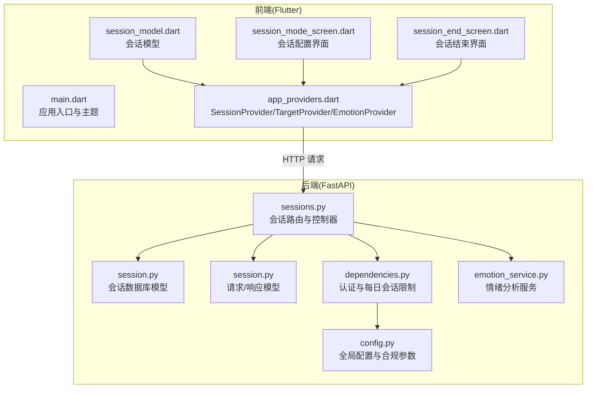
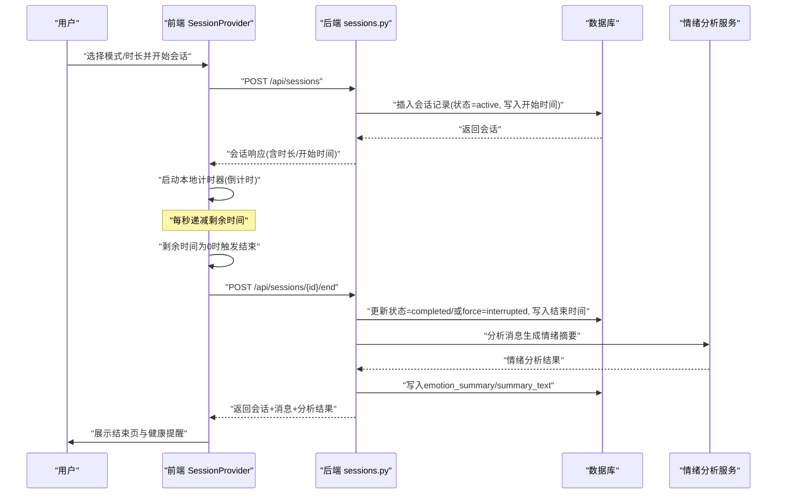
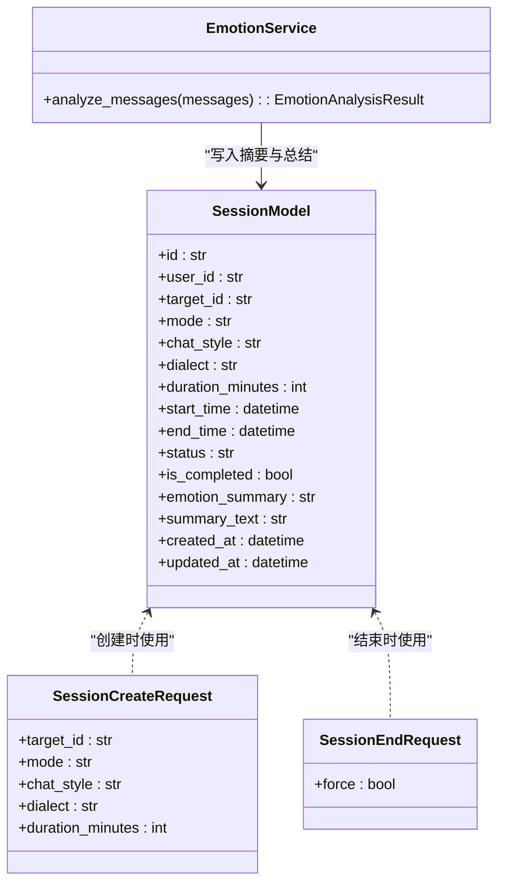
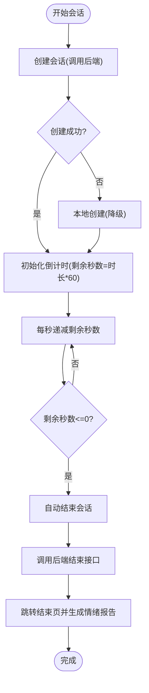
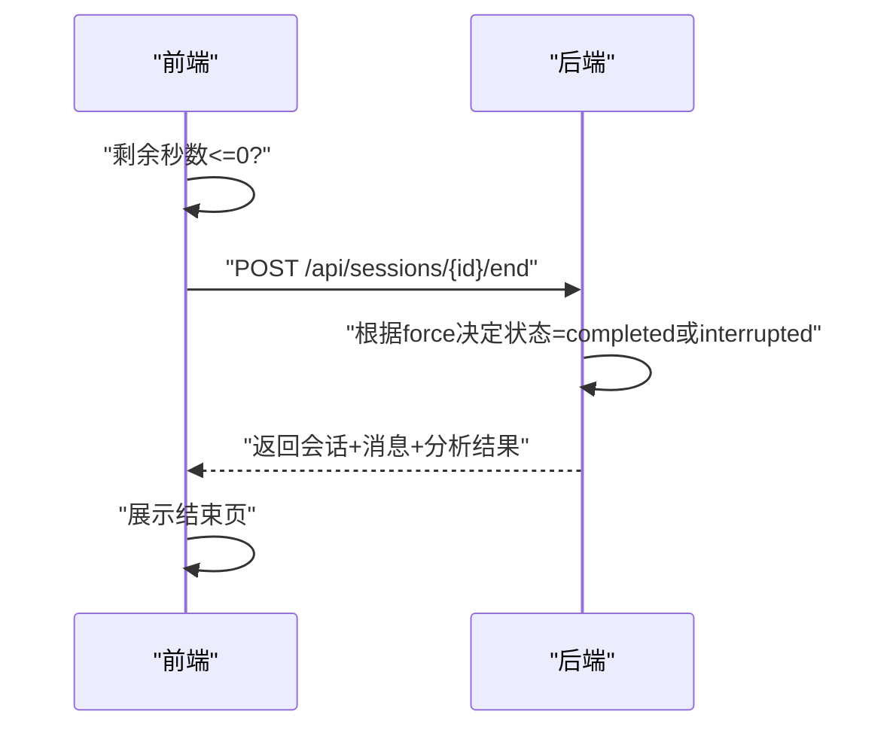
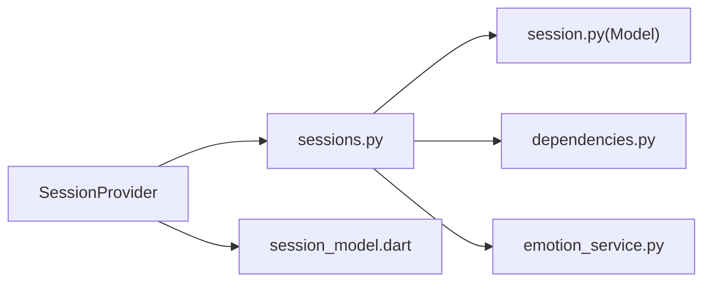

# 会话时间控制系统

<cite>
**本文引用的文件**
- [emo_outlet_api/app/models/session.py](file://emo_outlet_api/app/models/session.py)
- [emo_outlet_api/app/schemas/session.py](file://emo_outlet_api/app/schemas/session.py)
- [emo_outlet_api/app/api/sessions.py](file://emo_outlet_api/app/api/sessions.py)
- [emo_outlet_api/app/core/dependencies.py](file://emo_outlet_api/app/core/dependencies.py)
- [emo_outlet_api/app/config.py](file://emo_outlet_api/app/config.py)
- [emo_outlet_api/app/services/emotion_service.py](file://emo_outlet_api/app/services/emotion_service.py)
- [emo_outlet_app/lib/main.dart](file://emo_outlet_app/lib/main.dart)
- [emo_outlet_app/lib/providers/app_providers.dart](file://emo_outlet_app/lib/providers/app_providers.dart)
- [emo_outlet_app/lib/models/session_model.dart](file://emo_outlet_app/lib/models/session_model.dart)
- [emo_outlet_app/lib/screens/session_mode_screen.dart](file://emo_outlet_app/lib/screens/session_mode_screen.dart)
- [emo_outlet_app/lib/screens/session_end_screen.dart](file://emo_outlet_app/lib/screens/session_end_screen.dart)
</cite>

## 目录
1. [简介](#简介)
2. [项目结构](#项目结构)
3. [核心组件](#核心组件)
4. [架构总览](#架构总览)
5. [详细组件分析](#详细组件分析)
6. [依赖关系分析](#依赖关系分析)
7. [性能考虑](#性能考虑)
8. [故障排查指南](#故障排查指南)
9. [结论](#结论)
10. [附录](#附录)

## 简介
本技术文档围绕“会话时间控制系统”展开，系统通过前后端协同实现会话的定时控制与到期处理，包含以下能力：
- 定时器管理：会话开始计时、剩余时间计算、到期提醒
- 超时处理：自动结束、强制中断、用户确认流程
- 暂停/恢复：状态保存、时间片记录与恢复逻辑
- 时间配置：最小/最大时长限制、默认时长、用户自定义
- 业务规则：未成年人保护、使用时长限制、健康提醒
- 状态同步：客户端显示更新、服务器状态维护、数据一致性
- API 文档与前端集成示例

## 项目结构
系统由后端 API 与 Flutter 前端组成，核心交互围绕会话模型与会话服务展开。

图表来源
- [emo_outlet_app/lib/main.dart:1-97](file://emo_outlet_app/lib/main.dart#L1-L97)
- [emo_outlet_app/lib/providers/app_providers.dart:1-416](file://emo_outlet_app/lib/providers/app_providers.dart#L1-L416)
- [emo_outlet_app/lib/models/session_model.dart:1-151](file://emo_outlet_app/lib/models/session_model.dart#L1-L151)
- [emo_outlet_app/lib/screens/session_mode_screen.dart:1-427](file://emo_outlet_app/lib/screens/session_mode_screen.dart#L1-L427)
- [emo_outlet_app/lib/screens/session_end_screen.dart:1-81](file://emo_outlet_app/lib/screens/session_end_screen.dart#L1-L81)
- [emo_outlet_api/app/api/sessions.py:1-220](file://emo_outlet_api/app/api/sessions.py#L1-L220)
- [emo_outlet_api/app/models/session.py:1-79](file://emo_outlet_api/app/models/session.py#L1-L79)
- [emo_outlet_api/app/schemas/session.py:1-49](file://emo_outlet_api/app/schemas/session.py#L1-L49)
- [emo_outlet_api/app/core/dependencies.py:1-67](file://emo_outlet_api/app/core/dependencies.py#L1-L67)
- [emo_outlet_api/app/config.py:1-125](file://emo_outlet_api/app/config.py#L1-L125)
- [emo_outlet_api/app/services/emotion_service.py:1-181](file://emo_outlet_api/app/services/emotion_service.py#L1-L181)

章节来源
- [emo_outlet_app/lib/main.dart:1-97](file://emo_outlet_app/lib/main.dart#L1-L97)
- [emo_outlet_app/lib/providers/app_providers.dart:1-416](file://emo_outlet_app/lib/providers/app_providers.dart#L1-L416)
- [emo_outlet_api/app/api/sessions.py:1-220](file://emo_outlet_api/app/api/sessions.py#L1-L220)

## 核心组件
- 会话模型与状态
  - 后端模型包含时长、开始/结束时间、状态等字段，支持 pending/active/completed/interrupted 状态流转。
  - 前端模型提供格式化时间、状态判断、方言/风格解析等辅助。
- 会话服务
  - 后端提供创建、查询、结束会话接口；前端提供创建、计时、结束、历史加载等逻辑。
- 情绪分析服务
  - 会话结束后进行情绪分析，生成摘要与建议，供海报/报告使用。
- 认证与合规
  - 通过依赖注入校验用户身份与每日会话配额，支持不同年龄段限制。

章节来源
- [emo_outlet_api/app/models/session.py:13-79](file://emo_outlet_api/app/models/session.py#L13-L79)
- [emo_outlet_api/app/schemas/session.py:8-49](file://emo_outlet_api/app/schemas/session.py#L8-L49)
- [emo_outlet_api/app/api/sessions.py:50-220](file://emo_outlet_api/app/api/sessions.py#L50-L220)
- [emo_outlet_api/app/services/emotion_service.py:44-181](file://emo_outlet_api/app/services/emotion_service.py#L44-L181)
- [emo_outlet_api/app/core/dependencies.py:18-67](file://emo_outlet_api/app/core/dependencies.py#L18-L67)
- [emo_outlet_app/lib/models/session_model.dart:5-151](file://emo_outlet_app/lib/models/session_model.dart#L5-L151)
- [emo_outlet_app/lib/providers/app_providers.dart:134-328](file://emo_outlet_app/lib/providers/app_providers.dart#L134-L328)

## 架构总览
系统采用前后端分离架构，前端负责 UI 与本地状态管理，后端负责会话生命周期与合规控制。

图表来源
- [emo_outlet_api/app/api/sessions.py:50-220](file://emo_outlet_api/app/api/sessions.py#L50-L220)
- [emo_outlet_api/app/services/emotion_service.py:44-181](file://emo_outlet_api/app/services/emotion_service.py#L44-L181)
- [emo_outlet_app/lib/providers/app_providers.dart:176-328](file://emo_outlet_app/lib/providers/app_providers.dart#L176-L328)

## 详细组件分析

### 后端会话模型与路由
- 模型字段
  - 时长：duration_minutes，默认值与范围约束由请求模型定义
  - 时间：start_time/end_time 支持空值，便于未开始或已结束会话
  - 状态：pending/active/completed/interrupted，配合 is_completed 字段
- 路由能力
  - 创建会话：写入用户上下文、检查每日配额、初始化状态与开始时间
  - 查询活动会话：按用户与状态 active 查询
  - 结束会话：支持强制中断(force)，完成后写入结束时间与情绪摘要
- 情绪分析
  - 会话结束时读取消息并调用情绪分析服务，生成 JSON 摘要与总结文案

图表来源
- [emo_outlet_api/app/models/session.py:13-79](file://emo_outlet_api/app/models/session.py#L13-L79)
- [emo_outlet_api/app/schemas/session.py:8-49](file://emo_outlet_api/app/schemas/session.py#L8-L49)
- [emo_outlet_api/app/services/emotion_service.py:44-181](file://emo_outlet_api/app/services/emotion_service.py#L44-L181)

章节来源
- [emo_outlet_api/app/models/session.py:13-79](file://emo_outlet_api/app/models/session.py#L13-L79)
- [emo_outlet_api/app/schemas/session.py:8-49](file://emo_outlet_api/app/schemas/session.py#L8-L49)
- [emo_outlet_api/app/api/sessions.py:50-220](file://emo_outlet_api/app/api/sessions.py#L50-L220)
- [emo_outlet_api/app/services/emotion_service.py:44-181](file://emo_outlet_api/app/services/emotion_service.py#L44-L181)

### 前端会话管理与计时
- 会话创建
  - 从前端界面收集目标、模式、方言与时长，调用后端创建接口
  - 若后端不可用则降级为本地创建，同时初始化消息与倒计时
- 计时逻辑
  - 每秒 tick 递减剩余秒数，归零时自动结束会话
  - 提供 addTime 手动延长时间的能力
- 结束与展示
  - 结束时调用后端结束接口，随后进入结束页并触发情绪报告生成

图表来源
- [emo_outlet_app/lib/providers/app_providers.dart:176-328](file://emo_outlet_app/lib/providers/app_providers.dart#L176-L328)
- [emo_outlet_app/lib/screens/session_mode_screen.dart:162-182](file://emo_outlet_app/lib/screens/session_mode_screen.dart#L162-L182)
- [emo_outlet_app/lib/screens/session_end_screen.dart:52-72](file://emo_outlet_app/lib/screens/session_end_screen.dart#L52-L72)

章节来源
- [emo_outlet_app/lib/providers/app_providers.dart:134-328](file://emo_outlet_app/lib/providers/app_providers.dart#L134-L328)
- [emo_outlet_app/lib/models/session_model.dart:5-151](file://emo_outlet_app/lib/models/session_model.dart#L5-L151)
- [emo_outlet_app/lib/screens/session_mode_screen.dart:1-427](file://emo_outlet_app/lib/screens/session_mode_screen.dart#L1-L427)
- [emo_outlet_app/lib/screens/session_end_screen.dart:1-81](file://emo_outlet_app/lib/screens/session_end_screen.dart#L1-L81)

### 超时处理策略
- 自动结束
  - 前端计时归零自动调用后端结束接口，状态置为 completed
- 强制中断
  - 后端结束接口支持 force 参数，true 时状态置为 interrupted
- 用户确认流程
  - 结束页展示提示与按钮，引导用户查看情绪报告与健康提醒

图表来源
- [emo_outlet_api/app/api/sessions.py:156-220](file://emo_outlet_api/app/api/sessions.py#L156-L220)
- [emo_outlet_app/lib/providers/app_providers.dart:294-328](file://emo_outlet_app/lib/providers/app_providers.dart#L294-L328)
- [emo_outlet_app/lib/screens/session_end_screen.dart:52-72](file://emo_outlet_app/lib/screens/session_end_screen.dart#L52-L72)

章节来源
- [emo_outlet_api/app/api/sessions.py:156-220](file://emo_outlet_api/app/api/sessions.py#L156-L220)
- [emo_outlet_app/lib/providers/app_providers.dart:294-328](file://emo_outlet_app/lib/providers/app_providers.dart#L294-L328)

### 暂停/恢复功能实现
- 状态保存
  - 前端通过 SessionProvider 维护当前会话、消息、剩余秒数与运行状态
- 时间片记录
  - 通过 start_time/end_time 记录会话起止，结合 duration_minutes 实现时间片
- 恢复逻辑
  - 当前代码未实现“暂停/恢复”功能；可在现有基础上扩展：
    - 暂停时冻结剩余秒数与运行状态
    - 恢复时根据 start_time 与当前时间差计算剩余秒数
    - 与后端约定暂停/恢复接口，确保服务器侧状态一致

章节来源
- [emo_outlet_api/app/models/session.py:39-70](file://emo_outlet_api/app/models/session.py#L39-L70)
- [emo_outlet_app/lib/providers/app_providers.dart:134-328](file://emo_outlet_app/lib/providers/app_providers.dart#L134-L328)

### 时间配置参数
- 最小/最大时长限制
  - 请求模型对 duration_minutes 设定 ge=1、le=10
  - 全局配置中存在 MAX_SESSION_DURATION_MINUTES=10，可用于后端统一限制
- 默认时长设置
  - 后端模型默认 3 分钟；前端默认 5 分钟
- 用户自定义选项
  - 前端提供多档时长选择；后端接收用户传入的 duration_minutes

章节来源
- [emo_outlet_api/app/schemas/session.py:13](file://emo_outlet_api/app/schemas/session.py#L13)
- [emo_outlet_api/app/config.py:90](file://emo_outlet_api/app/config.py#L90)
- [emo_outlet_api/app/models/session.py:40-42](file://emo_outlet_api/app/models/session.py#L40-L42)
- [emo_outlet_app/lib/screens/session_mode_screen.dart:114-131](file://emo_outlet_app/lib/screens/session_mode_screen.dart#L114-L131)

### 业务规则
- 未成年人保护
  - 通过年龄区间 age_range 控制每日最大会话数
- 使用时长限制
  - 不同年龄段每日会话配额不同，超过即拒绝创建新会话
- 健康提醒机制
  - 结束页展示健康提醒文案与情绪分析摘要，引导用户关注心理健康

章节来源
- [emo_outlet_api/app/core/dependencies.py:53-67](file://emo_outlet_api/app/core/dependencies.py#L53-L67)
- [emo_outlet_api/app/config.py:97-107](file://emo_outlet_api/app/config.py#L97-L107)
- [emo_outlet_app/lib/screens/session_end_screen.dart:35-45](file://emo_outlet_app/lib/screens/session_end_screen.dart#L35-L45)

### 时间状态同步
- 客户端显示更新
  - 前端每秒刷新剩余时间，格式化显示
- 服务器状态维护
  - 后端在创建时写入开始时间，在结束时写入结束时间与状态
- 数据一致性保证
  - 通过后端统一的状态机与唯一会话标识，避免并发冲突
  - 建议：若引入暂停/恢复，需在服务器侧记录暂停点与累计时长，前端仅作为展示层

章节来源
- [emo_outlet_app/lib/providers/app_providers.dart:151-155](file://emo_outlet_app/lib/providers/app_providers.dart#L151-L155)
- [emo_outlet_api/app/api/sessions.py:85-99](file://emo_outlet_api/app/api/sessions.py#L85-L99)
- [emo_outlet_api/app/api/sessions.py:175-178](file://emo_outlet_api/app/api/sessions.py#L175-L178)

## 依赖关系分析
- 组件耦合
  - 前端 SessionProvider 依赖 ApiService 与后端路由
  - 后端 sessions.py 依赖模型、依赖注入与情绪分析服务
- 外部依赖
  - 数据库 ORM（SQLAlchemy）、异步数据库驱动（aiomysql）
  - Redis（配置项存在，当前未在会话模块使用）

图表来源
- [emo_outlet_app/lib/providers/app_providers.dart:134-328](file://emo_outlet_app/lib/providers/app_providers.dart#L134-L328)
- [emo_outlet_api/app/api/sessions.py:1-220](file://emo_outlet_api/app/api/sessions.py#L1-L220)
- [emo_outlet_api/app/models/session.py:1-79](file://emo_outlet_api/app/models/session.py#L1-L79)
- [emo_outlet_api/app/core/dependencies.py:1-67](file://emo_outlet_api/app/core/dependencies.py#L1-L67)
- [emo_outlet_api/app/services/emotion_service.py:1-181](file://emo_outlet_api/app/services/emotion_service.py#L1-L181)
- [emo_outlet_app/lib/models/session_model.dart:1-151](file://emo_outlet_app/lib/models/session_model.dart#L1-L151)

章节来源
- [emo_outlet_api/app/api/sessions.py:1-220](file://emo_outlet_api/app/api/sessions.py#L1-L220)
- [emo_outlet_app/lib/providers/app_providers.dart:134-328](file://emo_outlet_app/lib/providers/app_providers.dart#L134-L328)

## 性能考虑
- 前端
  - 计时器频率适中（每秒），避免频繁重绘；可结合帧率优化
  - 本地降级策略减少网络依赖，提升可用性
- 后端
  - 会话查询使用索引字段（user_id/status），避免全表扫描
  - 情绪分析为独立服务，避免阻塞主流程
- 存储
  - 会话时间字段为可空，便于历史会话展示；建议在查询活跃会话时增加状态过滤

## 故障排查指南
- 无法创建会话
  - 检查每日配额是否已达上限（不同年龄段限制不同）
  - 确认认证令牌有效且用户未被封禁
- 会话无法结束
  - 确认会话 ID 正确且属于当前用户
  - 若 force=true，状态应为 interrupted
- 前端计时不更新
  - 检查定时器是否仍在运行（isRunning）
  - 确认剩余秒数正确递减

章节来源
- [emo_outlet_api/app/core/dependencies.py:53-67](file://emo_outlet_api/app/core/dependencies.py#L53-L67)
- [emo_outlet_api/app/api/sessions.py:156-220](file://emo_outlet_api/app/api/sessions.py#L156-L220)
- [emo_outlet_app/lib/providers/app_providers.dart:278-286](file://emo_outlet_app/lib/providers/app_providers.dart#L278-L286)

## 结论
本系统通过前后端协作实现了完整的会话时间控制闭环：前端负责交互与本地计时，后端负责状态机与合规控制。当前版本已覆盖自动结束、强制中断与健康提醒等核心能力；若需进一步增强，可在现有基础上扩展暂停/恢复与服务器侧时间片记录，以满足更复杂的使用场景。

## 附录

### API 接口文档
- 创建会话
  - 方法与路径：POST /api/sessions
  - 请求体字段
    - target_id: 目标对象 ID
    - mode: single 或 dual
    - chat_style: 对话风格（可选）
    - dialect: 方言（可选）
    - duration_minutes: 时长（整数，1-10）
  - 成功响应：会话对象（包含 id、status=active、start_time 等）
- 查询活动会话
  - 方法与路径：GET /api/sessions/active
  - 成功响应：当前用户的活动会话对象或 null
- 结束会话
  - 方法与路径：POST /api/sessions/{session_id}/end
  - 请求体字段
    - force: 是否强制中断（布尔，默认 false）
  - 成功响应：会话+消息+情绪分析结果

章节来源
- [emo_outlet_api/app/api/sessions.py:50-220](file://emo_outlet_api/app/api/sessions.py#L50-L220)
- [emo_outlet_api/app/schemas/session.py:8-49](file://emo_outlet_api/app/schemas/session.py#L8-L49)

### 前端集成示例
- 开始会话
  - 在会话配置页选择模式、方言与时长，调用 SessionProvider.createSession
  - 进入聊天页后启动本地计时器
- 结束会话
  - 剩余秒数归零自动结束；也可手动结束并查看情绪报告
- 历史会话
  - 通过 SessionProvider.loadSessions 获取已完成会话列表

章节来源
- [emo_outlet_app/lib/screens/session_mode_screen.dart:162-182](file://emo_outlet_app/lib/screens/session_mode_screen.dart#L162-L182)
- [emo_outlet_app/lib/providers/app_providers.dart:176-328](file://emo_outlet_app/lib/providers/app_providers.dart#L176-L328)
- [emo_outlet_app/lib/screens/session_end_screen.dart:52-72](file://emo_outlet_app/lib/screens/session_end_screen.dart#L52-L72)